# Sayville 8U Playbook

_Generated by `generator/render.py`. Edit the JSON under `playbook/`, not this file._

Terminology and authoring rules: [playbook/CLAUDE.md](playbook/CLAUDE.md)

| # | Play | Call | Type | Formation | Ball |
|---|---|---|---|---|---|
| 1 | [Regular I - Slot Right - 34 Power](#regular-i---slot-right---34-power) | `Regular I Slot Right 34 Power` | run | Regular I | TB |
| 2 | [Regular I - Slot Left - 35 Power](#regular-i---slot-left---35-power) | `Regular I Slot Left 35 Power` | run | Regular I | TB |
| 3 | [Regular I - Slot Right - LTE Jet](#regular-i---slot-right---lte-jet) | `Regular I Slot Right LTE Jet` | run | Regular I | LTE |
| 4 | [Regular I - Slot Left - RTE Jet](#regular-i---slot-left---rte-jet) | `Regular I Slot Left RTE Jet` | run | Regular I | RTE |
| 5 | [Regular I - Slot Right - 49 Jet](#regular-i---slot-right---49-jet) | `Regular I Slot Right 49 Jet` | run | Regular I | SL |
| 6 | [Regular I - Slot Left - 48 Jet](#regular-i---slot-left---48-jet) | `Regular I Slot Left 48 Jet` | run | Regular I | SL |
| 7 | [Regular I - Slot Right - 30 Smash](#regular-i---slot-right---30-smash) | `Regular I Slot Right 30 Smash` | run | Regular I | TB |
| 8 | [Regular I - Slot Left - 31 Smash](#regular-i---slot-left---31-smash) | `Regular I Slot Left 31 Smash` | run | Regular I | TB |
| 9 | [Split Backs - Slot Right - 38 Pitch](#split-backs---slot-right---38-pitch) | `Split Backs Slot Right 38 Pitch` | run | Split Backs | LH |
| 10 | [Split Backs - Slot Left - 29 Pitch](#split-backs---slot-left---29-pitch) | `Split Backs Slot Left 29 Pitch` | run | Split Backs | RH |
| 11 | [Split Backs - Slot Right - 18 Sweep](#split-backs---slot-right---18-sweep) | `Split Backs Slot Right 18 Sweep` | run | Split Backs | QB |
| 12 | [Split Backs - Slot Left - 19 Sweep](#split-backs---slot-left---19-sweep) | `Split Backs Slot Left 19 Sweep` | run | Split Backs | QB |
| 13 | [Split Backs - Slot Left - 19 Fake Sweep](#split-backs---slot-left---19-fake-sweep) | `Split Backs Slot Left 19 Fake Sweep` | run | Split Backs | QB |
| 14 | [Split Backs - Slot Right - 18 Fake Sweep](#split-backs---slot-right---18-fake-sweep) | `Split Backs Slot Right 18 Fake Sweep` | run | Split Backs | QB |
| 15 | [Split Backs - Slot Right - 49 Jet](#split-backs---slot-right---49-jet) | `Split Backs Slot Right 49 Jet` | run | Split Backs | SL |
| 16 | [Split Backs - Slot Left - 48 Jet](#split-backs---slot-left---48-jet) | `Split Backs Slot Left 48 Jet` | run | Split Backs | SL |
| 17 | [Split Backs - Slot Right - LTE Jet](#split-backs---slot-right---lte-jet) | `Split Backs Slot Right LTE Jet` | run | Split Backs | LTE |
| 18 | [Split Backs - Slot Left - RTE Jet](#split-backs---slot-left---rte-jet) | `Split Backs Slot Left RTE Jet` | run | Split Backs | RTE |
| 19 | [Shotgun - Slot Right - RTE Slant Out](#shotgun---slot-right---rte-slant-out) | `Shotgun Slot Right RTE Slant Out` | pass | Shotgun | RTE |
| 20 | [Shotgun - Slot Left - LTE Slant Out](#shotgun---slot-left---lte-slant-out) | `Shotgun Slot Left LTE Slant Out` | pass | Shotgun | LTE |
| 21 | [Shotgun - Slot Left - 19 Sweep](#shotgun---slot-left---19-sweep) | `Shotgun Slot Left 19 Sweep` | run | Shotgun | QB |
| 22 | [Shotgun - Slot Right - 18 Sweep](#shotgun---slot-right---18-sweep) | `Shotgun Slot Right 18 Sweep` | run | Shotgun | QB |
| 23 | [Shotgun - Slot Right - 38 Sweep](#shotgun---slot-right---38-sweep) | `Shotgun Slot Right 38 Sweep` | run | Shotgun | LH |
| 24 | [Shotgun - Slot Left - 29 Sweep](#shotgun---slot-left---29-sweep) | `Shotgun Slot Left 29 Sweep` | run | Shotgun | RH |

# Regular I

---

## Regular I - Slot Right - 34 Power

**Call it:** `Regular I Slot Right 34 Power`

| Position | Assignment |
|---|---|
| **LTE** | Block the left end. |
| **LT** | Block the left outside linebacker. |
| **LG** | Block the left tackle. |
| **C** | Help on the left tackle, then block the left inside linebacker. |
| **RG** | Block the right tackle. |
| **RT** | Help on the right tackle, then block the right inside linebacker. |
| **RTE** | Block the right end. |
| **SL** | Block the right corner. |
| **QB** | Open right, hand deep to the tailback, then fake the boot. It holds the backside end. |
| **FB** | Lead through the hole, then block the right outside linebacker. |
| **TB** **(ball)** | Take the handoff downhill at our tackle's outside hip, following the fullback. Never bounce it outside. |

**Coaching points**

- This is the most physical run in the book. If it works you can run it fifteen times, and at this age you often can.
- Drill the SL's kick-out on its own. If he blocks the end with his shoulders square, the end slides underneath and makes the tackle for a loss — he has to attack the outside hip.
- The fullback's man is whoever shows in the hole, not a man he picks before the snap. Tell him that every time.
- The tailback's most common mistake is bouncing it wide looking for green grass. The yards are inside the SL's block. Make him run it tight in practice until it is automatic.

---

## Regular I - Slot Left - 35 Power

**Call it:** `Regular I Slot Left 35 Power`

| Position | Assignment |
|---|---|
| **LTE** | Block the left end. |
| **LT** | Help on the left tackle, then block the left inside linebacker. |
| **LG** | Block the left tackle. |
| **C** | Help on the right tackle, then block the right inside linebacker. |
| **RG** | Block the right tackle. |
| **RT** | Block the right outside linebacker. |
| **RTE** | Block the right end. |
| **SL** | Block the left corner. |
| **QB** | Open left, hand deep to the tailback, then fake the boot. It holds the backside end. |
| **FB** | Lead through the hole, then block the left outside linebacker. |
| **TB** **(ball)** | Take the handoff downhill at our tackle's outside hip, following the fullback. Never bounce it outside. |

**Coaching points**

- This is the most physical run in the book. If it works you can run it fifteen times, and at this age you often can.
- Drill the SL's kick-out on its own. If he blocks the end with his shoulders square, the end slides underneath and makes the tackle for a loss — he has to attack the outside hip.
- The fullback's man is whoever shows in the hole, not a man he picks before the snap. Tell him that every time.
- The tailback's most common mistake is bouncing it wide looking for green grass. The yards are inside the SL's block. Make him run it tight in practice until it is automatic.

---

## Regular I - Slot Right - LTE Jet

**Call it:** `Regular I Slot Right LTE Jet`

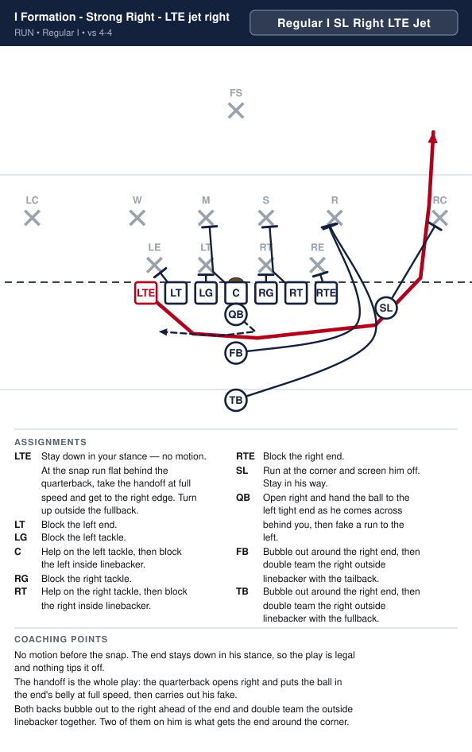

| Position | Assignment |
|---|---|
| **LTE** **(ball)** | Stay down in your stance — no motion. At the snap run flat behind the quarterback, take the handoff at full speed and get to the right edge. Turn up outside the fullback. |
| **LT** | Block the left end. |
| **LG** | Block the left tackle. |
| **C** | Help on the left tackle, then block the left inside linebacker. |
| **RG** | Block the right tackle. |
| **RT** | Help on the right tackle, then block the right inside linebacker. |
| **RTE** | Block the right end. |
| **SL** | Run at the corner and screen him off. Stay in his way. |
| **QB** | Open right and hand the ball to the left tight end as he comes across behind you, then fake a run to the left. |
| **FB** | Bubble out around the right end, then double team the right outside linebacker with the tailback. |
| **TB** | Bubble out around the right end, then double team the right outside linebacker with the fullback. |

**Coaching points**

- No motion before the snap. The end stays down in his stance, so the play is legal and nothing tips it off.
- The handoff is the whole play: the quarterback opens right and puts the ball in the end's belly at full speed, then carries out his fake.
- Both backs bubble out to the right ahead of the end and double team the outside linebacker together. Two of them on him is what gets the end around the corner.

---

## Regular I - Slot Left - RTE Jet

**Call it:** `Regular I Slot Left RTE Jet`

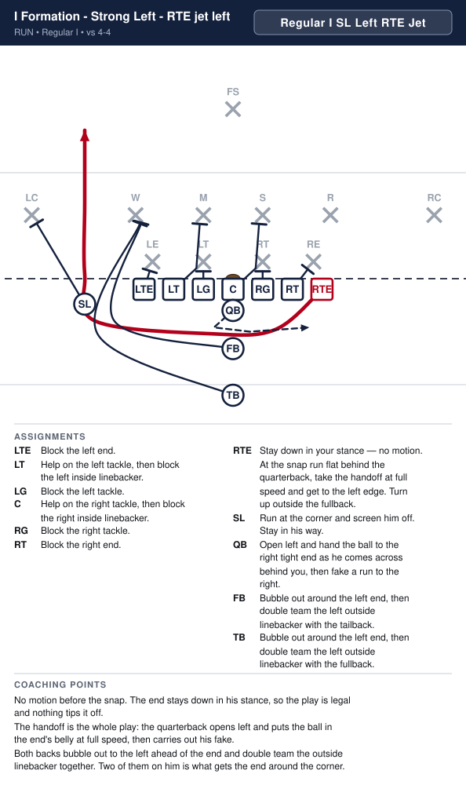

| Position | Assignment |
|---|---|
| **LTE** | Block the left end. |
| **LT** | Help on the left tackle, then block the left inside linebacker. |
| **LG** | Block the left tackle. |
| **C** | Help on the right tackle, then block the right inside linebacker. |
| **RG** | Block the right tackle. |
| **RT** | Block the right end. |
| **RTE** **(ball)** | Stay down in your stance — no motion. At the snap run flat behind the quarterback, take the handoff at full speed and get to the left edge. Turn up outside the fullback. |
| **SL** | Run at the corner and screen him off. Stay in his way. |
| **QB** | Open left and hand the ball to the right tight end as he comes across behind you, then fake a run to the right. |
| **FB** | Bubble out around the left end, then double team the left outside linebacker with the tailback. |
| **TB** | Bubble out around the left end, then double team the left outside linebacker with the fullback. |

**Coaching points**

- No motion before the snap. The end stays down in his stance, so the play is legal and nothing tips it off.
- The handoff is the whole play: the quarterback opens left and puts the ball in the end's belly at full speed, then carries out his fake.
- Both backs bubble out to the left ahead of the end and double team the outside linebacker together. Two of them on him is what gets the end around the corner.

---

## Regular I - Slot Right - 49 Jet

**Call it:** `Regular I Slot Right 49 Jet`

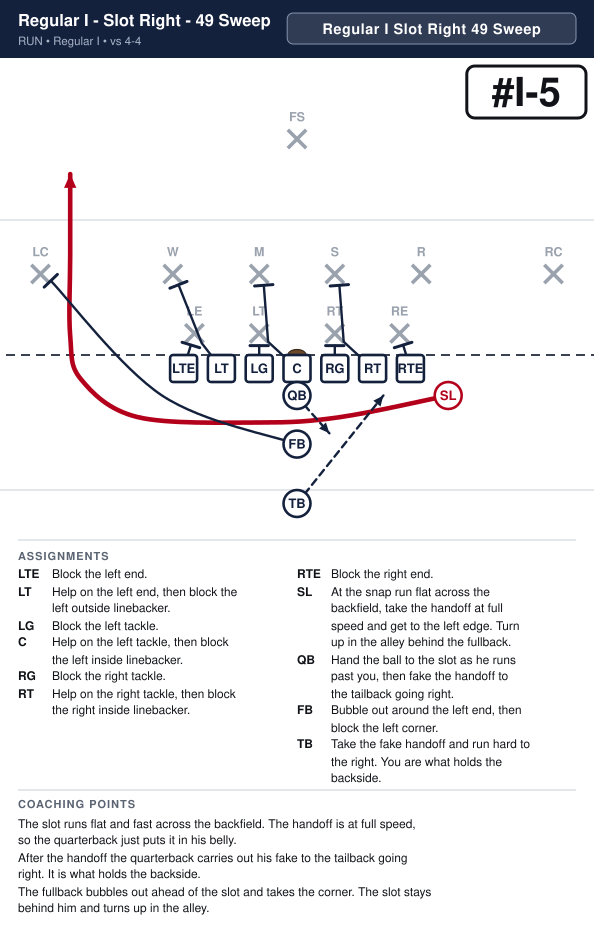

| Position | Assignment |
|---|---|
| **LTE** | Block the left end. |
| **LT** | Help on the left end, then block the left outside linebacker. |
| **LG** | Block the left tackle. |
| **C** | Help on the left tackle, then block the left inside linebacker. |
| **RG** | Block the right tackle. |
| **RT** | Help on the right tackle, then block the right inside linebacker. |
| **RTE** | Block the right end. |
| **SL** **(ball)** | At the snap run flat across the backfield, take the handoff at full speed and get to the left edge. Turn up in the alley behind the fullback. |
| **QB** | Hand the ball to the slot as he runs past you, then fake the handoff to the tailback going right. |
| **FB** | Bubble out around the left end, then block the left corner. |
| **TB** | Take the fake handoff and run hard to the right. You are what holds the backside. |

**Coaching points**

- The slot runs flat and fast across the backfield. The handoff is at full speed, so the quarterback just puts it in his belly.
- After the handoff the quarterback carries out his fake to the tailback going right. It is what holds the backside.
- The fullback bubbles out ahead of the slot and takes the corner. The slot stays behind him and turns up in the alley.

---

## Regular I - Slot Left - 48 Jet

**Call it:** `Regular I Slot Left 48 Jet`

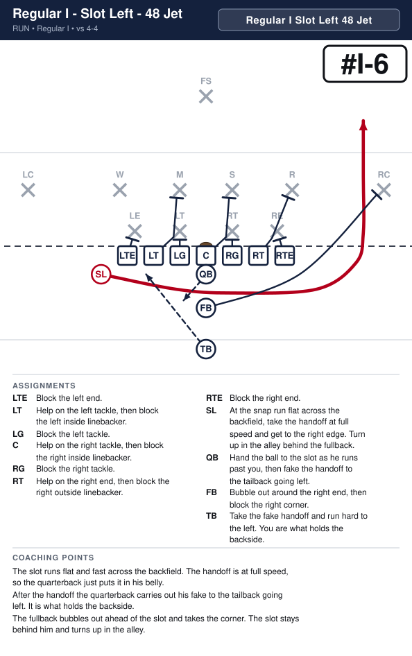

| Position | Assignment |
|---|---|
| **LTE** | Block the left end. |
| **LT** | Help on the left tackle, then block the left inside linebacker. |
| **LG** | Block the left tackle. |
| **C** | Help on the right tackle, then block the right inside linebacker. |
| **RG** | Block the right tackle. |
| **RT** | Help on the right end, then block the right outside linebacker. |
| **RTE** | Block the right end. |
| **SL** **(ball)** | At the snap run flat across the backfield, take the handoff at full speed and get to the right edge. Turn up in the alley behind the fullback. |
| **QB** | Hand the ball to the slot as he runs past you, then fake the handoff to the tailback going left. |
| **FB** | Bubble out around the right end, then block the right corner. |
| **TB** | Take the fake handoff and run hard to the left. You are what holds the backside. |

**Coaching points**

- The slot runs flat and fast across the backfield. The handoff is at full speed, so the quarterback just puts it in his belly.
- After the handoff the quarterback carries out his fake to the tailback going left. It is what holds the backside.
- The fullback bubbles out ahead of the slot and takes the corner. The slot stays behind him and turns up in the alley.

---

## Regular I - Slot Right - 30 Smash

**Call it:** `Regular I Slot Right 30 Smash`

| Position | Assignment |
|---|---|
| **LTE** | Block the left end. |
| **LT** | Block the left outside linebacker. |
| **LG** | Block the left tackle. |
| **C** | Help on the left tackle, then block the left inside linebacker. |
| **RG** | Block the right tackle. |
| **RT** | Block the right end. |
| **RTE** | Block the right outside linebacker. |
| **SL** | Block the right corner. |
| **QB** | Open right, hand to the tailback, then fake the boot left. It holds the backside end. |
| **FB** | Lead through the hole, then block the right inside linebacker. |
| **TB** **(ball)** | Take the handoff downhill between the center and the right guard, following the fullback. Do not bounce it. |

**Coaching points**

- This is the iso: the fullback smashes the linebacker in the hole, the tailback runs right off his hip.
- The hole is the A-gap — between the center and the right guard. If the tailback bounces, the play is dead.
- The fullback's man is whoever shows in that gap, not a man he picks before the snap.

---

## Regular I - Slot Left - 31 Smash

**Call it:** `Regular I Slot Left 31 Smash`

| Position | Assignment |
|---|---|
| **LTE** | Block the left outside linebacker. |
| **LT** | Block the left end. |
| **LG** | Block the left tackle. |
| **C** | Help on the right tackle, then block the right inside linebacker. |
| **RG** | Block the right tackle. |
| **RT** | Block the right outside linebacker. |
| **RTE** | Block the right end. |
| **SL** | Block the left corner. |
| **QB** | Open left, hand to the tailback, then fake the boot right. It holds the backside end. |
| **FB** | Lead through the hole, then block the left inside linebacker. |
| **TB** **(ball)** | Take the handoff downhill between the center and the left guard, following the fullback. Do not bounce it. |

**Coaching points**

- This is the iso: the fullback smashes the linebacker in the hole, the tailback runs right off his hip.
- The hole is the A-gap — between the center and the left guard. If the tailback bounces, the play is dead.
- The fullback's man is whoever shows in that gap, not a man he picks before the snap.

# Split Backs

---

## Split Backs - Slot Right - 38 Pitch

**Call it:** `Split Backs Slot Right 38 Pitch`

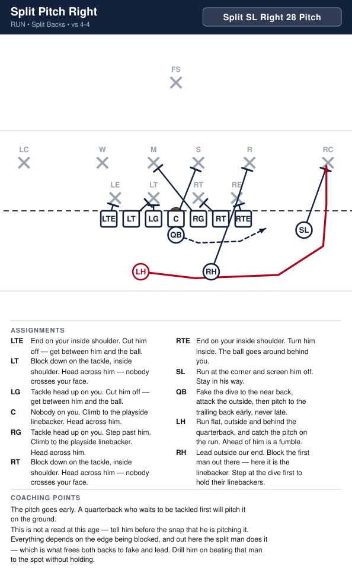

| Position | Assignment |
|---|---|
| **LTE** | Block the left end. |
| **LT** | Block the left inside linebacker. |
| **LG** | Block the left tackle. |
| **C** | Help on the right tackle, then block the right inside linebacker. |
| **RG** | Block the right tackle. |
| **RT** | Block the right inside linebacker. |
| **RTE** | Block the right end. |
| **SL** | Block the right corner. |
| **QB** | Quick pitch to the left halfback, then run the other way, to the left, like you still have it. |
| **LH** **(ball)** | Run flat, outside and behind the quarterback, and catch the pitch on the run. Ahead of him is a fumble. |
| **RH** | Bubble around the right tight end, then block the right outside linebacker. |

**Coaching points**

- The pitch goes early. A quarterback who waits to be tackled first will pitch it on the ground.
- This is not a read at this age — tell him before the snap that he is pitching it.
- Everything depends on the edge being blocked, and out here the split man does it — which is what frees both backs to fake and lead. Drill him on beating that man to the spot without holding.

---

## Split Backs - Slot Left - 29 Pitch

**Call it:** `Split Backs Slot Left 29 Pitch`

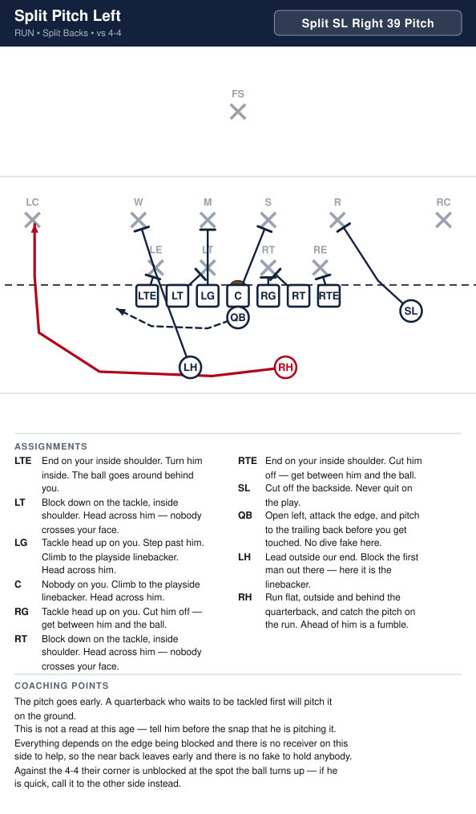

| Position | Assignment |
|---|---|
| **LTE** | Block the left end. |
| **LT** | Block the left inside linebacker. |
| **LG** | Block the left tackle. |
| **C** | Help on the left tackle, then block the left inside linebacker. |
| **RG** | Block the right tackle. |
| **RT** | Block the right inside linebacker. |
| **RTE** | Block the right end. |
| **SL** | Block the left corner. |
| **QB** | Quick pitch to the right halfback, then run the other way, to the right, like you still have it. |
| **LH** | Bubble around the left tight end, then block the left outside linebacker. |
| **RH** **(ball)** | Run flat, outside and behind the quarterback, and catch the pitch on the run. Ahead of him is a fumble. |

**Coaching points**

- The pitch goes early. A quarterback who waits to be tackled first will pitch it on the ground.
- This is not a read at this age — tell him before the snap that he is pitching it.
- Everything depends on the edge being blocked, and out here the split man does it — which is what frees both backs to fake and lead. Drill him on beating that man to the spot without holding.

---

## Split Backs - Slot Right - 18 Sweep

**Call it:** `Split Backs Slot Right 18 Sweep`

| Position | Assignment |
|---|---|
| **LTE** | End on your inside shoulder. Cut him off — get between him and the ball. |
| **LT** | Block down on the tackle, inside shoulder. Head across him — nobody crosses your face. |
| **LG** | Tackle head up on you. Cut him off — get between him and the ball. |
| **C** | Nobody on you. Climb to the playside linebacker. Head across him. |
| **RG** | Tackle head up on you. Step past him. Climb to the playside linebacker. Head across him. |
| **RT** | Block down on the tackle, inside shoulder. Head across him — nobody crosses your face. |
| **RTE** | End on your inside shoulder. Turn him inside. The ball goes around behind you. |
| **SL** | Run at the corner and screen him off. Stay in his way. |
| **QB** **(ball)** | Take the snap and sweep right, flat and fast, behind the right halfback. Turn up outside his block. |
| **LH** | Run hard to the left like you have the ball. Sell it all the way — you are the reason the defense goes the wrong way. |
| **RH** | Lead outside our end. Block the first man out there — here it is the linebacker. |

**Coaching points**

- The quarterback keeps it every time — tell him before the snap, there is no read.
- The left halfback's fake is the play. If he jogs, nobody follows him and the defense is waiting at the edge.
- The quarterback stays behind the right halfback until the block is made, then turns it up. Running past his blocker is how the sweep loses yards.

---

## Split Backs - Slot Left - 19 Sweep

**Call it:** `Split Backs Slot Left 19 Sweep`

| Position | Assignment |
|---|---|
| **LTE** | End on your inside shoulder. Turn him inside. The ball goes around behind you. |
| **LT** | Help on the left tackle, then block the left inside linebacker. |
| **LG** | Block the left tackle. |
| **C** | Help on the right tackle, then block the right inside linebacker. |
| **RG** | Block the right tackle. |
| **RT** | Help on the right end, then block the right outside linebacker. |
| **RTE** | Block the right end. |
| **SL** | Run at the corner and screen him off. Stay in his way. |
| **QB** **(ball)** | Take the snap and sweep left, flat and fast, behind the left halfback. Turn up outside his block. |
| **LH** | Bubble out around the left tight end, then block the left outside linebacker. |
| **RH** | Run hard to the right like you have the ball. Sell it all the way — you are the reason the defense goes the wrong way. |

**Coaching points**

- The quarterback keeps it every time — tell him before the snap, there is no read.
- The right halfback's fake is the play. If he jogs, nobody follows him and the defense is waiting at the edge.
- The quarterback stays behind the left halfback until the block is made, then turns it up. Running past his blocker is how the sweep loses yards.

---

## Split Backs - Slot Left - 19 Fake Sweep

**Call it:** `Split Backs Slot Left 19 Fake Sweep`

| Position | Assignment |
|---|---|
| **LTE** | End on your inside shoulder. Turn him inside. The ball goes around behind you. |
| **LT** | Help on the left tackle, then block the left inside linebacker. |
| **LG** | Block the left tackle. |
| **C** | Help on the right tackle, then block the right inside linebacker. |
| **RG** | Block the right tackle. |
| **RT** | Help on the right end, then block the right outside linebacker. |
| **RTE** | Block the right end. |
| **SL** | Run at the corner and screen him off. Stay in his way. |
| **QB** **(ball)** | Fake the handoff to the right halfback, then roll back left and sweep it, flat and fast, behind the left halfback. Turn up outside his block. |
| **LH** | Bubble out around the left tight end, then block the left outside linebacker. |
| **RH** | Take the fake from the quarterback and run hard to the right like you have the ball. Sell it all the way — you are the reason the defense goes the wrong way. |

**Coaching points**

- The fake has to look real: the quarterback puts the ball at the right halfback's belly and pulls it back out.
- The right halfback's fake is the play. If he jogs, nobody follows him and the defense is waiting on the left.
- After the fake the quarterback gets back to the left fast, stays behind the left halfback until the block is made, then turns it up.

---

## Split Backs - Slot Right - 18 Fake Sweep

**Call it:** `Split Backs Slot Right 18 Fake Sweep`

| Position | Assignment |
|---|---|
| **LTE** | Block the left end. |
| **LT** | Help on the left end, then block the left outside linebacker. |
| **LG** | Block the left tackle. |
| **C** | Help on the left tackle, then block the left inside linebacker. |
| **RG** | Block the right tackle. |
| **RT** | Help on the right tackle, then block the right inside linebacker. |
| **RTE** | End on your inside shoulder. Turn him inside. The ball goes around behind you. |
| **SL** | Run at the corner and screen him off. Stay in his way. |
| **QB** **(ball)** | Fake the handoff to the left halfback, then roll back right and sweep it, flat and fast, behind the right halfback. Turn up outside his block. |
| **LH** | Take the fake from the quarterback and run hard to the left like you have the ball. Sell it all the way — you are the reason the defense goes the wrong way. |
| **RH** | Bubble out around the right tight end, then block the right outside linebacker. |

**Coaching points**

- The fake has to look real: the quarterback puts the ball at the left halfback's belly and pulls it back out.
- The left halfback's fake is the play. If he jogs, nobody follows him and the defense is waiting on the right.
- After the fake the quarterback gets back to the right fast, stays behind the right halfback until the block is made, then turns it up.

---

## Split Backs - Slot Right - 49 Jet

**Call it:** `Split Backs Slot Right 49 Jet`

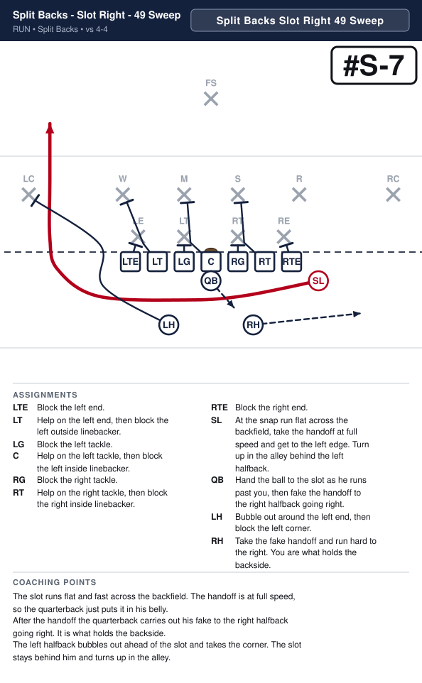

| Position | Assignment |
|---|---|
| **LTE** | Block the left end. |
| **LT** | Help on the left end, then block the left outside linebacker. |
| **LG** | Block the left tackle. |
| **C** | Help on the left tackle, then block the left inside linebacker. |
| **RG** | Block the right tackle. |
| **RT** | Help on the right tackle, then block the right inside linebacker. |
| **RTE** | Block the right end. |
| **SL** **(ball)** | At the snap run flat across the backfield, take the handoff at full speed and get to the left edge. Turn up in the alley behind the left halfback. |
| **QB** | Hand the ball to the slot as he runs past you, then fake the handoff to the right halfback going right. |
| **LH** | Bubble out around the left end, then block the left corner. |
| **RH** | Take the fake handoff and run hard to the right. You are what holds the backside. |

**Coaching points**

- The slot runs flat and fast across the backfield. The handoff is at full speed, so the quarterback just puts it in his belly.
- After the handoff the quarterback carries out his fake to the right halfback going right. It is what holds the backside.
- The left halfback bubbles out ahead of the slot and takes the corner. The slot stays behind him and turns up in the alley.

---

## Split Backs - Slot Left - 48 Jet

**Call it:** `Split Backs Slot Left 48 Jet`

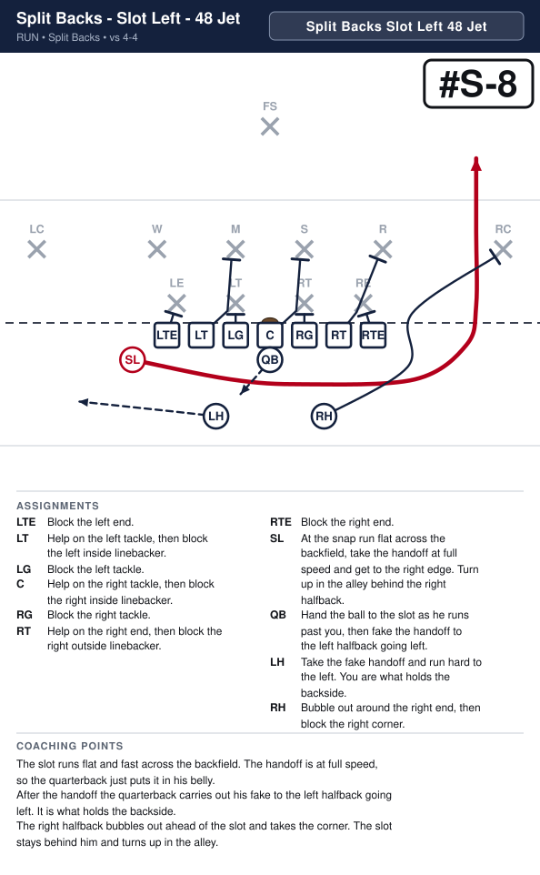

| Position | Assignment |
|---|---|
| **LTE** | Block the left end. |
| **LT** | Help on the left tackle, then block the left inside linebacker. |
| **LG** | Block the left tackle. |
| **C** | Help on the right tackle, then block the right inside linebacker. |
| **RG** | Block the right tackle. |
| **RT** | Help on the right end, then block the right outside linebacker. |
| **RTE** | Block the right end. |
| **SL** **(ball)** | At the snap run flat across the backfield, take the handoff at full speed and get to the right edge. Turn up in the alley behind the right halfback. |
| **QB** | Hand the ball to the slot as he runs past you, then fake the handoff to the left halfback going left. |
| **LH** | Take the fake handoff and run hard to the left. You are what holds the backside. |
| **RH** | Bubble out around the right end, then block the right corner. |

**Coaching points**

- The slot runs flat and fast across the backfield. The handoff is at full speed, so the quarterback just puts it in his belly.
- After the handoff the quarterback carries out his fake to the left halfback going left. It is what holds the backside.
- The right halfback bubbles out ahead of the slot and takes the corner. The slot stays behind him and turns up in the alley.

---

## Split Backs - Slot Right - LTE Jet

**Call it:** `Split Backs Slot Right LTE Jet`

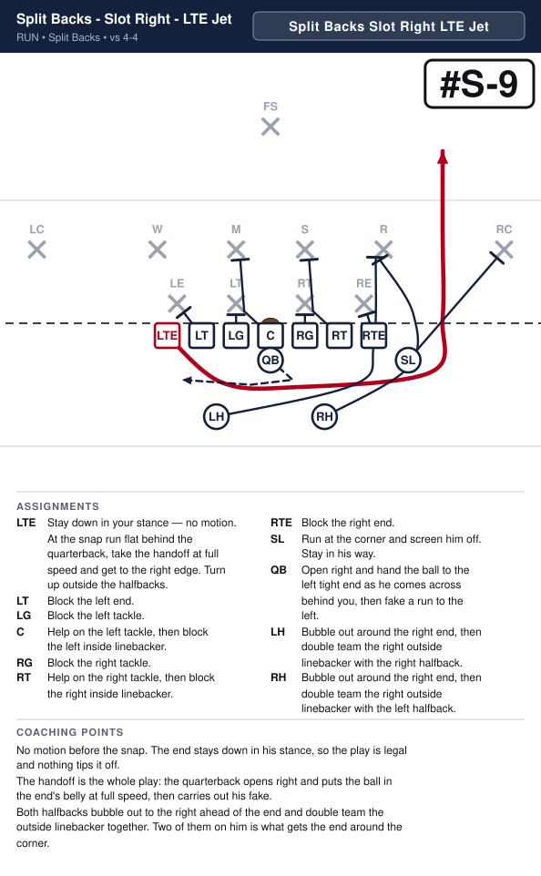

| Position | Assignment |
|---|---|
| **LTE** **(ball)** | Stay down in your stance — no motion. At the snap run flat behind the quarterback, take the handoff at full speed and get to the right edge. Turn up outside the halfbacks. |
| **LT** | Block the left end. |
| **LG** | Block the left tackle. |
| **C** | Help on the left tackle, then block the left inside linebacker. |
| **RG** | Block the right tackle. |
| **RT** | Help on the right tackle, then block the right inside linebacker. |
| **RTE** | Block the right end. |
| **SL** | Run at the corner and screen him off. Stay in his way. |
| **QB** | Open right and hand the ball to the left tight end as he comes across behind you, then fake a run to the left. |
| **LH** | Bubble out around the right end, then double team the right outside linebacker with the right halfback. |
| **RH** | Bubble out around the right end, then double team the right outside linebacker with the left halfback. |

**Coaching points**

- No motion before the snap. The end stays down in his stance, so the play is legal and nothing tips it off.
- The handoff is the whole play: the quarterback opens right and puts the ball in the end's belly at full speed, then carries out his fake.
- Both halfbacks bubble out to the right ahead of the end and double team the outside linebacker together. Two of them on him is what gets the end around the corner.

---

## Split Backs - Slot Left - RTE Jet

**Call it:** `Split Backs Slot Left RTE Jet`

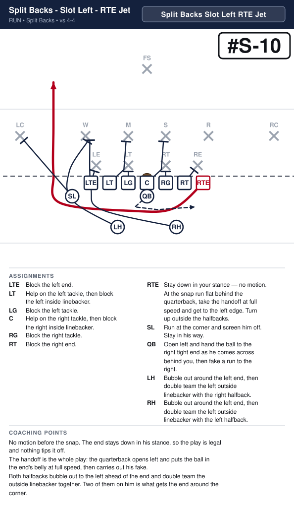

| Position | Assignment |
|---|---|
| **LTE** | Block the left end. |
| **LT** | Help on the left tackle, then block the left inside linebacker. |
| **LG** | Block the left tackle. |
| **C** | Help on the right tackle, then block the right inside linebacker. |
| **RG** | Block the right tackle. |
| **RT** | Block the right end. |
| **RTE** **(ball)** | Stay down in your stance — no motion. At the snap run flat behind the quarterback, take the handoff at full speed and get to the left edge. Turn up outside the halfbacks. |
| **SL** | Run at the corner and screen him off. Stay in his way. |
| **QB** | Open left and hand the ball to the right tight end as he comes across behind you, then fake a run to the right. |
| **LH** | Bubble out around the left end, then double team the left outside linebacker with the right halfback. |
| **RH** | Bubble out around the left end, then double team the left outside linebacker with the left halfback. |

**Coaching points**

- No motion before the snap. The end stays down in his stance, so the play is legal and nothing tips it off.
- The handoff is the whole play: the quarterback opens left and puts the ball in the end's belly at full speed, then carries out his fake.
- Both halfbacks bubble out to the left ahead of the end and double team the outside linebacker together. Two of them on him is what gets the end around the corner.

# Shotgun

---

## Shotgun - Slot Right - RTE Slant Out

**Call it:** `Shotgun Slot Right RTE Slant Out`

| Position | Assignment |
|---|---|
| **LTE** | Pass block: step back, hands up, and stay between your man and the quarterback. |
| **LT** | Pass block: step back, hands up, and stay between your man and the quarterback. |
| **LG** | Pass block: step back, hands up, and stay between your man and the quarterback. |
| **C** | Pass block: step back, hands up, and stay between your man and the quarterback. |
| **RG** | Pass block: step back, hands up, and stay between your man and the quarterback. |
| **RT** | Pass block: step back, hands up, and stay between your man and the quarterback. |
| **RTE** **(ball)** | Take one step up, then slant out flat toward the right sideline, almost along the line of scrimmage. Look for the ball right away. |
| **SL** | Block the right corner. |
| **QB** | Catch the snap, take one step and throw to the right tight end as he slants out. If he is covered, tuck it and run. |
| **LH** | Step up and out, hands up. Pick up anybody coming at the quarterback. |
| **RH** | Step up and out, hands up. Pick up anybody coming at the quarterback. |

**Coaching points**

- Everybody but the tight end and the SL pass blocks: step back, hands up, stay between your man and the quarterback.
- The slant stays flat — one step up and out, almost on the line of scrimmage. Any deeper and he runs into the linebackers.
- The quarterback throws it as soon as the tight end clears the end. If he is covered, tuck it and run — no second look.

---

## Shotgun - Slot Left - LTE Slant Out

**Call it:** `Shotgun Slot Left LTE Slant Out`

| Position | Assignment |
|---|---|
| **LTE** **(ball)** | Take one step up, then slant out flat toward the left sideline, almost along the line of scrimmage. Look for the ball right away. |
| **LT** | Pass block: step back, hands up, and stay between your man and the quarterback. |
| **LG** | Pass block: step back, hands up, and stay between your man and the quarterback. |
| **C** | Pass block: step back, hands up, and stay between your man and the quarterback. |
| **RG** | Pass block: step back, hands up, and stay between your man and the quarterback. |
| **RT** | Pass block: step back, hands up, and stay between your man and the quarterback. |
| **RTE** | Pass block: step back, hands up, and stay between your man and the quarterback. |
| **SL** | Block the left corner. |
| **QB** | Catch the snap, take one step and throw to the left tight end as he slants out. If he is covered, tuck it and run. |
| **LH** | Step up and out, hands up. Pick up anybody coming at the quarterback. |
| **RH** | Step up and out, hands up. Pick up anybody coming at the quarterback. |

**Coaching points**

- Everybody but the tight end and the SL pass blocks: step back, hands up, stay between your man and the quarterback.
- The slant stays flat — one step up and out, almost on the line of scrimmage. Any deeper and he runs into the linebackers.
- The quarterback throws it as soon as the tight end clears the end. If he is covered, tuck it and run — no second look.

---

## Shotgun - Slot Left - 19 Sweep

**Call it:** `Shotgun Slot Left 19 Sweep`

| Position | Assignment |
|---|---|
| **LTE** | Block the left end. |
| **LT** | Help on the left tackle, then block the left inside linebacker. |
| **LG** | Block the left tackle. |
| **C** | Help on the right tackle, then block the right inside linebacker. |
| **RG** | Block the right tackle. |
| **RT** | Help on the right end, then block the right outside linebacker. |
| **RTE** | Block the right end. |
| **SL** | Run at the corner and screen him off. Stay in his way. |
| **QB** **(ball)** | Catch the snap and sweep left, flat and fast, behind the left halfback. Turn up outside his block. |
| **LH** | Bubble out around the left end, then block the left outside linebacker. |
| **RH** | Fake the handoff going right and run hard. Sell it all the way — you are the reason the defense goes the wrong way. |

**Coaching points**

- The quarterback keeps it every time — tell him before the snap, there is no read.
- The right halfback's fake is the play. If he jogs, nobody follows him and the defense is waiting at the edge.
- The quarterback stays behind the left halfback until the block is made, then turns it up. Running past his blocker is how the sweep loses yards.

---

## Shotgun - Slot Right - 18 Sweep

**Call it:** `Shotgun Slot Right 18 Sweep`

| Position | Assignment |
|---|---|
| **LTE** | Block the left end. |
| **LT** | Help on the left end, then block the left outside linebacker. |
| **LG** | Block the left tackle. |
| **C** | Help on the left tackle, then block the left inside linebacker. |
| **RG** | Block the right tackle. |
| **RT** | Help on the right tackle, then block the right inside linebacker. |
| **RTE** | Block the right end. |
| **SL** | Run at the corner and screen him off. Stay in his way. |
| **QB** **(ball)** | Catch the snap and sweep right, flat and fast, behind the right halfback. Turn up outside his block. |
| **LH** | Fake the handoff going left and run hard. Sell it all the way — you are the reason the defense goes the wrong way. |
| **RH** | Bubble out around the right end, then block the right outside linebacker. |

**Coaching points**

- The quarterback keeps it every time — tell him before the snap, there is no read.
- The left halfback's fake is the play. If he jogs, nobody follows him and the defense is waiting at the edge.
- The quarterback stays behind the right halfback until the block is made, then turns it up. Running past his blocker is how the sweep loses yards.

---

## Shotgun - Slot Right - 38 Sweep

**Call it:** `Shotgun Slot Right 38 Sweep`

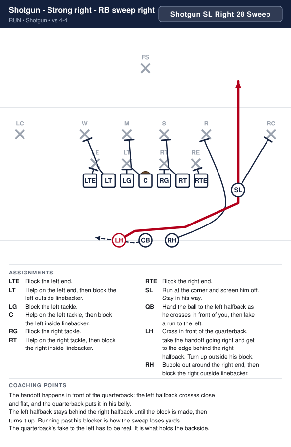

| Position | Assignment |
|---|---|
| **LTE** | Block the left end. |
| **LT** | Help on the left end, then block the left outside linebacker. |
| **LG** | Block the left tackle. |
| **C** | Help on the left tackle, then block the left inside linebacker. |
| **RG** | Block the right tackle. |
| **RT** | Help on the right tackle, then block the right inside linebacker. |
| **RTE** | Block the right end. |
| **SL** | Run at the corner and screen him off. Stay in his way. |
| **QB** | Hand the ball to the left halfback as he crosses in front of you, then fake a run to the left. |
| **LH** **(ball)** | Cross in front of the quarterback, take the handoff going right and get to the edge behind the right halfback. Turn up outside his block. |
| **RH** | Bubble out around the right end, then block the right outside linebacker. |

**Coaching points**

- The handoff happens in front of the quarterback: the left halfback crosses close and flat, and the quarterback puts it in his belly.
- The left halfback stays behind the right halfback until the block is made, then turns it up. Running past his blocker is how the sweep loses yards.
- The quarterback's fake to the left has to be real. It is what holds the backside.

---

## Shotgun - Slot Left - 29 Sweep

**Call it:** `Shotgun Slot Left 29 Sweep`

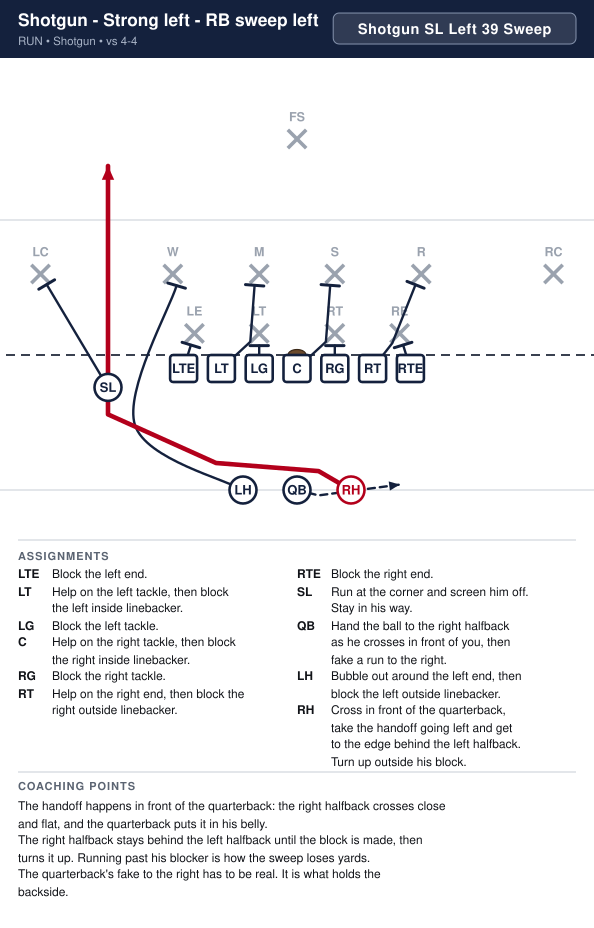

| Position | Assignment |
|---|---|
| **LTE** | Block the left end. |
| **LT** | Help on the left tackle, then block the left inside linebacker. |
| **LG** | Block the left tackle. |
| **C** | Help on the right tackle, then block the right inside linebacker. |
| **RG** | Block the right tackle. |
| **RT** | Help on the right end, then block the right outside linebacker. |
| **RTE** | Block the right end. |
| **SL** | Run at the corner and screen him off. Stay in his way. |
| **QB** | Hand the ball to the right halfback as he crosses in front of you, then fake a run to the right. |
| **LH** | Bubble out around the left end, then block the left outside linebacker. |
| **RH** **(ball)** | Cross in front of the quarterback, take the handoff going left and get to the edge behind the left halfback. Turn up outside his block. |

**Coaching points**

- The handoff happens in front of the quarterback: the right halfback crosses close and flat, and the quarterback puts it in his belly.
- The right halfback stays behind the left halfback until the block is made, then turns it up. Running past his blocker is how the sweep loses yards.
- The quarterback's fake to the right has to be real. It is what holds the backside.

