# Sayville 8U Playbook

_Generated by `generator/render.py`. Edit the JSON under `playbook/`, not this file._

Terminology and authoring rules: [playbook/CLAUDE.md](playbook/CLAUDE.md)

| # | Play | Call | Type | Formation | Ball |
|---|---|---|---|---|---|
| 1 | [Regular I Sneak Right](#regular-i-sneak-right) | `Regular I Z Right 10 Sneak` | run | Regular I | QB |
| 2 | [Regular I Sneak Left](#regular-i-sneak-left) | `Regular I Z Right 11 Sneak` | run | Regular I | QB |
| 3 | [Regular I Dive Right](#regular-i-dive-right) | `Regular I Z Right 20 Dive` | run | Regular I | FB |
| 4 | [Regular I Dive Left](#regular-i-dive-left) | `Regular I Z Right 21 Dive` | run | Regular I | FB |
| 5 | [Regular I Wedge Right](#regular-i-wedge-right) | `Regular I Z Right 30 Wedge` | run | Regular I | TB |
| 6 | [Regular I Wedge Left](#regular-i-wedge-left) | `Regular I Z Right 31 Wedge` | run | Regular I | TB |
| 7 | [Regular I Iso Right](#regular-i-iso-right) | `Regular I Z Right 32 Iso` | run | Regular I | TB |
| 8 | [Regular I Iso Left](#regular-i-iso-left) | `Regular I Z Right 33 Iso` | run | Regular I | TB |
| 9 | [Regular I Power Right](#regular-i-power-right) | `Regular I Z Right 34 Power` | run | Regular I | TB |
| 10 | [Regular I Power Left](#regular-i-power-left) | `Regular I Z Left 35 Power` | run | Regular I | TB |
| 11 | [Regular I Counter Right](#regular-i-counter-right) | `Regular I Z Right 34 Counter` | run | Regular I | TB |
| 12 | [Regular I Counter Left](#regular-i-counter-left) | `Regular I Z Right 35 Counter` | run | Regular I | TB |
| 13 | [Regular I Boot Right](#regular-i-boot-right) | `Regular I Z Right 16 Boot` | pass | Regular I | Z |
| 14 | [Regular I Boot Left](#regular-i-boot-left) | `Regular I Z Right 17 Boot` | pass | Regular I | LTE |
| 15 | [Regular I Waggle Right](#regular-i-waggle-right) | `Regular I Z Right 16 Waggle` | pass | Regular I | RTE |
| 16 | [Regular I Waggle Left](#regular-i-waggle-left) | `Regular I Z Right 17 Waggle` | pass | Regular I | LTE |
| 17 | [Regular I Jet Boot Right](#regular-i-jet-boot-right) | `Regular I Z Right 16 Jet Boot` | pass | Regular I | RTE |
| 18 | [Regular I Jet Boot Left](#regular-i-jet-boot-left) | `Regular I Z Right 17 Jet Boot` | pass | Regular I | LTE |
| 19 | [Regular I Power Boot Right](#regular-i-power-boot-right) | `Regular I Z Right 16 Power Boot` | pass | Regular I | RTE |
| 20 | [Regular I Power Boot Left](#regular-i-power-boot-left) | `Regular I Z Right 17 Power Boot` | pass | Regular I | LTE |
| 21 | [Regular I Slant Right](#regular-i-slant-right) | `Regular I Z Right 36 Slant` | run | Regular I | TB |
| 22 | [Regular I Slant Left](#regular-i-slant-left) | `Regular I Z Right 37 Slant` | run | Regular I | TB |
| 23 | [Regular I Toss Right](#regular-i-toss-right) | `Regular I Z Right 38 Toss` | run | Regular I | TB |
| 24 | [Regular I Toss Left](#regular-i-toss-left) | `Regular I Z Right 39 Toss` | run | Regular I | TB |
| 25 | [Regular I Jet Right](#regular-i-jet-right) | `Regular I Z Right 48 Jet` | run | Regular I | Z |
| 26 | [Regular I Jet Left](#regular-i-jet-left) | `Regular I Z Right 49 Jet` | run | Regular I | Z |
| 27 | [Power I Power Right](#power-i-power-right) | `Power I Right 34 Power` | run | Power I | TB |
| 28 | [Power I Power Left](#power-i-power-left) | `Power I Left 35 Power` | run | Power I | TB |
| 29 | [Power I Counter Right](#power-i-counter-right) | `Power I Left 34 Counter` | run | Power I | TB |
| 30 | [Power I Counter Left](#power-i-counter-left) | `Power I Right 35 Counter` | run | Power I | TB |
| 31 | [Power I Z Power Right](#power-i-z-power-right) | `Power I Left 46 Power` | run | Power I | Z |
| 32 | [Power I Z Power Left](#power-i-z-power-left) | `Power I Right 45 Power` | run | Power I | Z |
| 33 | [Power I Toss Right](#power-i-toss-right) | `Power I Right 38 Toss` | run | Power I | TB |
| 34 | [Power I Toss Left](#power-i-toss-left) | `Power I Left 39 Toss` | run | Power I | TB |
| 35 | [Split Dive Right](#split-dive-right) | `Split Z Right 30 Dive` | run | Split Backs | RH |
| 36 | [Split Dive Left](#split-dive-left) | `Split Z Right 21 Dive` | run | Split Backs | LH |
| 37 | [Split Power Right](#split-power-right) | `Split Z Right 24 Power` | run | Split Backs | LH |
| 38 | [Split Power Left](#split-power-left) | `Split Z Right 35 Power` | run | Split Backs | RH |
| 39 | [Split Counter Right](#split-counter-right) | `Split Z Right 24 Counter` | run | Split Backs | LH |
| 40 | [Split Counter Left](#split-counter-left) | `Split Z Right 35 Counter` | run | Split Backs | RH |
| 41 | [Split Waggle Right](#split-waggle-right) | `Split Z Right 16 Waggle` | pass | Split Backs | RTE |
| 42 | [Split Waggle Left](#split-waggle-left) | `Split Z Right 17 Waggle` | pass | Split Backs | LTE |
| 43 | [Split Pitch Right](#split-pitch-right) | `Split Z Right 28 Pitch` | run | Split Backs | LH |
| 44 | [Split Pitch Left](#split-pitch-left) | `Split Z Right 39 Pitch` | run | Split Backs | RH |
| 45 | [Split QB Keep Right](#split-qb-keep-right) | `Split Z Right 16 Keep` | run | Split Backs | QB |
| 46 | [Split QB Keep Left](#split-qb-keep-left) | `Split Z Left 17 Keep` | run | Split Backs | QB |
| 47 | [Split Z Left Z Reverse Right](#split-z-left-z-reverse-right) | `Split Z Left 46 Z Reverse Right` | run | Split Backs | Z |
| 48 | [Split Z Right Z Reverse Left](#split-z-right-z-reverse-left) | `Split Z Right 47 Z Reverse Left` | run | Split Backs | Z |
| 49 | [House Dive Right](#house-dive-right) | `House 20 Dive` | run | Full House | FB |
| 50 | [House Dive Left](#house-dive-left) | `House 41 Dive` | run | Full House | Z |
| 51 | [House Power Right](#house-power-right) | `House 34 Power` | run | Full House | TB |
| 52 | [House Power Left](#house-power-left) | `House 35 Power` | run | Full House | TB |
| 53 | [House Boot Right](#house-boot-right) | `House 16 Boot` | pass | Full House | RTE |
| 54 | [House Boot Left](#house-boot-left) | `House 17 Boot` | pass | Full House | LTE |
| 55 | [House Sweep Right](#house-sweep-right) | `House 38 Sweep` | run | Full House | TB |
| 56 | [House Sweep Left](#house-sweep-left) | `House 39 Sweep` | run | Full House | TB |

# Regular I

---

## Regular I Sneak Right

**Call it:** `Regular I Z Right 10 Sneak`

Fourth and inches. The quarterback keeps it behind the center's playside hip before the defense has come out of its stance. No handoff to go wrong and no back to get tackled in the backfield.

| Position | Assignment |
|---|---|
| **LTE** | Close down inside and push. Nobody gets penetration through your gap. |
| **LT** | Close down inside and push. Nobody gets penetration through your gap. |
| **LG** | Squeeze down on the center and drive. Your shoulder does not leave his. |
| **C** | Snap it and come straight off the ball into the nose with your pads under his. Get movement — one yard is all we need and it comes from you. |
| **RG** | Squeeze down on the center and drive. Your shoulder does not leave his — the quarterback is coming right behind it. |
| **RT** | Close down inside and push. Nobody gets penetration through your gap. |
| **RTE** | Close down inside and push. Nobody gets penetration through your gap. |
| **Z** | Release straight downfield and run the corner off. You will not get the ball — take his eyes with you so he never looks in. |
| **QB** **(ball)** | Snap it and go now, right behind the outside hip of the guard on the Z side. Low pads, ball in both arms, fall forward. Do not stand up and do not look for a hole. |
| **FB** | Fire straight ahead into the back of the pile and push. Both hands on whoever is in front of you. |
| **TB** | Come downhill behind the fullback and push the pile. If the ball comes loose you are the closest man to it. |

**Coaching points**

- This is a one-yard play. Do not call it needing two.
- The snap count is the whole play. If they know it is coming they still cannot stop it, but only if we go on the first sound and they do not.
- Drawn against the 6-3 because that is the heaviest front the league allows and it is exactly what you will see on fourth and one.
- Teach the quarterback to fall forward the moment he feels contact. Eight-year-olds try to spin and lose the yard they already had.
- It is legal for us in 11-man play. It is specifically prohibited in the 8-man Rookie division, so if we ever end up there this play comes straight out of the book.

---

## Regular I Sneak Left

**Call it:** `Regular I Z Right 11 Sneak`

Fourth and inches. The quarterback keeps it behind the center's playside hip before the defense has come out of its stance. No handoff to go wrong and no back to get tackled in the backfield.

| Position | Assignment |
|---|---|
| **LTE** | Close down inside and push. Nobody gets penetration through your gap. |
| **LT** | Close down inside and push. Nobody gets penetration through your gap. |
| **LG** | Squeeze down on the center and drive. Your shoulder does not leave his — the quarterback is coming left behind it. |
| **C** | Snap it and come straight off the ball into the nose with your pads under his. Get movement — one yard is all we need and it comes from you. |
| **RG** | Squeeze down on the center and drive. Your shoulder does not leave his. |
| **RT** | Close down inside and push. Nobody gets penetration through your gap. |
| **RTE** | Close down inside and push. Nobody gets penetration through your gap. |
| **Z** | Release straight downfield and run the corner off. You will not get the ball — take his eyes with you so he never looks in. |
| **QB** **(ball)** | Snap it and go now, right behind the outside hip of the guard away from the Z. Low pads, ball in both arms, fall forward. Do not stand up and do not look for a hole. |
| **FB** | Fire straight ahead into the back of the pile and push. Both hands on whoever is in front of you. |
| **TB** | Come downhill behind the fullback and push the pile. If the ball comes loose you are the closest man to it. |

**Coaching points**

- This is a one-yard play. Do not call it needing two.
- The snap count is the whole play. If they know it is coming they still cannot stop it, but only if we go on the first sound and they do not.
- Drawn against the 6-3 because that is the heaviest front the league allows and it is exactly what you will see on fourth and one.
- Teach the quarterback to fall forward the moment he feels contact. Eight-year-olds try to spin and lose the yard they already had.
- It is legal for us in 11-man play. It is specifically prohibited in the 8-man Rookie division, so if we ever end up there this play comes straight out of the book.

---

## Regular I Dive Right

**Call it:** `Regular I Z Right 20 Dive`

The quickest handoff in the book. The fullback is through the line before their linebackers have read anything. We run it to remind them the middle is not free, which is what makes the toss work later.

| Position | Assignment |
|---|---|
| **LTE** | Cut off pursuit from behind. You are the last one to the ball, so never quit on the play. |
| **LT** | The tackle is on your inside shoulder. Get your head across him and wall him off so he cannot chase. |
| **LG** | Nobody is over you. Step back inside and cut off anyone chasing through the middle. |
| **C** | You and the playside guard double the nose. Drive him off the spot — the hole is right off his back. |
| **RG** | Nobody is over you. Double the nose with the center, and come off onto the middle linebacker when he shows. |
| **RT** | The tackle is on your inside shoulder. Block him down and seal him inside — that is what opens the hole. |
| **RTE** | The end is head up on you. Drive him out and away from the ball. |
| **Z** | Release and screen the corner on your side. Get in his way and stay there. |
| **QB** | Take the snap, open a quarter turn and hand to the fullback at two yards. Then carry out a fake to the outside. |
| **FB** **(ball)** | Aim at the outside hip of the center, right off the double team. Take the ball and get north — no reading, no dancing. |
| **TB** | Run the toss path outside and sell it. You will not get the ball on this play. |

**Coaching points**

- Snap to handoff should be under a second. If the fullback is waiting on the ball, the play is already dead.
- Best call when their linebackers start cheating wide to stop the toss.
- The fullback runs at a spot, not at a defender. Give him the outside hip of the center and let him go.
- Best short-yardage call in the book. Nobody has to read anything and the ball is over the line before the defense moves.

---

## Regular I Dive Left

**Call it:** `Regular I Z Right 21 Dive`

The same quick handoff through the other A gap. Worth having both so the fullback is not always going to the same side of the center — once their middle linebacker knows which way the dive hits, it stops being quick.

| Position | Assignment |
|---|---|
| **LTE** | The end is head up on you. Drive him out and away from the ball. |
| **LT** | The tackle is on your inside shoulder. Block him down and seal him inside — that is what opens the hole. |
| **LG** | Nobody is over you. Double the nose with the center, and come off onto the middle linebacker when he shows. |
| **C** | You and the playside guard double the nose. Drive him off the spot — the hole is right off his back. |
| **RG** | Nobody is over you. Step back inside and cut off anyone chasing through the middle. |
| **RT** | The tackle is on your inside shoulder. Get your head across him and wall him off so he cannot chase. |
| **RTE** | Cut off pursuit from behind. You are the last one to the ball, so never quit on the play. |
| **Z** | Come across behind the line and cut off the corner chasing from the backside. |
| **QB** | Take the snap, open a quarter turn and hand to the fullback at two yards. Then carry out a fake to the outside. |
| **FB** **(ball)** | Aim at the outside hip of the center, right off the double team. Take the ball and get north — no reading, no dancing. |
| **TB** | Run the toss path outside and sell it. You will not get the ball on this play. |

**Coaching points**

- Snap to handoff should be under a second. If the fullback is waiting on the ball, the play is already dead.
- Run it the same week you install the right-hand one. The whole value of having both is that their middle linebacker cannot lean.
- The fullback runs at a spot, not at a defender. Give him the outside hip of the center and let him go.
- The Z is away from the play here, so he has further to travel to cut off the backside. He leaves on the snap.

---

## Regular I Wedge Right

**Call it:** `Regular I Z Right 30 Wedge`

Short yardage and the goal line. Nobody blocks a man — the whole line squeezes shoulder to shoulder on the center and pushes. The tailback puts a hand on the center's back and goes wherever the pile goes.

| Position | Assignment |
|---|---|
| **LTE** | Close down hard to the man beside you until your shoulder touches his. Push straight ahead. Never look for someone to block. |
| **LT** | Close down hard to the man beside you until your shoulder touches his. Push straight ahead. Never look for someone to block. |
| **LG** | Close down hard on the center until your shoulder touches his. Low pads, short steps, push. |
| **C** | Snap it and fire straight into the nose with your pads under his. You are the tip of the wedge — everybody else comes to you. |
| **RG** | Close down hard on the center until your shoulder touches his. Low pads, short steps, push. |
| **RT** | Close down hard to the man beside you until your shoulder touches his. Push straight ahead. Never look for someone to block. |
| **RTE** | Close down hard to the man beside you until your shoulder touches his. Push straight ahead. Never look for someone to block. |
| **Z** | Tuck in tight behind the right end and seal the edge. Nobody comes around the outside and into the back of the wedge. |
| **QB** | Snap, hand it to the tailback right now, and stay out of his way. Do not ride the handoff — he is already moving. |
| **FB** | Get in behind the wedge and push the tailback. Both hands on his back, legs driving. |
| **TB** **(ball)** | Put a hand on the center's back, get your pads low, and follow the wedge. Do not cut, do not bounce, do not look for a hole — the hole moves with you. |

**Coaching points**

- Two yards is a good wedge. Do not call it needing four.
- It is drawn against the 6-3 because that is the heaviest front the league allows and it is what you will see inside the five.
- Nothing in the league rulebook prohibits wedge blocking for 11-man play, but it is the first thing leagues take away. Re-check it every season before you install it.
- Coach the shoulders, not the feet. If there is daylight between two linemen the wedge is a line of five men getting pushed backwards instead of one thing moving forward.
- Low pads win this and nothing else does. The team that stands up loses.

---

## Regular I Wedge Left

**Call it:** `Regular I Z Right 31 Wedge`

Short yardage and the goal line. Nobody blocks a man — the whole line squeezes shoulder to shoulder on the center and pushes. The tailback puts a hand on the center's back and goes wherever the pile goes.

| Position | Assignment |
|---|---|
| **LTE** | Close down hard to the man beside you until your shoulder touches his. Push straight ahead. Never look for someone to block. |
| **LT** | Close down hard to the man beside you until your shoulder touches his. Push straight ahead. Never look for someone to block. |
| **LG** | Close down hard on the center until your shoulder touches his. Low pads, short steps, push. |
| **C** | Snap it and fire straight into the nose with your pads under his. You are the tip of the wedge — everybody else comes to you. |
| **RG** | Close down hard on the center until your shoulder touches his. Low pads, short steps, push. |
| **RT** | Close down hard to the man beside you until your shoulder touches his. Push straight ahead. Never look for someone to block. |
| **RTE** | Close down hard to the man beside you until your shoulder touches his. Push straight ahead. Never look for someone to block. |
| **Z** | Tuck in tight behind the right end and seal the edge. Nobody comes around the outside and into the back of the wedge. |
| **QB** | Snap, hand it to the tailback left now, and stay out of his way. Do not ride the handoff — he is already moving. |
| **FB** | Get in behind the wedge and push the tailback. Both hands on his back, legs driving. |
| **TB** **(ball)** | Put a hand on the center's back, get your pads low, and follow the wedge. Do not cut, do not bounce, do not look for a hole — the hole moves with you. |

**Coaching points**

- Two yards is a good wedge. Do not call it needing four.
- It is drawn against the 6-3 because that is the heaviest front the league allows and it is what you will see inside the five.
- Nothing in the league rulebook prohibits wedge blocking for 11-man play, but it is the first thing leagues take away. Re-check it every season before you install it.
- Coach the shoulders, not the feet. If there is daylight between two linemen the wedge is a line of five men getting pushed backwards instead of one thing moving forward.
- Low pads win this and nothing else does. The team that stands up loses.

---

## Regular I Iso Right

**Call it:** `Regular I Z Right 32 Iso`

The whole play is one block: the fullback isolates their linebacker in the hole and the tailback runs off whichever way that block goes. It teaches a back to read a block, which is the skill this formation is here to build.

| Position | Assignment |
|---|---|
| **LTE** | Cut off pursuit from behind. You are the last one to the ball, so never quit on the play. |
| **LT** | The tackle is on your inside shoulder. Get your head across him and wall him off so he cannot chase. |
| **LG** | Nobody is over you. Step back inside and cut off anyone chasing through the middle. |
| **C** | You have the nose, head up on you. Hands inside and do not let him cross your face to the playside. |
| **RG** | The tackle sits in the gap outside you. You and our tackle double him — hands inside, drive him backwards. |
| **RT** | Double the tackle on your inside shoulder with the guard. Drive him back, and if the middle linebacker runs through, the guard comes off onto him. |
| **RTE** | The end is head up on you. Drive him out and widen the hole. |
| **Z** | Release and screen the corner on your side. Get in his way and stay there. |
| **QB** | Reverse pivot and hand the ball to the tailback at four yards. Then clear out and fake wide. |
| **FB** | Lead through the hole and put your facemask on the linebacker sitting over the double team. Move him any direction — just move him. |
| **TB** **(ball)** | Take the handoff at four yards, get downhill behind the fullback, and cut off his block. If he takes the linebacker outside, you go inside. |

**Coaching points**

- Drill the fullback's block by itself with a bag. He does not have to win — he has to make the linebacker pick a side.
- Teach the tailback one rule: cut off the fullback's back. Do not let him decide before he gets there.
- If their linebacker is faster than our fullback, stop calling this and run I Slant instead.
- The tailback should be running downhill at the hole, not sideways looking for one.

---

## Regular I Iso Left

**Call it:** `Regular I Z Right 33 Iso`

The same isolation block the other way. The Z stays where he is, so this runs away from our strength — which is exactly why it is open.

| Position | Assignment |
|---|---|
| **LTE** | The end is head up on you. Drive him out and widen the hole. |
| **LT** | Double the tackle on your inside shoulder with the guard. Drive him back, and if the middle linebacker runs through, the guard comes off onto him. |
| **LG** | The tackle sits in the gap outside you. You and our tackle double him — hands inside, drive him backwards. |
| **C** | You have the nose, head up on you. Hands inside and do not let him cross your face to the playside. |
| **RG** | Nobody is over you. Step back inside and cut off anyone chasing through the middle. |
| **RT** | The tackle is on your inside shoulder. Get your head across him and wall him off so he cannot chase. |
| **RTE** | Cut off pursuit from behind. You are the last one to the ball, so never quit on the play. |
| **Z** | Come across behind the line and cut off anybody chasing from the backside. |
| **QB** | Reverse pivot and hand the ball to the tailback at four yards. Then clear out and fake wide. |
| **FB** | Lead through the hole and put your facemask on the linebacker sitting over the double team. Move him any direction — just move him. |
| **TB** **(ball)** | Take the handoff at four yards, get downhill behind the fullback, and cut off his block. |

**Coaching points**

- Running away from the Z means one fewer blocker out there, so the tailback has to get north fast.
- Their defense will usually shade toward our Z. That is the reason this play exists — check it before you call it.
- Same block, same read as I Iso Right. Do not teach it as a new play, teach it as the same play flipped.

---

## Regular I Power Right

**Call it:** `Regular I Z Right 34 Power`

Our best downhill run. Everybody blocks down to the inside, the Z kicks the end out, and the backside guard pulls through the hole in front of the tailback. Two blockers arrive in the same gap before the linebackers do.

| Position | Assignment |
|---|---|
| **LTE** | Cut off pursuit from behind. You are the last one to the ball, so never quit on the play. |
| **LT** | Block back. Take the first defender on or inside you — nobody crosses your face. |
| **LG** | PULL RIGHT. Stay flat behind the line, turn up through the hole and block the first wrong shirt you see. Do not go around the pile — go through it. |
| **C** | You have the nose, head up on you. Hands inside and do not let him cross your face to the playside. |
| **RG** | Nobody is over you. Help the center drive the nose for one count, then climb to the middle linebacker. |
| **RT** | The tackle is on your inside shoulder. Block him down and seal him inside — that is what opens the hole. |
| **RTE** | Release inside off his outside shoulder and take the playside linebacker. The end over you is getting kicked out — leave him alone. |
| **Z** | Kick the end out. Aim at his outside hip and drive him toward the sideline. Everything runs inside of you, so never let him come underneath. |
| **QB** | Open to the right, hand it deep to the tailback, then carry out the boot fake to the edge. The fake is what keeps the backside end honest. |
| **FB** | Lead through the hole outside our tackle and block the first defender who shows in it. Get your head across him — do not wait for him to come to you. |
| **TB** **(ball)** | Take the handoff going downhill and aim at the outside hip of our tackle. Follow the fullback, then the guard. Stay tight to the blocks and do not bounce it outside. |

**Coaching points**

- This is the most physical run in the book. If it works you can run it fifteen times, and at this age you often can.
- Drill the Z's kick-out on its own. If he blocks the end with his shoulders square, the end slides underneath and makes the tackle for a loss — he has to attack the outside hip.
- The pulling guard is late by design. Tell him his man is the one who shows up in the hole, not a man he picks before the snap.
- The tailback's most common mistake is bouncing it wide looking for green grass. The yards are inside the Z's block. Make him run it tight in practice until it is automatic.

---

## Regular I Power Left

**Call it:** `Regular I Z Left 35 Power`

Power Right's exact mirror. The Z is fixed on the right in every other Regular I play, but Power depends on his kick-out block to work, so this is the one play in the book where he flips sides before the snap — lined up left, same job, same footwork, just facing the other way.

| Position | Assignment |
|---|---|
| **LTE** | Release inside off his outside shoulder and take the playside linebacker. The end over you is getting kicked out — leave him alone. |
| **LT** | The tackle is on your inside shoulder. Block him down and seal him inside — that is what opens the hole. |
| **LG** | Nobody is over you. Help the center drive the nose for one count, then climb to the middle linebacker. |
| **C** | You have the nose, head up on you. Hands inside and do not let him cross your face to the playside. |
| **RG** | PULL LEFT. Stay flat behind the line, turn up through the hole and block the first wrong shirt you see. Do not go around the pile — go through it. |
| **RT** | Block back. Take the first defender on or inside you — nobody crosses your face. |
| **RTE** | Cut off pursuit from behind. You are the last one to the ball, so never quit on the play. |
| **Z** | Kick the end out. Aim at his outside hip and drive him toward the sideline. Everything runs inside of you, so never let him come underneath. |
| **QB** | Open to the left, hand it deep to the tailback, then carry out the boot fake to the edge. The fake is what keeps the backside end honest. |
| **FB** | Lead through the hole outside our tackle and block the first defender who shows in it. Get your head across him — do not wait for him to come to you. |
| **TB** **(ball)** | Take the handoff going downhill and aim at the outside hip of our tackle. Follow the fullback, then the guard. Stay tight to the blocks and do not bounce it outside. |

**Coaching points**

- This is the most physical run in the book, mirrored. If it works going right, it works going left — the blocking is identical, just flipped.
- The Z is used to lining up on the right. Make sure he actually moves before the snap on this call and does not just run the block from where he always stands.
- Drill the Z's kick-out on its own, same as the other direction. If he blocks the end with his shoulders square, the end slides underneath and makes the tackle for a loss — he has to attack the outside hip.
- The pulling guard is late by design, same as the other direction. Tell him his man is the one who shows up in the hole, not a man he picks before the snap.
- The tailback's most common mistake is bouncing it wide looking for green grass. The yards are inside the Z's block, same as Power Right. Make him run it tight in practice until it is automatic.

---

## Regular I Counter Right

**Call it:** `Regular I Z Right 34 Counter`

Counter Left the other way. We show them the toss to the weak side, their linebackers chase it, and the tailback plants and comes back to the Z side behind a pulling guard.

| Position | Assignment |
|---|---|
| **LTE** | Cut off pursuit from behind. You are the last one to the ball, so never quit on the play. |
| **LT** | Block back. Take the first defender on or inside you — nobody crosses your face. |
| **LG** | PULL RIGHT. Stay flat behind the line and kick out the end on the other side. |
| **C** | You have the nose, head up on you. Hands inside and do not let him cross your face to the playside. |
| **RG** | Nobody is over you. Help the center drive the nose for one count, then climb to the middle linebacker. |
| **RT** | The tackle is on your inside shoulder. Block him down and seal him inside — that is what opens the hole. |
| **RTE** | Release inside off his outside shoulder and take the playside linebacker. The end over you is being kicked out — leave him alone. |
| **Z** | Take one hard step inside like the toss is going away from you, then come back and block the first defender outside our end. He is the only man who can beat this to the corner. |
| **QB** | Take the snap, fake the toss the other way with both hands, then turn back and hand to the tailback. The fake comes first — the handoff is late on purpose. |
| **FB** | Run the toss path to the other side at full speed and block anything that shows. You are the lie. |
| **TB** **(ball)** | Take two hard steps toward the toss, then plant and come back behind the pulling guard. Those two steps are the entire play. |

**Coaching points**

- Do not call this until I Toss Left has gone for real yards. Misdirection off a play they do not fear is just a slower run.
- This one has the Z on the playside, which Counter Left does not. That is a blocker Counter Left never had, so this is the better of the pair against a team that flows hard.
- The tailback's counter steps must be full speed and full length. A shuffle fools nobody.
- Teach it the same day as Counter Left. The line rules are identical and the kids only have to learn which guard pulls.

---

## Regular I Counter Left

**Call it:** `Regular I Z Right 35 Counter`

Misdirection off the toss. We show them the toss to the Z side, their linebackers chase, and the tailback plants and comes back weak behind a pulling guard.

| Position | Assignment |
|---|---|
| **LTE** | Release inside off his outside shoulder and take the playside linebacker. The end over you is being kicked out — leave him alone. |
| **LT** | The tackle is on your inside shoulder. Block him down and seal him inside — that is what opens the hole. |
| **LG** | Nobody is over you. Help the center drive the nose for one count, then climb to the middle linebacker. |
| **C** | You have the nose, head up on you. Hands inside and do not let him cross your face to the playside. |
| **RG** | PULL LEFT. Stay flat behind the line and kick out the end on the other side. |
| **RT** | Block back. Take the first defender on or inside you — nobody crosses your face. |
| **RTE** | Cut off pursuit from behind. You are the last one to the ball, so never quit on the play. |
| **Z** | Take one hard step upfield like the toss is coming, then come back and cut off the backside. |
| **QB** | Take the snap, fake the toss the other way with both hands, then turn back and hand to the tailback. The fake comes first — the handoff is late on purpose. |
| **FB** | Run the toss path to the other side at full speed and block anything that shows. You are the lie. |
| **TB** **(ball)** | Take two hard steps toward the toss, then plant and come back behind the pulling guard. Those two steps are the entire play. |

**Coaching points**

- Do not call this until I Toss Right has gone for real yards. Misdirection off a play they do not fear is just a slower run.
- The tailback's counter steps must be full speed and full length. A shuffle fools nobody.
- The fullback selling the toss matters more than his block. Tell him he is the decoy and mean it.
- If their backside linebacker stops chasing the toss, go back to I Slant Left.

---

## Regular I Boot Right

**Call it:** `Regular I Z Right 16 Boot`

Play action off the toss look. Two receivers to the Z side and a quarterback with the whole edge to himself. Run first, throw second.

| Position | Assignment |
|---|---|
| **LTE** | Block down inside and sell the run. This has to look exactly like the toss going the other way. |
| **LT** | The tackle is on your inside shoulder. Block him down and seal him inside — that is what opens the hole. |
| **LG** | Nobody is over you. Help the center on the nose and drive him away from the boot. |
| **C** | Block the nose back toward the boot side. Nobody chases through the middle. |
| **RG** | PULL LEFT and run the toss path to sell the fake. You are a decoy — take a linebacker with you. |
| **RT** | Hinge and protect the boot side. Nobody comes free outside you — the quarterback is alone back there. |
| **RTE** | Engage the end over you for a count, then release and settle at eight yards on the boot side. |
| **Z** **(ball)** | Run to the flat at four yards and stay in front of the quarterback. You are the easy throw. |
| **QB** | Fake the toss with both hands, hide the ball on your back hip, and get to the edge. Run it if it is open. Only throw if a defender comes up to take you. |
| **FB** | Run the toss path away from the boot and block whatever shows. Sell it. |
| **TB** | Run the full toss path away from the boot with your arms tucked like you have the ball. Sell it all the way to the sideline. |

**Coaching points**

- Our ends must engage their end before releasing — sell the run first, then get out.
- Run first. At this age the quarterback usually walks into ten yards before anyone finds him.
- No blitzing is allowed for 8- and 9-year-olds, so the quarterback has time. Teach him to be patient and look up.
- One throw, then tuck it. No scrambling backwards, ever.

---

## Regular I Boot Left

**Call it:** `Regular I Z Right 17 Boot`

Boot Left off the toss action. The line and both backs sell the toss going right, and the quarterback keeps it and gets to the left edge alone — the tight end in the flat in front of him and the Z coming all the way across behind. Run first, throw second.

| Position | Assignment |
|---|---|
| **LTE** **(ball)** | Engage the end over you for a count, then release to the flat at four yards and stay in front of the quarterback. You are the easy throw. |
| **LT** | Hinge and protect the boot side. Nobody comes free outside you — the quarterback is alone back there. |
| **LG** | PULL RIGHT and run the toss path to sell the fake. You are a decoy — take a linebacker with you. |
| **C** | Block the nose back toward the boot side. Nobody chases through the middle. |
| **RG** | Nobody is over you. Help the center on the nose and drive him away from the boot. |
| **RT** | The tackle is on your inside shoulder. Block him down and seal him inside — that is what opens the hole. |
| **RTE** | Block down inside and sell the run. This has to look exactly like the toss going the other way. |
| **Z** | Come all the way across the field behind the line and get to eight yards on the far side. You are the second look and you arrive late on purpose. |
| **QB** | Fake the toss with both hands, hide the ball on your back hip, and get to the edge. Run it if it is open. Only throw if a defender comes up to take you. |
| **FB** | Run the toss path away from the boot and block whatever shows. Sell it. |
| **TB** | Run the full toss path away from the boot with your arms tucked like you have the ball. Sell it all the way to the sideline. |

**Coaching points**

- Our ends must engage their end before releasing — sell the run first, then get out.
- Run first. At this age the quarterback usually walks into ten yards before anyone finds him.
- No blitzing is allowed for 8- and 9-year-olds, so the quarterback has time. Teach him to be patient and look up.
- One throw, then tuck it. No scrambling backwards, ever.

---

## Regular I Waggle Right

**Call it:** `Regular I Z Right 16 Waggle`

Waggle Right off the dive fake. The quarterback fakes the dive and boots to the right edge, with the tight end in the flat in front of him and the Z clearing the corner over the top. Run first, throw second.

| Position | Assignment |
|---|---|
| **LTE** | Block down inside and sell the run. This has to look exactly like a run to your side. |
| **LT** | The tackle is on your inside shoulder. Block him down and seal him inside. |
| **LG** | Nobody is over you. Help the center on the nose and drive him away from the waggle. |
| **C** | Block the nose back toward the waggle side. Nobody chases through the middle. |
| **RG** | PULL LEFT and run the dive path to sell the fake. You are a decoy — take a linebacker with you. |
| **RT** | Hinge and protect the waggle side. Nobody comes free outside you — the quarterback is alone back there. |
| **RTE** **(ball)** | Engage the end over you for a count, then release to the flat at four yards and stay in front of the quarterback. You are the easy throw. |
| **Z** | Release outside the end and get down the right sideline to ten yards. You are the second look — clear the corner so the flat stays open, then work back to the quarterback. |
| **QB** | Fake the dive to the fullback with both hands, hide the ball on your back hip, and get to the edge. Run it if it is open. Only throw if a defender comes up to take you. |
| **FB** | Run the dive path full speed with your arms tucked like you have it, and block the first defender who meets you. You are the lie. |
| **TB** | Come around behind the quarterback and protect the outside. Anybody chasing him from behind is yours. |

**Coaching points**

- This is the partner to I Waggle Left — call the one that boots away from wherever their outside linebacker has started cheating.
- The end must engage before he releases. If he runs straight into the flat the whole fake dies and the flat defender is waiting for him.
- No blitzing is allowed for 8- and 9-year-olds, so the quarterback has time. Teach him to be patient and look up.
- The Z clears the corner first so the flat opens underneath — the quarterback throws the tight end, not the Z.
- One throw, then tuck it. No scrambling backwards, ever.

---

## Regular I Waggle Left

**Call it:** `Regular I Z Right 17 Waggle`

Boot Right the other way. The quarterback fakes the dive and gets to the weak edge with the end in the flat in front of him and the Z coming all the way across behind. Run first, throw second.

| Position | Assignment |
|---|---|
| **LTE** **(ball)** | Engage the end over you for a count, then release to the flat at four yards and stay in front of the quarterback. You are the easy throw. |
| **LT** | Hinge and protect the waggle side. Nobody comes free outside you — the quarterback is alone back there. |
| **LG** | PULL RIGHT and run the dive path to sell the fake. You are a decoy — take a linebacker with you. |
| **C** | Block the nose back toward the waggle side. Nobody chases through the middle. |
| **RG** | Nobody is over you. Help the center on the nose and drive him away from the waggle. |
| **RT** | The tackle is on your inside shoulder. Block him down and seal him inside. |
| **RTE** | Block down inside and sell the run. This has to look exactly like a run to your side. |
| **Z** | Come all the way across the field behind the line and get to eight yards on the far side. You are the second look and you arrive late on purpose. |
| **QB** | Fake the dive to the fullback with both hands, hide the ball on your back hip, and get to the edge. Run it if it is open. Only throw if a defender comes up to take you. |
| **FB** | Run the dive path full speed with your arms tucked like you have it, and block the first defender who meets you. You are the lie. |
| **TB** | Come around behind the quarterback and protect the outside. Anybody chasing him from behind is yours. |

**Coaching points**

- This is the partner to Boot Right, not a replacement for it. Call the one that goes away from wherever their outside linebacker has started cheating.
- The end must engage before he releases. If he runs straight into the flat the whole fake dies and the flat defender is waiting for him.
- No blitzing is allowed for 8- and 9-year-olds, so the quarterback has time. Teach him to be patient and look up.
- The Z coming all the way across is a long trip. He is the second read and he is late by design — the quarterback must not stand there waiting for him.
- One throw, then tuck it. No scrambling backwards, ever.

---

## Regular I Jet Boot Right

**Call it:** `Regular I Z Right 16 Jet Boot`

Jet motion pulls the whole defense one way and the quarterback keeps it the other. This is the play Jet Left is really setting up, and at this age the edge is usually empty.

| Position | Assignment |
|---|---|
| **LTE** | Engage the end over you for a count, then release and get across the field to eight yards. You are the second look and you arrive late on purpose. |
| **LT** | Block down inside and sell the run. Nobody comes through your gap chasing the motion. |
| **LG** | Nobody is over you. Pull flat to the left and run the Jet path — you are the lie, take a linebacker with you. |
| **C** | Block the nose away from the boot. Nobody chases through the middle. |
| **RG** | Nobody is over you. Help the center on the nose and drive him away from the boot. |
| **RT** | Hinge and protect the boot side. Nobody comes free outside you — the quarterback is alone back there. |
| **RTE** **(ball)** | Engage the end over you for a count, then release to the flat at four yards and stay in front of the quarterback. You are the easy throw. |
| **Z** | Run the Jet motion exactly the way you run it for real — start on the same call, full speed, flat across. Keep going after the fake. You are the reason this play is open. |
| **QB** | Fake the jet handoff with both hands, hide the ball on your back hip, and get to the edge the other way. Run it if it is open. Only throw if a defender comes up to take you. |
| **FB** | Fill straight ahead like Wedge is coming, then block anyone chasing the quarterback from the inside. |
| **TB** | Run the Power path to the right and then keep going to protect the outside. Anybody chasing the quarterback from behind is yours. |

**Coaching points**

- Do not call this until Jet Left has been run for real and hurt them. The motion is only a lie if it has been the truth.
- Both ends must engage before releasing. If they run straight into their routes the fake dies and the flat defender is already waiting.
- No blitzing is allowed for 8- and 9-year-olds, so the quarterback has time. Teach him to be patient and look up.
- Run first. At this age the quarterback usually walks into ten yards before anyone finds him — the throw is the second choice, not the plan.
- One throw, then tuck it. No scrambling backwards, ever.

---

## Regular I Jet Boot Left

**Call it:** `Regular I Z Right 17 Jet Boot`

The change-up to Jet Boot Right. The Z runs the jet the same way, but this time the quarterback keeps it and boots in behind the motion instead of away from it. The end who has been squeezing the keeper the other way is the one it beats.

| Position | Assignment |
|---|---|
| **LTE** **(ball)** | Engage the end over you for a count, then release to the flat at four yards and stay in front of the quarterback. You are the easy throw. |
| **LT** | Hinge and protect the boot side. Nobody comes free outside you — the quarterback is alone back there. |
| **LG** | Nobody is over you. Help the center on the nose and drive him away from the boot. |
| **C** | Block the nose away from the boot. Nobody chases through the middle. |
| **RG** | PULL LEFT and run the Jet path to sell the sweep, then turn up and lead the quarterback. You are the lie and the last blocker both. |
| **RT** | Block down inside and sell the run. Nobody comes through your gap chasing the motion. |
| **RTE** | Engage the end over you for a count, then release and get across the field to eight yards on the boot side. You are the second look and you arrive late on purpose. |
| **Z** | Run the Jet motion the way you run it for real — full speed, flat across, and keep going after the fake. You take the edge defender with you and the quarterback boots in behind you. |
| **QB** | Fake the jet handoff, hide the ball on your back hip, and boot left in behind the motion. Run it if it is open. Only throw if a defender comes up to take you. |
| **FB** | Fill straight ahead like Wedge is coming, then look back for anyone chasing the quarterback from the inside. |
| **TB** | Run the Power path to the left and protect the outside. Anybody chasing the quarterback from behind is yours. |

**Coaching points**

- This is the counter to Jet Boot Right — call it once they have started chasing the keeper away from the motion. If nobody has, run the Right one until they do.
- Both ends must engage before releasing. If they run straight into their routes the fake dies and the flat defender is already waiting.
- No blitzing is allowed for 8- and 9-year-olds, so the quarterback has time. Teach him to be patient and look up.
- Run first. At this age the quarterback usually walks into ten yards before anyone finds him.
- One throw, then tuck it. No scrambling backwards, ever.

---

## Regular I Power Boot Right

**Call it:** `Regular I Z Right 16 Power Boot`

Boot Right off the Power look. Everybody flows left selling Power, and the quarterback keeps it and gets to the right edge on his own, with the tight end in the flat in front of him and the backside end coming across behind. Run first, throw second.

| Position | Assignment |
|---|---|
| **LTE** | Engage the end over you for a count, then release and get across the field to eight yards on the boot side. You are the second look and you arrive late on purpose. |
| **LT** | Block down inside and sell the run. Nobody comes through your gap chasing the power fake. |
| **LG** | Nobody is over you. Pull flat to the left and run the Power path — you are the lie, take a linebacker with you. |
| **C** | Block the nose away from the boot. Nobody chases through the middle. |
| **RG** | Nobody is over you. Help the center on the nose and drive him away from the boot. |
| **RT** | Hinge and protect the boot side. Nobody comes free outside you — the quarterback is alone back there. |
| **RTE** **(ball)** | Engage the end over you for a count, then release to the flat at four yards and stay in front of the quarterback. You are the easy throw. |
| **Z** | Release straight downfield outside the end and run the corner off — clear him out so the flat opens underneath, then you are the deep shot if he sits. |
| **QB** | Fake the handoff to the tailback going left, hide the ball on your back hip, and get to the right edge. Run it if it is open. Only throw if a defender comes up to take you. |
| **FB** | Run your Power lead path to the left and block whoever shows. Sell it, then look back for anyone chasing the quarterback. |
| **TB** | Run the Power path to the left with your arms tucked like you have the ball. Sell it all the way — you are the reason nobody stays home on the boot. |

**Coaching points**

- Do not call this until Power Left has hurt them. The whole play is a lie about Power, so Power has to be worth lying about.
- Both ends must engage before releasing. If they run straight into their routes the fake dies and the flat defender is waiting.
- No blitzing is allowed for 8- and 9-year-olds, so the quarterback has time. Teach him to be patient and look up.
- Run first. At this age the quarterback usually walks into ten yards before anyone finds him.
- One throw, then tuck it. No scrambling backwards, ever.

---

## Regular I Power Boot Left

**Call it:** `Regular I Z Right 17 Power Boot`

Boot Left off the Power look. Everybody flows right selling Power, and the quarterback keeps it and gets to the left edge on his own, with the tight end in the flat in front of him and the backside end coming across behind. Run first, throw second.

| Position | Assignment |
|---|---|
| **LTE** **(ball)** | Engage the end over you for a count, then release to the flat at four yards and stay in front of the quarterback. You are the easy throw. |
| **LT** | Hinge and protect the boot side. Nobody comes free outside you — the quarterback is alone back there. |
| **LG** | Nobody is over you. Help the center on the nose and drive him away from the boot. |
| **C** | Block the nose away from the boot. Nobody chases through the middle. |
| **RG** | Nobody is over you. Pull flat to the right and run the Power path — you are the lie, take a linebacker with you. |
| **RT** | Block down inside and sell the run. Nobody comes through your gap chasing the power fake. |
| **RTE** | Engage the end over you for a count, then release and get across the field to eight yards on the boot side. You are the second look and you arrive late on purpose. |
| **Z** | Show the power block a step to the right, then hinge back and protect the backside — nobody chases the quarterback from your side. |
| **QB** | Fake the handoff to the tailback going right, hide the ball on your back hip, and get to the left edge. Run it if it is open. Only throw if a defender comes up to take you. |
| **FB** | Run your Power lead path to the right and block whoever shows. Sell it, then look back for anyone chasing the quarterback. |
| **TB** | Run the Power path to the right with your arms tucked like you have the ball. Sell it all the way — you are the reason nobody stays home on the boot. |

**Coaching points**

- Do not call this until Power Right has hurt them. The whole play is a lie about Power, so Power has to be worth lying about.
- Both ends must engage before releasing. If they run straight into their routes the fake dies and the flat defender is waiting.
- No blitzing is allowed for 8- and 9-year-olds, so the quarterback has time. Teach him to be patient and look up.
- Run first. At this age the quarterback usually walks into ten yards before anyone finds him.
- One throw, then tuck it. No scrambling backwards, ever.

---

## Regular I Slant Right

**Call it:** `Regular I Z Right 36 Slant`

Off the tight end. Our end seals their end inside, the guard pulls and turns up outside him, and the fullback leads through the hole. The tailback presses outside our end and turns up — this is the run that hits just wide of the formation, not between the tackle and the end.

| Position | Assignment |
|---|---|
| **LTE** | Cut off pursuit from behind. You are the last one to the ball, so never quit on the play. |
| **LT** | Block back. Take the first defender on or inside you — nobody crosses your face. |
| **LG** | PULL RIGHT. Run flat behind the line and turn up outside our end. Block the first wrong-colored jersey you see. |
| **C** | You have the nose, head up on you. Hands inside and do not let him cross your face to the playside. |
| **RG** | Nobody is over you. Help the center drive the nose for one count, then climb to the middle linebacker. |
| **RT** | The tackle is on your inside shoulder. Block him down and seal him inside — that is what opens the hole. |
| **RTE** | Seal the end inside. Get your head across him and turn him in — the ball is going outside you. |
| **Z** | Release and screen the corner on your side. Get in his way and stay there. |
| **QB** | Reverse pivot, hand the ball to the tailback deep, then carry out the bootleg fake away from the play. |
| **FB** | Lead through the hole outside our end and block the first defender who shows. |
| **TB** **(ball)** | Take the handoff and press outside our end. Turn up off the fullback's block — this hits outside the tight end, not inside him. |

**Coaching points**

- Same down-block-and-kick-out rules as Split Power. If the kids know one they know both — say that out loud when you install it.
- The tailback starts deeper than a split back does, so the kick-out block has to hold a beat longer. Drill it on a count.
- The pulling guard stays flat and tight to the line. Bellying back is what makes this play late.
- If the pulling guard cannot get there in time, run I Iso instead — it needs no pullers.

---

## Regular I Slant Left

**Call it:** `Regular I Z Right 37 Slant`

Off the tight end. Our end seals their end inside, the guard pulls and turns up outside him, and the fullback leads through the hole. The tailback presses outside our end and turns up — this is the run that hits just wide of the formation, not between the tackle and the end.

| Position | Assignment |
|---|---|
| **LTE** | Seal the end inside. Get your head across him and turn him in — the ball is going outside you. |
| **LT** | The tackle is on your inside shoulder. Block him down and seal him inside — that is what opens the hole. |
| **LG** | Nobody is over you. Help the center drive the nose for one count, then climb to the middle linebacker. |
| **C** | You have the nose, head up on you. Hands inside and do not let him cross your face to the playside. |
| **RG** | PULL LEFT. Run flat behind the line and turn up outside our end. Block the first wrong-colored jersey you see. |
| **RT** | Block back. Take the first defender on or inside you — nobody crosses your face. |
| **RTE** | Cut off pursuit from behind. You are the last one to the ball, so never quit on the play. |
| **Z** | Come across behind the line and cut off anybody chasing from the backside. |
| **QB** | Reverse pivot, hand the ball to the tailback deep, then carry out the bootleg fake away from the play. |
| **FB** | Lead through the hole outside our end and block the first defender who shows. |
| **TB** **(ball)** | Take the handoff and press outside our end. Turn up off the fullback's block — this hits outside the tight end, not inside him. |

**Coaching points**

- Check their alignment first. If they have shaded toward our Z, this is the call.
- The Z chases from behind. Tell him he is not decoration — he cuts off the corner who would otherwise run this down.
- Everything else is I Slant Right in a mirror. Teach the pair together.

---

## Regular I Toss Right

**Call it:** `Regular I Z Right 38 Toss`

Get all the way outside. Wider than the Slant — the tailback takes the handoff at full speed and runs past the tight end's block to the corner, with the fullback out in front of him.

| Position | Assignment |
|---|---|
| **LTE** | Cut off pursuit from behind. You are the last one to the ball, so never quit on the play. |
| **LT** | Block back. Take the first defender on or inside you — nobody crosses your face. |
| **LG** | Nobody is over you. Cut off the backside — nothing chases this from behind. |
| **C** | Reach the nose. Get your head across his playside shoulder so he cannot run down the line. |
| **RG** | Nobody is over you. Climb straight to the middle linebacker and cut him off from the sideline. |
| **RT** | The tackle is on your inside shoulder. Get your head across him and wall him off so he cannot chase. |
| **RTE** | Reach the end over you. If you cannot reach him, turn him inside and let the ball go around. |
| **Z** | Block the corner on your side. Run at his outside number and screen him away from the ball. |
| **QB** | Reverse pivot and hand the ball to the tailback as deep as you can. Then boot away and sell it. |
| **FB** | Beat the tailback to the corner and kick out the first defender who shows. You are the lead blocker — get there first. |
| **TB** **(ball)** | Take the handoff at full speed and get to the corner. Turn up when the fullback blocks somebody, not before. |

**Coaching points**

- The tailback is deep enough to get outside — but only if he is at full speed by the time he takes the handoff.
- The fullback has to beat the tailback to the corner. If he is trailing, the play has no lead blocker.
- One rule for the tailback: turn up off the fullback's block. Running to the sideline is how this play loses eight yards.
- Watch our end reach-blocking. If he cannot reach their end, run I Slant to that side instead.

---

## Regular I Toss Left

**Call it:** `Regular I Z Right 39 Toss`

Get all the way outside. Wider than the Slant — the tailback takes the handoff at full speed and runs past the tight end's block to the corner, with the fullback out in front of him.

| Position | Assignment |
|---|---|
| **LTE** | Reach the end over you. If you cannot reach him, turn him inside and let the ball go around. |
| **LT** | The tackle is on your inside shoulder. Get your head across him and wall him off so he cannot chase. |
| **LG** | Nobody is over you. Climb straight to the middle linebacker and cut him off from the sideline. |
| **C** | Reach the nose. Get your head across his playside shoulder so he cannot run down the line. |
| **RG** | Nobody is over you. Cut off the backside — nothing chases this from behind. |
| **RT** | Block back. Take the first defender on or inside you — nobody crosses your face. |
| **RTE** | Cut off pursuit from behind. You are the last one to the ball, so never quit on the play. |
| **Z** | Come across behind the line and cut off the corner chasing from the backside. You are not decoration on this one. |
| **QB** | Reverse pivot and hand the ball to the tailback as deep as you can. Then boot away and sell it. |
| **FB** | Beat the tailback to the corner and kick out the first defender who shows. You are the lead blocker — get there first. |
| **TB** **(ball)** | Take the handoff at full speed and get to the corner. Turn up when the fullback blocks somebody, not before. |

**Coaching points**

- Check their alignment first. If they have shifted toward our Z, this is the call.
- The fullback has further to travel here than he does going right, so he has to leave on the snap. If he trails the tailback the play has no lead blocker.
- One rule for the tailback: turn up off the fullback's block. Running to the sideline is how this play loses eight yards.
- The Z chases from behind. Tell him he is the reason a fast corner does not run this down from the backside.

---

## Regular I Jet Right

**Call it:** `Regular I Z Right 48 Jet`

The Z keeps it to his own side. Jet Left has been taking the ball away from the Z all game; here he takes the quick pitch right back around his own end, where the defense has stopped honouring him.

| Position | Assignment |
|---|---|
| **LTE** | Cut off pursuit from behind. Everything is running away from you, so chase flat down the line and never quit. |
| **LT** | Block back. Take the first defender on or inside you — nobody crosses your face. |
| **LG** | Nobody is over you. Help the center on the nose for a count, then chase flat behind the play. |
| **C** | You have the nose. Get your body between him and the ball and drive him away from where we are going. |
| **RG** | PULL RIGHT. Stay flat, get outside our end, and turn up. Block the first defender who shows outside — usually the corner. You are the last blocker the carrier has. |
| **RT** | The tackle is on your inside shoulder. Block him down and seal him inside. He must not run down the line with the play. |
| **RTE** | Block the end over you out toward the sideline. Stay on him — the ball is going around you and he cannot be the one to make the tackle. |
| **Z** **(ball)** | Jet in motion to the right on the coach's call, full speed, and take the pitch behind the pulling guard. Get around our end before you turn up — do not cut it inside. |
| **QB** | Turn and pitch it out to the Z as he crosses, then carry out a boot fake back to the left with your hands on your belly. |
| **FB** | Fill straight ahead like Wedge is coming, then look for anyone chasing the Z from the inside. |
| **TB** | Run the Power path to the right and get out in front — block the first man to show inside the pulling guard. |

**Coaching points**

- This is the answer when their end starts chasing Jet Left flat down the line — the Z pitches off his own edge before the end can recover.
- Motion is legal in 11-man play, but only one man may be moving at the snap and he cannot be moving toward the line. Keep the Z flat.
- The pitch has to beat the Z to the corner. Get it to him deep and early so he never breaks stride.
- The pulling guard is the carrier's last blocker. If the corner beats him outside, the play dies — drill the block on air.
- Do not install this until Jet Left is real. It only works because they have been punished for leaving with the motion.

---

## Regular I Jet Left

**Call it:** `Regular I Z Right 49 Jet`

The Z goes in motion across the formation and takes the handoff at full speed going the other way. The defense has spent all day watching Power go to the Z side, and this is the same look leaving in the opposite direction.

| Position | Assignment |
|---|---|
| **LTE** | Block the end over you out toward the sideline. Stay on him — the ball is going around you and he cannot be the one to make the tackle. |
| **LT** | The tackle is on your inside shoulder. Block him down and seal him inside. He must not run down the line with the play. |
| **LG** | Nobody is over you. Pull flat and get outside — you are the lead blocker on the edge. Take the first defender who shows outside our end. |
| **C** | You have the nose. Get your body between him and the ball and drive him away from where we are going. |
| **RG** | Nobody is over you. Help the center on the nose for a count, then chase flat behind the play. |
| **RT** | Block back. Take the first defender on or inside you — nobody crosses your face. |
| **RTE** | Cut off pursuit from behind. Everything is running away from you, so chase flat down the line and never quit. |
| **Z** **(ball)** | Start moving on the coach's motion call and be at full speed when you pass the quarterback. Take the ball and get around the corner — do not turn upfield until you are outside our end. |
| **QB** | Turn and hand it back to the Z as he crosses, then keep going the other way with your hands on your belly like you kept it. |
| **FB** | Fill straight ahead like Wedge is coming. You are the reason their linebackers step up for one count. |
| **TB** | Run the Power path to the right with your arms tucked like you have the ball. Sell it all the way — you are the reason nobody chases the Z. |

**Coaching points**

- Motion is legal in 11-man play, but only one man may be moving at the snap and he cannot be moving toward the line of scrimmage. Teach the Z to run flat across, never forward.
- The handoff timing is the whole play. If the Z is slowing down to catch it the play is dead — snap it when he is a stride from the quarterback and let him run through it.
- Call the motion the same way every single time so the snap count and his start never drift apart.
- Do not install this until Power Right is real. Jet works because they have already been punished for not honouring the Z side.
- If their end chases the Z flat down the line, come back to Power Right the very next play — he has left the edge.

# Power I

---

## Power I Power Right

**Call it:** `Power I Right 34 Power`

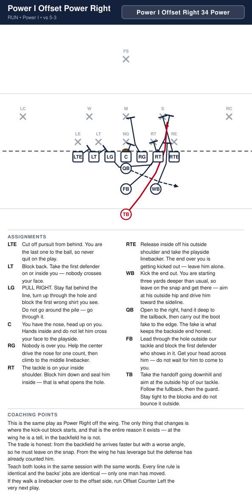

Our best downhill run. The line blocks down inside, the Z leads out of the backfield to kick the playside end, and the backside guard pulls through the hole in front of the tailback — two blockers in the same gap before the linebackers read it.

| Position | Assignment |
|---|---|
| **LTE** | Cut off pursuit from behind. You are the last one to the ball, so never quit on the play. |
| **LT** | Block back. Take the first defender on or inside you — nobody crosses your face. |
| **LG** | PULL RIGHT. Stay flat behind the line, turn up through the hole and block the first wrong shirt you see. Do not go around the pile — go through it. |
| **C** | You have the nose, head up on you. Hands inside and do not let him cross your face to the playside. |
| **RG** | Nobody is over you. Help the center drive the nose for one count, then climb to the middle linebacker. |
| **RT** | The tackle is on your inside shoulder. Block him down and seal him inside — that is what opens the hole. |
| **RTE** | Release inside off his outside shoulder and take the playside linebacker. The end over you is getting kicked out — leave him alone. |
| **Z** | Kick the end out. You are starting three yards deeper than usual, so leave on the snap and get there — aim at his outside hip and drive him toward the sideline. |
| **QB** | Open to the right, hand it deep to the tailback, then carry out the boot fake to the edge. The fake is what keeps the backside end honest. |
| **FB** | Lead through the hole outside our tackle and block the first defender who shows in it. Get your head across him — do not wait for him to come to you. |
| **TB** **(ball)** | Take the handoff going downhill and aim at the outside hip of our tackle. Follow the fullback, then the guard. Stay tight to the blocks and do not bounce it outside. |

**Coaching points**

- This is the play the Power I is built for. If it works you can run it a dozen times, and at this age you often can.
- The Z leads from the backfield, so he arrives fast but with a tight angle. He must leave on the snap and attack the end's outside hip, or the end slides under him and makes the tackle for a loss.
- The pulling guard is late by design. His man is whoever shows in the hole, not a man he picks before the snap.
- The tailback's worst habit is bouncing it wide for green grass. The yards are inside the Z's kick-out — drill it tight until it is automatic.
- If they walk a linebacker over to the Z side, come back with Counter the next play.

---

## Power I Power Left

**Call it:** `Power I Left 35 Power`

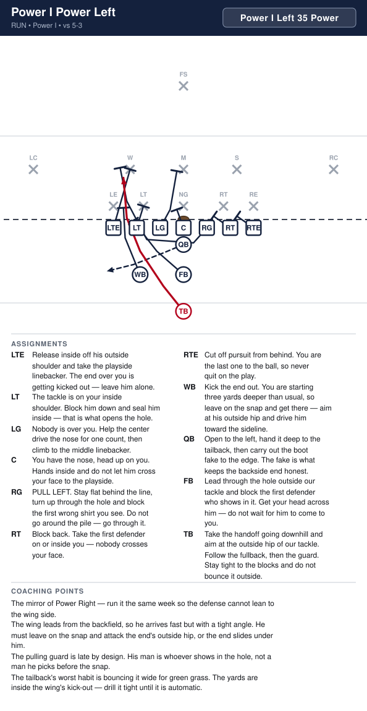

Power the other way. The line blocks down inside, the Z leads out of the backfield to kick the playside end, and the backside guard pulls through the hole in front of the tailback — two blockers in the same gap before the linebackers read it.

| Position | Assignment |
|---|---|
| **LTE** | Release inside off his outside shoulder and take the playside linebacker. The end over you is getting kicked out — leave him alone. |
| **LT** | The tackle is on your inside shoulder. Block him down and seal him inside — that is what opens the hole. |
| **LG** | Nobody is over you. Help the center drive the nose for one count, then climb to the middle linebacker. |
| **C** | You have the nose, head up on you. Hands inside and do not let him cross your face to the playside. |
| **RG** | PULL LEFT. Stay flat behind the line, turn up through the hole and block the first wrong shirt you see. Do not go around the pile — go through it. |
| **RT** | Block back. Take the first defender on or inside you — nobody crosses your face. |
| **RTE** | Cut off pursuit from behind. You are the last one to the ball, so never quit on the play. |
| **Z** | Kick the end out. You are starting three yards deeper than usual, so leave on the snap and get there — aim at his outside hip and drive him toward the sideline. |
| **QB** | Open to the left, hand it deep to the tailback, then carry out the boot fake to the edge. The fake is what keeps the backside end honest. |
| **FB** | Lead through the hole outside our tackle and block the first defender who shows in it. Get your head across him — do not wait for him to come to you. |
| **TB** **(ball)** | Take the handoff going downhill and aim at the outside hip of our tackle. Follow the fullback, then the guard. Stay tight to the blocks and do not bounce it outside. |

**Coaching points**

- The mirror of Power Right — run it the same week so the defense cannot lean to the Z side.
- The Z leads from the backfield, so he arrives fast but with a tight angle. He must leave on the snap and attack the end's outside hip, or the end slides under him.
- The pulling guard is late by design. His man is whoever shows in the hole, not a man he picks before the snap.
- The tailback's worst habit is bouncing it wide for green grass. The yards are inside the Z's kick-out — drill it tight until it is automatic.

---

## Power I Counter Right

**Call it:** `Power I Left 34 Counter`

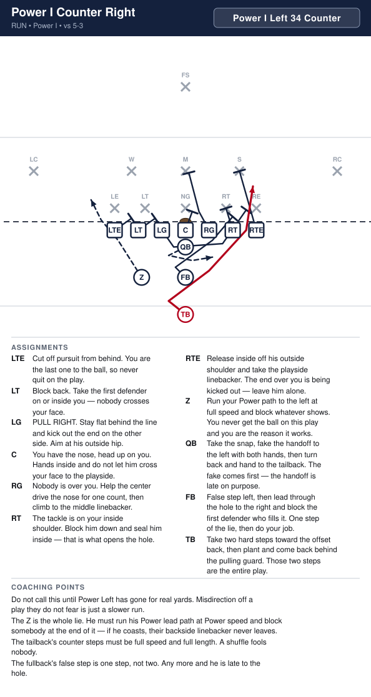

The Z is set to the strong side and runs his lead path that way, which is exactly what the defense has been punished for respecting. The tailback takes two hard steps toward him and comes back off-tackle to the weak side behind a pulling guard.

| Position | Assignment |
|---|---|
| **LTE** | Cut off pursuit from behind. You are the last one to the ball, so never quit on the play. |
| **LT** | Block back. Take the first defender on or inside you — nobody crosses your face. |
| **LG** | PULL RIGHT. Stay flat behind the line and kick out the end on the other side. Aim at his outside hip. |
| **C** | You have the nose, head up on you. Hands inside and do not let him cross your face to the playside. |
| **RG** | Nobody is over you. Help the center drive the nose for one count, then climb to the middle linebacker. |
| **RT** | The tackle is on your inside shoulder. Block him down and seal him inside — that is what opens the hole. |
| **RTE** | Release inside off his outside shoulder and take the playside linebacker. The end over you is being kicked out — leave him alone. |
| **Z** | Run your Power path to the left at full speed and block whatever shows. You never get the ball on this play and you are the reason it works. |
| **QB** | Take the snap, fake the handoff to the left with both hands, then turn back and hand to the tailback. The fake comes first — the handoff is late on purpose. |
| **FB** | False step left, then lead through the hole to the right and block the first defender who fills it. One step of the lie, then do your job. |
| **TB** **(ball)** | Take two hard steps toward the offset back, then plant and come back behind the pulling guard. Those two steps are the entire play. |

**Coaching points**

- Do not call this until Power Left has gone for real yards. Misdirection off a play they do not fear is just a slower run.
- The Z is the whole lie. He must run his Power lead path at Power speed and block somebody at the end of it — if he coasts, their backside linebacker never leaves.
- The tailback's counter steps must be full speed and full length. A shuffle fools nobody.
- The fullback's false step is one step, not two. Any more and he is late to the hole.

---

## Power I Counter Left

**Call it:** `Power I Right 35 Counter`

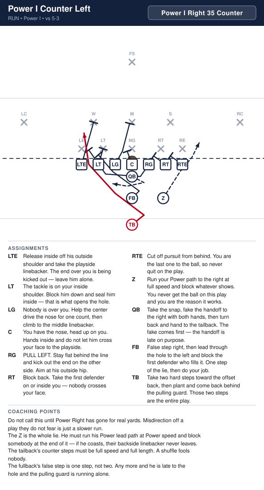

The Z is set to the strong side and runs his lead path that way, which is exactly what the defense has been punished for respecting. The tailback takes two hard steps toward him and comes back off-tackle to the weak side behind a pulling guard.

| Position | Assignment |
|---|---|
| **LTE** | Release inside off his outside shoulder and take the playside linebacker. The end over you is being kicked out — leave him alone. |
| **LT** | The tackle is on your inside shoulder. Block him down and seal him inside — that is what opens the hole. |
| **LG** | Nobody is over you. Help the center drive the nose for one count, then climb to the middle linebacker. |
| **C** | You have the nose, head up on you. Hands inside and do not let him cross your face to the playside. |
| **RG** | PULL LEFT. Stay flat behind the line and kick out the end on the other side. Aim at his outside hip. |
| **RT** | Block back. Take the first defender on or inside you — nobody crosses your face. |
| **RTE** | Cut off pursuit from behind. You are the last one to the ball, so never quit on the play. |
| **Z** | Run your Power path to the right at full speed and block whatever shows. You never get the ball on this play and you are the reason it works. |
| **QB** | Take the snap, fake the handoff to the right with both hands, then turn back and hand to the tailback. The fake comes first — the handoff is late on purpose. |
| **FB** | False step right, then lead through the hole to the left and block the first defender who fills it. One step of the lie, then do your job. |
| **TB** **(ball)** | Take two hard steps toward the offset back, then plant and come back behind the pulling guard. Those two steps are the entire play. |

**Coaching points**

- Do not call this until Power Right has gone for real yards. Misdirection off a play they do not fear is just a slower run.
- The Z is the whole lie. He must run his Power lead path at Power speed and block somebody at the end of it — if he coasts, their backside linebacker never leaves.
- The tailback's counter steps must be full speed and full length. A shuffle fools nobody.
- The fullback's false step is one step, not two. Any more and he is late to the hole and the pulling guard is running alone.

---

## Power I Z Power Right

**Call it:** `Power I Left 46 Power`

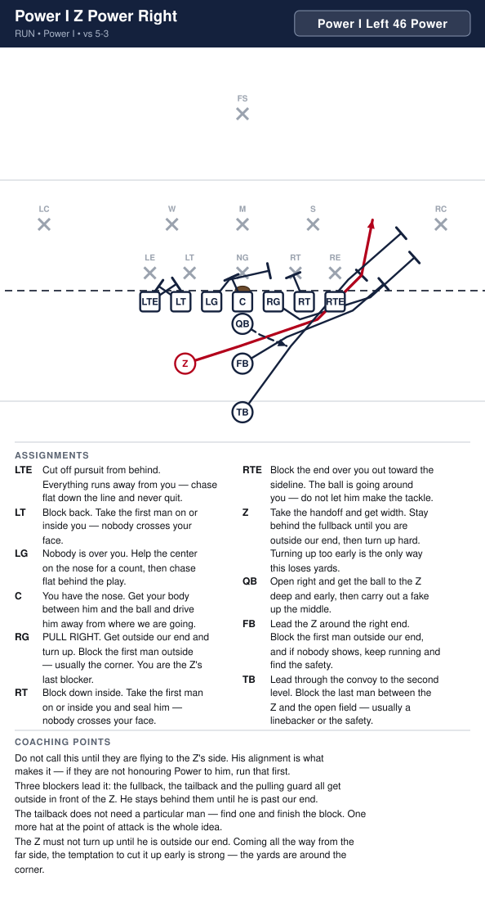

The wider mirror of Z Power Left. The Z is set to the left, and he takes it all the way around the right end behind three lead blockers — fullback, tailback and the pulling guard.

| Position | Assignment |
|---|---|
| **LTE** | Cut off pursuit from behind. Everything runs away from you — chase flat down the line and never quit. |
| **LT** | Block back. Take the first man on or inside you — nobody crosses your face. |
| **LG** | Nobody is over you. Help the center on the nose for a count, then chase flat behind the play. |
| **C** | You have the nose. Get your body between him and the ball and drive him away from where we are going. |
| **RG** | PULL RIGHT. Get outside our end and turn up. Block the first man outside — usually the corner. You are the Z's last blocker. |
| **RT** | Block down inside. Take the first man on or inside you and seal him — nobody crosses your face. |
| **RTE** | Block the end over you out toward the sideline. The ball is going around you — do not let him make the tackle. |
| **Z** **(ball)** | Take the handoff and get width. Stay behind the fullback until you are outside our end, then turn up hard. Turning up too early is the only way this loses yards. |
| **QB** | Open right and get the ball to the Z deep and early, then carry out a fake up the middle. |
| **FB** | Lead the Z around the right end. Block the first man outside our end, and if nobody shows, keep running and find the safety. |
| **TB** | Lead through the convoy to the second level. Block the last man between the Z and the open field — usually a linebacker or the safety. |

**Coaching points**

- Do not call this until they are flying to the Z's side. His alignment is what makes it — if they are not honouring Power to him, run that first.
- Three blockers lead it: the fullback, the tailback and the pulling guard all get outside in front of the Z. He stays behind them until he is past our end.
- The tailback does not need a particular man — find one and finish the block. One more hat at the point of attack is the whole idea.
- The Z must not turn up until he is outside our end. Coming all the way from the far side, the temptation to cut it up early is strong — the yards are around the corner.

---

## Power I Z Power Left

**Call it:** `Power I Right 45 Power`

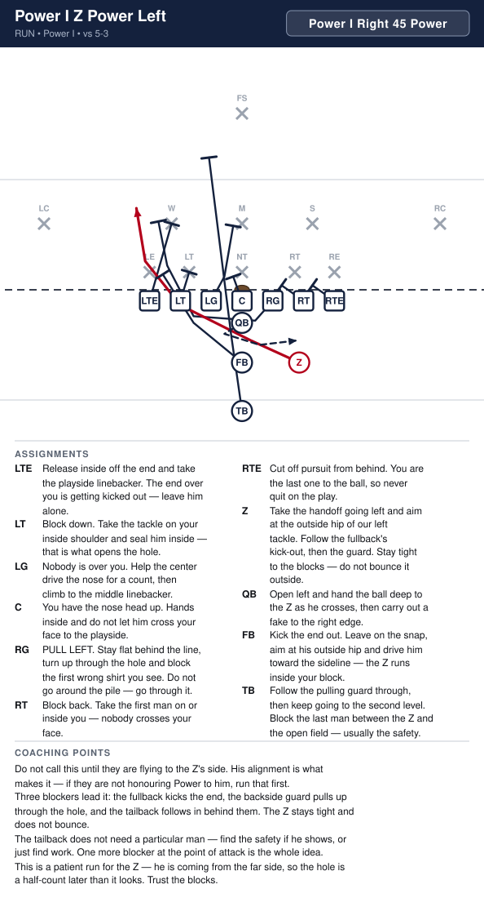

The Z's alignment says Power to his side; this goes the other way. He takes the ball back across behind the fullback's kick-out, the pulling guard and the tailback — three blockers clearing the way instead of one selling a fake.

| Position | Assignment |
|---|---|
| **LTE** | Release inside off the end and take the playside linebacker. The end over you is getting kicked out — leave him alone. |
| **LT** | Block down. Take the tackle on your inside shoulder and seal him inside — that is what opens the hole. |
| **LG** | Nobody is over you. Help the center drive the nose for a count, then climb to the middle linebacker. |
| **C** | You have the nose head up. Hands inside and do not let him cross your face to the playside. |
| **RG** | PULL LEFT. Stay flat behind the line, turn up through the hole and block the first wrong shirt you see. Do not go around the pile — go through it. |
| **RT** | Block back. Take the first man on or inside you — nobody crosses your face. |
| **RTE** | Cut off pursuit from behind. You are the last one to the ball, so never quit on the play. |
| **Z** **(ball)** | Take the handoff going left and aim at the outside hip of our left tackle. Follow the fullback's kick-out, then the guard. Stay tight to the blocks — do not bounce it outside. |
| **QB** | Open left and hand the ball deep to the Z as he crosses, then carry out a fake to the right edge. |
| **FB** | Kick the end out. Leave on the snap, aim at his outside hip and drive him toward the sideline — the Z runs inside your block. |
| **TB** | Follow the pulling guard through, then keep going to the second level. Block the last man between the Z and the open field — usually the safety. |

**Coaching points**

- Do not call this until they are flying to the Z's side. His alignment is what makes it — if they are not honouring Power to him, run that first.
- Three blockers lead it: the fullback kicks the end, the backside guard pulls up through the hole, and the tailback follows in behind them. The Z stays tight and does not bounce.
- The tailback does not need a particular man — find the safety if he shows, or just find work. One more blocker at the point of attack is the whole idea.
- This is a patient run for the Z — he is coming from the far side, so the hole is a half-count later than it looks. Trust the blocks.

---

## Power I Toss Right

**Call it:** `Power I Right 38 Toss`

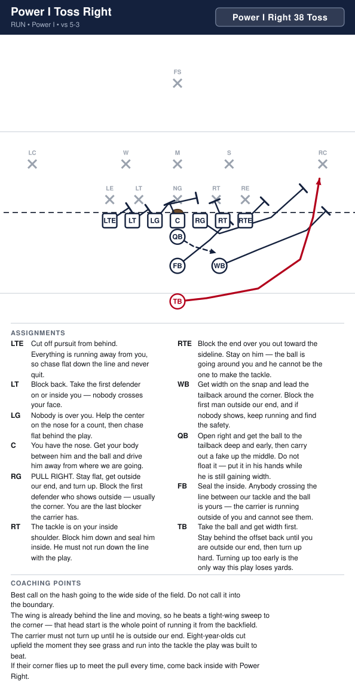

Two lead blockers around the corner. The Z and the pulling guard get outside in front of the tailback, and a defense that has been squeezing the off-tackle hole all game has nobody left on the edge.

| Position | Assignment |
|---|---|
| **LTE** | Cut off pursuit from behind. Everything is running away from you, so chase flat down the line and never quit. |
| **LT** | Block back. Take the first defender on or inside you — nobody crosses your face. |
| **LG** | Nobody is over you. Help the center on the nose for a count, then chase flat behind the play. |
| **C** | You have the nose. Get your body between him and the ball and drive him away from where we are going. |
| **RG** | PULL RIGHT. Stay flat, get outside our end, and turn up. Block the first defender who shows outside — usually the corner. You are the last blocker the carrier has. |
| **RT** | The tackle is on your inside shoulder. Block him down and seal him inside. He must not run down the line with the play. |
| **RTE** | Block the end over you out toward the sideline. Stay on him — the ball is going around you and he cannot be the one to make the tackle. |
| **Z** | Get width on the snap and lead the tailback around the corner. Block the first man outside our end, and if nobody shows, keep running and find the safety. |
| **QB** | Open right and get the ball to the tailback deep and early, then carry out a fake up the middle. Do not float it — put it in his hands while he is still gaining width. |
| **FB** | Seal the inside. Anybody crossing the line between our tackle and the ball is yours — the carrier is running outside of you and cannot see them. |
| **TB** **(ball)** | Take the ball and get width first. Stay behind the offset back until you are outside our end, then turn up hard. Turning up too early is the only way this play loses yards. |

**Coaching points**

- Best call on the hash going to the wide side of the field. Do not call it into the boundary.
- The Z is already behind the line and moving, so he gets to the corner faster than he would from a tight alignment on the edge — that head start is the whole point of running it from the backfield.
- The carrier must not turn up until he is outside our end. Eight-year-olds cut upfield the moment they see grass and run into the tackle the play was built to beat.
- If their corner flies up to meet the pull every time, come back inside with Power Right.

---

## Power I Toss Left

**Call it:** `Power I Left 39 Toss`

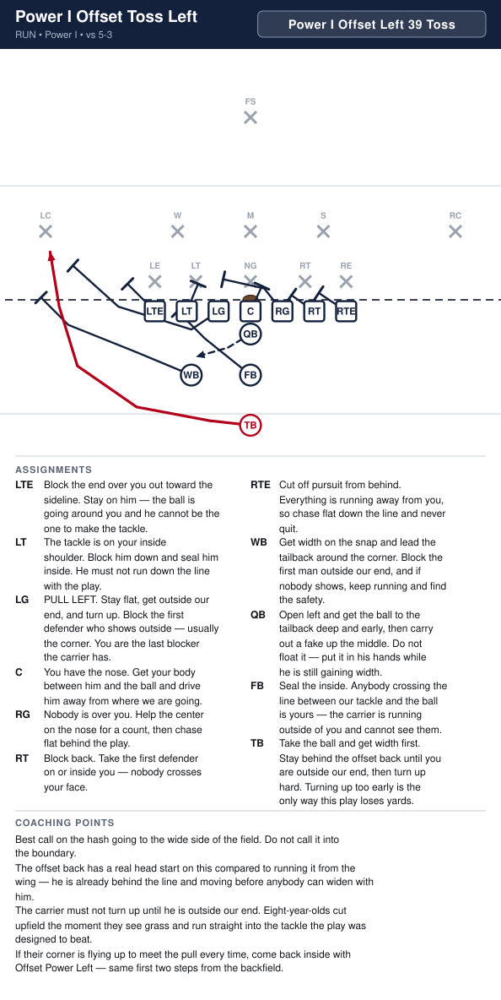

Two lead blockers around the corner. The Z and the pulling guard get outside in front of the tailback, and a defense that has been squeezing the off-tackle hole all game has nobody left on the edge.

| Position | Assignment |
|---|---|
| **LTE** | Block the end over you out toward the sideline. Stay on him — the ball is going around you and he cannot be the one to make the tackle. |
| **LT** | The tackle is on your inside shoulder. Block him down and seal him inside. He must not run down the line with the play. |
| **LG** | PULL LEFT. Stay flat, get outside our end, and turn up. Block the first defender who shows outside — usually the corner. You are the last blocker the carrier has. |
| **C** | You have the nose. Get your body between him and the ball and drive him away from where we are going. |
| **RG** | Nobody is over you. Help the center on the nose for a count, then chase flat behind the play. |
| **RT** | Block back. Take the first defender on or inside you — nobody crosses your face. |
| **RTE** | Cut off pursuit from behind. Everything is running away from you, so chase flat down the line and never quit. |
| **Z** | Get width on the snap and lead the tailback around the corner. Block the first man outside our end, and if nobody shows, keep running and find the safety. |
| **QB** | Open left and get the ball to the tailback deep and early, then carry out a fake up the middle. Do not float it — put it in his hands while he is still gaining width. |
| **FB** | Seal the inside. Anybody crossing the line between our tackle and the ball is yours — the carrier is running outside of you and cannot see them. |
| **TB** **(ball)** | Take the ball and get width first. Stay behind the offset back until you are outside our end, then turn up hard. Turning up too early is the only way this play loses yards. |

**Coaching points**

- Best call on the hash going to the wide side of the field. Do not call it into the boundary.
- The Z is already behind the line and moving, so he gets to the corner faster than he would from a tight alignment on the edge — that head start is the whole point of running it from the backfield.
- The carrier must not turn up until he is outside our end. Eight-year-olds cut upfield the moment they see grass and run into the tackle the play was built to beat.
- If their corner flies up to meet the pull every time, come back inside with Power Left.

# Split Backs

---

## Split Dive Right

**Call it:** `Split Z Right 30 Dive`

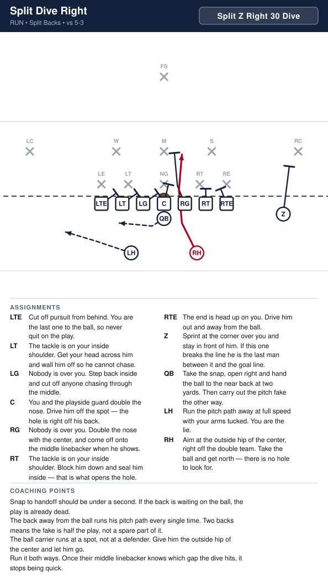

The near back straight ahead off a double team on the nose, going right through the first gap outside the center. This is the play that has to work before anything else in the formation does — it is what holds their linebackers inside and makes the pitch go.

| Position | Assignment |
|---|---|
| **LTE** | Cut off pursuit from behind. You are the last one to the ball, so never quit on the play. |
| **LT** | The tackle is on your inside shoulder. Get your head across him and wall him off so he cannot chase. |
| **LG** | Nobody is over you. Step back inside and cut off anyone chasing through the middle. |
| **C** | You and the playside guard double the nose. Drive him off the spot — the hole is right off his back. |
| **RG** | Nobody is over you. Double the nose with the center, and come off onto the middle linebacker when he shows. |
| **RT** | The tackle is on your inside shoulder. Block him down and seal him inside — that is what opens the hole. |
| **RTE** | The end is head up on you. Drive him out and away from the ball. |
| **Z** | Sprint at the corner over you and stay in front of him. If this one breaks the line he is the last man between it and the goal line. |
| **QB** | Take the snap, open right and hand the ball to the near back at two yards. Then carry out the pitch fake the other way. |
| **LH** | Run the pitch path away at full speed with your arms tucked. You are the lie. |
| **RH** **(ball)** | Aim at the outside hip of the center, right off the double team. Take the ball and get north — there is no hole to look for. |

**Coaching points**

- Snap to handoff should be under a second. If the back is waiting on the ball, the play is already dead.
- The back away from the ball runs his pitch path every single time. Two backs means the fake is half the play, not a spare part of it.
- The ball carrier runs at a spot, not at a defender. Give him the outside hip of the center and let him go.
- Run it both ways. Once their middle linebacker knows which gap the dive hits, it stops being quick.

---

## Split Dive Left

**Call it:** `Split Z Right 21 Dive`

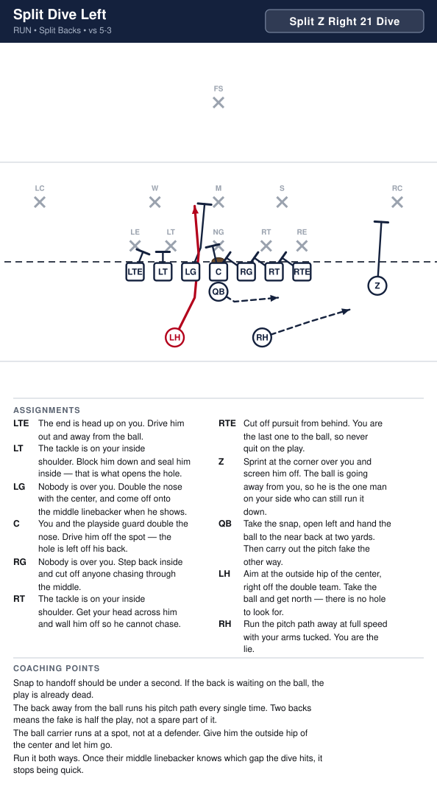

The near back straight ahead off a double team on the nose, going left through the first gap outside the center. This is the play that has to work before anything else in the formation does — it is what holds their linebackers inside and makes the pitch go.

| Position | Assignment |
|---|---|
| **LTE** | The end is head up on you. Drive him out and away from the ball. |
| **LT** | The tackle is on your inside shoulder. Block him down and seal him inside — that is what opens the hole. |
| **LG** | Nobody is over you. Double the nose with the center, and come off onto the middle linebacker when he shows. |
| **C** | You and the playside guard double the nose. Drive him off the spot — the hole is left off his back. |
| **RG** | Nobody is over you. Step back inside and cut off anyone chasing through the middle. |
| **RT** | The tackle is on your inside shoulder. Get your head across him and wall him off so he cannot chase. |
| **RTE** | Cut off pursuit from behind. You are the last one to the ball, so never quit on the play. |
| **Z** | Sprint at the corner over you and screen him off. The ball is going away from you, so he is the one man on your side who can still run it down. |
| **QB** | Take the snap, open left and hand the ball to the near back at two yards. Then carry out the pitch fake the other way. |
| **LH** **(ball)** | Aim at the outside hip of the center, right off the double team. Take the ball and get north — there is no hole to look for. |
| **RH** | Run the pitch path away at full speed with your arms tucked. You are the lie. |

**Coaching points**

- Snap to handoff should be under a second. If the back is waiting on the ball, the play is already dead.
- The back away from the ball runs his pitch path every single time. Two backs means the fake is half the play, not a spare part of it.
- The ball carrier runs at a spot, not at a defender. Give him the outside hip of the center and let him go.
- Run it both ways. Once their middle linebacker knows which gap the dive hits, it stops being quick.

---

## Split Power Right

**Call it:** `Split Z Right 24 Power`

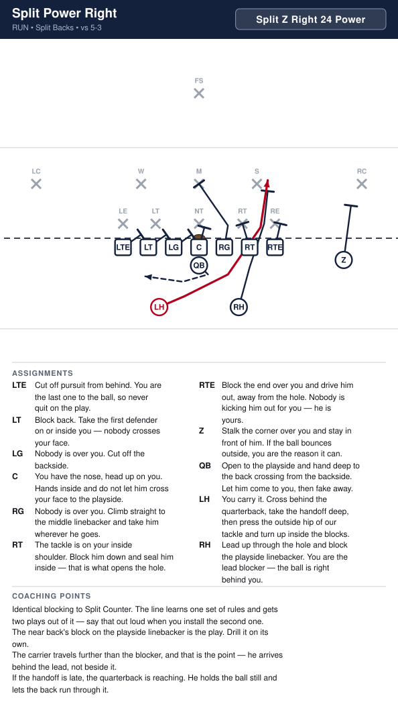

Off-tackle power to the far back, who crosses behind the quarterback and takes a deep handoff. Nobody pulls: our end drives their end out, the playside guard climbs to the middle linebacker and the near back leads up through the hole onto the playside linebacker.

| Position | Assignment |
|---|---|
| **LTE** | Cut off pursuit from behind. You are the last one to the ball, so never quit on the play. |
| **LT** | Block back. Take the first defender on or inside you — nobody crosses your face. |
| **LG** | Nobody is over you. Cut off the backside. |
| **C** | You have the nose, head up on you. Hands inside and do not let him cross your face to the playside. |
| **RG** | Nobody is over you. Climb straight to the middle linebacker and take him wherever he goes. |
| **RT** | The tackle is on your inside shoulder. Block him down and seal him inside — that is what opens the hole. |
| **RTE** | Block the end over you and drive him out, away from the hole. Nobody is kicking him out for you — he is yours. |
| **Z** | Stalk the corner over you and stay in front of him. If the ball bounces outside, you are the reason it can. |
| **QB** | Open to the playside and hand deep to the back crossing from the backside. Let him come to you, then fake away. |
| **LH** **(ball)** | You carry it. Cross behind the quarterback, take the handoff deep, then press the outside hip of our tackle and turn up inside the blocks. |
| **RH** | Lead up through the hole and block the playside linebacker. You are the lead blocker — the ball is right behind you. |

**Coaching points**

- Identical blocking to Split Counter. The line learns one set of rules and gets two plays out of it — say that out loud when you install the second one.
- The near back's block on the playside linebacker is the play. Drill it on its own.
- The carrier travels further than the blocker, and that is the point — he arrives behind the lead, not beside it.
- If the handoff is late, the quarterback is reaching. He holds the ball still and lets the back run through it.

---

## Split Power Left

**Call it:** `Split Z Right 35 Power`

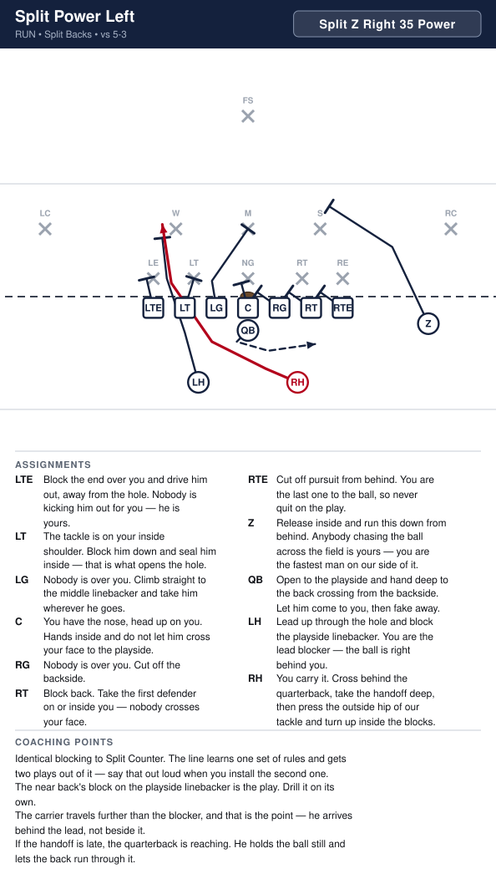

Off-tackle power to the far back, who crosses behind the quarterback and takes a deep handoff. Nobody pulls: our end drives their end out, the playside guard climbs to the middle linebacker and the near back leads up through the hole onto the playside linebacker.

| Position | Assignment |
|---|---|
| **LTE** | Block the end over you and drive him out, away from the hole. Nobody is kicking him out for you — he is yours. |
| **LT** | The tackle is on your inside shoulder. Block him down and seal him inside — that is what opens the hole. |
| **LG** | Nobody is over you. Climb straight to the middle linebacker and take him wherever he goes. |
| **C** | You have the nose, head up on you. Hands inside and do not let him cross your face to the playside. |
| **RG** | Nobody is over you. Cut off the backside. |
| **RT** | Block back. Take the first defender on or inside you — nobody crosses your face. |
| **RTE** | Cut off pursuit from behind. You are the last one to the ball, so never quit on the play. |
| **Z** | Release inside and run this down from behind. Anybody chasing the ball across the field is yours — you are the fastest man on our side of it. |
| **QB** | Open to the playside and hand deep to the back crossing from the backside. Let him come to you, then fake away. |
| **LH** | Lead up through the hole and block the playside linebacker. You are the lead blocker — the ball is right behind you. |
| **RH** **(ball)** | You carry it. Cross behind the quarterback, take the handoff deep, then press the outside hip of our tackle and turn up inside the blocks. |

**Coaching points**

- Identical blocking to Split Counter. The line learns one set of rules and gets two plays out of it — say that out loud when you install the second one.
- The near back's block on the playside linebacker is the play. Drill it on its own.
- The carrier travels further than the blocker, and that is the point — he arrives behind the lead, not beside it.
- If the handoff is late, the quarterback is reaching. He holds the ball still and lets the back run through it.

---

## Split Counter Right

**Call it:** `Split Z Right 24 Counter`

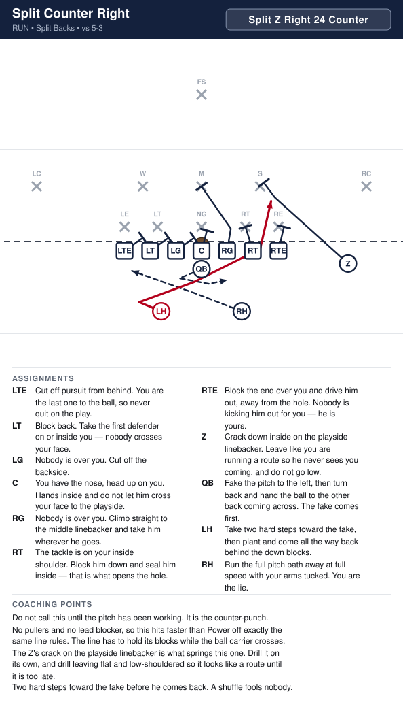

Misdirection off the pitch. The near back and the quarterback sell the pitch one way and the far back plants and comes all the way back. Nobody pulls and nobody leads, so it hits faster than Power off the same blocks.

| Position | Assignment |
|---|---|
| **LTE** | Cut off pursuit from behind. You are the last one to the ball, so never quit on the play. |
| **LT** | Block back. Take the first defender on or inside you — nobody crosses your face. |
| **LG** | Nobody is over you. Cut off the backside. |
| **C** | You have the nose, head up on you. Hands inside and do not let him cross your face to the playside. |
| **RG** | Nobody is over you. Climb straight to the middle linebacker and take him wherever he goes. |
| **RT** | The tackle is on your inside shoulder. Block him down and seal him inside — that is what opens the hole. |
| **RTE** | Block the end over you and drive him out, away from the hole. Nobody is kicking him out for you — he is yours. |
| **Z** | Crack down inside on the playside linebacker. Leave like you are running a route so he never sees you coming, and do not go low. |
| **QB** | Fake the pitch to the left, then turn back and hand the ball to the other back coming across. The fake comes first. |
| **LH** **(ball)** | Take two hard steps toward the fake, then plant and come all the way back behind the down blocks. |
| **RH** | Run the full pitch path away at full speed with your arms tucked. You are the lie. |

**Coaching points**

- Do not call this until the pitch has been working. It is the counter-punch.
- No pullers and no lead blocker, so this hits faster than Power off exactly the same line rules. The line has to hold its blocks while the ball carrier crosses.
- The Z's crack on the playside linebacker is what springs this one. Drill it on its own, and drill leaving flat and low-shouldered so it looks like a route until it is too late.
- Two hard steps toward the fake before he comes back. A shuffle fools nobody.

---

## Split Counter Left

**Call it:** `Split Z Right 35 Counter`

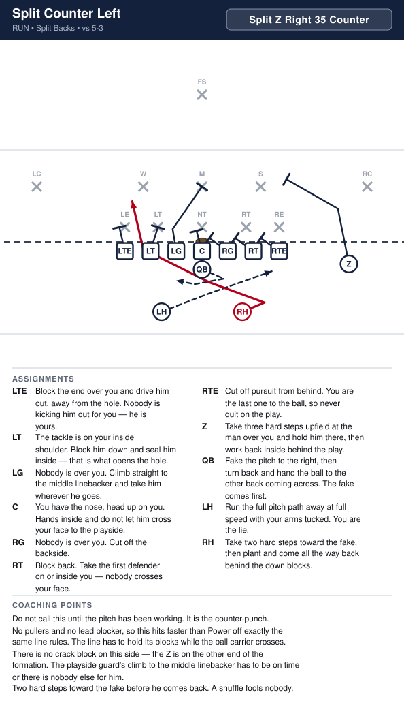

Misdirection off the pitch. The near back and the quarterback sell the pitch one way and the far back plants and comes all the way back. Nobody pulls and nobody leads, so it hits faster than Power off the same blocks.

| Position | Assignment |
|---|---|
| **LTE** | Block the end over you and drive him out, away from the hole. Nobody is kicking him out for you — he is yours. |
| **LT** | The tackle is on your inside shoulder. Block him down and seal him inside — that is what opens the hole. |
| **LG** | Nobody is over you. Climb straight to the middle linebacker and take him wherever he goes. |
| **C** | You have the nose, head up on you. Hands inside and do not let him cross your face to the playside. |
| **RG** | Nobody is over you. Cut off the backside. |
| **RT** | Block back. Take the first defender on or inside you — nobody crosses your face. |
| **RTE** | Cut off pursuit from behind. You are the last one to the ball, so never quit on the play. |
| **Z** | Take three hard steps upfield at the man over you and hold him there, then work back inside behind the play. |
| **QB** | Fake the pitch to the right, then turn back and hand the ball to the other back coming across. The fake comes first. |
| **LH** | Run the full pitch path away at full speed with your arms tucked. You are the lie. |
| **RH** **(ball)** | Take two hard steps toward the fake, then plant and come all the way back behind the down blocks. |

**Coaching points**

- Do not call this until the pitch has been working. It is the counter-punch.
- No pullers and no lead blocker, so this hits faster than Power off exactly the same line rules. The line has to hold its blocks while the ball carrier crosses.
- There is no crack block on this side — the Z is on the other end of the formation. The playside guard's climb to the middle linebacker has to be on time or there is nobody else for him.
- Two hard steps toward the fake before he comes back. A shuffle fools nobody.

---

## Split Waggle Right

**Call it:** `Split Z Right 16 Waggle`

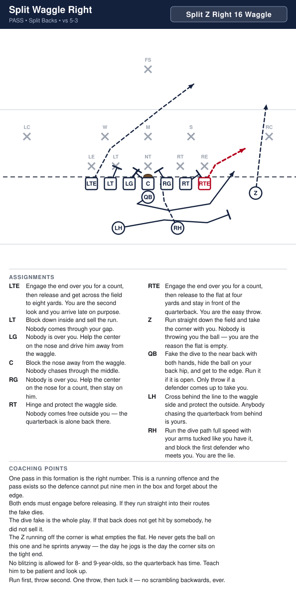

The only pass in this formation, and it comes off the play they have seen most. Fake the dive, send the split man deep to carry the corner off, and the quarterback walks out onto an edge everybody has left.

| Position | Assignment |
|---|---|
| **LTE** | Engage the end over you for a count, then release and get across the field to eight yards. You are the second look and you arrive late on purpose. |
| **LT** | Block down inside and sell the run. Nobody comes through your gap. |
| **LG** | Nobody is over you. Help the center on the nose and drive him away from the waggle. |
| **C** | Block the nose away from the waggle. Nobody chases through the middle. |
| **RG** | Nobody is over you. Help the center on the nose for a count, then stay on him. |
| **RT** | Hinge and protect the waggle side. Nobody comes free outside you — the quarterback is alone back there. |
| **RTE** **(ball)** | Engage the end over you for a count, then release to the flat at four yards and stay in front of the quarterback. You are the easy throw. |
| **Z** | Run straight down the field and take the corner with you. Nobody is throwing you the ball — you are the reason the flat is empty. |
| **QB** | Fake the dive to the near back with both hands, hide the ball on your back hip, and get to the edge. Run it if it is open. Only throw if a defender comes up to take you. |
| **LH** | Cross behind the line to the waggle side and protect the outside. Anybody chasing the quarterback from behind is yours. |
| **RH** | Run the dive path full speed with your arms tucked like you have it, and block the first defender who meets you. You are the lie. |

**Coaching points**

- One pass in this formation is the right number. This is a running offence and the pass exists so the defence cannot put nine men in the box and forget about the edge.
- Both ends must engage before releasing. If they run straight into their routes the fake dies.
- The dive fake is the whole play. If that back does not get hit by somebody, he did not sell it.
- The Z running off the corner is what empties the flat. He never gets the ball on this one and he sprints anyway — the day he jogs is the day the corner sits on the tight end.
- No blitzing is allowed for 8- and 9-year-olds, so the quarterback has time. Teach him to be patient and look up.
- Run first, throw second. One throw, then tuck it — no scrambling backwards, ever.

---

## Split Waggle Left

**Call it:** `Split Z Right 17 Waggle`

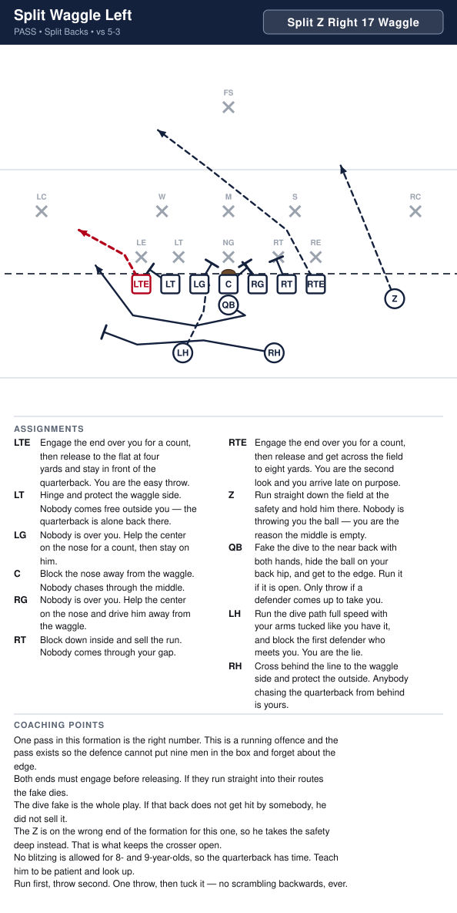

The only pass in this formation, and it comes off the play they have seen most. Fake the dive, send the split man deep to carry the corner off, and the quarterback walks out onto an edge everybody has left.

| Position | Assignment |
|---|---|
| **LTE** **(ball)** | Engage the end over you for a count, then release to the flat at four yards and stay in front of the quarterback. You are the easy throw. |
| **LT** | Hinge and protect the waggle side. Nobody comes free outside you — the quarterback is alone back there. |
| **LG** | Nobody is over you. Help the center on the nose for a count, then stay on him. |
| **C** | Block the nose away from the waggle. Nobody chases through the middle. |
| **RG** | Nobody is over you. Help the center on the nose and drive him away from the waggle. |
| **RT** | Block down inside and sell the run. Nobody comes through your gap. |
| **RTE** | Engage the end over you for a count, then release and get across the field to eight yards. You are the second look and you arrive late on purpose. |
| **Z** | Run straight down the field at the safety and hold him there. Nobody is throwing you the ball — you are the reason the middle is empty. |
| **QB** | Fake the dive to the near back with both hands, hide the ball on your back hip, and get to the edge. Run it if it is open. Only throw if a defender comes up to take you. |
| **LH** | Run the dive path full speed with your arms tucked like you have it, and block the first defender who meets you. You are the lie. |
| **RH** | Cross behind the line to the waggle side and protect the outside. Anybody chasing the quarterback from behind is yours. |

**Coaching points**

- One pass in this formation is the right number. This is a running offence and the pass exists so the defence cannot put nine men in the box and forget about the edge.
- Both ends must engage before releasing. If they run straight into their routes the fake dies.
- The dive fake is the whole play. If that back does not get hit by somebody, he did not sell it.
- The Z is on the wrong end of the formation for this one, so he takes the safety deep instead. That is what keeps the crosser open.
- No blitzing is allowed for 8- and 9-year-olds, so the quarterback has time. Teach him to be patient and look up.
- Run first, throw second. One throw, then tuck it — no scrambling backwards, ever.

---

## Split Pitch Right

**Call it:** `Split Z Right 28 Pitch`

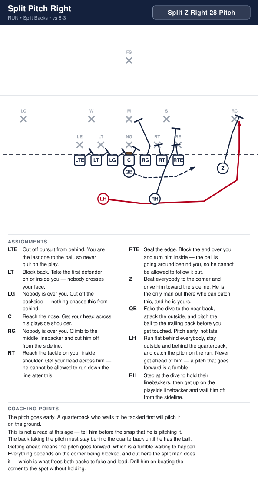

Get outside in a hurry. Our end seals their end inside, the playside guard cuts the middle linebacker off from the sideline, and the far back trails the quarterback, takes the pitch on the run and turns up inside the block on the corner. The split man out wide is the one who makes that block, so both backs stay in the backfield where the fake lives.

| Position | Assignment |
|---|---|
| **LTE** | Cut off pursuit from behind. You are the last one to the ball, so never quit on the play. |
| **LT** | Block back. Take the first defender on or inside you — nobody crosses your face. |
| **LG** | Nobody is over you. Cut off the backside — nothing chases this from behind. |
| **C** | Reach the nose. Get your head across his playside shoulder. |
| **RG** | Nobody is over you. Climb to the middle linebacker and cut him off from the sideline. |
| **RT** | Reach the tackle on your inside shoulder. Get your head across him — he cannot be allowed to run down the line after this. |
| **RTE** | Seal the edge. Block the end over you and turn him inside — the ball is going around behind you, so he cannot be allowed to follow it out. |
| **Z** | Beat everybody to the corner and drive him toward the sideline. He is the only man out there who can catch this, and he is yours. |
| **QB** | Fake the dive to the near back, attack the outside, and pitch the ball to the trailing back before you get touched. Pitch early, not late. |
| **LH** **(ball)** | Run flat behind everybody, stay outside and behind the quarterback, and catch the pitch on the run. Never get ahead of him — a pitch that goes forward is a fumble. |
| **RH** | Step at the dive to hold their linebackers, then get up on the playside linebacker and wall him off from the sideline. |

**Coaching points**

- The pitch goes early. A quarterback who waits to be tackled first will pitch it on the ground.
- This is not a read at this age — tell him before the snap that he is pitching it.
- The back taking the pitch must stay behind the quarterback until he has the ball. Getting ahead means the pitch goes forward, which is a fumble waiting to happen.
- Everything depends on the corner being blocked, and out here the split man does it — which is what frees both backs to fake and lead. Drill him on beating the corner to the spot without holding.

---

## Split Pitch Left

**Call it:** `Split Z Right 39 Pitch`

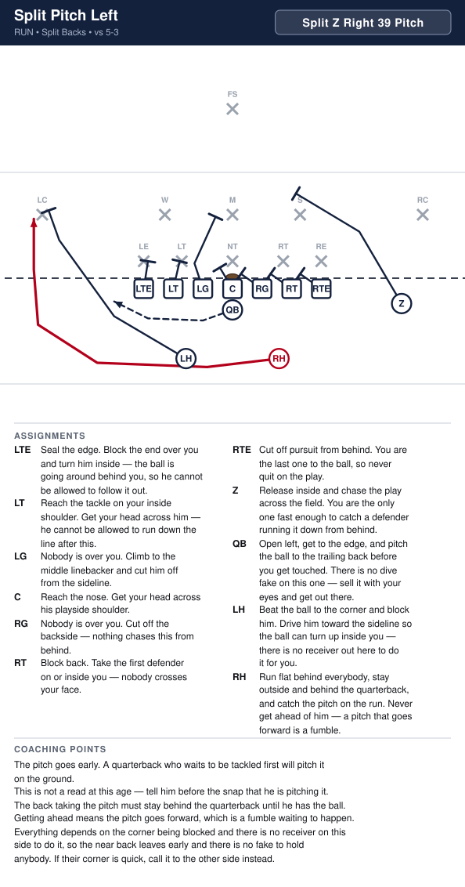

Get outside in a hurry. Our end seals their end inside, the playside guard cuts the middle linebacker off from the sideline, and the far back trails the quarterback, takes the pitch on the run and turns up inside the block on the corner. Away from the split man there is nobody out there, so the near back has to go block the corner himself — which is why this side has no dive fake.

| Position | Assignment |
|---|---|
| **LTE** | Seal the edge. Block the end over you and turn him inside — the ball is going around behind you, so he cannot be allowed to follow it out. |
| **LT** | Reach the tackle on your inside shoulder. Get your head across him — he cannot be allowed to run down the line after this. |
| **LG** | Nobody is over you. Climb to the middle linebacker and cut him off from the sideline. |
| **C** | Reach the nose. Get your head across his playside shoulder. |
| **RG** | Nobody is over you. Cut off the backside — nothing chases this from behind. |
| **RT** | Block back. Take the first defender on or inside you — nobody crosses your face. |
| **RTE** | Cut off pursuit from behind. You are the last one to the ball, so never quit on the play. |
| **Z** | Release inside and chase the play across the field. You are the only one fast enough to catch a defender running it down from behind. |
| **QB** | Open left, get to the edge, and pitch the ball to the trailing back before you get touched. There is no dive fake on this one — sell it with your eyes and get out there. |
| **LH** | Beat the ball to the corner and block him. Drive him toward the sideline so the ball can turn up inside you — there is no receiver out here to do it for you. |
| **RH** **(ball)** | Run flat behind everybody, stay outside and behind the quarterback, and catch the pitch on the run. Never get ahead of him — a pitch that goes forward is a fumble. |

**Coaching points**

- The pitch goes early. A quarterback who waits to be tackled first will pitch it on the ground.
- This is not a read at this age — tell him before the snap that he is pitching it.
- The back taking the pitch must stay behind the quarterback until he has the ball. Getting ahead means the pitch goes forward, which is a fumble waiting to happen.
- Everything depends on the corner being blocked and there is no receiver on this side to do it, so the near back leaves early and there is no fake to hold anybody. If their corner is quick, call it to the other side instead.

---

## Split QB Keep Right

**Call it:** `Split Z Right 16 Keep`

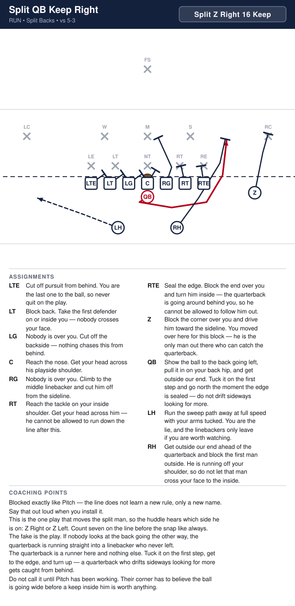

The quarterback keeps it himself, and he runs to the side the split man is lined up on — so the Z moves to the right for this one and the call says so. Fake to the back going left, seal their end inside, and get outside our own end behind two blockers: the near back on the linebacker and the split man on the corner. Blocked exactly like Pitch.

| Position | Assignment |
|---|---|
| **LTE** | Cut off pursuit from behind. You are the last one to the ball, so never quit on the play. |
| **LT** | Block back. Take the first defender on or inside you — nobody crosses your face. |
| **LG** | Nobody is over you. Cut off the backside — nothing chases this from behind. |
| **C** | Reach the nose. Get your head across his playside shoulder. |
| **RG** | Nobody is over you. Climb to the middle linebacker and cut him off from the sideline. |
| **RT** | Reach the tackle on your inside shoulder. Get your head across him — he cannot be allowed to run down the line after this. |
| **RTE** | Seal the edge. Block the end over you and turn him inside — the quarterback is going around behind you, so he cannot be allowed to follow him out. |
| **Z** | Block the corner over you and drive him toward the sideline. You moved over here for this block — he is the only man out there who can catch the quarterback. |
| **QB** **(ball)** | Show the ball to the back going left, pull it in on your back hip, and get outside our end. Tuck it on the first step and go north the moment the edge is sealed — do not drift sideways looking for more. |
| **LH** | Run the sweep path away at full speed with your arms tucked. You are the lie, and the linebackers only leave if you are worth watching. |
| **RH** | Get outside our end ahead of the quarterback and block the first man outside. He is running off your shoulder, so do not let that man cross your face to the inside. |

**Coaching points**

- Blocked exactly like Pitch — the line does not learn a new rule, only a new name. Say that out loud when you install it.
- This is the one play that moves the split man, so the huddle hears which side he is on: Z Right or Z Left. Count seven on the line before the snap like always.
- The fake is the play. If nobody looks at the back going the other way, the quarterback is running straight into a linebacker who never left.
- The quarterback is a runner here and nothing else. Tuck it on the first step, get to the edge, and turn up — a quarterback who drifts sideways looking for more gets caught from behind.
- Do not call it until Pitch has been working. Their corner has to believe the ball is going wide before a keep inside him is worth anything.

---

## Split QB Keep Left

**Call it:** `Split Z Left 17 Keep`

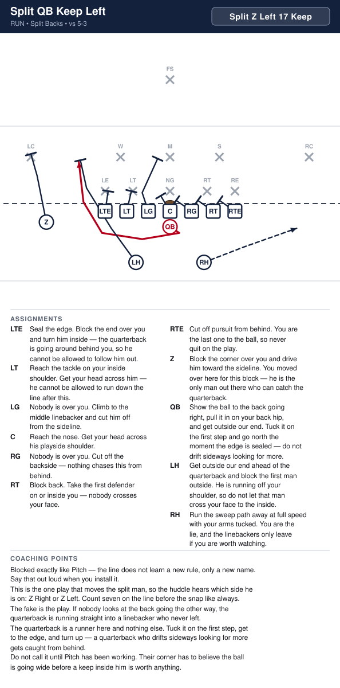

The quarterback keeps it himself, and he runs to the side the split man is lined up on — so the Z moves to the left for this one and the call says so. Fake to the back going right, seal their end inside, and get outside our own end behind two blockers: the near back on the linebacker and the split man on the corner. Blocked exactly like Pitch.

| Position | Assignment |
|---|---|
| **LTE** | Seal the edge. Block the end over you and turn him inside — the quarterback is going around behind you, so he cannot be allowed to follow him out. |
| **LT** | Reach the tackle on your inside shoulder. Get your head across him — he cannot be allowed to run down the line after this. |
| **LG** | Nobody is over you. Climb to the middle linebacker and cut him off from the sideline. |
| **C** | Reach the nose. Get your head across his playside shoulder. |
| **RG** | Nobody is over you. Cut off the backside — nothing chases this from behind. |
| **RT** | Block back. Take the first defender on or inside you — nobody crosses your face. |
| **RTE** | Cut off pursuit from behind. You are the last one to the ball, so never quit on the play. |
| **Z** | Block the corner over you and drive him toward the sideline. You moved over here for this block — he is the only man out there who can catch the quarterback. |
| **QB** **(ball)** | Show the ball to the back going right, pull it in on your back hip, and get outside our end. Tuck it on the first step and go north the moment the edge is sealed — do not drift sideways looking for more. |
| **LH** | Get outside our end ahead of the quarterback and block the first man outside. He is running off your shoulder, so do not let that man cross your face to the inside. |
| **RH** | Run the sweep path away at full speed with your arms tucked. You are the lie, and the linebackers only leave if you are worth watching. |

**Coaching points**

- Blocked exactly like Pitch — the line does not learn a new rule, only a new name. Say that out loud when you install it.
- This is the one play that moves the split man, so the huddle hears which side he is on: Z Right or Z Left. Count seven on the line before the snap like always.
- The fake is the play. If nobody looks at the back going the other way, the quarterback is running straight into a linebacker who never left.
- The quarterback is a runner here and nothing else. Tuck it on the first step, get to the edge, and turn up — a quarterback who drifts sideways looking for more gets caught from behind.
- Do not call it until Pitch has been working. Their corner has to believe the ball is going wide before a keep inside him is worth anything.

---

## Split Z Left Z Reverse Right

**Call it:** `Split Z Left 46 Z Reverse Right`

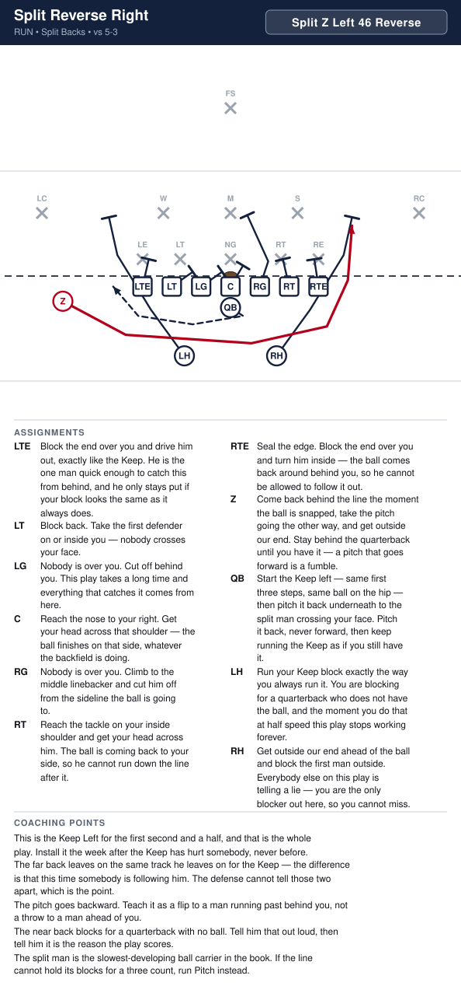

The Keep Left, until it is not. The quarterback and the near back start the Keep left and never stop selling it; the split man comes back underneath, takes a lateral going the other way and runs right behind the far back. The line blocks the side the ball actually ends up on, so the only thing the defense gets to see is the Keep.

| Position | Assignment |
|---|---|
| **LTE** | Block the end over you and drive him out, exactly like the Keep. He is the one man quick enough to catch this from behind, and he only stays put if your block looks the same as it always does. |
| **LT** | Block back. Take the first defender on or inside you — nobody crosses your face. |
| **LG** | Nobody is over you. Cut off behind you. This play takes a long time and everything that catches it comes from here. |
| **C** | Reach the nose to your right. Get your head across that shoulder — the ball finishes on that side, whatever the backfield is doing. |
| **RG** | Nobody is over you. Climb to the middle linebacker and cut him off from the sideline the ball is going to. |
| **RT** | Reach the tackle on your inside shoulder and get your head across him. The ball is coming back to your side, so he cannot run down the line after it. |
| **RTE** | Seal the edge. Block the end over you and turn him inside — the ball comes back around behind you, so he cannot be allowed to follow it out. |
| **Z** **(ball)** | Come back behind the line the moment the ball is snapped, take the pitch going the other way, and get outside our end. Stay behind the quarterback until you have it — a pitch that goes forward is a fumble. |
| **QB** | Start the Keep left — same first three steps, same ball on the hip — then pitch it back underneath to the split man crossing your face. Pitch it back, never forward, then keep running the Keep as if you still have it. |
| **LH** | Run your Keep block exactly the way you always run it. You are blocking for a quarterback who does not have the ball, and the moment you do that at half speed this play stops working forever. |
| **RH** | Get outside our end ahead of the ball and block the first man outside. Everybody else on this play is telling a lie — you are the only blocker out here, so you cannot miss. |

**Coaching points**

- This is the Keep Left for the first second and a half, and that is the whole play. Install it the week after the Keep has hurt somebody, never before.
- The far back leaves on the same track he leaves on for the Keep — the difference is that this time somebody is following him. The defense cannot tell those two apart, which is the point.
- The pitch goes backward. Teach it as a flip to a man running past behind you, not a throw to a man ahead of you.
- The near back blocks for a quarterback with no ball. Tell him that out loud, then tell him it is the reason the play scores.
- The split man is the slowest-developing ball carrier in the book. If the line cannot hold its blocks for a three count, run Pitch instead.

---

## Split Z Right Z Reverse Left

**Call it:** `Split Z Right 47 Z Reverse Left`

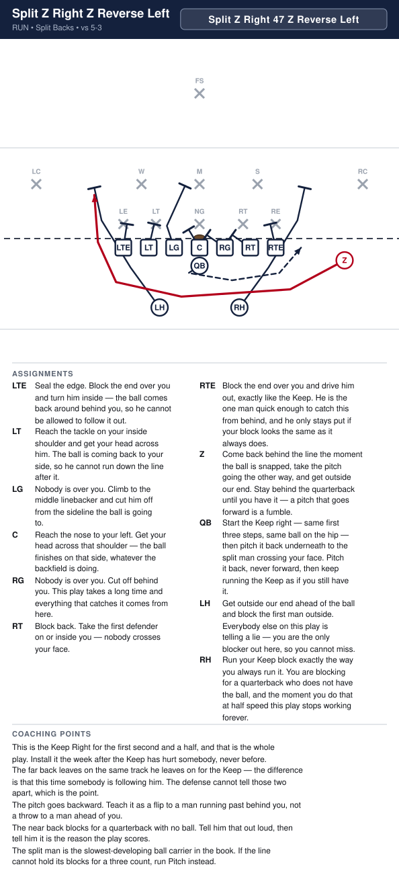

The Keep Right, until it is not. The quarterback and the near back start the Keep right and never stop selling it; the split man comes back underneath, takes a lateral going the other way and runs left behind the far back. The line blocks the side the ball actually ends up on, so the only thing the defense gets to see is the Keep.

| Position | Assignment |
|---|---|
| **LTE** | Seal the edge. Block the end over you and turn him inside — the ball comes back around behind you, so he cannot be allowed to follow it out. |
| **LT** | Reach the tackle on your inside shoulder and get your head across him. The ball is coming back to your side, so he cannot run down the line after it. |
| **LG** | Nobody is over you. Climb to the middle linebacker and cut him off from the sideline the ball is going to. |
| **C** | Reach the nose to your left. Get your head across that shoulder — the ball finishes on that side, whatever the backfield is doing. |
| **RG** | Nobody is over you. Cut off behind you. This play takes a long time and everything that catches it comes from here. |
| **RT** | Block back. Take the first defender on or inside you — nobody crosses your face. |
| **RTE** | Block the end over you and drive him out, exactly like the Keep. He is the one man quick enough to catch this from behind, and he only stays put if your block looks the same as it always does. |
| **Z** **(ball)** | Come back behind the line the moment the ball is snapped, take the pitch going the other way, and get outside our end. Stay behind the quarterback until you have it — a pitch that goes forward is a fumble. |
| **QB** | Start the Keep right — same first three steps, same ball on the hip — then pitch it back underneath to the split man crossing your face. Pitch it back, never forward, then keep running the Keep as if you still have it. |
| **LH** | Get outside our end ahead of the ball and block the first man outside. Everybody else on this play is telling a lie — you are the only blocker out here, so you cannot miss. |
| **RH** | Run your Keep block exactly the way you always run it. You are blocking for a quarterback who does not have the ball, and the moment you do that at half speed this play stops working forever. |

**Coaching points**

- This is the Keep Right for the first second and a half, and that is the whole play. Install it the week after the Keep has hurt somebody, never before.
- The far back leaves on the same track he leaves on for the Keep — the difference is that this time somebody is following him. The defense cannot tell those two apart, which is the point.
- The pitch goes backward. Teach it as a flip to a man running past behind you, not a throw to a man ahead of you.
- The near back blocks for a quarterback with no ball. Tell him that out loud, then tell him it is the reason the play scores.
- The split man is the slowest-developing ball carrier in the book. If the line cannot hold its blocks for a three count, run Pitch instead.

# Full House

---

## House Dive Right

**Call it:** `House 20 Dive`

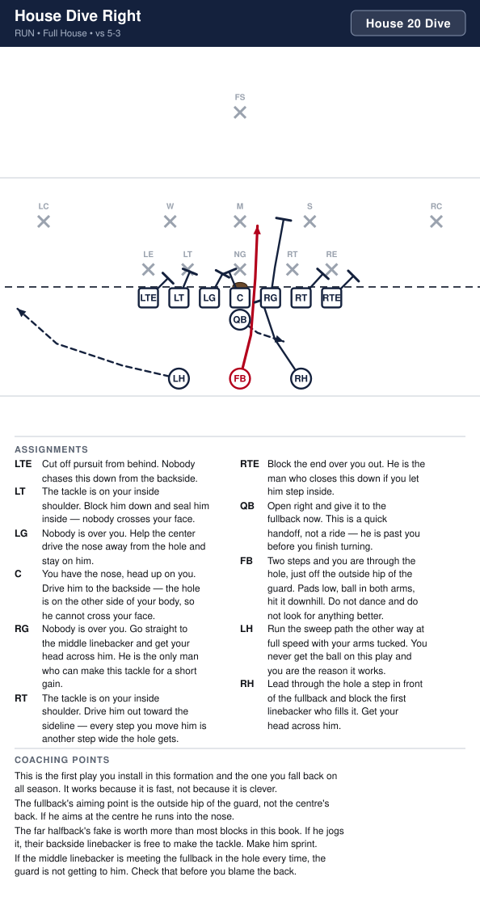

The fastest handoff in the book. The playside back is already standing behind the guard he is running past, so he is through the hole before the defense has read anything, and the other two backs leave on paths that threaten the edge and the middle at the same time.

| Position | Assignment |
|---|---|
| **LTE** | Cut off pursuit from behind. Nobody chases this down from the backside. |
| **LT** | The tackle is on your inside shoulder. Block him down and seal him inside — nobody crosses your face. |
| **LG** | Nobody is over you. Help the center drive the nose away from the hole and stay on him. |
| **C** | You have the nose, head up on you. Drive him to the backside — the hole is on the other side of your body, so he cannot cross your face. |
| **RG** | Nobody is over you. Go straight to the middle linebacker and get your head across him. He is the only man who can make this tackle for a short gain. |
| **RT** | The tackle is on your inside shoulder. Drive him out toward the sideline — every step you move him is another step wide the hole gets. |
| **RTE** | Block the end over you out. He is the man who closes this down if you let him step inside. |
| **Z** | Run the sweep path the other way at full speed with your arms tucked. You never get the ball on this play and you are the reason it works. |
| **QB** | Open right and give it to the playside back now. This is a quick handoff, not a ride — he is past you before you finish turning. |
| **FB** **(ball)** | Take one step to the quarterback and go straight ahead off the inside hip of the guard you are standing behind. Pads low, ball in both arms. Do not dance and do not look for anything better. |
| **TB** | You leave on the snap, so you get there first. Step to the hole and block the first linebacker who fills it. Get your head across him. |

**Coaching points**

- This is the first play you install in this formation and the one you fall back on all season. It works because it is fast, not because it is clever.
- The carrier is already lined up behind the guard he is running past. His only job is one step to the quarterback and then straight ahead off that guard's inside hip — if he aims at the center he runs into the nose.
- The deep back leaves on the snap and the carrier does not, which is the whole reason a lead block is even possible on a play this quick. If he waits to see the handoff he arrives behind the man he is supposed to block.
- The backside back's fake is worth more than most blocks in this book. If he jogs it, their backside linebacker is free to make the tackle. Make him sprint.
- If the middle linebacker is meeting the carrier in the hole every time, the guard is not getting to him. Check that before you blame the back.

---

## House Dive Left

**Call it:** `House 41 Dive`

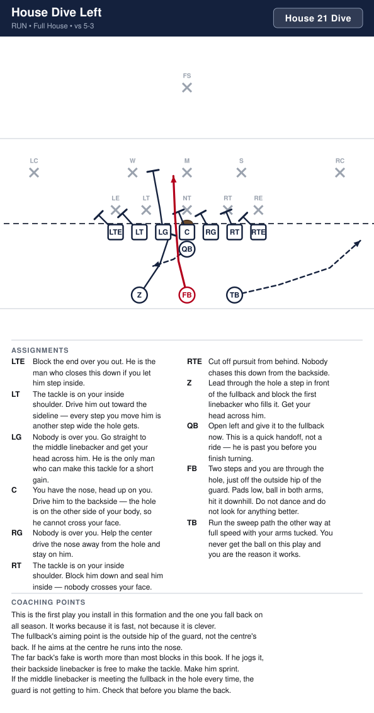

The fastest handoff in the book. The playside back is already standing behind the guard he is running past, so he is through the hole before the defense has read anything, and the other two backs leave on paths that threaten the edge and the middle at the same time.

| Position | Assignment |
|---|---|
| **LTE** | Block the end over you out. He is the man who closes this down if you let him step inside. |
| **LT** | The tackle is on your inside shoulder. Drive him out toward the sideline — every step you move him is another step wide the hole gets. |
| **LG** | Nobody is over you. Go straight to the middle linebacker and get your head across him. He is the only man who can make this tackle for a short gain. |
| **C** | You have the nose, head up on you. Drive him to the backside — the hole is on the other side of your body, so he cannot cross your face. |
| **RG** | Nobody is over you. Help the center drive the nose away from the hole and stay on him. |
| **RT** | The tackle is on your inside shoulder. Block him down and seal him inside — nobody crosses your face. |
| **RTE** | Cut off pursuit from behind. Nobody chases this down from the backside. |
| **Z** **(ball)** | Take one step to the quarterback and go straight ahead off the inside hip of the guard you are standing behind. Pads low, ball in both arms. Do not dance and do not look for anything better. |
| **QB** | Open left and give it to the playside back now. This is a quick handoff, not a ride — he is past you before you finish turning. |
| **FB** | Run the sweep path the other way at full speed with your arms tucked. You never get the ball on this play and you are the reason it works. |
| **TB** | You leave on the snap, so you get there first. Step to the hole and block the first linebacker who fills it. Get your head across him. |

**Coaching points**

- This is the first play you install in this formation and the one you fall back on all season. It works because it is fast, not because it is clever.
- The carrier is already lined up behind the guard he is running past. His only job is one step to the quarterback and then straight ahead off that guard's inside hip — if he aims at the center he runs into the nose.
- The deep back leaves on the snap and the carrier does not, which is the whole reason a lead block is even possible on a play this quick. If he waits to see the handoff he arrives behind the man he is supposed to block.
- The backside back's fake is worth more than most blocks in this book. If he jogs it, their backside linebacker is free to make the tackle. Make him sprint.
- If the middle linebacker is meeting the carrier in the hole every time, the guard is not getting to him. Check that before you blame the back.

---

## House Power Right

**Call it:** `House 34 Power`

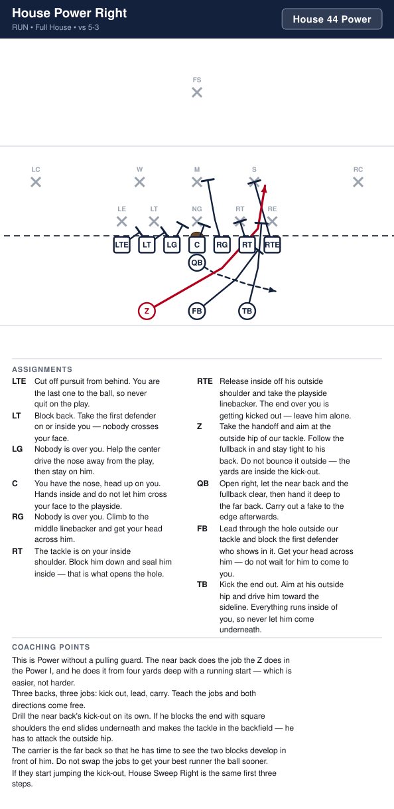

All three backs get a job. The playside back kicks the end out, the backside back wraps around and leads through the hole, and the deep back carries it in behind them both. Two lead blockers arrive in the same gap before the linebackers can fit, and the carrier is far enough back to see them do it.

| Position | Assignment |
|---|---|
| **LTE** | Cut off pursuit from behind. You are the last one to the ball, so never quit on the play. |
| **LT** | Block back. Take the first defender on or inside you — nobody crosses your face. |
| **LG** | Nobody is over you. Help the center drive the nose away from the play, then stay on him. |
| **C** | You have the nose, head up on you. Hands inside and do not let him cross your face to the playside. |
| **RG** | Nobody is over you. Climb to the middle linebacker and get your head across him. |
| **RT** | The tackle is on your inside shoulder. Block him down and seal him inside — that is what opens the hole. |
| **RTE** | Release inside off his outside shoulder and take the playside linebacker. The end over you is getting kicked out — leave him alone. |
| **Z** | You are the lead. Cross behind the quarterback, get to the hole outside our tackle and block the first defender who shows in it. Get your head across him — do not wait for him to come to you. |
| **QB** | Open right, let the playside back clear, then hand it to the deep back as he comes past you. Carry out a fake to the edge afterwards. |
| **FB** | Kick the end out. Aim at his outside hip and drive him toward the sideline. Everything runs inside of you, so never let him come underneath. |
| **TB** **(ball)** | Take the handoff and aim at the outside hip of our tackle. Follow the lead back in and stay tight to his back. Do not bounce it outside — the yards are inside the kick-out. |

**Coaching points**

- This is Power without a pulling guard. The playside back does the job the Z does in the Power I, and he does it from three and a half yards deep standing right beside the man he has to kick — which is easier, not harder.
- Three backs, three jobs: kick out, lead, carry. The two over the guards are one spot mirrored, so teach the jobs and both directions come free.
- Drill the kick-out on its own. If he blocks the end with square shoulders the end slides underneath and makes the tackle in the backfield — he has to attack the outside hip.
- The lead back has the longest trip on the play: he starts on the backside and has to cross the whole backfield. He leaves on the snap and he goes flat, not deep. If he is late, the carrier arrives at the hole alone.
- The deep back carries because he starts behind both blocks and can see them develop. Do not swap the jobs to get your best runner the ball sooner.
- If they start jumping the kick-out, House Sweep Right is the same first three steps.

---

## House Power Left

**Call it:** `House 35 Power`

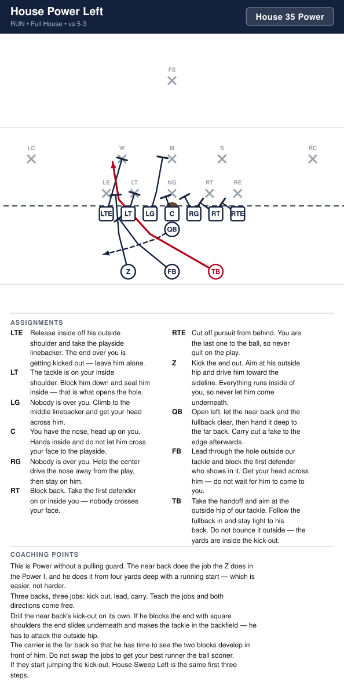

All three backs get a job. The playside back kicks the end out, the backside back wraps around and leads through the hole, and the deep back carries it in behind them both. Two lead blockers arrive in the same gap before the linebackers can fit, and the carrier is far enough back to see them do it.

| Position | Assignment |
|---|---|
| **LTE** | Release inside off his outside shoulder and take the playside linebacker. The end over you is getting kicked out — leave him alone. |
| **LT** | The tackle is on your inside shoulder. Block him down and seal him inside — that is what opens the hole. |
| **LG** | Nobody is over you. Climb to the middle linebacker and get your head across him. |
| **C** | You have the nose, head up on you. Hands inside and do not let him cross your face to the playside. |
| **RG** | Nobody is over you. Help the center drive the nose away from the play, then stay on him. |
| **RT** | Block back. Take the first defender on or inside you — nobody crosses your face. |
| **RTE** | Cut off pursuit from behind. You are the last one to the ball, so never quit on the play. |
| **Z** | Kick the end out. Aim at his outside hip and drive him toward the sideline. Everything runs inside of you, so never let him come underneath. |
| **QB** | Open left, let the playside back clear, then hand it to the deep back as he comes past you. Carry out a fake to the edge afterwards. |
| **FB** | You are the lead. Cross behind the quarterback, get to the hole outside our tackle and block the first defender who shows in it. Get your head across him — do not wait for him to come to you. |
| **TB** **(ball)** | Take the handoff and aim at the outside hip of our tackle. Follow the lead back in and stay tight to his back. Do not bounce it outside — the yards are inside the kick-out. |

**Coaching points**

- This is Power without a pulling guard. The playside back does the job the Z does in the Power I, and he does it from three and a half yards deep standing left beside the man he has to kick — which is easier, not harder.
- Three backs, three jobs: kick out, lead, carry. The two over the guards are one spot mirrored, so teach the jobs and both directions come free.
- Drill the kick-out on its own. If he blocks the end with square shoulders the end slides underneath and makes the tackle in the backfield — he has to attack the outside hip.
- The lead back has the longest trip on the play: he starts on the backside and has to cross the whole backfield. He leaves on the snap and he goes flat, not deep. If he is late, the carrier arrives at the hole alone.
- The deep back carries because he starts behind both blocks and can see them develop. Do not swap the jobs to get your best runner the ball sooner.
- If they start jumping the kick-out, House Sweep Left is the same first three steps.

---

## House Boot Right

**Call it:** `House 16 Boot`

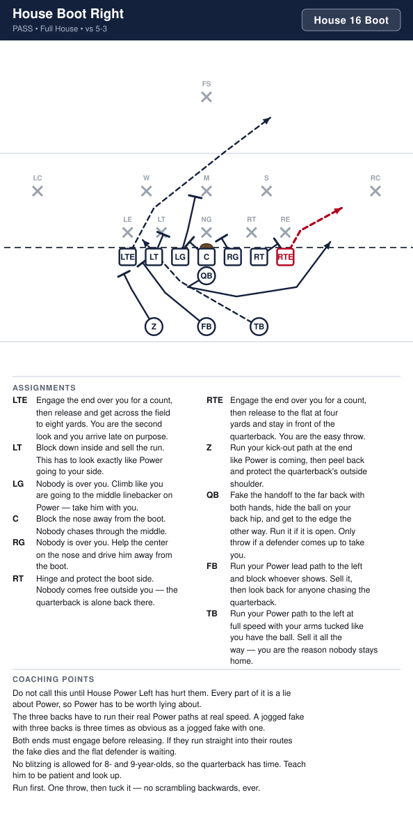

All three backs run their Power paths to the left and the quarterback keeps it right on his own. Three backs going one way is the hardest thing in this book to ignore, which is exactly why nobody is right on the other side.

| Position | Assignment |
|---|---|
| **LTE** | Engage the end over you for a count, then release and get across the field to eight yards. You are the second look and you arrive late on purpose. |
| **LT** | Block down inside and sell the run. This has to look exactly like Power going to your side. |
| **LG** | Nobody is over you. Climb like you are going to the middle linebacker on Power — take him with you. |
| **C** | Block the nose away from the boot. Nobody chases through the middle. |
| **RG** | Nobody is over you. Help the center on the nose and drive him away from the boot. |
| **RT** | Hinge and protect the boot side. Nobody comes free outside you — the quarterback is alone back there. |
| **RTE** **(ball)** | Engage the end over you for a count, then release to the flat at four yards and stay in front of the quarterback. You are the easy throw. |
| **Z** | Run your kick-out path at the end like Power is coming and get into him. Once the ball is gone, turn and look for anyone chasing the quarterback. |
| **QB** | Fake the handoff to the deep back with both hands, hide the ball on your back hip, and get to the edge the other way. Run it if it is open. Only throw if a defender comes up to take you. |
| **FB** | Run your Power lead path to the left and block whoever shows in the hole. Sell it, then look back for anyone chasing the quarterback. |
| **TB** | Run your Power path at full speed with your arms tucked like you have the ball. Sell it all the way — you are the man the fake goes to and the reason nobody stays home. |

**Coaching points**

- Do not call this until House Power Left has hurt them. Every part of it is a lie about Power, so Power has to be worth lying about.
- The three backs have to run their real Power paths at real speed. A jogged fake with three backs is three times as obvious as a jogged fake with one.
- The deep back is the one the quarterback fakes to, and he is the one the linebackers are watching. If he stands up out of his path after the mesh, the whole play dies.
- Both ends must engage before releasing. If they run straight into their routes the fake dies and the flat defender is waiting.
- No blitzing is allowed for 8- and 9-year-olds, so the quarterback has time. Teach him to be patient and look up.
- Run first. One throw, then tuck it — no scrambling backwards, ever.

---

## House Boot Left

**Call it:** `House 17 Boot`

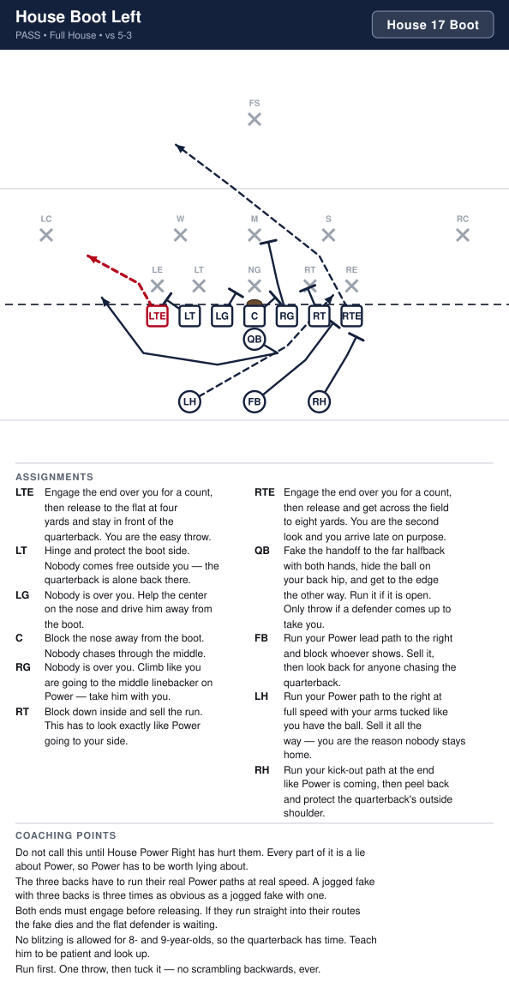

All three backs run their Power paths to the right and the quarterback keeps it left on his own. Three backs going one way is the hardest thing in this book to ignore, which is exactly why nobody is left on the other side.

| Position | Assignment |
|---|---|
| **LTE** **(ball)** | Engage the end over you for a count, then release to the flat at four yards and stay in front of the quarterback. You are the easy throw. |
| **LT** | Hinge and protect the boot side. Nobody comes free outside you — the quarterback is alone back there. |
| **LG** | Nobody is over you. Help the center on the nose and drive him away from the boot. |
| **C** | Block the nose away from the boot. Nobody chases through the middle. |
| **RG** | Nobody is over you. Climb like you are going to the middle linebacker on Power — take him with you. |
| **RT** | Block down inside and sell the run. This has to look exactly like Power going to your side. |
| **RTE** | Engage the end over you for a count, then release and get across the field to eight yards. You are the second look and you arrive late on purpose. |
| **Z** | Run your Power lead path to the right and block whoever shows in the hole. Sell it, then look back for anyone chasing the quarterback. |
| **QB** | Fake the handoff to the deep back with both hands, hide the ball on your back hip, and get to the edge the other way. Run it if it is open. Only throw if a defender comes up to take you. |
| **FB** | Run your kick-out path at the end like Power is coming and get into him. Once the ball is gone, turn and look for anyone chasing the quarterback. |
| **TB** | Run your Power path at full speed with your arms tucked like you have the ball. Sell it all the way — you are the man the fake goes to and the reason nobody stays home. |

**Coaching points**

- Do not call this until House Power Right has hurt them. Every part of it is a lie about Power, so Power has to be worth lying about.
- The three backs have to run their real Power paths at real speed. A jogged fake with three backs is three times as obvious as a jogged fake with one.
- The deep back is the one the quarterback fakes to, and he is the one the linebackers are watching. If he stands up out of his path after the mesh, the whole play dies.
- Both ends must engage before releasing. If they run straight into their routes the fake dies and the flat defender is waiting.
- No blitzing is allowed for 8- and 9-year-olds, so the quarterback has time. Teach him to be patient and look up.
- Run first. One throw, then tuck it — no scrambling backwards, ever.

---

## House Sweep Right

**Call it:** `House 38 Sweep`

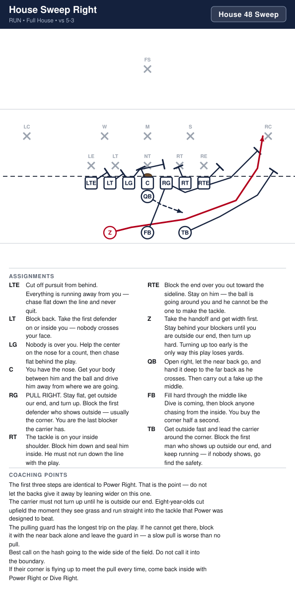

The same first three steps as Power, taken all the way outside. The playside back and the pulling guard get around the corner in front of the carrier, and a defense that has been fighting the kick-out inside is a step late getting there.

| Position | Assignment |
|---|---|
| **LTE** | Cut off pursuit from behind. Everything is running away from you — chase flat down the line and never quit. |
| **LT** | Block back. Take the first defender on or inside you — nobody crosses your face. |
| **LG** | Nobody is over you. Help the center on the nose for a count, then chase flat behind the play. |
| **C** | You have the nose. Get your body between him and the ball and drive him away from where we are going. |
| **RG** | PULL RIGHT. Stay flat, get outside our end, and turn up. Block the first defender who shows outside — usually the corner. You are the last blocker the carrier has. |
| **RT** | The tackle is on your inside shoulder. Block him down and seal him inside. He must not run down the line with the play. |
| **RTE** | Block the end over you out toward the sideline. Stay on him — the ball is going around you and he cannot be the one to make the tackle. |
| **Z** | Fill hard through the middle like Dive is coming, then block anyone chasing from the inside. You buy the corner half a second. |
| **QB** | Open right, let the playside back go, and hand it to the deep back as he crosses behind you. Then carry out a fake up the middle. |
| **FB** | Get outside fast and lead the carrier around the corner. Block the first man who shows up outside our end, and keep running — if nobody shows, go find the safety. |
| **TB** **(ball)** | Take the handoff and get width first. Stay behind your blockers until you are outside our end, then turn up hard. Turning up too early is the only way this play loses yards. |

**Coaching points**

- The first three steps are identical to Power Right. That is the point — do not let the backs give it away by leaning wider on this one.
- The carrier must not turn up until he is outside our end. Eight-year-olds cut upfield the moment they see grass and run straight into the tackle that Power was designed to beat.
- The playside back is closer to the corner than the carrier is and starts on the snap, so getting there first is a question of effort, not speed. Time it in practice with both of them going.
- The pulling guard has the longest trip on the play. If he cannot get there, block it with the playside back alone and leave the guard in — a slow pull is worse than no pull.
- Best call on the hash going to the wide side of the field. Do not call it into the boundary.
- If their corner is flying up to meet the pull every time, come back inside with Power Right or Dive Right.

---

## House Sweep Left

**Call it:** `House 39 Sweep`

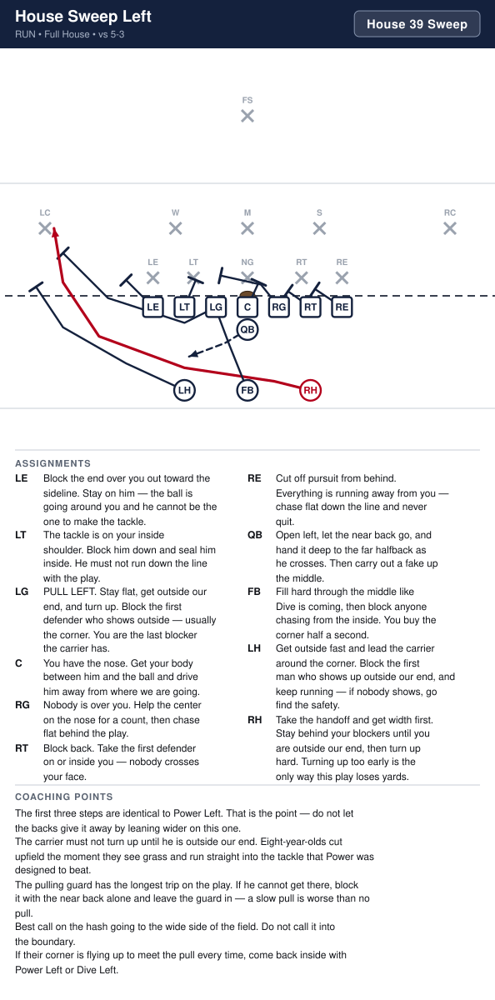

The same first three steps as Power, taken all the way outside. The playside back and the pulling guard get around the corner in front of the carrier, and a defense that has been fighting the kick-out inside is a step late getting there.

| Position | Assignment |
|---|---|
| **LTE** | Block the end over you out toward the sideline. Stay on him — the ball is going around you and he cannot be the one to make the tackle. |
| **LT** | The tackle is on your inside shoulder. Block him down and seal him inside. He must not run down the line with the play. |
| **LG** | PULL LEFT. Stay flat, get outside our end, and turn up. Block the first defender who shows outside — usually the corner. You are the last blocker the carrier has. |
| **C** | You have the nose. Get your body between him and the ball and drive him away from where we are going. |
| **RG** | Nobody is over you. Help the center on the nose for a count, then chase flat behind the play. |
| **RT** | Block back. Take the first defender on or inside you — nobody crosses your face. |
| **RTE** | Cut off pursuit from behind. Everything is running away from you — chase flat down the line and never quit. |
| **Z** | Get outside fast and lead the carrier around the corner. Block the first man who shows up outside our end, and keep running — if nobody shows, go find the safety. |
| **QB** | Open left, let the playside back go, and hand it to the deep back as he crosses behind you. Then carry out a fake up the middle. |
| **FB** | Fill hard through the middle like Dive is coming, then block anyone chasing from the inside. You buy the corner half a second. |
| **TB** **(ball)** | Take the handoff and get width first. Stay behind your blockers until you are outside our end, then turn up hard. Turning up too early is the only way this play loses yards. |

**Coaching points**

- The first three steps are identical to Power Left. That is the point — do not let the backs give it away by leaning wider on this one.
- The carrier must not turn up until he is outside our end. Eight-year-olds cut upfield the moment they see grass and run straight into the tackle that Power was designed to beat.
- The playside back is closer to the corner than the carrier is and starts on the snap, so getting there first is a question of effort, not speed. Time it in practice with both of them going.
- The pulling guard has the longest trip on the play. If he cannot get there, block it with the playside back alone and leave the guard in — a slow pull is worse than no pull.
- Best call on the hash going to the wide side of the field. Do not call it into the boundary.
- If their corner is flying up to meet the pull every time, come back inside with Power Left or Dive Left.

