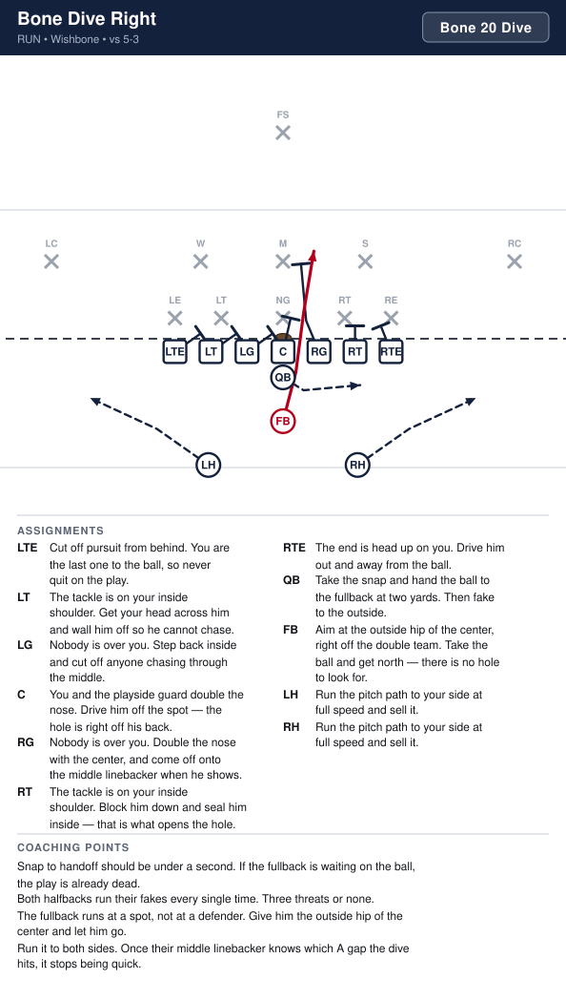
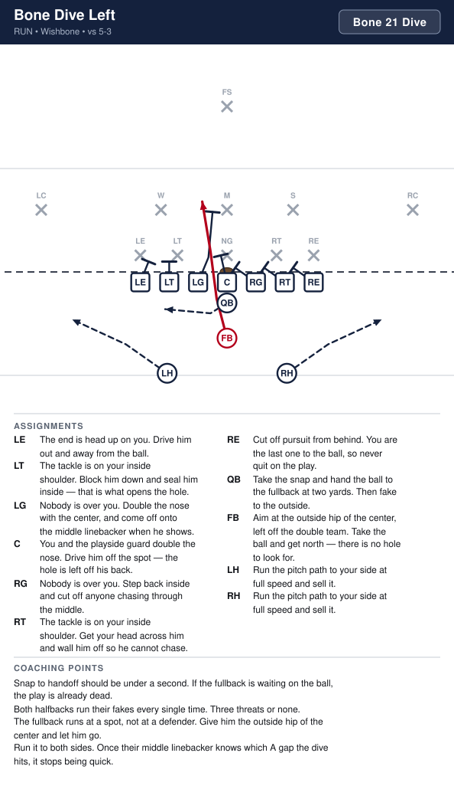

# Sayville 8U Playbook

_Generated by `generator/render.py`. Edit the JSON under `playbook/`, not this file._

Terminology and authoring rules: [playbook/CLAUDE.md](playbook/CLAUDE.md)

| # | Play | Call | Type | Formation | Ball |
|---|---|---|---|---|---|
| 1 | [I Dive Right](#i-dive-right) | `I Z Right 22 Dive` | run | I | FB |
| 2 | [I Dive Left](#i-dive-left) | `I Z Right 21 Dive` | run | I | FB |
| 3 | [I Iso Right](#i-iso-right) | `I Z Right 34 Iso` | run | I | TB |
| 4 | [I Iso Left](#i-iso-left) | `I Z Right 33 Iso` | run | I | TB |
| 5 | [I Power Right](#i-power-right) | `I Z Right 36 Power` | run | I | TB |
| 6 | [I Power Left](#i-power-left) | `I Z Right 35 Power` | run | I | TB |
| 7 | [I Slant Right](#i-slant-right) | `I Z Right 38 Slant` | run | I | TB |
| 8 | [I Slant Left](#i-slant-left) | `I Z Right 37 Slant` | run | I | TB |
| 9 | [I Counter Left](#i-counter-left) | `I Z Right 35 Counter` | run | I | TB |
| 10 | [I Boot Right](#i-boot-right) | `I Z Right 18 Boot` | pass | I | Z |
| 11 | [Bone Dive Right](#bone-dive-right) | `Bone 22 Dive` | run | Wishbone | FB |
| 12 | [Bone Dive Left](#bone-dive-left) | `Bone 21 Dive` | run | Wishbone | FB |
| 13 | [Bone Power Right](#bone-power-right) | `Bone 44 Power` | run | Wishbone | LH |
| 14 | [Bone Power Left](#bone-power-left) | `Bone 33 Power` | run | Wishbone | RH |
| 15 | [Bone Pitch Right](#bone-pitch-right) | `Bone 48 Pitch` | run | Wishbone | LH |
| 16 | [Bone Pitch Left](#bone-pitch-left) | `Bone 37 Pitch` | run | Wishbone | RH |
| 17 | [Bone Counter Right](#bone-counter-right) | `Bone 44 Counter` | run | Wishbone | LH |
| 18 | [Bone Counter Left](#bone-counter-left) | `Bone 33 Counter` | run | Wishbone | RH |

# I-Formation

---

## I Dive Right

**Call it:** `I Z Right 22 Dive`

The quickest handoff in the book. The fullback is through the line before their linebackers have read anything. We run it to remind them the middle is not free, which is what makes the slant work later.

| Position | Assignment |
|---|---|
| **LE** | Cut off pursuit from behind. You are the last one to the ball, so never quit on the play. |
| **LT** | The tackle is on your inside shoulder. Get your head across him and wall him off so he cannot chase. |
| **LG** | Nobody is over you. Step back inside and cut off anyone chasing through the middle. |
| **C** | You and the playside guard double the nose. Drive him off the spot — the hole is right off his back. |
| **RG** | Nobody is over you. Double the nose with the center, and come off onto the middle linebacker when he shows. |
| **RT** | The tackle is on your inside shoulder. Block him down and seal him inside — that is what opens the hole. |
| **RE** | The end is head up on you. Drive him out and away from the ball. |
| **Z** | Release and screen the corner on your side. Get in his way and stay there. |
| **QB** | Take the snap, open a quarter turn and hand to the fullback at two yards. Then carry out a fake to the outside. |
| **FB** **(ball)** | Aim at the outside hip of the center, right off the double team. Take the ball and get north — no reading, no dancing. |
| **TB** | Run the slant path outside and sell it. You will not get the ball on this play. |

**Coaching points**

- Snap to handoff should be under a second. If the fullback is waiting on the ball, the play is already dead.
- Best call when their linebackers start cheating wide to stop the slant.
- The fullback runs at a spot, not at a defender. Give him the outside hip of the center and let him go.
- Best short-yardage call in the book. Nobody has to read anything and the ball is over the line before the defense moves.

---

## I Dive Left

**Call it:** `I Z Right 21 Dive`

The same quick handoff through the other A gap. Worth having both so the fullback is not always going to the same side of the center — once their middle linebacker knows which way the dive hits, it stops being quick.

| Position | Assignment |
|---|---|
| **LE** | The end is head up on you. Drive him out and away from the ball. |
| **LT** | The tackle is on your inside shoulder. Block him down and seal him inside — that is what opens the hole. |
| **LG** | Nobody is over you. Double the nose with the center, and come off onto the middle linebacker when he shows. |
| **C** | You and the playside guard double the nose. Drive him off the spot — the hole is right off his back. |
| **RG** | Nobody is over you. Step back inside and cut off anyone chasing through the middle. |
| **RT** | The tackle is on your inside shoulder. Get your head across him and wall him off so he cannot chase. |
| **RE** | Cut off pursuit from behind. You are the last one to the ball, so never quit on the play. |
| **Z** | Come across behind the line and cut off the corner chasing from the backside. |
| **QB** | Take the snap, open a quarter turn and hand to the fullback at two yards. Then carry out a fake to the outside. |
| **FB** **(ball)** | Aim at the outside hip of the center, right off the double team. Take the ball and get north — no reading, no dancing. |
| **TB** | Run the slant path outside and sell it. You will not get the ball on this play. |

**Coaching points**

- Snap to handoff should be under a second. If the fullback is waiting on the ball, the play is already dead.
- Run it the same week you install the right-hand one. The whole value of having both is that their middle linebacker cannot lean.
- The fullback runs at a spot, not at a defender. Give him the outside hip of the center and let him go.
- The flanker is away from the play here, so he has further to travel to cut off the backside. He leaves on the snap.

---

## I Iso Right

**Call it:** `I Z Right 34 Iso`

The whole play is one block: the fullback isolates their linebacker in the hole and the tailback runs off whichever way that block goes. It teaches a back to read a block, which is the skill this formation is here to build.

| Position | Assignment |
|---|---|
| **LE** | Cut off pursuit from behind. You are the last one to the ball, so never quit on the play. |
| **LT** | The tackle is on your inside shoulder. Get your head across him and wall him off so he cannot chase. |
| **LG** | Nobody is over you. Step back inside and cut off anyone chasing through the middle. |
| **C** | You have the nose, head up on you. Hands inside and do not let him cross your face to the playside. |
| **RG** | The tackle sits in the gap outside you. You and our tackle double him — hands inside, drive him backwards. |
| **RT** | Double the tackle on your inside shoulder with the guard. Drive him back, and if the middle linebacker runs through, the guard comes off onto him. |
| **RE** | The end is head up on you. Drive him out and widen the hole. |
| **Z** | Release and screen the corner on your side. Get in his way and stay there. |
| **QB** | Reverse pivot and hand the ball to the tailback at four yards. Then clear out and fake wide. |
| **FB** | Lead through the hole and put your facemask on the linebacker sitting over the double team. Move him any direction — just move him. |
| **TB** **(ball)** | Take the handoff at four yards, get downhill behind the fullback, and cut off his block. If he takes the linebacker outside, you go inside. |

**Coaching points**

- Drill the fullback's block by itself with a bag. He does not have to win — he has to make the linebacker pick a side.
- Teach the tailback one rule: cut off the fullback's back. Do not let him decide before he gets there.
- If their linebacker is faster than our fullback, stop calling this and run I Power instead.
- The tailback should be running downhill at the hole, not sideways looking for one.

---

## I Iso Left

**Call it:** `I Z Right 33 Iso`

The same isolation block the other way. The flanker stays where he is, so this runs away from our strength — which is exactly why it is open.

| Position | Assignment |
|---|---|
| **LE** | The end is head up on you. Drive him out and widen the hole. |
| **LT** | Double the tackle on your inside shoulder with the guard. Drive him back, and if the middle linebacker runs through, the guard comes off onto him. |
| **LG** | The tackle sits in the gap outside you. You and our tackle double him — hands inside, drive him backwards. |
| **C** | You have the nose, head up on you. Hands inside and do not let him cross your face to the playside. |
| **RG** | Nobody is over you. Step back inside and cut off anyone chasing through the middle. |
| **RT** | The tackle is on your inside shoulder. Get your head across him and wall him off so he cannot chase. |
| **RE** | Cut off pursuit from behind. You are the last one to the ball, so never quit on the play. |
| **Z** | Come across behind the line and cut off anybody chasing from the backside. |
| **QB** | Reverse pivot and hand the ball to the tailback at four yards. Then clear out and fake wide. |
| **FB** | Lead through the hole and put your facemask on the linebacker sitting over the double team. Move him any direction — just move him. |
| **TB** **(ball)** | Take the handoff at four yards, get downhill behind the fullback, and cut off his block. |

**Coaching points**

- Running away from the flanker means one fewer blocker out there, so the tailback has to get north fast.
- Their defense will usually shade toward our flanker. That is the reason this play exists — check it before you call it.
- Same block, same read as I Iso Right. Do not teach it as a new play, teach it as the same play flipped.

---

## I Power Right

**Call it:** `I Z Right 36 Power`

The power run out of the I. Playside blocks down, the fullback kicks out the end man, and the backside guard pulls and wraps. Same down-block-and-kick-out rules the Wishbone power uses, so the two halves of the book teach each other.

| Position | Assignment |
|---|---|
| **LE** | Cut off pursuit from behind. You are the last one to the ball, so never quit on the play. |
| **LT** | Block back. Take the first defender on or inside you — nobody crosses your face. |
| **LG** | PULL RIGHT. Run flat behind the line and turn up in the open gap between our tackle and our end. Block the first wrong-colored jersey you see. |
| **C** | You have the nose, head up on you. Hands inside and do not let him cross your face to the playside. |
| **RG** | Nobody is over you. Help the center drive the nose for one count, then climb to the middle linebacker. |
| **RT** | The tackle is on your inside shoulder. Block him down and seal him inside — that is what opens the hole. |
| **RE** | Release inside off his outside shoulder and take the playside linebacker. The end over you is being kicked out — leave him alone. |
| **Z** | Release and screen the corner on your side. Get in his way and stay there. |
| **QB** | Reverse pivot, hand the ball to the tailback deep, then carry out the bootleg fake away from the play. |
| **FB** | Kick out the end. Aim at his inside hip and run through him — do not stop your feet. |
| **TB** **(ball)** | Take the handoff, press the outside hip of our tackle, then turn up inside the pulling guard. Be patient for one step, then go. |

**Coaching points**

- Same down-block-and-kick-out rules as Bone Power. If the kids know one they know both — say that out loud when you install it.
- The tailback starts deeper than the wishbone halfback does, so the kick-out block has to hold a beat longer. Drill it on a count.
- The pulling guard stays flat and tight to the line. Bellying back is what makes this play late.
- If the pulling guard cannot get there in time, run I Iso instead — it needs no pullers.

---

## I Power Left

**Call it:** `I Z Right 35 Power`

Power to the weak side. The flanker is not out there to help, so the kick-out and the wrap have to be clean — but their defense is usually leaning the other way.

| Position | Assignment |
|---|---|
| **LE** | Release inside off his outside shoulder and take the playside linebacker. The end over you is being kicked out — leave him alone. |
| **LT** | The tackle is on your inside shoulder. Block him down and seal him inside — that is what opens the hole. |
| **LG** | Nobody is over you. Help the center drive the nose for one count, then climb to the middle linebacker. |
| **C** | You have the nose, head up on you. Hands inside and do not let him cross your face to the playside. |
| **RG** | PULL LEFT. Run flat behind the line and turn up in the open gap between our tackle and our end. Block the first wrong-colored jersey you see. |
| **RT** | Block back. Take the first defender on or inside you — nobody crosses your face. |
| **RE** | Cut off pursuit from behind. You are the last one to the ball, so never quit on the play. |
| **Z** | Come across behind the line and cut off anybody chasing from the backside. |
| **QB** | Reverse pivot, hand the ball to the tailback deep, then carry out the bootleg fake away from the play. |
| **FB** | Kick out the end. Aim at his inside hip and run through him — do not stop your feet. |
| **TB** **(ball)** | Take the handoff, press the outside hip of our tackle, then turn up inside the pulling guard. |

**Coaching points**

- Check their alignment first. If they have shaded toward our flanker, this is the call.
- The flanker chases from behind. Tell him he is not decoration — he cuts off the corner who would otherwise run this down.
- Everything else is I Power Right in a mirror. Teach the pair together.

---

## I Slant Right

**Call it:** `I Z Right 38 Slant`

Get outside. The fullback and the flanker are both out in front and the tailback has room to run. This is the play that makes them widen out, which is what opens the dive and the iso.

| Position | Assignment |
|---|---|
| **LE** | Cut off pursuit from behind. You are the last one to the ball, so never quit on the play. |
| **LT** | Block back. Take the first defender on or inside you — nobody crosses your face. |
| **LG** | Nobody is over you. Cut off the backside — nothing chases this from behind. |
| **C** | Reach the nose. Get your head across his playside shoulder so he cannot run down the line. |
| **RG** | Nobody is over you. Climb straight to the middle linebacker and cut him off from the sideline. |
| **RT** | The tackle is on your inside shoulder. Get your head across him and wall him off so he cannot chase. |
| **RE** | Reach the end over you. If you cannot reach him, turn him inside and let the ball go around. |
| **Z** | Block the corner on your side. Run at his outside number and screen him away from the ball. |
| **QB** | Reverse pivot and hand the ball to the tailback as deep as you can. Then boot away and sell it. |
| **FB** | Beat the tailback to the corner and kick out the first defender who shows. You are the lead blocker — get there first. |
| **TB** **(ball)** | Take the handoff at full speed and get to the corner. Turn up when the fullback blocks somebody, not before. |

**Coaching points**

- The tailback is deep enough to get outside — but only if he is at full speed by the time he takes the handoff.
- The fullback has to beat the tailback to the corner. If he is trailing, the play has no lead blocker.
- One rule for the tailback: turn up off the fullback's block. Running to the sideline is how this play loses eight yards.
- Watch our end reach-blocking. If he cannot reach their end, run I Power to that side instead.

---

## I Slant Left

**Call it:** `I Z Right 37 Slant`

The same run away from the flanker. There is one fewer blocker out there, so the fullback has to be perfect getting to the corner — but their defense is usually leaning toward our flanker, which is exactly why it is open.

| Position | Assignment |
|---|---|
| **LE** | Reach the end over you. If you cannot reach him, turn him inside and let the ball go around. |
| **LT** | The tackle is on your inside shoulder. Get your head across him and wall him off so he cannot chase. |
| **LG** | Nobody is over you. Climb straight to the middle linebacker and cut him off from the sideline. |
| **C** | Reach the nose. Get your head across his playside shoulder so he cannot run down the line. |
| **RG** | Nobody is over you. Cut off the backside — nothing chases this from behind. |
| **RT** | Block back. Take the first defender on or inside you — nobody crosses your face. |
| **RE** | Cut off pursuit from behind. You are the last one to the ball, so never quit on the play. |
| **Z** | Come across behind the line and cut off the corner chasing from the backside. You are not decoration on this one. |
| **QB** | Reverse pivot and hand the ball to the tailback as deep as you can. Then boot away and sell it. |
| **FB** | Beat the tailback to the corner and kick out the first defender who shows. You are the lead blocker — get there first. |
| **TB** **(ball)** | Take the handoff at full speed and get to the corner. Turn up when the fullback blocks somebody, not before. |

**Coaching points**

- Check their alignment first. If they have shifted toward our flanker, this is the call.
- The fullback has further to travel here than he does going right, so he has to leave on the snap. If he trails the tailback the play has no lead blocker.
- One rule for the tailback: turn up off the fullback's block. Running to the sideline is how this play loses eight yards.
- The flanker chases from behind. Tell him he is the reason a fast corner does not run this down from the backside.

---

## I Counter Left

**Call it:** `I Z Right 35 Counter`

Misdirection off the slant. We show them the slant to the flanker side, their linebackers chase, and the tailback plants and comes back weak behind a pulling guard.

| Position | Assignment |
|---|---|
| **LE** | Release inside off his outside shoulder and take the playside linebacker. The end over you is being kicked out — leave him alone. |
| **LT** | The tackle is on your inside shoulder. Block him down and seal him inside — that is what opens the hole. |
| **LG** | Nobody is over you. Help the center drive the nose for one count, then climb to the middle linebacker. |
| **C** | You have the nose, head up on you. Hands inside and do not let him cross your face to the playside. |
| **RG** | PULL LEFT. Stay flat behind the line and kick out the end on the other side. |
| **RT** | Block back. Take the first defender on or inside you — nobody crosses your face. |
| **RE** | Cut off pursuit from behind. You are the last one to the ball, so never quit on the play. |
| **Z** | Take one hard step upfield like the slant is coming, then come back and cut off the backside. |
| **QB** | Take the snap, fake the slant the other way with both hands, then turn back and hand to the tailback. The fake comes first — the handoff is late on purpose. |
| **FB** | Run the slant path to the other side at full speed and block anything that shows. You are the lie. |
| **TB** **(ball)** | Take two hard steps toward the slant, then plant and come back behind the pulling guard. Those two steps are the entire play. |

**Coaching points**

- Do not call this until I Slant Right has gone for real yards. Misdirection off a play they do not fear is just a slower run.
- The tailback's counter steps must be full speed and full length. A shuffle fools nobody.
- The fullback selling the slant matters more than his block. Tell him he is the decoy and mean it.
- If their backside linebacker stops chasing the slant, go back to I Power Left.

---

## I Boot Right

**Call it:** `I Z Right 18 Boot`

Play action off the slant look. Two receivers to the flanker side and a quarterback with the whole edge to himself. Run first, throw second.

| Position | Assignment |
|---|---|
| **LE** | Block down inside and sell the run. This has to look exactly like the slant going the other way. |
| **LT** | The tackle is on your inside shoulder. Block him down and seal him inside — that is what opens the hole. |
| **LG** | Nobody is over you. Help the center on the nose and drive him away from the boot. |
| **C** | Block the nose back toward the boot side. Nobody chases through the middle. |
| **RG** | PULL LEFT and run the slant path to sell the fake. You are a decoy — take a linebacker with you. |
| **RT** | Hinge and protect the boot side. Nobody comes free outside you — the quarterback is alone back there. |
| **RE** | Engage the end over you for a count, then release and settle at eight yards on the boot side. |
| **Z** **(ball)** | Run to the flat at four yards and stay in front of the quarterback. You are the easy throw. |
| **QB** | Fake the slant with both hands, hide the ball on your back hip, and get to the edge. Run it if it is open. Only throw if a defender comes up to take you. |
| **FB** | Run the slant path away from the boot and block whatever shows. Sell it. |
| **TB** | Run the full slant path away from the boot with your arms tucked like you have the ball. Sell it all the way to the sideline. |

**Coaching points**

- Our ends must engage their end before releasing — sell the run first, then get out.
- Run first. At this age the quarterback usually walks into ten yards before anyone finds him.
- No blitzing is allowed for 8- and 9-year-olds, so the quarterback has time. Teach him to be patient and look up.
- One throw, then tuck it. No scrambling backwards, ever.

# Wishbone

---

## Bone Dive Right

**Call it:** `Bone 22 Dive`

The fullback right now, off a double team on the nose. This is the play that has to work before anything else in the formation does — it is what holds their linebackers inside and makes the pitch go.

| Position | Assignment |
|---|---|
| **LE** | Cut off pursuit from behind. You are the last one to the ball, so never quit on the play. |
| **LT** | The tackle is on your inside shoulder. Get your head across him and wall him off so he cannot chase. |
| **LG** | Nobody is over you. Step back inside and cut off anyone chasing through the middle. |
| **C** | You and the playside guard double the nose. Drive him off the spot — the hole is right off his back. |
| **RG** | Nobody is over you. Double the nose with the center, and come off onto the middle linebacker when he shows. |
| **RT** | The tackle is on your inside shoulder. Block him down and seal him inside — that is what opens the hole. |
| **RE** | The end is head up on you. Drive him out and away from the ball. |
| **QB** | Take the snap and hand the ball to the fullback at two yards. Then fake to the outside. |
| **FB** **(ball)** | Aim at the outside hip of the center, right off the double team. Take the ball and get north — there is no hole to look for. |
| **LH** | Run the pitch path to your side at full speed and sell it. |
| **RH** | Run the pitch path to your side at full speed and sell it. |

**Coaching points**

- Snap to handoff should be under a second. If the fullback is waiting on the ball, the play is already dead.
- Both halfbacks run their fakes every single time. Three threats or none.
- The fullback runs at a spot, not at a defender. Give him the outside hip of the center and let him go.
- Run it to both sides. Once their middle linebacker knows which A gap the dive hits, it stops being quick.

---

## Bone Dive Left

**Call it:** `Bone 21 Dive`

The fullback left now, off a double team on the nose. This is the play that has to work before anything else in the formation does — it is what holds their linebackers inside and makes the pitch go.

| Position | Assignment |
|---|---|
| **LE** | The end is head up on you. Drive him out and away from the ball. |
| **LT** | The tackle is on your inside shoulder. Block him down and seal him inside — that is what opens the hole. |
| **LG** | Nobody is over you. Double the nose with the center, and come off onto the middle linebacker when he shows. |
| **C** | You and the playside guard double the nose. Drive him off the spot — the hole is left off his back. |
| **RG** | Nobody is over you. Step back inside and cut off anyone chasing through the middle. |
| **RT** | The tackle is on your inside shoulder. Get your head across him and wall him off so he cannot chase. |
| **RE** | Cut off pursuit from behind. You are the last one to the ball, so never quit on the play. |
| **QB** | Take the snap and hand the ball to the fullback at two yards. Then fake to the outside. |
| **FB** **(ball)** | Aim at the outside hip of the center, left off the double team. Take the ball and get north — there is no hole to look for. |
| **LH** | Run the pitch path to your side at full speed and sell it. |
| **RH** | Run the pitch path to your side at full speed and sell it. |

**Coaching points**

- Snap to handoff should be under a second. If the fullback is waiting on the ball, the play is already dead.
- Both halfbacks run their fakes every single time. Three threats or none.
- The fullback runs at a spot, not at a defender. Give him the outside hip of the center and let him go.
- Run it to both sides. Once their middle linebacker knows which A gap the dive hits, it stops being quick.

---

## Bone Power Right

**Call it:** `Bone 44 Power`

Off-tackle power, but the ball goes to the far halfback. He crosses behind the fullback and takes a deep handoff, which puts him behind the pulling guard with a full head of steam and gives their linebackers an extra beat of doubt about who has it. The near halfback leads and the fullback kicks out.

| Position | Assignment |
|---|---|
| **LE** | Cut off pursuit from behind. You are the last one to the ball, so never quit on the play. |
| **LT** | Block back. Take the first defender on or inside you — nobody crosses your face. |
| **LG** | PULL RIGHT. Run flat behind the line and turn up in the open gap between our tackle and our end. Take the first wrong-colored jersey. |
| **C** | You have the nose, head up on you. Hands inside and do not let him cross your face to the playside. |
| **RG** | Nobody is over you. Help the center drive the nose for one count, then climb to the middle linebacker. |
| **RT** | The tackle is on your inside shoulder. Block him down and seal him inside — that is what opens the hole. |
| **RE** | Release inside off his outside shoulder and take the playside linebacker. The end over you is being kicked out — leave him alone. |
| **QB** | Open to the playside and hand deep to the halfback crossing from the backside. Let him come to you, then fake away. |
| **FB** | Kick out the end. Aim at his inside hip and run through him. |
| **LH** **(ball)** | You carry it. Cross behind the fullback, take the handoff deep, then press the outside hip of our tackle and turn up inside the blocks. |
| **RH** | Lead through the hole ahead of the ball. Take the first jersey inside the kick-out. |

**Coaching points**

- The far halfback travels further than the near one, and that is the point — he arrives behind the pulling guard instead of beating him to the hole.
- Two lead blockers and a pulling guard arrive in the same place. Walk it through slowly first or they will run into each other.
- If the handoff is late, the quarterback is reaching. He holds the ball still and lets the back run through it.

---

## Bone Power Left

**Call it:** `Bone 33 Power`

Off-tackle power, but the ball goes to the far halfback. He crosses behind the fullback and takes a deep handoff, which puts him behind the pulling guard with a full head of steam and gives their linebackers an extra beat of doubt about who has it. The near halfback leads and the fullback kicks out.

| Position | Assignment |
|---|---|
| **LE** | Release inside off his outside shoulder and take the playside linebacker. The end over you is being kicked out — leave him alone. |
| **LT** | The tackle is on your inside shoulder. Block him down and seal him inside — that is what opens the hole. |
| **LG** | Nobody is over you. Help the center drive the nose for one count, then climb to the middle linebacker. |
| **C** | You have the nose, head up on you. Hands inside and do not let him cross your face to the playside. |
| **RG** | PULL LEFT. Run flat behind the line and turn up in the open gap between our tackle and our end. Take the first wrong-colored jersey. |
| **RT** | Block back. Take the first defender on or inside you — nobody crosses your face. |
| **RE** | Cut off pursuit from behind. You are the last one to the ball, so never quit on the play. |
| **QB** | Open to the playside and hand deep to the halfback crossing from the backside. Let him come to you, then fake away. |
| **FB** | Kick out the end. Aim at his inside hip and run through him. |
| **LH** | Lead through the hole ahead of the ball. Take the first jersey inside the kick-out. |
| **RH** **(ball)** | You carry it. Cross behind the fullback, take the handoff deep, then press the outside hip of our tackle and turn up inside the blocks. |

**Coaching points**

- The far halfback travels further than the near one, and that is the point — he arrives behind the pulling guard instead of beating him to the hole.
- Two lead blockers and a pulling guard arrive in the same place. Walk it through slowly first or they will run into each other.
- If the handoff is late, the quarterback is reaching. He holds the ball still and lets the back run through it.

---

## Bone Pitch Right

**Call it:** `Bone 48 Pitch`

Get outside in a hurry. The fullback dives to hold the middle, the quarterback attacks the edge and pitches to the backside halfback trailing him. The playside halfback gets there first and kicks out the edge, so the ball turns the corner behind a blocker. Against a defense that has crowded the box to stop the dive, this is where the yards are.

| Position | Assignment |
|---|---|
| **LE** | Cut off pursuit from behind. You are the last one to the ball, so never quit on the play. |
| **LT** | Block back. Take the first defender on or inside you — nobody crosses your face. |
| **LG** | Nobody is over you. Cut off the backside — nothing chases this from behind. |
| **C** | Reach the nose. Get your head across his playside shoulder. |
| **RG** | Nobody is over you. Climb to the middle linebacker and cut him off from the sideline. |
| **RT** | The tackle is on your inside shoulder. Get your head across him and wall him off so he cannot chase. |
| **RE** | Release outside and block the deepest defender on your side. |
| **QB** | Fake the dive to the fullback, attack the outside, and pitch the ball to the trailing halfback before you get touched. Pitch early, not late. |
| **FB** | Run the dive path and get tackled. Your fake is what keeps their linebackers inside. |
| **LH** **(ball)** | Run flat behind everybody, stay outside and behind the quarterback, and catch the pitch on the run. Never get ahead of him — a pitch that goes forward is a fumble. |
| **RH** | Beat the ball to the edge and kick out the first defender outside. Drive him toward the sideline — the ball is cutting up inside your block, so never let him fall back in. |

**Coaching points**

- The pitch goes early. A quarterback who waits to be tackled first will pitch it on the ground.
- This is not a read at this age — tell him before the snap that he is pitching it.
- The halfback must stay behind the quarterback until he has the ball. Getting ahead means the pitch goes forward, which is a fumble waiting to happen.
- The pitch man is the backside halfback, not the playside one. He has the whole formation to cross, so he leaves on the snap and runs flat — if he bellies back he never catches up to the corner.
- The playside halfback is the reason this play works. He gets to the edge before the ball and kicks the contain defender out; without him the quarterback is pitching into an unblocked man.
- Teach the carrier to run up inside the kick-out, not around it. Eight-year-olds want to keep bouncing toward the sideline, and that is how a six-yard gain turns into a loss.
- Drill the two backs together before you drill the pitch. If they leave at the same speed the blocker never gets in front, and the carrier catches the ball with nobody to run behind.

---

## Bone Pitch Left

**Call it:** `Bone 37 Pitch`

Get outside in a hurry. The fullback dives to hold the middle, the quarterback attacks the edge and pitches to the backside halfback trailing him. The playside halfback gets there first and kicks out the edge, so the ball turns the corner behind a blocker. Against a defense that has crowded the box to stop the dive, this is where the yards are.

| Position | Assignment |
|---|---|
| **LE** | Release outside and block the deepest defender on your side. |
| **LT** | The tackle is on your inside shoulder. Get your head across him and wall him off so he cannot chase. |
| **LG** | Nobody is over you. Climb to the middle linebacker and cut him off from the sideline. |
| **C** | Reach the nose. Get your head across his playside shoulder. |
| **RG** | Nobody is over you. Cut off the backside — nothing chases this from behind. |
| **RT** | Block back. Take the first defender on or inside you — nobody crosses your face. |
| **RE** | Cut off pursuit from behind. You are the last one to the ball, so never quit on the play. |
| **QB** | Fake the dive to the fullback, attack the outside, and pitch the ball to the trailing halfback before you get touched. Pitch early, not late. |
| **FB** | Run the dive path and get tackled. Your fake is what keeps their linebackers inside. |
| **LH** | Beat the ball to the edge and kick out the first defender outside. Drive him toward the sideline — the ball is cutting up inside your block, so never let him fall back in. |
| **RH** **(ball)** | Run flat behind everybody, stay outside and behind the quarterback, and catch the pitch on the run. Never get ahead of him — a pitch that goes forward is a fumble. |

**Coaching points**

- The pitch goes early. A quarterback who waits to be tackled first will pitch it on the ground.
- This is not a read at this age — tell him before the snap that he is pitching it.
- The halfback must stay behind the quarterback until he has the ball. Getting ahead means the pitch goes forward, which is a fumble waiting to happen.
- The pitch man is the backside halfback, not the playside one. He has the whole formation to cross, so he leaves on the snap and runs flat — if he bellies back he never catches up to the corner.
- The playside halfback is the reason this play works. He gets to the edge before the ball and kicks the contain defender out; without him the quarterback is pitching into an unblocked man.
- Teach the carrier to run up inside the kick-out, not around it. Eight-year-olds want to keep bouncing toward the sideline, and that is how a six-yard gain turns into a loss.
- Drill the two backs together before you drill the pitch. If they leave at the same speed the blocker never gets in front, and the carrier catches the ball with nobody to run behind.

---

## Bone Counter Right

**Call it:** `Bone 44 Counter`

Everything goes one way and the backside halfback comes back the other. With three backs moving, this is the hardest play in the book for an eight-year-old defense to sort out.

| Position | Assignment |
|---|---|
| **LE** | Cut off pursuit from behind. You are the last one to the ball, so never quit on the play. |
| **LT** | Block back. Take the first defender on or inside you — nobody crosses your face. |
| **LG** | Nobody is over you. Cut off the backside. |
| **C** | You have the nose, head up on you. Hands inside and do not let him cross your face to the playside. |
| **RG** | PULL RIGHT. Stay flat and kick out the end on the playside. |
| **RT** | The tackle is on your inside shoulder. Block him down and seal him inside — that is what opens the hole. |
| **RE** | Release inside off his outside shoulder and take the playside linebacker. The end over you is being kicked out — leave him alone. |
| **QB** | Fake the pitch to the left, then turn back and hand the ball to the other halfback coming across. The fake comes first. |
| **FB** | Run the dive path and get hit. Same as every other play. |
| **LH** **(ball)** | Take two hard steps toward the fake, then plant and come all the way back behind the pulling guard. |
| **RH** | Run the full pitch path away at full speed with your arms tucked. You are the lie. |

**Coaching points**

- Do not call this until the pitch has been working. It is the counter-punch.
- The ball carrier crosses behind the fullback, so the timing is slow on purpose. The line has to hold blocks an extra count.

---

## Bone Counter Left

**Call it:** `Bone 33 Counter`

Everything goes one way and the backside halfback comes back the other. With three backs moving, this is the hardest play in the book for an eight-year-old defense to sort out.

| Position | Assignment |
|---|---|
| **LE** | Release inside off his outside shoulder and take the playside linebacker. The end over you is being kicked out — leave him alone. |
| **LT** | The tackle is on your inside shoulder. Block him down and seal him inside — that is what opens the hole. |
| **LG** | PULL LEFT. Stay flat and kick out the end on the playside. |
| **C** | You have the nose, head up on you. Hands inside and do not let him cross your face to the playside. |
| **RG** | Nobody is over you. Cut off the backside. |
| **RT** | Block back. Take the first defender on or inside you — nobody crosses your face. |
| **RE** | Cut off pursuit from behind. You are the last one to the ball, so never quit on the play. |
| **QB** | Fake the pitch to the right, then turn back and hand the ball to the other halfback coming across. The fake comes first. |
| **FB** | Run the dive path and get hit. Same as every other play. |
| **LH** | Run the full pitch path away at full speed with your arms tucked. You are the lie. |
| **RH** **(ball)** | Take two hard steps toward the fake, then plant and come all the way back behind the pulling guard. |

**Coaching points**

- Do not call this until the pitch has been working. It is the counter-punch.
- The ball carrier crosses behind the fullback, so the timing is slow on purpose. The line has to hold blocks an extra count.

