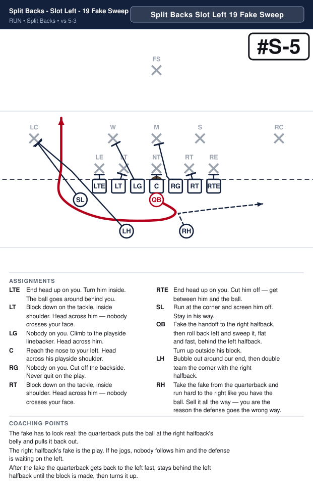
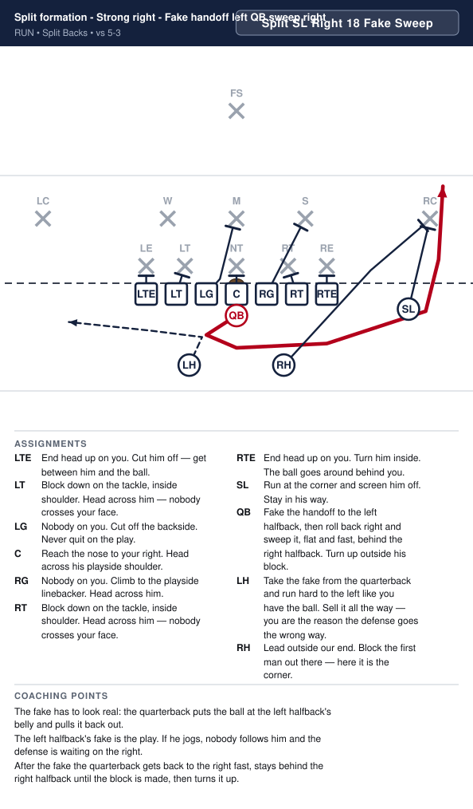
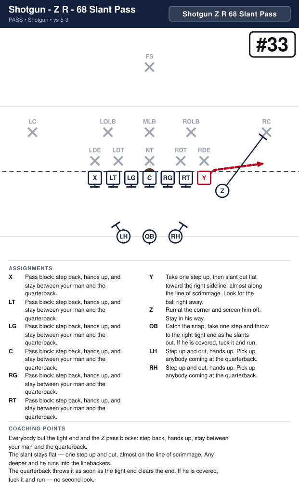
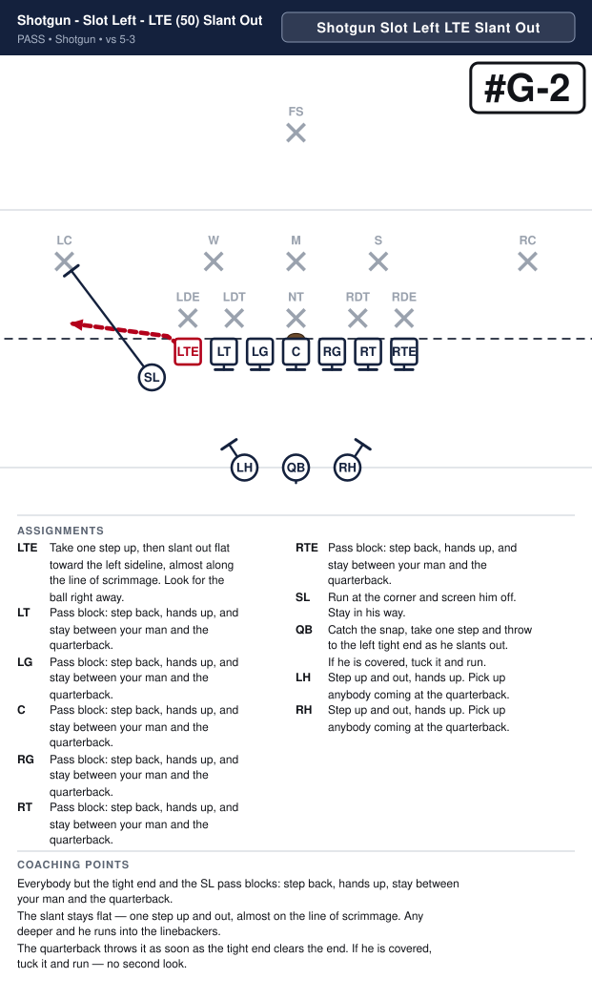
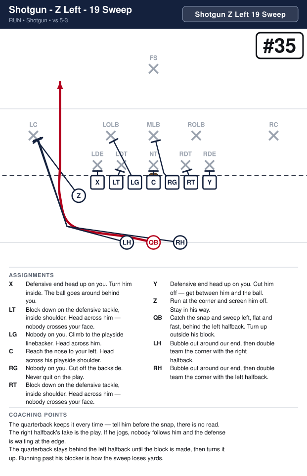
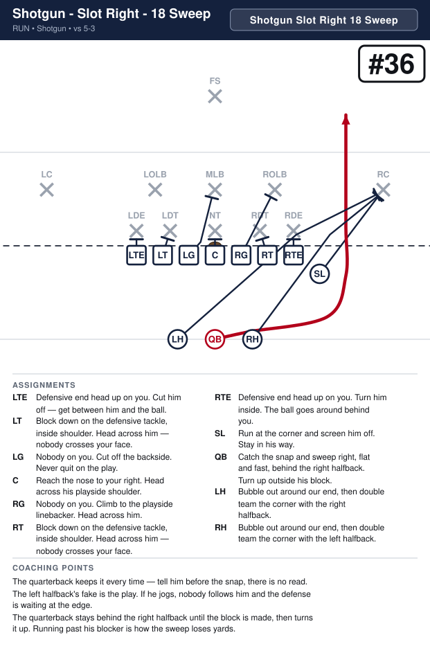
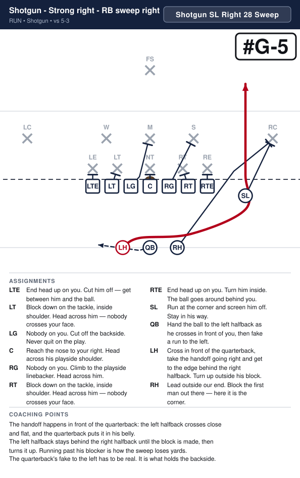
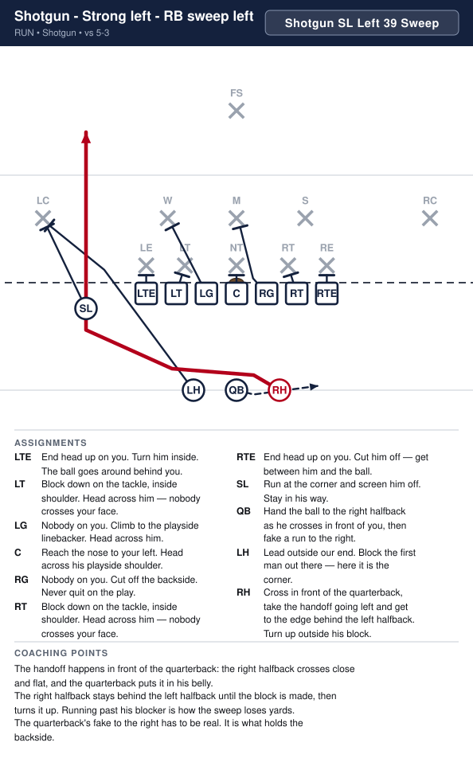

# Sayville 8U Playbook

_Generated by `generator/render.py`. Edit the JSON under `playbook/`, not this file._

Terminology and authoring rules: [playbook/CLAUDE.md](playbook/CLAUDE.md)

| # | Play | Call | Type | Formation | Ball |
|---|---|---|---|---|---|
| 1 | [I Formation - Strong Right - Off tackle right](#i-formation---strong-right---off-tackle-right) | `Regular I SL Right 34 Power` | run | Regular I | TB |
| 2 | [I Formation - Strong Left - Off tackle left](#i-formation---strong-left---off-tackle-left) | `Regular I SL Left 35 Power` | run | Regular I | TB |
| 3 | [I Formation - Strong Right - LTE jet right](#i-formation---strong-right---lte-jet-right) | `Regular I SL Right LTE Jet` | run | Regular I | LTE |
| 4 | [I Formation - Strong Left - RTE jet left](#i-formation---strong-left---rte-jet-left) | `Regular I SL Left RTE Jet` | run | Regular I | RTE |
| 5 | [I Formation - Strong Right - Slot jet left](#i-formation---strong-right---slot-jet-left) | `Regular I SL Right 49 Jet` | run | Regular I | SL |
| 6 | [I Formation - Strong Left - Slot jet right](#i-formation---strong-left---slot-jet-right) | `Regular I SL Left 48 Jet` | run | Regular I | SL |
| 7 | [Split formation - Strong right - Quick pitch right](#split-formation---strong-right---quick-pitch-right) | `Split SL Right 28 Pitch` | run | Split Backs | LH |
| 8 | [Split formation - Strong left - Quick pitch left](#split-formation---strong-left---quick-pitch-left) | `Split SL Left 39 Pitch` | run | Split Backs | RH |
| 9 | [Split formation - Strong right - QB sweep right](#split-formation---strong-right---qb-sweep-right) | `Split SL Right 18 Sweep` | run | Split Backs | QB |
| 10 | [Split formation - Strong left - QB sweep left](#split-formation---strong-left---qb-sweep-left) | `Split SL Left 19 Sweep` | run | Split Backs | QB |
| 11 | [Split formation - Strong left - Fake handoff right QB sweep left](#split-formation---strong-left---fake-handoff-right-qb-sweep-left) | `Split SL Left 19 Fake Sweep` | run | Split Backs | QB |
| 12 | [Split formation - Strong right - Fake handoff left QB sweep right](#split-formation---strong-right---fake-handoff-left-qb-sweep-right) | `Split SL Right 18 Fake Sweep` | run | Split Backs | QB |
| 13 | [Shotgun - Strong right - RTE slant out](#shotgun---strong-right---rte-slant-out) | `Shotgun SL Right RTE Slant Out` | pass | Shotgun | RTE |
| 14 | [Shotgun - Strong left - LTE slant out](#shotgun---strong-left---lte-slant-out) | `Shotgun SL Left LTE Slant Out` | pass | Shotgun | LTE |
| 15 | [Shotgun - Strong left - QB sweep left](#shotgun---strong-left---qb-sweep-left) | `Shotgun SL Left 19 Sweep` | run | Shotgun | QB |
| 16 | [Shotgun - Strong right - QB sweep right](#shotgun---strong-right---qb-sweep-right) | `Shotgun SL Right 18 Sweep` | run | Shotgun | QB |
| 17 | [Shotgun - Strong right - RB sweep right](#shotgun---strong-right---rb-sweep-right) | `Shotgun SL Right 28 Sweep` | run | Shotgun | LH |
| 18 | [Shotgun - Strong left - RB sweep left](#shotgun---strong-left---rb-sweep-left) | `Shotgun SL Left 39 Sweep` | run | Shotgun | RH |

# Regular I

---

## I Formation - Strong Right - Off tackle right

**Call it:** `Regular I SL Right 34 Power`

| Position | Assignment |
|---|---|
| **LTE** | End head up on you. Cut him off — get between him and the ball. |
| **LT** | Block down on the tackle, inside shoulder. Head across him — nobody crosses your face. |
| **LG** | Nobody on you. Cut off the backside. Never quit on the play. |
| **C** | Reach the nose to your right. Head across his playside shoulder. |
| **RG** | Nobody on you. Help on the nose, then take the middle linebacker. |
| **RT** | Block down on the tackle, inside shoulder. Head across him — nobody crosses your face. |
| **RTE** | Leave the end — he is kicked out. Go take the outside linebacker. |
| **SL** | Kick the end out. Aim at his outside hip. Never let him come underneath you. |
| **QB** | Open right, hand deep to the tailback, then fake the boot. It holds the backside end. |
| **FB** | Lead through the hole. Block the first man who shows in it. |
| **TB** **(ball)** | Take the handoff downhill at our tackle's outside hip, following the fullback. Never bounce it outside. |

**Coaching points**

- This is the most physical run in the book. If it works you can run it fifteen times, and at this age you often can.
- Drill the SL's kick-out on its own. If he blocks the end with his shoulders square, the end slides underneath and makes the tackle for a loss — he has to attack the outside hip.
- The fullback's man is whoever shows in the hole, not a man he picks before the snap. Tell him that every time.
- The tailback's most common mistake is bouncing it wide looking for green grass. The yards are inside the SL's block. Make him run it tight in practice until it is automatic.

---

## I Formation - Strong Left - Off tackle left

**Call it:** `Regular I SL Left 35 Power`

| Position | Assignment |
|---|---|
| **LTE** | Leave the end — he is kicked out. Go take the outside linebacker. |
| **LT** | Block down on the tackle, inside shoulder. Head across him — nobody crosses your face. |
| **LG** | Nobody on you. Help on the nose, then take the middle linebacker. |
| **C** | Reach the nose to your left. Head across his playside shoulder. |
| **RG** | Nobody on you. Cut off the backside. Never quit on the play. |
| **RT** | Block down on the tackle, inside shoulder. Head across him — nobody crosses your face. |
| **RTE** | End head up on you. Cut him off — get between him and the ball. |
| **SL** | Kick the end out. Aim at his outside hip. Never let him come underneath you. |
| **QB** | Open left, hand deep to the tailback, then fake the boot. It holds the backside end. |
| **FB** | Lead through the hole. Block the first man who shows in it. |
| **TB** **(ball)** | Take the handoff downhill at our tackle's outside hip, following the fullback. Never bounce it outside. |

**Coaching points**

- This is the most physical run in the book. If it works you can run it fifteen times, and at this age you often can.
- Drill the SL's kick-out on its own. If he blocks the end with his shoulders square, the end slides underneath and makes the tackle for a loss — he has to attack the outside hip.
- The fullback's man is whoever shows in the hole, not a man he picks before the snap. Tell him that every time.
- The tailback's most common mistake is bouncing it wide looking for green grass. The yards are inside the SL's block. Make him run it tight in practice until it is automatic.

---

## I Formation - Strong Right - LTE jet right

**Call it:** `Regular I SL Right LTE Jet`

| Position | Assignment |
|---|---|
| **LTE** **(ball)** | Stay down in your stance — no motion. At the snap run flat behind the quarterback, take the handoff at full speed and get to the right edge. Turn up outside the fullback. |
| **LT** | Tackle on your inside shoulder. Cut him off — get between him and the ball. |
| **LG** | Nobody on you. Cut off the backside. Never quit on the play. |
| **C** | Reach the nose to your right. Head across his playside shoulder. |
| **RG** | Nobody on you. Climb to the playside linebacker. Head across him. |
| **RT** | Block down on the tackle, inside shoulder. Head across him — nobody crosses your face. |
| **RTE** | End head up on you. Turn him inside. The ball goes around behind you. |
| **SL** | Run at the corner and screen him off. Stay in his way. |
| **QB** | Open right and hand the ball to the left tight end as he comes across behind you, then fake a run to the left. |
| **FB** | Lead outside our end, then turn up inside — the playside linebacker is the man who shows. Head across him. |
| **TB** | Run at the outside linebacker and screen him off. Stay in his way. |

**Coaching points**

- No motion before the snap. The end stays down in his stance, so the play is legal and nothing tips it off.
- The handoff is the whole play: the quarterback opens right and puts the ball in the end's belly at full speed, then carries out his fake.
- Both backs bubble out to the right ahead of the end and double team the outside linebacker together. Two of them on him is what gets the end around the corner.

---

## I Formation - Strong Left - RTE jet left

**Call it:** `Regular I SL Left RTE Jet`

| Position | Assignment |
|---|---|
| **LTE** | End head up on you. Turn him inside. The ball goes around behind you. |
| **LT** | Block down on the tackle, inside shoulder. Head across him — nobody crosses your face. |
| **LG** | Nobody on you. Climb to the playside linebacker. Head across him. |
| **C** | Reach the nose to your left. Head across his playside shoulder. |
| **RG** | Nobody on you. Cut off the backside. Never quit on the play. |
| **RT** | Tackle on your inside shoulder. Cut him off — get between him and the ball. |
| **RTE** **(ball)** | Stay down in your stance — no motion. At the snap run flat behind the quarterback, take the handoff at full speed and get to the left edge. Turn up outside the fullback. |
| **SL** | Run at the corner and screen him off. Stay in his way. |
| **QB** | Open left and hand the ball to the right tight end as he comes across behind you, then fake a run to the right. |
| **FB** | Lead outside our end, then turn up inside — the playside linebacker is the man who shows. Head across him. |
| **TB** | Run at the outside linebacker and screen him off. Stay in his way. |

**Coaching points**

- No motion before the snap. The end stays down in his stance, so the play is legal and nothing tips it off.
- The handoff is the whole play: the quarterback opens left and puts the ball in the end's belly at full speed, then carries out his fake.
- Both backs bubble out to the left ahead of the end and double team the outside linebacker together. Two of them on him is what gets the end around the corner.

---

## I Formation - Strong Right - Slot jet left

**Call it:** `Regular I SL Right 49 Jet`

| Position | Assignment |
|---|---|
| **LTE** | End head up on you. Turn him inside. The ball goes around behind you. |
| **LT** | Block down on the tackle, inside shoulder. Head across him — nobody crosses your face. |
| **LG** | Nobody on you. Climb to the playside linebacker. Head across him. |
| **C** | Reach the nose to your left. Head across his playside shoulder. |
| **RG** | Nobody on you. Cut off the backside. Never quit on the play. |
| **RT** | Block down on the tackle, inside shoulder. Head across him — nobody crosses your face. |
| **RTE** | End head up on you. Cut him off — get between him and the ball. |
| **SL** **(ball)** | At the snap run flat across the backfield, take the handoff at full speed and get to the left edge. Turn up in the alley behind the fullback. |
| **QB** | Hand the ball to the slot as he runs past you, then fake the handoff to the tailback going right. |
| **FB** | Lead outside our end. Block the first man out there — here it is the corner. |
| **TB** | Take the fake handoff and run hard to the right. You are what holds the backside. |

**Coaching points**

- The slot runs flat and fast across the backfield. The handoff is at full speed, so the quarterback just puts it in his belly.
- After the handoff the quarterback carries out his fake to the tailback going right. It is what holds the backside.
- The fullback bubbles out ahead of the slot and takes the corner. The slot stays behind him and turns up in the alley.

---

## I Formation - Strong Left - Slot jet right

**Call it:** `Regular I SL Left 48 Jet`

| Position | Assignment |
|---|---|
| **LTE** | End head up on you. Cut him off — get between him and the ball. |
| **LT** | Block down on the tackle, inside shoulder. Head across him — nobody crosses your face. |
| **LG** | Nobody on you. Cut off the backside. Never quit on the play. |
| **C** | Reach the nose to your right. Head across his playside shoulder. |
| **RG** | Nobody on you. Climb to the playside linebacker. Head across him. |
| **RT** | Block down on the tackle, inside shoulder. Head across him — nobody crosses your face. |
| **RTE** | End head up on you. Turn him inside. The ball goes around behind you. |
| **SL** **(ball)** | At the snap run flat across the backfield, take the handoff at full speed and get to the right edge. Turn up in the alley behind the fullback. |
| **QB** | Hand the ball to the slot as he runs past you, then fake the handoff to the tailback going left. |
| **FB** | Lead outside our end. Block the first man out there — here it is the corner. |
| **TB** | Take the fake handoff and run hard to the left. You are what holds the backside. |

**Coaching points**

- The slot runs flat and fast across the backfield. The handoff is at full speed, so the quarterback just puts it in his belly.
- After the handoff the quarterback carries out his fake to the tailback going left. It is what holds the backside.
- The fullback bubbles out ahead of the slot and takes the corner. The slot stays behind him and turns up in the alley.

# Split Backs

---

## Split formation - Strong right - Quick pitch right

**Call it:** `Split SL Right 28 Pitch`

| Position | Assignment |
|---|---|
| **LTE** | End head up on you. Cut him off — get between him and the ball. |
| **LT** | Block down on the tackle, inside shoulder. Head across him — nobody crosses your face. |
| **LG** | Nobody on you. Cut off the backside. Never quit on the play. |
| **C** | Reach the nose to your right. Head across his playside shoulder. |
| **RG** | Nobody on you. Climb to the playside linebacker. Head across him. |
| **RT** | Block down on the tackle, inside shoulder. Head across him — nobody crosses your face. |
| **RTE** | End head up on you. Turn him inside. The ball goes around behind you. |
| **SL** | Run at the corner and screen him off. Stay in his way. |
| **QB** | Quick pitch to the left halfback, then run the other way, to the left, like you still have it. |
| **LH** **(ball)** | Run flat, outside and behind the quarterback, and catch the pitch on the run. Ahead of him is a fumble. |
| **RH** | Lead outside our end. Block the first man out there — here it is the corner. Step at the dive first to hold their linebackers. |

**Coaching points**

- The pitch goes early. A quarterback who waits to be tackled first will pitch it on the ground.
- This is not a read at this age — tell him before the snap that he is pitching it.
- Everything depends on the edge being blocked, and out here the split man does it — which is what frees both backs to fake and lead. Drill him on beating that man to the spot without holding.

---

## Split formation - Strong left - Quick pitch left

**Call it:** `Split SL Left 39 Pitch`

| Position | Assignment |
|---|---|
| **LTE** | End head up on you. Turn him inside. The ball goes around behind you. |
| **LT** | Block down on the tackle, inside shoulder. Head across him — nobody crosses your face. |
| **LG** | Nobody on you. Climb to the playside linebacker. Head across him. |
| **C** | Reach the nose to your left. Head across his playside shoulder. |
| **RG** | Nobody on you. Cut off the backside. Never quit on the play. |
| **RT** | Block down on the tackle, inside shoulder. Head across him — nobody crosses your face. |
| **RTE** | End head up on you. Cut him off — get between him and the ball. |
| **SL** | Run at the corner and screen him off. Stay in his way. |
| **QB** | Quick pitch to the right halfback, then run the other way, to the right, like you still have it. |
| **LH** | Lead outside our end. Block the first man out there — here it is the corner. Step at the dive first to hold their linebackers. |
| **RH** **(ball)** | Run flat, outside and behind the quarterback, and catch the pitch on the run. Ahead of him is a fumble. |

**Coaching points**

- The pitch goes early. A quarterback who waits to be tackled first will pitch it on the ground.
- This is not a read at this age — tell him before the snap that he is pitching it.
- Everything depends on the edge being blocked, and out here the split man does it — which is what frees both backs to fake and lead. Drill him on beating that man to the spot without holding.

---

## Split formation - Strong right - QB sweep right

**Call it:** `Split SL Right 18 Sweep`

| Position | Assignment |
|---|---|
| **LTE** | End head up on you. Cut him off — get between him and the ball. |
| **LT** | Block down on the tackle, inside shoulder. Head across him — nobody crosses your face. |
| **LG** | Nobody on you. Cut off the backside. Never quit on the play. |
| **C** | Reach the nose to your right. Head across his playside shoulder. |
| **RG** | Nobody on you. Climb to the playside linebacker. Head across him. |
| **RT** | Block down on the tackle, inside shoulder. Head across him — nobody crosses your face. |
| **RTE** | End head up on you. Turn him inside. The ball goes around behind you. |
| **SL** | Run at the corner and screen him off. Stay in his way. |
| **QB** **(ball)** | Take the snap and sweep right, flat and fast, behind the right halfback. Turn up outside his block. |
| **LH** | Run hard to the left like you have the ball. Sell it all the way — you are the reason the defense goes the wrong way. |
| **RH** | Lead outside our end. Block the first man out there — here it is the corner. |

**Coaching points**

- The quarterback keeps it every time — tell him before the snap, there is no read.
- The left halfback's fake is the play. If he jogs, nobody follows him and the defense is waiting at the edge.
- The quarterback stays behind the right halfback until the block is made, then turns it up. Running past his blocker is how the sweep loses yards.

---

## Split formation - Strong left - QB sweep left

**Call it:** `Split SL Left 19 Sweep`

| Position | Assignment |
|---|---|
| **LTE** | End head up on you. Turn him inside. The ball goes around behind you. |
| **LT** | Block down on the tackle, inside shoulder. Head across him — nobody crosses your face. |
| **LG** | Nobody on you. Climb to the playside linebacker. Head across him. |
| **C** | Reach the nose to your left. Head across his playside shoulder. |
| **RG** | Nobody on you. Cut off the backside. Never quit on the play. |
| **RT** | Block down on the tackle, inside shoulder. Head across him — nobody crosses your face. |
| **RTE** | End head up on you. Cut him off — get between him and the ball. |
| **SL** | Run at the corner and screen him off. Stay in his way. |
| **QB** **(ball)** | Take the snap and sweep left, flat and fast, behind the left halfback. Turn up outside his block. |
| **LH** | Lead outside our end. Block the first man out there — here it is the corner. |
| **RH** | Run hard to the right like you have the ball. Sell it all the way — you are the reason the defense goes the wrong way. |

**Coaching points**

- The quarterback keeps it every time — tell him before the snap, there is no read.
- The right halfback's fake is the play. If he jogs, nobody follows him and the defense is waiting at the edge.
- The quarterback stays behind the left halfback until the block is made, then turns it up. Running past his blocker is how the sweep loses yards.

---

## Split formation - Strong left - Fake handoff right QB sweep left

**Call it:** `Split SL Left 19 Fake Sweep`

| Position | Assignment |
|---|---|
| **LTE** | End head up on you. Turn him inside. The ball goes around behind you. |
| **LT** | Block down on the tackle, inside shoulder. Head across him — nobody crosses your face. |
| **LG** | Nobody on you. Climb to the playside linebacker. Head across him. |
| **C** | Reach the nose to your left. Head across his playside shoulder. |
| **RG** | Nobody on you. Cut off the backside. Never quit on the play. |
| **RT** | Block down on the tackle, inside shoulder. Head across him — nobody crosses your face. |
| **RTE** | End head up on you. Cut him off — get between him and the ball. |
| **SL** | Run at the corner and screen him off. Stay in his way. |
| **QB** **(ball)** | Fake the handoff to the right halfback, then roll back left and sweep it, flat and fast, behind the left halfback. Turn up outside his block. |
| **LH** | Lead outside our end. Block the first man out there — here it is the corner. |
| **RH** | Take the fake from the quarterback and run hard to the right like you have the ball. Sell it all the way — you are the reason the defense goes the wrong way. |

**Coaching points**

- The fake has to look real: the quarterback puts the ball at the right halfback's belly and pulls it back out.
- The right halfback's fake is the play. If he jogs, nobody follows him and the defense is waiting on the left.
- After the fake the quarterback gets back to the left fast, stays behind the left halfback until the block is made, then turns it up.

---

## Split formation - Strong right - Fake handoff left QB sweep right

**Call it:** `Split SL Right 18 Fake Sweep`

| Position | Assignment |
|---|---|
| **LTE** | End head up on you. Cut him off — get between him and the ball. |
| **LT** | Block down on the tackle, inside shoulder. Head across him — nobody crosses your face. |
| **LG** | Nobody on you. Cut off the backside. Never quit on the play. |
| **C** | Reach the nose to your right. Head across his playside shoulder. |
| **RG** | Nobody on you. Climb to the playside linebacker. Head across him. |
| **RT** | Block down on the tackle, inside shoulder. Head across him — nobody crosses your face. |
| **RTE** | End head up on you. Turn him inside. The ball goes around behind you. |
| **SL** | Run at the corner and screen him off. Stay in his way. |
| **QB** **(ball)** | Fake the handoff to the left halfback, then roll back right and sweep it, flat and fast, behind the right halfback. Turn up outside his block. |
| **LH** | Take the fake from the quarterback and run hard to the left like you have the ball. Sell it all the way — you are the reason the defense goes the wrong way. |
| **RH** | Lead outside our end. Block the first man out there — here it is the corner. |

**Coaching points**

- The fake has to look real: the quarterback puts the ball at the left halfback's belly and pulls it back out.
- The left halfback's fake is the play. If he jogs, nobody follows him and the defense is waiting on the right.
- After the fake the quarterback gets back to the right fast, stays behind the right halfback until the block is made, then turns it up.

# Shotgun

---

## Shotgun - Strong right - RTE slant out

**Call it:** `Shotgun SL Right RTE Slant Out`

| Position | Assignment |
|---|---|
| **LTE** | Pass block: step back, hands up, and stay between your man and the quarterback. |
| **LT** | Pass block: step back, hands up, and stay between your man and the quarterback. |
| **LG** | Pass block: step back, hands up, and stay between your man and the quarterback. |
| **C** | Pass block: step back, hands up, and stay between your man and the quarterback. |
| **RG** | Pass block: step back, hands up, and stay between your man and the quarterback. |
| **RT** | Pass block: step back, hands up, and stay between your man and the quarterback. |
| **RTE** **(ball)** | Take one step up, then slant out flat toward the right sideline, almost along the line of scrimmage. Look for the ball right away. |
| **SL** | Run at the corner and screen him off. Stay in his way. |
| **QB** | Catch the snap, take one step and throw to the right tight end as he slants out. If he is covered, tuck it and run. |
| **LH** | Step up and out, hands up. Pick up anybody coming at the quarterback. |
| **RH** | Step up and out, hands up. Pick up anybody coming at the quarterback. |

**Coaching points**

- Everybody but the tight end and the SL pass blocks: step back, hands up, stay between your man and the quarterback.
- The slant stays flat — one step up and out, almost on the line of scrimmage. Any deeper and he runs into the linebackers.
- The quarterback throws it as soon as the tight end clears the end. If he is covered, tuck it and run — no second look.

---

## Shotgun - Strong left - LTE slant out

**Call it:** `Shotgun SL Left LTE Slant Out`

| Position | Assignment |
|---|---|
| **LTE** **(ball)** | Take one step up, then slant out flat toward the left sideline, almost along the line of scrimmage. Look for the ball right away. |
| **LT** | Pass block: step back, hands up, and stay between your man and the quarterback. |
| **LG** | Pass block: step back, hands up, and stay between your man and the quarterback. |
| **C** | Pass block: step back, hands up, and stay between your man and the quarterback. |
| **RG** | Pass block: step back, hands up, and stay between your man and the quarterback. |
| **RT** | Pass block: step back, hands up, and stay between your man and the quarterback. |
| **RTE** | Pass block: step back, hands up, and stay between your man and the quarterback. |
| **SL** | Run at the corner and screen him off. Stay in his way. |
| **QB** | Catch the snap, take one step and throw to the left tight end as he slants out. If he is covered, tuck it and run. |
| **LH** | Step up and out, hands up. Pick up anybody coming at the quarterback. |
| **RH** | Step up and out, hands up. Pick up anybody coming at the quarterback. |

**Coaching points**

- Everybody but the tight end and the SL pass blocks: step back, hands up, stay between your man and the quarterback.
- The slant stays flat — one step up and out, almost on the line of scrimmage. Any deeper and he runs into the linebackers.
- The quarterback throws it as soon as the tight end clears the end. If he is covered, tuck it and run — no second look.

---

## Shotgun - Strong left - QB sweep left

**Call it:** `Shotgun SL Left 19 Sweep`

| Position | Assignment |
|---|---|
| **LTE** | End head up on you. Turn him inside. The ball goes around behind you. |
| **LT** | Block down on the tackle, inside shoulder. Head across him — nobody crosses your face. |
| **LG** | Nobody on you. Climb to the playside linebacker. Head across him. |
| **C** | Reach the nose to your left. Head across his playside shoulder. |
| **RG** | Nobody on you. Cut off the backside. Never quit on the play. |
| **RT** | Block down on the tackle, inside shoulder. Head across him — nobody crosses your face. |
| **RTE** | End head up on you. Cut him off — get between him and the ball. |
| **SL** | Run at the corner and screen him off. Stay in his way. |
| **QB** **(ball)** | Catch the snap and sweep left, flat and fast, behind the left halfback. Turn up outside his block. |
| **LH** | Lead outside our end. Block the first man out there — here it is the corner. |
| **RH** | Fake the handoff going right and run hard. Sell it all the way — you are the reason the defense goes the wrong way. |

**Coaching points**

- The quarterback keeps it every time — tell him before the snap, there is no read.
- The right halfback's fake is the play. If he jogs, nobody follows him and the defense is waiting at the edge.
- The quarterback stays behind the left halfback until the block is made, then turns it up. Running past his blocker is how the sweep loses yards.

---

## Shotgun - Strong right - QB sweep right

**Call it:** `Shotgun SL Right 18 Sweep`

| Position | Assignment |
|---|---|
| **LTE** | End head up on you. Cut him off — get between him and the ball. |
| **LT** | Block down on the tackle, inside shoulder. Head across him — nobody crosses your face. |
| **LG** | Nobody on you. Cut off the backside. Never quit on the play. |
| **C** | Reach the nose to your right. Head across his playside shoulder. |
| **RG** | Nobody on you. Climb to the playside linebacker. Head across him. |
| **RT** | Block down on the tackle, inside shoulder. Head across him — nobody crosses your face. |
| **RTE** | End head up on you. Turn him inside. The ball goes around behind you. |
| **SL** | Run at the corner and screen him off. Stay in his way. |
| **QB** **(ball)** | Catch the snap and sweep right, flat and fast, behind the right halfback. Turn up outside his block. |
| **LH** | Fake the handoff going left and run hard. Sell it all the way — you are the reason the defense goes the wrong way. |
| **RH** | Lead outside our end. Block the first man out there — here it is the corner. |

**Coaching points**

- The quarterback keeps it every time — tell him before the snap, there is no read.
- The left halfback's fake is the play. If he jogs, nobody follows him and the defense is waiting at the edge.
- The quarterback stays behind the right halfback until the block is made, then turns it up. Running past his blocker is how the sweep loses yards.

---

## Shotgun - Strong right - RB sweep right

**Call it:** `Shotgun SL Right 28 Sweep`

| Position | Assignment |
|---|---|
| **LTE** | End head up on you. Cut him off — get between him and the ball. |
| **LT** | Block down on the tackle, inside shoulder. Head across him — nobody crosses your face. |
| **LG** | Nobody on you. Cut off the backside. Never quit on the play. |
| **C** | Reach the nose to your right. Head across his playside shoulder. |
| **RG** | Nobody on you. Climb to the playside linebacker. Head across him. |
| **RT** | Block down on the tackle, inside shoulder. Head across him — nobody crosses your face. |
| **RTE** | End head up on you. Turn him inside. The ball goes around behind you. |
| **SL** | Run at the corner and screen him off. Stay in his way. |
| **QB** | Hand the ball to the left halfback as he crosses in front of you, then fake a run to the left. |
| **LH** **(ball)** | Cross in front of the quarterback, take the handoff going right and get to the edge behind the right halfback. Turn up outside his block. |
| **RH** | Lead outside our end. Block the first man out there — here it is the corner. |

**Coaching points**

- The handoff happens in front of the quarterback: the left halfback crosses close and flat, and the quarterback puts it in his belly.
- The left halfback stays behind the right halfback until the block is made, then turns it up. Running past his blocker is how the sweep loses yards.
- The quarterback's fake to the left has to be real. It is what holds the backside.

---

## Shotgun - Strong left - RB sweep left

**Call it:** `Shotgun SL Left 39 Sweep`

| Position | Assignment |
|---|---|
| **LTE** | End head up on you. Turn him inside. The ball goes around behind you. |
| **LT** | Block down on the tackle, inside shoulder. Head across him — nobody crosses your face. |
| **LG** | Nobody on you. Climb to the playside linebacker. Head across him. |
| **C** | Reach the nose to your left. Head across his playside shoulder. |
| **RG** | Nobody on you. Cut off the backside. Never quit on the play. |
| **RT** | Block down on the tackle, inside shoulder. Head across him — nobody crosses your face. |
| **RTE** | End head up on you. Cut him off — get between him and the ball. |
| **SL** | Run at the corner and screen him off. Stay in his way. |
| **QB** | Hand the ball to the right halfback as he crosses in front of you, then fake a run to the right. |
| **LH** | Lead outside our end. Block the first man out there — here it is the corner. |
| **RH** **(ball)** | Cross in front of the quarterback, take the handoff going left and get to the edge behind the left halfback. Turn up outside his block. |

**Coaching points**

- The handoff happens in front of the quarterback: the right halfback crosses close and flat, and the quarterback puts it in his belly.
- The right halfback stays behind the left halfback until the block is made, then turns it up. Running past his blocker is how the sweep loses yards.
- The quarterback's fake to the right has to be real. It is what holds the backside.

