# Sayville 8U Playbook

_Generated by `generator/render.py`. Edit the JSON under `playbook/`, not this file._

Terminology and authoring rules: [playbook/CLAUDE.md](playbook/CLAUDE.md)

| # | Play | Call | Type | Formation | Ball |
|---|---|---|---|---|---|
| 1 | [Regular I Sneak Right](#regular-i-sneak-right) | `Regular I SL Right 10 Sneak` | run | Regular I | QB |
| 2 | [Regular I Sneak Left](#regular-i-sneak-left) | `Regular I SL Right 11 Sneak` | run | Regular I | QB |
| 3 | [Regular I Dive Right](#regular-i-dive-right) | `Regular I SL Right 20 Dive` | run | Regular I | FB |
| 4 | [Regular I Dive Left](#regular-i-dive-left) | `Regular I SL Right 21 Dive` | run | Regular I | FB |
| 5 | [Regular I Wedge Right](#regular-i-wedge-right) | `Regular I SL Right 30 Wedge` | run | Regular I | TB |
| 6 | [Regular I Wedge Left](#regular-i-wedge-left) | `Regular I SL Right 31 Wedge` | run | Regular I | TB |
| 7 | [Regular I Iso Right](#regular-i-iso-right) | `Regular I SL Right 32 Iso` | run | Regular I | TB |
| 8 | [Regular I Iso Left](#regular-i-iso-left) | `Regular I SL Right 33 Iso` | run | Regular I | TB |
| 9 | [Regular I Power Right](#regular-i-power-right) | `Regular I SL Right 34 Power` | run | Regular I | TB |
| 10 | [Regular I Power Left](#regular-i-power-left) | `Regular I SL Left 35 Power` | run | Regular I | TB |
| 11 | [Regular I Counter Right](#regular-i-counter-right) | `Regular I SL Right 34 Counter` | run | Regular I | TB |
| 12 | [Regular I Counter Left](#regular-i-counter-left) | `Regular I SL Right 35 Counter` | run | Regular I | TB |
| 13 | [Regular I Boot Right](#regular-i-boot-right) | `Regular I SL Right 16 Boot` | pass | Regular I | SL |
| 14 | [Regular I Boot Left](#regular-i-boot-left) | `Regular I SL Right 17 Boot` | pass | Regular I | LTE |
| 15 | [Regular I Waggle Right](#regular-i-waggle-right) | `Regular I SL Right 16 Waggle` | pass | Regular I | RTE |
| 16 | [Regular I Waggle Left](#regular-i-waggle-left) | `Regular I SL Right 17 Waggle` | pass | Regular I | LTE |
| 17 | [Regular I Jet Boot Right](#regular-i-jet-boot-right) | `Regular I SL Right 16 Jet Boot` | pass | Regular I | RTE |
| 18 | [Regular I Jet Boot Left](#regular-i-jet-boot-left) | `Regular I SL Right 17 Jet Boot` | pass | Regular I | LTE |
| 19 | [Regular I Power Boot Right](#regular-i-power-boot-right) | `Regular I SL Right 16 Power Boot` | pass | Regular I | RTE |
| 20 | [Regular I Power Boot Left](#regular-i-power-boot-left) | `Regular I SL Right 17 Power Boot` | pass | Regular I | LTE |
| 21 | [Regular I Slant Right](#regular-i-slant-right) | `Regular I SL Right 36 Slant` | run | Regular I | TB |
| 22 | [Regular I Slant Left](#regular-i-slant-left) | `Regular I SL Right 37 Slant` | run | Regular I | TB |
| 23 | [Regular I Toss Right](#regular-i-toss-right) | `Regular I SL Right 38 Toss` | run | Regular I | TB |
| 24 | [Regular I Toss Left](#regular-i-toss-left) | `Regular I SL Right 39 Toss` | run | Regular I | TB |
| 25 | [Regular I Jet Right](#regular-i-jet-right) | `Regular I SL Left 48 Jet` | run | Regular I | SL |
| 26 | [Regular I Jet Left](#regular-i-jet-left) | `Regular I SL Right 49 Jet` | run | Regular I | SL |
| 27 | [Split Dive Right](#split-dive-right) | `Split SL Right 30 Dive` | run | Split Backs | RH |
| 28 | [Split Dive Left](#split-dive-left) | `Split SL Right 21 Dive` | run | Split Backs | LH |
| 29 | [Split Power Right](#split-power-right) | `Split SL Right 24 Power` | run | Split Backs | LH |
| 30 | [Split Power Left](#split-power-left) | `Split SL Right 35 Power` | run | Split Backs | RH |
| 31 | [Split Counter Right](#split-counter-right) | `Split SL Right 24 Counter` | run | Split Backs | LH |
| 32 | [Split Counter Left](#split-counter-left) | `Split SL Right 35 Counter` | run | Split Backs | RH |
| 33 | [Split Waggle Right](#split-waggle-right) | `Split SL Right 16 Waggle` | pass | Split Backs | RTE |
| 34 | [Split Waggle Left](#split-waggle-left) | `Split SL Right 17 Waggle` | pass | Split Backs | LTE |
| 35 | [Split formation - Strong right - Quick pitch right](#split-formation---strong-right---quick-pitch-right) | `Split SL Right 28 Pitch` | run | Split Backs | LH |
| 36 | [Split formation - Strong right - Quick pitch left](#split-formation---strong-right---quick-pitch-left) | `Split SL Right 39 Pitch` | run | Split Backs | RH |
| 37 | [Split QB Keep Right](#split-qb-keep-right) | `Split SL Right 16 Keep` | run | Split Backs | QB |
| 38 | [Split QB Keep Left](#split-qb-keep-left) | `Split SL Left 17 Keep` | run | Split Backs | QB |
| 39 | [Split SL Left SL Reverse Right](#split-sl-left-sl-reverse-right) | `Split SL Left 46 SL Reverse Right` | run | Split Backs | SL |
| 40 | [Split SL Right SL Reverse Left](#split-sl-right-sl-reverse-left) | `Split SL Right 47 SL Reverse Left` | run | Split Backs | SL |

# Regular I

---

## Regular I Sneak Right

**Call it:** `Regular I SL Right 10 Sneak`

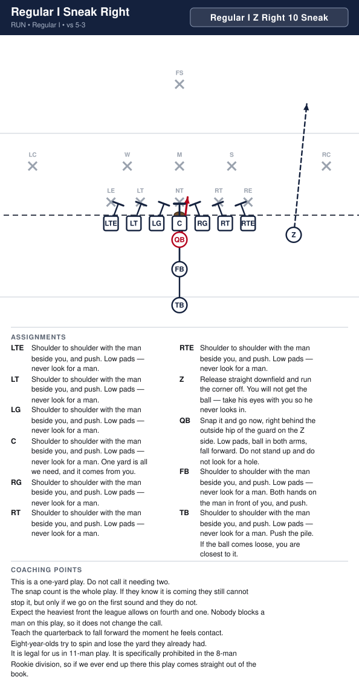

Fourth and inches. The quarterback keeps it behind the center's playside hip before the defense is out of its stance. No handoff to go wrong and no back to get tackled in the backfield.

| Position | Assignment |
|---|---|
| **LTE** | Shoulder to shoulder with the man beside you, and push. Low pads — never look for a man. |
| **LT** | Shoulder to shoulder with the man beside you, and push. Low pads — never look for a man. |
| **LG** | Shoulder to shoulder with the man beside you, and push. Low pads — never look for a man. |
| **C** | Shoulder to shoulder with the man beside you, and push. Low pads — never look for a man. One yard is all we need, and it comes from you. |
| **RG** | Shoulder to shoulder with the man beside you, and push. Low pads — never look for a man. |
| **RT** | Shoulder to shoulder with the man beside you, and push. Low pads — never look for a man. |
| **RTE** | Shoulder to shoulder with the man beside you, and push. Low pads — never look for a man. |
| **SL** | Release downfield and run the corner off. You will not get the ball, just his eyes. |
| **QB** **(ball)** | Go on the snap behind the guard's outside hip on the SL side. Low pads, ball tight, fall forward. |
| **FB** | Shoulder to shoulder with the man beside you, and push. Low pads — never look for a man. Both hands on the man in front of you, and push. |
| **TB** | Shoulder to shoulder with the man beside you, and push. Low pads — never look for a man. Push the pile. If the ball comes loose, you are closest to it. |

**Coaching points**

- This is a one-yard play. Do not call it needing two.
- The snap count is the whole play. If they know it is coming they still cannot stop it, but only if we go on the first sound and they do not.
- Expect the heaviest front the league allows on fourth and one. Nobody blocks a man on this play, so it does not change the call.
- Teach the quarterback to fall forward the moment he feels contact. Eight-year-olds try to spin and lose the yard they already had. And he does not get to pick a hole — there is no hole, there is a snap count and a yard.
- It is legal for us in 11-man play. It is specifically prohibited in the 8-man Rookie division, so if we ever end up there this play comes straight out of the book.

---

## Regular I Sneak Left

**Call it:** `Regular I SL Right 11 Sneak`

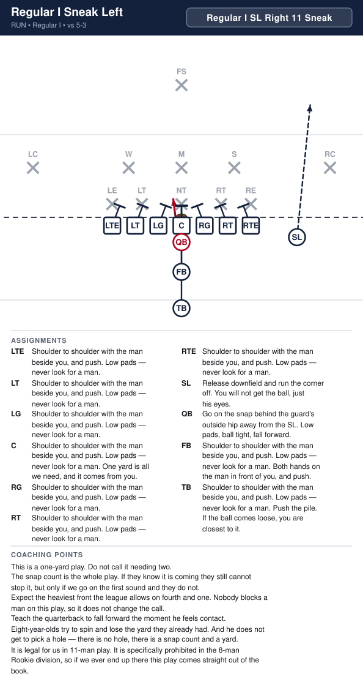

Fourth and inches. The quarterback keeps it behind the center's playside hip before the defense is out of its stance. No handoff to go wrong and no back to get tackled in the backfield.

| Position | Assignment |
|---|---|
| **LTE** | Shoulder to shoulder with the man beside you, and push. Low pads — never look for a man. |
| **LT** | Shoulder to shoulder with the man beside you, and push. Low pads — never look for a man. |
| **LG** | Shoulder to shoulder with the man beside you, and push. Low pads — never look for a man. |
| **C** | Shoulder to shoulder with the man beside you, and push. Low pads — never look for a man. One yard is all we need, and it comes from you. |
| **RG** | Shoulder to shoulder with the man beside you, and push. Low pads — never look for a man. |
| **RT** | Shoulder to shoulder with the man beside you, and push. Low pads — never look for a man. |
| **RTE** | Shoulder to shoulder with the man beside you, and push. Low pads — never look for a man. |
| **SL** | Release downfield and run the corner off. You will not get the ball, just his eyes. |
| **QB** **(ball)** | Go on the snap behind the guard's outside hip away from the SL. Low pads, ball tight, fall forward. |
| **FB** | Shoulder to shoulder with the man beside you, and push. Low pads — never look for a man. Both hands on the man in front of you, and push. |
| **TB** | Shoulder to shoulder with the man beside you, and push. Low pads — never look for a man. Push the pile. If the ball comes loose, you are closest to it. |

**Coaching points**

- This is a one-yard play. Do not call it needing two.
- The snap count is the whole play. If they know it is coming they still cannot stop it, but only if we go on the first sound and they do not.
- Expect the heaviest front the league allows on fourth and one. Nobody blocks a man on this play, so it does not change the call.
- Teach the quarterback to fall forward the moment he feels contact. Eight-year-olds try to spin and lose the yard they already had. And he does not get to pick a hole — there is no hole, there is a snap count and a yard.
- It is legal for us in 11-man play. It is specifically prohibited in the 8-man Rookie division, so if we ever end up there this play comes straight out of the book.

---

## Regular I Dive Right

**Call it:** `Regular I SL Right 20 Dive`

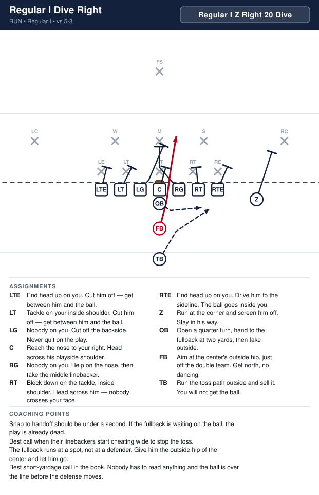

The quickest handoff in the book. The fullback is through the line before their linebackers have read anything. We run it to remind them the middle is not free, which is what makes the toss work later.

| Position | Assignment |
|---|---|
| **LTE** | End head up on you. Cut him off — get between him and the ball. |
| **LT** | Tackle on your inside shoulder. Cut him off — get between him and the ball. |
| **LG** | Nobody on you. Cut off the backside. Never quit on the play. |
| **C** | Reach the nose to your right. Head across his playside shoulder. |
| **RG** | Nobody on you. Help on the nose, then take the middle linebacker. |
| **RT** | Block down on the tackle, inside shoulder. Head across him — nobody crosses your face. |
| **RTE** | End head up on you. Drive him to the sideline. The ball goes inside you. |
| **SL** | Run at the corner and screen him off. Stay in his way. |
| **QB** | Open a quarter turn, hand to the fullback at two yards, then fake outside. |
| **FB** **(ball)** | Aim at the center's outside hip, just off the double team. Get north, no dancing. |
| **TB** | Run the toss path outside and sell it. You will not get the ball. |

**Coaching points**

- Snap to handoff should be under a second. If the fullback is waiting on the ball, the play is already dead.
- Best call when their linebackers start cheating wide to stop the toss.
- The fullback runs at a spot, not at a defender. Give him the outside hip of the center and let him go.
- Best short-yardage call in the book. Nobody has to read anything and the ball is over the line before the defense moves.

---

## Regular I Dive Left

**Call it:** `Regular I SL Right 21 Dive`

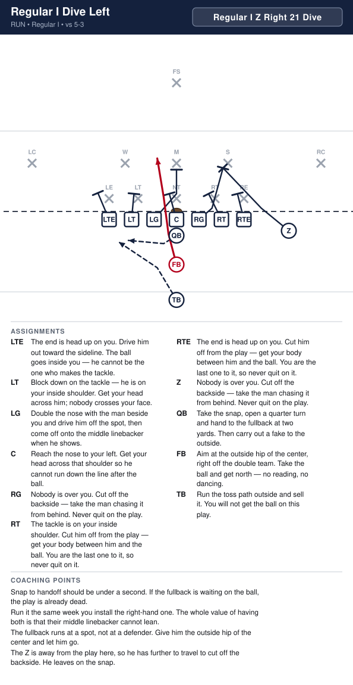

The same quick handoff through the other A gap. Worth having both so the fullback is not always going to the same side of the center — once their middle linebacker knows which way the dive hits, it stops being quick.

| Position | Assignment |
|---|---|
| **LTE** | End head up on you. Drive him to the sideline. The ball goes inside you. |
| **LT** | Block down on the tackle, inside shoulder. Head across him — nobody crosses your face. |
| **LG** | Nobody on you. Help on the nose, then take the middle linebacker. |
| **C** | Reach the nose to your left. Head across his playside shoulder. |
| **RG** | Nobody on you. Cut off the backside. Never quit on the play. |
| **RT** | Tackle on your inside shoulder. Cut him off — get between him and the ball. |
| **RTE** | End head up on you. Cut him off — get between him and the ball. |
| **SL** | Cut off the backside. Never quit on the play. |
| **QB** | Open a quarter turn, hand to the fullback at two yards, then fake outside. |
| **FB** **(ball)** | Aim at the center's outside hip, just off the double team. Get north, no dancing. |
| **TB** | Run the toss path outside and sell it. You will not get the ball. |

**Coaching points**

- Snap to handoff should be under a second. If the fullback is waiting on the ball, the play is already dead.
- Run it the same week you install the right-hand one. The whole value of having both is that their middle linebacker cannot lean.
- The fullback runs at a spot, not at a defender. Give him the outside hip of the center and let him go.
- The SL is away from the play here, so he has further to travel to cut off the backside. He leaves on the snap.

---

## Regular I Wedge Right

**Call it:** `Regular I SL Right 30 Wedge`

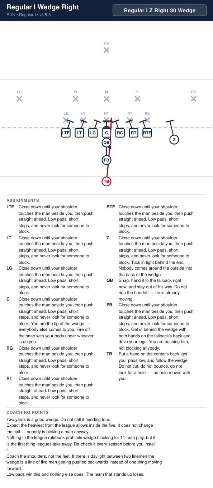

Short yardage and the goal line. Nobody blocks a man — the whole line squeezes shoulder to shoulder on the center and pushes. The tailback puts a hand on the center's back and goes wherever the pile goes.

| Position | Assignment |
|---|---|
| **LTE** | Shoulder to shoulder with the man beside you, and push. Low pads — never look for a man. |
| **LT** | Shoulder to shoulder with the man beside you, and push. Low pads — never look for a man. |
| **LG** | Shoulder to shoulder with the man beside you, and push. Low pads — never look for a man. |
| **C** | Shoulder to shoulder with the man beside you, and push. Low pads — never look for a man. You are the tip of the wedge — everybody comes to you. |
| **RG** | Shoulder to shoulder with the man beside you, and push. Low pads — never look for a man. |
| **RT** | Shoulder to shoulder with the man beside you, and push. Low pads — never look for a man. |
| **RTE** | Shoulder to shoulder with the man beside you, and push. Low pads — never look for a man. |
| **SL** | Run at the corner and screen him off. Stay in his way. Nothing comes around the outside into the back of the wedge. |
| **QB** | Snap and hand to the tailback immediately, then stay out of his way. Never ride the handoff. |
| **FB** | Shoulder to shoulder with the man beside you, and push. Low pads — never look for a man. Both hands on the tailback's back and drive. You are pushing, not blocking. |
| **TB** **(ball)** | Hand on the center's back, pads low, follow the wedge. Never cut or bounce — the hole moves with you. |

**Coaching points**

- Two yards is a good wedge. Do not call it needing four.
- Expect the heaviest front the league allows inside the five. It does not change the call — nobody is picking a man anyway.
- Nothing in the league rulebook prohibits wedge blocking for 11-man play, but it is the first thing leagues take away. Re-check it every season before you install it.
- Coach the shoulders, not the feet. If there is daylight between two linemen the wedge is a line of five men getting pushed backwards instead of one thing moving forward.
- Low pads win this and nothing else does. The team that stands up loses.

---

## Regular I Wedge Left

**Call it:** `Regular I SL Right 31 Wedge`

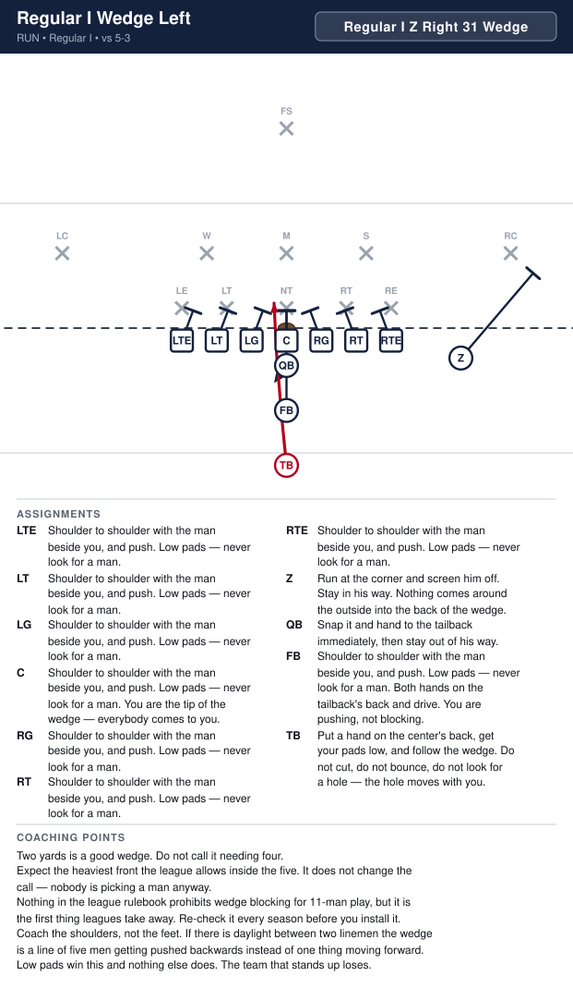

Short yardage and the goal line. Nobody blocks a man — the whole line squeezes shoulder to shoulder on the center and pushes. The tailback puts a hand on the center's back and goes wherever the pile goes.

| Position | Assignment |
|---|---|
| **LTE** | Shoulder to shoulder with the man beside you, and push. Low pads — never look for a man. |
| **LT** | Shoulder to shoulder with the man beside you, and push. Low pads — never look for a man. |
| **LG** | Shoulder to shoulder with the man beside you, and push. Low pads — never look for a man. |
| **C** | Shoulder to shoulder with the man beside you, and push. Low pads — never look for a man. You are the tip of the wedge — everybody comes to you. |
| **RG** | Shoulder to shoulder with the man beside you, and push. Low pads — never look for a man. |
| **RT** | Shoulder to shoulder with the man beside you, and push. Low pads — never look for a man. |
| **RTE** | Shoulder to shoulder with the man beside you, and push. Low pads — never look for a man. |
| **SL** | Run at the corner and screen him off. Stay in his way. Nothing comes around the outside into the back of the wedge. |
| **QB** | Snap it and hand to the tailback immediately, then stay out of his way. |
| **FB** | Shoulder to shoulder with the man beside you, and push. Low pads — never look for a man. Both hands on the tailback's back and drive. You are pushing, not blocking. |
| **TB** **(ball)** | Hand on the center's back, pads low, follow the wedge. Never cut or bounce — the hole moves with you. |

**Coaching points**

- Two yards is a good wedge. Do not call it needing four.
- Expect the heaviest front the league allows inside the five. It does not change the call — nobody is picking a man anyway.
- Nothing in the league rulebook prohibits wedge blocking for 11-man play, but it is the first thing leagues take away. Re-check it every season before you install it.
- Coach the shoulders, not the feet. If there is daylight between two linemen the wedge is a line of five men getting pushed backwards instead of one thing moving forward.
- Low pads win this and nothing else does. The team that stands up loses.

---

## Regular I Iso Right

**Call it:** `Regular I SL Right 32 Iso`

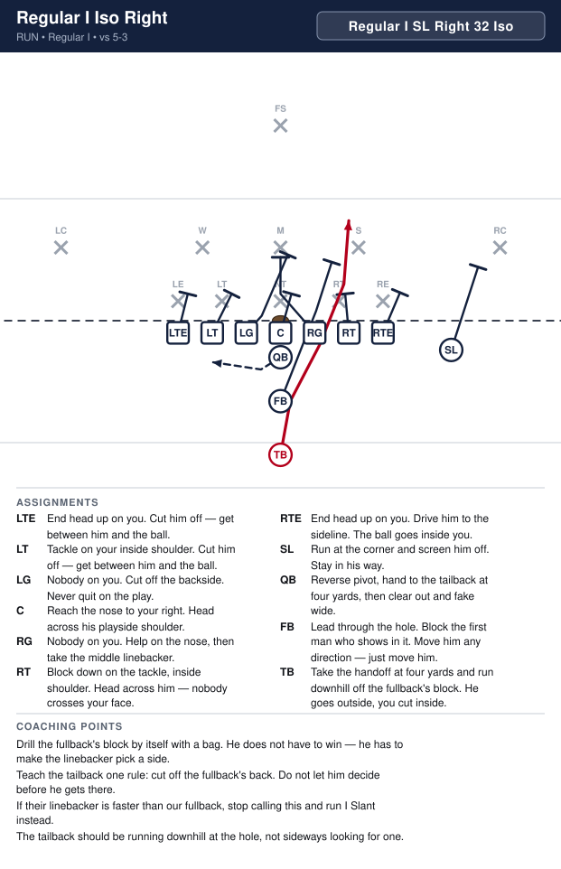

The whole play is one block: the fullback isolates their linebacker in the hole and the tailback runs off whichever way that block goes. It teaches a back to read a block, which is the skill this formation is here to build.

| Position | Assignment |
|---|---|
| **LTE** | End head up on you. Cut him off — get between him and the ball. |
| **LT** | Tackle on your inside shoulder. Cut him off — get between him and the ball. |
| **LG** | Nobody on you. Cut off the backside. Never quit on the play. |
| **C** | Reach the nose to your right. Head across his playside shoulder. |
| **RG** | Nobody on you. Help on the nose, then take the middle linebacker. |
| **RT** | Block down on the tackle, inside shoulder. Head across him — nobody crosses your face. |
| **RTE** | End head up on you. Drive him to the sideline. The ball goes inside you. |
| **SL** | Run at the corner and screen him off. Stay in his way. |
| **QB** | Reverse pivot, hand to the tailback at four yards, then clear out and fake wide. |
| **FB** | Lead through the hole. Block the first man who shows in it. Move him any direction — just move him. |
| **TB** **(ball)** | Take the handoff at four yards and run downhill off the fullback's block. He goes outside, you cut inside. |

**Coaching points**

- Drill the fullback's block by itself with a bag. He does not have to win — he has to make the linebacker pick a side.
- Teach the tailback one rule: cut off the fullback's back. Do not let him decide before he gets there.
- If their linebacker is faster than our fullback, stop calling this and run I Slant instead.
- The tailback should be running downhill at the hole, not sideways looking for one.

---

## Regular I Iso Left

**Call it:** `Regular I SL Right 33 Iso`

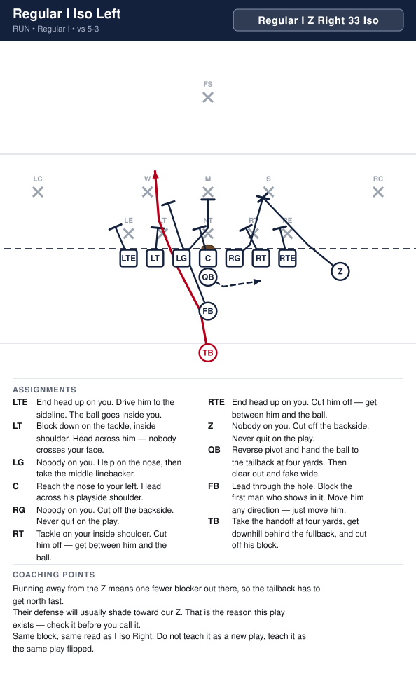

The same isolation block the other way. The SL stays where he is, so this runs away from our strength — which is exactly why it is open.

| Position | Assignment |
|---|---|
| **LTE** | End head up on you. Drive him to the sideline. The ball goes inside you. |
| **LT** | Block down on the tackle, inside shoulder. Head across him — nobody crosses your face. |
| **LG** | Nobody on you. Help on the nose, then take the middle linebacker. |
| **C** | Reach the nose to your left. Head across his playside shoulder. |
| **RG** | Nobody on you. Cut off the backside. Never quit on the play. |
| **RT** | Tackle on your inside shoulder. Cut him off — get between him and the ball. |
| **RTE** | End head up on you. Cut him off — get between him and the ball. |
| **SL** | Cut off the backside. Never quit on the play. |
| **QB** | Reverse pivot, hand to the tailback at four yards, then clear out and fake wide. |
| **FB** | Lead through the hole. Block the first man who shows in it. Move him any direction — just move him. |
| **TB** **(ball)** | Take the handoff at four yards, get downhill behind the fullback, and cut off his block. |

**Coaching points**

- Running away from the SL means one fewer blocker out there, so the tailback has to get north fast.
- Their defense will usually shade toward our SL. That is the reason this play exists — check it before you call it.
- Same block, same read as I Iso Right. Do not teach it as a new play, teach it as the same play flipped.

---

## Regular I Power Right

**Call it:** `Regular I SL Right 34 Power`

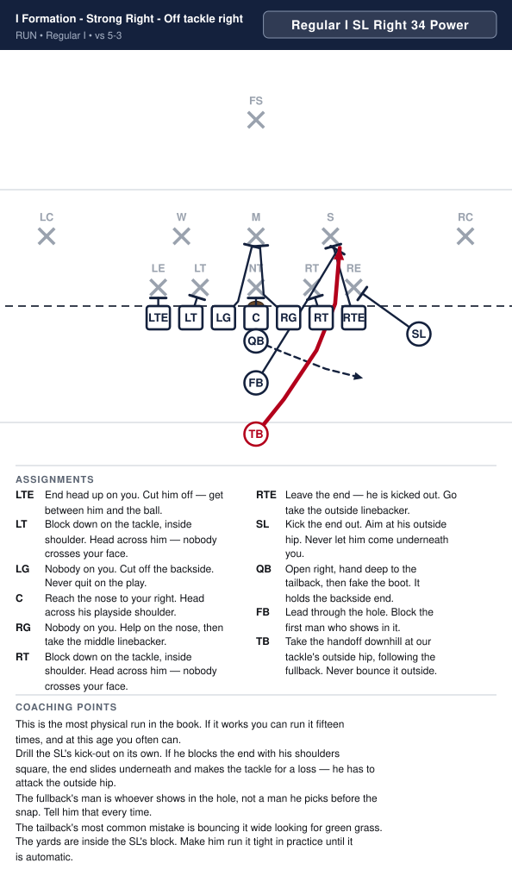

Our best downhill run. Everybody blocks down inside, the SL kicks the end out, and the fullback leads through the hole in front of the tailback. Nobody leaves his spot — every block on the card is made by the kid already standing there.

| Position | Assignment |
|---|---|
| **LTE** | End head up on you. Cut him off — get between him and the ball. |
| **LT** | Block down on the tackle, inside shoulder. Head across him — nobody crosses your face. |
| **LG** | Nobody on you. Cut off the backside. Never quit on the play. |
| **C** | Reach the nose to your right. Head across his playside shoulder. |
| **RG** | Nobody on you. Help on the nose, then take the middle linebacker. |
| **RT** | Block down on the tackle, inside shoulder. Head across him — nobody crosses your face. |
| **RTE** | Leave the end — he is kicked out. Go take the outside linebacker. |
| **SL** | Kick the end out. Aim at his outside hip. Never let him come underneath you. |
| **QB** | Open right, hand deep to the tailback, then fake the boot. It holds the backside end. |
| **FB** | Lead through the hole. Block the first man who shows in it. |
| **TB** **(ball)** | Take the handoff downhill at our tackle's outside hip, following the fullback. Never bounce it outside. |

**Coaching points**

- This is the most physical run in the book. If it works you can run it fifteen times, and at this age you often can.
- Drill the SL's kick-out on its own. If he blocks the end with his shoulders square, the end slides underneath and makes the tackle for a loss — he has to attack the outside hip.
- The fullback's man is whoever shows in the hole, not a man he picks before the snap. Tell him that every time.
- The tailback's most common mistake is bouncing it wide looking for green grass. The yards are inside the SL's block. Make him run it tight in practice until it is automatic.

---

## Regular I Power Left

**Call it:** `Regular I SL Left 35 Power`

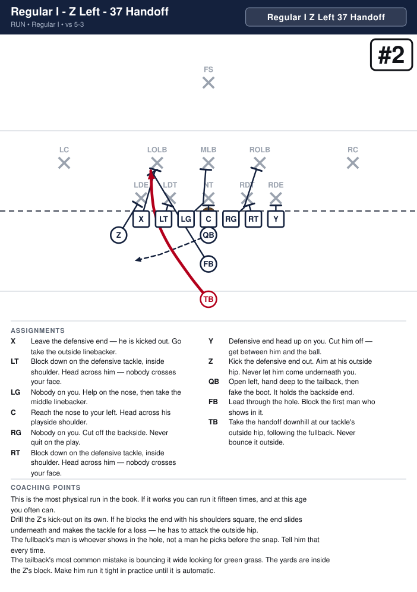

Power Right's exact mirror. The SL is fixed on the right in every other Regular I play, but Power depends on his kick-out block, so this is the one play in the book where he flips sides before the snap — lined up left, same job, same footwork, just facing the other way.

| Position | Assignment |
|---|---|
| **LTE** | Leave the end — he is kicked out. Go take the outside linebacker. |
| **LT** | Block down on the tackle, inside shoulder. Head across him — nobody crosses your face. |
| **LG** | Nobody on you. Help on the nose, then take the middle linebacker. |
| **C** | Reach the nose to your left. Head across his playside shoulder. |
| **RG** | Nobody on you. Cut off the backside. Never quit on the play. |
| **RT** | Block down on the tackle, inside shoulder. Head across him — nobody crosses your face. |
| **RTE** | End head up on you. Cut him off — get between him and the ball. |
| **SL** | Kick the end out. Aim at his outside hip. Never let him come underneath you. |
| **QB** | Open left, hand deep to the tailback, then fake the boot. It holds the backside end. |
| **FB** | Lead through the hole. Block the first man who shows in it. |
| **TB** **(ball)** | Take the handoff downhill at our tackle's outside hip, following the fullback. Never bounce it outside. |

**Coaching points**

- This is the most physical run in the book, mirrored. If it works going right, it works going left — the blocking is identical, just flipped.
- The SL is used to lining up on the right. Make sure he actually moves before the snap on this call and does not just run the block from where he always stands.
- Drill the SL's kick-out on its own, same as the other direction. If he blocks the end with his shoulders square, the end slides underneath and makes the tackle for a loss — he has to attack the outside hip.
- The fullback's man is whoever shows in the hole, not one he picks before the snap. Same as the other direction.
- The tailback's most common mistake is bouncing it wide looking for green grass. The yards are inside the SL's block, same as Power Right. Make him run it tight in practice until it is automatic.

---

## Regular I Counter Right

**Call it:** `Regular I SL Right 34 Counter`

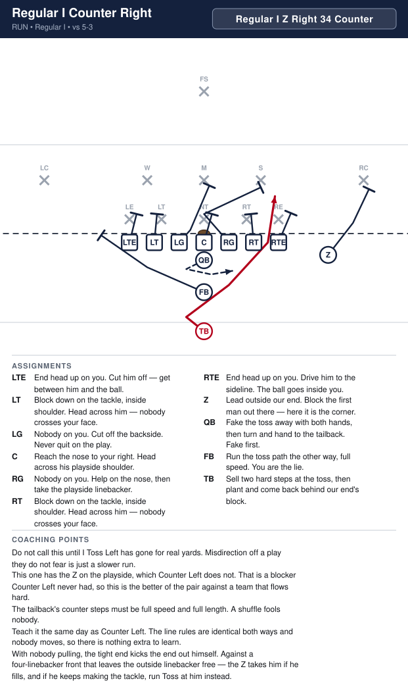

Counter Left the other way. We show them the toss to the weak side, their linebackers chase it, and the tailback plants and comes back to the SL side behind the tight end's kick-out.

| Position | Assignment |
|---|---|
| **LTE** | End head up on you. Cut him off — get between him and the ball. |
| **LT** | Block down on the tackle, inside shoulder. Head across him — nobody crosses your face. |
| **LG** | Nobody on you. Cut off the backside. Never quit on the play. |
| **C** | Reach the nose to your right. Head across his playside shoulder. |
| **RG** | Nobody on you. Help on the nose, then take the playside linebacker. |
| **RT** | Block down on the tackle, inside shoulder. Head across him — nobody crosses your face. |
| **RTE** | End head up on you. Drive him to the sideline. The ball goes inside you. |
| **SL** | Lead outside our end. Block the first man out there — here it is the corner. |
| **QB** | Fake the toss away with both hands, then turn and hand to the tailback. Fake first. |
| **FB** | Run the toss path the other way, full speed. You are the lie. |
| **TB** **(ball)** | Sell two hard steps at the toss, then plant and come back behind our end's block. |

**Coaching points**

- Do not call this until I Toss Left has gone for real yards. Misdirection off a play they do not fear is just a slower run.
- This one has the SL on the playside, which Counter Left does not. That is a blocker Counter Left never had, so this is the better of the pair against a team that flows hard.
- The tailback's counter steps must be full speed and full length. A shuffle fools nobody.
- Teach it the same day as Counter Left. The line rules are identical both ways and nobody moves, so there is nothing extra to learn.
- With nobody pulling, the tight end kicks the end out himself. Against a four-linebacker front that leaves the outside linebacker free — the SL takes him if he fills, and if he keeps making the tackle, run Toss at him instead.

---

## Regular I Counter Left

**Call it:** `Regular I SL Right 35 Counter`

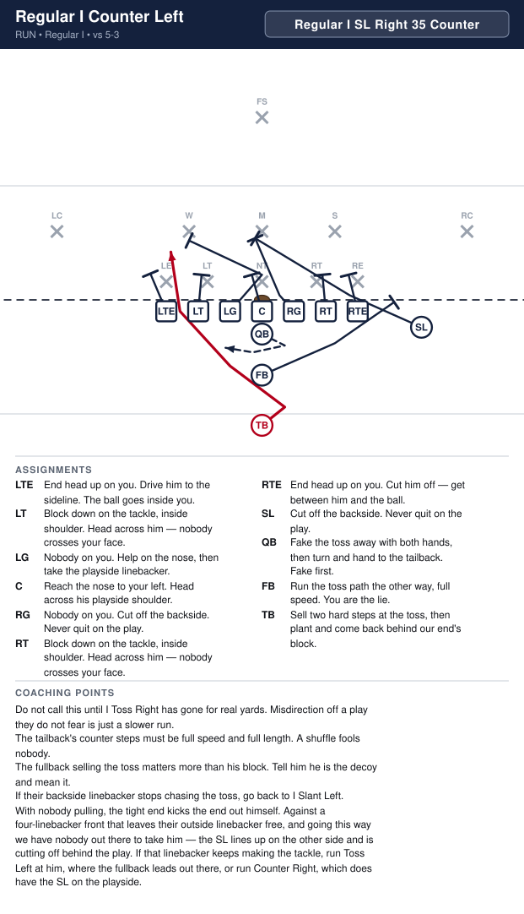

Misdirection off the toss. We show them the toss to the SL side, their linebackers chase, and the tailback plants and comes back weak behind the tight end's kick-out.

| Position | Assignment |
|---|---|
| **LTE** | End head up on you. Drive him to the sideline. The ball goes inside you. |
| **LT** | Block down on the tackle, inside shoulder. Head across him — nobody crosses your face. |
| **LG** | Nobody on you. Help on the nose, then take the playside linebacker. |
| **C** | Reach the nose to your left. Head across his playside shoulder. |
| **RG** | Nobody on you. Cut off the backside. Never quit on the play. |
| **RT** | Block down on the tackle, inside shoulder. Head across him — nobody crosses your face. |
| **RTE** | End head up on you. Cut him off — get between him and the ball. |
| **SL** | Cut off the backside. Never quit on the play. |
| **QB** | Fake the toss away with both hands, then turn and hand to the tailback. Fake first. |
| **FB** | Run the toss path the other way, full speed. You are the lie. |
| **TB** **(ball)** | Sell two hard steps at the toss, then plant and come back behind our end's block. |

**Coaching points**

- Do not call this until I Toss Right has gone for real yards. Misdirection off a play they do not fear is just a slower run.
- The tailback's counter steps must be full speed and full length. A shuffle fools nobody.
- The fullback selling the toss matters more than his block. Tell him he is the decoy and mean it.
- If their backside linebacker stops chasing the toss, go back to I Slant Left.
- With nobody pulling, the tight end kicks the end out himself. Against a four-linebacker front that leaves their outside linebacker free, and going this way we have nobody out there to take him — the SL lines up on the other side and is cutting off behind the play. If that linebacker keeps making the tackle, run Toss Left at him, where the fullback leads out there, or run Counter Right, which does have the SL on the playside.

---

## Regular I Boot Right

**Call it:** `Regular I SL Right 16 Boot`

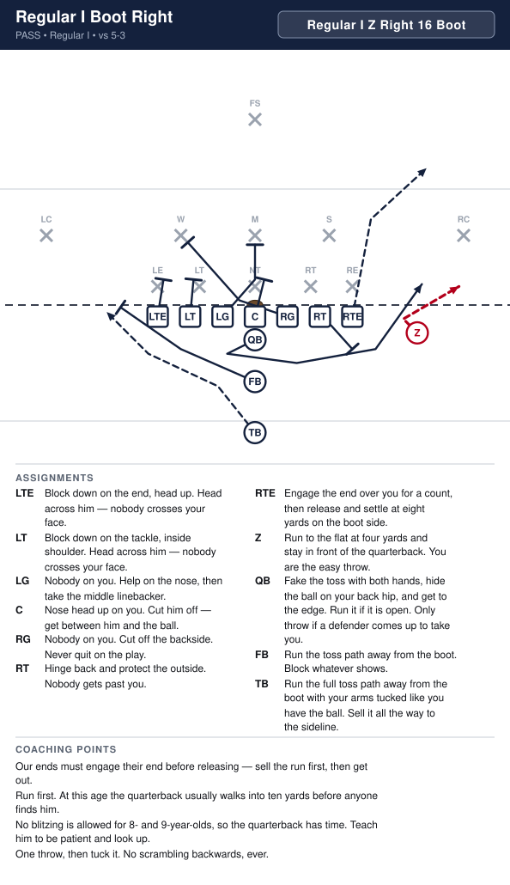

Play action off the toss look. Two receivers to the SL side and a quarterback with the whole edge to himself. Run first, throw second.

| Position | Assignment |
|---|---|
| **LTE** | Block down on the end, head up. Head across him — nobody crosses your face. |
| **LT** | Block down on the tackle, inside shoulder. Head across him — nobody crosses your face. |
| **LG** | Nobody on you. Help on the nose, then take the middle linebacker. |
| **C** | Nose head up on you. Cut him off — get between him and the ball. |
| **RG** | Nobody on you. Cut off the backside. Never quit on the play. |
| **RT** | Hinge back and protect the outside. Nobody gets past you. |
| **RTE** | Bump the end, then release and settle at eight yards on the boot side. |
| **SL** **(ball)** | Run to the flat at four yards in front of the quarterback. You are his easy throw. |
| **QB** | Fake the toss, hide it on your back hip, run the edge. Throw only when they take you. |
| **FB** | Run the toss path away from the boot. Block whatever shows. |
| **TB** | Run the toss path away, arms tucked like you have it. Sell it to the sideline. |

**Coaching points**

- Our ends must engage their end before releasing — sell the run first, then get out.
- Run first. At this age the quarterback usually walks into ten yards before anyone finds him.
- No blitzing is allowed for 8- and 9-year-olds, so the quarterback has time. Teach him to be patient and look up.
- One throw, then tuck it. No scrambling backwards, ever.

---

## Regular I Boot Left

**Call it:** `Regular I SL Right 17 Boot`

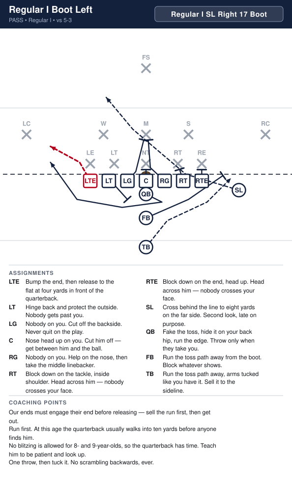

Boot Left off the toss action. Everybody sells the toss going right and the quarterback keeps it to the left edge alone — the tight end in the flat in front of him, the SL coming all the way across behind. Run first, throw second.

| Position | Assignment |
|---|---|
| **LTE** **(ball)** | Bump the end, then release to the flat at four yards in front of the quarterback. |
| **LT** | Hinge back and protect the outside. Nobody gets past you. |
| **LG** | Nobody on you. Cut off the backside. Never quit on the play. |
| **C** | Nose head up on you. Cut him off — get between him and the ball. |
| **RG** | Nobody on you. Help on the nose, then take the middle linebacker. |
| **RT** | Block down on the tackle, inside shoulder. Head across him — nobody crosses your face. |
| **RTE** | Block down on the end, head up. Head across him — nobody crosses your face. |
| **SL** | Cross behind the line to eight yards on the far side. Second look, late on purpose. |
| **QB** | Fake the toss, hide it on your back hip, run the edge. Throw only when they take you. |
| **FB** | Run the toss path away from the boot. Block whatever shows. |
| **TB** | Run the toss path away, arms tucked like you have it. Sell it to the sideline. |

**Coaching points**

- Our ends must engage their end before releasing — sell the run first, then get out.
- Run first. At this age the quarterback usually walks into ten yards before anyone finds him.
- No blitzing is allowed for 8- and 9-year-olds, so the quarterback has time. Teach him to be patient and look up.
- One throw, then tuck it. No scrambling backwards, ever.

---

## Regular I Waggle Right

**Call it:** `Regular I SL Right 16 Waggle`

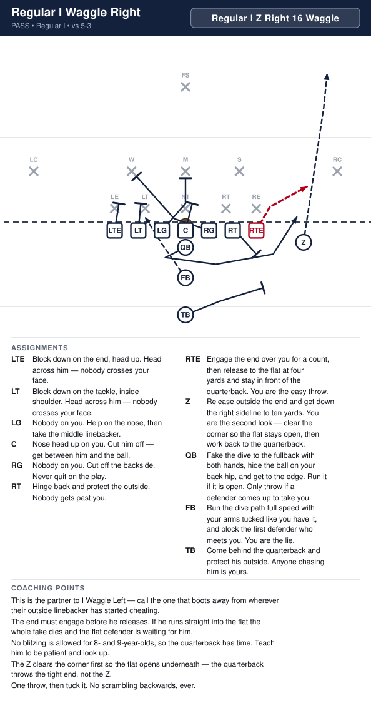

Waggle Right off the dive fake. The quarterback fakes the dive and boots to the right edge, with the tight end in the flat in front of him and the SL clearing the corner over the top. Run first, throw second.

| Position | Assignment |
|---|---|
| **LTE** | Block down on the end, head up. Head across him — nobody crosses your face. |
| **LT** | Block down on the tackle, inside shoulder. Head across him — nobody crosses your face. |
| **LG** | Nobody on you. Help on the nose, then take the middle linebacker. |
| **C** | Nose head up on you. Cut him off — get between him and the ball. |
| **RG** | Nobody on you. Cut off the backside. Never quit on the play. |
| **RT** | Hinge back and protect the outside. Nobody gets past you. |
| **RTE** **(ball)** | Bump the end, then release to the flat at four yards in front of the quarterback. |
| **SL** | Sprint down the right sideline to ten yards, taking the corner with you. Then work back to the quarterback. |
| **QB** | Fake the dive, hide it on your back hip, run the edge. Throw only when they take you. |
| **FB** | Run the dive path full speed, arms tucked, and block whoever meets you. Be the lie. |
| **TB** | Come behind the quarterback and protect his outside. Anyone chasing him is yours. |

**Coaching points**

- This is the partner to I Waggle Left — call the one that boots away from wherever their outside linebacker has started cheating.
- The end must engage before he releases. If he runs straight into the flat the whole fake dies and the flat defender is waiting for him.
- No blitzing is allowed for 8- and 9-year-olds, so the quarterback has time. Teach him to be patient and look up.
- The SL clears the corner first so the flat opens underneath — the quarterback throws the tight end, not the SL.
- One throw, then tuck it. No scrambling backwards, ever.

---

## Regular I Waggle Left

**Call it:** `Regular I SL Right 17 Waggle`

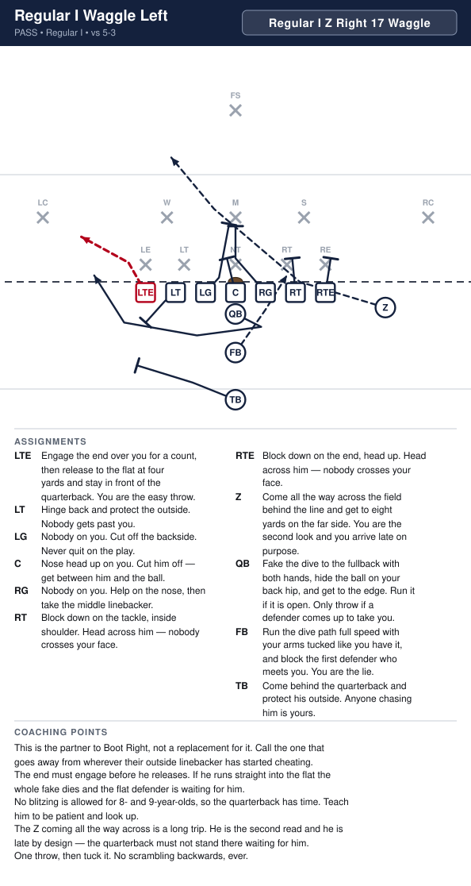

Waggle Right the other way. The quarterback fakes the dive and gets to the weak edge with the end in the flat in front of him and the SL coming all the way across behind. Run first, throw second.

| Position | Assignment |
|---|---|
| **LTE** **(ball)** | Bump the end, then release to the flat at four yards in front of the quarterback. |
| **LT** | Hinge back and protect the outside. Nobody gets past you. |
| **LG** | Nobody on you. Cut off the backside. Never quit on the play. |
| **C** | Nose head up on you. Cut him off — get between him and the ball. |
| **RG** | Nobody on you. Help on the nose, then take the middle linebacker. |
| **RT** | Block down on the tackle, inside shoulder. Head across him — nobody crosses your face. |
| **RTE** | Block down on the end, head up. Head across him — nobody crosses your face. |
| **SL** | Cross behind the line to eight yards on the far side. Second look, late on purpose. |
| **QB** | Fake the dive, hide it on your back hip, run the edge. Throw only when they take you. |
| **FB** | Run the dive path full speed, arms tucked, and block whoever meets you. Be the lie. |
| **TB** | Come behind the quarterback and protect his outside. Anyone chasing him is yours. |

**Coaching points**

- This is the partner to I Waggle Right, not a replacement for it. Call the one that boots away from wherever their outside linebacker has started cheating.
- The end must engage before he releases. If he runs straight into the flat the whole fake dies and the flat defender is waiting for him.
- No blitzing is allowed for 8- and 9-year-olds, so the quarterback has time. Teach him to be patient and look up.
- The SL coming all the way across is a long trip. He is the second read and he is late by design — the quarterback must not stand there waiting for him.
- One throw, then tuck it. No scrambling backwards, ever.

---

## Regular I Jet Boot Right

**Call it:** `Regular I SL Right 16 Jet Boot`

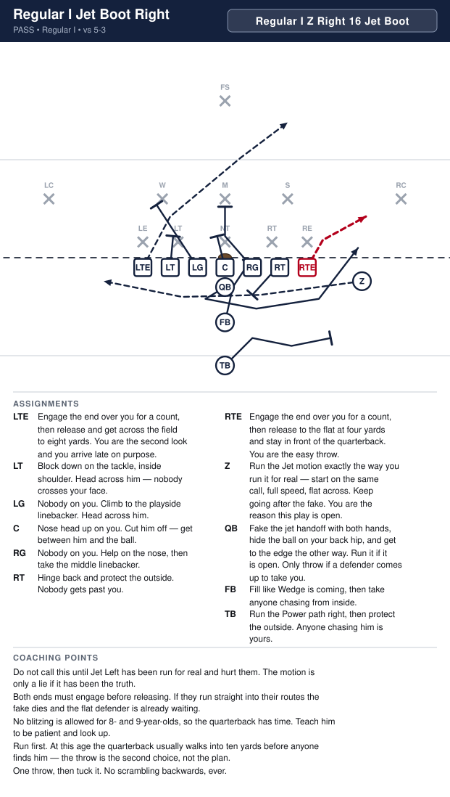

Jet motion pulls the whole defense one way and the quarterback keeps it the other. This is the play Jet Left is really setting up, and at this age the edge is usually empty.

| Position | Assignment |
|---|---|
| **LTE** | Bump the end, then cross the field to eight yards. Second look, late on purpose. |
| **LT** | Block down on the tackle, inside shoulder. Head across him — nobody crosses your face. |
| **LG** | Nobody on you. Climb to the playside linebacker. Head across him. |
| **C** | Nose head up on you. Cut him off — get between him and the ball. |
| **RG** | Nobody on you. Help on the nose, then take the middle linebacker. |
| **RT** | Hinge back and protect the outside. Nobody gets past you. |
| **RTE** **(ball)** | Bump the end, then release to the flat at four yards in front of the quarterback. |
| **SL** | Run the Jet motion for real: same call, full speed, flat across, never stopping. |
| **QB** | Fake the jet, hide it on your back hip, boot the other way. Throw only when they take you. |
| **FB** | Fill like Wedge is coming, then take anyone chasing from inside. |
| **TB** | Run the Power path right, then protect the outside. Anyone chasing him is yours. |

**Coaching points**

- Do not call this until Jet Left has been run for real and hurt them. The motion is only a lie if it has been the truth.
- Both ends must engage before releasing. If they run straight into their routes the fake dies and the flat defender is already waiting.
- No blitzing is allowed for 8- and 9-year-olds, so the quarterback has time. Teach him to be patient and look up.
- Run first. At this age the quarterback usually walks into ten yards before anyone finds him — the throw is the second choice, not the plan.
- One throw, then tuck it. No scrambling backwards, ever.

---

## Regular I Jet Boot Left

**Call it:** `Regular I SL Right 17 Jet Boot`

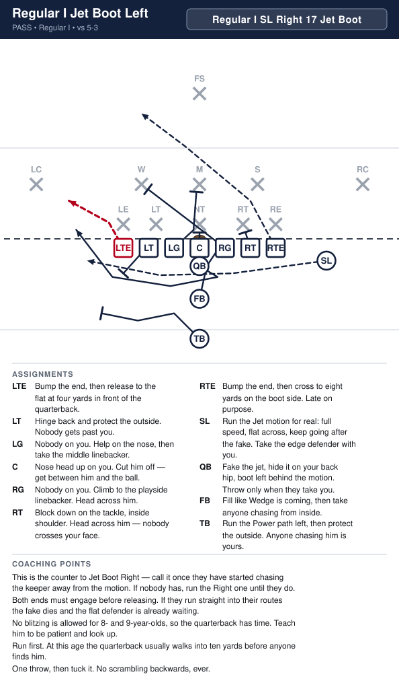

The change-up to Jet Boot Right. The SL runs the jet the same way, but this time the quarterback keeps it and boots in behind the motion instead of away from it. The end who has been squeezing the keeper the other way is the one it beats.

| Position | Assignment |
|---|---|
| **LTE** **(ball)** | Bump the end, then release to the flat at four yards in front of the quarterback. |
| **LT** | Hinge back and protect the outside. Nobody gets past you. |
| **LG** | Nobody on you. Help on the nose, then take the middle linebacker. |
| **C** | Nose head up on you. Cut him off — get between him and the ball. |
| **RG** | Nobody on you. Climb to the playside linebacker. Head across him. |
| **RT** | Block down on the tackle, inside shoulder. Head across him — nobody crosses your face. |
| **RTE** | Bump the end, then cross to eight yards on the boot side. Late on purpose. |
| **SL** | Run the Jet motion for real: full speed, flat across, keep going after the fake. Take the edge defender with you. |
| **QB** | Fake the jet, hide it on your back hip, boot left behind the motion. Throw only when they take you. |
| **FB** | Fill like Wedge is coming, then take anyone chasing from inside. |
| **TB** | Run the Power path left, then protect the outside. Anyone chasing him is yours. |

**Coaching points**

- This is the counter to Jet Boot Right — call it once they have started chasing the keeper away from the motion. If nobody has, run the Right one until they do.
- Both ends must engage before releasing. If they run straight into their routes the fake dies and the flat defender is already waiting.
- No blitzing is allowed for 8- and 9-year-olds, so the quarterback has time. Teach him to be patient and look up.
- Run first. At this age the quarterback usually walks into ten yards before anyone finds him.
- One throw, then tuck it. No scrambling backwards, ever.

---

## Regular I Power Boot Right

**Call it:** `Regular I SL Right 16 Power Boot`

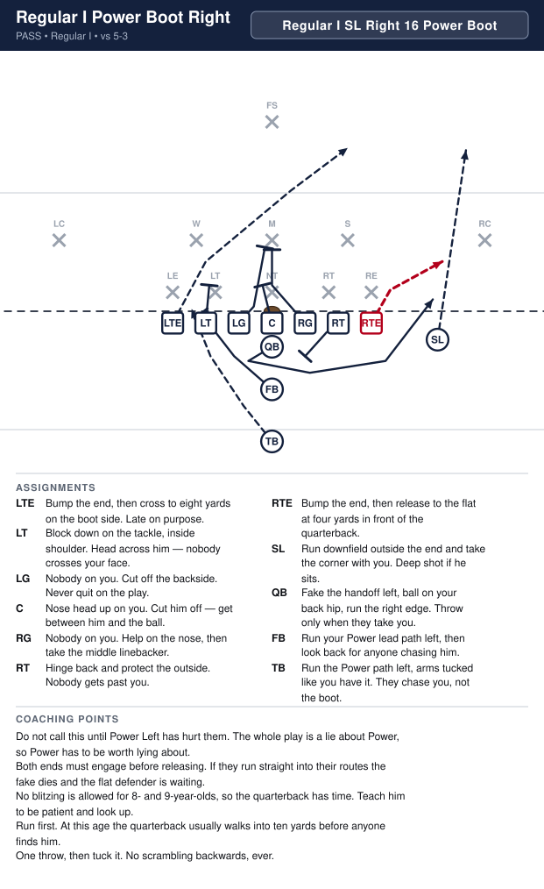

Boot Right off the Power look. Everybody flows left selling Power and the quarterback keeps it to the right edge alone — the tight end in the flat, the backside end coming across behind. Run first, throw second.

| Position | Assignment |
|---|---|
| **LTE** | Bump the end, then cross to eight yards on the boot side. Late on purpose. |
| **LT** | Block down on the tackle, inside shoulder. Head across him — nobody crosses your face. |
| **LG** | Nobody on you. Cut off the backside. Never quit on the play. |
| **C** | Nose head up on you. Cut him off — get between him and the ball. |
| **RG** | Nobody on you. Help on the nose, then take the middle linebacker. |
| **RT** | Hinge back and protect the outside. Nobody gets past you. |
| **RTE** **(ball)** | Bump the end, then release to the flat at four yards in front of the quarterback. |
| **SL** | Run downfield outside the end and take the corner with you. Deep shot if he sits. |
| **QB** | Fake the handoff left, ball on your back hip, run the right edge. Throw only when they take you. |
| **FB** | Run your Power lead path left, then look back for anyone chasing him. |
| **TB** | Run the Power path left, arms tucked like you have it. They chase you, not the boot. |

**Coaching points**

- Do not call this until Power Left has hurt them. The whole play is a lie about Power, so Power has to be worth lying about.
- Both ends must engage before releasing. If they run straight into their routes the fake dies and the flat defender is waiting.
- No blitzing is allowed for 8- and 9-year-olds, so the quarterback has time. Teach him to be patient and look up.
- Run first. At this age the quarterback usually walks into ten yards before anyone finds him.
- One throw, then tuck it. No scrambling backwards, ever.

---

## Regular I Power Boot Left

**Call it:** `Regular I SL Right 17 Power Boot`

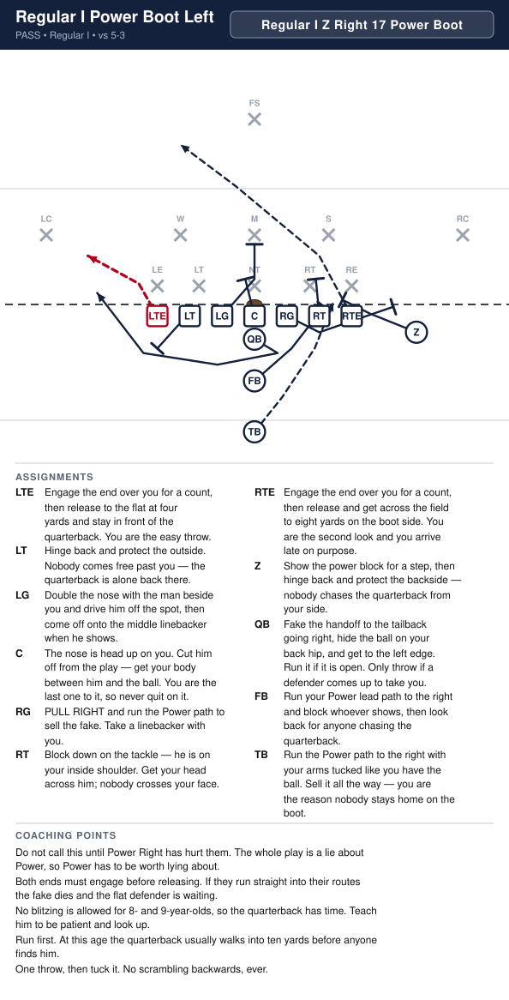

Boot Left off the Power look. Everybody flows right selling Power and the quarterback keeps it to the left edge alone — the tight end in the flat, the backside end coming across behind. Run first, throw second.

| Position | Assignment |
|---|---|
| **LTE** **(ball)** | Bump the end, then release to the flat at four yards in front of the quarterback. |
| **LT** | Hinge back and protect the outside. Nobody gets past you. |
| **LG** | Nobody on you. Help on the nose, then take the middle linebacker. |
| **C** | Nose head up on you. Cut him off — get between him and the ball. |
| **RG** | Nobody on you. Cut off the backside. Never quit on the play. |
| **RT** | Block down on the tackle, inside shoulder. Head across him — nobody crosses your face. |
| **RTE** | Bump the end, then cross to eight yards on the boot side. Late on purpose. |
| **SL** | Show the power block a step, then hinge back. Nobody chases from your side. |
| **QB** | Fake the handoff right, ball on your back hip, run the left edge. Throw only when they take you. |
| **FB** | Run your Power lead path right, then look back for anyone chasing him. |
| **TB** | Run the Power path right, arms tucked like you have it. They chase you, not the boot. |

**Coaching points**

- Do not call this until Power Right has hurt them. The whole play is a lie about Power, so Power has to be worth lying about.
- Both ends must engage before releasing. If they run straight into their routes the fake dies and the flat defender is waiting.
- No blitzing is allowed for 8- and 9-year-olds, so the quarterback has time. Teach him to be patient and look up.
- Run first. At this age the quarterback usually walks into ten yards before anyone finds him.
- One throw, then tuck it. No scrambling backwards, ever.

---

## Regular I Slant Right

**Call it:** `Regular I SL Right 36 Slant`

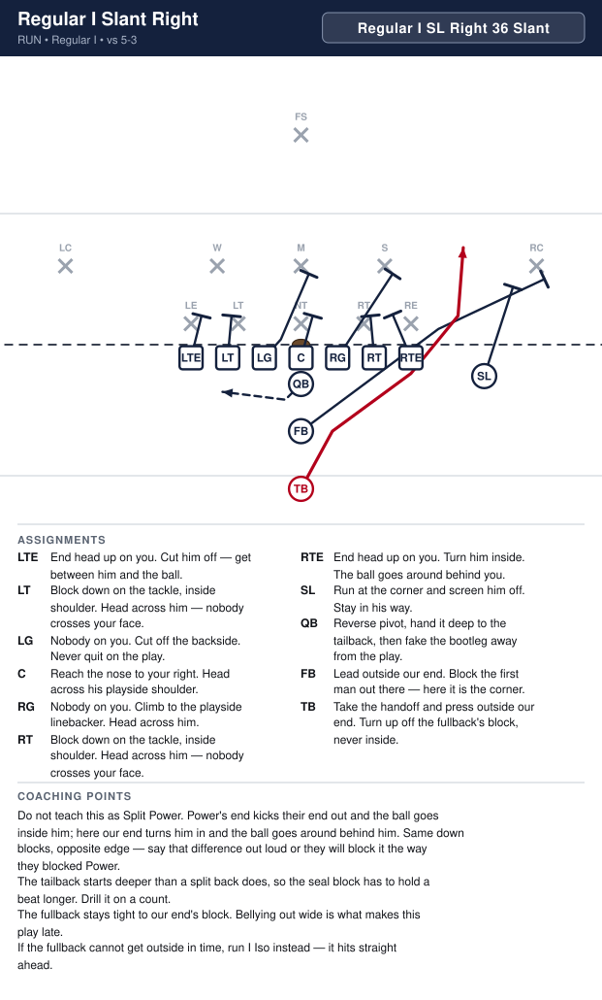

Off the tight end. Our end seals their end inside and the fullback leads around him. This one hits just wide of the formation, not between the tackle and the end.

| Position | Assignment |
|---|---|
| **LTE** | End head up on you. Cut him off — get between him and the ball. |
| **LT** | Block down on the tackle, inside shoulder. Head across him — nobody crosses your face. |
| **LG** | Nobody on you. Cut off the backside. Never quit on the play. |
| **C** | Reach the nose to your right. Head across his playside shoulder. |
| **RG** | Nobody on you. Climb to the playside linebacker. Head across him. |
| **RT** | Block down on the tackle, inside shoulder. Head across him — nobody crosses your face. |
| **RTE** | End head up on you. Turn him inside. The ball goes around behind you. |
| **SL** | Run at the corner and screen him off. Stay in his way. |
| **QB** | Reverse pivot, hand it deep to the tailback, then fake the bootleg away from the play. |
| **FB** | Lead outside our end. Block the first man out there — here it is the corner. |
| **TB** **(ball)** | Take the handoff and press outside our end. Turn up off the fullback's block, never inside. |

**Coaching points**

- Do not teach this as Split Power. Power's end kicks their end out and the ball goes inside him; here our end turns him in and the ball goes around behind him. Same down blocks, opposite edge — say that difference out loud or they will block it the way they blocked Power.
- The tailback starts deeper than a split back does, so the seal block has to hold a beat longer. Drill it on a count.
- The fullback stays tight to our end's block. Bellying out wide is what makes this play late.
- If the fullback cannot get outside in time, run I Iso instead — it hits straight ahead.

---

## Regular I Slant Left

**Call it:** `Regular I SL Right 37 Slant`

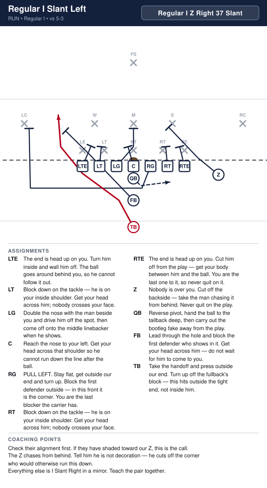

Off the tight end. Our end seals their end inside and the fullback leads around him. This one hits just wide of the formation, not between the tackle and the end.

| Position | Assignment |
|---|---|
| **LTE** | End head up on you. Turn him inside. The ball goes around behind you. |
| **LT** | Block down on the tackle, inside shoulder. Head across him — nobody crosses your face. |
| **LG** | Nobody on you. Climb to the playside linebacker. Head across him. |
| **C** | Reach the nose to your left. Head across his playside shoulder. |
| **RG** | Nobody on you. Cut off the backside. Never quit on the play. |
| **RT** | Block down on the tackle, inside shoulder. Head across him — nobody crosses your face. |
| **RTE** | End head up on you. Cut him off — get between him and the ball. |
| **SL** | Cut off the backside. Never quit on the play. |
| **QB** | Reverse pivot, hand it deep to the tailback, then fake the bootleg away from the play. |
| **FB** | Lead outside our end. Block the first man out there — here it is the corner. |
| **TB** **(ball)** | Take the handoff and press outside our end. Turn up off the fullback's block, never inside. |

**Coaching points**

- Check their alignment first. If they have shaded toward our SL, this is the call.
- The SL chases from the back side, and his man is the backside linebacker — not the corner, who is on the far side of the field from him. Tell him he is not decoration: he is the reason nothing catches this from behind.
- Nobody is assigned to their playside corner. Against the 5-3 the fullback's lead block finds him anyway; against a four-linebacker front the fullback has the outside linebacker instead and the tailback beats the corner himself or gets caught.
- The line and the fullback are I Slant Right in a mirror. Only the SL is different, because he lines up on the right either way. Teach the pair together.

---

## Regular I Toss Right

**Call it:** `Regular I SL Right 38 Toss`

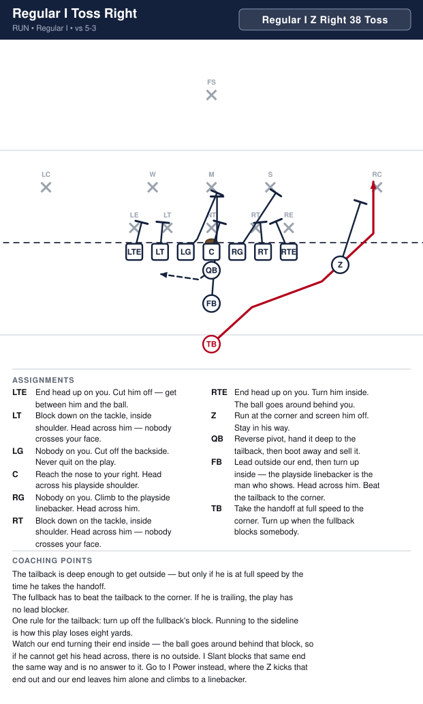

Get all the way outside. Wider than the Slant — the tailback takes the handoff at full speed and runs past the tight end's block to the corner, with the fullback out in front of him.

| Position | Assignment |
|---|---|
| **LTE** | End head up on you. Cut him off — get between him and the ball. |
| **LT** | Block down on the tackle, inside shoulder. Head across him — nobody crosses your face. |
| **LG** | Nobody on you. Cut off the backside. Never quit on the play. |
| **C** | Reach the nose to your right. Head across his playside shoulder. |
| **RG** | Nobody on you. Climb to the playside linebacker. Head across him. |
| **RT** | Block down on the tackle, inside shoulder. Head across him — nobody crosses your face. |
| **RTE** | End head up on you. Turn him inside. The ball goes around behind you. |
| **SL** | Run at the corner and screen him off. Stay in his way. |
| **QB** | Reverse pivot, hand it deep to the tailback, then boot away and sell it. |
| **FB** | Lead outside our end. Block the first man out there — here it is the corner. Beat the tailback to the corner. |
| **TB** **(ball)** | Take the handoff at full speed to the corner. Turn up when the fullback blocks somebody. |

**Coaching points**

- The tailback is deep enough to get outside — but only if he is at full speed by the time he takes the handoff.
- The fullback has to beat the tailback to the corner. If he is trailing, the play has no lead blocker.
- One rule for the tailback: turn up off the fullback's block. Running to the sideline is how this play loses eight yards.
- Watch our end turning their end inside — the ball goes around behind that block, so if he cannot get his head across, there is no outside. I Slant blocks that same end the same way and is no answer to it. Go to I Power instead, where the SL kicks that end out and our end leaves him alone and climbs to a linebacker.

---

## Regular I Toss Left

**Call it:** `Regular I SL Right 39 Toss`

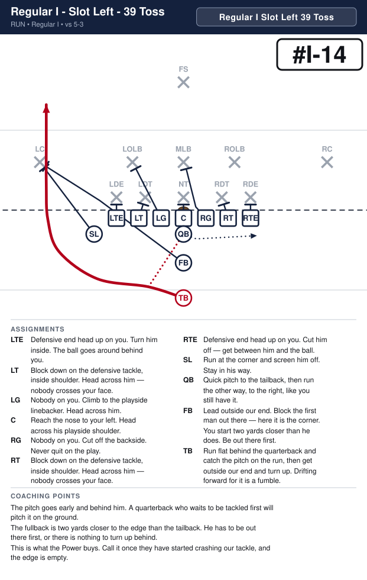

Get all the way outside. Wider than the Slant — the tailback takes the handoff at full speed and runs past the tight end's block to the corner, with the fullback out in front of him.

| Position | Assignment |
|---|---|
| **LTE** | End head up on you. Turn him inside. The ball goes around behind you. |
| **LT** | Block down on the tackle, inside shoulder. Head across him — nobody crosses your face. |
| **LG** | Nobody on you. Climb to the playside linebacker. Head across him. |
| **C** | Reach the nose to your left. Head across his playside shoulder. |
| **RG** | Nobody on you. Cut off the backside. Never quit on the play. |
| **RT** | Block down on the tackle, inside shoulder. Head across him — nobody crosses your face. |
| **RTE** | End head up on you. Cut him off — get between him and the ball. |
| **SL** | Cut off the backside. Never quit on the play. |
| **QB** | Reverse pivot, hand it deep to the tailback, then boot away and sell it. |
| **FB** | Lead outside our end. Block the first man out there — here it is the corner. Beat the tailback to the corner. |
| **TB** **(ball)** | Take the handoff at full speed to the corner. Turn up when the fullback blocks somebody. |

**Coaching points**

- Check their alignment first. If they have shifted toward our SL, this is the call.
- The fullback has further to travel here than he does going right, so he has to leave on the snap. If he trails the tailback the play has no lead blocker.
- One rule for the tailback: turn up off the fullback's block. Running to the sideline is how this play loses eight yards.
- The SL chases from the back side, and his man is the backside linebacker, not the corner — he is running infield, away from the sideline the ball is headed for. He is the reason nothing catches this from behind.
- Against the 4-4 the fullback leads on their outside linebacker and nobody touches the corner, a yard off where the ball crosses — the tailback has to turn up inside and make that corner come to him. The 5-3 puts the fullback on the corner instead; the 5-4-2 has no corner at all.

---

## Regular I Jet Right

**Call it:** `Regular I SL Left 48 Jet`

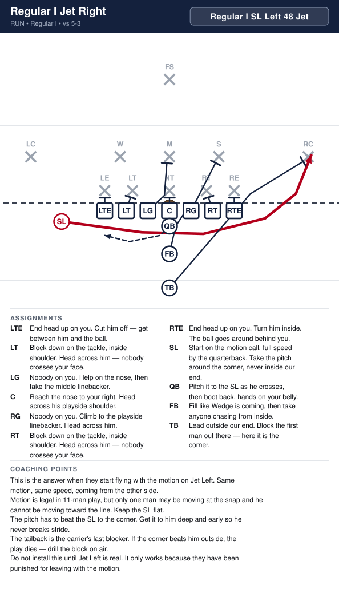

Jet Left run back the other way. The SL lines up on the weak side and goes in motion across the formation at full speed, and the pitch gets him outside our tight end before the defense can turn and run with him.

| Position | Assignment |
|---|---|
| **LTE** | End head up on you. Cut him off — get between him and the ball. |
| **LT** | Block down on the tackle, inside shoulder. Head across him — nobody crosses your face. |
| **LG** | Nobody on you. Help on the nose, then take the middle linebacker. |
| **C** | Reach the nose to your right. Head across his playside shoulder. |
| **RG** | Nobody on you. Climb to the playside linebacker. Head across him. |
| **RT** | Block down on the tackle, inside shoulder. Head across him — nobody crosses your face. |
| **RTE** | End head up on you. Turn him inside. The ball goes around behind you. |
| **SL** **(ball)** | Start on the motion call, full speed by the quarterback. Take the pitch around the corner, never inside our end. |
| **QB** | Pitch it to the SL as he crosses, then boot back, hands on your belly. |
| **FB** | Fill like Wedge is coming, then take anyone chasing from inside. |
| **TB** | Lead outside our end. Block the first man out there — here it is the corner. |

**Coaching points**

- This is the answer when they start flying with the motion on Jet Left. Same motion, same speed, coming from the other side.
- Motion is legal in 11-man play, but only one man may be moving at the snap and he cannot be moving toward the line. Keep the SL flat.
- The pitch has to beat the SL to the corner. Get it to him deep and early so he never breaks stride.
- The tailback is the carrier's last blocker. If the corner beats him outside, the play dies — drill the block on air.
- Do not install this until Jet Left is real. It only works because they have been punished for leaving with the motion.

---

## Regular I Jet Left

**Call it:** `Regular I SL Right 49 Jet`

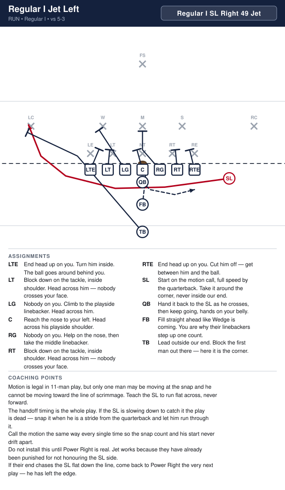

The SL goes in motion across the formation and takes the handoff at full speed going the other way. The defense has spent all day watching Power go to the SL side, and this is the same look leaving in the opposite direction.

| Position | Assignment |
|---|---|
| **LTE** | End head up on you. Turn him inside. The ball goes around behind you. |
| **LT** | Block down on the tackle, inside shoulder. Head across him — nobody crosses your face. |
| **LG** | Nobody on you. Climb to the playside linebacker. Head across him. |
| **C** | Reach the nose to your left. Head across his playside shoulder. |
| **RG** | Nobody on you. Help on the nose, then take the middle linebacker. |
| **RT** | Block down on the tackle, inside shoulder. Head across him — nobody crosses your face. |
| **RTE** | End head up on you. Cut him off — get between him and the ball. |
| **SL** **(ball)** | Start on the motion call, full speed by the quarterback. Take it around the corner, never inside our end. |
| **QB** | Hand it back to the SL as he crosses, then keep going, hands on your belly. |
| **FB** | Fill straight ahead like Wedge is coming. You are why their linebackers step up one count. |
| **TB** | Lead outside our end. Block the first man out there — here it is the corner. |

**Coaching points**

- Motion is legal in 11-man play, but only one man may be moving at the snap and he cannot be moving toward the line of scrimmage. Teach the SL to run flat across, never forward.
- The handoff timing is the whole play. If the SL is slowing down to catch it the play is dead — snap it when he is a stride from the quarterback and let him run through it.
- Call the motion the same way every single time so the snap count and his start never drift apart.
- Do not install this until Power Right is real. Jet works because they have already been punished for not honouring the SL side.
- If their end chases the SL flat down the line, come back to Power Right the very next play — he has left the edge.

# Split Backs

---

## Split Dive Right

**Call it:** `Split SL Right 30 Dive`

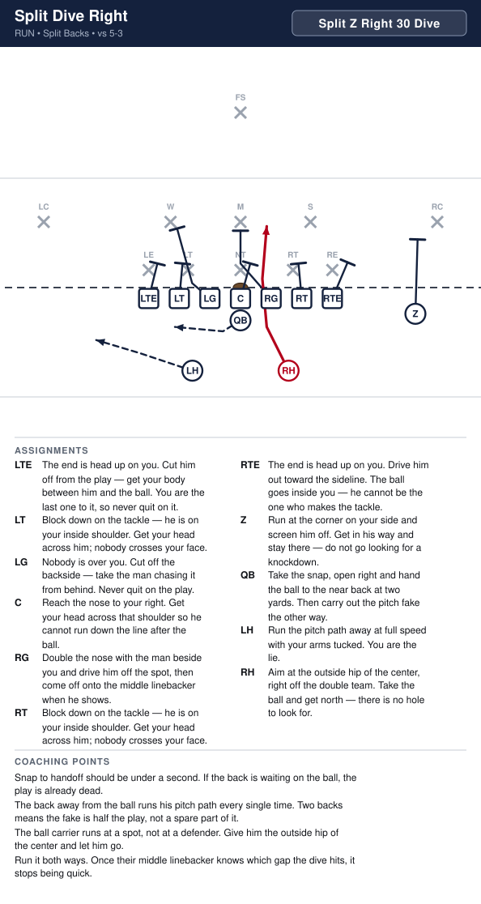

The near back straight ahead, through the first gap outside the center. Against a nose — the 5-3 and the 5-4-2 — the center and the playside guard double him and the ball runs right off it. The 4-4 has no nose, so the guard drives the man over him and the center climbs instead. The aiming point never changes. This one has to work before anything else in the formation does — it holds their linebackers inside and makes the pitch go.

| Position | Assignment |
|---|---|
| **LTE** | End head up on you. Cut him off — get between him and the ball. |
| **LT** | Block down on the tackle, inside shoulder. Head across him — nobody crosses your face. |
| **LG** | Nobody on you. Cut off the backside. Never quit on the play. |
| **C** | Reach the nose to your right. Head across his playside shoulder. |
| **RG** | Nobody on you. Help on the nose, then take the middle linebacker. |
| **RT** | Block down on the tackle, inside shoulder. Head across him — nobody crosses your face. |
| **RTE** | End head up on you. Drive him to the sideline. The ball goes inside you. |
| **SL** | Run at the corner and screen him off. Stay in his way. |
| **QB** | Open right, hand to the near back at two yards, then fake the pitch away. |
| **LH** | Run the pitch path away at full speed with your arms tucked. You are the lie. |
| **RH** **(ball)** | Aim at the center's outside hip every time. Get north — there is no hole to find. |

**Coaching points**

- Snap to handoff should be under a second. If the back is waiting on the ball, the play is already dead.
- The back away from the ball runs his pitch path every single time. Two backs means the fake is half the play, not a spare part of it.
- The ball carrier runs at a spot, not at a defender. Give him the outside hip of the center and let him go.
- Run it both ways. Once their middle linebacker knows which gap the dive hits, it stops being quick.

---

## Split Dive Left

**Call it:** `Split SL Right 21 Dive`

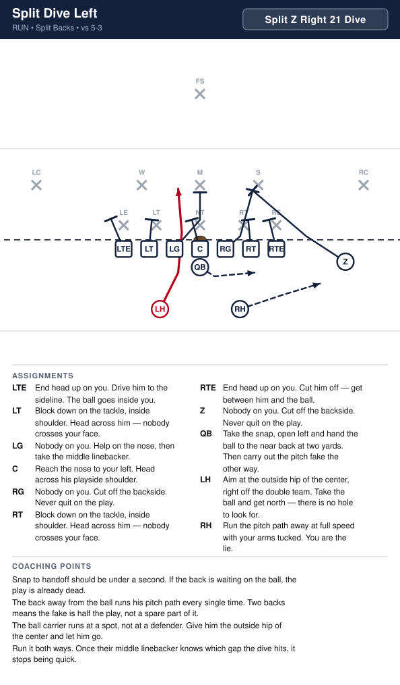

The near back straight ahead, through the first gap outside the center. Against a nose — the 5-3 and the 5-4-2 — the center and the playside guard double him and the ball runs right off it. The 4-4 has no nose, so the guard drives the man over him and the center climbs instead. The aiming point never changes. This one has to work before anything else in the formation does — it holds their linebackers inside and makes the pitch go.

| Position | Assignment |
|---|---|
| **LTE** | End head up on you. Drive him to the sideline. The ball goes inside you. |
| **LT** | Block down on the tackle, inside shoulder. Head across him — nobody crosses your face. |
| **LG** | Nobody on you. Help on the nose, then take the middle linebacker. |
| **C** | Reach the nose to your left. Head across his playside shoulder. |
| **RG** | Nobody on you. Cut off the backside. Never quit on the play. |
| **RT** | Block down on the tackle, inside shoulder. Head across him — nobody crosses your face. |
| **RTE** | End head up on you. Cut him off — get between him and the ball. |
| **SL** | Cut off the backside. Never quit on the play. |
| **QB** | Open left, hand to the near back at two yards, then fake the pitch away. |
| **LH** **(ball)** | Aim at the center's outside hip every time. Get north — there is no hole to find. |
| **RH** | Run the pitch path away at full speed with your arms tucked. You are the lie. |

**Coaching points**

- Snap to handoff should be under a second. If the back is waiting on the ball, the play is already dead.
- The back away from the ball runs his pitch path every single time. Two backs means the fake is half the play, not a spare part of it.
- The ball carrier runs at a spot, not at a defender. Give him the outside hip of the center and let him go.
- Run it both ways. Once their middle linebacker knows which gap the dive hits, it stops being quick.

---

## Split Power Right

**Call it:** `Split SL Right 24 Power`

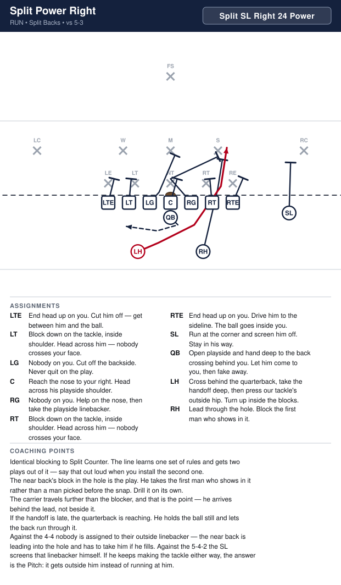

Off-tackle power to the far back, who crosses behind the quarterback and takes a deep handoff. Our end drives their end out, the playside guard takes the man over him or doubles the nose and climbs — whichever the front gives him — and the near back leads up through the hole.

| Position | Assignment |
|---|---|
| **LTE** | End head up on you. Cut him off — get between him and the ball. |
| **LT** | Block down on the tackle, inside shoulder. Head across him — nobody crosses your face. |
| **LG** | Nobody on you. Cut off the backside. Never quit on the play. |
| **C** | Reach the nose to your right. Head across his playside shoulder. |
| **RG** | Nobody on you. Help on the nose, then take the playside linebacker. |
| **RT** | Block down on the tackle, inside shoulder. Head across him — nobody crosses your face. |
| **RTE** | End head up on you. Drive him to the sideline. The ball goes inside you. |
| **SL** | Run at the corner and screen him off. Stay in his way. |
| **QB** | Open playside and hand deep to the back crossing behind you. Let him come to you, then fake away. |
| **LH** **(ball)** | Cross behind the quarterback, take the handoff deep, then press our tackle's outside hip. Turn up inside the blocks. |
| **RH** | Lead through the hole. Block the first man who shows in it. |

**Coaching points**

- Identical blocking to Split Counter. The line learns one set of rules and gets two plays out of it — say that out loud when you install the second one.
- The near back's block in the hole is the play. He takes the first man who shows in it rather than a man picked before the snap. Drill it on its own.
- The carrier travels further than the blocker, and that is the point — he arrives behind the lead, not beside it.
- If the handoff is late, the quarterback is reaching. He holds the ball still and lets the back run through it.
- Against the 4-4 nobody is assigned to their outside linebacker — the near back is leading into the hole and has to take him if he fills. Against the 5-4-2 the SL screens that linebacker himself. If he keeps making the tackle either way, the answer is the Pitch: it gets outside him instead of running at him.

---

## Split Power Left

**Call it:** `Split SL Right 35 Power`

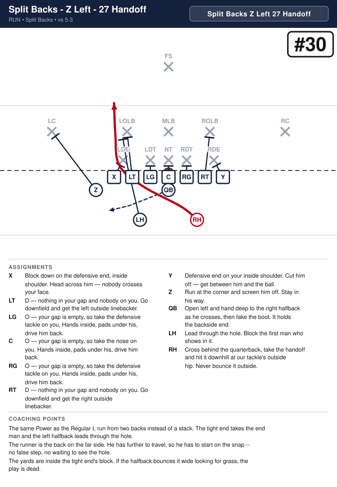

Off-tackle power to the far back, who crosses behind the quarterback and takes a deep handoff. Our end drives their end out, the playside guard takes the man over him or doubles the nose and climbs — whichever the front gives him — and the near back leads up through the hole.

| Position | Assignment |
|---|---|
| **LTE** | End head up on you. Drive him to the sideline. The ball goes inside you. |
| **LT** | Block down on the tackle, inside shoulder. Head across him — nobody crosses your face. |
| **LG** | Nobody on you. Help on the nose, then take the playside linebacker. |
| **C** | Reach the nose to your left. Head across his playside shoulder. |
| **RG** | Nobody on you. Cut off the backside. Never quit on the play. |
| **RT** | Block down on the tackle, inside shoulder. Head across him — nobody crosses your face. |
| **RTE** | End head up on you. Cut him off — get between him and the ball. |
| **SL** | Cut off the backside. Never quit on the play. |
| **QB** | Open playside and hand deep to the back crossing behind you. Let him come to you, then fake away. |
| **LH** | Lead through the hole. Block the first man who shows in it. |
| **RH** **(ball)** | Cross behind the quarterback, take the handoff deep, then press our tackle's outside hip. Turn up inside the blocks. |

**Coaching points**

- Identical blocking to Split Counter. The line learns one set of rules and gets two plays out of it.
- The near back's block in the hole is the play. He takes the first man who shows in it rather than a man picked before the snap. Drill it on its own.
- The carrier travels further than the blocker, and that is the point — he arrives behind the lead, not beside it.
- If the handoff is late, the quarterback is reaching. He holds the ball still and lets the back run through it.
- Against a four-linebacker front nobody is assigned to their outside linebacker, and on this side there is no SL out there to screen him — the near back is leading into the hole and has to take him if he fills. If they keep winning there, the answer is the Pitch: it gets outside him instead of running at him.

---

## Split Counter Right

**Call it:** `Split SL Right 24 Counter`

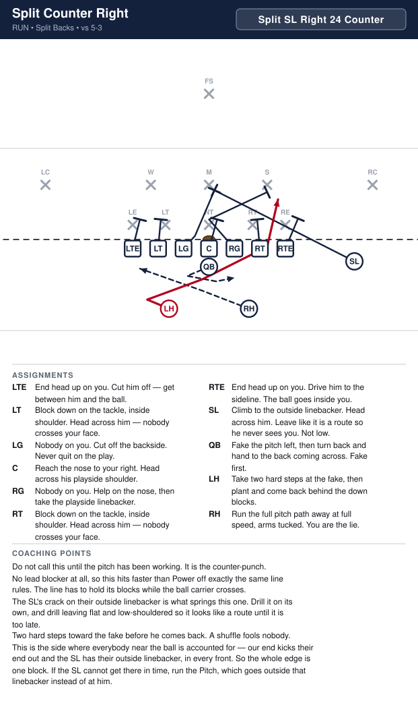

Misdirection off the pitch. The near back and the quarterback sell the pitch one way and the far back plants and comes all the way back. Nobody leads, so it hits faster than Power off the same blocks.

| Position | Assignment |
|---|---|
| **LTE** | End head up on you. Cut him off — get between him and the ball. |
| **LT** | Block down on the tackle, inside shoulder. Head across him — nobody crosses your face. |
| **LG** | Nobody on you. Cut off the backside. Never quit on the play. |
| **C** | Reach the nose to your right. Head across his playside shoulder. |
| **RG** | Nobody on you. Help on the nose, then take the playside linebacker. |
| **RT** | Block down on the tackle, inside shoulder. Head across him — nobody crosses your face. |
| **RTE** | End head up on you. Drive him to the sideline. The ball goes inside you. |
| **SL** | Climb to the outside linebacker. Head across him. Leave like it is a route so he never sees you. Not low. |
| **QB** | Fake the pitch left, then turn back and hand to the back coming across. Fake first. |
| **LH** **(ball)** | Take two hard steps at the fake, then plant and come back behind the down blocks. |
| **RH** | Run the full pitch path away at full speed, arms tucked. You are the lie. |

**Coaching points**

- Do not call this until the pitch has been working. It is the counter-punch.
- No lead blocker at all, so this hits faster than Power off exactly the same line rules. The line has to hold its blocks while the ball carrier crosses.
- The SL's crack on their outside linebacker is what springs this one. Drill it on its own, and drill leaving flat and low-shouldered so it looks like a route until it is too late.
- Two hard steps toward the fake before he comes back. A shuffle fools nobody.
- This is the side where everybody near the ball is accounted for — our end kicks their end out and the SL has their outside linebacker, in every front. So the whole edge is one block. If the SL cannot get there in time, run the Pitch, which goes outside that linebacker instead of at him.

---

## Split Counter Left

**Call it:** `Split SL Right 35 Counter`

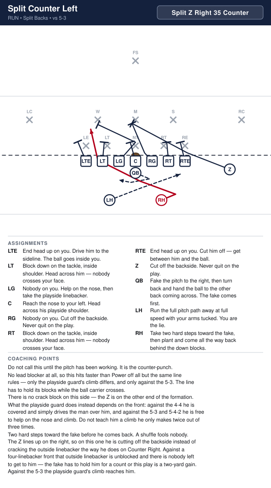

Misdirection off the pitch. The near back and the quarterback sell the pitch one way and the far back plants and comes all the way back. Nobody leads, so it hits faster than Power off the same blocks.

| Position | Assignment |
|---|---|
| **LTE** | End head up on you. Drive him to the sideline. The ball goes inside you. |
| **LT** | Block down on the tackle, inside shoulder. Head across him — nobody crosses your face. |
| **LG** | Nobody on you. Help on the nose, then take the playside linebacker. |
| **C** | Reach the nose to your left. Head across his playside shoulder. |
| **RG** | Nobody on you. Cut off the backside. Never quit on the play. |
| **RT** | Block down on the tackle, inside shoulder. Head across him — nobody crosses your face. |
| **RTE** | End head up on you. Cut him off — get between him and the ball. |
| **SL** | Cut off the backside. Never quit on the play. |
| **QB** | Fake the pitch right, then turn back and hand to the back coming across. Fake first. |
| **LH** | Run the full pitch path away at full speed, arms tucked. You are the lie. |
| **RH** **(ball)** | Take two hard steps at the fake, then plant and come back behind the down blocks. |

**Coaching points**

- Do not call this until the pitch has been working. It is the counter-punch.
- No lead blocker at all, so this hits faster than Power off all but the same line rules — only the playside guard's climb differs, and only against the 5-3. The line has to hold its blocks while the ball carrier crosses.
- There is no crack block on this side — the SL is on the other end of the formation. What the playside guard does instead depends on the front: against the 4-4 he is covered and simply drives the man over him, and against the 5-3 and 5-4-2 he is free to help on the nose and climb. Do not teach him a climb he only makes twice out of three times.
- Two hard steps toward the fake before he comes back. A shuffle fools nobody.
- The SL lines up on the right, so on this one he is cutting off the backside instead of cracking the outside linebacker the way he does on Counter Right. Against a four-linebacker front that outside linebacker is unblocked and there is nobody left to get to him — the fake has to hold him for a count or this play is a two-yard gain. Against the 5-3 the playside guard's climb reaches him.

---

## Split Waggle Right

**Call it:** `Split SL Right 16 Waggle`

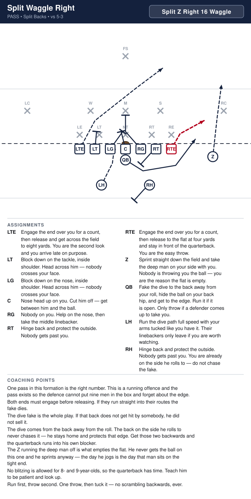

The only pass in this formation, off the play they have seen most. The quarterback's first steps are Dive Left's, the back away from the roll sells that dive, and he keeps going the way the dive's own fake takes him — out onto the right edge, with our end in the flat in front of him and the split man running the deep man off. The back on the roll side never chases it; he stays home and protects. Run first, throw second.

| Position | Assignment |
|---|---|
| **LTE** | Bump the end, then cross the field to eight yards. Second look, late on purpose. |
| **LT** | Block down on the tackle, inside shoulder. Head across him — nobody crosses your face. |
| **LG** | Block down on the nose, inside shoulder. Head across him — nobody crosses your face. |
| **C** | Nose head up on you. Cut him off — get between him and the ball. |
| **RG** | Nobody on you. Help on the nose, then take the middle linebacker. |
| **RT** | Hinge back and protect the outside. Nobody gets past you. |
| **RTE** **(ball)** | Bump the end, then release to the flat at four yards in front of the quarterback. |
| **SL** | Sprint straight downfield and take the deep man with you. Nobody throws you the ball — you empty the flat. |
| **QB** | Fake the dive away from your roll, ball on your hip, run the edge. Throw only when they take you. |
| **LH** | Run the dive path full speed, arms tucked. Linebackers only leave if you are worth watching. |
| **RH** | Hinge back and protect the outside. Nobody gets past you. You are already on the side he rolls to — do not chase the fake. |

**Coaching points**

- One pass in this formation is the right number. This is a running offence and the pass exists so the defence cannot put nine men in the box and forget about the edge.
- Both ends must engage before releasing. If they run straight into their routes the fake dies.
- The dive fake is the whole play. If that back does not get hit by somebody, he did not sell it.
- The dive comes from the back away from the roll. The back on the side he rolls to never chases it — he stays home and protects that edge. Get those two backwards and the quarterback runs into his own blocker.
- The SL running the deep man off is what empties the flat. He never gets the ball on this one and he sprints anyway — the day he jogs is the day that man sits on the tight end.
- No blitzing is allowed for 8- and 9-year-olds, so the quarterback has time. Teach him to be patient and look up.
- Run first, throw second. One throw, then tuck it — no scrambling backwards, ever.

---

## Split Waggle Left

**Call it:** `Split SL Right 17 Waggle`

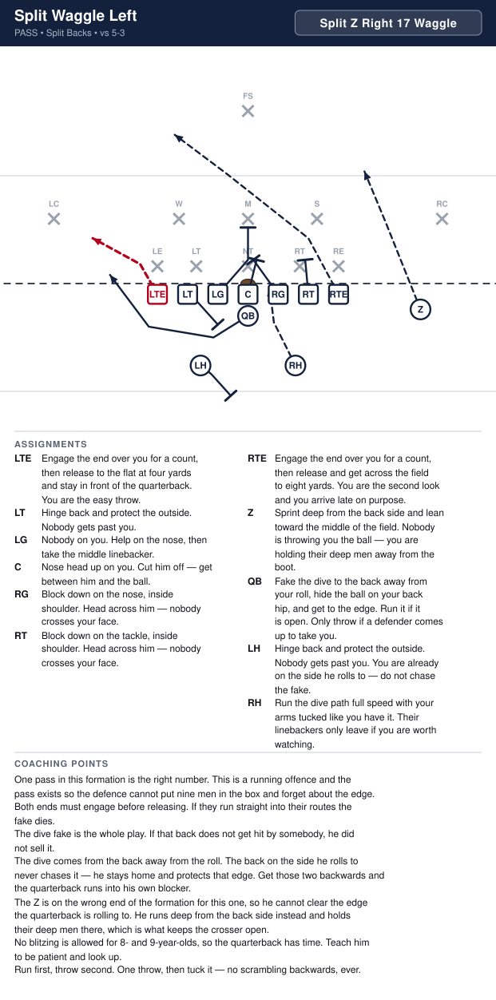

Waggle Right to the other edge, and the harder of the two. The quarterback's first steps are Dive Right's, the back away from the roll sells that dive, and he keeps going the way the dive's own fake takes him — out onto the left edge with our end in the flat in front of him. The split man is on the wrong end of the formation here, so instead of clearing that edge he runs deep from the back side. Run first, throw second.

| Position | Assignment |
|---|---|
| **LTE** **(ball)** | Bump the end, then release to the flat at four yards in front of the quarterback. |
| **LT** | Hinge back and protect the outside. Nobody gets past you. |
| **LG** | Nobody on you. Help on the nose, then take the middle linebacker. |
| **C** | Nose head up on you. Cut him off — get between him and the ball. |
| **RG** | Block down on the nose, inside shoulder. Head across him — nobody crosses your face. |
| **RT** | Block down on the tackle, inside shoulder. Head across him — nobody crosses your face. |
| **RTE** | Bump the end, then cross the field to eight yards. Second look, late on purpose. |
| **SL** | Sprint deep from the back side toward the middle. Nobody throws you the ball — you hold their deep men. |
| **QB** | Fake the dive away from your roll, ball on your hip, run the edge. Throw only when they take you. |
| **LH** | Hinge back and protect the outside. Nobody gets past you. You are already on the side he rolls to — do not chase the fake. |
| **RH** | Run the dive path full speed, arms tucked. Linebackers only leave if you are worth watching. |

**Coaching points**

- One pass in this formation is the right number. This is a running offence and the pass exists so the defence cannot put nine men in the box and forget about the edge.
- Both ends must engage before releasing. If they run straight into their routes the fake dies.
- The dive fake is the whole play. If that back does not get hit by somebody, he did not sell it.
- The dive comes from the back away from the roll. The back on the side he rolls to never chases it — he stays home and protects that edge. Get those two backwards and the quarterback runs into his own blocker.
- The SL is on the wrong end of the formation for this one, so he cannot clear the edge the quarterback is rolling to. He runs deep from the back side instead and holds their deep men there, which is what keeps the crosser open.
- No blitzing is allowed for 8- and 9-year-olds, so the quarterback has time. Teach him to be patient and look up.
- Run first, throw second. One throw, then tuck it — no scrambling backwards, ever.

---

## Split formation - Strong right - Quick pitch right

**Call it:** `Split SL Right 28 Pitch`

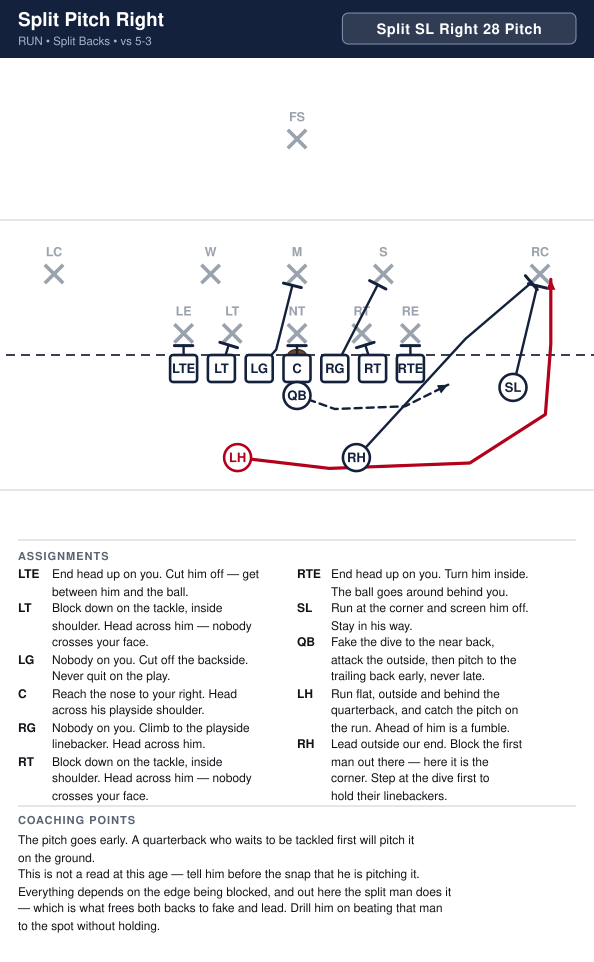

Get outside in a hurry. The far back trails the quarterback, takes the pitch on the run and turns up inside the block out on the edge. The split man makes that block — their corner, or their outside linebacker against the 5-4-2, which has no corners — and that is what frees both backs to stay in the backfield where the fake lives.

| Position | Assignment |
|---|---|
| **LTE** | End head up on you. Cut him off — get between him and the ball. |
| **LT** | Block down on the tackle, inside shoulder. Head across him — nobody crosses your face. |
| **LG** | Nobody on you. Cut off the backside. Never quit on the play. |
| **C** | Reach the nose to your right. Head across his playside shoulder. |
| **RG** | Nobody on you. Climb to the playside linebacker. Head across him. |
| **RT** | Block down on the tackle, inside shoulder. Head across him — nobody crosses your face. |
| **RTE** | End head up on you. Turn him inside. The ball goes around behind you. |
| **SL** | Run at the corner and screen him off. Stay in his way. |
| **QB** | Fake the dive to the near back, attack the outside, then pitch to the trailing back early, never late. |
| **LH** **(ball)** | Run flat, outside and behind the quarterback, and catch the pitch on the run. Ahead of him is a fumble. |
| **RH** | Lead outside our end. Block the first man out there — here it is the corner. Step at the dive first to hold their linebackers. |

**Coaching points**

- The pitch goes early. A quarterback who waits to be tackled first will pitch it on the ground.
- This is not a read at this age — tell him before the snap that he is pitching it.
- Everything depends on the edge being blocked, and out here the split man does it — which is what frees both backs to fake and lead. Drill him on beating that man to the spot without holding.

---

## Split formation - Strong right - Quick pitch left

**Call it:** `Split SL Right 39 Pitch`

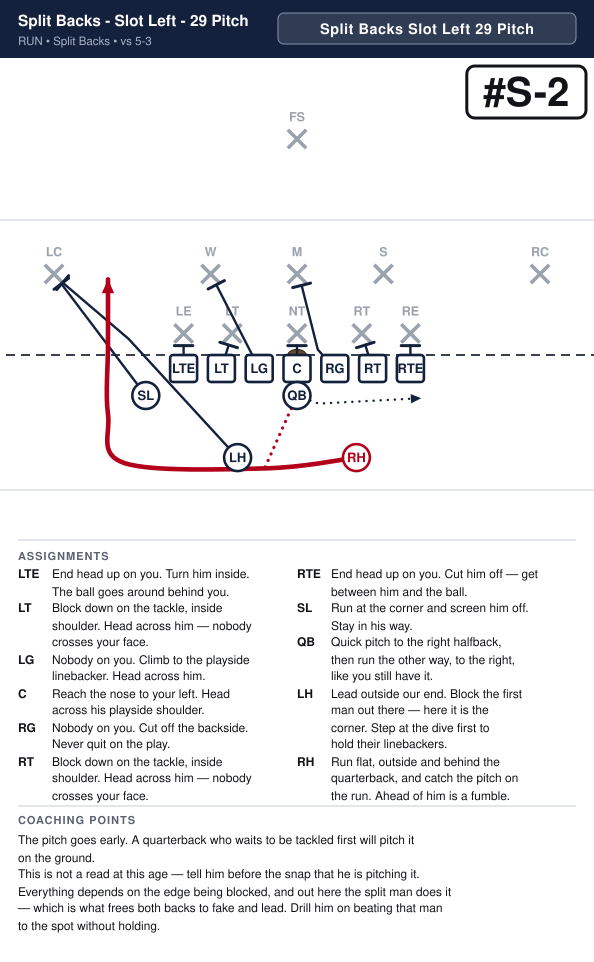

Get outside in a hurry. The far back trails the quarterback, takes the pitch on the run and turns up inside the block out in front of him. Away from the split man there is nobody out there to make that block, so the near back leaves early and takes the first man outside our end himself — which is why this side has no dive fake. That man is their corner only against the 5-3. Against a four-linebacker front he is the outside linebacker, and against the 4-4 that leaves their corner standing right where the ball turns up with nobody on him.

| Position | Assignment |
|---|---|
| **LTE** | End head up on you. Turn him inside. The ball goes around behind you. |
| **LT** | Block down on the tackle, inside shoulder. Head across him — nobody crosses your face. |
| **LG** | Nobody on you. Climb to the playside linebacker. Head across him. |
| **C** | Reach the nose to your left. Head across his playside shoulder. |
| **RG** | Nobody on you. Cut off the backside. Never quit on the play. |
| **RT** | Block down on the tackle, inside shoulder. Head across him — nobody crosses your face. |
| **RTE** | End head up on you. Cut him off — get between him and the ball. |
| **SL** | Cut off the backside. Never quit on the play. |
| **QB** | Open left, attack the edge, and pitch to the trailing back before you get touched. No dive fake here. |
| **LH** | Lead outside our end. Block the first man out there — here it is the corner. |
| **RH** **(ball)** | Run flat, outside and behind the quarterback, and catch the pitch on the run. Ahead of him is a fumble. |

**Coaching points**

- The pitch goes early. A quarterback who waits to be tackled first will pitch it on the ground.
- This is not a read at this age — tell him before the snap that he is pitching it.
- Everything depends on the edge being blocked and there is no receiver on this side to help, so the near back leaves early and there is no fake to hold anybody. Against the 4-4 their corner is unblocked at the spot the ball turns up — if he is quick, call it to the other side instead.

---

## Split QB Keep Right

**Call it:** `Split SL Right 16 Keep`

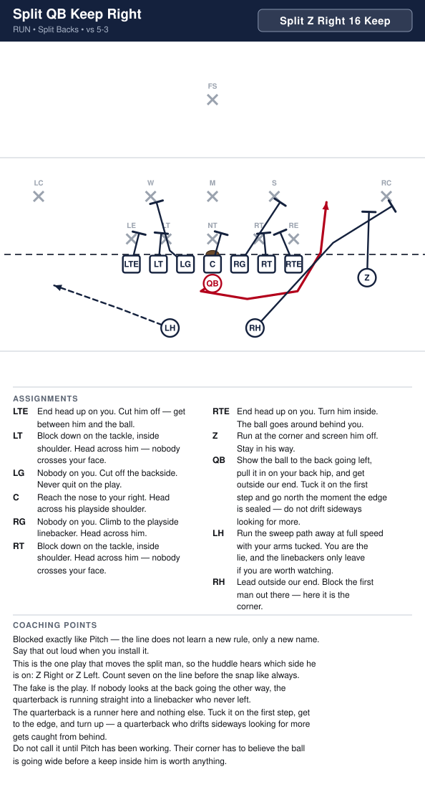

The quarterback keeps it himself, and he runs to the side the split man is lined up on — so the SL moves right for this one and the call says so. Fake to the back going left, seal the end inside, and get outside behind two blockers: the near back on the first man outside our end and the split man on their corner, or on their outside linebacker against the 5-4-2, which has no corners. Blocked exactly like Pitch.

| Position | Assignment |
|---|---|
| **LTE** | End head up on you. Cut him off — get between him and the ball. |
| **LT** | Block down on the tackle, inside shoulder. Head across him — nobody crosses your face. |
| **LG** | Nobody on you. Cut off the backside. Never quit on the play. |
| **C** | Reach the nose to your right. Head across his playside shoulder. |
| **RG** | Nobody on you. Climb to the playside linebacker. Head across him. |
| **RT** | Block down on the tackle, inside shoulder. Head across him — nobody crosses your face. |
| **RTE** | End head up on you. Turn him inside. The ball goes around behind you. |
| **SL** | Run at the corner and screen him off. Stay in his way. |
| **QB** **(ball)** | Fake to the back going left, hide the ball, get outside our end. Turn up the moment the edge seals. |
| **LH** | Run the sweep path away full speed, arms tucked. Linebackers only leave if you are worth watching. |
| **RH** | Lead outside our end. Block the first man out there — here it is the corner. |

**Coaching points**

- Blocked exactly like Pitch — the line does not learn a new rule, only a new name. Say that out loud when you install it.
- This is the one play that moves the split man, so the huddle hears which side he is on: SL Right or SL Left. Count seven on the line before the snap like always.
- The fake is the play. If nobody looks at the back going the other way, the quarterback is running straight into a linebacker who never left.
- Do not call it until Pitch has been working. Their corner has to believe the ball is going wide before a keep inside him is worth anything.

---

## Split QB Keep Left

**Call it:** `Split SL Left 17 Keep`

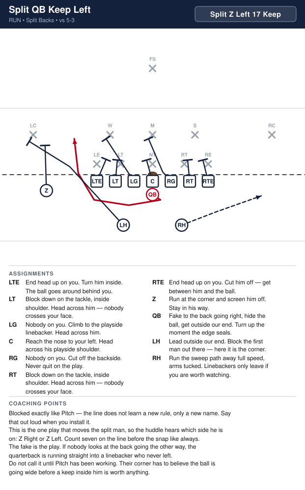

The quarterback keeps it himself, and he runs to the side the split man is lined up on — so the SL moves left for this one and the call says so. Fake to the back going right, seal the end inside, and get outside behind two blockers: the near back on the first man outside our end and the split man on their corner, or on their outside linebacker against the 5-4-2, which has no corners. Blocked exactly like Pitch.

| Position | Assignment |
|---|---|
| **LTE** | End head up on you. Turn him inside. The ball goes around behind you. |
| **LT** | Block down on the tackle, inside shoulder. Head across him — nobody crosses your face. |
| **LG** | Nobody on you. Climb to the playside linebacker. Head across him. |
| **C** | Reach the nose to your left. Head across his playside shoulder. |
| **RG** | Nobody on you. Cut off the backside. Never quit on the play. |
| **RT** | Block down on the tackle, inside shoulder. Head across him — nobody crosses your face. |
| **RTE** | End head up on you. Cut him off — get between him and the ball. |
| **SL** | Run at the corner and screen him off. Stay in his way. |
| **QB** **(ball)** | Fake to the back going right, hide the ball, get outside our end. Turn up the moment the edge seals. |
| **LH** | Lead outside our end. Block the first man out there — here it is the corner. |
| **RH** | Run the sweep path away full speed, arms tucked. Linebackers only leave if you are worth watching. |

**Coaching points**

- Blocked exactly like Pitch — the line does not learn a new rule, only a new name. Say that out loud when you install it.
- This is the one play that moves the split man, so the huddle hears which side he is on: SL Right or SL Left. Count seven on the line before the snap like always.
- The fake is the play. If nobody looks at the back going the other way, the quarterback is running straight into a linebacker who never left.
- Do not call it until Pitch has been working. Their corner has to believe the ball is going wide before a keep inside him is worth anything.

---

## Split SL Left SL Reverse Right

**Call it:** `Split SL Left 46 SL Reverse Right`

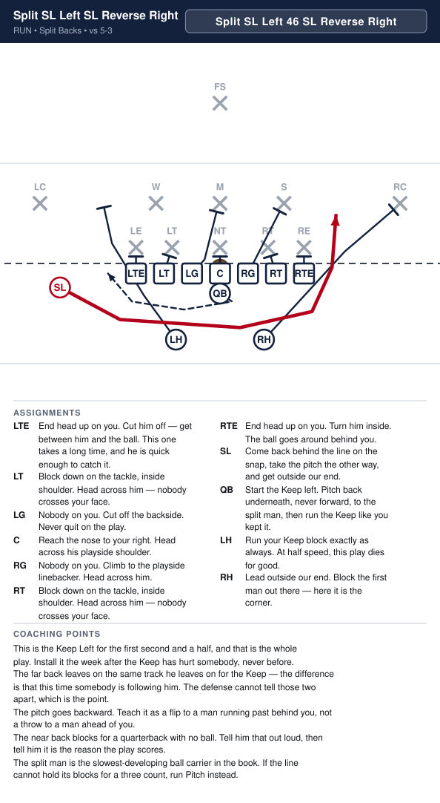

The Keep Left, until it is not. The quarterback and the near back start the Keep left and never stop selling it; the split man comes back underneath, takes a lateral going the other way and runs right behind the far back. Only the backfield sells it. The line blocks right from the snap, the split man is running backwards behind the line instead of screening anybody, and with him carrying the ball there is one blocker fewer on that edge than Keep Right has going to the same place. It buys a count, not a disguise.

| Position | Assignment |
|---|---|
| **LTE** | End head up on you. Cut him off — get between him and the ball. This one takes a long time, and he is quick enough to catch it. |
| **LT** | Block down on the tackle, inside shoulder. Head across him — nobody crosses your face. |
| **LG** | Nobody on you. Cut off the backside. Never quit on the play. |
| **C** | Reach the nose to your right. Head across his playside shoulder. |
| **RG** | Nobody on you. Climb to the playside linebacker. Head across him. |
| **RT** | Block down on the tackle, inside shoulder. Head across him — nobody crosses your face. |
| **RTE** | End head up on you. Turn him inside. The ball goes around behind you. |
| **SL** **(ball)** | Come back behind the line on the snap, take the pitch the other way, and get outside our end. |
| **QB** | Start the Keep left. Pitch back underneath, never forward, to the split man, then run the Keep like you kept it. |
| **LH** | Run your Keep block exactly as always. At half speed, this play dies for good. |
| **RH** | Lead outside our end. Block the first man out there — here it is the corner. |

**Coaching points**

- This is the Keep Left for the first second and a half, and that is the whole play. Install it the week after the Keep has hurt somebody, never before.
- The far back leaves on the same track he leaves on for the Keep — the difference is that this time somebody is following him. The defense cannot tell those two apart, which is the point.
- The pitch goes backward. Teach it as a flip to a man running past behind you, not a throw to a man ahead of you.
- The near back blocks for a quarterback with no ball. Tell him that out loud, then tell him it is the reason the play scores.
- The split man is the slowest-developing ball carrier in the book. If the line cannot hold its blocks for a three count, run Pitch instead.

---

## Split SL Right SL Reverse Left

**Call it:** `Split SL Right 47 SL Reverse Left`

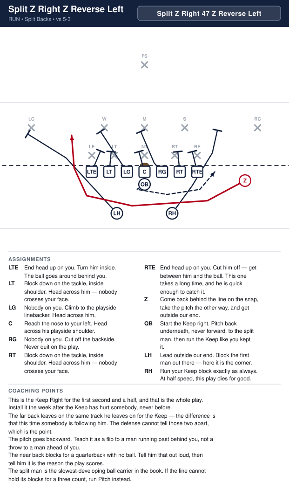

The Keep Right, until it is not. The quarterback and the near back start the Keep right and never stop selling it; the split man comes back underneath, takes a lateral going the other way and runs left behind the far back. Only the backfield sells it. The line blocks left from the snap, the split man is running backwards behind the line instead of screening anybody, and with him carrying the ball there is one blocker fewer on that edge than Keep Left has going to the same place. It buys a count, not a disguise.

| Position | Assignment |
|---|---|
| **LTE** | End head up on you. Turn him inside. The ball goes around behind you. |
| **LT** | Block down on the tackle, inside shoulder. Head across him — nobody crosses your face. |
| **LG** | Nobody on you. Climb to the playside linebacker. Head across him. |
| **C** | Reach the nose to your left. Head across his playside shoulder. |
| **RG** | Nobody on you. Cut off the backside. Never quit on the play. |
| **RT** | Block down on the tackle, inside shoulder. Head across him — nobody crosses your face. |
| **RTE** | End head up on you. Cut him off — get between him and the ball. This one takes a long time, and he is quick enough to catch it. |
| **SL** **(ball)** | Come back behind the line on the snap, take the pitch the other way, and get outside our end. |
| **QB** | Start the Keep right. Pitch back underneath, never forward, to the split man, then run the Keep like you kept it. |
| **LH** | Lead outside our end. Block the first man out there — here it is the corner. |
| **RH** | Run your Keep block exactly as always. At half speed, this play dies for good. |

**Coaching points**

- This is the Keep Right for the first second and a half, and that is the whole play. Install it the week after the Keep has hurt somebody, never before.
- The far back leaves on the same track he leaves on for the Keep — the difference is that this time somebody is following him. The defense cannot tell those two apart, which is the point.
- The pitch goes backward. Teach it as a flip to a man running past behind you, not a throw to a man ahead of you.
- The near back blocks for a quarterback with no ball. Tell him that out loud, then tell him it is the reason the play scores.
- The split man is the slowest-developing ball carrier in the book. If the line cannot hold its blocks for a three count, run Pitch instead.

