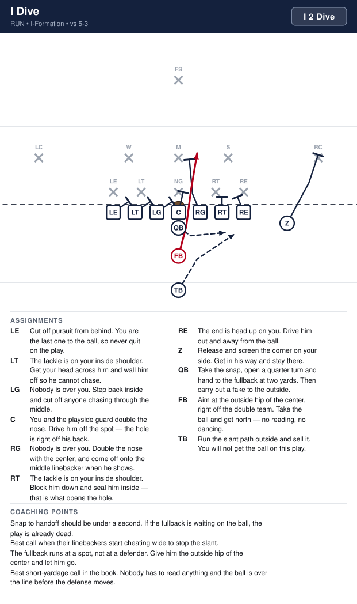
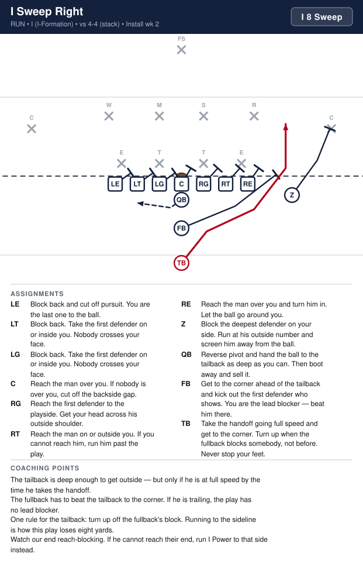

# Sayville 8U Playbook

_Generated by `generator/render.py`. Edit the JSON under `playbook/`, not this file._

Terminology and authoring rules: [playbook/CLAUDE.md](playbook/CLAUDE.md)

| # | Play | Call | Type | Formation | Ball | Install |
|---|---|---|---|---|---|---|
| 1 | [I Dive](#i-dive) | `I 2 Dive` | run | I | FB | Week 1 |
| 2 | [I Iso Left](#i-iso-left) | `I 3 Iso` | run | I | TB | Week 1 |
| 3 | [I Iso Right](#i-iso-right) | `I 4 Iso` | run | I | TB | Week 1 |
| 4 | [I Power Left](#i-power-left) | `I 5 Power` | run | I | TB | Week 2 |
| 5 | [I Power Right](#i-power-right) | `I 6 Power` | run | I | TB | Week 2 |
| 6 | [I Sweep Right](#i-sweep-right) | `I 8 Sweep` | run | I | TB | Week 2 |
| 7 | [I Boot Right](#i-boot-right) | `I 8 Boot` | pass | I | Z | Week 3 |
| 8 | [I Counter Left](#i-counter-left) | `I 5 Counter` | run | I | TB | Week 3 |
| 9 | [Bone Dive](#bone-dive) | `Bone 2 Dive` | run | Wishbone | FB | Week 1 |
| 10 | [Bone Power Left](#bone-power-left) | `Bone 5 Power` | run | Wishbone | LH | Week 1 |
| 11 | [Bone Power Right](#bone-power-right) | `Bone 6 Power` | run | Wishbone | RH | Week 1 |
| 12 | [Bone Pitch Left](#bone-pitch-left) | `Bone 7 Pitch` | run | Wishbone | LH | Week 2 |
| 13 | [Bone Pitch Right](#bone-pitch-right) | `Bone 8 Pitch` | run | Wishbone | RH | Week 2 |
| 14 | [Bone Counter Left](#bone-counter-left) | `Bone 5 Counter` | run | Wishbone | RH | Week 3 |
| 15 | [Bone Counter Right](#bone-counter-right) | `Bone 6 Counter` | run | Wishbone | LH | Week 3 |

# I (I-Formation)

---

## I Dive

**Call it:** `I 2 Dive`

The quickest handoff in the book. The fullback is through the line before their linebackers have read anything. We run it to remind them the middle is not free, which is what makes the sweep work later.

| Position | Assignment |
|---|---|
| **LE** | Block back and cut off pursuit. You are the last one to the ball. |
| **LT** | Block back. Take the first defender on or inside you. Nobody crosses your face. |
| **LG** | Block back. Take the first defender on or inside you. Nobody crosses your face. |
| **C** | Block the man over you. If nobody is over you, help the playside guard and climb to the middle linebacker. |
| **RG** | Block the man over you and turn him out. The hole is off your inside hip. |
| **RT** | Block the man over you. Do not let him slide inside. |
| **RE** | Block the first defender on or inside you. |
| **Z** | Release and screen the deepest defender on your side. Get in his way and stay there. |
| **QB** | Take the snap, open a quarter turn and hand to the fullback at two yards. Then carry out a fake to the outside. |
| **FB** **(ball)** | Aim at the outside hip of the center. Take the ball and get north. This is a straight-ahead run — no reading, no dancing. |
| **TB** | Run the sweep path outside and sell it. You will not get the ball on this play. |

**Coaching points**

- Snap to handoff should be under a second. If the fullback is waiting on the ball, the play is already dead.
- Best call when their linebackers start cheating wide to stop the sweep.
- The fullback runs at a spot, not at a defender. Give him the outside hip of the center and let him go.
- Good short-yardage call out of this formation, but the Wedge from Tight is still the better one.

---

## I Iso Left

**Call it:** `I 3 Iso`

The same isolation block the other way. The flanker stays where he is, so this runs away from our strength — which is exactly why it is open.

| Position | Assignment |
|---|---|
| **LE** | Block the man over you and turn him out. |
| **LT** | Block the man over you and drive him to the outside. You are the outside wall of the hole. |
| **LG** | Block the man over you and drive him to the inside. You are the inside wall of the hole. |
| **C** | Block the first defender to the backside. |
| **RG** | Block back. Take the first defender on or inside you. Nobody crosses your face. |
| **RT** | Block back. Take the first defender on or inside you. Nobody crosses your face. |
| **RE** | Block back and cut off pursuit. You are the last one to the ball. |
| **Z** | Come across behind the line and cut off anybody chasing from the backside. |
| **QB** | Reverse pivot and hand the ball to the tailback at four yards. Then clear out and fake wide. |
| **FB** | Lead through the hole between the guard and the tackle. Put your facemask on the linebacker and move him any direction — just move him. |
| **TB** **(ball)** | Take the handoff at four yards, get downhill behind the fullback, and cut off his block. |

**Coaching points**

- Running away from the flanker means one fewer blocker out there, so the tailback has to get north fast.
- Their defense will usually shade toward our flanker. That is the reason this play exists — check it before you call it.
- Same block, same read as I Iso Right. Do not teach it as a new play, teach it as the same play flipped.

---

## I Iso Right

**Call it:** `I 4 Iso`

The whole play is one block: the fullback isolates their linebacker in the hole and the tailback runs off whichever way that block goes. It teaches a back to read a block, which is the skill this formation is here to build.

| Position | Assignment |
|---|---|
| **LE** | Block back and cut off pursuit. You are the last one to the ball. |
| **LT** | Block back. Take the first defender on or inside you. Nobody crosses your face. |
| **LG** | Block back. Take the first defender on or inside you. Nobody crosses your face. |
| **C** | Block the first defender to the backside. |
| **RG** | Block the man over you and drive him to the inside. You are the inside wall of the hole. |
| **RT** | Block the man over you and drive him to the outside. You are the outside wall of the hole. |
| **RE** | Block the man over you and turn him out. |
| **Z** | Release and screen the deepest defender on your side. Get in his way and stay there. |
| **QB** | Reverse pivot and hand the ball to the tailback at four yards. Then clear out and fake wide. |
| **FB** | Lead through the hole between the guard and the tackle. Put your facemask on the linebacker and move him any direction — just move him. |
| **TB** **(ball)** | Take the handoff at four yards, get downhill behind the fullback, and cut off his block. If he takes the linebacker outside, you go inside. |

**Coaching points**

- Drill the fullback's block by itself with a bag. He does not have to win — he has to make the linebacker pick a side.
- Teach the tailback one rule: cut off the fullback's back. Do not let him decide before he gets there.
- If their linebacker is faster than our fullback, stop calling this and run I Power instead.
- The tailback should be running downhill at the hole, not sideways looking for one.

---

## I Power Left

**Call it:** `I 5 Power`

Power to the weak side. The flanker is not out there to help, so the kick-out and the wrap have to be clean — but their defense is usually leaning the other way.

| Position | Assignment |
|---|---|
| **LE** | Block down on the first defender inside you. The man outside you belongs to the fullback. |
| **LT** | Block down on the first defender inside you. |
| **LG** | Block down on the first defender inside you. |
| **C** | Block back on the backside gap. |
| **RG** | PULL LEFT. Run flat behind the line and turn up outside our end. Block the first wrong-colored jersey you see. |
| **RT** | Block back. Take the first defender on or inside you. Nobody crosses your face. |
| **RE** | Block back and cut off pursuit. You are the last one to the ball. |
| **Z** | Come across behind the line and cut off anybody chasing from the backside. |
| **QB** | Reverse pivot, hand the ball to the tailback deep, then carry out the bootleg fake away from the play. |
| **FB** | Kick out the first defender outside our end. Aim at his inside hip and run through him. |
| **TB** **(ball)** | Take the handoff, press the outside hip of our end, then turn up inside the pulling guard. |

**Coaching points**

- Check their alignment first. If they have shaded toward our flanker, this is the call.
- The flanker chases from behind. Tell him he is not decoration — he cuts off the corner who would otherwise run this down.
- Everything else is I Power Right in a mirror. Teach the pair together.

---

## I Power Right

**Call it:** `I 6 Power`

The power run out of the I. Playside blocks down, the fullback kicks out the end man, the backside guard pulls and wraps. Same picture as Tight with different personnel, which is the whole reason we carry both formations.

| Position | Assignment |
|---|---|
| **LE** | Block back and cut off pursuit. You are the last one to the ball. |
| **LT** | Block back. Take the first defender on or inside you. Nobody crosses your face. |
| **LG** | PULL RIGHT. Run flat behind the line and turn up outside our end. Block the first wrong-colored jersey you see. |
| **C** | Block back on the backside gap. |
| **RG** | Block down on the first defender inside you. |
| **RT** | Block down on the first defender inside you. |
| **RE** | Block down on the first defender inside you. The man outside you belongs to the fullback. |
| **Z** | Release and screen the deepest defender on your side. Get in his way and stay there. |
| **QB** | Reverse pivot, hand the ball to the tailback deep, then carry out the bootleg fake away from the play. |
| **FB** | Kick out the first defender outside our end. Aim at his inside hip and run through him. |
| **TB** **(ball)** | Take the handoff, press the outside hip of our end, then turn up inside the pulling guard. Be patient for one step, then go. |

**Coaching points**

- Same down-block-and-kick-out rules as Power from Tight. If the kids know one they know both — say that out loud when you install it.
- The tailback has further to travel than the wing does in Tight, so the kick-out block has to hold a beat longer. Drill it on a count.
- The pulling guard stays flat and tight to the line. Bellying back is what makes this play late.
- If the pulling guard cannot get there in time, run I Iso instead — it needs no pullers.

---

## I Sweep Right

**Call it:** `I 8 Sweep`

Get outside. The fullback and the flanker are both out in front and the tailback has room to run. This is the play that makes them widen out, which is what opens the dive and the iso.

| Position | Assignment |
|---|---|
| **LE** | Block back and cut off pursuit. You are the last one to the ball. |
| **LT** | Block back. Take the first defender on or inside you. Nobody crosses your face. |
| **LG** | Block back. Take the first defender on or inside you. Nobody crosses your face. |
| **C** | Reach the man over you. If nobody is over you, cut off the backside gap. |
| **RG** | Reach the first defender to the playside. Get your head across his outside shoulder. |
| **RT** | Reach the man on or outside you. If you cannot reach him, run him past the play. |
| **RE** | Reach the man over you and turn him in. Let the ball go around you. |
| **Z** | Block the deepest defender on your side. Run at his outside number and screen him away from the ball. |
| **QB** | Reverse pivot and hand the ball to the tailback as deep as you can. Then boot away and sell it. |
| **FB** | Get to the corner ahead of the tailback and kick out the first defender who shows. You are the lead blocker — beat him there. |
| **TB** **(ball)** | Take the handoff going full speed and get to the corner. Turn up when the fullback blocks somebody, not before. Never stop your feet. |

**Coaching points**

- The tailback is deeper here than the wing is in Tight, so he has time to get outside — but only if he is at full speed by the handoff.
- The fullback has to beat the tailback to the corner. If he is trailing, the play has no lead blocker.
- One rule for the tailback: turn up off the fullback's block. Running to the sideline is how this play loses eight yards.
- Watch our end reach-blocking. If he cannot reach their end, run I Power to that side instead.

---

## I Boot Right

**Call it:** `I 8 Boot`

Play action off the sweep look. Two receivers to the flanker side and a quarterback with the whole edge to himself. Run first, throw second.

| Position | Assignment |
|---|---|
| **LE** | Block down and sell the run. This has to look exactly like the sweep going the other way. |
| **LT** | Block down on the first defender inside you. |
| **LG** | Block the man over you and drive him away from the boot. |
| **C** | Block back toward the boot side. Nobody chases through the middle. |
| **RG** | PULL LEFT and run the sweep path to sell the fake. You are a decoy — take their linebacker with you. |
| **RT** | Hinge and protect the boot side. Nobody comes free outside you — the quarterback is alone back there. |
| **RE** | Engage their end for a count, then release and settle at eight yards on the boot side. |
| **Z** **(ball)** | Run to the flat at four yards and stay in front of the quarterback. You are the easy throw. |
| **QB** | Fake the sweep with both hands, hide the ball on your back hip, and get to the edge. Run it if it is open. Only throw if a defender comes up to take you. |
| **FB** | Run the sweep path away from the boot and block whatever shows. Sell it. |
| **TB** | Run the full sweep path away from the boot with your arms tucked like you have the ball. Sell it all the way to the sideline. |

**Coaching points**

- Our ends must engage their end before releasing — sell the run first, then get out.
- Run first. At this age the quarterback usually walks into ten yards before anyone finds him.
- No blitzing is allowed for 8- and 9-year-olds, so the quarterback has time. Teach him to be patient and look up.
- One throw, then tuck it. No scrambling backwards, ever.

---

## I Counter Left

**Call it:** `I 5 Counter`

Misdirection off the sweep. We show them the sweep to the flanker side, their linebackers chase, and the tailback plants and comes back weak behind a pulling guard.

| Position | Assignment |
|---|---|
| **LE** | Block down on the first defender inside you. The man outside you is being kicked out. |
| **LT** | Block down on the first defender inside you. |
| **LG** | Block down on the first defender inside you. |
| **C** | Block the nose. Do not let him cross your face to the playside. |
| **RG** | PULL LEFT. Stay flat behind the line and kick out the first defender outside our end. |
| **RT** | Block back. Take the first defender on or inside you. Nobody crosses your face. |
| **RE** | Block back and cut off pursuit. You are the last one to the ball. |
| **Z** | Take one hard step upfield like the sweep is coming, then come back and cut off the backside. |
| **QB** | Take the snap, fake the sweep the other way with both hands, then turn back and hand to the tailback. The fake comes first — the handoff is late on purpose. |
| **FB** | Run the sweep path to the other side at full speed and block anything that shows. You are the lie. |
| **TB** **(ball)** | Take two hard steps toward the sweep, then plant and come back behind the pulling guard. Those two steps are the entire play. |

**Coaching points**

- Do not call this until I Sweep Right has gone for real yards. Misdirection off a play they do not fear is just a slower run.
- The tailback's counter steps must be full speed and full length. A shuffle fools nobody.
- The fullback selling the sweep matters more than his block. Tell him he is the decoy and mean it.
- If their backside linebacker stops chasing the sweep, go back to I Power Left.

# Wishbone (Wishbone)

---

## Bone Dive

**Call it:** `Bone 2 Dive`

The fullback straight up the middle, right now. This is the play that has to work before anything else in the formation does — it is what holds their linebackers inside.

| Position | Assignment |
|---|---|
| **LE** | Block back and cut off pursuit. You are the last one to the ball. |
| **LT** | Block back. Take the first defender on or inside you. Nobody crosses your face. |
| **LG** | Block the man over you and drive him off the ball. |
| **C** | Snap and block the man over you. If nobody is over you, climb to the middle linebacker. |
| **RG** | Block the man over you and drive him off the ball. |
| **RT** | Block back. Take the first defender on or inside you. Nobody crosses your face. |
| **RE** | Block back and cut off pursuit. You are the last one to the ball. |
| **QB** | Take the snap and hand the ball to the fullback at two yards. Then fake to the outside. |
| **FB** **(ball)** | Run straight ahead behind the center. Take the ball and get north — there is no hole to look for. |
| **LH** | Run the pitch path to your side at full speed and sell it. |
| **RH** | Run the pitch path to your side at full speed and sell it. |

**Coaching points**

- Both halfbacks run their fakes every single time. Three threats or none.
- The fullback does not read anything. He runs at the center's back and keeps his feet moving.

---

## Bone Power Left

**Call it:** `Bone 5 Power`

Off-tackle power with the fullback kicking out and the backside halfback leading through the hole. Two lead blockers in front of the ball carrier.

| Position | Assignment |
|---|---|
| **LE** | Block down inside. The man outside you belongs to the fullback. |
| **LT** | Block down on the first defender inside you. |
| **LG** | Block down on the first defender inside you. |
| **C** | Block back on the backside gap. |
| **RG** | PULL LEFT. Run flat behind the line and turn up outside our end. Take the first wrong-colored jersey. |
| **RT** | Block back. Take the first defender on or inside you. Nobody crosses your face. |
| **RE** | Block back and cut off pursuit. You are the last one to the ball. |
| **QB** | Reverse pivot and hand the ball to the playside halfback, then carry out the fake away from the play. |
| **FB** | Kick out the first defender outside our end. Aim at his inside hip and run through him. |
| **LH** **(ball)** | Take the handoff, press the outside hip of our end, then turn up inside the blocks. |
| **RH** | Run behind the quarterback and lead through the hole. Block the first jersey inside the kick-out. |

**Coaching points**

- Two lead blockers and a pulling guard all arrive in the same place. Walk it through slowly first or they will run into each other.
- The ball carrier is patient for one step, then goes. Teach the pause.

---

## Bone Power Right

**Call it:** `Bone 6 Power`

Off-tackle power with the fullback kicking out and the backside halfback leading through the hole. Two lead blockers in front of the ball carrier.

| Position | Assignment |
|---|---|
| **LE** | Block back and cut off pursuit. You are the last one to the ball. |
| **LT** | Block back. Take the first defender on or inside you. Nobody crosses your face. |
| **LG** | PULL RIGHT. Run flat behind the line and turn up outside our end. Take the first wrong-colored jersey. |
| **C** | Block back on the backside gap. |
| **RG** | Block down on the first defender inside you. |
| **RT** | Block down on the first defender inside you. |
| **RE** | Block down inside. The man outside you belongs to the fullback. |
| **QB** | Reverse pivot and hand the ball to the playside halfback, then carry out the fake away from the play. |
| **FB** | Kick out the first defender outside our end. Aim at his inside hip and run through him. |
| **LH** | Run behind the quarterback and lead through the hole. Block the first jersey inside the kick-out. |
| **RH** **(ball)** | Take the handoff, press the outside hip of our end, then turn up inside the blocks. |

**Coaching points**

- Two lead blockers and a pulling guard all arrive in the same place. Walk it through slowly first or they will run into each other.
- The ball carrier is patient for one step, then goes. Teach the pause.

---

## Bone Pitch Left

**Call it:** `Bone 7 Pitch`

Get outside in a hurry. The fullback dives to hold the middle, the quarterback attacks the edge and pitches. Against a defense that has crowded the box to stop the dive, this is where the yards are.

| Position | Assignment |
|---|---|
| **LE** | Release outside and block the deepest defender on your side. |
| **LT** | Reach the man on or outside you. If you cannot reach him, run him past the play. |
| **LG** | Reach the first defender to the playside. |
| **C** | Reach the man over you; if nobody is over you, cut off the backside. |
| **RG** | Block back. Take the first defender on or inside you. Nobody crosses your face. |
| **RT** | Block back. Take the first defender on or inside you. Nobody crosses your face. |
| **RE** | Block back and cut off pursuit. You are the last one to the ball. |
| **QB** | Fake the dive to the fullback, attack the outside, and pitch the ball to the halfback before you get touched. Pitch early, not late. |
| **FB** | Run the dive path and get tackled. Your fake is what keeps their linebackers inside. |
| **LH** **(ball)** | Stay outside and behind the quarterback, catch the pitch on the run, and get to the corner. Never stop your feet. |
| **RH** | Run behind the quarterback and get to the corner ahead of the ball. Kick out the first defender who shows. |

**Coaching points**

- The pitch goes early. A quarterback who waits to be tackled first will pitch it on the ground.
- This is not a read at this age — tell him before the snap that he is pitching it.
- The halfback must stay behind the quarterback until he has the ball. Getting ahead means the pitch goes forward, which is a fumble waiting to happen.

---

## Bone Pitch Right

**Call it:** `Bone 8 Pitch`

Get outside in a hurry. The fullback dives to hold the middle, the quarterback attacks the edge and pitches. Against a defense that has crowded the box to stop the dive, this is where the yards are.

| Position | Assignment |
|---|---|
| **LE** | Block back and cut off pursuit. You are the last one to the ball. |
| **LT** | Block back. Take the first defender on or inside you. Nobody crosses your face. |
| **LG** | Block back. Take the first defender on or inside you. Nobody crosses your face. |
| **C** | Reach the man over you; if nobody is over you, cut off the backside. |
| **RG** | Reach the first defender to the playside. |
| **RT** | Reach the man on or outside you. If you cannot reach him, run him past the play. |
| **RE** | Release outside and block the deepest defender on your side. |
| **QB** | Fake the dive to the fullback, attack the outside, and pitch the ball to the halfback before you get touched. Pitch early, not late. |
| **FB** | Run the dive path and get tackled. Your fake is what keeps their linebackers inside. |
| **LH** | Run behind the quarterback and get to the corner ahead of the ball. Kick out the first defender who shows. |
| **RH** **(ball)** | Stay outside and behind the quarterback, catch the pitch on the run, and get to the corner. Never stop your feet. |

**Coaching points**

- The pitch goes early. A quarterback who waits to be tackled first will pitch it on the ground.
- This is not a read at this age — tell him before the snap that he is pitching it.
- The halfback must stay behind the quarterback until he has the ball. Getting ahead means the pitch goes forward, which is a fumble waiting to happen.

---

## Bone Counter Left

**Call it:** `Bone 5 Counter`

Everything goes one way and the backside halfback comes back the other. With three backs moving, this is the hardest play in the book for an eight-year-old defense to sort out.

| Position | Assignment |
|---|---|
| **LE** | Block down inside. The man outside you is being kicked out. |
| **LT** | Block down on the first defender inside you. |
| **LG** | PULL LEFT. Stay flat and kick out the first defender outside our end. |
| **C** | Block the nose. Do not let him cross your face to the playside. |
| **RG** | Block back. Take the first defender on or inside you. Nobody crosses your face. |
| **RT** | Block back. Take the first defender on or inside you. Nobody crosses your face. |
| **RE** | Block back and cut off pursuit. You are the last one to the ball. |
| **QB** | Fake the pitch to the right, then turn back and hand the ball to the other halfback coming across. The fake comes first. |
| **FB** | Run the dive path and get hit. Same as every other play. |
| **LH** | Run the full pitch path away at full speed with your arms tucked. You are the lie. |
| **RH** **(ball)** | Take two hard steps toward the fake, then plant and come all the way back behind the pulling guard. |

**Coaching points**

- Do not call this until the pitch has been working. It is the counter-punch.
- The ball carrier crosses behind the fullback, so the timing is slow on purpose. The line has to hold blocks an extra count.

---

## Bone Counter Right

**Call it:** `Bone 6 Counter`

Everything goes one way and the backside halfback comes back the other. With three backs moving, this is the hardest play in the book for an eight-year-old defense to sort out.

| Position | Assignment |
|---|---|
| **LE** | Block back and cut off pursuit. You are the last one to the ball. |
| **LT** | Block back. Take the first defender on or inside you. Nobody crosses your face. |
| **LG** | Block back. Take the first defender on or inside you. Nobody crosses your face. |
| **C** | Block the nose. Do not let him cross your face to the playside. |
| **RG** | PULL RIGHT. Stay flat and kick out the first defender outside our end. |
| **RT** | Block down on the first defender inside you. |
| **RE** | Block down inside. The man outside you is being kicked out. |
| **QB** | Fake the pitch to the left, then turn back and hand the ball to the other halfback coming across. The fake comes first. |
| **FB** | Run the dive path and get hit. Same as every other play. |
| **LH** **(ball)** | Take two hard steps toward the fake, then plant and come all the way back behind the pulling guard. |
| **RH** | Run the full pitch path away at full speed with your arms tucked. You are the lie. |

**Coaching points**

- Do not call this until the pitch has been working. It is the counter-punch.
- The ball carrier crosses behind the fullback, so the timing is slow on purpose. The line has to hold blocks an extra count.

