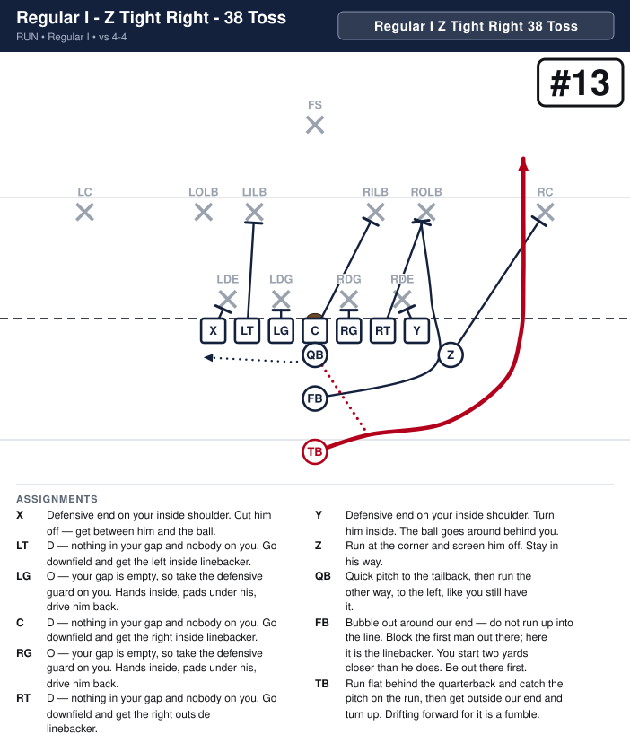
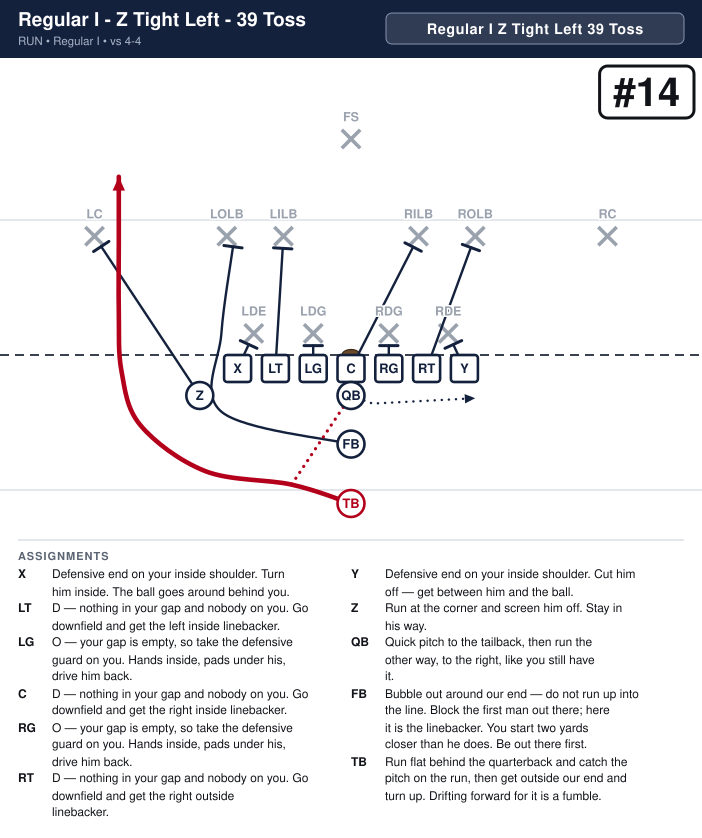
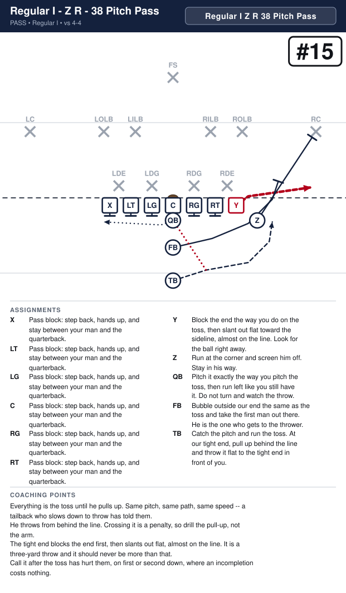
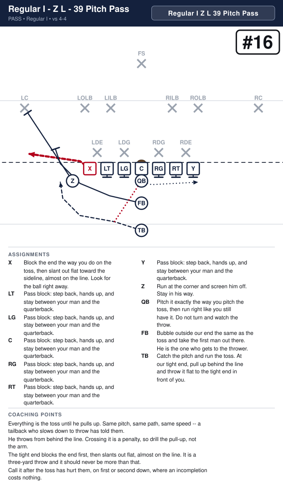

# Sayville 8U Playbook

_Generated by `generator/render.py`. Edit the JSON under `playbook/`, not this file._

Terminology and authoring rules: [playbook/CLAUDE.md](playbook/CLAUDE.md)

| # | Play | Call | Scheme | Type | Formation | Ball |
|---|---|---|---|---|---|---|
| 1 | [Regular I - Z Right - 36 Handoff](#regular-i---z-right---36-handoff) | `Regular I Z Right 36 Handoff` | Power | run | Regular I | TB |
| 2 | [Regular I - Z Left - 37 Handoff](#regular-i---z-left---37-handoff) | `Regular I Z Left 37 Handoff` | Power | run | Regular I | TB |
| 3 | [Regular I - Z Right - X Sweep Right](#regular-i---z-right---x-sweep-right) | `Regular I Z Right X Sweep Right` | Sweep | run | Regular I | X |
| 4 | [Regular I - Z Left - Y Sweep Left](#regular-i---z-left---y-sweep-left) | `Regular I Z Left Y Sweep Left` | Sweep | run | Regular I | Y |
| 5 | [Regular I - Z Right - Z Sweep Left](#regular-i---z-right---z-sweep-left) | `Regular I Z Right Z Sweep Left` | Sweep | run | Regular I | Z |
| 6 | [Regular I - Z Left - Z Sweep Right](#regular-i---z-left---z-sweep-right) | `Regular I Z Left Z Sweep Right` | Sweep | run | Regular I | Z |
| 7 | [Regular I - Z Right - 32 Handoff](#regular-i---z-right---32-handoff) | `Regular I Z Right 32 Handoff` | Smash | run | Regular I | TB |
| 8 | [Regular I - Z Left - 33 Handoff](#regular-i---z-left---33-handoff) | `Regular I Z Left 33 Handoff` | Smash | run | Regular I | TB |
| 9 | [Regular I - Z Right - Y Slant Pass Right](#regular-i---z-right---y-slant-pass-right) | `Regular I Z Right Y Slant Pass Right` | Protect | pass | Regular I | Y |
| 10 | [Regular I - Z Left - X Slant Pass Left](#regular-i---z-left---x-slant-pass-left) | `Regular I Z Left X Slant Pass Left` | Protect | pass | Regular I | X |
| 11 | [Regular I - Z Right - 22 Handoff](#regular-i---z-right---22-handoff) | `Regular I Z Right 22 Handoff` | Smash | run | Regular I | FB |
| 12 | [Regular I - Z Left - 23 Handoff](#regular-i---z-left---23-handoff) | `Regular I Z Left 23 Handoff` | Smash | run | Regular I | FB |
| 13 | [Regular I - Z Right - 38 Toss](#regular-i---z-right---38-toss) | `Regular I Z Right 38 Toss` | Toss | run | Regular I | TB |
| 14 | [Regular I - Z Left - 39 Toss](#regular-i---z-left---39-toss) | `Regular I Z Left 39 Toss` | Toss | run | Regular I | TB |
| 15 | [Regular I - Z Right - 38 Toss Pass](#regular-i---z-right---38-toss-pass) | `Regular I Z Right 38 Toss Pass` | Protect | pass | Regular I | Y |
| 16 | [Regular I - Z Left - 39 Toss Pass](#regular-i---z-left---39-toss-pass) | `Regular I Z Left 39 Toss Pass` | Protect | pass | Regular I | X |
| 17 | [Wishbone - 46 Handoff](#wishbone---46-handoff) | `Wishbone 46 Handoff` | Power | run | Wishbone | RH |
| 18 | [Wishbone - 37 Handoff](#wishbone---37-handoff) | `Wishbone 37 Handoff` | Power | run | Wishbone | LH |
| 19 | [Wishbone - 22 Handoff](#wishbone---22-handoff) | `Wishbone 22 Handoff` | Smash | run | Wishbone | FB |
| 20 | [Wishbone - 23 Handoff](#wishbone---23-handoff) | `Wishbone 23 Handoff` | Smash | run | Wishbone | FB |
| 21 | [Wishbone - 24 Handoff](#wishbone---24-handoff) | `Wishbone 24 Handoff` | Dive | run | Wishbone | FB |
| 22 | [Wishbone - 25 Handoff](#wishbone---25-handoff) | `Wishbone 25 Handoff` | Dive | run | Wishbone | FB |
| 23 | [Wishbone - 38 Toss](#wishbone---38-toss) | `Wishbone 38 Toss` | Toss | run | Wishbone | LH |
| 24 | [Wishbone - 49 Toss](#wishbone---49-toss) | `Wishbone 49 Toss` | Toss | run | Wishbone | RH |
| 25 | [Split Backs - Z Right - 38 Toss](#split-backs---z-right---38-toss) | `Split Backs Z Right 38 Toss` | Toss | run | Split Backs | LH |
| 26 | [Split Backs - Z Left - 29 Toss](#split-backs---z-left---29-toss) | `Split Backs Z Left 29 Toss` | Toss | run | Split Backs | RH |
| 27 | [Split Backs - Z Right - 18 Sweep](#split-backs---z-right---18-sweep) | `Split Backs Z Right 18 Sweep` | Sweep | run | Split Backs | QB |
| 28 | [Split Backs - Z Left - 19 Sweep](#split-backs---z-left---19-sweep) | `Split Backs Z Left 19 Sweep` | Sweep | run | Split Backs | QB |
| 29 | [Split Backs - Z Left - 19 Fake Sweep](#split-backs---z-left---19-fake-sweep) | `Split Backs Z Left 19 Fake Sweep` | Sweep | run | Split Backs | QB |
| 30 | [Split Backs - Z Right - 18 Fake Sweep](#split-backs---z-right---18-fake-sweep) | `Split Backs Z Right 18 Fake Sweep` | Sweep | run | Split Backs | QB |
| 31 | [Split Backs - Z Right - Z Sweep Left](#split-backs---z-right---z-sweep-left) | `Split Backs Z Right Z Sweep Left` | Sweep | run | Split Backs | Z |
| 32 | [Split Backs - Z Left - Z Sweep Right](#split-backs---z-left---z-sweep-right) | `Split Backs Z Left Z Sweep Right` | Sweep | run | Split Backs | Z |
| 33 | [Split Backs - Z Right - X Sweep Right](#split-backs---z-right---x-sweep-right) | `Split Backs Z Right X Sweep Right` | Sweep | run | Split Backs | X |
| 34 | [Split Backs - Z Left - Y Sweep Left](#split-backs---z-left---y-sweep-left) | `Split Backs Z Left Y Sweep Left` | Sweep | run | Split Backs | Y |
| 35 | [Split Backs - Z Right - Y Slant Pass Right](#split-backs---z-right---y-slant-pass-right) | `Split Backs Z Right Y Slant Pass Right` | Protect | pass | Split Backs | Y |
| 36 | [Split Backs - Z Left - X Slant Pass Left](#split-backs---z-left---x-slant-pass-left) | `Split Backs Z Left X Slant Pass Left` | Protect | pass | Split Backs | X |
| 37 | [Split Backs - Z Right - 36 Handoff](#split-backs---z-right---36-handoff) | `Split Backs Z Right 36 Handoff` | Power | run | Split Backs | LH |
| 38 | [Split Backs - Z Left - 27 Handoff](#split-backs---z-left---27-handoff) | `Split Backs Z Left 27 Handoff` | Power | run | Split Backs | RH |
| 39 | [Split Backs - Z Right - 38 Toss Pass](#split-backs---z-right---38-toss-pass) | `Split Backs Z Right 38 Toss Pass` | Protect | pass | Split Backs | Y |
| 40 | [Split Backs - Z Left - 29 Toss Pass](#split-backs---z-left---29-toss-pass) | `Split Backs Z Left 29 Toss Pass` | Protect | pass | Split Backs | X |
| 41 | [Shotgun - Z Right - Y Slant Pass Right](#shotgun---z-right---y-slant-pass-right) | `Shotgun Z Right Y Slant Pass Right` | Protect | pass | Shotgun | Y |
| 42 | [Shotgun - Z Left - X Slant Pass Left](#shotgun---z-left---x-slant-pass-left) | `Shotgun Z Left X Slant Pass Left` | Protect | pass | Shotgun | X |
| 43 | [Shotgun - Z Left - 19 Sweep](#shotgun---z-left---19-sweep) | `Shotgun Z Left 19 Sweep` | Sweep | run | Shotgun | QB |
| 44 | [Shotgun - Z Right - 18 Sweep](#shotgun---z-right---18-sweep) | `Shotgun Z Right 18 Sweep` | Sweep | run | Shotgun | QB |
| 45 | [Shotgun - Z Right - 38 Toss](#shotgun---z-right---38-toss) | `Shotgun Z Right 38 Toss` | Toss | run | Shotgun | LH |
| 46 | [Shotgun - Z Left - 29 Toss](#shotgun---z-left---29-toss) | `Shotgun Z Left 29 Toss` | Toss | run | Shotgun | RH |
| 47 | [Trips - Right - X Sweep Right](#trips---right---x-sweep-right) | `Trips Right X Sweep Right` | Sweep | run | Trips | X |
| 48 | [Trips - Left - Y Sweep Left](#trips---left---y-sweep-left) | `Trips Left Y Sweep Left` | Sweep | run | Trips | Y |
| 49 | [Trips - Right - 38 Quick Pass](#trips---right---38-quick-pass) | `Trips Right 38 Quick Pass` | Protect | pass | Trips | TB |
| 50 | [Trips - Left - 39 Quick Pass](#trips---left---39-quick-pass) | `Trips Left 39 Quick Pass` | Protect | pass | Trips | TB |
| 51 | [Trips - Right - 18 Sweep](#trips---right---18-sweep) | `Trips Right 18 Sweep` | Sweep | run | Trips | QB |
| 52 | [Trips - Left - 19 Sweep](#trips---left---19-sweep) | `Trips Left 19 Sweep` | Sweep | run | Trips | QB |
| 53 | [Trips - Right - Y Slant Pass Right](#trips---right---y-slant-pass-right) | `Trips Right Y Slant Pass Right` | Protect | pass | Trips | Y |
| 54 | [Trips - Left - X Slant Pass Left](#trips---left---x-slant-pass-left) | `Trips Left X Slant Pass Left` | Protect | pass | Trips | X |
| 55 | [Power I - Z Right - 32 Handoff](#power-i---z-right---32-handoff) | `Power I Z Right 32 Handoff` | Smash | run | Power I | TB |
| 56 | [Power I - Z Left - 33 Handoff](#power-i---z-left---33-handoff) | `Power I Z Left 33 Handoff` | Smash | run | Power I | TB |
| 57 | [Power I - Z Right - 38 Toss](#power-i---z-right---38-toss) | `Power I Z Right 38 Toss` | Toss | run | Power I | TB |
| 58 | [Power I - Z Left - 39 Toss](#power-i---z-left---39-toss) | `Power I Z Left 39 Toss` | Toss | run | Power I | TB |

# Regular I

---

## Regular I - Z Right - 36 Handoff

**Call it:** `Regular I Z Right 36 Handoff`

**Scheme:** Power

| Position | Assignment |
|---|---|
| **X** | Block the left defensive end. |
| **LT** | Block the left outside linebacker. |
| **LG** | Block the left defensive guard. |
| **C** | Help on the left defensive guard, then block the left inside linebacker. |
| **RG** | Block the right defensive guard. |
| **RT** | Help on the right defensive guard, then block the right inside linebacker. |
| **Y** | Block the right defensive end. |
| **Z** | Block the right corner. |
| **QB** | Open right, hand deep to the tailback, then fake the boot. It holds the backside end. |
| **FB** | Lead through the hole, then block the right outside linebacker. |
| **TB** **(ball)** | Take the handoff downhill at our tackle's outside hip, following the fullback. Never bounce it outside. |

**Coaching points**

- This is the most physical run in the book. If it works you can run it fifteen times, and at this age you often can.
- Drill the Z's kick-out on its own. If he blocks the end with his shoulders square, the end slides underneath and makes the tackle for a loss — he has to attack the outside hip.
- The fullback's man is whoever shows in the hole, not a man he picks before the snap. Tell him that every time.
- The tailback's most common mistake is bouncing it wide looking for green grass. The yards are inside the Z's block. Make him run it tight in practice until it is automatic.

---

## Regular I - Z Left - 37 Handoff

**Call it:** `Regular I Z Left 37 Handoff`

**Scheme:** Power

| Position | Assignment |
|---|---|
| **X** | Block the left defensive end. |
| **LT** | Help on the left defensive guard, then block the left inside linebacker. |
| **LG** | Block the left defensive guard. |
| **C** | Help on the right defensive guard, then block the right inside linebacker. |
| **RG** | Block the right defensive guard. |
| **RT** | Block the right outside linebacker. |
| **Y** | Block the right defensive end. |
| **Z** | Block the left corner. |
| **QB** | Open left, hand deep to the tailback, then fake the boot. It holds the backside end. |
| **FB** | Lead through the hole, then block the left outside linebacker. |
| **TB** **(ball)** | Take the handoff downhill at our tackle's outside hip, following the fullback. Never bounce it outside. |

**Coaching points**

- This is the most physical run in the book. If it works you can run it fifteen times, and at this age you often can.
- Drill the Z's kick-out on its own. If he blocks the end with his shoulders square, the end slides underneath and makes the tackle for a loss — he has to attack the outside hip.
- The fullback's man is whoever shows in the hole, not a man he picks before the snap. Tell him that every time.
- The tailback's most common mistake is bouncing it wide looking for green grass. The yards are inside the Z's block. Make him run it tight in practice until it is automatic.

---

## Regular I - Z Right - X Sweep Right

**Call it:** `Regular I Z Right X Sweep Right`

**Scheme:** Sweep

| Position | Assignment |
|---|---|
| **X** **(ball)** | Stay down in your stance — no motion. At the snap run flat behind the quarterback, take the handoff at full speed and get to the right edge. Turn up outside the fullback. |
| **LT** | Block the left defensive end. |
| **LG** | Block the left defensive guard. |
| **C** | Help on the left defensive guard, then block the left inside linebacker. |
| **RG** | Block the right defensive guard. |
| **RT** | Help on the right defensive guard, then block the right inside linebacker. |
| **Y** | Block the right defensive end. |
| **Z** | Run at the corner and screen him off. Stay in his way. |
| **QB** | Open right and hand the ball to the left tight end as he comes across behind you, then fake a run to the left. |
| **FB** | Bubble out around our end, then double team the linebacker with the tailback. |
| **TB** | Bubble out around our end, then double team the linebacker with the fullback. |

**Coaching points**

- No motion before the snap. The end stays down in his stance, so the play is legal and nothing tips it off.
- The handoff is the whole play: the quarterback opens right and puts the ball in the end's belly at full speed, then carries out his fake.
- Both backs bubble out to the right ahead of the end and double team the outside linebacker together. Two of them on him is what gets the end around the corner.

---

## Regular I - Z Left - Y Sweep Left

**Call it:** `Regular I Z Left Y Sweep Left`

**Scheme:** Sweep

| Position | Assignment |
|---|---|
| **X** | Block the left defensive end. |
| **LT** | Help on the left defensive guard, then block the left inside linebacker. |
| **LG** | Block the left defensive guard. |
| **C** | Help on the right defensive guard, then block the right inside linebacker. |
| **RG** | Block the right defensive guard. |
| **RT** | Block the right defensive end. |
| **Y** **(ball)** | Stay down in your stance — no motion. At the snap run flat behind the quarterback, take the handoff at full speed and get to the left edge. Turn up outside the fullback. |
| **Z** | Run at the corner and screen him off. Stay in his way. |
| **QB** | Open left and hand the ball to the right tight end as he comes across behind you, then fake a run to the right. |
| **FB** | Bubble out around our end, then double team the linebacker with the tailback. |
| **TB** | Bubble out around our end, then double team the linebacker with the fullback. |

**Coaching points**

- No motion before the snap. The end stays down in his stance, so the play is legal and nothing tips it off.
- The handoff is the whole play: the quarterback opens left and puts the ball in the end's belly at full speed, then carries out his fake.
- Both backs bubble out to the left ahead of the end and double team the outside linebacker together. Two of them on him is what gets the end around the corner.

---

## Regular I - Z Right - Z Sweep Left

**Call it:** `Regular I Z Right Z Sweep Left`

**Scheme:** Sweep

| Position | Assignment |
|---|---|
| **X** | Block the left defensive end. |
| **LT** | Help on the left defensive end, then block the left outside linebacker. |
| **LG** | Block the left defensive guard. |
| **C** | Help on the left defensive guard, then block the left inside linebacker. |
| **RG** | Block the right defensive guard. |
| **RT** | Help on the right defensive guard, then block the right inside linebacker. |
| **Y** | Block the right defensive end. |
| **Z** **(ball)** | At the snap run flat across the backfield, take the handoff at full speed and get to the left edge. Turn up in the alley behind the fullback. |
| **QB** | Hand the ball to the slot as he runs past you, then fake the handoff to the tailback going right. |
| **FB** | Bubble out around our end, then double team the corner with the tailback. |
| **TB** | Bubble out around our end, then double team the linebacker with the fullback. |

**Coaching points**

- The slot runs flat and fast across the backfield. The handoff is at full speed, so the quarterback just puts it in his belly.
- After the handoff the quarterback carries out his fake to the tailback going right. It is what holds the backside.
- The fullback bubbles out ahead of the slot and takes the corner. The slot stays behind him and turns up in the alley.

---

## Regular I - Z Left - Z Sweep Right

**Call it:** `Regular I Z Left Z Sweep Right`

**Scheme:** Sweep

| Position | Assignment |
|---|---|
| **X** | Block the left defensive end. |
| **LT** | Help on the left defensive guard, then block the left inside linebacker. |
| **LG** | Block the left defensive guard. |
| **C** | Help on the right defensive guard, then block the right inside linebacker. |
| **RG** | Block the right defensive guard. |
| **RT** | Help on the right defensive end, then block the right outside linebacker. |
| **Y** | Block the right defensive end. |
| **Z** **(ball)** | At the snap run flat across the backfield, take the handoff at full speed and get to the right edge. Turn up in the alley behind the fullback. |
| **QB** | Hand the ball to the slot as he runs past you, then fake the handoff to the tailback going left. |
| **FB** | Bubble out around our end, then double team the corner with the tailback. |
| **TB** | Bubble out around our end, then double team the linebacker with the fullback. |

**Coaching points**

- The slot runs flat and fast across the backfield. The handoff is at full speed, so the quarterback just puts it in his belly.
- After the handoff the quarterback carries out his fake to the tailback going left. It is what holds the backside.
- The fullback bubbles out ahead of the slot and takes the corner. The slot stays behind him and turns up in the alley.

---

## Regular I - Z Right - 32 Handoff

**Call it:** `Regular I Z Right 32 Handoff`

**Scheme:** Smash

| Position | Assignment |
|---|---|
| **X** | Block the left defensive end. |
| **LT** | Block the left outside linebacker. |
| **LG** | Block the left defensive guard. |
| **C** | Help on the left defensive guard, then block the left inside linebacker. |
| **RG** | Block the right defensive guard. |
| **RT** | Block the right defensive end. |
| **Y** | Block the right outside linebacker. |
| **Z** | Block the right corner. |
| **QB** | Open right, hand to the tailback, then fake the boot left. It holds the backside end. |
| **FB** | Lead through the hole, then block the right inside linebacker. |
| **TB** **(ball)** | Take the handoff downhill between the center and the right guard, following the fullback. Do not bounce it. |

**Coaching points**

- This is the iso: the fullback smashes the linebacker in the hole, the tailback runs right off his hip.
- The hole is the A-gap — between the center and the right guard. If the tailback bounces, the play is dead.
- The fullback's man is whoever shows in that gap, not a man he picks before the snap.

---

## Regular I - Z Left - 33 Handoff

**Call it:** `Regular I Z Left 33 Handoff`

**Scheme:** Smash

| Position | Assignment |
|---|---|
| **X** | Block the left outside linebacker. |
| **LT** | Block the left defensive end. |
| **LG** | Block the left defensive guard. |
| **C** | Help on the right defensive guard, then block the right inside linebacker. |
| **RG** | Block the right defensive guard. |
| **RT** | Block the right outside linebacker. |
| **Y** | Block the right defensive end. |
| **Z** | Block the left corner. |
| **QB** | Open left, hand to the tailback, then fake the boot right. It holds the backside end. |
| **FB** | Lead through the hole, then block the left inside linebacker. |
| **TB** **(ball)** | Take the handoff downhill between the center and the left guard, following the fullback. Do not bounce it. |

**Coaching points**

- This is the iso: the fullback smashes the linebacker in the hole, the tailback runs right off his hip.
- The hole is the A-gap — between the center and the left guard. If the tailback bounces, the play is dead.
- The fullback's man is whoever shows in that gap, not a man he picks before the snap.

---

## Regular I - Z Right - Y Slant Pass Right

**Call it:** `Regular I Z Right Y Slant Pass Right`

**Scheme:** Protect

| Position | Assignment |
|---|---|
| **X** | Pass block: step back, hands up, and stay between your man and the quarterback. |
| **LT** | Pass block: step back, hands up, and stay between your man and the quarterback. |
| **LG** | Pass block: step back, hands up, and stay between your man and the quarterback. |
| **C** | Pass block: step back, hands up, and stay between your man and the quarterback. |
| **RG** | Pass block: step back, hands up, and stay between your man and the quarterback. |
| **RT** | Pass block: step back, hands up, and stay between your man and the quarterback. |
| **Y** **(ball)** | Take one step up, then slant out flat toward the right sideline, almost along the line of scrimmage. Look for the ball right away. |
| **Z** | Block the right corner. |
| **QB** | Take the snap, take one step and throw to the right tight end as he slants out. If he is covered, tuck it and run. |
| **FB** | Step up and out, hands up. Pick up anybody coming at the quarterback. |
| **TB** | Step up and out, hands up. Pick up anybody coming at the quarterback. |

**Coaching points**

- Everybody but the tight end and the Z pass blocks: step back, hands up, stay between your man and the quarterback.
- The slant stays flat — one step up and out, almost on the line of scrimmage. Any deeper and he runs into the linebackers.
- The quarterback throws it as soon as the tight end clears the end. If he is covered, tuck it and run — no second look.

---

## Regular I - Z Left - X Slant Pass Left

**Call it:** `Regular I Z Left X Slant Pass Left`

**Scheme:** Protect

| Position | Assignment |
|---|---|
| **X** **(ball)** | Take one step up, then slant out flat toward the left sideline, almost along the line of scrimmage. Look for the ball right away. |
| **LT** | Pass block: step back, hands up, and stay between your man and the quarterback. |
| **LG** | Pass block: step back, hands up, and stay between your man and the quarterback. |
| **C** | Pass block: step back, hands up, and stay between your man and the quarterback. |
| **RG** | Pass block: step back, hands up, and stay between your man and the quarterback. |
| **RT** | Pass block: step back, hands up, and stay between your man and the quarterback. |
| **Y** | Pass block: step back, hands up, and stay between your man and the quarterback. |
| **Z** | Block the left corner. |
| **QB** | Take the snap, take one step and throw to the left tight end as he slants out. If he is covered, tuck it and run. |
| **FB** | Step up and out, hands up. Pick up anybody coming at the quarterback. |
| **TB** | Step up and out, hands up. Pick up anybody coming at the quarterback. |

**Coaching points**

- Everybody but the tight end and the Z pass blocks: step back, hands up, stay between your man and the quarterback.
- The slant stays flat — one step up and out, almost on the line of scrimmage. Any deeper and he runs into the linebackers.
- The quarterback throws it as soon as the tight end clears the end. If he is covered, tuck it and run — no second look.

---

## Regular I - Z Right - 22 Handoff

**Call it:** `Regular I Z Right 22 Handoff`

**Scheme:** Smash

| Position | Assignment |
|---|---|
| **X** | Defensive end on your inside shoulder. Cut him off — get between him and the ball. |
| **LT** | Block down on the defensive guard, inside shoulder. Head across him — nobody crosses your face. |
| **LG** | Defensive guard head up on you. Cut him off — get between him and the ball. |
| **C** | Nobody on you. Climb to the playside linebacker. Head across him. |
| **RG** | Defensive guard head up on you. Hands inside, pads under his, drive him back. |
| **RT** | Block down on the defensive guard, inside shoulder. Head across him — nobody crosses your face. |
| **Y** | Defensive end on your inside shoulder. Cut him off — get between him and the ball. |
| **Z** | Run at the corner and screen him off. Stay in his way. |
| **QB** | Open right, hand to the fullback right now, then fake the boot left. It holds the backside end. |
| **FB** **(ball)** | Take the handoff downhill between the center and the right guard. You are the runner on this one, not the lead. Straight ahead, do not bounce it. |
| **TB** | Run hard to the left like you have the ball. You are what holds the backside linebacker. |

**Coaching points**

- This is the quick one. The fullback is only two yards from the hole -- he has the ball before the linebackers have moved.
- The hole is the A-gap, between the center and the right guard. Nobody leads him through it; his speed is the lead.
- The tailback's fake is the play as much as the handoff. If he jogs, the backside linebacker is in the hole.

---

## Regular I - Z Left - 23 Handoff

**Call it:** `Regular I Z Left 23 Handoff`

**Scheme:** Smash

| Position | Assignment |
|---|---|
| **X** | Defensive end on your inside shoulder. Cut him off — get between him and the ball. |
| **LT** | Block down on the defensive guard, inside shoulder. Head across him — nobody crosses your face. |
| **LG** | Defensive guard head up on you. Hands inside, pads under his, drive him back. |
| **C** | Nobody on you. Climb to the playside linebacker. Head across him. |
| **RG** | Defensive guard head up on you. Cut him off — get between him and the ball. |
| **RT** | Block down on the defensive guard, inside shoulder. Head across him — nobody crosses your face. |
| **Y** | Defensive end on your inside shoulder. Cut him off — get between him and the ball. |
| **Z** | Run at the corner and screen him off. Stay in his way. |
| **QB** | Open left, hand to the fullback right now, then fake the boot right. It holds the backside end. |
| **FB** **(ball)** | Take the handoff downhill between the center and the left guard. You are the runner on this one, not the lead. Straight ahead, do not bounce it. |
| **TB** | Run hard to the right like you have the ball. You are what holds the backside linebacker. |

**Coaching points**

- This is the quick one. The fullback is only two yards from the hole -- he has the ball before the linebackers have moved.
- The hole is the A-gap, between the center and the left guard. Nobody leads him through it; his speed is the lead.
- The tailback's fake is the play as much as the handoff. If he jogs, the backside linebacker is in the hole.

---

## Regular I - Z Right - 38 Toss

**Call it:** `Regular I Z Right 38 Toss`

**Scheme:** Toss

| Position | Assignment |
|---|---|
| **X** | Defensive end on your inside shoulder. Cut him off — get between him and the ball. |
| **LT** | Block down on the defensive guard, inside shoulder. Head across him — nobody crosses your face. |
| **LG** | Defensive guard head up on you. Cut him off — get between him and the ball. |
| **C** | Nobody on you. Climb to the playside linebacker. Head across him. |
| **RG** | Defensive guard head up on you. Step past him. Climb to the playside linebacker. Head across him. |
| **RT** | Block down on the defensive guard, inside shoulder. Head across him — nobody crosses your face. |
| **Y** | Defensive end on your inside shoulder. Turn him inside. The ball goes around behind you. |
| **Z** | Run at the corner and screen him off. Stay in his way. |
| **QB** | Quick pitch to the tailback, then run the other way, to the left, like you still have it. |
| **FB** | Bubble out around our end — do not run up into the line. Block the first man out there; here it is the linebacker. You start two yards closer than he does. Be out there first. |
| **TB** **(ball)** | Run flat behind the quarterback and catch the pitch on the run, then get outside our end and turn up. Drifting forward for it is a fumble. |

**Coaching points**

- The pitch goes early and behind him. A quarterback who waits to be tackled first will pitch it on the ground.
- The fullback is two yards closer to the edge than the tailback. He has to be out there first, or there is nothing to turn up behind.
- This is what the Power buys. Call it once they have started crashing our tackle, and the edge is empty.

---

## Regular I - Z Left - 39 Toss

**Call it:** `Regular I Z Left 39 Toss`

**Scheme:** Toss

| Position | Assignment |
|---|---|
| **X** | Defensive end on your inside shoulder. Turn him inside. The ball goes around behind you. |
| **LT** | Block down on the defensive guard, inside shoulder. Head across him — nobody crosses your face. |
| **LG** | Defensive guard head up on you. Step past him. Climb to the playside linebacker. Head across him. |
| **C** | Nobody on you. Climb to the playside linebacker. Head across him. |
| **RG** | Defensive guard head up on you. Cut him off — get between him and the ball. |
| **RT** | Block down on the defensive guard, inside shoulder. Head across him — nobody crosses your face. |
| **Y** | Defensive end on your inside shoulder. Cut him off — get between him and the ball. |
| **Z** | Run at the corner and screen him off. Stay in his way. |
| **QB** | Quick pitch to the tailback, then run the other way, to the right, like you still have it. |
| **FB** | Bubble out around our end — do not run up into the line. Block the first man out there; here it is the linebacker. You start two yards closer than he does. Be out there first. |
| **TB** **(ball)** | Run flat behind the quarterback and catch the pitch on the run, then get outside our end and turn up. Drifting forward for it is a fumble. |

**Coaching points**

- The pitch goes early and behind him. A quarterback who waits to be tackled first will pitch it on the ground.
- The fullback is two yards closer to the edge than the tailback. He has to be out there first, or there is nothing to turn up behind.
- This is what the Power buys. Call it once they have started crashing our tackle, and the edge is empty.

---

## Regular I - Z Right - 38 Toss Pass

**Call it:** `Regular I Z Right 38 Toss Pass`

**Scheme:** Protect

| Position | Assignment |
|---|---|
| **X** | Pass block: step back, hands up, and stay between your man and the quarterback. |
| **LT** | Pass block: step back, hands up, and stay between your man and the quarterback. |
| **LG** | Pass block: step back, hands up, and stay between your man and the quarterback. |
| **C** | Pass block: step back, hands up, and stay between your man and the quarterback. |
| **RG** | Pass block: step back, hands up, and stay between your man and the quarterback. |
| **RT** | Pass block: step back, hands up, and stay between your man and the quarterback. |
| **Y** **(ball)** | Block the end the way you do on the toss, then slant out flat toward the sideline, almost on the line. Look for the ball right away. |
| **Z** | Run at the corner and screen him off. Stay in his way. |
| **QB** | Pitch it exactly the way you pitch the toss, then run left like you still have it. Do not turn and watch the throw. |
| **FB** | Bubble outside our end the same as the toss and take the first man out there. He is the one who gets to the thrower. |
| **TB** | Catch the pitch and run the toss. At our tight end, pull up behind the line and throw it flat to the tight end in front of you. |

**Coaching points**

- Everything is the toss until he pulls up. Same pitch, same path, same speed -- a tailback who slows down to throw has told them.
- He throws from behind the line. Crossing it is a penalty, so drill the pull-up, not the arm.
- The tight end blocks the end first, then slants out flat, almost on the line. It is a three-yard throw and it should never be more than that.
- Call it after the toss has hurt them, on first or second down, where an incompletion costs nothing.

---

## Regular I - Z Left - 39 Toss Pass

**Call it:** `Regular I Z Left 39 Toss Pass`

**Scheme:** Protect

| Position | Assignment |
|---|---|
| **X** **(ball)** | Block the end the way you do on the toss, then slant out flat toward the sideline, almost on the line. Look for the ball right away. |
| **LT** | Pass block: step back, hands up, and stay between your man and the quarterback. |
| **LG** | Pass block: step back, hands up, and stay between your man and the quarterback. |
| **C** | Pass block: step back, hands up, and stay between your man and the quarterback. |
| **RG** | Pass block: step back, hands up, and stay between your man and the quarterback. |
| **RT** | Pass block: step back, hands up, and stay between your man and the quarterback. |
| **Y** | Pass block: step back, hands up, and stay between your man and the quarterback. |
| **Z** | Run at the corner and screen him off. Stay in his way. |
| **QB** | Pitch it exactly the way you pitch the toss, then run right like you still have it. Do not turn and watch the throw. |
| **FB** | Bubble outside our end the same as the toss and take the first man out there. He is the one who gets to the thrower. |
| **TB** | Catch the pitch and run the toss. At our tight end, pull up behind the line and throw it flat to the tight end in front of you. |

**Coaching points**

- Everything is the toss until he pulls up. Same pitch, same path, same speed -- a tailback who slows down to throw has told them.
- He throws from behind the line. Crossing it is a penalty, so drill the pull-up, not the arm.
- The tight end blocks the end first, then slants out flat, almost on the line. It is a three-yard throw and it should never be more than that.
- Call it after the toss has hurt them, on first or second down, where an incompletion costs nothing.

# Wishbone

---

## Wishbone - 46 Handoff

**Call it:** `Wishbone 46 Handoff`

**Scheme:** Power

| Position | Assignment |
|---|---|
| **X** | Defensive end on your inside shoulder. Cut him off — get between him and the ball. |
| **LT** | Block down on the defensive guard, inside shoulder. Head across him — nobody crosses your face. |
| **LG** | Defensive guard head up on you. Cut him off — get between him and the ball. |
| **C** | Nobody on you. Climb to the playside linebacker. Head across him. |
| **RG** | Defensive guard head up on you. Hands inside, pads under his, drive him back. |
| **RT** | Block down on the defensive guard, inside shoulder. Head across him — nobody crosses your face. |
| **Y** | Defensive end on your inside shoulder. Drive him to the sideline. The ball goes inside you. |
| **QB** | Open right, hand to the right halfback, then fake the boot. It holds the backside end. |
| **FB** | Lead through the hole. Block the first man who shows in it. |
| **LH** | Run hard to the left like you have the ball. You are what holds the backside. |
| **RH** **(ball)** | Take the handoff downhill at our tackle's outside hip, following the fullback. Never bounce it outside. |

**Coaching points**

- This is Power without a slot: the right tight end kicks the end out. The yards are inside that block.
- The fullback leads through the hole. His man is whoever shows, not a man he picks before the snap — including the outside linebacker if that is who fills.
- The right halfback's most common mistake is bouncing it wide. Make him run it tight until it is automatic.

---

## Wishbone - 37 Handoff

**Call it:** `Wishbone 37 Handoff`

**Scheme:** Power

| Position | Assignment |
|---|---|
| **X** | Defensive end on your inside shoulder. Drive him to the sideline. The ball goes inside you. |
| **LT** | Block down on the defensive guard, inside shoulder. Head across him — nobody crosses your face. |
| **LG** | Defensive guard head up on you. Hands inside, pads under his, drive him back. |
| **C** | Nobody on you. Climb to the playside linebacker. Head across him. |
| **RG** | Defensive guard head up on you. Cut him off — get between him and the ball. |
| **RT** | Block down on the defensive guard, inside shoulder. Head across him — nobody crosses your face. |
| **Y** | Defensive end on your inside shoulder. Cut him off — get between him and the ball. |
| **QB** | Open left, hand to the left halfback, then fake the boot. It holds the backside end. |
| **FB** | Lead through the hole. Block the first man who shows in it. |
| **LH** **(ball)** | Take the handoff downhill at our tackle's outside hip, following the fullback. Never bounce it outside. |
| **RH** | Run hard to the right like you have the ball. You are what holds the backside. |

**Coaching points**

- This is Power without a slot: the left tight end kicks the end out. The yards are inside that block.
- The fullback leads through the hole. His man is whoever shows, not a man he picks before the snap — including the outside linebacker if that is who fills.
- The left halfback's most common mistake is bouncing it wide. Make him run it tight until it is automatic.

---

## Wishbone - 22 Handoff

**Call it:** `Wishbone 22 Handoff`

**Scheme:** Smash

| Position | Assignment |
|---|---|
| **X** | Defensive end on your inside shoulder. Cut him off — get between him and the ball. |
| **LT** | Block down on the defensive guard, inside shoulder. Head across him — nobody crosses your face. |
| **LG** | Defensive guard head up on you. Cut him off — get between him and the ball. |
| **C** | Nobody on you. Climb to the playside linebacker. Head across him. |
| **RG** | Defensive guard head up on you. Hands inside, pads under his, drive him back. |
| **RT** | Block down on the defensive guard, inside shoulder. Head across him — nobody crosses your face. |
| **Y** | Defensive end on your inside shoulder. Cut him off — get between him and the ball. |
| **QB** | Open right, hand to the fullback, then fake the boot left. It holds the backside end. |
| **FB** **(ball)** | Take the handoff downhill between the center and the right guard. Do not bounce it. |
| **LH** | Run hard to the left like you have the ball. You are what holds the backside. |
| **RH** | Lead through the hole. Block the first man who shows in it. |

**Coaching points**

- The fullback is the runner here, not the lead. The hole is the A-gap — between the center and the right guard.
- The right halfback leads through that gap. If the fullback bounces, the play is dead.

---

## Wishbone - 23 Handoff

**Call it:** `Wishbone 23 Handoff`

**Scheme:** Smash

| Position | Assignment |
|---|---|
| **X** | Defensive end on your inside shoulder. Cut him off — get between him and the ball. |
| **LT** | Block down on the defensive guard, inside shoulder. Head across him — nobody crosses your face. |
| **LG** | Defensive guard head up on you. Hands inside, pads under his, drive him back. |
| **C** | Nobody on you. Climb to the playside linebacker. Head across him. |
| **RG** | Defensive guard head up on you. Cut him off — get between him and the ball. |
| **RT** | Block down on the defensive guard, inside shoulder. Head across him — nobody crosses your face. |
| **Y** | Defensive end on your inside shoulder. Cut him off — get between him and the ball. |
| **QB** | Open left, hand to the fullback, then fake the boot right. It holds the backside end. |
| **FB** **(ball)** | Take the handoff downhill between the center and the left guard. Do not bounce it. |
| **LH** | Lead through the hole. Block the first man who shows in it. |
| **RH** | Run hard to the right like you have the ball. You are what holds the backside. |

**Coaching points**

- The fullback is the runner here, not the lead. The hole is the A-gap — between the center and the left guard.
- The left halfback leads through that gap. If the fullback bounces, the play is dead.

---

## Wishbone - 24 Handoff

**Call it:** `Wishbone 24 Handoff`

**Scheme:** Dive

| Position | Assignment |
|---|---|
| **X** | Defensive end on your inside shoulder. Cut him off — get between him and the ball. |
| **LT** | Block down on the defensive guard, inside shoulder. Head across him — nobody crosses your face. |
| **LG** | Defensive guard head up on you. Cut him off — get between him and the ball. |
| **C** | Nobody on you. Climb to the playside linebacker. Head across him. |
| **RG** | Block down on the defensive guard, head up. Head across him — nobody crosses your face. |
| **RT** | Defensive end on your outside shoulder. Hands inside, pads under his, drive him back. |
| **Y** | Defensive end on your inside shoulder. Cut him off — get between him and the ball. |
| **QB** | Open right, hand to the fullback, then fake the boot left. It holds the backside end. |
| **FB** **(ball)** | Take the handoff downhill between the right guard and the right tackle. One cut, then get north. Do not bounce it. |
| **LH** | Run hard to the left like you have the ball. You are what holds the backside. |
| **RH** | Lead through the hole. Block the first man who shows in it. |

**Coaching points**

- Dive is the B-gap — between the guard and the tackle. Faster than Power, wider than Smash.
- The fullback takes it downhill and gets north. One cut off the double team, never a bounce.

---

## Wishbone - 25 Handoff

**Call it:** `Wishbone 25 Handoff`

**Scheme:** Dive

| Position | Assignment |
|---|---|
| **X** | Defensive end on your inside shoulder. Cut him off — get between him and the ball. |
| **LT** | Defensive end on your outside shoulder. Hands inside, pads under his, drive him back. |
| **LG** | Block down on the defensive guard, head up. Head across him — nobody crosses your face. |
| **C** | Nobody on you. Climb to the playside linebacker. Head across him. |
| **RG** | Defensive guard head up on you. Cut him off — get between him and the ball. |
| **RT** | Block down on the defensive guard, inside shoulder. Head across him — nobody crosses your face. |
| **Y** | Defensive end on your inside shoulder. Cut him off — get between him and the ball. |
| **QB** | Open left, hand to the fullback, then fake the boot right. It holds the backside end. |
| **FB** **(ball)** | Take the handoff downhill between the left guard and the left tackle. One cut, then get north. Do not bounce it. |
| **LH** | Lead through the hole. Block the first man who shows in it. |
| **RH** | Run hard to the right like you have the ball. You are what holds the backside. |

**Coaching points**

- Dive is the B-gap — between the guard and the tackle. Faster than Power, wider than Smash.
- The fullback takes it downhill and gets north. One cut off the double team, never a bounce.

---

## Wishbone - 38 Toss

**Call it:** `Wishbone 38 Toss`

**Scheme:** Toss

| Position | Assignment |
|---|---|
| **X** | Defensive end on your inside shoulder. Cut him off — get between him and the ball. |
| **LT** | Block down on the defensive guard, inside shoulder. Head across him — nobody crosses your face. |
| **LG** | Defensive guard head up on you. Cut him off — get between him and the ball. |
| **C** | Nobody on you. Climb to the playside linebacker. Head across him. |
| **RG** | Defensive guard head up on you. Step past him. Climb to the playside linebacker. Head across him. |
| **RT** | Block down on the defensive guard, inside shoulder. Head across him — nobody crosses your face. |
| **Y** | Defensive end on your inside shoulder. Turn him inside. The ball goes around behind you. |
| **QB** | Quick pitch to the left halfback, then run the other way, to the left, like you still have it. |
| **FB** | Bubble out around our end — do not run up into the line. Block the first man out there; here it is the linebacker. |
| **LH** **(ball)** | Run flat, outside and behind the quarterback, and catch the pitch on the run. Ahead of him is a fumble. |
| **RH** | Bubble out around our end — do not run up into the line. Block the first man out there; here it is the corner. Step at the dive first to hold their linebackers. |

**Coaching points**

- The pitch goes early. A quarterback who waits to be tackled first will pitch it on the ground.
- This is not a read at this age — tell him before the snap that he is pitching it.
- The fullback and the right halfback both go to the edge. The left halfback stays behind them and turns up in the alley.

---

## Wishbone - 49 Toss

**Call it:** `Wishbone 49 Toss`

**Scheme:** Toss

| Position | Assignment |
|---|---|
| **X** | Defensive end on your inside shoulder. Turn him inside. The ball goes around behind you. |
| **LT** | Block down on the defensive guard, inside shoulder. Head across him — nobody crosses your face. |
| **LG** | Defensive guard head up on you. Step past him. Climb to the playside linebacker. Head across him. |
| **C** | Nobody on you. Climb to the playside linebacker. Head across him. |
| **RG** | Defensive guard head up on you. Cut him off — get between him and the ball. |
| **RT** | Block down on the defensive guard, inside shoulder. Head across him — nobody crosses your face. |
| **Y** | Defensive end on your inside shoulder. Cut him off — get between him and the ball. |
| **QB** | Quick pitch to the right halfback, then run the other way, to the right, like you still have it. |
| **FB** | Bubble out around our end — do not run up into the line. Block the first man out there; here it is the linebacker. |
| **LH** | Bubble out around our end — do not run up into the line. Block the first man out there; here it is the corner. Step at the dive first to hold their linebackers. |
| **RH** **(ball)** | Run flat, outside and behind the quarterback, and catch the pitch on the run. Ahead of him is a fumble. |

**Coaching points**

- The pitch goes early. A quarterback who waits to be tackled first will pitch it on the ground.
- This is not a read at this age — tell him before the snap that he is pitching it.
- The fullback and the left halfback both go to the edge. The right halfback stays behind them and turns up in the alley.

# Split Backs

---

## Split Backs - Z Right - 38 Toss

**Call it:** `Split Backs Z Right 38 Toss`

**Scheme:** Toss

| Position | Assignment |
|---|---|
| **X** | Block the left defensive end. |
| **LT** | Block the left inside linebacker. |
| **LG** | Block the left defensive guard. |
| **C** | Help on the right defensive guard, then block the right inside linebacker. |
| **RG** | Block the right defensive guard. |
| **RT** | Block the right inside linebacker. |
| **Y** | Block the right defensive end. |
| **Z** | Block the right corner. |
| **QB** | Quick pitch to the left halfback, then run the other way, to the left, like you still have it. |
| **LH** **(ball)** | Run flat, outside and behind the quarterback, and catch the pitch on the run. Ahead of him is a fumble. |
| **RH** | Bubble around the right tight end, then block the right outside linebacker. |

**Coaching points**

- The pitch goes early. A quarterback who waits to be tackled first will pitch it on the ground.
- This is not a read at this age — tell him before the snap that he is pitching it.
- Everything depends on the edge being blocked, and out here the split man does it — which is what frees both backs to fake and lead. Drill him on beating that man to the spot without holding.

---

## Split Backs - Z Left - 29 Toss

**Call it:** `Split Backs Z Left 29 Toss`

**Scheme:** Toss

| Position | Assignment |
|---|---|
| **X** | Block the left defensive end. |
| **LT** | Block the left inside linebacker. |
| **LG** | Block the left defensive guard. |
| **C** | Help on the left defensive guard, then block the left inside linebacker. |
| **RG** | Block the right defensive guard. |
| **RT** | Block the right inside linebacker. |
| **Y** | Block the right defensive end. |
| **Z** | Block the left corner. |
| **QB** | Quick pitch to the right halfback, then run the other way, to the right, like you still have it. |
| **LH** | Bubble around the left tight end, then block the left outside linebacker. |
| **RH** **(ball)** | Run flat, outside and behind the quarterback, and catch the pitch on the run. Ahead of him is a fumble. |

**Coaching points**

- The pitch goes early. A quarterback who waits to be tackled first will pitch it on the ground.
- This is not a read at this age — tell him before the snap that he is pitching it.
- Everything depends on the edge being blocked, and out here the split man does it — which is what frees both backs to fake and lead. Drill him on beating that man to the spot without holding.

---

## Split Backs - Z Right - 18 Sweep

**Call it:** `Split Backs Z Right 18 Sweep`

**Scheme:** Sweep

| Position | Assignment |
|---|---|
| **X** | Block the left defensive end. |
| **LT** | Help on the left defensive end, then block the left outside linebacker. |
| **LG** | Block the left defensive guard. |
| **C** | Help on the left defensive guard, then block the left inside linebacker. |
| **RG** | Block the right defensive guard. |
| **RT** | Help on the right defensive guard, then block the right inside linebacker. |
| **Y** | Defensive end on your inside shoulder. Turn him inside. The ball goes around behind you. |
| **Z** | Run at the corner and screen him off. Stay in his way. |
| **QB** **(ball)** | Take the snap and sweep right, flat and fast, behind the right halfback. Turn up outside his block. |
| **LH** | Bubble out around our end, then double team the linebacker with the right halfback. |
| **RH** | Bubble out around our end, then double team the linebacker with the left halfback. |

**Coaching points**

- The quarterback keeps it every time — tell him before the snap, there is no read.
- The left halfback's fake is the play. If he jogs, nobody follows him and the defense is waiting at the edge.
- The quarterback stays behind the right halfback until the block is made, then turns it up. Running past his blocker is how the sweep loses yards.

---

## Split Backs - Z Left - 19 Sweep

**Call it:** `Split Backs Z Left 19 Sweep`

**Scheme:** Sweep

| Position | Assignment |
|---|---|
| **X** | Defensive end on your inside shoulder. Turn him inside. The ball goes around behind you. |
| **LT** | Help on the left defensive guard, then block the left inside linebacker. |
| **LG** | Block the left defensive guard. |
| **C** | Help on the right defensive guard, then block the right inside linebacker. |
| **RG** | Block the right defensive guard. |
| **RT** | Help on the right defensive end, then block the right outside linebacker. |
| **Y** | Block the right defensive end. |
| **Z** | Run at the corner and screen him off. Stay in his way. |
| **QB** **(ball)** | Take the snap and sweep left, flat and fast, behind the left halfback. Turn up outside his block. |
| **LH** | Bubble out around our end, then double team the linebacker with the right halfback. |
| **RH** | Bubble out around our end, then double team the linebacker with the left halfback. |

**Coaching points**

- The quarterback keeps it every time — tell him before the snap, there is no read.
- The right halfback's fake is the play. If he jogs, nobody follows him and the defense is waiting at the edge.
- The quarterback stays behind the left halfback until the block is made, then turns it up. Running past his blocker is how the sweep loses yards.

---

## Split Backs - Z Left - 19 Fake Sweep

**Call it:** `Split Backs Z Left 19 Fake Sweep`

**Scheme:** Sweep

| Position | Assignment |
|---|---|
| **X** | Defensive end on your inside shoulder. Turn him inside. The ball goes around behind you. |
| **LT** | Help on the left defensive guard, then block the left inside linebacker. |
| **LG** | Block the left defensive guard. |
| **C** | Help on the right defensive guard, then block the right inside linebacker. |
| **RG** | Block the right defensive guard. |
| **RT** | Help on the right defensive end, then block the right outside linebacker. |
| **Y** | Block the right defensive end. |
| **Z** | Run at the corner and screen him off. Stay in his way. |
| **QB** **(ball)** | Fake the handoff to the right halfback, then roll back left and sweep it, flat and fast, behind the left halfback. Turn up outside his block. |
| **LH** | Bubble out around the left tight end, then block the left outside linebacker. |
| **RH** | Take the fake from the quarterback and run hard to the right like you have the ball. Sell it all the way — you are the reason the defense goes the wrong way. |

**Coaching points**

- The fake has to look real: the quarterback puts the ball at the right halfback's belly and pulls it back out.
- The right halfback's fake is the play. If he jogs, nobody follows him and the defense is waiting on the left.
- After the fake the quarterback gets back to the left fast, stays behind the left halfback until the block is made, then turns it up.

---

## Split Backs - Z Right - 18 Fake Sweep

**Call it:** `Split Backs Z Right 18 Fake Sweep`

**Scheme:** Sweep

| Position | Assignment |
|---|---|
| **X** | Block the left defensive end. |
| **LT** | Help on the left defensive end, then block the left outside linebacker. |
| **LG** | Block the left defensive guard. |
| **C** | Help on the left defensive guard, then block the left inside linebacker. |
| **RG** | Block the right defensive guard. |
| **RT** | Help on the right defensive guard, then block the right inside linebacker. |
| **Y** | Defensive end on your inside shoulder. Turn him inside. The ball goes around behind you. |
| **Z** | Run at the corner and screen him off. Stay in his way. |
| **QB** **(ball)** | Fake the handoff to the left halfback, then roll back right and sweep it, flat and fast, behind the right halfback. Turn up outside his block. |
| **LH** | Take the fake from the quarterback and run hard to the left like you have the ball. Sell it all the way — you are the reason the defense goes the wrong way. |
| **RH** | Bubble out around the right tight end, then block the right outside linebacker. |

**Coaching points**

- The fake has to look real: the quarterback puts the ball at the left halfback's belly and pulls it back out.
- The left halfback's fake is the play. If he jogs, nobody follows him and the defense is waiting on the right.
- After the fake the quarterback gets back to the right fast, stays behind the right halfback until the block is made, then turns it up.

---

## Split Backs - Z Right - Z Sweep Left

**Call it:** `Split Backs Z Right Z Sweep Left`

**Scheme:** Sweep

| Position | Assignment |
|---|---|
| **X** | Block the left defensive end. |
| **LT** | Help on the left defensive end, then block the left outside linebacker. |
| **LG** | Block the left defensive guard. |
| **C** | Help on the left defensive guard, then block the left inside linebacker. |
| **RG** | Block the right defensive guard. |
| **RT** | Help on the right defensive guard, then block the right inside linebacker. |
| **Y** | Block the right defensive end. |
| **Z** **(ball)** | At the snap run flat across the backfield, take the handoff at full speed and get to the left edge. Turn up in the alley behind the left halfback. |
| **QB** | Hand the ball to the slot as he runs past you, then fake the handoff to the right halfback going right. |
| **LH** | Bubble out around our end, then double team the corner with the right halfback. |
| **RH** | Bubble out around our end, then double team the linebacker with the left halfback. |

**Coaching points**

- The slot runs flat and fast across the backfield. The handoff is at full speed, so the quarterback just puts it in his belly.
- After the handoff the quarterback carries out his fake to the right halfback going right. It is what holds the backside.
- The left halfback bubbles out ahead of the slot and takes the corner. The slot stays behind him and turns up in the alley.

---

## Split Backs - Z Left - Z Sweep Right

**Call it:** `Split Backs Z Left Z Sweep Right`

**Scheme:** Sweep

| Position | Assignment |
|---|---|
| **X** | Block the left defensive end. |
| **LT** | Help on the left defensive guard, then block the left inside linebacker. |
| **LG** | Block the left defensive guard. |
| **C** | Help on the right defensive guard, then block the right inside linebacker. |
| **RG** | Block the right defensive guard. |
| **RT** | Help on the right defensive end, then block the right outside linebacker. |
| **Y** | Block the right defensive end. |
| **Z** **(ball)** | At the snap run flat across the backfield, take the handoff at full speed and get to the right edge. Turn up in the alley behind the right halfback. |
| **QB** | Hand the ball to the slot as he runs past you, then fake the handoff to the left halfback going left. |
| **LH** | Bubble out around our end, then double team the corner with the right halfback. |
| **RH** | Bubble out around our end, then double team the linebacker with the left halfback. |

**Coaching points**

- The slot runs flat and fast across the backfield. The handoff is at full speed, so the quarterback just puts it in his belly.
- After the handoff the quarterback carries out his fake to the left halfback going left. It is what holds the backside.
- The right halfback bubbles out ahead of the slot and takes the corner. The slot stays behind him and turns up in the alley.

---

## Split Backs - Z Right - X Sweep Right

**Call it:** `Split Backs Z Right X Sweep Right`

**Scheme:** Sweep

| Position | Assignment |
|---|---|
| **X** **(ball)** | Stay down in your stance — no motion. At the snap run flat behind the quarterback, take the handoff at full speed and get to the right edge. Turn up outside the halfbacks. |
| **LT** | Block the left defensive end. |
| **LG** | Block the left defensive guard. |
| **C** | Help on the left defensive guard, then block the left inside linebacker. |
| **RG** | Block the right defensive guard. |
| **RT** | Help on the right defensive guard, then block the right inside linebacker. |
| **Y** | Block the right defensive end. |
| **Z** | Run at the corner and screen him off. Stay in his way. |
| **QB** | Open right and hand the ball to the left tight end as he comes across behind you, then fake a run to the left. |
| **LH** | Bubble out around our end, then double team the linebacker with the right halfback. |
| **RH** | Bubble out around our end, then double team the linebacker with the left halfback. |

**Coaching points**

- No motion before the snap. The end stays down in his stance, so the play is legal and nothing tips it off.
- The handoff is the whole play: the quarterback opens right and puts the ball in the end's belly at full speed, then carries out his fake.
- Both halfbacks bubble out to the right ahead of the end and double team the outside linebacker together. Two of them on him is what gets the end around the corner.

---

## Split Backs - Z Left - Y Sweep Left

**Call it:** `Split Backs Z Left Y Sweep Left`

**Scheme:** Sweep

| Position | Assignment |
|---|---|
| **X** | Block the left defensive end. |
| **LT** | Help on the left defensive guard, then block the left inside linebacker. |
| **LG** | Block the left defensive guard. |
| **C** | Help on the right defensive guard, then block the right inside linebacker. |
| **RG** | Block the right defensive guard. |
| **RT** | Block the right defensive end. |
| **Y** **(ball)** | Stay down in your stance — no motion. At the snap run flat behind the quarterback, take the handoff at full speed and get to the left edge. Turn up outside the halfbacks. |
| **Z** | Run at the corner and screen him off. Stay in his way. |
| **QB** | Open left and hand the ball to the right tight end as he comes across behind you, then fake a run to the right. |
| **LH** | Bubble out around our end, then double team the linebacker with the right halfback. |
| **RH** | Bubble out around our end, then double team the linebacker with the left halfback. |

**Coaching points**

- No motion before the snap. The end stays down in his stance, so the play is legal and nothing tips it off.
- The handoff is the whole play: the quarterback opens left and puts the ball in the end's belly at full speed, then carries out his fake.
- Both halfbacks bubble out to the left ahead of the end and double team the outside linebacker together. Two of them on him is what gets the end around the corner.

---

## Split Backs - Z Right - Y Slant Pass Right

**Call it:** `Split Backs Z Right Y Slant Pass Right`

**Scheme:** Protect

| Position | Assignment |
|---|---|
| **X** | Pass block: step back, hands up, and stay between your man and the quarterback. |
| **LT** | Pass block: step back, hands up, and stay between your man and the quarterback. |
| **LG** | Pass block: step back, hands up, and stay between your man and the quarterback. |
| **C** | Pass block: step back, hands up, and stay between your man and the quarterback. |
| **RG** | Pass block: step back, hands up, and stay between your man and the quarterback. |
| **RT** | Pass block: step back, hands up, and stay between your man and the quarterback. |
| **Y** **(ball)** | Take one step up, then slant out flat toward the right sideline, almost along the line of scrimmage. Look for the ball right away. |
| **Z** | Block the right corner. |
| **QB** | Take the snap, take one step and throw to the right tight end as he slants out. If he is covered, tuck it and run. |
| **LH** | Step up and out, hands up. Pick up anybody coming at the quarterback. |
| **RH** | Step up and out, hands up. Pick up anybody coming at the quarterback. |

**Coaching points**

- Everybody but the tight end and the Z pass blocks: step back, hands up, stay between your man and the quarterback.
- The slant stays flat — one step up and out, almost on the line of scrimmage. Any deeper and he runs into the linebackers.
- The quarterback throws it as soon as the tight end clears the end. If he is covered, tuck it and run — no second look.

---

## Split Backs - Z Left - X Slant Pass Left

**Call it:** `Split Backs Z Left X Slant Pass Left`

**Scheme:** Protect

| Position | Assignment |
|---|---|
| **X** **(ball)** | Take one step up, then slant out flat toward the left sideline, almost along the line of scrimmage. Look for the ball right away. |
| **LT** | Pass block: step back, hands up, and stay between your man and the quarterback. |
| **LG** | Pass block: step back, hands up, and stay between your man and the quarterback. |
| **C** | Pass block: step back, hands up, and stay between your man and the quarterback. |
| **RG** | Pass block: step back, hands up, and stay between your man and the quarterback. |
| **RT** | Pass block: step back, hands up, and stay between your man and the quarterback. |
| **Y** | Pass block: step back, hands up, and stay between your man and the quarterback. |
| **Z** | Block the left corner. |
| **QB** | Take the snap, take one step and throw to the left tight end as he slants out. If he is covered, tuck it and run. |
| **LH** | Step up and out, hands up. Pick up anybody coming at the quarterback. |
| **RH** | Step up and out, hands up. Pick up anybody coming at the quarterback. |

**Coaching points**

- Everybody but the tight end and the Z pass blocks: step back, hands up, stay between your man and the quarterback.
- The slant stays flat — one step up and out, almost on the line of scrimmage. Any deeper and he runs into the linebackers.
- The quarterback throws it as soon as the tight end clears the end. If he is covered, tuck it and run — no second look.

---

## Split Backs - Z Right - 36 Handoff

**Call it:** `Split Backs Z Right 36 Handoff`

**Scheme:** Power

| Position | Assignment |
|---|---|
| **X** | Defensive end on your inside shoulder. Cut him off — get between him and the ball. |
| **LT** | Block down on the defensive guard, inside shoulder. Head across him — nobody crosses your face. |
| **LG** | Defensive guard head up on you. Cut him off — get between him and the ball. |
| **C** | Nobody on you. Climb to the playside linebacker. Head across him. |
| **RG** | Defensive guard head up on you. Hands inside, pads under his, drive him back. |
| **RT** | Block down on the defensive guard, inside shoulder. Head across him — nobody crosses your face. |
| **Y** | Leave the defensive end — he is kicked out. Go take the outside linebacker. |
| **Z** | Kick the defensive end out. Aim at his outside hip. Never let him come underneath you. |
| **QB** | Open right and hand deep to the left halfback as he crosses, then fake the boot. It holds the backside end. |
| **LH** **(ball)** | Cross behind the quarterback, take the handoff and hit it downhill at our tackle's outside hip. Never bounce it outside. |
| **RH** | Lead through the hole. Block the first man who shows in it. |

**Coaching points**

- The same Power as the Regular I, run from two backs instead of a stack. The slot kicks the end out and the right halfback leads through the hole.
- The runner is the back on the far side. He has further to travel, so he has to start on the snap -- no false step, no waiting to see the hole.
- The yards are inside the slot's kick-out. If the halfback bounces it wide looking for grass, the play is dead.

---

## Split Backs - Z Left - 27 Handoff

**Call it:** `Split Backs Z Left 27 Handoff`

**Scheme:** Power

| Position | Assignment |
|---|---|
| **X** | Leave the defensive end — he is kicked out. Go take the outside linebacker. |
| **LT** | Block down on the defensive guard, inside shoulder. Head across him — nobody crosses your face. |
| **LG** | Defensive guard head up on you. Hands inside, pads under his, drive him back. |
| **C** | Nobody on you. Climb to the playside linebacker. Head across him. |
| **RG** | Defensive guard head up on you. Cut him off — get between him and the ball. |
| **RT** | Block down on the defensive guard, inside shoulder. Head across him — nobody crosses your face. |
| **Y** | Defensive end on your inside shoulder. Cut him off — get between him and the ball. |
| **Z** | Kick the defensive end out. Aim at his outside hip. Never let him come underneath you. |
| **QB** | Open left and hand deep to the right halfback as he crosses, then fake the boot. It holds the backside end. |
| **LH** | Lead through the hole. Block the first man who shows in it. |
| **RH** **(ball)** | Cross behind the quarterback, take the handoff and hit it downhill at our tackle's outside hip. Never bounce it outside. |

**Coaching points**

- The same Power as the Regular I, run from two backs instead of a stack. The slot kicks the end out and the left halfback leads through the hole.
- The runner is the back on the far side. He has further to travel, so he has to start on the snap -- no false step, no waiting to see the hole.
- The yards are inside the slot's kick-out. If the halfback bounces it wide looking for grass, the play is dead.

---

## Split Backs - Z Right - 38 Toss Pass

**Call it:** `Split Backs Z Right 38 Toss Pass`

**Scheme:** Protect

| Position | Assignment |
|---|---|
| **X** | Pass block: step back, hands up, and stay between your man and the quarterback. |
| **LT** | Pass block: step back, hands up, and stay between your man and the quarterback. |
| **LG** | Pass block: step back, hands up, and stay between your man and the quarterback. |
| **C** | Pass block: step back, hands up, and stay between your man and the quarterback. |
| **RG** | Pass block: step back, hands up, and stay between your man and the quarterback. |
| **RT** | Pass block: step back, hands up, and stay between your man and the quarterback. |
| **Y** **(ball)** | Block the end the way you do on the toss, then slant out flat toward the sideline, almost on the line. Look for the ball right away. |
| **Z** | Run at the corner and screen him off. Stay in his way. |
| **QB** | Pitch it exactly the way you pitch the toss, then run left like you still have it. Do not turn and watch the throw. |
| **LH** | Catch the pitch and run the toss. At our tight end, pull up behind the line and throw it flat to the tight end in front of you. |
| **RH** | Step at the dive, then bubble outside our end and take the first man out there. He is the one who gets to the thrower. |

**Coaching points**

- Everything is the toss until he pulls up. Same pitch, same path, same speed -- a halfback who slows down to throw has told them.
- He throws from behind the line. Crossing it is a penalty, so drill the pull-up, not the arm.
- The tight end blocks the end first, then slants out flat, almost on the line. It is a three-yard throw and it should never be more than that.
- The split man keeps blocking out there exactly as he does on the toss. That block is what the defence is reading while the end gets loose.

---

## Split Backs - Z Left - 29 Toss Pass

**Call it:** `Split Backs Z Left 29 Toss Pass`

**Scheme:** Protect

| Position | Assignment |
|---|---|
| **X** **(ball)** | Block the end the way you do on the toss, then slant out flat toward the sideline, almost on the line. Look for the ball right away. |
| **LT** | Pass block: step back, hands up, and stay between your man and the quarterback. |
| **LG** | Pass block: step back, hands up, and stay between your man and the quarterback. |
| **C** | Pass block: step back, hands up, and stay between your man and the quarterback. |
| **RG** | Pass block: step back, hands up, and stay between your man and the quarterback. |
| **RT** | Pass block: step back, hands up, and stay between your man and the quarterback. |
| **Y** | Pass block: step back, hands up, and stay between your man and the quarterback. |
| **Z** | Run at the corner and screen him off. Stay in his way. |
| **QB** | Pitch it exactly the way you pitch the toss, then run right like you still have it. Do not turn and watch the throw. |
| **LH** | Step at the dive, then bubble outside our end and take the first man out there. He is the one who gets to the thrower. |
| **RH** | Catch the pitch and run the toss. At our tight end, pull up behind the line and throw it flat to the tight end in front of you. |

**Coaching points**

- Everything is the toss until he pulls up. Same pitch, same path, same speed -- a halfback who slows down to throw has told them.
- He throws from behind the line. Crossing it is a penalty, so drill the pull-up, not the arm.
- The tight end blocks the end first, then slants out flat, almost on the line. It is a three-yard throw and it should never be more than that.
- The split man keeps blocking out there exactly as he does on the toss. That block is what the defence is reading while the end gets loose.

# Shotgun

---

## Shotgun - Z Right - Y Slant Pass Right

**Call it:** `Shotgun Z Right Y Slant Pass Right`

**Scheme:** Protect

| Position | Assignment |
|---|---|
| **X** | Pass block: step back, hands up, and stay between your man and the quarterback. |
| **LT** | Pass block: step back, hands up, and stay between your man and the quarterback. |
| **LG** | Pass block: step back, hands up, and stay between your man and the quarterback. |
| **C** | Pass block: step back, hands up, and stay between your man and the quarterback. |
| **RG** | Pass block: step back, hands up, and stay between your man and the quarterback. |
| **RT** | Pass block: step back, hands up, and stay between your man and the quarterback. |
| **Y** **(ball)** | Take one step up, then slant out flat toward the right sideline, almost along the line of scrimmage. Look for the ball right away. |
| **Z** | Block the right corner. |
| **QB** | Catch the snap, take one step and throw to the right tight end as he slants out. If he is covered, tuck it and run. |
| **LH** | Step up and out, hands up. Pick up anybody coming at the quarterback. |
| **RH** | Step up and out, hands up. Pick up anybody coming at the quarterback. |

**Coaching points**

- Everybody but the tight end and the Z pass blocks: step back, hands up, stay between your man and the quarterback.
- The slant stays flat — one step up and out, almost on the line of scrimmage. Any deeper and he runs into the linebackers.
- The quarterback throws it as soon as the tight end clears the end. If he is covered, tuck it and run — no second look.

---

## Shotgun - Z Left - X Slant Pass Left

**Call it:** `Shotgun Z Left X Slant Pass Left`

**Scheme:** Protect

| Position | Assignment |
|---|---|
| **X** **(ball)** | Take one step up, then slant out flat toward the left sideline, almost along the line of scrimmage. Look for the ball right away. |
| **LT** | Pass block: step back, hands up, and stay between your man and the quarterback. |
| **LG** | Pass block: step back, hands up, and stay between your man and the quarterback. |
| **C** | Pass block: step back, hands up, and stay between your man and the quarterback. |
| **RG** | Pass block: step back, hands up, and stay between your man and the quarterback. |
| **RT** | Pass block: step back, hands up, and stay between your man and the quarterback. |
| **Y** | Pass block: step back, hands up, and stay between your man and the quarterback. |
| **Z** | Block the left corner. |
| **QB** | Catch the snap, take one step and throw to the left tight end as he slants out. If he is covered, tuck it and run. |
| **LH** | Step up and out, hands up. Pick up anybody coming at the quarterback. |
| **RH** | Step up and out, hands up. Pick up anybody coming at the quarterback. |

**Coaching points**

- Everybody but the tight end and the Z pass blocks: step back, hands up, stay between your man and the quarterback.
- The slant stays flat — one step up and out, almost on the line of scrimmage. Any deeper and he runs into the linebackers.
- The quarterback throws it as soon as the tight end clears the end. If he is covered, tuck it and run — no second look.

---

## Shotgun - Z Left - 19 Sweep

**Call it:** `Shotgun Z Left 19 Sweep`

**Scheme:** Sweep

| Position | Assignment |
|---|---|
| **X** | Block the left defensive end. |
| **LT** | Help on the left defensive guard, then block the left inside linebacker. |
| **LG** | Block the left defensive guard. |
| **C** | Help on the right defensive guard, then block the right inside linebacker. |
| **RG** | Block the right defensive guard. |
| **RT** | Help on the right defensive end, then block the right outside linebacker. |
| **Y** | Block the right defensive end. |
| **Z** | Run at the corner and screen him off. Stay in his way. |
| **QB** **(ball)** | Catch the snap and sweep left, flat and fast, behind the left halfback. Turn up outside his block. |
| **LH** | Bubble out around our end, then double team the linebacker with the right halfback. |
| **RH** | Bubble out around our end, then double team the linebacker with the left halfback. |

**Coaching points**

- The quarterback keeps it every time — tell him before the snap, there is no read.
- The right halfback's fake is the play. If he jogs, nobody follows him and the defense is waiting at the edge.
- The quarterback stays behind the left halfback until the block is made, then turns it up. Running past his blocker is how the sweep loses yards.

---

## Shotgun - Z Right - 18 Sweep

**Call it:** `Shotgun Z Right 18 Sweep`

**Scheme:** Sweep

| Position | Assignment |
|---|---|
| **X** | Block the left defensive end. |
| **LT** | Help on the left defensive end, then block the left outside linebacker. |
| **LG** | Block the left defensive guard. |
| **C** | Help on the left defensive guard, then block the left inside linebacker. |
| **RG** | Block the right defensive guard. |
| **RT** | Help on the right defensive guard, then block the right inside linebacker. |
| **Y** | Block the right defensive end. |
| **Z** | Run at the corner and screen him off. Stay in his way. |
| **QB** **(ball)** | Catch the snap and sweep right, flat and fast, behind the right halfback. Turn up outside his block. |
| **LH** | Bubble out around our end, then double team the linebacker with the right halfback. |
| **RH** | Bubble out around our end, then double team the linebacker with the left halfback. |

**Coaching points**

- The quarterback keeps it every time — tell him before the snap, there is no read.
- The left halfback's fake is the play. If he jogs, nobody follows him and the defense is waiting at the edge.
- The quarterback stays behind the right halfback until the block is made, then turns it up. Running past his blocker is how the sweep loses yards.

---

## Shotgun - Z Right - 38 Toss

**Call it:** `Shotgun Z Right 38 Toss`

**Scheme:** Toss

| Position | Assignment |
|---|---|
| **X** | Block the left defensive end. |
| **LT** | Help on the left defensive end, then block the left outside linebacker. |
| **LG** | Block the left defensive guard. |
| **C** | Help on the left defensive guard, then block the left inside linebacker. |
| **RG** | Block the right defensive guard. |
| **RT** | Help on the right defensive guard, then block the right inside linebacker. |
| **Y** | Block the right defensive end. |
| **Z** | Run at the corner and screen him off. Stay in his way. |
| **QB** | Hand the ball to the left halfback as he crosses in front of you, then fake a run to the left. |
| **LH** **(ball)** | Cross in front of the quarterback, take the handoff going right and get to the edge behind the right halfback. Turn up outside his block. |
| **RH** | Bubble out around our end — do not run up into the line. Block the first man out there; here it is the linebacker. |

**Coaching points**

- The handoff happens in front of the quarterback: the left halfback crosses close and flat, and the quarterback puts it in his belly.
- The left halfback stays behind the right halfback until the block is made, then turns it up. Running past his blocker is how the sweep loses yards.
- The quarterback's fake to the left has to be real. It is what holds the backside.

---

## Shotgun - Z Left - 29 Toss

**Call it:** `Shotgun Z Left 29 Toss`

**Scheme:** Toss

| Position | Assignment |
|---|---|
| **X** | Block the left defensive end. |
| **LT** | Help on the left defensive guard, then block the left inside linebacker. |
| **LG** | Block the left defensive guard. |
| **C** | Help on the right defensive guard, then block the right inside linebacker. |
| **RG** | Block the right defensive guard. |
| **RT** | Help on the right defensive end, then block the right outside linebacker. |
| **Y** | Block the right defensive end. |
| **Z** | Run at the corner and screen him off. Stay in his way. |
| **QB** | Hand the ball to the right halfback as he crosses in front of you, then fake a run to the right. |
| **LH** | Bubble out around our end — do not run up into the line. Block the first man out there; here it is the linebacker. |
| **RH** **(ball)** | Cross in front of the quarterback, take the handoff going left and get to the edge behind the left halfback. Turn up outside his block. |

**Coaching points**

- The handoff happens in front of the quarterback: the right halfback crosses close and flat, and the quarterback puts it in his belly.
- The right halfback stays behind the left halfback until the block is made, then turns it up. Running past his blocker is how the sweep loses yards.
- The quarterback's fake to the right has to be real. It is what holds the backside.

# Trips

---

## Trips - Right - X Sweep Right

**Call it:** `Trips Right X Sweep Right`

**Scheme:** Sweep

| Position | Assignment |
|---|---|
| **X** **(ball)** | Stay down in your stance — no motion. At the snap run flat behind the quarterback, take the handoff at full speed and get to the right edge. Turn up outside the trips. |
| **LT** | Defensive end on your outside shoulder. Cut him off — get between him and the ball. |
| **LG** | Defensive guard head up on you. Cut him off — get between him and the ball. |
| **C** | Nobody on you. Climb to the playside linebacker. Head across him. |
| **RG** | Defensive guard head up on you. Step past him. Climb to the playside linebacker. Head across him. |
| **RT** | Block down on the defensive guard, inside shoulder. Head across him — nobody crosses your face. |
| **Y** | Defensive end on your inside shoulder. Turn him inside. The ball goes around behind you. |
| **Z** | Run at the corner and screen him off. Stay in his way. |
| **QB** | Open right and hand the ball to the left tight end as he comes across behind you, then fake a run to the left. |
| **FB** | Bubble out around our end — do not run up into the line. Block the first man out there; here it is the linebacker. |
| **TB** | Run at the corner and screen him off. Stay in his way. |

**Coaching points**

- No motion before the snap. The end stays down in his stance.
- He turns up outside the trips. The fullback takes the force man; the slot screens.

---

## Trips - Left - Y Sweep Left

**Call it:** `Trips Left Y Sweep Left`

**Scheme:** Sweep

| Position | Assignment |
|---|---|
| **X** | Defensive end on your inside shoulder. Turn him inside. The ball goes around behind you. |
| **LT** | Block down on the defensive guard, inside shoulder. Head across him — nobody crosses your face. |
| **LG** | Defensive guard head up on you. Step past him. Climb to the playside linebacker. Head across him. |
| **C** | Nobody on you. Climb to the playside linebacker. Head across him. |
| **RG** | Defensive guard head up on you. Cut him off — get between him and the ball. |
| **RT** | Defensive end on your outside shoulder. Cut him off — get between him and the ball. |
| **Y** **(ball)** | Stay down in your stance — no motion. At the snap run flat behind the quarterback, take the handoff at full speed and get to the left edge. Turn up outside the trips. |
| **Z** | Run at the corner and screen him off. Stay in his way. |
| **QB** | Open left and hand the ball to the right tight end as he comes across behind you, then fake a run to the right. |
| **FB** | Bubble out around our end — do not run up into the line. Block the first man out there; here it is the linebacker. |
| **TB** | Run at the corner and screen him off. Stay in his way. |

**Coaching points**

- No motion before the snap. The end stays down in his stance.
- He turns up outside the trips. The fullback takes the force man; the slot screens.

---

## Trips - Right - 38 Quick Pass

**Call it:** `Trips Right 38 Quick Pass`

**Scheme:** Protect

| Position | Assignment |
|---|---|
| **X** | Pass block: step back, hands up, and stay between your man and the quarterback. |
| **LT** | Pass block: step back, hands up, and stay between your man and the quarterback. |
| **LG** | Pass block: step back, hands up, and stay between your man and the quarterback. |
| **C** | Pass block: step back, hands up, and stay between your man and the quarterback. |
| **RG** | Pass block: step back, hands up, and stay between your man and the quarterback. |
| **RT** | Pass block: step back, hands up, and stay between your man and the quarterback. |
| **Y** | Pass block: step back, hands up, and stay between your man and the quarterback. |
| **Z** | Run at the corner and screen him off. Stay in his way. |
| **QB** | Take the snap and throw it to the tailback right now, out in the flat. One step, no drop. If he is covered, throw it at his feet. |
| **FB** | Bubble out around our end — do not run up into the line. Block the first man out there; here it is the linebacker. |
| **TB** **(ball)** | Slide out behind the bunch, catch it standing still, then get north off your two blockers. Do not run backwards to get around. |

**Coaching points**

- This is a screen, not a route. The tailback does not run a pattern -- he slides out behind the bunch and catches it where he stands.
- The two men up front are the play: the slot screens the corner, the fullback takes the force man. The tailback runs off them.
- The ball comes out on the first step. If the quarterback holds it, there is nothing here -- throw it at his feet and take the next down.

---

## Trips - Left - 39 Quick Pass

**Call it:** `Trips Left 39 Quick Pass`

**Scheme:** Protect

| Position | Assignment |
|---|---|
| **X** | Pass block: step back, hands up, and stay between your man and the quarterback. |
| **LT** | Pass block: step back, hands up, and stay between your man and the quarterback. |
| **LG** | Pass block: step back, hands up, and stay between your man and the quarterback. |
| **C** | Pass block: step back, hands up, and stay between your man and the quarterback. |
| **RG** | Pass block: step back, hands up, and stay between your man and the quarterback. |
| **RT** | Pass block: step back, hands up, and stay between your man and the quarterback. |
| **Y** | Pass block: step back, hands up, and stay between your man and the quarterback. |
| **Z** | Run at the corner and screen him off. Stay in his way. |
| **QB** | Take the snap and throw it to the tailback right now, out in the flat. One step, no drop. If he is covered, throw it at his feet. |
| **FB** | Bubble out around our end — do not run up into the line. Block the first man out there; here it is the linebacker. |
| **TB** **(ball)** | Slide out behind the bunch, catch it standing still, then get north off your two blockers. Do not run backwards to get around. |

**Coaching points**

- This is a screen, not a route. The tailback does not run a pattern -- he slides out behind the bunch and catches it where he stands.
- The two men up front are the play: the slot screens the corner, the fullback takes the force man. The tailback runs off them.
- The ball comes out on the first step. If the quarterback holds it, there is nothing here -- throw it at his feet and take the next down.

---

## Trips - Right - 18 Sweep

**Call it:** `Trips Right 18 Sweep`

**Scheme:** Sweep

| Position | Assignment |
|---|---|
| **X** | Defensive end on your inside shoulder. Cut him off — get between him and the ball. |
| **LT** | Block down on the defensive guard, inside shoulder. Head across him — nobody crosses your face. |
| **LG** | Defensive guard head up on you. Cut him off — get between him and the ball. |
| **C** | Nobody on you. Climb to the playside linebacker. Head across him. |
| **RG** | Defensive guard head up on you. Step past him. Climb to the playside linebacker. Head across him. |
| **RT** | Block down on the defensive guard, inside shoulder. Head across him — nobody crosses your face. |
| **Y** | Defensive end on your inside shoulder. Turn him inside. The ball goes around behind you. |
| **Z** | Run at the corner and screen him off. Stay in his way. |
| **QB** **(ball)** | Take the snap and sweep right, flat and fast, behind the trips. Turn up outside the fullback. |
| **FB** | Bubble out around our end — do not run up into the line. Block the first man out there; here it is the linebacker. |
| **TB** | Run hard to the left like you have the ball. Sell it all the way. |

**Coaching points**

- The quarterback keeps it every time — tell him before the snap, there is no read.
- He stays behind the trips until the fullback's block is made, then turns it up.

---

## Trips - Left - 19 Sweep

**Call it:** `Trips Left 19 Sweep`

**Scheme:** Sweep

| Position | Assignment |
|---|---|
| **X** | Defensive end on your inside shoulder. Turn him inside. The ball goes around behind you. |
| **LT** | Block down on the defensive guard, inside shoulder. Head across him — nobody crosses your face. |
| **LG** | Defensive guard head up on you. Step past him. Climb to the playside linebacker. Head across him. |
| **C** | Nobody on you. Climb to the playside linebacker. Head across him. |
| **RG** | Defensive guard head up on you. Cut him off — get between him and the ball. |
| **RT** | Block down on the defensive guard, inside shoulder. Head across him — nobody crosses your face. |
| **Y** | Defensive end on your inside shoulder. Cut him off — get between him and the ball. |
| **Z** | Run at the corner and screen him off. Stay in his way. |
| **QB** **(ball)** | Take the snap and sweep left, flat and fast, behind the trips. Turn up outside the fullback. |
| **FB** | Bubble out around our end — do not run up into the line. Block the first man out there; here it is the linebacker. |
| **TB** | Run hard to the right like you have the ball. Sell it all the way. |

**Coaching points**

- The quarterback keeps it every time — tell him before the snap, there is no read.
- He stays behind the trips until the fullback's block is made, then turns it up.

---

## Trips - Right - Y Slant Pass Right

**Call it:** `Trips Right Y Slant Pass Right`

**Scheme:** Protect

| Position | Assignment |
|---|---|
| **X** | Pass block: step back, hands up, and stay between your man and the quarterback. |
| **LT** | Pass block: step back, hands up, and stay between your man and the quarterback. |
| **LG** | Pass block: step back, hands up, and stay between your man and the quarterback. |
| **C** | Pass block: step back, hands up, and stay between your man and the quarterback. |
| **RG** | Pass block: step back, hands up, and stay between your man and the quarterback. |
| **RT** | Pass block: step back, hands up, and stay between your man and the quarterback. |
| **Y** **(ball)** | Take one step up, then slant out flat toward the right sideline, almost along the line of scrimmage. Look for the ball right away. |
| **Z** | Run at the corner and screen him off. Stay in his way. |
| **QB** | Take the snap, take one step and throw to the right tight end as he slants out. If he is covered, tuck it and run. |
| **FB** | Release straight up the field. You are clearing the corner so the slant has room. |
| **TB** | Step up and out, hands up. Pick up anybody coming at the quarterback. |

**Coaching points**

- The fullback, widest, goes vertical and takes the corner with him. The slant stays flat underneath.
- The slot screens. The tailback pass blocks. If the tight end is covered, tuck it and run.

---

## Trips - Left - X Slant Pass Left

**Call it:** `Trips Left X Slant Pass Left`

**Scheme:** Protect

| Position | Assignment |
|---|---|
| **X** **(ball)** | Take one step up, then slant out flat toward the left sideline, almost along the line of scrimmage. Look for the ball right away. |
| **LT** | Pass block: step back, hands up, and stay between your man and the quarterback. |
| **LG** | Pass block: step back, hands up, and stay between your man and the quarterback. |
| **C** | Pass block: step back, hands up, and stay between your man and the quarterback. |
| **RG** | Pass block: step back, hands up, and stay between your man and the quarterback. |
| **RT** | Pass block: step back, hands up, and stay between your man and the quarterback. |
| **Y** | Pass block: step back, hands up, and stay between your man and the quarterback. |
| **Z** | Run at the corner and screen him off. Stay in his way. |
| **QB** | Take the snap, take one step and throw to the left tight end as he slants out. If he is covered, tuck it and run. |
| **FB** | Release straight up the field. You are clearing the corner so the slant has room. |
| **TB** | Step up and out, hands up. Pick up anybody coming at the quarterback. |

**Coaching points**

- The fullback, widest, goes vertical and takes the corner with him. The slant stays flat underneath.
- The slot screens. The tailback pass blocks. If the tight end is covered, tuck it and run.

# Power I

---

## Power I - Z Right - 32 Handoff

**Call it:** `Power I Z Right 32 Handoff`

**Scheme:** Smash

| Position | Assignment |
|---|---|
| **X** | Defensive end on your inside shoulder. Cut him off — get between him and the ball. |
| **LT** | Block down on the defensive guard, inside shoulder. Head across him — nobody crosses your face. |
| **LG** | Defensive guard head up on you. Cut him off — get between him and the ball. |
| **C** | Nobody on you. Climb to the playside linebacker. Head across him. |
| **RG** | Defensive guard head up on you. Hands inside, pads under his, drive him back. |
| **RT** | Block down on the defensive guard, inside shoulder. Head across him — nobody crosses your face. |
| **Y** | Defensive end on your inside shoulder. Cut him off — get between him and the ball. |
| **Z** | Lead through the hole. Block the first man who shows in it. You are the second man through. Go after the fullback, take whoever he did not. |
| **QB** | Open right, hand to the tailback, then fake the boot left. It holds the backside end. |
| **FB** | Lead through the hole. Block the first man who shows in it. |
| **TB** **(ball)** | Take the handoff downhill between the center and the right guard, right off the fullback's hip. Do not bounce it. |

**Coaching points**

- Two lead blockers in the same gap is the whole point of this formation. The fullback hits it first, the slot is right behind him and takes the next man who shows.
- The hole is the A-gap, between the center and the right guard. If the tailback bounces it, the play is dead and both his blockers are wasted.
- Neither lead picks a man before the snap. First one shows, first one gets blocked.

---

## Power I - Z Left - 33 Handoff

**Call it:** `Power I Z Left 33 Handoff`

**Scheme:** Smash

| Position | Assignment |
|---|---|
| **X** | Defensive end on your inside shoulder. Cut him off — get between him and the ball. |
| **LT** | Block down on the defensive guard, inside shoulder. Head across him — nobody crosses your face. |
| **LG** | Defensive guard head up on you. Hands inside, pads under his, drive him back. |
| **C** | Nobody on you. Climb to the playside linebacker. Head across him. |
| **RG** | Defensive guard head up on you. Cut him off — get between him and the ball. |
| **RT** | Block down on the defensive guard, inside shoulder. Head across him — nobody crosses your face. |
| **Y** | Defensive end on your inside shoulder. Cut him off — get between him and the ball. |
| **Z** | Lead through the hole. Block the first man who shows in it. You are the second man through. Go after the fullback, take whoever he did not. |
| **QB** | Open left, hand to the tailback, then fake the boot right. It holds the backside end. |
| **FB** | Lead through the hole. Block the first man who shows in it. |
| **TB** **(ball)** | Take the handoff downhill between the center and the left guard, right off the fullback's hip. Do not bounce it. |

**Coaching points**

- Two lead blockers in the same gap is the whole point of this formation. The fullback hits it first, the slot is right behind him and takes the next man who shows.
- The hole is the A-gap, between the center and the left guard. If the tailback bounces it, the play is dead and both his blockers are wasted.
- Neither lead picks a man before the snap. First one shows, first one gets blocked.

---

## Power I - Z Right - 38 Toss

**Call it:** `Power I Z Right 38 Toss`

**Scheme:** Toss

| Position | Assignment |
|---|---|
| **X** | Defensive end on your inside shoulder. Cut him off — get between him and the ball. |
| **LT** | Block down on the defensive guard, inside shoulder. Head across him — nobody crosses your face. |
| **LG** | Defensive guard head up on you. Cut him off — get between him and the ball. |
| **C** | Nobody on you. Climb to the playside linebacker. Head across him. |
| **RG** | Defensive guard head up on you. Step past him. Climb to the playside linebacker. Head across him. |
| **RT** | Block down on the defensive guard, inside shoulder. Head across him — nobody crosses your face. |
| **Y** | Defensive end on your inside shoulder. Turn him inside. The ball goes around behind you. |
| **Z** | Get outside the fullback, then take him, then block the right corner. |
| **QB** | Quick pitch to the tailback, then run the other way, to the left, like you still have it. |
| **FB** | Bubble out around our end — do not run up into the line. Block the first man out there; here it is the linebacker. |
| **TB** **(ball)** | Take the pitch on the run and get to the right edge behind your two blockers. Ahead of the quarterback is a fumble. |

**Coaching points**

- The pitch goes early. The tailback is seven yards deep and the edge is a long way away — every count he waits is a yard he loses.
- Two blockers out there and they are not the same block: the fullback takes the force man, the slot goes past him for the corner.
- The slot is in the backfield, so he has further to run than a split slot does. He leaves on the snap.

---

## Power I - Z Left - 39 Toss

**Call it:** `Power I Z Left 39 Toss`

**Scheme:** Toss

| Position | Assignment |
|---|---|
| **X** | Defensive end on your inside shoulder. Turn him inside. The ball goes around behind you. |
| **LT** | Block down on the defensive guard, inside shoulder. Head across him — nobody crosses your face. |
| **LG** | Defensive guard head up on you. Step past him. Climb to the playside linebacker. Head across him. |
| **C** | Nobody on you. Climb to the playside linebacker. Head across him. |
| **RG** | Defensive guard head up on you. Cut him off — get between him and the ball. |
| **RT** | Block down on the defensive guard, inside shoulder. Head across him — nobody crosses your face. |
| **Y** | Defensive end on your inside shoulder. Cut him off — get between him and the ball. |
| **Z** | Get outside the fullback, then take him, then block the left corner. |
| **QB** | Quick pitch to the tailback, then run the other way, to the right, like you still have it. |
| **FB** | Bubble out around our end — do not run up into the line. Block the first man out there; here it is the linebacker. |
| **TB** **(ball)** | Take the pitch on the run and get to the left edge behind your two blockers. Ahead of the quarterback is a fumble. |

**Coaching points**

- The pitch goes early. The tailback is seven yards deep and the edge is a long way away — every count he waits is a yard he loses.
- Two blockers out there and they are not the same block: the fullback takes the force man, the slot goes past him for the corner.
- The slot is in the backfield, so he has further to run than a split slot does. He leaves on the snap.

