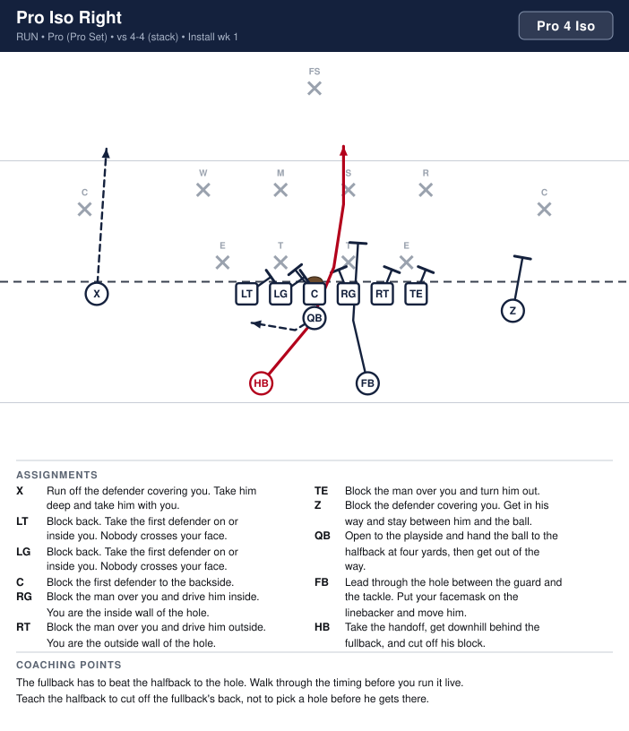
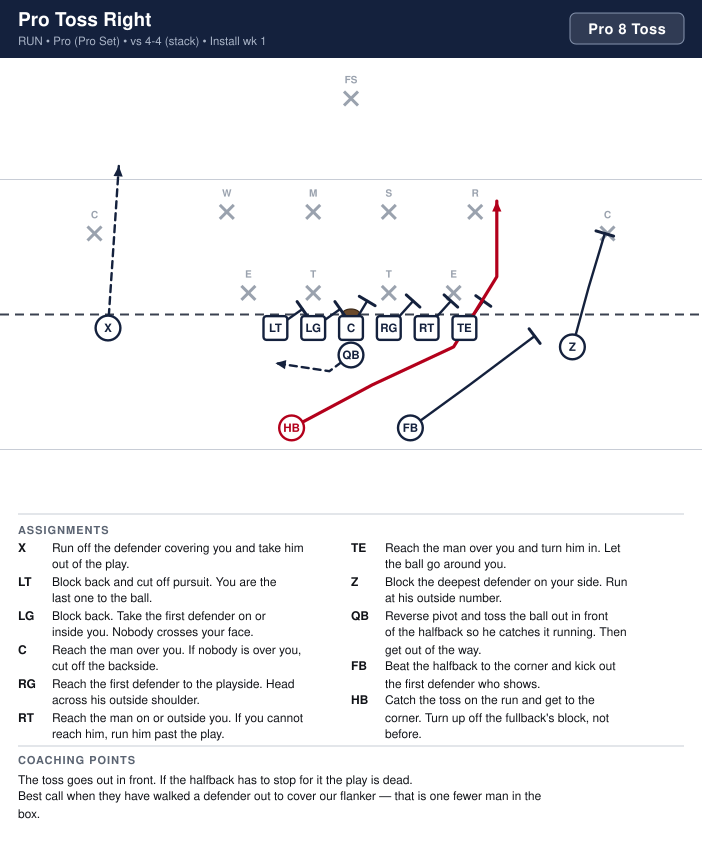
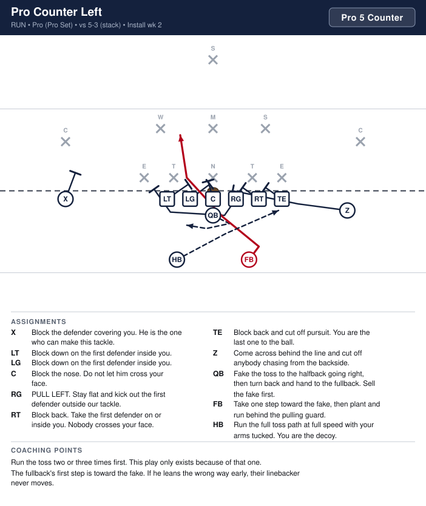
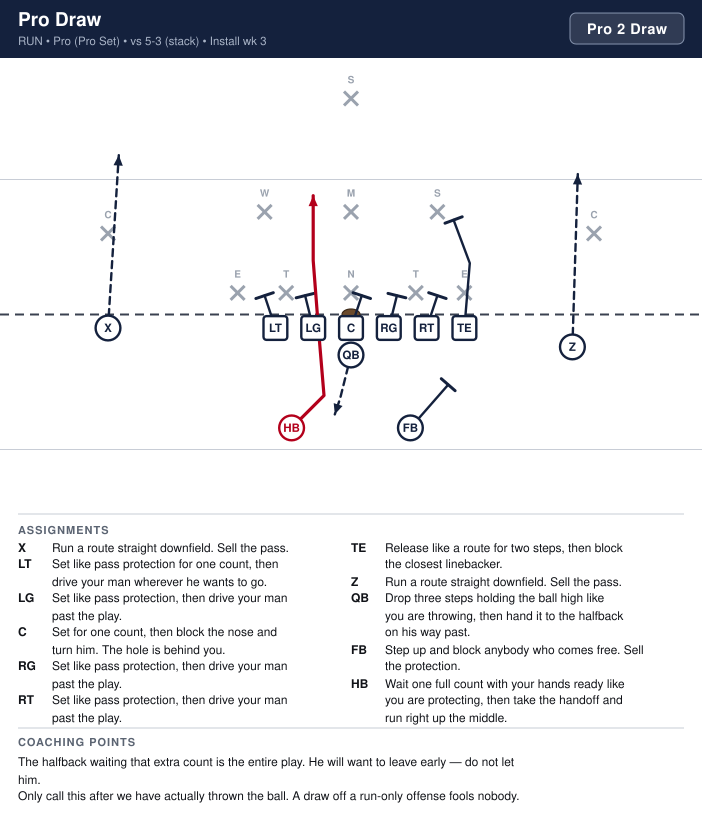
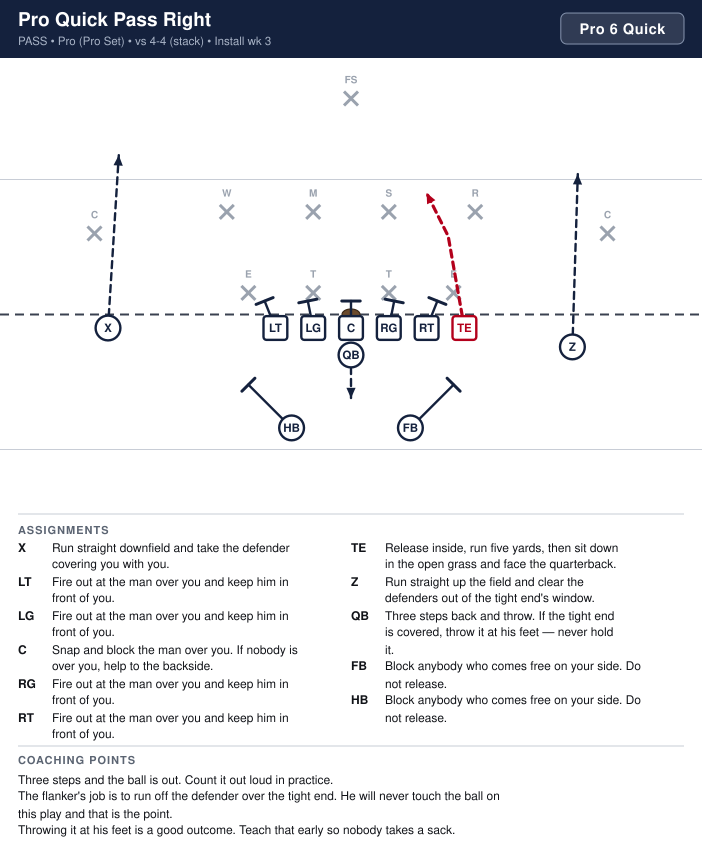
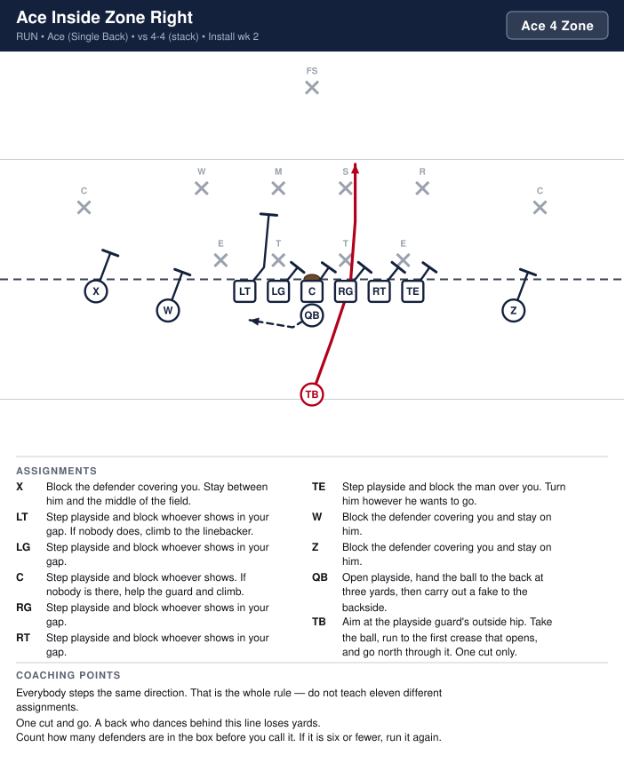
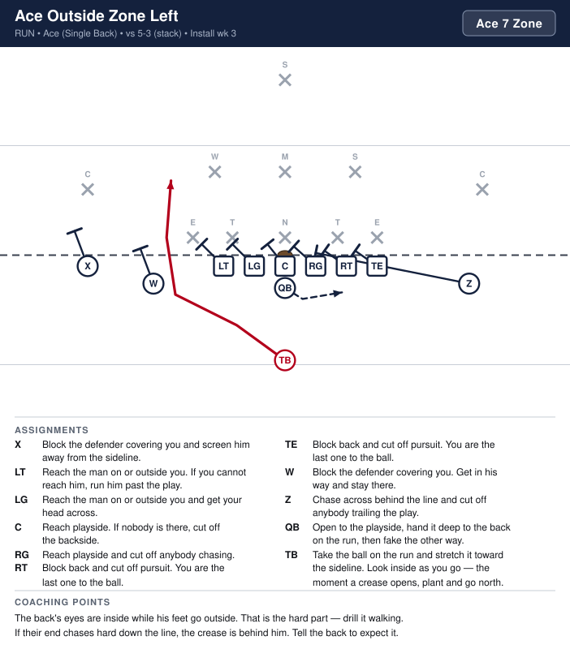
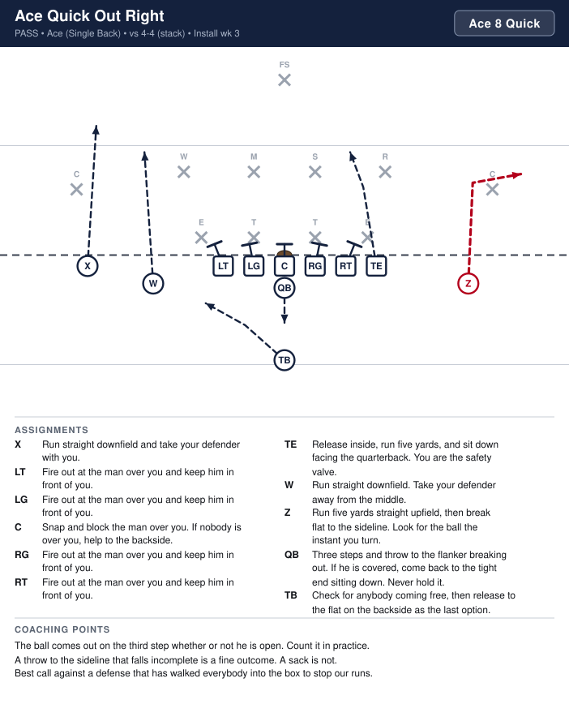

# Sayville 8U Playbook

_Generated by `generator/render.py`. Edit the JSON under `playbook/`, not this file._

Terminology and authoring rules: [playbook/CLAUDE.md](playbook/CLAUDE.md)

| # | Play | Call | Type | Formation | Ball | Install |
|---|---|---|---|---|---|---|
| 1 | [Power Left](#power-left) | `Tight 5 Power` | run | Tight | LW | Week 1 |
| 2 | [Power Right](#power-right) | `Tight 6 Power` | run | Tight | RW | Week 1 |
| 3 | [Sneak](#sneak) | `Tight 0 Sneak` | run | Tight | QB | Week 1 |
| 4 | [Wedge](#wedge) | `Tight 0 Wedge` | run | Tight | FB | Week 1 |
| 5 | [Belly Left](#belly-left) | `Tight 3 Belly` | run | Tight | FB | Week 2 |
| 6 | [Belly Right](#belly-right) | `Tight 4 Belly` | run | Tight | FB | Week 2 |
| 7 | [Trap Left](#trap-left) | `Tight 1 Trap` | run | Tight | FB | Week 2 |
| 8 | [Trap Right](#trap-right) | `Tight 2 Trap` | run | Tight | FB | Week 2 |
| 9 | [Counter Left](#counter-left) | `Tight 5 Counter` | run | Tight | FB | Week 3 |
| 10 | [Counter Right](#counter-right) | `Tight 6 Counter` | run | Tight | FB | Week 3 |
| 11 | [Jet Left](#jet-left) | `Tight 7 Jet` | run | Tight | RW | Week 3 |
| 12 | [Jet Right](#jet-right) | `Tight 8 Jet` | run | Tight | LW | Week 3 |
| 13 | [Boot Left](#boot-left) | `Tight 7 Boot` | pass | Tight | QB | Week 4 |
| 14 | [Boot Right](#boot-right) | `Tight 8 Boot` | pass | Tight | QB | Week 4 |
| 15 | [Keep Left](#keep-left) | `Tight 7 Keep` | run | Tight | QB | Week 4 |
| 16 | [Keep Right](#keep-right) | `Tight 8 Keep` | run | Tight | QB | Week 4 |
| 17 | [Power Pass Left](#power-pass-left) | `Tight 5 Power Pass` | pass | Tight | LE | Week 4 |
| 18 | [Power Pass Right](#power-pass-right) | `Tight 6 Power Pass` | pass | Tight | RE | Week 4 |
| 19 | [I Dive](#i-dive) | `I 2 Dive` | run | I | FB | Week 1 |
| 20 | [I Iso Left](#i-iso-left) | `I 3 Iso` | run | I | TB | Week 1 |
| 21 | [I Iso Right](#i-iso-right) | `I 4 Iso` | run | I | TB | Week 1 |
| 22 | [I Power Left](#i-power-left) | `I 5 Power` | run | I | TB | Week 2 |
| 23 | [I Power Right](#i-power-right) | `I 6 Power` | run | I | TB | Week 2 |
| 24 | [I Sweep Right](#i-sweep-right) | `I 8 Sweep` | run | I | TB | Week 2 |
| 25 | [I Boot Right](#i-boot-right) | `I 8 Boot` | pass | I | Z | Week 3 |
| 26 | [I Counter Left](#i-counter-left) | `I 5 Counter` | run | I | TB | Week 3 |
| 27 | [Buck Sweep Right](#buck-sweep-right) | `Wing 8 Buck` | run | Wing-T | HB | Week 1 |
| 28 | [Buck Trap](#buck-trap) | `Wing 2 Trap` | run | Wing-T | FB | Week 1 |
| 29 | [Buck Sweep Left](#buck-sweep-left) | `Wing 7 Buck` | run | Wing-T | HB | Week 2 |
| 30 | [Down Right](#down-right) | `Wing 4 Down` | run | Wing-T | WB | Week 2 |
| 31 | [Counter Left](#counter-left) | `Wing 5 Counter` | run | Wing-T | HB | Week 3 |
| 32 | [Waggle Right](#waggle-right) | `Wing 8 Waggle` | pass | Wing-T | RE | Week 3 |
| 33 | [Pro Iso Right](#pro-iso-right) | `Pro 4 Iso` | run | Pro | HB | Week 1 |
| 34 | [Pro Toss Right](#pro-toss-right) | `Pro 8 Toss` | run | Pro | HB | Week 1 |
| 35 | [Pro Counter Left](#pro-counter-left) | `Pro 5 Counter` | run | Pro | FB | Week 2 |
| 36 | [Pro Draw](#pro-draw) | `Pro 2 Draw` | run | Pro | HB | Week 3 |
| 37 | [Pro Quick Pass Right](#pro-quick-pass-right) | `Pro 6 Quick` | pass | Pro | TE | Week 3 |
| 38 | [Bone Dive](#bone-dive) | `Bone 2 Dive` | run | Wishbone | FB | Week 1 |
| 39 | [Bone Power Left](#bone-power-left) | `Bone 5 Power` | run | Wishbone | LH | Week 1 |
| 40 | [Bone Power Right](#bone-power-right) | `Bone 6 Power` | run | Wishbone | RH | Week 1 |
| 41 | [Bone Pitch Left](#bone-pitch-left) | `Bone 7 Pitch` | run | Wishbone | LH | Week 2 |
| 42 | [Bone Pitch Right](#bone-pitch-right) | `Bone 8 Pitch` | run | Wishbone | RH | Week 2 |
| 43 | [Bone Counter Left](#bone-counter-left) | `Bone 5 Counter` | run | Wishbone | RH | Week 3 |
| 44 | [Bone Counter Right](#bone-counter-right) | `Bone 6 Counter` | run | Wishbone | LH | Week 3 |
| 45 | [Ace Inside Zone Right](#ace-inside-zone-right) | `Ace 4 Zone` | run | Ace | TB | Week 2 |
| 46 | [Ace Outside Zone Left](#ace-outside-zone-left) | `Ace 7 Zone` | run | Ace | TB | Week 3 |
| 47 | [Ace Quick Out Right](#ace-quick-out-right) | `Ace 8 Quick` | pass | Ace | Z | Week 3 |

# Tight (Double Wing)

---

## Power Left

**Call it:** `Tight 5 Power`

Our bread and butter. Everyone on the playside blocks down, the fullback kicks out the end man, the backside guard pulls and wraps up through the hole, and the playside wing takes the toss and runs off their tails. If we only ever ran this play and the wedge we would win games.

| Position | Assignment |
|---|---|
| **LE** | Block down on the first defender inside you. The man outside you is not yours — the fullback has him. |
| **LT** | Block down on the first defender inside you. Do not let him cross your face. |
| **LG** | Block the man over you. If nobody is over you, help the center and climb to the linebacker. |
| **C** | Block back on the backside gap. If nobody shows, get on the backside linebacker. |
| **RG** | PULL LEFT. Open with your playside foot, run flat behind the line, and turn up outside the end. Block the first wrong-colored jersey you see. |
| **RT** | Block back. Take the first defender on or inside you. Nobody crosses your face. |
| **RE** | Block back. Take the first defender on or inside you and cut off pursuit. |
| **LW** **(ball)** | Take the toss on the move. Get outside the fullback's block, then turn up. Do not bounce it any wider than that. |
| **RW** | Sprint flat behind the quarterback and sell the sweep to the backside. You are the reason their backside linebacker stays home. |
| **QB** | Reverse pivot and toss the ball out in front of the playside wing so he catches it running. Then carry out the bootleg fake away from the play. |
| **FB** | Kick out the first defender outside our end. Aim at his inside hip and run through him — do not stop your feet. |

**Coaching points**

- The toss is out in front, not at the wing's chest. He should never have to stop or reach back for it.
- Down blocks first. If the playside end and tackle do not seal inside, the pullers have nowhere to go.
- The fullback's kick-out is the whole play. Drill it every practice against a stand-up dummy.
- Teach the wing one rule: get to the outside hip of the kick-out block and turn north. Bouncing it wide is how this play loses yards.
- The backside wing's fake matters. If he jogs, their linebacker chases the ball and the wrap block never arrives in time.

---

## Power Right

**Call it:** `Tight 6 Power`

Our bread and butter. Everyone on the playside blocks down, the fullback kicks out the end man, the backside guard pulls and wraps up through the hole, and the playside wing takes the toss and runs off their tails. If we only ever ran this play and the wedge we would win games.

| Position | Assignment |
|---|---|
| **LE** | Block back. Take the first defender on or inside you and cut off pursuit. |
| **LT** | Block back. Take the first defender on or inside you. Nobody crosses your face. |
| **LG** | PULL RIGHT. Open with your playside foot, run flat behind the line, and turn up outside the end. Block the first wrong-colored jersey you see. |
| **C** | Block back on the backside gap. If nobody shows, get on the backside linebacker. |
| **RG** | Block the man over you. If nobody is over you, help the center and climb to the linebacker. |
| **RT** | Block down on the first defender inside you. Do not let him cross your face. |
| **RE** | Block down on the first defender inside you. The man outside you is not yours — the fullback has him. |
| **LW** | Sprint flat behind the quarterback and sell the sweep to the backside. You are the reason their backside linebacker stays home. |
| **RW** **(ball)** | Take the toss on the move. Get outside the fullback's block, then turn up. Do not bounce it any wider than that. |
| **QB** | Reverse pivot and toss the ball out in front of the playside wing so he catches it running. Then carry out the bootleg fake away from the play. |
| **FB** | Kick out the first defender outside our end. Aim at his inside hip and run through him — do not stop your feet. |

**Coaching points**

- The toss is out in front, not at the wing's chest. He should never have to stop or reach back for it.
- Down blocks first. If the playside end and tackle do not seal inside, the pullers have nowhere to go.
- The fullback's kick-out is the whole play. Drill it every practice against a stand-up dummy.
- Teach the wing one rule: get to the outside hip of the kick-out block and turn north. Bouncing it wide is how this play loses yards.
- The backside wing's fake matters. If he jogs, their linebacker chases the ball and the wrap block never arrives in time.

---

## Sneak

**Call it:** `Tight 0 Sneak`

Fourth and inches. No handoff, no backfield action, nothing to mess up — the quarterback keeps it and falls forward behind the center. The whole play is the snap count.

| Position | Assignment |
|---|---|
| **LE** | Fire out into the man over you and drive him off the ball. If nobody is over you, close down inside. |
| **LT** | Fire out into the man over you and drive him off the ball. |
| **LG** | Fire out low into the man over you. Do not give one inch of ground. |
| **C** | Snap and fire out straight ahead, pads under his pads. Everything depends on you. |
| **RG** | Fire out low into the man over you. Do not give one inch of ground. |
| **RT** | Fire out into the man over you and drive him off the ball. |
| **RE** | Fire out into the man over you and drive him off the ball. If nobody is over you, close down inside. |
| **LW** | Step up behind the end and push the pile. Do not go around. |
| **RW** | Step up behind the end and push the pile. Do not go around. |
| **QB** **(ball)** | Snap count only. Get under the center, keep the ball, and drive forward behind him. Do not stand up and do not bounce it outside. |
| **FB** | Lead straight up the middle and push the quarterback forward. You are the second wave. |

**Coaching points**

- Vary the snap count all game so this one is not a surprise when you need it.
- The quarterback stays low. Standing up turns a first down into a one-yard loss.
- Never bounce this outside. If it is stuffed, it is stuffed — take the pile forward.
- Run it on second and one occasionally so it is not obvious on fourth and one.

---

## Wedge

**Call it:** `Tight 0 Wedge`

The first play we install and the play we run when we need two yards. Every blocker takes the same man — whoever is over the center — and the whole line moves as one body. There is no hole to find and no read to make.

| Position | Assignment |
|---|---|
| **LE** | Close down to the tackle's hip, shoulder to shoulder. No daylight between you. |
| **LT** | Close down to the guard's hip, shoulder to shoulder. |
| **LG** | Close down to the center's hip, shoulder to shoulder. Get a hand on the center's back and stay attached. |
| **C** | Snap it, then fire out low into whoever is closest. You are the point of the wedge — stay low and keep your feet moving. |
| **RG** | Close down to the center's hip, shoulder to shoulder. Get a hand on the center's back and stay attached. |
| **RT** | Close down to the guard's hip, shoulder to shoulder. |
| **RE** | Close down to the tackle's hip, shoulder to shoulder. No daylight between you. |
| **LW** | Step to the end's hip and push the back of the wedge. Never run around it. |
| **RW** | Step to the end's hip and push the back of the wedge. Never run around it. |
| **QB** | Take the snap, turn and hand the ball to the fullback at two yards, then get on the back of the wedge and push. |
| **FB** **(ball)** | Two hands out, take the handoff and put your shoulder into the middle of the wedge. Keep your feet moving until the whistle. |

**Coaching points**

- The wedge only works if there are no gaps in it. Practice it standing still first, hip to hip, before anyone runs.
- The fullback does not pick a hole. He runs into the back of the wedge and lets it move him.
- If the wedge stops moving, the play is over. Teach the linemen to keep churning their feet after contact.
- This is our short-yardage and goal-line play. Do not save it for emergencies — run it early so they have to respect it.

---

## Belly Left

**Call it:** `Tight 3 Belly`

The fast-hitting complement to power. Nobody pulls, nobody kicks out — the line just blocks the man in front of them and the fullback is through the hole before the linebackers can flow. Use it when they start over-pursuing the power.

| Position | Assignment |
|---|---|
| **LE** | Block the man over you or the first defender outside, and drive him out. Widen the hole. |
| **LT** | Block the man over you and turn him to the inside. The hole is left off your outside hip. |
| **LG** | Help the center for one count, then climb to the middle linebacker. |
| **C** | Block the man over you. Get your head across to the playside. |
| **RG** | Block the first defender on or inside you. Nobody crosses your face. |
| **RT** | Block back. Take the first defender on or inside you. |
| **RE** | Block back and cut off pursuit. |
| **LW** | Step down inside and seal the playside linebacker. Take the first jersey that shows. |
| **RW** | Sprint flat behind the line and sell the sweep to the backside. |
| **QB** | Open to the playside, ride the fullback one step and hand it off at two yards. Then keep running wide like you have it. |
| **FB** **(ball)** | Aim at the outside hip of the playside tackle. Take the ball and get north — this is a downhill run, not a read. |

**Coaching points**

- This play beats you to the spot. The fullback should hit the line before the pulling guard on power would have even cleared the center.
- No pullers means no waiting. If the fullback hesitates, run power instead.
- The quarterback's fake going wide is what holds the outside defender. Make him finish it every rep.
- Good change-up after two or three powers in a row — same backfield look for the first half second.

---

## Belly Right

**Call it:** `Tight 4 Belly`

The fast-hitting complement to power. Nobody pulls, nobody kicks out — the line just blocks the man in front of them and the fullback is through the hole before the linebackers can flow. Use it when they start over-pursuing the power.

| Position | Assignment |
|---|---|
| **LE** | Block back and cut off pursuit. |
| **LT** | Block back. Take the first defender on or inside you. |
| **LG** | Block the first defender on or inside you. Nobody crosses your face. |
| **C** | Block the man over you. Get your head across to the playside. |
| **RG** | Help the center for one count, then climb to the middle linebacker. |
| **RT** | Block the man over you and turn him to the inside. The hole is right off your outside hip. |
| **RE** | Block the man over you or the first defender outside, and drive him out. Widen the hole. |
| **LW** | Sprint flat behind the line and sell the sweep to the backside. |
| **RW** | Step down inside and seal the playside linebacker. Take the first jersey that shows. |
| **QB** | Open to the playside, ride the fullback one step and hand it off at two yards. Then keep running wide like you have it. |
| **FB** **(ball)** | Aim at the outside hip of the playside tackle. Take the ball and get north — this is a downhill run, not a read. |

**Coaching points**

- This play beats you to the spot. The fullback should hit the line before the pulling guard on power would have even cleared the center.
- No pullers means no waiting. If the fullback hesitates, run power instead.
- The quarterback's fake going wide is what holds the outside defender. Make him finish it every rep.
- Good change-up after two or three powers in a row — same backfield look for the first half second.

---

## Trap Left

**Call it:** `Tight 1 Trap`

The answer when their inside linemen start firing upfield to beat our down blocks. We leave one of them completely unblocked, let him run himself out of the play, and the backside guard pulls across and knocks him out of the hole. The fullback runs inside of that block.

| Position | Assignment |
|---|---|
| **LE** | Block down on the first defender inside you. |
| **LT** | Block down on the first defender inside you. |
| **LG** | Do not touch the man over you — he is the one we are trapping. Step around him and go get the linebacker. |
| **C** | Block back on the first defender to the backside. If nobody shows, climb to the backside linebacker. |
| **RG** | PULL LEFT. Stay flat and tight to the line. Trap the first defender past the center — kick him out with your playside shoulder. |
| **RT** | Block back. Take the first defender on or inside you. |
| **RE** | Block back and cut off pursuit. Nobody chases this from behind. |
| **LW** | Release outside and block the deepest defender on your side. Run left at his outside number. |
| **RW** | Sprint flat behind the line and sell the sweep to the backside. |
| **QB** | Open to the playside and hand the ball to the fullback at two yards. Keep the fake going wide — do not stand and watch. |
| **FB** **(ball)** | Aim just outside the center. Take the handoff, stay tight, and run inside the trap block. Get downhill — do not dance. |

**Coaching points**

- The trapped defender must be right completely alone. If our guard even brushes him he will not run upfield, and the trap block misses.
- The pulling guard stays flat and low. If he bellies back he arrives late and the fullback runs into his back.
- Call this when their inside linemen are getting up the field fast. If they sit and read, run power instead.
- The fullback goes inside the trap block, never outside it. Walk him through it at half speed until it is automatic.

---

## Trap Right

**Call it:** `Tight 2 Trap`

The answer when their inside linemen start firing upfield to beat our down blocks. We leave one of them completely unblocked, let him run himself out of the play, and the backside guard pulls across and knocks him out of the hole. The fullback runs inside of that block.

| Position | Assignment |
|---|---|
| **LE** | Block back and cut off pursuit. Nobody chases this from behind. |
| **LT** | Block back. Take the first defender on or inside you. |
| **LG** | PULL RIGHT. Stay flat and tight to the line. Trap the first defender past the center — kick him out with your playside shoulder. |
| **C** | Block back on the first defender to the backside. If nobody shows, climb to the backside linebacker. |
| **RG** | Do not touch the man over you — he is the one we are trapping. Step around him and go get the linebacker. |
| **RT** | Block down on the first defender inside you. |
| **RE** | Block down on the first defender inside you. |
| **LW** | Sprint flat behind the line and sell the sweep to the backside. |
| **RW** | Release outside and block the deepest defender on your side. Run right at his outside number. |
| **QB** | Open to the playside and hand the ball to the fullback at two yards. Keep the fake going wide — do not stand and watch. |
| **FB** **(ball)** | Aim just outside the center. Take the handoff, stay tight, and run inside the trap block. Get downhill — do not dance. |

**Coaching points**

- The trapped defender must be left completely alone. If our guard even brushes him he will not run upfield, and the trap block misses.
- The pulling guard stays flat and low. If he bellies back he arrives late and the fullback runs into his back.
- Call this when their inside linemen are getting up the field fast. If they sit and read, run power instead.
- The fullback goes inside the trap block, never outside it. Walk him through it at half speed until it is automatic.

---

## Counter Left

**Call it:** `Tight 5 Counter`

Misdirection off the sweep. We show them the sweep going one way, their linebackers chase it, and the fullback plants and comes back the other way behind a pulling guard. This play only works after we have run the sweep enough times that they believe it.

| Position | Assignment |
|---|---|
| **LE** | Block down on the first defender inside you. The man outside you is being kicked out. |
| **LT** | Block down on the first defender inside you. |
| **LG** | PULL LEFT. Stay flat behind the line and kick out the first defender outside our playside end. |
| **C** | Block the nose. Do not let him cross your face to the playside. |
| **RG** | Block back on the first defender to the backside. Nobody crosses your face. |
| **RT** | Block back. Take the first defender on or inside you. |
| **RE** | Block back and cut off pursuit. |
| **LW** | Step down inside and block the playside linebacker. Take the first jersey that shows. |
| **RW** | Run the sweep path the other way at full speed with your arms tucked like you have the ball. Sell it all the way to the sideline. |
| **QB** | Take the snap, fake the toss the other way with both hands, then turn back and hand the ball to the fullback. Sell the fake first — the handoff is late on purpose. |
| **FB** **(ball)** | Take one hard step with the fake, then plant and run to daylight off the playside end's outside hip. That first step is what freezes the linebackers. |

**Coaching points**

- Do not call this in the first quarter. It needs the sweep on film first — run jet or power three or four times, then counter.
- The fullback's counter step has to be a real step, not a shuffle. If he cheats it, the linebackers never bite.
- The wing running the fake must go all the way. Coaches see the ball; kids see the fastest player. So do linebackers.
- If their linebackers stop chasing the sweep, stop calling the counter and go back to power.

---

## Counter Right

**Call it:** `Tight 6 Counter`

Misdirection off the sweep. We show them the sweep going one way, their linebackers chase it, and the fullback plants and comes back the other way behind a pulling guard. This play only works after we have run the sweep enough times that they believe it.

| Position | Assignment |
|---|---|
| **LE** | Block back and cut off pursuit. |
| **LT** | Block back. Take the first defender on or inside you. |
| **LG** | Block back on the first defender to the backside. Nobody crosses your face. |
| **C** | Block the nose. Do not let him cross your face to the playside. |
| **RG** | PULL RIGHT. Stay flat behind the line and kick out the first defender outside our playside end. |
| **RT** | Block down on the first defender inside you. |
| **RE** | Block down on the first defender inside you. The man outside you is being kicked out. |
| **LW** | Run the sweep path the other way at full speed with your arms tucked like you have the ball. Sell it all the way to the sideline. |
| **RW** | Step down inside and block the playside linebacker. Take the first jersey that shows. |
| **QB** | Take the snap, fake the toss the other way with both hands, then turn back and hand the ball to the fullback. Sell the fake first — the handoff is late on purpose. |
| **FB** **(ball)** | Take one hard step with the fake, then plant and run to daylight off the playside end's outside hip. That first step is what freezes the linebackers. |

**Coaching points**

- Do not call this in the first quarter. It needs the sweep on film first — run jet or power three or four times, then counter.
- The fullback's counter step has to be a real step, not a shuffle. If he cheats it, the linebackers never bite.
- The wing running the fake must go all the way. Coaches see the ball; kids see the fastest player. So do linebackers.
- If their linebackers stop chasing the sweep, stop calling the counter and go back to power.

---

## Jet Left

**Call it:** `Tight 7 Jet`

Full-speed motion sweep. The backside wing is already moving at the snap, takes the ball on the run, and tries to beat everyone to the corner. This is our fastest play and the one that makes their defense widen out — which is what makes the wedge and the trap work.

| Position | Assignment |
|---|---|
| **LE** | Reach the man over you. If you cannot reach him, turn him inside and let the ball go around. |
| **LT** | Reach block the man on or outside you. If you cannot reach him, run him past the play and wall him off. |
| **LG** | Reach the first defender to the playside. Get your head across his outside shoulder. |
| **C** | Reach the man over you. If nobody is over you, cut off the backside gap. |
| **RG** | Block back and cut off the first defender to the backside. |
| **RT** | Block back. Take the first defender on or inside you. |
| **RE** | Block back, then chase down the line. You are the last one to the ball — never quit on this play. |
| **LW** | Block the deepest defender on your side. Run left at his outside number and screen him from the ball. |
| **RW** **(ball)** | Start in full-speed motion on the coach's signal. Take the handoff on the run without slowing down and get to the corner. If it is not there, turn up — never stop your feet. |
| **QB** | Take the snap and put the ball in the wing's belly as he crosses. Do not reach for him — let him come to you. Then boot away and sell it. |
| **FB** | Attack the first defender outside the playside end and kick him out. Get there fast — the ball is coming left now. |

**Coaching points**

- Motion timing is the whole play. The wing should be at full speed and just past the quarterback when the ball is snapped — practice the timing separately from the blocking.
- The quarterback never reaches out. He holds the ball still and the wing runs through it.
- If the wing slows down to take the handoff, this play is dead. Better to have a fumble in practice than a jog.
- Watch your league's motion rules — only one player in motion and he must be moving parallel to the line, not forward.

---

## Jet Right

**Call it:** `Tight 8 Jet`

Full-speed motion sweep. The backside wing is already moving at the snap, takes the ball on the run, and tries to beat everyone to the corner. This is our fastest play and the one that makes their defense widen out — which is what makes the wedge and the trap work.

| Position | Assignment |
|---|---|
| **LE** | Block back, then chase down the line. You are the last one to the ball — never quit on this play. |
| **LT** | Block back. Take the first defender on or inside you. |
| **LG** | Block back and cut off the first defender to the backside. |
| **C** | Reach the man over you. If nobody is over you, cut off the backside gap. |
| **RG** | Reach the first defender to the playside. Get your head across his outside shoulder. |
| **RT** | Reach block the man on or outside you. If you cannot reach him, run him past the play and wall him off. |
| **RE** | Reach the man over you. If you cannot reach him, turn him inside and let the ball go around. |
| **LW** **(ball)** | Start in full-speed motion on the coach's signal. Take the handoff on the run without slowing down and get to the corner. If it is not there, turn up — never stop your feet. |
| **RW** | Block the deepest defender on your side. Run right at his outside number and screen him from the ball. |
| **QB** | Take the snap and put the ball in the wing's belly as he crosses. Do not reach for him — let him come to you. Then boot away and sell it. |
| **FB** | Attack the first defender outside the playside end and kick him out. Get there fast — the ball is coming right now. |

**Coaching points**

- Motion timing is the whole play. The wing should be at full speed and just past the quarterback when the ball is snapped — practice the timing separately from the blocking.
- The quarterback never reaches out. He holds the ball still and the wing runs through it.
- If the wing slows down to take the handoff, this play is dead. Better to have a fumble in practice than a jog.
- Watch your league's motion rules — only one player in motion and he must be moving parallel to the line, not forward.

---

## Boot Left

**Call it:** `Tight 7 Boot`

Naked bootleg. The whole backfield runs the sweep away and the quarterback keeps it and comes out the back door alone, with two receivers on his side. Run first, throw second — it is a quarterback run with an escape hatch.

| Position | Assignment |
|---|---|
| **LE** | Release across and settle at eight yards on the boot side. Find the open grass and show your hands. |
| **LT** | Hinge and protect the boot side. Nobody comes free outside you — the quarterback is alone back there. |
| **LG** | PULL RIGHT and run the power path to sell the fake. You are a decoy — take their linebacker with you. |
| **C** | Block back toward the boot side. Nobody chases through the middle. |
| **RG** | Block the man over you and drive him away from the boot. |
| **RT** | Block down on the first defender inside you. |
| **RE** | Block down on the first defender inside you and sell the run. This has to look exactly like the sweep. |
| **LW** | Get to the flat at four yards on the boot side and stay in front of the quarterback. You are the easy throw. |
| **RW** | Take the fake and run the full sweep path away from the boot at full speed. Arms tucked like you have the ball. |
| **QB** **(ball)** | Fake the sweep with both hands, hide the ball on your back hip, and get to the edge. Run it if it is open. Only throw if a defender comes up to take you. |
| **FB** | Run the kick-out path away from the boot and block whatever shows. Sell the sweep. |

**Coaching points**

- Run first. At this age the quarterback will usually walk into ten yards before anybody finds him — teach him to look for grass, not for a receiver.
- The ball goes on the back hip, away from the defense. Kids want to carry it out front where everyone can see it.
- If the backside end does not block down and sell it, their end sees the quarterback immediately and this play loses eight yards.
- One throw, then tuck it. No scrambling backwards, ever.

---

## Boot Right

**Call it:** `Tight 8 Boot`

Naked bootleg. The whole backfield runs the sweep away and the quarterback keeps it and comes out the back door alone, with two receivers on his side. Run first, throw second — it is a quarterback run with an escape hatch.

| Position | Assignment |
|---|---|
| **LE** | Block down on the first defender inside you and sell the run. This has to look exactly like the sweep. |
| **LT** | Block down on the first defender inside you. |
| **LG** | Block the man over you and drive him away from the boot. |
| **C** | Block back toward the boot side. Nobody chases through the middle. |
| **RG** | PULL LEFT and run the power path to sell the fake. You are a decoy — take their linebacker with you. |
| **RT** | Hinge and protect the boot side. Nobody comes free outside you — the quarterback is alone back there. |
| **RE** | Release across and settle at eight yards on the boot side. Find the open grass and show your hands. |
| **LW** | Take the fake and run the full sweep path away from the boot at full speed. Arms tucked like you have the ball. |
| **RW** | Get to the flat at four yards on the boot side and stay in front of the quarterback. You are the easy throw. |
| **QB** **(ball)** | Fake the sweep with both hands, hide the ball on your back hip, and get to the edge. Run it if it is open. Only throw if a defender comes up to take you. |
| **FB** | Run the kick-out path away from the boot and block whatever shows. Sell the sweep. |

**Coaching points**

- Run first. At this age the quarterback will usually walk into ten yards before anybody finds him — teach him to look for grass, not for a receiver.
- The ball goes on the back hip, away from the defense. Kids want to carry it out front where everyone can see it.
- If the backside end does not block down and sell it, their end sees the quarterback immediately and this play loses eight yards.
- One throw, then tuck it. No scrambling backwards, ever.

---

## Keep Left

**Call it:** `Tight 7 Keep`

Power blocking, but the quarterback fakes the toss and keeps it around the edge. When their outside defender starts crashing hard on the wing, this is the play that makes him pay.

| Position | Assignment |
|---|---|
| **LE** | Block down on the first defender inside you. |
| **LT** | Block down on the first defender inside you. |
| **LG** | Block the man over you. If nobody is over you, help the center and climb to the linebacker. |
| **C** | Block back on the backside gap. |
| **RG** | PULL LEFT and wrap up through the hole. Block the first wrong-colored jersey inside the kick-out. |
| **RT** | Block back. Take the first defender on or inside you. |
| **RE** | Block back and cut off pursuit. |
| **LW** | Take one hard step like you are catching the toss, then turn and block the widest defender on your side. |
| **RW** | Sprint flat behind the line and sell the sweep to the backside. |
| **QB** **(ball)** | Reverse pivot and fake the toss with both hands, then hide the ball on your hip and run wide around the end. Get to the corner before you turn up. |
| **FB** | Kick out the first defender outside our end, same as power. Nothing changes for you. |

**Coaching points**

- Everything except the quarterback and the playside wing is identical to power. That is the point — they should not be able to tell until it is too late.
- The fake has to be a real toss motion with both hands. A lazy fake and the outside defender never leaves.
- Save this one. Call it the series after their end has blown up two powers in a row.
- The quarterback gets down or out of bounds. We are not trading our quarterback for four yards.

---

## Keep Right

**Call it:** `Tight 8 Keep`

Power blocking, but the quarterback fakes the toss and keeps it around the edge. When their outside defender starts crashing hard on the wing, this is the play that makes him pay.

| Position | Assignment |
|---|---|
| **LE** | Block back and cut off pursuit. |
| **LT** | Block back. Take the first defender on or inside you. |
| **LG** | PULL RIGHT and wrap up through the hole. Block the first wrong-colored jersey inside the kick-out. |
| **C** | Block back on the backside gap. |
| **RG** | Block the man over you. If nobody is over you, help the center and climb to the linebacker. |
| **RT** | Block down on the first defender inside you. |
| **RE** | Block down on the first defender inside you. |
| **LW** | Sprint flat behind the line and sell the sweep to the backside. |
| **RW** | Take one hard step like you are catching the toss, then turn and block the widest defender on your side. |
| **QB** **(ball)** | Reverse pivot and fake the toss with both hands, then hide the ball on your hip and run wide around the end. Get to the corner before you turn up. |
| **FB** | Kick out the first defender outside our end, same as power. Nothing changes for you. |

**Coaching points**

- Everything except the quarterback and the playside wing is identical to power. That is the point — they should not be able to tell until it is too late.
- The fake has to be a real toss motion with both hands. A lazy fake and the outside defender never leaves.
- Save this one. Call it the series after their end has blown up two powers in a row.
- The quarterback gets down or out of bounds. We are not trading our quarterback for four yards.

---

## Power Pass Left

**Call it:** `Tight 5 Power Pass`

One throw off the power fake. The playside end runs a corner behind a defense that has stopped covering anybody, and the playside wing is the safe throw in the flat. Two receivers, two reads, and if neither is open the quarterback tucks it and runs.

| Position | Assignment |
|---|---|
| **LE** **(ball)** | Release outside, run eight yards, then break for the flag. Look for the ball over your inside shoulder. |
| **LT** | Fire out at the man over you and keep him in front. Aggressive — this looks like run blocking. |
| **LG** | Fire out at the man over you and keep him in front. Aggressive — this looks like run blocking. |
| **C** | Snap and block the man over you. If nobody is over you, help to the backside. |
| **RG** | Fire out at the man over you, then keep him in front of you. |
| **RT** | Fire out at the man over you, then keep him in front of you. Do not let him cross your face. |
| **RE** | Block the first defender outside you. Nobody comes free off the backside edge. |
| **LW** | Sell the power fake for one step, then release into the flat at three yards. Turn and look for the ball left away. |
| **RW** | Cross behind the line and settle five yards deep over the middle. You are the check-down — face the quarterback and be ready. |
| **QB** | Fake the toss, then roll to the playside. Look for the corner route first, the flat second. If neither is there, tuck it and run — do not throw across your body. |
| **FB** | Run the kick-out path exactly like power and block the first defender outside our end. Do not release — you are protection. |

**Coaching points**

- This is a run play with one throw attached. If the fake is not good enough to fool the coaches on the sideline, it will not fool the safety.
- The linemen block this like a run — fire out low. At this age nobody calls holding on a pass that looks like power.
- Only two reads and then run. Never let the quarterback stand there hunting for a third option.
- Best call on first down after a long power run, not on third and eight.

---

## Power Pass Right

**Call it:** `Tight 6 Power Pass`

One throw off the power fake. The playside end runs a corner behind a defense that has stopped covering anybody, and the playside wing is the safe throw in the flat. Two receivers, two reads, and if neither is open the quarterback tucks it and runs.

| Position | Assignment |
|---|---|
| **LE** | Block the first defender outside you. Nobody comes free off the backside edge. |
| **LT** | Fire out at the man over you, then keep him in front of you. Do not let him cross your face. |
| **LG** | Fire out at the man over you, then keep him in front of you. |
| **C** | Snap and block the man over you. If nobody is over you, help to the backside. |
| **RG** | Fire out at the man over you and keep him in front. Aggressive — this looks like run blocking. |
| **RT** | Fire out at the man over you and keep him in front. Aggressive — this looks like run blocking. |
| **RE** **(ball)** | Release outside, run eight yards, then break for the flag. Look for the ball over your inside shoulder. |
| **LW** | Cross behind the line and settle five yards deep over the middle. You are the check-down — face the quarterback and be ready. |
| **RW** | Sell the power fake for one step, then release into the flat at three yards. Turn and look for the ball right away. |
| **QB** | Fake the toss, then roll to the playside. Look for the corner route first, the flat second. If neither is there, tuck it and run — do not throw across your body. |
| **FB** | Run the kick-out path exactly like power and block the first defender outside our end. Do not release — you are protection. |

**Coaching points**

- This is a run play with one throw attached. If the fake is not good enough to fool the coaches on the sideline, it will not fool the safety.
- The linemen block this like a run — fire out low. At this age nobody calls holding on a pass that looks like power.
- Only two reads and then run. Never let the quarterback stand there hunting for a third option.
- Best call on first down after a long power run, not on third and eight.

# I (I-Formation)

---

## I Dive

**Call it:** `I 2 Dive`

The quickest handoff in the book. The fullback is through the line before their linebackers have read anything. We run it to remind them the middle is not free, which is what makes the sweep work later.

| Position | Assignment |
|---|---|
| **LE** | Block back and cut off pursuit. You are the last one to the ball. |
| **LT** | Block back. Take the first defender on or inside you. Nobody crosses your face. |
| **LG** | Block back. Take the first defender on or inside you. Nobody crosses your face. |
| **C** | Block the man over you. If nobody is over you, help the playside guard and climb to the middle linebacker. |
| **RG** | Block the man over you and turn him out. The hole is off your inside hip. |
| **RT** | Block the man over you. Do not let him slide inside. |
| **RE** | Block the first defender on or inside you. |
| **Z** | Release and screen the deepest defender on your side. Get in his way and stay there. |
| **QB** | Take the snap, open a quarter turn and hand to the fullback at two yards. Then carry out a fake to the outside. |
| **FB** **(ball)** | Aim at the outside hip of the center. Take the ball and get north. This is a straight-ahead run — no reading, no dancing. |
| **TB** | Run the sweep path outside and sell it. You will not get the ball on this play. |

**Coaching points**

- Snap to handoff should be under a second. If the fullback is waiting on the ball, the play is already dead.
- Best call when their linebackers start cheating wide to stop the sweep.
- The fullback runs at a spot, not at a defender. Give him the outside hip of the center and let him go.
- Good short-yardage call out of this formation, but the Wedge from Tight is still the better one.

---

## I Iso Left

**Call it:** `I 3 Iso`

The same isolation block the other way. The flanker stays where he is, so this runs away from our strength — which is exactly why it is open.

| Position | Assignment |
|---|---|
| **LE** | Block the man over you and turn him out. |
| **LT** | Block the man over you and drive him to the outside. You are the outside wall of the hole. |
| **LG** | Block the man over you and drive him to the inside. You are the inside wall of the hole. |
| **C** | Block the first defender to the backside. |
| **RG** | Block back. Take the first defender on or inside you. Nobody crosses your face. |
| **RT** | Block back. Take the first defender on or inside you. Nobody crosses your face. |
| **RE** | Block back and cut off pursuit. You are the last one to the ball. |
| **Z** | Come across behind the line and cut off anybody chasing from the backside. |
| **QB** | Reverse pivot and hand the ball to the tailback at four yards. Then clear out and fake wide. |
| **FB** | Lead through the hole between the guard and the tackle. Put your facemask on the linebacker and move him any direction — just move him. |
| **TB** **(ball)** | Take the handoff at four yards, get downhill behind the fullback, and cut off his block. |

**Coaching points**

- Running away from the flanker means one fewer blocker out there, so the tailback has to get north fast.
- Their defense will usually shade toward our flanker. That is the reason this play exists — check it before you call it.
- Same block, same read as I Iso Right. Do not teach it as a new play, teach it as the same play flipped.

---

## I Iso Right

**Call it:** `I 4 Iso`

The whole play is one block: the fullback isolates their linebacker in the hole and the tailback runs off whichever way that block goes. It teaches a back to read a block, which is the skill this formation is here to build.

| Position | Assignment |
|---|---|
| **LE** | Block back and cut off pursuit. You are the last one to the ball. |
| **LT** | Block back. Take the first defender on or inside you. Nobody crosses your face. |
| **LG** | Block back. Take the first defender on or inside you. Nobody crosses your face. |
| **C** | Block the first defender to the backside. |
| **RG** | Block the man over you and drive him to the inside. You are the inside wall of the hole. |
| **RT** | Block the man over you and drive him to the outside. You are the outside wall of the hole. |
| **RE** | Block the man over you and turn him out. |
| **Z** | Release and screen the deepest defender on your side. Get in his way and stay there. |
| **QB** | Reverse pivot and hand the ball to the tailback at four yards. Then clear out and fake wide. |
| **FB** | Lead through the hole between the guard and the tackle. Put your facemask on the linebacker and move him any direction — just move him. |
| **TB** **(ball)** | Take the handoff at four yards, get downhill behind the fullback, and cut off his block. If he takes the linebacker outside, you go inside. |

**Coaching points**

- Drill the fullback's block by itself with a bag. He does not have to win — he has to make the linebacker pick a side.
- Teach the tailback one rule: cut off the fullback's back. Do not let him decide before he gets there.
- If their linebacker is faster than our fullback, stop calling this and run I Power instead.
- The tailback should be running downhill at the hole, not sideways looking for one.

---

## I Power Left

**Call it:** `I 5 Power`

Power to the weak side. The flanker is not out there to help, so the kick-out and the wrap have to be clean — but their defense is usually leaning the other way.

| Position | Assignment |
|---|---|
| **LE** | Block down on the first defender inside you. The man outside you belongs to the fullback. |
| **LT** | Block down on the first defender inside you. |
| **LG** | Block down on the first defender inside you. |
| **C** | Block back on the backside gap. |
| **RG** | PULL LEFT. Run flat behind the line and turn up outside our end. Block the first wrong-colored jersey you see. |
| **RT** | Block back. Take the first defender on or inside you. Nobody crosses your face. |
| **RE** | Block back and cut off pursuit. You are the last one to the ball. |
| **Z** | Come across behind the line and cut off anybody chasing from the backside. |
| **QB** | Reverse pivot, hand the ball to the tailback deep, then carry out the bootleg fake away from the play. |
| **FB** | Kick out the first defender outside our end. Aim at his inside hip and run through him. |
| **TB** **(ball)** | Take the handoff, press the outside hip of our end, then turn up inside the pulling guard. |

**Coaching points**

- Check their alignment first. If they have shaded toward our flanker, this is the call.
- The flanker chases from behind. Tell him he is not decoration — he cuts off the corner who would otherwise run this down.
- Everything else is I Power Right in a mirror. Teach the pair together.

---

## I Power Right

**Call it:** `I 6 Power`

The power run out of the I. Playside blocks down, the fullback kicks out the end man, the backside guard pulls and wraps. Same picture as Tight with different personnel, which is the whole reason we carry both formations.

| Position | Assignment |
|---|---|
| **LE** | Block back and cut off pursuit. You are the last one to the ball. |
| **LT** | Block back. Take the first defender on or inside you. Nobody crosses your face. |
| **LG** | PULL RIGHT. Run flat behind the line and turn up outside our end. Block the first wrong-colored jersey you see. |
| **C** | Block back on the backside gap. |
| **RG** | Block down on the first defender inside you. |
| **RT** | Block down on the first defender inside you. |
| **RE** | Block down on the first defender inside you. The man outside you belongs to the fullback. |
| **Z** | Release and screen the deepest defender on your side. Get in his way and stay there. |
| **QB** | Reverse pivot, hand the ball to the tailback deep, then carry out the bootleg fake away from the play. |
| **FB** | Kick out the first defender outside our end. Aim at his inside hip and run through him. |
| **TB** **(ball)** | Take the handoff, press the outside hip of our end, then turn up inside the pulling guard. Be patient for one step, then go. |

**Coaching points**

- Same down-block-and-kick-out rules as Power from Tight. If the kids know one they know both — say that out loud when you install it.
- The tailback has further to travel than the wing does in Tight, so the kick-out block has to hold a beat longer. Drill it on a count.
- The pulling guard stays flat and tight to the line. Bellying back is what makes this play late.
- If the pulling guard cannot get there in time, run I Iso instead — it needs no pullers.

---

## I Sweep Right

**Call it:** `I 8 Sweep`

Get outside. The fullback and the flanker are both out in front and the tailback has room to run. This is the play that makes them widen out, which is what opens the dive and the iso.

| Position | Assignment |
|---|---|
| **LE** | Block back and cut off pursuit. You are the last one to the ball. |
| **LT** | Block back. Take the first defender on or inside you. Nobody crosses your face. |
| **LG** | Block back. Take the first defender on or inside you. Nobody crosses your face. |
| **C** | Reach the man over you. If nobody is over you, cut off the backside gap. |
| **RG** | Reach the first defender to the playside. Get your head across his outside shoulder. |
| **RT** | Reach the man on or outside you. If you cannot reach him, run him past the play. |
| **RE** | Reach the man over you and turn him in. Let the ball go around you. |
| **Z** | Block the deepest defender on your side. Run at his outside number and screen him away from the ball. |
| **QB** | Reverse pivot and hand the ball to the tailback as deep as you can. Then boot away and sell it. |
| **FB** | Get to the corner ahead of the tailback and kick out the first defender who shows. You are the lead blocker — beat him there. |
| **TB** **(ball)** | Take the handoff going full speed and get to the corner. Turn up when the fullback blocks somebody, not before. Never stop your feet. |

**Coaching points**

- The tailback is deeper here than the wing is in Tight, so he has time to get outside — but only if he is at full speed by the handoff.
- The fullback has to beat the tailback to the corner. If he is trailing, the play has no lead blocker.
- One rule for the tailback: turn up off the fullback's block. Running to the sideline is how this play loses eight yards.
- Watch our end reach-blocking. If he cannot reach their end, run I Power to that side instead.

---

## I Boot Right

**Call it:** `I 8 Boot`

Play action off the sweep look. Two receivers to the flanker side and a quarterback with the whole edge to himself. Run first, throw second.

| Position | Assignment |
|---|---|
| **LE** | Block down and sell the run. This has to look exactly like the sweep going the other way. |
| **LT** | Block down on the first defender inside you. |
| **LG** | Block the man over you and drive him away from the boot. |
| **C** | Block back toward the boot side. Nobody chases through the middle. |
| **RG** | PULL LEFT and run the sweep path to sell the fake. You are a decoy — take their linebacker with you. |
| **RT** | Hinge and protect the boot side. Nobody comes free outside you — the quarterback is alone back there. |
| **RE** | Engage their end for a count, then release and settle at eight yards on the boot side. |
| **Z** **(ball)** | Run to the flat at four yards and stay in front of the quarterback. You are the easy throw. |
| **QB** | Fake the sweep with both hands, hide the ball on your back hip, and get to the edge. Run it if it is open. Only throw if a defender comes up to take you. |
| **FB** | Run the sweep path away from the boot and block whatever shows. Sell it. |
| **TB** | Run the full sweep path away from the boot with your arms tucked like you have the ball. Sell it all the way to the sideline. |

**Coaching points**

- Our ends must engage their end before releasing — sell the run first, then get out.
- Run first. At this age the quarterback usually walks into ten yards before anyone finds him.
- No blitzing is allowed for 8- and 9-year-olds, so the quarterback has time. Teach him to be patient and look up.
- One throw, then tuck it. No scrambling backwards, ever.

---

## I Counter Left

**Call it:** `I 5 Counter`

Misdirection off the sweep. We show them the sweep to the flanker side, their linebackers chase, and the tailback plants and comes back weak behind a pulling guard.

| Position | Assignment |
|---|---|
| **LE** | Block down on the first defender inside you. The man outside you is being kicked out. |
| **LT** | Block down on the first defender inside you. |
| **LG** | Block down on the first defender inside you. |
| **C** | Block the nose. Do not let him cross your face to the playside. |
| **RG** | PULL LEFT. Stay flat behind the line and kick out the first defender outside our end. |
| **RT** | Block back. Take the first defender on or inside you. Nobody crosses your face. |
| **RE** | Block back and cut off pursuit. You are the last one to the ball. |
| **Z** | Take one hard step upfield like the sweep is coming, then come back and cut off the backside. |
| **QB** | Take the snap, fake the sweep the other way with both hands, then turn back and hand to the tailback. The fake comes first — the handoff is late on purpose. |
| **FB** | Run the sweep path to the other side at full speed and block anything that shows. You are the lie. |
| **TB** **(ball)** | Take two hard steps toward the sweep, then plant and come back behind the pulling guard. Those two steps are the entire play. |

**Coaching points**

- Do not call this until I Sweep Right has gone for real yards. Misdirection off a play they do not fear is just a slower run.
- The tailback's counter steps must be full speed and full length. A shuffle fools nobody.
- The fullback selling the sweep matters more than his block. Tell him he is the decoy and mean it.
- If their backside linebacker stops chasing the sweep, go back to I Power Left.

# Wing-T (Delaware Wing-T)

---

## Buck Sweep Right

**Call it:** `Wing 8 Buck`

The play the whole offense is built on. Both guards pull, the fullback fakes the trap into the line, and the halfback runs behind the guards around the end. Everything else in this section is a lie told off this picture.

| Position | Assignment |
|---|---|
| **LE** | Block back and cut off pursuit. You are the last one to the ball. |
| **LT** | Block back. Take the first defender on or inside you. Nobody crosses your face. |
| **LG** | PULL RIGHT. You are the first guard — turn up outside our end and kick out the first defender who shows. |
| **C** | Reach the man over you and cut off the backside. You are alone in there — get it done. |
| **RG** | PULL RIGHT. You are the second guard — run behind the first one and turn up inside his block. Take the linebacker. |
| **RT** | Block down on the first defender inside you. Nobody chases through your gap. |
| **RE** | Block down on the first defender inside you. |
| **WB** | Block the first defender outside our end and drive him wider. Open the corner. |
| **QB** | Reverse pivot, fake to the fullback with both hands, then hand the ball to the halfback going wide. Carry out the bootleg fake. |
| **FB** | Run the trap path right at the guard's gap and get tackled. You will not have the ball. That is the job. |
| **HB** **(ball)** | Take the handoff on the run, get behind both guards, and turn up off their blocks. Do not outrun them to the corner. |

**Coaching points**

- Two pulling guards is the hardest thing we ask anyone to do. Drill it with no defense until they can do it in their sleep.
- The fullback's fake has to draw a hit. If nobody tackles him, their linebackers are already chasing the halfback.
- The halfback stays behind the guards. If he beats them to the corner he has no blockers and it is a five-yard loss.

---

## Buck Trap

**Call it:** `Wing 2 Trap`

The fullback keeps the ball on the exact play he fakes on the Buck Sweep. Their linebackers have started chasing the sweep, so the middle is empty. Identical first step, opposite result.

| Position | Assignment |
|---|---|
| **LE** | Block back and cut off pursuit. You are the last one to the ball. |
| **LT** | Block back. Take the first defender on or inside you. Nobody crosses your face. |
| **LG** | PULL RIGHT. Stay flat and trap the first defender past the center — kick him out with your playside shoulder. |
| **C** | Block back on the first defender to the backside. |
| **RG** | Do not touch the man over you — he is the one we are trapping. Step around him and take the linebacker. |
| **RT** | Block down on the first defender inside you. |
| **RE** | Block down on the first defender inside you. |
| **WB** | Release outside and screen the deepest defender on your side. |
| **QB** | Reverse pivot and hand the ball to the fullback. Then keep running the sweep fake — the fake is what makes this work. |
| **FB** **(ball)** | Same first step as the Buck Sweep. Take the ball, stay tight, and run inside the trap block. Get downhill. |
| **HB** | Run the full sweep path at full speed with your arms tucked. You are the decoy. |

**Coaching points**

- Never call this before the Buck Sweep has been run. It is the counter-punch, not the opener.
- The trapped defender must be left completely alone. If our guard brushes him he will not run upfield and the trap misses.
- If their inside linemen are sitting and reading instead of charging, run the sweep instead.

---

## Buck Sweep Left

**Call it:** `Wing 7 Buck`

The same buck sweep run away from the wingback. There is one fewer blocker out there, so the guards have to be perfect — but their defense is usually leaning toward our wing.

| Position | Assignment |
|---|---|
| **LE** | Block down on the first defender inside you. |
| **LT** | Block down on the first defender inside you. |
| **LG** | PULL LEFT. You are the second guard — run behind the first one and turn up inside his block. Take the linebacker. |
| **C** | Reach the man over you and cut off the backside. |
| **RG** | PULL LEFT. You are the first guard — turn up outside our end and kick out the first defender who shows. |
| **RT** | Block back. Take the first defender on or inside you. Nobody crosses your face. |
| **RE** | Block back and cut off pursuit. You are the last one to the ball. |
| **WB** | Come across behind the line and cut off anybody chasing from the backside. You are not decoration. |
| **QB** | Reverse pivot, fake to the fullback with both hands, then hand the ball to the halfback going wide. |
| **FB** | Run the trap path into the line and get tackled. Sell it. |
| **HB** **(ball)** | Take the handoff going left, get behind both guards, and turn up off their blocks. |

**Coaching points**

- The halfback starts on this side, so he is closer to the corner than the guards are. He must slow down for one step and let them lead.
- Check their alignment. If they have shifted toward our wingback, this is the call.

---

## Down Right

**Call it:** `Wing 4 Down`

The wingback runs inside off the same backfield action. When their end starts flying upfield to beat the sweep, this hits right behind him.

| Position | Assignment |
|---|---|
| **LE** | Block back and cut off pursuit. You are the last one to the ball. |
| **LT** | Block back. Take the first defender on or inside you. Nobody crosses your face. |
| **LG** | Block back. Take the first defender on or inside you. Nobody crosses your face. |
| **C** | Block the man over you. If nobody is over you, help to the backside. |
| **RG** | Block the man over you and drive him inside. You are the inside wall. |
| **RT** | Block the man over you and drive him outside. You are the outside wall. |
| **RE** | Block down inside. Let their end run himself upfield — he is not yours. |
| **WB** **(ball)** | Step inside and take the handoff at three yards. Run through the gap between our guard and tackle. Straight ahead, no bouncing. |
| **QB** | Turn and hand the ball to the wingback coming underneath, then carry out the sweep fake the other way. |
| **FB** | Run the trap path and get hit. Same as always. |
| **HB** | Run the sweep path away and sell it. |

**Coaching points**

- This is the answer to an end who crashes upfield. Watch him for a series before you call it.
- The wingback runs north the moment he has the ball. His instinct will be to bounce outside — coach it out of him.

---

## Counter Left

**Call it:** `Wing 5 Counter`

Buck sweep action to the wing side, then the halfback plants and comes back the other way. This is the play that punishes a defense that has learned to chase our guards.

| Position | Assignment |
|---|---|
| **LE** | Block down inside. The man outside you is being kicked out. |
| **LT** | Block down on the first defender inside you. |
| **LG** | Block down on the first defender inside you. |
| **C** | Block the nose. Do not let him cross your face. |
| **RG** | PULL LEFT. Stay flat and kick out the first defender outside our end. |
| **RT** | Block back. Take the first defender on or inside you. Nobody crosses your face. |
| **RE** | Block back and cut off pursuit. You are the last one to the ball. |
| **WB** | Take one hard step upfield like the sweep is coming, then come back and cut off the backside. |
| **QB** | Fake the sweep to the wing side with both hands, then turn back and hand to the halfback. The fake comes first. |
| **FB** | Trap path into the line and get hit. |
| **HB** **(ball)** | Take two hard steps toward the sweep, then plant and come back behind the pulling guard. Those steps are the play. |

**Coaching points**

- Only worth calling once the Buck Sweep has hurt them. Misdirection off a play they do not fear is just a slow run.
- The halfback's counter steps must be full speed. A shuffle fools nobody.

---

## Waggle Right

**Call it:** `Wing 8 Waggle`

The pass off the Buck Sweep. Guards pull, fullback fakes, halfback runs the sweep — and the quarterback keeps it and comes out the back door with two receivers. In the Wing-T this is the play that scores.

| Position | Assignment |
|---|---|
| **LE** | Release across and settle at eight yards on the boot side. Find open grass. |
| **LT** | Block down on the first defender inside you. |
| **LG** | PULL RIGHT like the sweep. You are selling the run — take a linebacker with you. |
| **C** | Block back toward the boot side. Nobody chases through the middle. |
| **RG** | Hinge and protect. Nobody comes free — the quarterback is alone back there. |
| **RT** | Hinge and protect the boot side. Nobody comes free outside you. |
| **RE** **(ball)** | Engage their end for a count, then release to the flat at four yards. You are the easy throw. |
| **WB** | Release outside and run a corner route — eight yards, then break for the flag. |
| **QB** | Fake to the fullback, fake the sweep to the halfback, then hide the ball and get to the edge. Throw the flat first, the corner second, and run it if neither is there. |
| **FB** | Trap path into the line and get hit. Your fake is what freezes their linebackers. |
| **HB** | Run the full sweep path at full speed with your arms tucked. Sell it to the sideline. |

**Coaching points**

- Every fake has to be real. This play is only open because they have seen the Buck Sweep four times already.
- No blitzing is allowed at this age, so the quarterback has time. Teach him to get to the edge and look up.
- Two reads and then run. Never let him drift backwards hunting a third option.

# Pro (Pro Set)

---

## Pro Iso Right

**Call it:** `Pro 4 Iso`

The simplest two-back run there is. The fullback leads through the hole and blocks the linebacker, the halfback follows him. With two receivers spread out, there are fewer defenders in there to beat.

| Position | Assignment |
|---|---|
| **X** | Run off the defender covering you. Take him deep and take him with you. |
| **LT** | Block back. Take the first defender on or inside you. Nobody crosses your face. |
| **LG** | Block back. Take the first defender on or inside you. Nobody crosses your face. |
| **C** | Block the first defender to the backside. |
| **RG** | Block the man over you and drive him inside. You are the inside wall of the hole. |
| **RT** | Block the man over you and drive him outside. You are the outside wall of the hole. |
| **TE** | Block the man over you and turn him out. |
| **Z** | Block the defender covering you. Get in his way and stay between him and the ball. |
| **QB** | Open to the playside and hand the ball to the halfback at four yards, then get out of the way. |
| **FB** | Lead through the hole between the guard and the tackle. Put your facemask on the linebacker and move him. |
| **HB** **(ball)** | Take the handoff, get downhill behind the fullback, and cut off his block. |

**Coaching points**

- The fullback has to beat the halfback to the hole. Walk through the timing before you run it live.
- Teach the halfback to cut off the fullback's back, not to pick a hole before he gets there.

---

## Pro Toss Right

**Call it:** `Pro 8 Toss`

Get the ball outside fast with the tight end and flanker already out there to block. Against a defense that has widened to cover our receivers this is a foot race we can win.

| Position | Assignment |
|---|---|
| **X** | Run off the defender covering you and take him out of the play. |
| **LT** | Block back and cut off pursuit. You are the last one to the ball. |
| **LG** | Block back. Take the first defender on or inside you. Nobody crosses your face. |
| **C** | Reach the man over you. If nobody is over you, cut off the backside. |
| **RG** | Reach the first defender to the playside. Head across his outside shoulder. |
| **RT** | Reach the man on or outside you. If you cannot reach him, run him past the play. |
| **TE** | Reach the man over you and turn him in. Let the ball go around you. |
| **Z** | Block the deepest defender on your side. Run at his outside number. |
| **QB** | Reverse pivot and toss the ball out in front of the halfback so he catches it running. Then get out of the way. |
| **FB** | Beat the halfback to the corner and kick out the first defender who shows. |
| **HB** **(ball)** | Catch the toss on the run and get to the corner. Turn up off the fullback's block, not before. |

**Coaching points**

- The toss goes out in front. If the halfback has to stop for it the play is dead.
- Best call when they have walked a defender out to cover our flanker — that is one fewer man in the box.

---

## Pro Counter Left

**Call it:** `Pro 5 Counter`

Show them the toss to the tight end side, then hand it the other way to the fullback behind a pulling guard.

| Position | Assignment |
|---|---|
| **X** | Block the defender covering you. He is the one who can make this tackle. |
| **LT** | Block down on the first defender inside you. |
| **LG** | Block down on the first defender inside you. |
| **C** | Block the nose. Do not let him cross your face. |
| **RG** | PULL LEFT. Stay flat and kick out the first defender outside our tackle. |
| **RT** | Block back. Take the first defender on or inside you. Nobody crosses your face. |
| **TE** | Block back and cut off pursuit. You are the last one to the ball. |
| **Z** | Come across behind the line and cut off anybody chasing from the backside. |
| **QB** | Fake the toss to the halfback going right, then turn back and hand to the fullback. Sell the fake first. |
| **FB** **(ball)** | Take one step toward the fake, then plant and run behind the pulling guard. |
| **HB** | Run the full toss path at full speed with your arms tucked. You are the decoy. |

**Coaching points**

- Run the toss two or three times first. This play only exists because of that one.
- The fullback's first step is toward the fake. If he leans the wrong way early, their linebacker never moves.

---

## Pro Draw

**Call it:** `Pro 2 Draw`

Show them a pass, let their linemen run upfield, then hand it up the middle. Best on an obvious passing down after we have actually thrown it a few times.

| Position | Assignment |
|---|---|
| **X** | Run a route straight downfield. Sell the pass. |
| **LT** | Set like pass protection for one count, then drive your man wherever he wants to go. |
| **LG** | Set like pass protection, then drive your man past the play. |
| **C** | Set for one count, then block the nose and turn him. The hole is behind you. |
| **RG** | Set like pass protection, then drive your man past the play. |
| **RT** | Set like pass protection, then drive your man past the play. |
| **TE** | Release like a route for two steps, then block the closest linebacker. |
| **Z** | Run a route straight downfield. Sell the pass. |
| **QB** | Drop three steps holding the ball high like you are throwing, then hand it to the halfback on his way past. |
| **FB** | Step up and block anybody who comes free. Sell the protection. |
| **HB** **(ball)** | Wait one full count with your hands ready like you are protecting, then take the handoff and run right up the middle. |

**Coaching points**

- The halfback waiting that extra count is the entire play. He will want to leave early — do not let him.
- Only call this after we have actually thrown the ball. A draw off a run-only offense fools nobody.

---

## Pro Quick Pass Right

**Call it:** `Pro 6 Quick`

Three-step throw to the tight end sitting down in front of the linebackers, with the flanker clearing him out. The safest pass in the book because the ball is gone before anybody gets home.

| Position | Assignment |
|---|---|
| **X** | Run straight downfield and take the defender covering you with you. |
| **LT** | Fire out at the man over you and keep him in front of you. |
| **LG** | Fire out at the man over you and keep him in front of you. |
| **C** | Snap and block the man over you. If nobody is over you, help to the backside. |
| **RG** | Fire out at the man over you and keep him in front of you. |
| **RT** | Fire out at the man over you and keep him in front of you. |
| **TE** **(ball)** | Release inside, run five yards, then sit down in the open grass and face the quarterback. |
| **Z** | Run straight up the field and clear the defenders out of the tight end's window. |
| **QB** | Three steps back and throw. If the tight end is covered, throw it at his feet — never hold it. |
| **FB** | Block anybody who comes free on your side. Do not release. |
| **HB** | Block anybody who comes free on your side. Do not release. |

**Coaching points**

- Three steps and the ball is out. Count it out loud in practice.
- The flanker's job is to run off the defender over the tight end. He will never touch the ball on this play and that is the point.
- Throwing it at his feet is a good outcome. Teach that early so nobody takes a sack.

# Wishbone (Wishbone)

---

## Bone Dive

**Call it:** `Bone 2 Dive`

The fullback straight up the middle, right now. This is the play that has to work before anything else in the formation does — it is what holds their linebackers inside.

| Position | Assignment |
|---|---|
| **LE** | Block back and cut off pursuit. You are the last one to the ball. |
| **LT** | Block back. Take the first defender on or inside you. Nobody crosses your face. |
| **LG** | Block the man over you and drive him off the ball. |
| **C** | Snap and block the man over you. If nobody is over you, climb to the middle linebacker. |
| **RG** | Block the man over you and drive him off the ball. |
| **RT** | Block back. Take the first defender on or inside you. Nobody crosses your face. |
| **RE** | Block back and cut off pursuit. You are the last one to the ball. |
| **QB** | Take the snap and hand the ball to the fullback at two yards. Then fake to the outside. |
| **FB** **(ball)** | Run straight ahead behind the center. Take the ball and get north — there is no hole to look for. |
| **LH** | Run the pitch path to your side at full speed and sell it. |
| **RH** | Run the pitch path to your side at full speed and sell it. |

**Coaching points**

- Both halfbacks run their fakes every single time. Three threats or none.
- The fullback does not read anything. He runs at the center's back and keeps his feet moving.

---

## Bone Power Left

**Call it:** `Bone 5 Power`

Off-tackle power with the fullback kicking out and the backside halfback leading through the hole. Two lead blockers in front of the ball carrier.

| Position | Assignment |
|---|---|
| **LE** | Block down inside. The man outside you belongs to the fullback. |
| **LT** | Block down on the first defender inside you. |
| **LG** | Block down on the first defender inside you. |
| **C** | Block back on the backside gap. |
| **RG** | PULL LEFT. Run flat behind the line and turn up outside our end. Take the first wrong-colored jersey. |
| **RT** | Block back. Take the first defender on or inside you. Nobody crosses your face. |
| **RE** | Block back and cut off pursuit. You are the last one to the ball. |
| **QB** | Reverse pivot and hand the ball to the playside halfback, then carry out the fake away from the play. |
| **FB** | Kick out the first defender outside our end. Aim at his inside hip and run through him. |
| **LH** **(ball)** | Take the handoff, press the outside hip of our end, then turn up inside the blocks. |
| **RH** | Run behind the quarterback and lead through the hole. Block the first jersey inside the kick-out. |

**Coaching points**

- Two lead blockers and a pulling guard all arrive in the same place. Walk it through slowly first or they will run into each other.
- The ball carrier is patient for one step, then goes. Teach the pause.

---

## Bone Power Right

**Call it:** `Bone 6 Power`

Off-tackle power with the fullback kicking out and the backside halfback leading through the hole. Two lead blockers in front of the ball carrier.

| Position | Assignment |
|---|---|
| **LE** | Block back and cut off pursuit. You are the last one to the ball. |
| **LT** | Block back. Take the first defender on or inside you. Nobody crosses your face. |
| **LG** | PULL RIGHT. Run flat behind the line and turn up outside our end. Take the first wrong-colored jersey. |
| **C** | Block back on the backside gap. |
| **RG** | Block down on the first defender inside you. |
| **RT** | Block down on the first defender inside you. |
| **RE** | Block down inside. The man outside you belongs to the fullback. |
| **QB** | Reverse pivot and hand the ball to the playside halfback, then carry out the fake away from the play. |
| **FB** | Kick out the first defender outside our end. Aim at his inside hip and run through him. |
| **LH** | Run behind the quarterback and lead through the hole. Block the first jersey inside the kick-out. |
| **RH** **(ball)** | Take the handoff, press the outside hip of our end, then turn up inside the blocks. |

**Coaching points**

- Two lead blockers and a pulling guard all arrive in the same place. Walk it through slowly first or they will run into each other.
- The ball carrier is patient for one step, then goes. Teach the pause.

---

## Bone Pitch Left

**Call it:** `Bone 7 Pitch`

Get outside in a hurry. The fullback dives to hold the middle, the quarterback attacks the edge and pitches. Against a defense that has crowded the box to stop the dive, this is where the yards are.

| Position | Assignment |
|---|---|
| **LE** | Release outside and block the deepest defender on your side. |
| **LT** | Reach the man on or outside you. If you cannot reach him, run him past the play. |
| **LG** | Reach the first defender to the playside. |
| **C** | Reach the man over you; if nobody is over you, cut off the backside. |
| **RG** | Block back. Take the first defender on or inside you. Nobody crosses your face. |
| **RT** | Block back. Take the first defender on or inside you. Nobody crosses your face. |
| **RE** | Block back and cut off pursuit. You are the last one to the ball. |
| **QB** | Fake the dive to the fullback, attack the outside, and pitch the ball to the halfback before you get touched. Pitch early, not late. |
| **FB** | Run the dive path and get tackled. Your fake is what keeps their linebackers inside. |
| **LH** **(ball)** | Stay outside and behind the quarterback, catch the pitch on the run, and get to the corner. Never stop your feet. |
| **RH** | Run behind the quarterback and get to the corner ahead of the ball. Kick out the first defender who shows. |

**Coaching points**

- The pitch goes early. A quarterback who waits to be tackled first will pitch it on the ground.
- This is not a read at this age — tell him before the snap that he is pitching it.
- The halfback must stay behind the quarterback until he has the ball. Getting ahead means the pitch goes forward, which is a fumble waiting to happen.

---

## Bone Pitch Right

**Call it:** `Bone 8 Pitch`

Get outside in a hurry. The fullback dives to hold the middle, the quarterback attacks the edge and pitches. Against a defense that has crowded the box to stop the dive, this is where the yards are.

| Position | Assignment |
|---|---|
| **LE** | Block back and cut off pursuit. You are the last one to the ball. |
| **LT** | Block back. Take the first defender on or inside you. Nobody crosses your face. |
| **LG** | Block back. Take the first defender on or inside you. Nobody crosses your face. |
| **C** | Reach the man over you; if nobody is over you, cut off the backside. |
| **RG** | Reach the first defender to the playside. |
| **RT** | Reach the man on or outside you. If you cannot reach him, run him past the play. |
| **RE** | Release outside and block the deepest defender on your side. |
| **QB** | Fake the dive to the fullback, attack the outside, and pitch the ball to the halfback before you get touched. Pitch early, not late. |
| **FB** | Run the dive path and get tackled. Your fake is what keeps their linebackers inside. |
| **LH** | Run behind the quarterback and get to the corner ahead of the ball. Kick out the first defender who shows. |
| **RH** **(ball)** | Stay outside and behind the quarterback, catch the pitch on the run, and get to the corner. Never stop your feet. |

**Coaching points**

- The pitch goes early. A quarterback who waits to be tackled first will pitch it on the ground.
- This is not a read at this age — tell him before the snap that he is pitching it.
- The halfback must stay behind the quarterback until he has the ball. Getting ahead means the pitch goes forward, which is a fumble waiting to happen.

---

## Bone Counter Left

**Call it:** `Bone 5 Counter`

Everything goes one way and the backside halfback comes back the other. With three backs moving, this is the hardest play in the book for an eight-year-old defense to sort out.

| Position | Assignment |
|---|---|
| **LE** | Block down inside. The man outside you is being kicked out. |
| **LT** | Block down on the first defender inside you. |
| **LG** | PULL LEFT. Stay flat and kick out the first defender outside our end. |
| **C** | Block the nose. Do not let him cross your face to the playside. |
| **RG** | Block back. Take the first defender on or inside you. Nobody crosses your face. |
| **RT** | Block back. Take the first defender on or inside you. Nobody crosses your face. |
| **RE** | Block back and cut off pursuit. You are the last one to the ball. |
| **QB** | Fake the pitch to the right, then turn back and hand the ball to the other halfback coming across. The fake comes first. |
| **FB** | Run the dive path and get hit. Same as every other play. |
| **LH** | Run the full pitch path away at full speed with your arms tucked. You are the lie. |
| **RH** **(ball)** | Take two hard steps toward the fake, then plant and come all the way back behind the pulling guard. |

**Coaching points**

- Do not call this until the pitch has been working. It is the counter-punch.
- The ball carrier crosses behind the fullback, so the timing is slow on purpose. The line has to hold blocks an extra count.

---

## Bone Counter Right

**Call it:** `Bone 6 Counter`

Everything goes one way and the backside halfback comes back the other. With three backs moving, this is the hardest play in the book for an eight-year-old defense to sort out.

| Position | Assignment |
|---|---|
| **LE** | Block back and cut off pursuit. You are the last one to the ball. |
| **LT** | Block back. Take the first defender on or inside you. Nobody crosses your face. |
| **LG** | Block back. Take the first defender on or inside you. Nobody crosses your face. |
| **C** | Block the nose. Do not let him cross your face to the playside. |
| **RG** | PULL RIGHT. Stay flat and kick out the first defender outside our end. |
| **RT** | Block down on the first defender inside you. |
| **RE** | Block down inside. The man outside you is being kicked out. |
| **QB** | Fake the pitch to the left, then turn back and hand the ball to the other halfback coming across. The fake comes first. |
| **FB** | Run the dive path and get hit. Same as every other play. |
| **LH** **(ball)** | Take two hard steps toward the fake, then plant and come all the way back behind the pulling guard. |
| **RH** | Run the full pitch path away at full speed with your arms tucked. You are the lie. |

**Coaching points**

- Do not call this until the pitch has been working. It is the counter-punch.
- The ball carrier crosses behind the fullback, so the timing is slow on purpose. The line has to hold blocks an extra count.

# Ace (Single Back)

---

## Ace Inside Zone Right

**Call it:** `Ace 4 Zone`

With four receivers pulling defenders wide there are fewer bodies left in the middle. Every lineman steps to the playside, and the back runs to the first crease that opens.

| Position | Assignment |
|---|---|
| **X** | Block the defender covering you. Stay between him and the middle of the field. |
| **LT** | Step playside and block whoever shows in your gap. If nobody does, climb to the linebacker. |
| **LG** | Step playside and block whoever shows in your gap. |
| **C** | Step playside and block whoever shows. If nobody is there, help the guard and climb. |
| **RG** | Step playside and block whoever shows in your gap. |
| **RT** | Step playside and block whoever shows in your gap. |
| **TE** | Step playside and block the man over you. Turn him however he wants to go. |
| **W** | Block the defender covering you and stay on him. |
| **Z** | Block the defender covering you and stay on him. |
| **QB** | Open playside, hand the ball to the back at three yards, then carry out a fake to the backside. |
| **TB** **(ball)** | Aim at the playside guard's outside hip. Take the ball, run to the first crease that opens, and go north through it. One cut only. |

**Coaching points**

- Everybody steps the same direction. That is the whole rule — do not teach eleven different assignments.
- One cut and go. A back who dances behind this line loses yards.
- Count how many defenders are in the box before you call it. If it is six or fewer, run it again.

---

## Ace Outside Zone Left

**Call it:** `Ace 7 Zone`

The same footwork stretched to the sideline. It forces their whole defense to run sideways, and if anybody trips over anybody the back cuts up behind them.

| Position | Assignment |
|---|---|
| **X** | Block the defender covering you and screen him away from the sideline. |
| **LT** | Reach the man on or outside you. If you cannot reach him, run him past the play. |
| **LG** | Reach the man on or outside you and get your head across. |
| **C** | Reach playside. If nobody is there, cut off the backside. |
| **RG** | Reach playside and cut off anybody chasing. |
| **RT** | Block back and cut off pursuit. You are the last one to the ball. |
| **TE** | Block back and cut off pursuit. You are the last one to the ball. |
| **W** | Block the defender covering you. Get in his way and stay there. |
| **Z** | Chase across behind the line and cut off anybody trailing the play. |
| **QB** | Open to the playside, hand it deep to the back on the run, then fake the other way. |
| **TB** **(ball)** | Take the ball on the run and stretch it toward the sideline. Look inside as you go — the moment a crease opens, plant and go north. |

**Coaching points**

- The back's eyes are inside while his feet go outside. That is the hard part — drill it walking.
- If their end chases hard down the line, the crease is behind him. Tell the back to expect it.

---

## Ace Quick Out Right

**Call it:** `Ace 8 Quick`

Three steps and out. The flanker breaks to the sideline at five yards where no linebacker can reach him, and the tight end sits down underneath if the throw is not there.

| Position | Assignment |
|---|---|
| **X** | Run straight downfield and take your defender with you. |
| **LT** | Fire out at the man over you and keep him in front of you. |
| **LG** | Fire out at the man over you and keep him in front of you. |
| **C** | Snap and block the man over you. If nobody is over you, help to the backside. |
| **RG** | Fire out at the man over you and keep him in front of you. |
| **RT** | Fire out at the man over you and keep him in front of you. |
| **TE** | Release inside, run five yards, and sit down facing the quarterback. You are the safety valve. |
| **W** | Run straight downfield. Take your defender away from the middle. |
| **Z** **(ball)** | Run five yards straight upfield, then break flat to the sideline. Look for the ball the instant you turn. |
| **QB** | Three steps and throw to the flanker breaking out. If he is covered, come back to the tight end sitting down. Never hold it. |
| **TB** | Check for anybody coming free, then release to the flat on the backside as the last option. |

**Coaching points**

- The ball comes out on the third step whether or not he is open. Count it in practice.
- A throw to the sideline that falls incomplete is a fine outcome. A sack is not.
- Best call against a defense that has walked everybody into the box to stop our runs.

