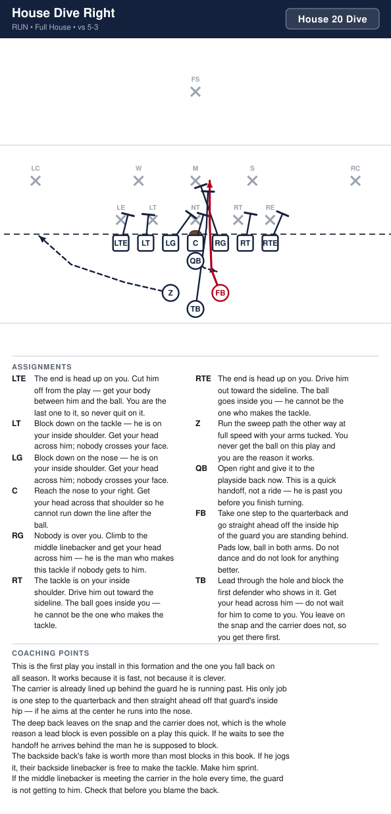
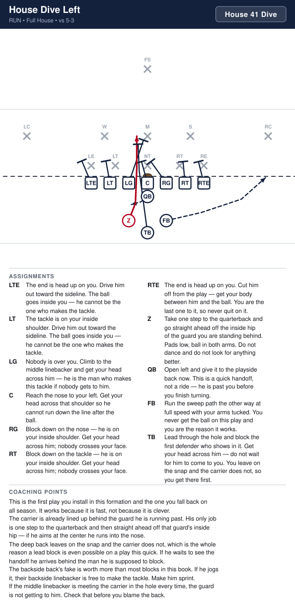
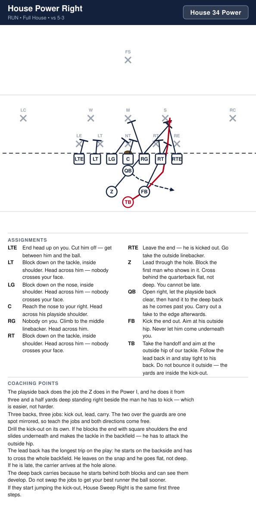
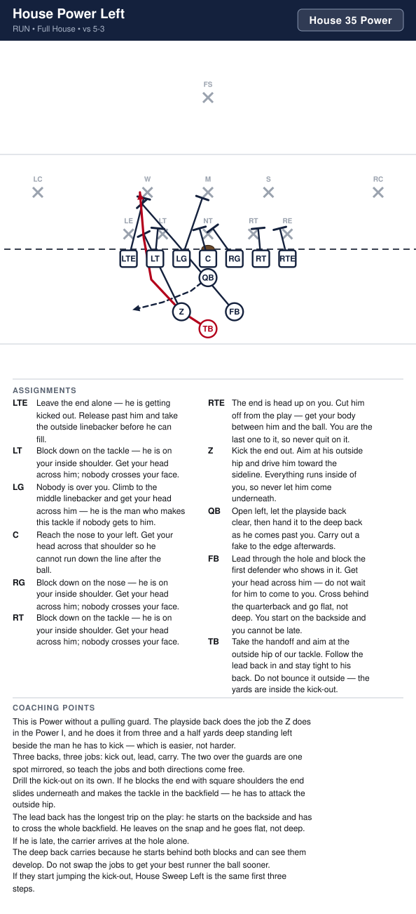
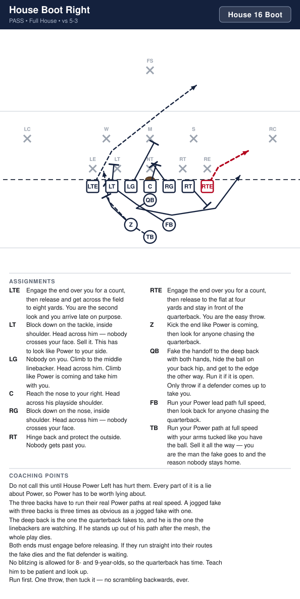
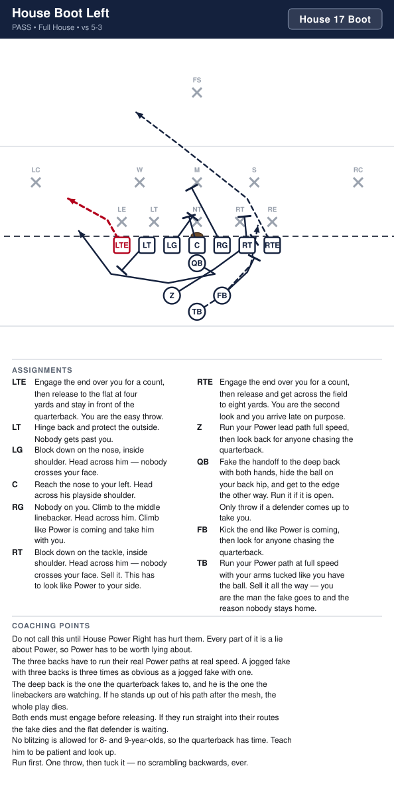
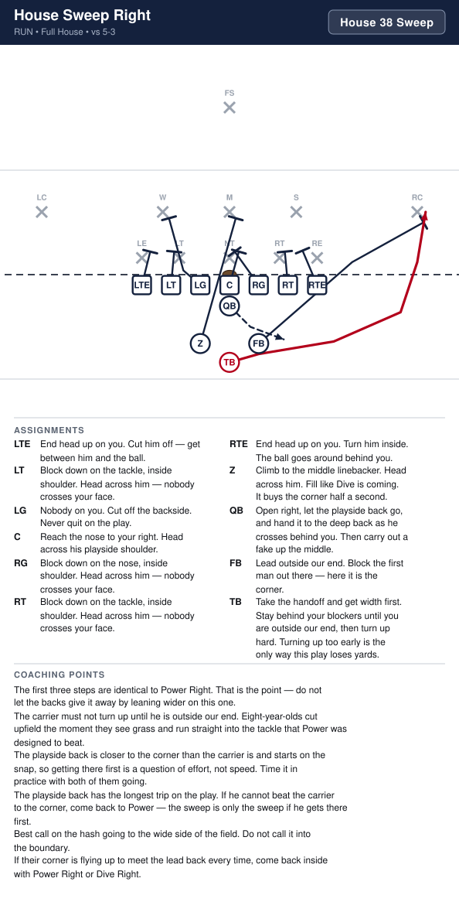
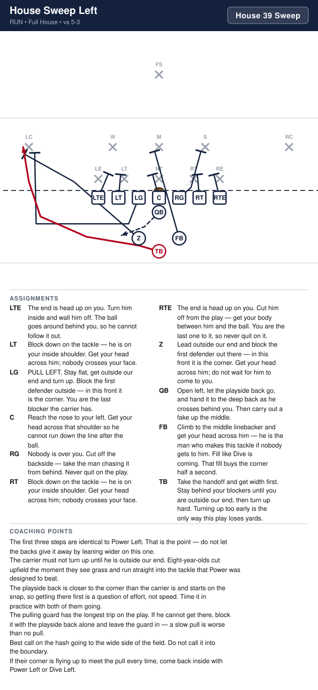

# Full House

_Generated by `generator/render.py`. Edit the JSON in `plays/`, not this file._

The full house T in a diamond. Both ends are tight on the line; the Z and the fullback sit three and a half yards deep, one behind each guard, and the tailback is four yards deep in line with the quarterback. Perfectly symmetric, so every play has a left and right version off identical rules.

**Alignment** (yards; x positive to the right, y positive downfield, LOS = 0)

| Position | x | y |
|---|---|---|
| LTE | -4.2 | -0.5 |
| LT | -2.8 | -0.5 |
| LG | -1.4 | -0.5 |
| C | 0.0 | -0.5 |
| RG | 1.4 | -0.5 |
| RT | 2.8 | -0.5 |
| RTE | 4.2 | -0.5 |
| QB | 0.0 | -1.5 |
| Z | -1.4 | -3.3 |
| FB | 1.4 | -3.3 |
| TB | 0.0 | -4.2 |

**Formation coaching notes**

- The back digits are the book's digits — 2 fullback, 3 tailback, 4 the Z. Here the fullback and the Z are the two over the guards and the tailback is the deep one, so a kid who knows the I's numbers still knows these.
- The two backs over the guards are one spot mirrored, not two positions. Whichever one the play goes to kicks the end out; the other one leads through the hole. Teach the two jobs and both directions come free.
- The tailback is the only one who lines up on the middle, and on Power and Sweep he is the one who carries. He gets a full step to read the two blocks in front of him because he starts behind them, not beside them.
- The diamond is what hides it. In a straight line across, a defense reads three backs at one depth and knows nobody is coming downhill; here the deep back can hit any gap and the near ones are already at the edge.
- Depth is exact and it matters: three and a half yards for the two over the guards, four for the tailback. Let the deep back creep up and he arrives before his blockers do.
- Count seven on the line every snap. No Z to creep up here, so this formation draws the fewest illegal-formation flags.
- Symmetric formation, symmetric rules — the kids learn one play and get two.

## Plays

| Play | Call | Type | Ball |
|---|---|---|---|
| [House Dive Right](#house-dive-right) | `House 20 Dive` | run | FB |
| [House Dive Left](#house-dive-left) | `House 41 Dive` | run | Z |
| [House Power Right](#house-power-right) | `House 34 Power` | run | TB |
| [House Power Left](#house-power-left) | `House 35 Power` | run | TB |
| [House Boot Right](#house-boot-right) | `House 16 Boot` | pass | RTE |
| [House Boot Left](#house-boot-left) | `House 17 Boot` | pass | LTE |
| [House Sweep Right](#house-sweep-right) | `House 38 Sweep` | run | TB |
| [House Sweep Left](#house-sweep-left) | `House 39 Sweep` | run | TB |

---

## House Dive Right

**Call it:** `House 20 Dive`

The fastest handoff in the book. The playside back is already standing behind the guard he is running past, so he is through the hole before the defense has read anything, and the other two backs leave on paths that threaten the edge and the middle at the same time.

| Position | Assignment |
|---|---|
| **LTE** | End head up on you. Cut him off — get between him and the ball. |
| **LT** | Block down on the tackle, inside shoulder. Head across him — nobody crosses your face. |
| **LG** | Block down on the nose, inside shoulder. Head across him — nobody crosses your face. |
| **C** | Reach the nose to your right. Head across his playside shoulder. |
| **RG** | Nobody on you. Climb to the middle linebacker. Head across him. |
| **RT** | Tackle on your inside shoulder. Drive him to the sideline. The ball goes inside you. |
| **RTE** | End head up on you. Drive him to the sideline. The ball goes inside you. |
| **Z** | Run the sweep path the other way at full speed with your arms tucked. You never get the ball on this play and you are the reason it works. |
| **QB** | Open right and give it to the playside back now. This is a quick handoff, not a ride — he is past you before you finish turning. |
| **FB** **(ball)** | Take one step to the quarterback and go straight ahead off the inside hip of the guard you are standing behind. Pads low, ball in both arms. Do not dance and do not look for anything better. |
| **TB** | Lead through the hole. Block the first man who shows in it. You leave on the snap and he does not — get there first. |

**Coaching points**

- This is the first play you install in this formation and the one you fall back on all season. It works because it is fast, not because it is clever.
- The carrier is already lined up behind the guard he is running past. His only job is one step to the quarterback and then straight ahead off that guard's inside hip — if he aims at the center he runs into the nose.
- The deep back leaves on the snap and the carrier does not, which is the whole reason a lead block is even possible on a play this quick. If he waits to see the handoff he arrives behind the man he is supposed to block.
- The backside back's fake is worth more than most blocks in this book. If he jogs it, their backside linebacker is free to make the tackle. Make him sprint.
- If the middle linebacker is meeting the carrier in the hole every time, the guard is not getting to him. Check that before you blame the back.

---

## House Dive Left

**Call it:** `House 41 Dive`

The fastest handoff in the book. The playside back is already standing behind the guard he is running past, so he is through the hole before the defense has read anything, and the other two backs leave on paths that threaten the edge and the middle at the same time.

| Position | Assignment |
|---|---|
| **LTE** | End head up on you. Drive him to the sideline. The ball goes inside you. |
| **LT** | Tackle on your inside shoulder. Drive him to the sideline. The ball goes inside you. |
| **LG** | Nobody on you. Climb to the middle linebacker. Head across him. |
| **C** | Reach the nose to your left. Head across his playside shoulder. |
| **RG** | Block down on the nose, inside shoulder. Head across him — nobody crosses your face. |
| **RT** | Block down on the tackle, inside shoulder. Head across him — nobody crosses your face. |
| **RTE** | End head up on you. Cut him off — get between him and the ball. |
| **Z** **(ball)** | Take one step to the quarterback and go straight ahead off the inside hip of the guard you are standing behind. Pads low, ball in both arms. Do not dance and do not look for anything better. |
| **QB** | Open left and give it to the playside back now. This is a quick handoff, not a ride — he is past you before you finish turning. |
| **FB** | Run the sweep path the other way at full speed with your arms tucked. You never get the ball on this play and you are the reason it works. |
| **TB** | Lead through the hole. Block the first man who shows in it. You leave on the snap and he does not — get there first. |

**Coaching points**

- This is the first play you install in this formation and the one you fall back on all season. It works because it is fast, not because it is clever.
- The carrier is already lined up behind the guard he is running past. His only job is one step to the quarterback and then straight ahead off that guard's inside hip — if he aims at the center he runs into the nose.
- The deep back leaves on the snap and the carrier does not, which is the whole reason a lead block is even possible on a play this quick. If he waits to see the handoff he arrives behind the man he is supposed to block.
- The backside back's fake is worth more than most blocks in this book. If he jogs it, their backside linebacker is free to make the tackle. Make him sprint.
- If the middle linebacker is meeting the carrier in the hole every time, the guard is not getting to him. Check that before you blame the back.

---

## House Power Right

**Call it:** `House 34 Power`

All three backs get a job. The playside back kicks the end out, the backside back wraps around and leads through the hole, and the deep back carries it in behind them both. Two lead blockers arrive in the same gap before the linebackers can fit, and the carrier is far enough back to see them do it.

| Position | Assignment |
|---|---|
| **LTE** | End head up on you. Cut him off — get between him and the ball. |
| **LT** | Block down on the tackle, inside shoulder. Head across him — nobody crosses your face. |
| **LG** | Block down on the nose, inside shoulder. Head across him — nobody crosses your face. |
| **C** | Reach the nose to your right. Head across his playside shoulder. |
| **RG** | Nobody on you. Climb to the middle linebacker. Head across him. |
| **RT** | Block down on the tackle, inside shoulder. Head across him — nobody crosses your face. |
| **RTE** | Leave the end — he is kicked out. Go take the outside linebacker. |
| **Z** | Lead through the hole. Block the first man who shows in it. Cross behind the quarterback flat, not deep. You cannot be late. |
| **QB** | Open right, let the playside back clear, then hand it to the deep back as he comes past you. Carry out a fake to the edge afterwards. |
| **FB** | Kick the end out. Aim at his outside hip. Never let him come underneath you. |
| **TB** **(ball)** | Take the handoff and aim at the outside hip of our tackle. Follow the lead back in and stay tight to his back. Do not bounce it outside — the yards are inside the kick-out. |

**Coaching points**

- The playside back does the job the Z does in the Power I, and he does it from three and a half yards deep standing right beside the man he has to kick — which is easier, not harder.
- Three backs, three jobs: kick out, lead, carry. The two over the guards are one spot mirrored, so teach the jobs and both directions come free.
- Drill the kick-out on its own. If he blocks the end with square shoulders the end slides underneath and makes the tackle in the backfield — he has to attack the outside hip.
- The lead back has the longest trip on the play: he starts on the backside and has to cross the whole backfield. He leaves on the snap and he goes flat, not deep. If he is late, the carrier arrives at the hole alone.
- The deep back carries because he starts behind both blocks and can see them develop. Do not swap the jobs to get your best runner the ball sooner.
- If they start jumping the kick-out, House Sweep Right is the same first three steps.

---

## House Power Left

**Call it:** `House 35 Power`

All three backs get a job. The playside back kicks the end out, the backside back wraps around and leads through the hole, and the deep back carries it in behind them both. Two lead blockers arrive in the same gap before the linebackers can fit, and the carrier is far enough back to see them do it.

| Position | Assignment |
|---|---|
| **LTE** | Leave the end — he is kicked out. Go take the outside linebacker. |
| **LT** | Block down on the tackle, inside shoulder. Head across him — nobody crosses your face. |
| **LG** | Nobody on you. Climb to the middle linebacker. Head across him. |
| **C** | Reach the nose to your left. Head across his playside shoulder. |
| **RG** | Block down on the nose, inside shoulder. Head across him — nobody crosses your face. |
| **RT** | Block down on the tackle, inside shoulder. Head across him — nobody crosses your face. |
| **RTE** | End head up on you. Cut him off — get between him and the ball. |
| **Z** | Kick the end out. Aim at his outside hip. Never let him come underneath you. |
| **QB** | Open left, let the playside back clear, then hand it to the deep back as he comes past you. Carry out a fake to the edge afterwards. |
| **FB** | Lead through the hole. Block the first man who shows in it. Cross behind the quarterback flat, not deep. You cannot be late. |
| **TB** **(ball)** | Take the handoff and aim at the outside hip of our tackle. Follow the lead back in and stay tight to his back. Do not bounce it outside — the yards are inside the kick-out. |

**Coaching points**

- The playside back does the job the Z does in the Power I, and he does it from three and a half yards deep standing left beside the man he has to kick — which is easier, not harder.
- Three backs, three jobs: kick out, lead, carry. The two over the guards are one spot mirrored, so teach the jobs and both directions come free.
- Drill the kick-out on its own. If he blocks the end with square shoulders the end slides underneath and makes the tackle in the backfield — he has to attack the outside hip.
- The lead back has the longest trip on the play: he starts on the backside and has to cross the whole backfield. He leaves on the snap and he goes flat, not deep. If he is late, the carrier arrives at the hole alone.
- The deep back carries because he starts behind both blocks and can see them develop. Do not swap the jobs to get your best runner the ball sooner.
- If they start jumping the kick-out, House Sweep Left is the same first three steps.

---

## House Boot Right

**Call it:** `House 16 Boot`

All three backs run their Power paths to the left and the quarterback keeps it right on his own. Three backs going one way is the hardest thing in this book to ignore, which is exactly why nobody is right on the other side.

| Position | Assignment |
|---|---|
| **LTE** | Engage the end over you for a count, then release and get across the field to eight yards. You are the second look and you arrive late on purpose. |
| **LT** | Block down on the tackle, inside shoulder. Head across him — nobody crosses your face. Sell it. This has to look like Power to your side. |
| **LG** | Nobody on you. Climb to the middle linebacker. Head across him. Climb like Power is coming and take him with you. |
| **C** | Reach the nose to your right. Head across his playside shoulder. |
| **RG** | Block down on the nose, inside shoulder. Head across him — nobody crosses your face. |
| **RT** | Hinge back and protect the outside. Nobody gets past you. |
| **RTE** **(ball)** | Engage the end over you for a count, then release to the flat at four yards and stay in front of the quarterback. You are the easy throw. |
| **Z** | Kick the end like Power is coming, then look for anyone chasing the quarterback. |
| **QB** | Fake the handoff to the deep back with both hands, hide the ball on your back hip, and get to the edge the other way. Run it if it is open. Only throw if a defender comes up to take you. |
| **FB** | Run your Power lead path full speed, then look back for anyone chasing the quarterback. |
| **TB** | Run your Power path at full speed with your arms tucked like you have the ball. Sell it all the way — you are the man the fake goes to and the reason nobody stays home. |

**Coaching points**

- Do not call this until House Power Left has hurt them. Every part of it is a lie about Power, so Power has to be worth lying about.
- The three backs have to run their real Power paths at real speed. A jogged fake with three backs is three times as obvious as a jogged fake with one.
- The deep back is the one the quarterback fakes to, and he is the one the linebackers are watching. If he stands up out of his path after the mesh, the whole play dies.
- Both ends must engage before releasing. If they run straight into their routes the fake dies and the flat defender is waiting.
- No blitzing is allowed for 8- and 9-year-olds, so the quarterback has time. Teach him to be patient and look up.
- Run first. One throw, then tuck it — no scrambling backwards, ever.

---

## House Boot Left

**Call it:** `House 17 Boot`

All three backs run their Power paths to the right and the quarterback keeps it left on his own. Three backs going one way is the hardest thing in this book to ignore, which is exactly why nobody is left on the other side.

| Position | Assignment |
|---|---|
| **LTE** **(ball)** | Engage the end over you for a count, then release to the flat at four yards and stay in front of the quarterback. You are the easy throw. |
| **LT** | Hinge back and protect the outside. Nobody gets past you. |
| **LG** | Block down on the nose, inside shoulder. Head across him — nobody crosses your face. |
| **C** | Reach the nose to your left. Head across his playside shoulder. |
| **RG** | Nobody on you. Climb to the middle linebacker. Head across him. Climb like Power is coming and take him with you. |
| **RT** | Block down on the tackle, inside shoulder. Head across him — nobody crosses your face. Sell it. This has to look like Power to your side. |
| **RTE** | Engage the end over you for a count, then release and get across the field to eight yards. You are the second look and you arrive late on purpose. |
| **Z** | Run your Power lead path full speed, then look back for anyone chasing the quarterback. |
| **QB** | Fake the handoff to the deep back with both hands, hide the ball on your back hip, and get to the edge the other way. Run it if it is open. Only throw if a defender comes up to take you. |
| **FB** | Kick the end like Power is coming, then look for anyone chasing the quarterback. |
| **TB** | Run your Power path at full speed with your arms tucked like you have the ball. Sell it all the way — you are the man the fake goes to and the reason nobody stays home. |

**Coaching points**

- Do not call this until House Power Right has hurt them. Every part of it is a lie about Power, so Power has to be worth lying about.
- The three backs have to run their real Power paths at real speed. A jogged fake with three backs is three times as obvious as a jogged fake with one.
- The deep back is the one the quarterback fakes to, and he is the one the linebackers are watching. If he stands up out of his path after the mesh, the whole play dies.
- Both ends must engage before releasing. If they run straight into their routes the fake dies and the flat defender is waiting.
- No blitzing is allowed for 8- and 9-year-olds, so the quarterback has time. Teach him to be patient and look up.
- Run first. One throw, then tuck it — no scrambling backwards, ever.

---

## House Sweep Right

**Call it:** `House 38 Sweep`

The same first three steps as Power, taken all the way outside. The playside back gets around the corner in front of the carrier, and a defense that has been fighting the kick-out inside is a step late getting there.

| Position | Assignment |
|---|---|
| **LTE** | End head up on you. Cut him off — get between him and the ball. |
| **LT** | Block down on the tackle, inside shoulder. Head across him — nobody crosses your face. |
| **LG** | Nobody on you. Cut off the backside. Never quit on the play. |
| **C** | Reach the nose to your right. Head across his playside shoulder. |
| **RG** | Block down on the nose, inside shoulder. Head across him — nobody crosses your face. |
| **RT** | Block down on the tackle, inside shoulder. Head across him — nobody crosses your face. |
| **RTE** | End head up on you. Turn him inside. The ball goes around behind you. |
| **Z** | Climb to the middle linebacker. Head across him. Fill like Dive is coming. It buys the corner half a second. |
| **QB** | Open right, let the playside back go, and hand it to the deep back as he crosses behind you. Then carry out a fake up the middle. |
| **FB** | Lead outside our end. Block the first man out there — here it is the corner. |
| **TB** **(ball)** | Take the handoff and get width first. Stay behind your blockers until you are outside our end, then turn up hard. Turning up too early is the only way this play loses yards. |

**Coaching points**

- The first three steps are identical to Power Right. That is the point — do not let the backs give it away by leaning wider on this one.
- The carrier must not turn up until he is outside our end. Eight-year-olds cut upfield the moment they see grass and run straight into the tackle that Power was designed to beat.
- The playside back is closer to the corner than the carrier is and starts on the snap, so getting there first is a question of effort, not speed. Time it in practice with both of them going.
- The playside back has the longest trip on the play. If he cannot beat the carrier to the corner, come back to Power — the sweep is only the sweep if he gets there first.
- Best call on the hash going to the wide side of the field. Do not call it into the boundary.
- If their corner is flying up to meet the lead back every time, come back inside with Power Right or Dive Right.

---

## House Sweep Left

**Call it:** `House 39 Sweep`

The same first three steps as Power, taken all the way outside. The playside back gets around the corner in front of the carrier, and a defense that has been fighting the kick-out inside is a step late getting there.

| Position | Assignment |
|---|---|
| **LTE** | End head up on you. Turn him inside. The ball goes around behind you. |
| **LT** | Block down on the tackle, inside shoulder. Head across him — nobody crosses your face. |
| **LG** | Block down on the nose, inside shoulder. Head across him — nobody crosses your face. |
| **C** | Reach the nose to your left. Head across his playside shoulder. |
| **RG** | Nobody on you. Cut off the backside. Never quit on the play. |
| **RT** | Block down on the tackle, inside shoulder. Head across him — nobody crosses your face. |
| **RTE** | End head up on you. Cut him off — get between him and the ball. |
| **Z** | Lead outside our end. Block the first man out there — here it is the corner. |
| **QB** | Open left, let the playside back go, and hand it to the deep back as he crosses behind you. Then carry out a fake up the middle. |
| **FB** | Climb to the middle linebacker. Head across him. Fill like Dive is coming. It buys the corner half a second. |
| **TB** **(ball)** | Take the handoff and get width first. Stay behind your blockers until you are outside our end, then turn up hard. Turning up too early is the only way this play loses yards. |

**Coaching points**

- The first three steps are identical to Power Left. That is the point — do not let the backs give it away by leaning wider on this one.
- The carrier must not turn up until he is outside our end. Eight-year-olds cut upfield the moment they see grass and run straight into the tackle that Power was designed to beat.
- The playside back is closer to the corner than the carrier is and starts on the snap, so getting there first is a question of effort, not speed. Time it in practice with both of them going.
- The playside back has the longest trip on the play. If he cannot beat the carrier to the corner, come back to Power — the sweep is only the sweep if he gets there first.
- Best call on the hash going to the wide side of the field. Do not call it into the boundary.
- If their corner is flying up to meet the lead back every time, come back inside with Power Left or Dive Left.

