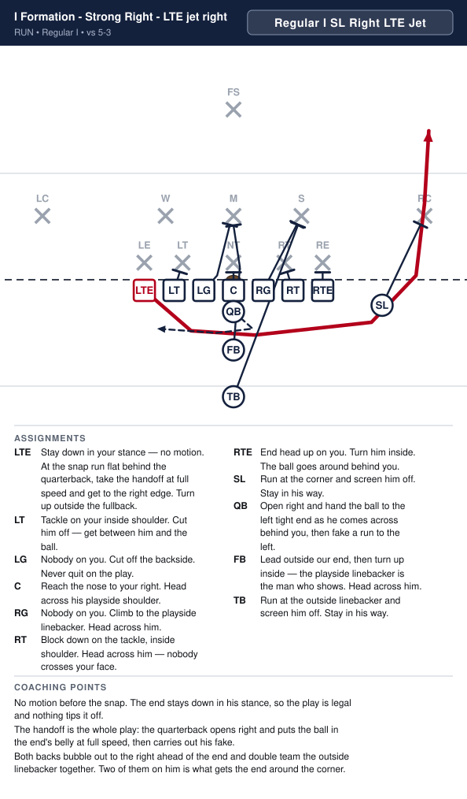
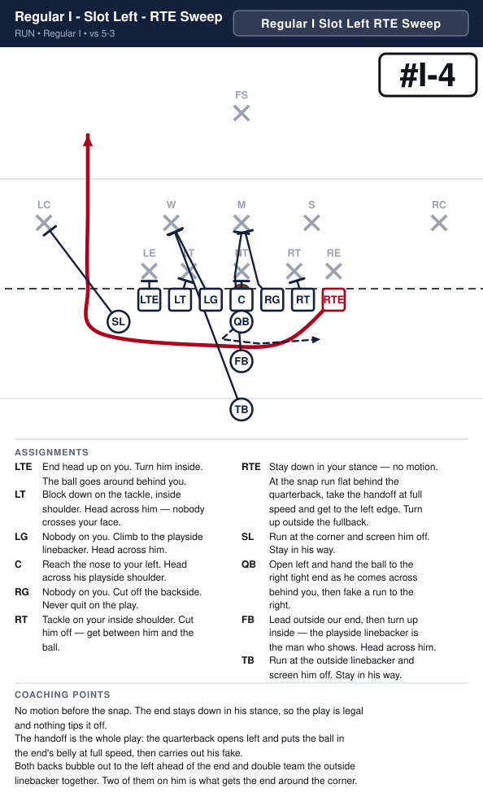
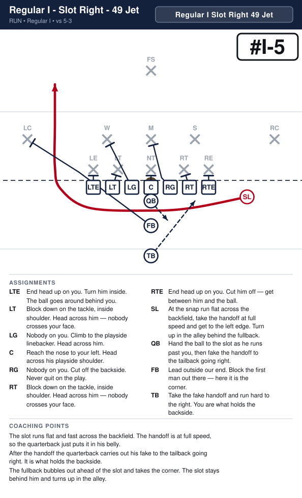
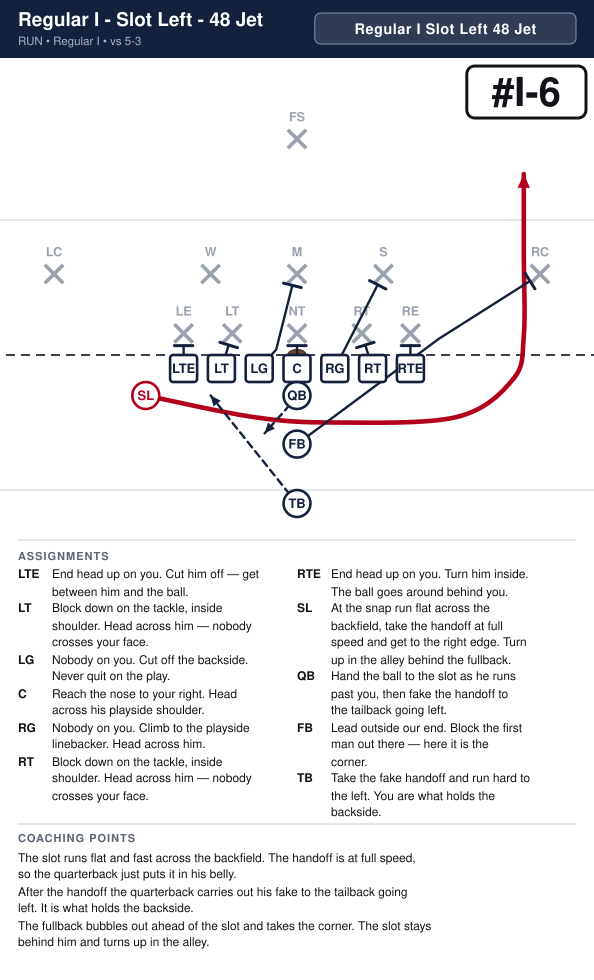

# Regular I

_Generated by `generator/render.py`. Edit the JSON in `plays/`, not this file._

Normal line splits, about a foot. Both ends are on the line; the SL is off it, a yard outside and a yard back — seven on the line every snap. Fullback at three yards, tailback stacked behind him at five and a half.

**Alignment** (yards; x positive to the right, y positive downfield, LOS = 0)

| Position | x | y |
|---|---|---|
| LTE | -4.2 | -0.5 |
| LT | -2.8 | -0.5 |
| LG | -1.4 | -0.5 |
| C | 0.0 | -0.5 |
| RG | 1.4 | -0.5 |
| RT | 2.8 | -0.5 |
| RTE | 4.2 | -0.5 |
| SL | 7.0 | -1.2 |
| QB | 0.0 | -1.5 |
| FB | 0.0 | -3.3 |
| TB | 0.0 | -5.5 |

**Formation coaching notes**

- The tailback picks his own hole here — reads the block and cuts off it, instead of the play deciding for him the way Dive does. The harder skill, which is why this formation gets the most practice time.
- The SL lines up right every play, and the call says so — SL Right. Naming it now means a SL Left look can be added later without changing how plays are called.
- Count seven on the line every snap — the SL creeping up onto it is the most common illegal-formation flag from this look.
- Fullback and tailback must stay stacked. A drifting tailback tips the play before the snap.
- The SL is back 4 — a receiver most snaps, but also the jet-motion man on Jet sweep and the fake on its boot. Same number he carries in the Power I backfield.

## Plays

| Play | Call | Type | Ball |
|---|---|---|---|
| [I Formation - Strong Right - Off tackle right](#i-formation---strong-right---off-tackle-right) | `Regular I SL Right 34 Power` | run | TB |
| [I Formation - Strong Left - Off tackle left](#i-formation---strong-left---off-tackle-left) | `Regular I SL Left 35 Power` | run | TB |
| [I Formation - Strong Right - LTE jet right](#i-formation---strong-right---lte-jet-right) | `Regular I SL Right LTE Jet` | run | LTE |
| [I Formation - Strong Left - RTE jet left](#i-formation---strong-left---rte-jet-left) | `Regular I SL Left RTE Jet` | run | RTE |
| [I Formation - Strong Right - Slot jet left](#i-formation---strong-right---slot-jet-left) | `Regular I SL Right 49 Jet` | run | SL |
| [I Formation - Strong Left - Slot jet right](#i-formation---strong-left---slot-jet-right) | `Regular I SL Left 48 Jet` | run | SL |

---

## I Formation - Strong Right - Off tackle right

**Call it:** `Regular I SL Right 34 Power`

| Position | Assignment |
|---|---|
| **LTE** | End head up on you. Cut him off — get between him and the ball. |
| **LT** | Block down on the tackle, inside shoulder. Head across him — nobody crosses your face. |
| **LG** | Nobody on you. Cut off the backside. Never quit on the play. |
| **C** | Reach the nose to your right. Head across his playside shoulder. |
| **RG** | Nobody on you. Help on the nose, then take the middle linebacker. |
| **RT** | Block down on the tackle, inside shoulder. Head across him — nobody crosses your face. |
| **RTE** | Leave the end — he is kicked out. Go take the outside linebacker. |
| **SL** | Kick the end out. Aim at his outside hip. Never let him come underneath you. |
| **QB** | Open right, hand deep to the tailback, then fake the boot. It holds the backside end. |
| **FB** | Lead through the hole. Block the first man who shows in it. |
| **TB** **(ball)** | Take the handoff downhill at our tackle's outside hip, following the fullback. Never bounce it outside. |

**Coaching points**

- This is the most physical run in the book. If it works you can run it fifteen times, and at this age you often can.
- Drill the SL's kick-out on its own. If he blocks the end with his shoulders square, the end slides underneath and makes the tackle for a loss — he has to attack the outside hip.
- The fullback's man is whoever shows in the hole, not a man he picks before the snap. Tell him that every time.
- The tailback's most common mistake is bouncing it wide looking for green grass. The yards are inside the SL's block. Make him run it tight in practice until it is automatic.

---

## I Formation - Strong Left - Off tackle left

**Call it:** `Regular I SL Left 35 Power`

| Position | Assignment |
|---|---|
| **LTE** | Leave the end — he is kicked out. Go take the outside linebacker. |
| **LT** | Block down on the tackle, inside shoulder. Head across him — nobody crosses your face. |
| **LG** | Nobody on you. Help on the nose, then take the middle linebacker. |
| **C** | Reach the nose to your left. Head across his playside shoulder. |
| **RG** | Nobody on you. Cut off the backside. Never quit on the play. |
| **RT** | Block down on the tackle, inside shoulder. Head across him — nobody crosses your face. |
| **RTE** | End head up on you. Cut him off — get between him and the ball. |
| **SL** | Kick the end out. Aim at his outside hip. Never let him come underneath you. |
| **QB** | Open left, hand deep to the tailback, then fake the boot. It holds the backside end. |
| **FB** | Lead through the hole. Block the first man who shows in it. |
| **TB** **(ball)** | Take the handoff downhill at our tackle's outside hip, following the fullback. Never bounce it outside. |

**Coaching points**

- This is the most physical run in the book. If it works you can run it fifteen times, and at this age you often can.
- Drill the SL's kick-out on its own. If he blocks the end with his shoulders square, the end slides underneath and makes the tackle for a loss — he has to attack the outside hip.
- The fullback's man is whoever shows in the hole, not a man he picks before the snap. Tell him that every time.
- The tailback's most common mistake is bouncing it wide looking for green grass. The yards are inside the SL's block. Make him run it tight in practice until it is automatic.

---

## I Formation - Strong Right - LTE jet right

**Call it:** `Regular I SL Right LTE Jet`

| Position | Assignment |
|---|---|
| **LTE** **(ball)** | Stay down in your stance — no motion. At the snap run flat behind the quarterback, take the handoff at full speed and get to the right edge. Turn up outside the fullback. |
| **LT** | Tackle on your inside shoulder. Cut him off — get between him and the ball. |
| **LG** | Nobody on you. Cut off the backside. Never quit on the play. |
| **C** | Reach the nose to your right. Head across his playside shoulder. |
| **RG** | Nobody on you. Climb to the playside linebacker. Head across him. |
| **RT** | Block down on the tackle, inside shoulder. Head across him — nobody crosses your face. |
| **RTE** | End head up on you. Turn him inside. The ball goes around behind you. |
| **SL** | Run at the corner and screen him off. Stay in his way. |
| **QB** | Open right and hand the ball to the left tight end as he comes across behind you, then fake a run to the left. |
| **FB** | Lead outside our end, then turn up inside — the playside linebacker is the man who shows. Head across him. |
| **TB** | Run at the outside linebacker and screen him off. Stay in his way. |

**Coaching points**

- No motion before the snap. The end stays down in his stance, so the play is legal and nothing tips it off.
- The handoff is the whole play: the quarterback opens right and puts the ball in the end's belly at full speed, then carries out his fake.
- Both backs bubble out to the right ahead of the end and double team the outside linebacker together. Two of them on him is what gets the end around the corner.

---

## I Formation - Strong Left - RTE jet left

**Call it:** `Regular I SL Left RTE Jet`

| Position | Assignment |
|---|---|
| **LTE** | End head up on you. Turn him inside. The ball goes around behind you. |
| **LT** | Block down on the tackle, inside shoulder. Head across him — nobody crosses your face. |
| **LG** | Nobody on you. Climb to the playside linebacker. Head across him. |
| **C** | Reach the nose to your left. Head across his playside shoulder. |
| **RG** | Nobody on you. Cut off the backside. Never quit on the play. |
| **RT** | Tackle on your inside shoulder. Cut him off — get between him and the ball. |
| **RTE** **(ball)** | Stay down in your stance — no motion. At the snap run flat behind the quarterback, take the handoff at full speed and get to the left edge. Turn up outside the fullback. |
| **SL** | Run at the corner and screen him off. Stay in his way. |
| **QB** | Open left and hand the ball to the right tight end as he comes across behind you, then fake a run to the right. |
| **FB** | Lead outside our end, then turn up inside — the playside linebacker is the man who shows. Head across him. |
| **TB** | Run at the outside linebacker and screen him off. Stay in his way. |

**Coaching points**

- No motion before the snap. The end stays down in his stance, so the play is legal and nothing tips it off.
- The handoff is the whole play: the quarterback opens left and puts the ball in the end's belly at full speed, then carries out his fake.
- Both backs bubble out to the left ahead of the end and double team the outside linebacker together. Two of them on him is what gets the end around the corner.

---

## I Formation - Strong Right - Slot jet left

**Call it:** `Regular I SL Right 49 Jet`

| Position | Assignment |
|---|---|
| **LTE** | End head up on you. Turn him inside. The ball goes around behind you. |
| **LT** | Block down on the tackle, inside shoulder. Head across him — nobody crosses your face. |
| **LG** | Nobody on you. Climb to the playside linebacker. Head across him. |
| **C** | Reach the nose to your left. Head across his playside shoulder. |
| **RG** | Nobody on you. Cut off the backside. Never quit on the play. |
| **RT** | Block down on the tackle, inside shoulder. Head across him — nobody crosses your face. |
| **RTE** | End head up on you. Cut him off — get between him and the ball. |
| **SL** **(ball)** | At the snap run flat across the backfield, take the handoff at full speed and get to the left edge. Turn up in the alley behind the fullback. |
| **QB** | Hand the ball to the slot as he runs past you, then fake the handoff to the tailback going right. |
| **FB** | Lead outside our end. Block the first man out there — here it is the corner. |
| **TB** | Take the fake handoff and run hard to the right. You are what holds the backside. |

**Coaching points**

- The slot runs flat and fast across the backfield. The handoff is at full speed, so the quarterback just puts it in his belly.
- After the handoff the quarterback carries out his fake to the tailback going right. It is what holds the backside.
- The fullback bubbles out ahead of the slot and takes the corner. The slot stays behind him and turns up in the alley.

---

## I Formation - Strong Left - Slot jet right

**Call it:** `Regular I SL Left 48 Jet`

| Position | Assignment |
|---|---|
| **LTE** | End head up on you. Cut him off — get between him and the ball. |
| **LT** | Block down on the tackle, inside shoulder. Head across him — nobody crosses your face. |
| **LG** | Nobody on you. Cut off the backside. Never quit on the play. |
| **C** | Reach the nose to your right. Head across his playside shoulder. |
| **RG** | Nobody on you. Climb to the playside linebacker. Head across him. |
| **RT** | Block down on the tackle, inside shoulder. Head across him — nobody crosses your face. |
| **RTE** | End head up on you. Turn him inside. The ball goes around behind you. |
| **SL** **(ball)** | At the snap run flat across the backfield, take the handoff at full speed and get to the right edge. Turn up in the alley behind the fullback. |
| **QB** | Hand the ball to the slot as he runs past you, then fake the handoff to the tailback going left. |
| **FB** | Lead outside our end. Block the first man out there — here it is the corner. |
| **TB** | Take the fake handoff and run hard to the left. You are what holds the backside. |

**Coaching points**

- The slot runs flat and fast across the backfield. The handoff is at full speed, so the quarterback just puts it in his belly.
- After the handoff the quarterback carries out his fake to the tailback going left. It is what holds the backside.
- The fullback bubbles out ahead of the slot and takes the corner. The slot stays behind him and turns up in the alley.

