# Regular I

_Generated by `generator/render.py`. Edit the JSON in `plays/`, not this file._

Normal line splits, about a foot. Both ends are on the line; the Z is off it, a yard outside and a yard back — seven on the line every snap. Fullback at three yards, tailback stacked behind him at five and a half.

**Alignment** (yards; x positive to the right, y positive downfield, LOS = 0)

| Position | x | y |
|---|---|---|
| LTE | -4.2 | -0.5 |
| LT | -2.8 | -0.5 |
| LG | -1.4 | -0.5 |
| C | 0.0 | -0.5 |
| RG | 1.4 | -0.5 |
| RT | 2.8 | -0.5 |
| RTE | 4.2 | -0.5 |
| Z | 7.0 | -1.2 |
| QB | 0.0 | -1.5 |
| FB | 0.0 | -3.3 |
| TB | 0.0 | -5.5 |

**Formation coaching notes**

- The tailback picks his own hole here — reads the block and cuts off it, instead of the play deciding for him the way Dive does. The harder skill, which is why this formation gets the most practice time.
- The Z lines up right every play, and the call says so — Z Right. Naming it now means a Z Left look can be added later without changing how plays are called.
- Count seven on the line every snap — the Z creeping up onto it is the most common illegal-formation flag from this look.
- Fullback and tailback must stay stacked. A drifting tailback tips the play before the snap.
- The Z is back 4 — a receiver most snaps, but also the jet-motion man on Jet sweep and the fake on its boot. Same number he carries in the Power I backfield.

## Plays

| Play | Call | Type | Ball |
|---|---|---|---|
| [Regular I Sneak Right](#regular-i-sneak-right) | `Regular I Z Right 10 Sneak` | run | QB |
| [Regular I Sneak Left](#regular-i-sneak-left) | `Regular I Z Right 11 Sneak` | run | QB |
| [Regular I Dive Right](#regular-i-dive-right) | `Regular I Z Right 20 Dive` | run | FB |
| [Regular I Dive Left](#regular-i-dive-left) | `Regular I Z Right 21 Dive` | run | FB |
| [Regular I Wedge Right](#regular-i-wedge-right) | `Regular I Z Right 30 Wedge` | run | TB |
| [Regular I Wedge Left](#regular-i-wedge-left) | `Regular I Z Right 31 Wedge` | run | TB |
| [Regular I Iso Right](#regular-i-iso-right) | `Regular I Z Right 32 Iso` | run | TB |
| [Regular I Iso Left](#regular-i-iso-left) | `Regular I Z Right 33 Iso` | run | TB |
| [Regular I Power Right](#regular-i-power-right) | `Regular I Z Right 34 Power` | run | TB |
| [Regular I Power Left](#regular-i-power-left) | `Regular I Z Left 35 Power` | run | TB |
| [Regular I Counter Right](#regular-i-counter-right) | `Regular I Z Right 34 Counter` | run | TB |
| [Regular I Counter Left](#regular-i-counter-left) | `Regular I Z Right 35 Counter` | run | TB |
| [Regular I Boot Right](#regular-i-boot-right) | `Regular I Z Right 16 Boot` | pass | Z |
| [Regular I Boot Left](#regular-i-boot-left) | `Regular I Z Right 17 Boot` | pass | LTE |
| [Regular I Waggle Right](#regular-i-waggle-right) | `Regular I Z Right 16 Waggle` | pass | RTE |
| [Regular I Waggle Left](#regular-i-waggle-left) | `Regular I Z Right 17 Waggle` | pass | LTE |
| [Regular I Jet Boot Right](#regular-i-jet-boot-right) | `Regular I Z Right 16 Jet Boot` | pass | RTE |
| [Regular I Jet Boot Left](#regular-i-jet-boot-left) | `Regular I Z Right 17 Jet Boot` | pass | LTE |
| [Regular I Power Boot Right](#regular-i-power-boot-right) | `Regular I Z Right 16 Power Boot` | pass | RTE |
| [Regular I Power Boot Left](#regular-i-power-boot-left) | `Regular I Z Right 17 Power Boot` | pass | LTE |
| [Regular I Slant Right](#regular-i-slant-right) | `Regular I Z Right 36 Slant` | run | TB |
| [Regular I Slant Left](#regular-i-slant-left) | `Regular I Z Right 37 Slant` | run | TB |
| [Regular I Toss Right](#regular-i-toss-right) | `Regular I Z Right 38 Toss` | run | TB |
| [Regular I Toss Left](#regular-i-toss-left) | `Regular I Z Right 39 Toss` | run | TB |
| [Regular I Jet Right](#regular-i-jet-right) | `Regular I Z Right 48 Jet` | run | Z |
| [Regular I Jet Left](#regular-i-jet-left) | `Regular I Z Right 49 Jet` | run | Z |

---

## Regular I Sneak Right

**Call it:** `Regular I Z Right 10 Sneak`

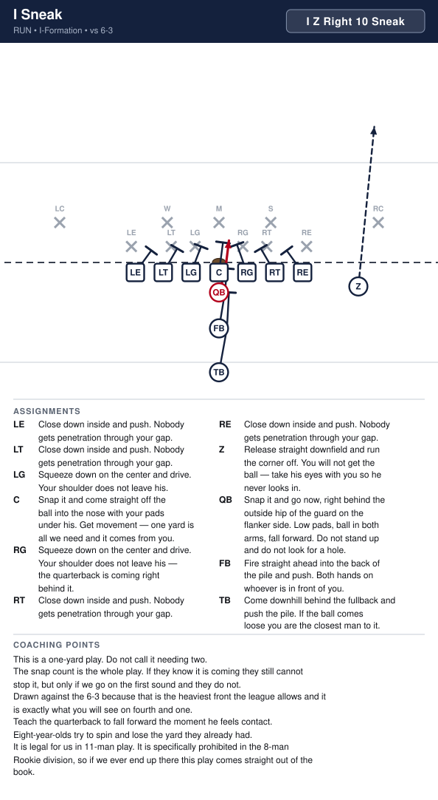

Fourth and inches. The quarterback keeps it behind the center's playside hip before the defense has come out of its stance. No handoff to go wrong and no back to get tackled in the backfield.

| Position | Assignment |
|---|---|
| **LTE** | Close down inside and push. Nobody gets penetration through your gap. |
| **LT** | Close down inside and push. Nobody gets penetration through your gap. |
| **LG** | Squeeze down on the center and drive. Your shoulder does not leave his. |
| **C** | Snap it and come straight off the ball into the nose with your pads under his. Get movement — one yard is all we need and it comes from you. |
| **RG** | Squeeze down on the center and drive. Your shoulder does not leave his — the quarterback is coming right behind it. |
| **RT** | Close down inside and push. Nobody gets penetration through your gap. |
| **RTE** | Close down inside and push. Nobody gets penetration through your gap. |
| **Z** | Release straight downfield and run the corner off. You will not get the ball — take his eyes with you so he never looks in. |
| **QB** **(ball)** | Snap it and go now, right behind the outside hip of the guard on the Z side. Low pads, ball in both arms, fall forward. Do not stand up and do not look for a hole. |
| **FB** | Fire straight ahead into the back of the pile and push. Both hands on whoever is in front of you. |
| **TB** | Come downhill behind the fullback and push the pile. If the ball comes loose you are the closest man to it. |

**Coaching points**

- This is a one-yard play. Do not call it needing two.
- The snap count is the whole play. If they know it is coming they still cannot stop it, but only if we go on the first sound and they do not.
- Drawn against the 6-3 because that is the heaviest front the league allows and it is exactly what you will see on fourth and one.
- Teach the quarterback to fall forward the moment he feels contact. Eight-year-olds try to spin and lose the yard they already had.
- It is legal for us in 11-man play. It is specifically prohibited in the 8-man Rookie division, so if we ever end up there this play comes straight out of the book.

---

## Regular I Sneak Left

**Call it:** `Regular I Z Right 11 Sneak`

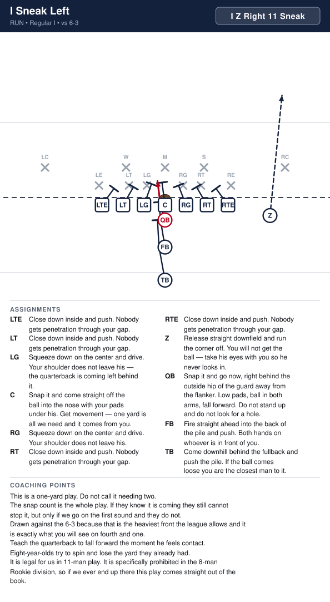

Fourth and inches. The quarterback keeps it behind the center's playside hip before the defense has come out of its stance. No handoff to go wrong and no back to get tackled in the backfield.

| Position | Assignment |
|---|---|
| **LTE** | Close down inside and push. Nobody gets penetration through your gap. |
| **LT** | Close down inside and push. Nobody gets penetration through your gap. |
| **LG** | Squeeze down on the center and drive. Your shoulder does not leave his — the quarterback is coming left behind it. |
| **C** | Snap it and come straight off the ball into the nose with your pads under his. Get movement — one yard is all we need and it comes from you. |
| **RG** | Squeeze down on the center and drive. Your shoulder does not leave his. |
| **RT** | Close down inside and push. Nobody gets penetration through your gap. |
| **RTE** | Close down inside and push. Nobody gets penetration through your gap. |
| **Z** | Release straight downfield and run the corner off. You will not get the ball — take his eyes with you so he never looks in. |
| **QB** **(ball)** | Snap it and go now, right behind the outside hip of the guard away from the Z. Low pads, ball in both arms, fall forward. Do not stand up and do not look for a hole. |
| **FB** | Fire straight ahead into the back of the pile and push. Both hands on whoever is in front of you. |
| **TB** | Come downhill behind the fullback and push the pile. If the ball comes loose you are the closest man to it. |

**Coaching points**

- This is a one-yard play. Do not call it needing two.
- The snap count is the whole play. If they know it is coming they still cannot stop it, but only if we go on the first sound and they do not.
- Drawn against the 6-3 because that is the heaviest front the league allows and it is exactly what you will see on fourth and one.
- Teach the quarterback to fall forward the moment he feels contact. Eight-year-olds try to spin and lose the yard they already had.
- It is legal for us in 11-man play. It is specifically prohibited in the 8-man Rookie division, so if we ever end up there this play comes straight out of the book.

---

## Regular I Dive Right

**Call it:** `Regular I Z Right 20 Dive`

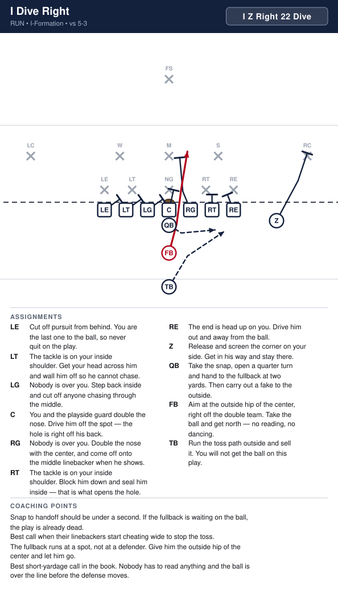

The quickest handoff in the book. The fullback is through the line before their linebackers have read anything. We run it to remind them the middle is not free, which is what makes the toss work later.

| Position | Assignment |
|---|---|
| **LTE** | Cut off pursuit from behind. You are the last one to the ball, so never quit on the play. |
| **LT** | The tackle is on your inside shoulder. Get your head across him and wall him off so he cannot chase. |
| **LG** | Nobody is over you. Step back inside and cut off anyone chasing through the middle. |
| **C** | You and the playside guard double the nose. Drive him off the spot — the hole is right off his back. |
| **RG** | Nobody is over you. Double the nose with the center, and come off onto the middle linebacker when he shows. |
| **RT** | The tackle is on your inside shoulder. Block him down and seal him inside — that is what opens the hole. |
| **RTE** | The end is head up on you. Drive him out and away from the ball. |
| **Z** | Release and screen the corner on your side. Get in his way and stay there. |
| **QB** | Take the snap, open a quarter turn and hand to the fullback at two yards. Then carry out a fake to the outside. |
| **FB** **(ball)** | Aim at the outside hip of the center, right off the double team. Take the ball and get north — no reading, no dancing. |
| **TB** | Run the toss path outside and sell it. You will not get the ball on this play. |

**Coaching points**

- Snap to handoff should be under a second. If the fullback is waiting on the ball, the play is already dead.
- Best call when their linebackers start cheating wide to stop the toss.
- The fullback runs at a spot, not at a defender. Give him the outside hip of the center and let him go.
- Best short-yardage call in the book. Nobody has to read anything and the ball is over the line before the defense moves.

---

## Regular I Dive Left

**Call it:** `Regular I Z Right 21 Dive`

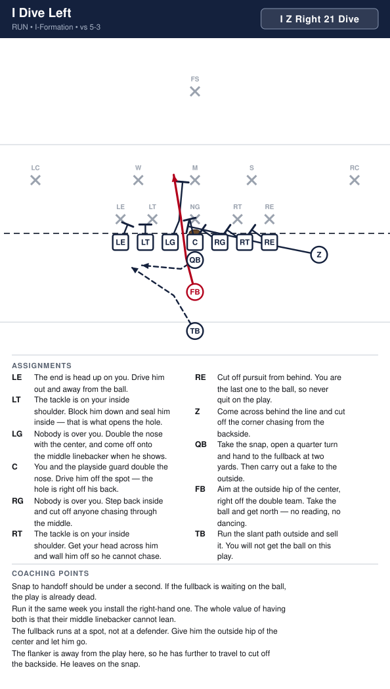

The same quick handoff through the other A gap. Worth having both so the fullback is not always going to the same side of the center — once their middle linebacker knows which way the dive hits, it stops being quick.

| Position | Assignment |
|---|---|
| **LTE** | The end is head up on you. Drive him out and away from the ball. |
| **LT** | The tackle is on your inside shoulder. Block him down and seal him inside — that is what opens the hole. |
| **LG** | Nobody is over you. Double the nose with the center, and come off onto the middle linebacker when he shows. |
| **C** | You and the playside guard double the nose. Drive him off the spot — the hole is right off his back. |
| **RG** | Nobody is over you. Step back inside and cut off anyone chasing through the middle. |
| **RT** | The tackle is on your inside shoulder. Get your head across him and wall him off so he cannot chase. |
| **RTE** | Cut off pursuit from behind. You are the last one to the ball, so never quit on the play. |
| **Z** | Come across behind the line and cut off the corner chasing from the backside. |
| **QB** | Take the snap, open a quarter turn and hand to the fullback at two yards. Then carry out a fake to the outside. |
| **FB** **(ball)** | Aim at the outside hip of the center, right off the double team. Take the ball and get north — no reading, no dancing. |
| **TB** | Run the toss path outside and sell it. You will not get the ball on this play. |

**Coaching points**

- Snap to handoff should be under a second. If the fullback is waiting on the ball, the play is already dead.
- Run it the same week you install the right-hand one. The whole value of having both is that their middle linebacker cannot lean.
- The fullback runs at a spot, not at a defender. Give him the outside hip of the center and let him go.
- The Z is away from the play here, so he has further to travel to cut off the backside. He leaves on the snap.

---

## Regular I Wedge Right

**Call it:** `Regular I Z Right 30 Wedge`

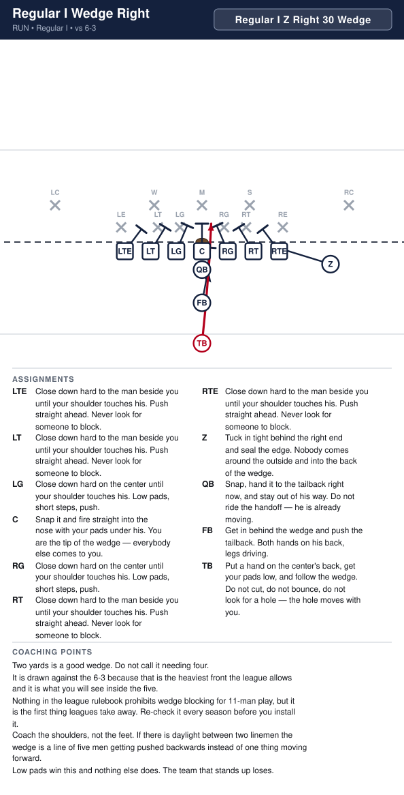

Short yardage and the goal line. Nobody blocks a man — the whole line squeezes shoulder to shoulder on the center and pushes. The tailback puts a hand on the center's back and goes wherever the pile goes.

| Position | Assignment |
|---|---|
| **LTE** | Close down hard to the man beside you until your shoulder touches his. Push straight ahead. Never look for someone to block. |
| **LT** | Close down hard to the man beside you until your shoulder touches his. Push straight ahead. Never look for someone to block. |
| **LG** | Close down hard on the center until your shoulder touches his. Low pads, short steps, push. |
| **C** | Snap it and fire straight into the nose with your pads under his. You are the tip of the wedge — everybody else comes to you. |
| **RG** | Close down hard on the center until your shoulder touches his. Low pads, short steps, push. |
| **RT** | Close down hard to the man beside you until your shoulder touches his. Push straight ahead. Never look for someone to block. |
| **RTE** | Close down hard to the man beside you until your shoulder touches his. Push straight ahead. Never look for someone to block. |
| **Z** | Tuck in tight behind the right end and seal the edge. Nobody comes around the outside and into the back of the wedge. |
| **QB** | Snap, hand it to the tailback right now, and stay out of his way. Do not ride the handoff — he is already moving. |
| **FB** | Get in behind the wedge and push the tailback. Both hands on his back, legs driving. |
| **TB** **(ball)** | Put a hand on the center's back, get your pads low, and follow the wedge. Do not cut, do not bounce, do not look for a hole — the hole moves with you. |

**Coaching points**

- Two yards is a good wedge. Do not call it needing four.
- It is drawn against the 6-3 because that is the heaviest front the league allows and it is what you will see inside the five.
- Nothing in the league rulebook prohibits wedge blocking for 11-man play, but it is the first thing leagues take away. Re-check it every season before you install it.
- Coach the shoulders, not the feet. If there is daylight between two linemen the wedge is a line of five men getting pushed backwards instead of one thing moving forward.
- Low pads win this and nothing else does. The team that stands up loses.

---

## Regular I Wedge Left

**Call it:** `Regular I Z Right 31 Wedge`

Short yardage and the goal line. Nobody blocks a man — the whole line squeezes shoulder to shoulder on the center and pushes. The tailback puts a hand on the center's back and goes wherever the pile goes.

| Position | Assignment |
|---|---|
| **LTE** | Close down hard to the man beside you until your shoulder touches his. Push straight ahead. Never look for someone to block. |
| **LT** | Close down hard to the man beside you until your shoulder touches his. Push straight ahead. Never look for someone to block. |
| **LG** | Close down hard on the center until your shoulder touches his. Low pads, short steps, push. |
| **C** | Snap it and fire straight into the nose with your pads under his. You are the tip of the wedge — everybody else comes to you. |
| **RG** | Close down hard on the center until your shoulder touches his. Low pads, short steps, push. |
| **RT** | Close down hard to the man beside you until your shoulder touches his. Push straight ahead. Never look for someone to block. |
| **RTE** | Close down hard to the man beside you until your shoulder touches his. Push straight ahead. Never look for someone to block. |
| **Z** | Tuck in tight behind the right end and seal the edge. Nobody comes around the outside and into the back of the wedge. |
| **QB** | Snap, hand it to the tailback left now, and stay out of his way. Do not ride the handoff — he is already moving. |
| **FB** | Get in behind the wedge and push the tailback. Both hands on his back, legs driving. |
| **TB** **(ball)** | Put a hand on the center's back, get your pads low, and follow the wedge. Do not cut, do not bounce, do not look for a hole — the hole moves with you. |

**Coaching points**

- Two yards is a good wedge. Do not call it needing four.
- It is drawn against the 6-3 because that is the heaviest front the league allows and it is what you will see inside the five.
- Nothing in the league rulebook prohibits wedge blocking for 11-man play, but it is the first thing leagues take away. Re-check it every season before you install it.
- Coach the shoulders, not the feet. If there is daylight between two linemen the wedge is a line of five men getting pushed backwards instead of one thing moving forward.
- Low pads win this and nothing else does. The team that stands up loses.

---

## Regular I Iso Right

**Call it:** `Regular I Z Right 32 Iso`

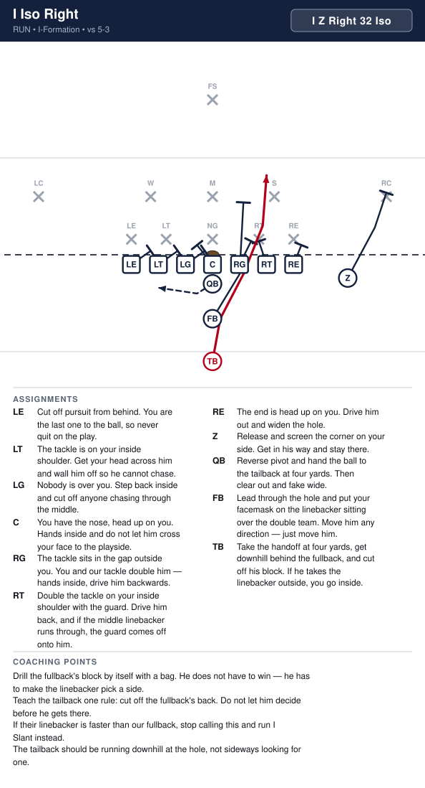

The whole play is one block: the fullback isolates their linebacker in the hole and the tailback runs off whichever way that block goes. It teaches a back to read a block, which is the skill this formation is here to build.

| Position | Assignment |
|---|---|
| **LTE** | Cut off pursuit from behind. You are the last one to the ball, so never quit on the play. |
| **LT** | The tackle is on your inside shoulder. Get your head across him and wall him off so he cannot chase. |
| **LG** | Nobody is over you. Step back inside and cut off anyone chasing through the middle. |
| **C** | You have the nose, head up on you. Hands inside and do not let him cross your face to the playside. |
| **RG** | The tackle sits in the gap outside you. You and our tackle double him — hands inside, drive him backwards. |
| **RT** | Double the tackle on your inside shoulder with the guard. Drive him back, and if the middle linebacker runs through, the guard comes off onto him. |
| **RTE** | The end is head up on you. Drive him out and widen the hole. |
| **Z** | Release and screen the corner on your side. Get in his way and stay there. |
| **QB** | Reverse pivot and hand the ball to the tailback at four yards. Then clear out and fake wide. |
| **FB** | Lead through the hole and put your facemask on the linebacker sitting over the double team. Move him any direction — just move him. |
| **TB** **(ball)** | Take the handoff at four yards, get downhill behind the fullback, and cut off his block. If he takes the linebacker outside, you go inside. |

**Coaching points**

- Drill the fullback's block by itself with a bag. He does not have to win — he has to make the linebacker pick a side.
- Teach the tailback one rule: cut off the fullback's back. Do not let him decide before he gets there.
- If their linebacker is faster than our fullback, stop calling this and run I Slant instead.
- The tailback should be running downhill at the hole, not sideways looking for one.

---

## Regular I Iso Left

**Call it:** `Regular I Z Right 33 Iso`

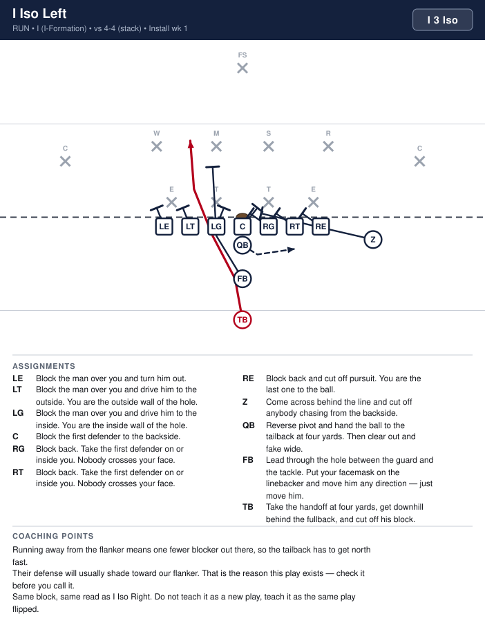

The same isolation block the other way. The Z stays where he is, so this runs away from our strength — which is exactly why it is open.

| Position | Assignment |
|---|---|
| **LTE** | The end is head up on you. Drive him out and widen the hole. |
| **LT** | Double the tackle on your inside shoulder with the guard. Drive him back, and if the middle linebacker runs through, the guard comes off onto him. |
| **LG** | The tackle sits in the gap outside you. You and our tackle double him — hands inside, drive him backwards. |
| **C** | You have the nose, head up on you. Hands inside and do not let him cross your face to the playside. |
| **RG** | Nobody is over you. Step back inside and cut off anyone chasing through the middle. |
| **RT** | The tackle is on your inside shoulder. Get your head across him and wall him off so he cannot chase. |
| **RTE** | Cut off pursuit from behind. You are the last one to the ball, so never quit on the play. |
| **Z** | Come across behind the line and cut off anybody chasing from the backside. |
| **QB** | Reverse pivot and hand the ball to the tailback at four yards. Then clear out and fake wide. |
| **FB** | Lead through the hole and put your facemask on the linebacker sitting over the double team. Move him any direction — just move him. |
| **TB** **(ball)** | Take the handoff at four yards, get downhill behind the fullback, and cut off his block. |

**Coaching points**

- Running away from the Z means one fewer blocker out there, so the tailback has to get north fast.
- Their defense will usually shade toward our Z. That is the reason this play exists — check it before you call it.
- Same block, same read as I Iso Right. Do not teach it as a new play, teach it as the same play flipped.

---

## Regular I Power Right

**Call it:** `Regular I Z Right 34 Power`

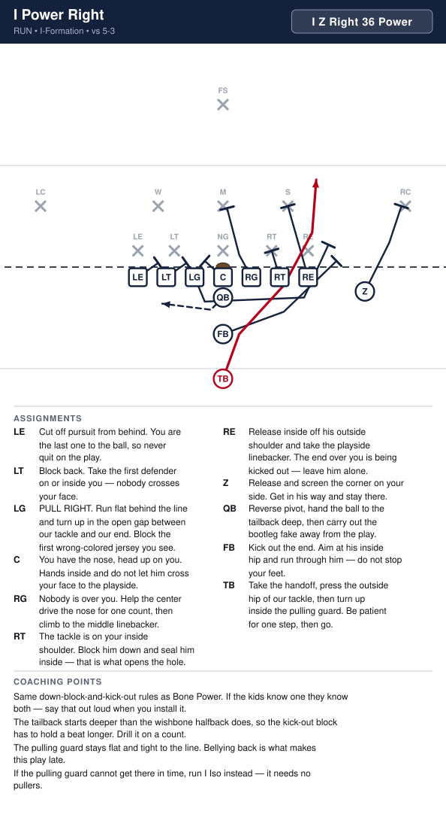

Our best downhill run. Everybody blocks down to the inside, the Z kicks the end out, and the backside guard pulls through the hole in front of the tailback. Two blockers arrive in the same gap before the linebackers do.

| Position | Assignment |
|---|---|
| **LTE** | Cut off pursuit from behind. You are the last one to the ball, so never quit on the play. |
| **LT** | Block back. Take the first defender on or inside you — nobody crosses your face. |
| **LG** | PULL RIGHT. Stay flat behind the line, turn up through the hole and block the first wrong shirt you see. Do not go around the pile — go through it. |
| **C** | You have the nose, head up on you. Hands inside and do not let him cross your face to the playside. |
| **RG** | Nobody is over you. Help the center drive the nose for one count, then climb to the middle linebacker. |
| **RT** | The tackle is on your inside shoulder. Block him down and seal him inside — that is what opens the hole. |
| **RTE** | Release inside off his outside shoulder and take the playside linebacker. The end over you is getting kicked out — leave him alone. |
| **Z** | Kick the end out. Aim at his outside hip and drive him toward the sideline. Everything runs inside of you, so never let him come underneath. |
| **QB** | Open to the right, hand it deep to the tailback, then carry out the boot fake to the edge. The fake is what keeps the backside end honest. |
| **FB** | Lead through the hole outside our tackle and block the first defender who shows in it. Get your head across him — do not wait for him to come to you. |
| **TB** **(ball)** | Take the handoff going downhill and aim at the outside hip of our tackle. Follow the fullback, then the guard. Stay tight to the blocks and do not bounce it outside. |

**Coaching points**

- This is the most physical run in the book. If it works you can run it fifteen times, and at this age you often can.
- Drill the Z's kick-out on its own. If he blocks the end with his shoulders square, the end slides underneath and makes the tackle for a loss — he has to attack the outside hip.
- The pulling guard is late by design. Tell him his man is the one who shows up in the hole, not a man he picks before the snap.
- The tailback's most common mistake is bouncing it wide looking for green grass. The yards are inside the Z's block. Make him run it tight in practice until it is automatic.

---

## Regular I Power Left

**Call it:** `Regular I Z Left 35 Power`

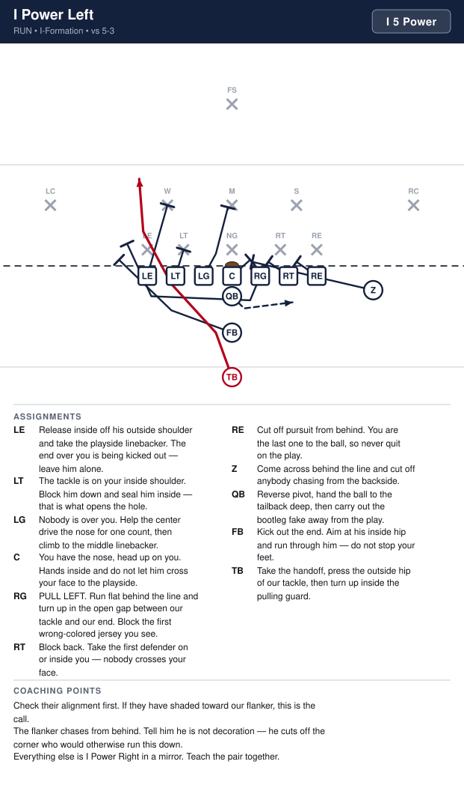

Power Right's exact mirror. The Z is fixed on the right in every other Regular I play, but Power depends on his kick-out block to work, so this is the one play in the book where he flips sides before the snap — lined up left, same job, same footwork, just facing the other way.

| Position | Assignment |
|---|---|
| **LTE** | Release inside off his outside shoulder and take the playside linebacker. The end over you is getting kicked out — leave him alone. |
| **LT** | The tackle is on your inside shoulder. Block him down and seal him inside — that is what opens the hole. |
| **LG** | Nobody is over you. Help the center drive the nose for one count, then climb to the middle linebacker. |
| **C** | You have the nose, head up on you. Hands inside and do not let him cross your face to the playside. |
| **RG** | PULL LEFT. Stay flat behind the line, turn up through the hole and block the first wrong shirt you see. Do not go around the pile — go through it. |
| **RT** | Block back. Take the first defender on or inside you — nobody crosses your face. |
| **RTE** | Cut off pursuit from behind. You are the last one to the ball, so never quit on the play. |
| **Z** | Kick the end out. Aim at his outside hip and drive him toward the sideline. Everything runs inside of you, so never let him come underneath. |
| **QB** | Open to the left, hand it deep to the tailback, then carry out the boot fake to the edge. The fake is what keeps the backside end honest. |
| **FB** | Lead through the hole outside our tackle and block the first defender who shows in it. Get your head across him — do not wait for him to come to you. |
| **TB** **(ball)** | Take the handoff going downhill and aim at the outside hip of our tackle. Follow the fullback, then the guard. Stay tight to the blocks and do not bounce it outside. |

**Coaching points**

- This is the most physical run in the book, mirrored. If it works going right, it works going left — the blocking is identical, just flipped.
- The Z is used to lining up on the right. Make sure he actually moves before the snap on this call and does not just run the block from where he always stands.
- Drill the Z's kick-out on its own, same as the other direction. If he blocks the end with his shoulders square, the end slides underneath and makes the tackle for a loss — he has to attack the outside hip.
- The pulling guard is late by design, same as the other direction. Tell him his man is the one who shows up in the hole, not a man he picks before the snap.
- The tailback's most common mistake is bouncing it wide looking for green grass. The yards are inside the Z's block, same as Power Right. Make him run it tight in practice until it is automatic.

---

## Regular I Counter Right

**Call it:** `Regular I Z Right 34 Counter`

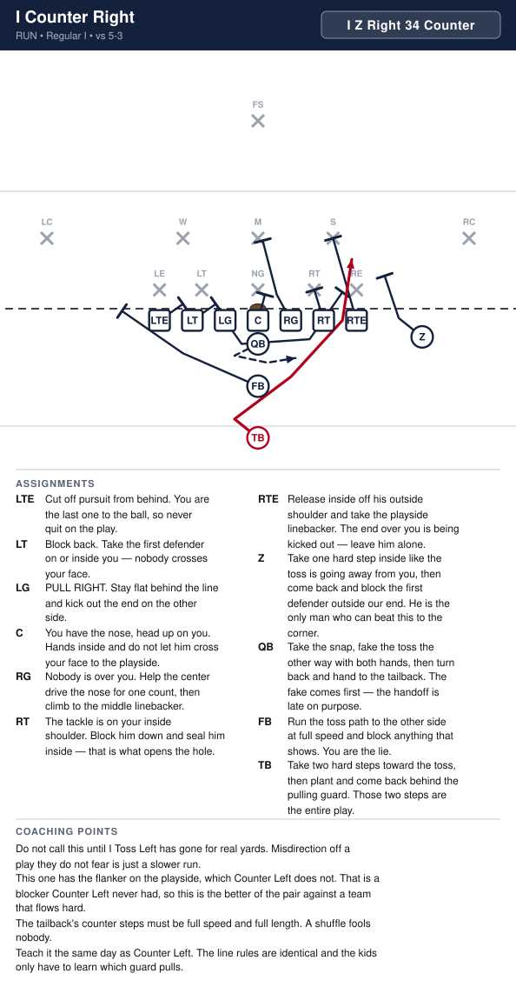

Counter Left the other way. We show them the toss to the weak side, their linebackers chase it, and the tailback plants and comes back to the Z side behind a pulling guard.

| Position | Assignment |
|---|---|
| **LTE** | Cut off pursuit from behind. You are the last one to the ball, so never quit on the play. |
| **LT** | Block back. Take the first defender on or inside you — nobody crosses your face. |
| **LG** | PULL RIGHT. Stay flat behind the line and kick out the end on the other side. |
| **C** | You have the nose, head up on you. Hands inside and do not let him cross your face to the playside. |
| **RG** | Nobody is over you. Help the center drive the nose for one count, then climb to the middle linebacker. |
| **RT** | The tackle is on your inside shoulder. Block him down and seal him inside — that is what opens the hole. |
| **RTE** | Release inside off his outside shoulder and take the playside linebacker. The end over you is being kicked out — leave him alone. |
| **Z** | Take one hard step inside like the toss is going away from you, then come back and block the first defender outside our end. He is the only man who can beat this to the corner. |
| **QB** | Take the snap, fake the toss the other way with both hands, then turn back and hand to the tailback. The fake comes first — the handoff is late on purpose. |
| **FB** | Run the toss path to the other side at full speed and block anything that shows. You are the lie. |
| **TB** **(ball)** | Take two hard steps toward the toss, then plant and come back behind the pulling guard. Those two steps are the entire play. |

**Coaching points**

- Do not call this until I Toss Left has gone for real yards. Misdirection off a play they do not fear is just a slower run.
- This one has the Z on the playside, which Counter Left does not. That is a blocker Counter Left never had, so this is the better of the pair against a team that flows hard.
- The tailback's counter steps must be full speed and full length. A shuffle fools nobody.
- Teach it the same day as Counter Left. The line rules are identical and the kids only have to learn which guard pulls.

---

## Regular I Counter Left

**Call it:** `Regular I Z Right 35 Counter`

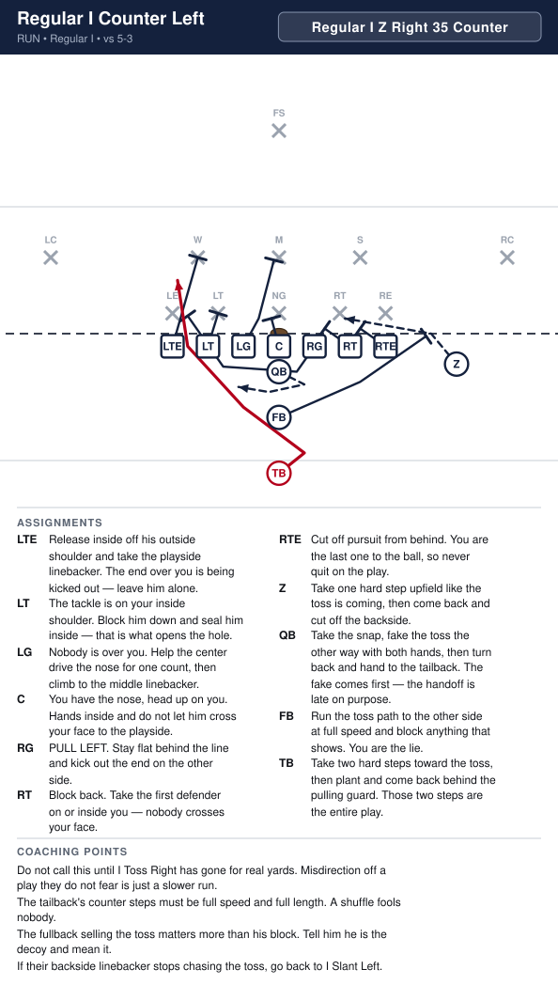

Misdirection off the toss. We show them the toss to the Z side, their linebackers chase, and the tailback plants and comes back weak behind a pulling guard.

| Position | Assignment |
|---|---|
| **LTE** | Release inside off his outside shoulder and take the playside linebacker. The end over you is being kicked out — leave him alone. |
| **LT** | The tackle is on your inside shoulder. Block him down and seal him inside — that is what opens the hole. |
| **LG** | Nobody is over you. Help the center drive the nose for one count, then climb to the middle linebacker. |
| **C** | You have the nose, head up on you. Hands inside and do not let him cross your face to the playside. |
| **RG** | PULL LEFT. Stay flat behind the line and kick out the end on the other side. |
| **RT** | Block back. Take the first defender on or inside you — nobody crosses your face. |
| **RTE** | Cut off pursuit from behind. You are the last one to the ball, so never quit on the play. |
| **Z** | Take one hard step upfield like the toss is coming, then come back and cut off the backside. |
| **QB** | Take the snap, fake the toss the other way with both hands, then turn back and hand to the tailback. The fake comes first — the handoff is late on purpose. |
| **FB** | Run the toss path to the other side at full speed and block anything that shows. You are the lie. |
| **TB** **(ball)** | Take two hard steps toward the toss, then plant and come back behind the pulling guard. Those two steps are the entire play. |

**Coaching points**

- Do not call this until I Toss Right has gone for real yards. Misdirection off a play they do not fear is just a slower run.
- The tailback's counter steps must be full speed and full length. A shuffle fools nobody.
- The fullback selling the toss matters more than his block. Tell him he is the decoy and mean it.
- If their backside linebacker stops chasing the toss, go back to I Slant Left.

---

## Regular I Boot Right

**Call it:** `Regular I Z Right 16 Boot`

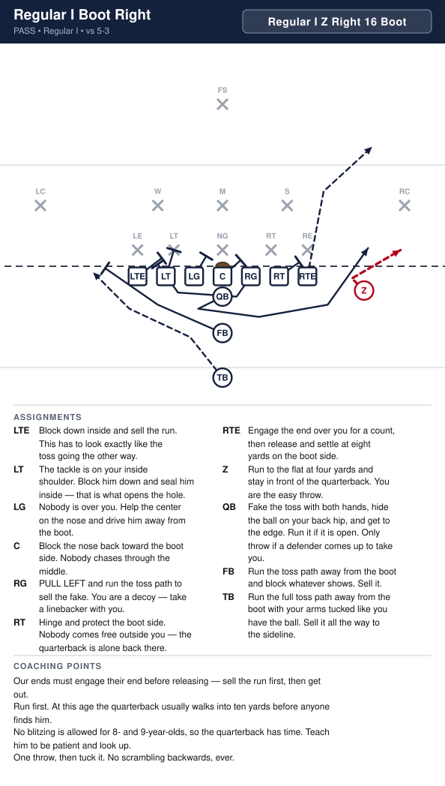

Play action off the toss look. Two receivers to the Z side and a quarterback with the whole edge to himself. Run first, throw second.

| Position | Assignment |
|---|---|
| **LTE** | Block down inside and sell the run. This has to look exactly like the toss going the other way. |
| **LT** | The tackle is on your inside shoulder. Block him down and seal him inside — that is what opens the hole. |
| **LG** | Nobody is over you. Help the center on the nose and drive him away from the boot. |
| **C** | Block the nose back toward the boot side. Nobody chases through the middle. |
| **RG** | PULL LEFT and run the toss path to sell the fake. You are a decoy — take a linebacker with you. |
| **RT** | Hinge and protect the boot side. Nobody comes free outside you — the quarterback is alone back there. |
| **RTE** | Engage the end over you for a count, then release and settle at eight yards on the boot side. |
| **Z** **(ball)** | Run to the flat at four yards and stay in front of the quarterback. You are the easy throw. |
| **QB** | Fake the toss with both hands, hide the ball on your back hip, and get to the edge. Run it if it is open. Only throw if a defender comes up to take you. |
| **FB** | Run the toss path away from the boot and block whatever shows. Sell it. |
| **TB** | Run the full toss path away from the boot with your arms tucked like you have the ball. Sell it all the way to the sideline. |

**Coaching points**

- Our ends must engage their end before releasing — sell the run first, then get out.
- Run first. At this age the quarterback usually walks into ten yards before anyone finds him.
- No blitzing is allowed for 8- and 9-year-olds, so the quarterback has time. Teach him to be patient and look up.
- One throw, then tuck it. No scrambling backwards, ever.

---

## Regular I Boot Left

**Call it:** `Regular I Z Right 17 Boot`

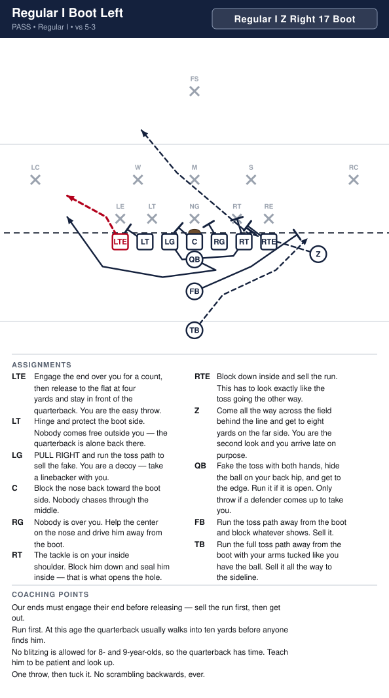

Boot Left off the toss action. The line and both backs sell the toss going right, and the quarterback keeps it and gets to the left edge alone — the tight end in the flat in front of him and the Z coming all the way across behind. Run first, throw second.

| Position | Assignment |
|---|---|
| **LTE** **(ball)** | Engage the end over you for a count, then release to the flat at four yards and stay in front of the quarterback. You are the easy throw. |
| **LT** | Hinge and protect the boot side. Nobody comes free outside you — the quarterback is alone back there. |
| **LG** | PULL RIGHT and run the toss path to sell the fake. You are a decoy — take a linebacker with you. |
| **C** | Block the nose back toward the boot side. Nobody chases through the middle. |
| **RG** | Nobody is over you. Help the center on the nose and drive him away from the boot. |
| **RT** | The tackle is on your inside shoulder. Block him down and seal him inside — that is what opens the hole. |
| **RTE** | Block down inside and sell the run. This has to look exactly like the toss going the other way. |
| **Z** | Come all the way across the field behind the line and get to eight yards on the far side. You are the second look and you arrive late on purpose. |
| **QB** | Fake the toss with both hands, hide the ball on your back hip, and get to the edge. Run it if it is open. Only throw if a defender comes up to take you. |
| **FB** | Run the toss path away from the boot and block whatever shows. Sell it. |
| **TB** | Run the full toss path away from the boot with your arms tucked like you have the ball. Sell it all the way to the sideline. |

**Coaching points**

- Our ends must engage their end before releasing — sell the run first, then get out.
- Run first. At this age the quarterback usually walks into ten yards before anyone finds him.
- No blitzing is allowed for 8- and 9-year-olds, so the quarterback has time. Teach him to be patient and look up.
- One throw, then tuck it. No scrambling backwards, ever.

---

## Regular I Waggle Right

**Call it:** `Regular I Z Right 16 Waggle`

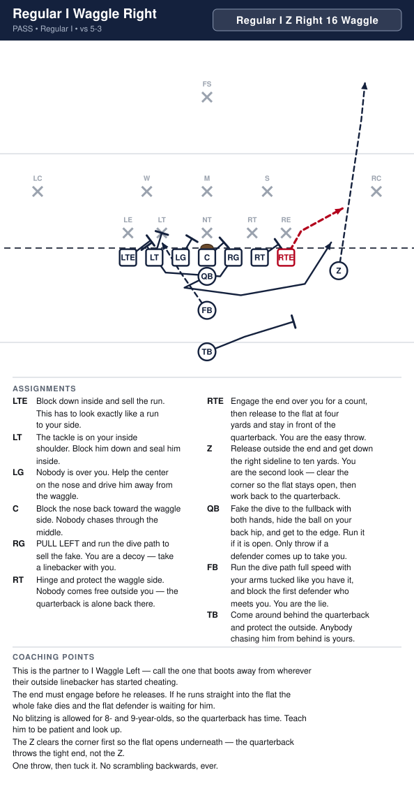

Waggle Right off the dive fake. The quarterback fakes the dive and boots to the right edge, with the tight end in the flat in front of him and the Z clearing the corner over the top. Run first, throw second.

| Position | Assignment |
|---|---|
| **LTE** | Block down inside and sell the run. This has to look exactly like a run to your side. |
| **LT** | The tackle is on your inside shoulder. Block him down and seal him inside. |
| **LG** | Nobody is over you. Help the center on the nose and drive him away from the waggle. |
| **C** | Block the nose back toward the waggle side. Nobody chases through the middle. |
| **RG** | PULL LEFT and run the dive path to sell the fake. You are a decoy — take a linebacker with you. |
| **RT** | Hinge and protect the waggle side. Nobody comes free outside you — the quarterback is alone back there. |
| **RTE** **(ball)** | Engage the end over you for a count, then release to the flat at four yards and stay in front of the quarterback. You are the easy throw. |
| **Z** | Release outside the end and get down the right sideline to ten yards. You are the second look — clear the corner so the flat stays open, then work back to the quarterback. |
| **QB** | Fake the dive to the fullback with both hands, hide the ball on your back hip, and get to the edge. Run it if it is open. Only throw if a defender comes up to take you. |
| **FB** | Run the dive path full speed with your arms tucked like you have it, and block the first defender who meets you. You are the lie. |
| **TB** | Come around behind the quarterback and protect the outside. Anybody chasing him from behind is yours. |

**Coaching points**

- This is the partner to I Waggle Left — call the one that boots away from wherever their outside linebacker has started cheating.
- The end must engage before he releases. If he runs straight into the flat the whole fake dies and the flat defender is waiting for him.
- No blitzing is allowed for 8- and 9-year-olds, so the quarterback has time. Teach him to be patient and look up.
- The Z clears the corner first so the flat opens underneath — the quarterback throws the tight end, not the Z.
- One throw, then tuck it. No scrambling backwards, ever.

---

## Regular I Waggle Left

**Call it:** `Regular I Z Right 17 Waggle`

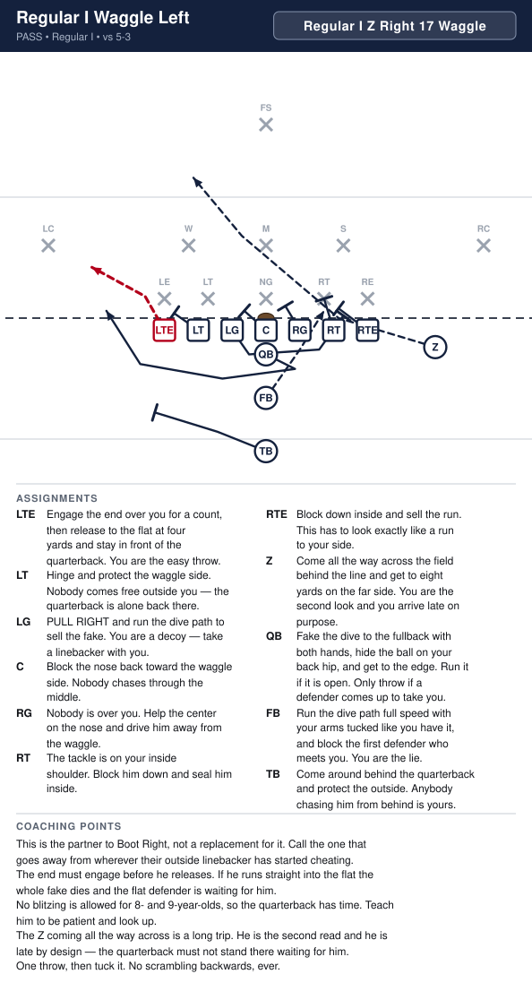

Boot Right the other way. The quarterback fakes the dive and gets to the weak edge with the end in the flat in front of him and the Z coming all the way across behind. Run first, throw second.

| Position | Assignment |
|---|---|
| **LTE** **(ball)** | Engage the end over you for a count, then release to the flat at four yards and stay in front of the quarterback. You are the easy throw. |
| **LT** | Hinge and protect the waggle side. Nobody comes free outside you — the quarterback is alone back there. |
| **LG** | PULL RIGHT and run the dive path to sell the fake. You are a decoy — take a linebacker with you. |
| **C** | Block the nose back toward the waggle side. Nobody chases through the middle. |
| **RG** | Nobody is over you. Help the center on the nose and drive him away from the waggle. |
| **RT** | The tackle is on your inside shoulder. Block him down and seal him inside. |
| **RTE** | Block down inside and sell the run. This has to look exactly like a run to your side. |
| **Z** | Come all the way across the field behind the line and get to eight yards on the far side. You are the second look and you arrive late on purpose. |
| **QB** | Fake the dive to the fullback with both hands, hide the ball on your back hip, and get to the edge. Run it if it is open. Only throw if a defender comes up to take you. |
| **FB** | Run the dive path full speed with your arms tucked like you have it, and block the first defender who meets you. You are the lie. |
| **TB** | Come around behind the quarterback and protect the outside. Anybody chasing him from behind is yours. |

**Coaching points**

- This is the partner to Boot Right, not a replacement for it. Call the one that goes away from wherever their outside linebacker has started cheating.
- The end must engage before he releases. If he runs straight into the flat the whole fake dies and the flat defender is waiting for him.
- No blitzing is allowed for 8- and 9-year-olds, so the quarterback has time. Teach him to be patient and look up.
- The Z coming all the way across is a long trip. He is the second read and he is late by design — the quarterback must not stand there waiting for him.
- One throw, then tuck it. No scrambling backwards, ever.

---

## Regular I Jet Boot Right

**Call it:** `Regular I Z Right 16 Jet Boot`

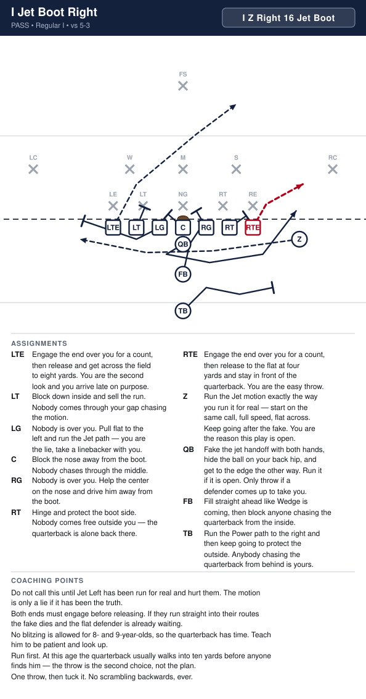

Jet motion pulls the whole defense one way and the quarterback keeps it the other. This is the play Jet Left is really setting up, and at this age the edge is usually empty.

| Position | Assignment |
|---|---|
| **LTE** | Engage the end over you for a count, then release and get across the field to eight yards. You are the second look and you arrive late on purpose. |
| **LT** | Block down inside and sell the run. Nobody comes through your gap chasing the motion. |
| **LG** | Nobody is over you. Pull flat to the left and run the Jet path — you are the lie, take a linebacker with you. |
| **C** | Block the nose away from the boot. Nobody chases through the middle. |
| **RG** | Nobody is over you. Help the center on the nose and drive him away from the boot. |
| **RT** | Hinge and protect the boot side. Nobody comes free outside you — the quarterback is alone back there. |
| **RTE** **(ball)** | Engage the end over you for a count, then release to the flat at four yards and stay in front of the quarterback. You are the easy throw. |
| **Z** | Run the Jet motion exactly the way you run it for real — start on the same call, full speed, flat across. Keep going after the fake. You are the reason this play is open. |
| **QB** | Fake the jet handoff with both hands, hide the ball on your back hip, and get to the edge the other way. Run it if it is open. Only throw if a defender comes up to take you. |
| **FB** | Fill straight ahead like Wedge is coming, then block anyone chasing the quarterback from the inside. |
| **TB** | Run the Power path to the right and then keep going to protect the outside. Anybody chasing the quarterback from behind is yours. |

**Coaching points**

- Do not call this until Jet Left has been run for real and hurt them. The motion is only a lie if it has been the truth.
- Both ends must engage before releasing. If they run straight into their routes the fake dies and the flat defender is already waiting.
- No blitzing is allowed for 8- and 9-year-olds, so the quarterback has time. Teach him to be patient and look up.
- Run first. At this age the quarterback usually walks into ten yards before anyone finds him — the throw is the second choice, not the plan.
- One throw, then tuck it. No scrambling backwards, ever.

---

## Regular I Jet Boot Left

**Call it:** `Regular I Z Right 17 Jet Boot`

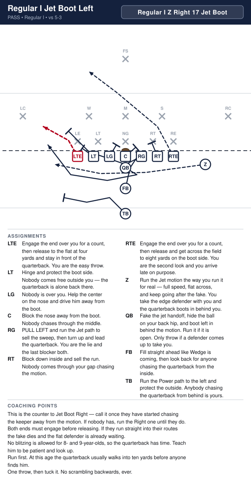

The change-up to Jet Boot Right. The Z runs the jet the same way, but this time the quarterback keeps it and boots in behind the motion instead of away from it. The end who has been squeezing the keeper the other way is the one it beats.

| Position | Assignment |
|---|---|
| **LTE** **(ball)** | Engage the end over you for a count, then release to the flat at four yards and stay in front of the quarterback. You are the easy throw. |
| **LT** | Hinge and protect the boot side. Nobody comes free outside you — the quarterback is alone back there. |
| **LG** | Nobody is over you. Help the center on the nose and drive him away from the boot. |
| **C** | Block the nose away from the boot. Nobody chases through the middle. |
| **RG** | PULL LEFT and run the Jet path to sell the sweep, then turn up and lead the quarterback. You are the lie and the last blocker both. |
| **RT** | Block down inside and sell the run. Nobody comes through your gap chasing the motion. |
| **RTE** | Engage the end over you for a count, then release and get across the field to eight yards on the boot side. You are the second look and you arrive late on purpose. |
| **Z** | Run the Jet motion the way you run it for real — full speed, flat across, and keep going after the fake. You take the edge defender with you and the quarterback boots in behind you. |
| **QB** | Fake the jet handoff, hide the ball on your back hip, and boot left in behind the motion. Run it if it is open. Only throw if a defender comes up to take you. |
| **FB** | Fill straight ahead like Wedge is coming, then look back for anyone chasing the quarterback from the inside. |
| **TB** | Run the Power path to the left and protect the outside. Anybody chasing the quarterback from behind is yours. |

**Coaching points**

- This is the counter to Jet Boot Right — call it once they have started chasing the keeper away from the motion. If nobody has, run the Right one until they do.
- Both ends must engage before releasing. If they run straight into their routes the fake dies and the flat defender is already waiting.
- No blitzing is allowed for 8- and 9-year-olds, so the quarterback has time. Teach him to be patient and look up.
- Run first. At this age the quarterback usually walks into ten yards before anyone finds him.
- One throw, then tuck it. No scrambling backwards, ever.

---

## Regular I Power Boot Right

**Call it:** `Regular I Z Right 16 Power Boot`

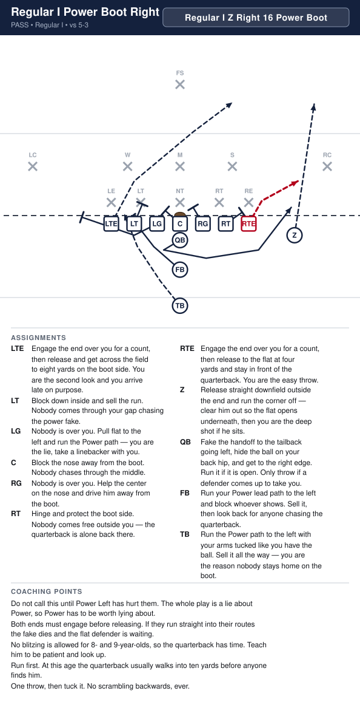

Boot Right off the Power look. Everybody flows left selling Power, and the quarterback keeps it and gets to the right edge on his own, with the tight end in the flat in front of him and the backside end coming across behind. Run first, throw second.

| Position | Assignment |
|---|---|
| **LTE** | Engage the end over you for a count, then release and get across the field to eight yards on the boot side. You are the second look and you arrive late on purpose. |
| **LT** | Block down inside and sell the run. Nobody comes through your gap chasing the power fake. |
| **LG** | Nobody is over you. Pull flat to the left and run the Power path — you are the lie, take a linebacker with you. |
| **C** | Block the nose away from the boot. Nobody chases through the middle. |
| **RG** | Nobody is over you. Help the center on the nose and drive him away from the boot. |
| **RT** | Hinge and protect the boot side. Nobody comes free outside you — the quarterback is alone back there. |
| **RTE** **(ball)** | Engage the end over you for a count, then release to the flat at four yards and stay in front of the quarterback. You are the easy throw. |
| **Z** | Release straight downfield outside the end and run the corner off — clear him out so the flat opens underneath, then you are the deep shot if he sits. |
| **QB** | Fake the handoff to the tailback going left, hide the ball on your back hip, and get to the right edge. Run it if it is open. Only throw if a defender comes up to take you. |
| **FB** | Run your Power lead path to the left and block whoever shows. Sell it, then look back for anyone chasing the quarterback. |
| **TB** | Run the Power path to the left with your arms tucked like you have the ball. Sell it all the way — you are the reason nobody stays home on the boot. |

**Coaching points**

- Do not call this until Power Left has hurt them. The whole play is a lie about Power, so Power has to be worth lying about.
- Both ends must engage before releasing. If they run straight into their routes the fake dies and the flat defender is waiting.
- No blitzing is allowed for 8- and 9-year-olds, so the quarterback has time. Teach him to be patient and look up.
- Run first. At this age the quarterback usually walks into ten yards before anyone finds him.
- One throw, then tuck it. No scrambling backwards, ever.

---

## Regular I Power Boot Left

**Call it:** `Regular I Z Right 17 Power Boot`

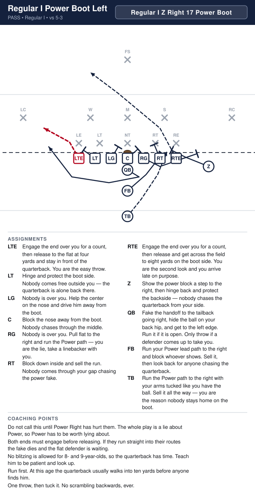

Boot Left off the Power look. Everybody flows right selling Power, and the quarterback keeps it and gets to the left edge on his own, with the tight end in the flat in front of him and the backside end coming across behind. Run first, throw second.

| Position | Assignment |
|---|---|
| **LTE** **(ball)** | Engage the end over you for a count, then release to the flat at four yards and stay in front of the quarterback. You are the easy throw. |
| **LT** | Hinge and protect the boot side. Nobody comes free outside you — the quarterback is alone back there. |
| **LG** | Nobody is over you. Help the center on the nose and drive him away from the boot. |
| **C** | Block the nose away from the boot. Nobody chases through the middle. |
| **RG** | Nobody is over you. Pull flat to the right and run the Power path — you are the lie, take a linebacker with you. |
| **RT** | Block down inside and sell the run. Nobody comes through your gap chasing the power fake. |
| **RTE** | Engage the end over you for a count, then release and get across the field to eight yards on the boot side. You are the second look and you arrive late on purpose. |
| **Z** | Show the power block a step to the right, then hinge back and protect the backside — nobody chases the quarterback from your side. |
| **QB** | Fake the handoff to the tailback going right, hide the ball on your back hip, and get to the left edge. Run it if it is open. Only throw if a defender comes up to take you. |
| **FB** | Run your Power lead path to the right and block whoever shows. Sell it, then look back for anyone chasing the quarterback. |
| **TB** | Run the Power path to the right with your arms tucked like you have the ball. Sell it all the way — you are the reason nobody stays home on the boot. |

**Coaching points**

- Do not call this until Power Right has hurt them. The whole play is a lie about Power, so Power has to be worth lying about.
- Both ends must engage before releasing. If they run straight into their routes the fake dies and the flat defender is waiting.
- No blitzing is allowed for 8- and 9-year-olds, so the quarterback has time. Teach him to be patient and look up.
- Run first. At this age the quarterback usually walks into ten yards before anyone finds him.
- One throw, then tuck it. No scrambling backwards, ever.

---

## Regular I Slant Right

**Call it:** `Regular I Z Right 36 Slant`

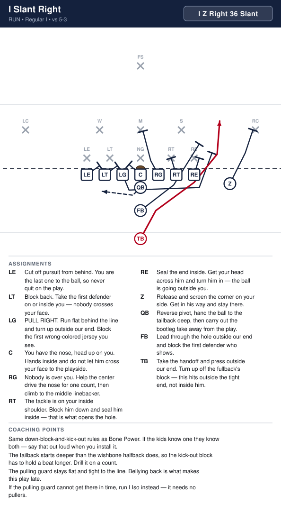

Off the tight end. Our end seals their end inside, the guard pulls and turns up outside him, and the fullback leads through the hole. The tailback presses outside our end and turns up — this is the run that hits just wide of the formation, not between the tackle and the end.

| Position | Assignment |
|---|---|
| **LTE** | Cut off pursuit from behind. You are the last one to the ball, so never quit on the play. |
| **LT** | Block back. Take the first defender on or inside you — nobody crosses your face. |
| **LG** | PULL RIGHT. Run flat behind the line and turn up outside our end. Block the first wrong-colored jersey you see. |
| **C** | You have the nose, head up on you. Hands inside and do not let him cross your face to the playside. |
| **RG** | Nobody is over you. Help the center drive the nose for one count, then climb to the middle linebacker. |
| **RT** | The tackle is on your inside shoulder. Block him down and seal him inside — that is what opens the hole. |
| **RTE** | Seal the end inside. Get your head across him and turn him in — the ball is going outside you. |
| **Z** | Release and screen the corner on your side. Get in his way and stay there. |
| **QB** | Reverse pivot, hand the ball to the tailback deep, then carry out the bootleg fake away from the play. |
| **FB** | Lead through the hole outside our end and block the first defender who shows. |
| **TB** **(ball)** | Take the handoff and press outside our end. Turn up off the fullback's block — this hits outside the tight end, not inside him. |

**Coaching points**

- Same down-block-and-kick-out rules as Split Power. If the kids know one they know both — say that out loud when you install it.
- The tailback starts deeper than a split back does, so the kick-out block has to hold a beat longer. Drill it on a count.
- The pulling guard stays flat and tight to the line. Bellying back is what makes this play late.
- If the pulling guard cannot get there in time, run I Iso instead — it needs no pullers.

---

## Regular I Slant Left

**Call it:** `Regular I Z Right 37 Slant`

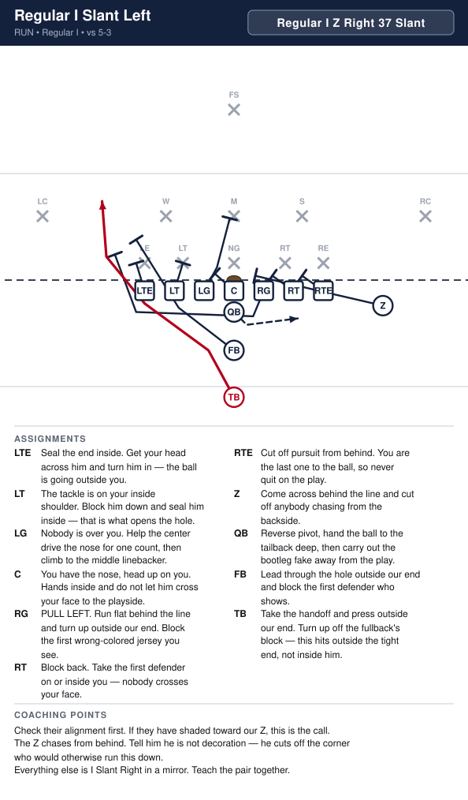

Off the tight end. Our end seals their end inside, the guard pulls and turns up outside him, and the fullback leads through the hole. The tailback presses outside our end and turns up — this is the run that hits just wide of the formation, not between the tackle and the end.

| Position | Assignment |
|---|---|
| **LTE** | Seal the end inside. Get your head across him and turn him in — the ball is going outside you. |
| **LT** | The tackle is on your inside shoulder. Block him down and seal him inside — that is what opens the hole. |
| **LG** | Nobody is over you. Help the center drive the nose for one count, then climb to the middle linebacker. |
| **C** | You have the nose, head up on you. Hands inside and do not let him cross your face to the playside. |
| **RG** | PULL LEFT. Run flat behind the line and turn up outside our end. Block the first wrong-colored jersey you see. |
| **RT** | Block back. Take the first defender on or inside you — nobody crosses your face. |
| **RTE** | Cut off pursuit from behind. You are the last one to the ball, so never quit on the play. |
| **Z** | Come across behind the line and cut off anybody chasing from the backside. |
| **QB** | Reverse pivot, hand the ball to the tailback deep, then carry out the bootleg fake away from the play. |
| **FB** | Lead through the hole outside our end and block the first defender who shows. |
| **TB** **(ball)** | Take the handoff and press outside our end. Turn up off the fullback's block — this hits outside the tight end, not inside him. |

**Coaching points**

- Check their alignment first. If they have shaded toward our Z, this is the call.
- The Z chases from behind. Tell him he is not decoration — he cuts off the corner who would otherwise run this down.
- Everything else is I Slant Right in a mirror. Teach the pair together.

---

## Regular I Toss Right

**Call it:** `Regular I Z Right 38 Toss`

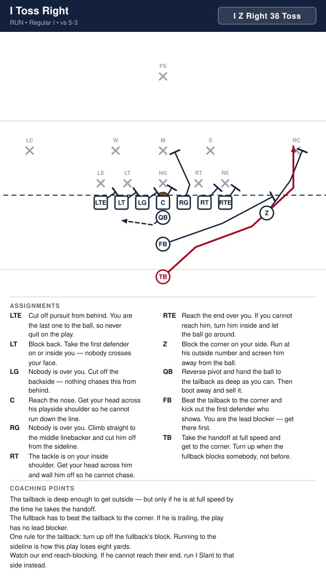

Get all the way outside. Wider than the Slant — the tailback takes the handoff at full speed and runs past the tight end's block to the corner, with the fullback out in front of him.

| Position | Assignment |
|---|---|
| **LTE** | Cut off pursuit from behind. You are the last one to the ball, so never quit on the play. |
| **LT** | Block back. Take the first defender on or inside you — nobody crosses your face. |
| **LG** | Nobody is over you. Cut off the backside — nothing chases this from behind. |
| **C** | Reach the nose. Get your head across his playside shoulder so he cannot run down the line. |
| **RG** | Nobody is over you. Climb straight to the middle linebacker and cut him off from the sideline. |
| **RT** | The tackle is on your inside shoulder. Get your head across him and wall him off so he cannot chase. |
| **RTE** | Reach the end over you. If you cannot reach him, turn him inside and let the ball go around. |
| **Z** | Block the corner on your side. Run at his outside number and screen him away from the ball. |
| **QB** | Reverse pivot and hand the ball to the tailback as deep as you can. Then boot away and sell it. |
| **FB** | Beat the tailback to the corner and kick out the first defender who shows. You are the lead blocker — get there first. |
| **TB** **(ball)** | Take the handoff at full speed and get to the corner. Turn up when the fullback blocks somebody, not before. |

**Coaching points**

- The tailback is deep enough to get outside — but only if he is at full speed by the time he takes the handoff.
- The fullback has to beat the tailback to the corner. If he is trailing, the play has no lead blocker.
- One rule for the tailback: turn up off the fullback's block. Running to the sideline is how this play loses eight yards.
- Watch our end reach-blocking. If he cannot reach their end, run I Slant to that side instead.

---

## Regular I Toss Left

**Call it:** `Regular I Z Right 39 Toss`

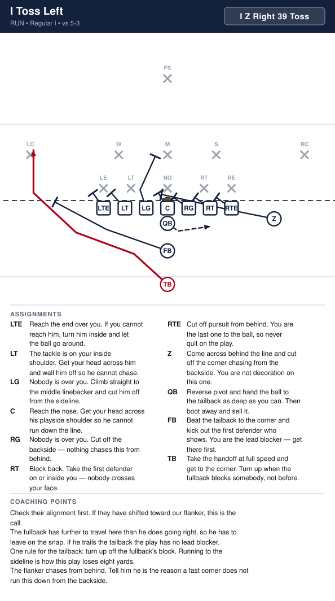

Get all the way outside. Wider than the Slant — the tailback takes the handoff at full speed and runs past the tight end's block to the corner, with the fullback out in front of him.

| Position | Assignment |
|---|---|
| **LTE** | Reach the end over you. If you cannot reach him, turn him inside and let the ball go around. |
| **LT** | The tackle is on your inside shoulder. Get your head across him and wall him off so he cannot chase. |
| **LG** | Nobody is over you. Climb straight to the middle linebacker and cut him off from the sideline. |
| **C** | Reach the nose. Get your head across his playside shoulder so he cannot run down the line. |
| **RG** | Nobody is over you. Cut off the backside — nothing chases this from behind. |
| **RT** | Block back. Take the first defender on or inside you — nobody crosses your face. |
| **RTE** | Cut off pursuit from behind. You are the last one to the ball, so never quit on the play. |
| **Z** | Come across behind the line and cut off the corner chasing from the backside. You are not decoration on this one. |
| **QB** | Reverse pivot and hand the ball to the tailback as deep as you can. Then boot away and sell it. |
| **FB** | Beat the tailback to the corner and kick out the first defender who shows. You are the lead blocker — get there first. |
| **TB** **(ball)** | Take the handoff at full speed and get to the corner. Turn up when the fullback blocks somebody, not before. |

**Coaching points**

- Check their alignment first. If they have shifted toward our Z, this is the call.
- The fullback has further to travel here than he does going right, so he has to leave on the snap. If he trails the tailback the play has no lead blocker.
- One rule for the tailback: turn up off the fullback's block. Running to the sideline is how this play loses eight yards.
- The Z chases from behind. Tell him he is the reason a fast corner does not run this down from the backside.

---

## Regular I Jet Right

**Call it:** `Regular I Z Right 48 Jet`

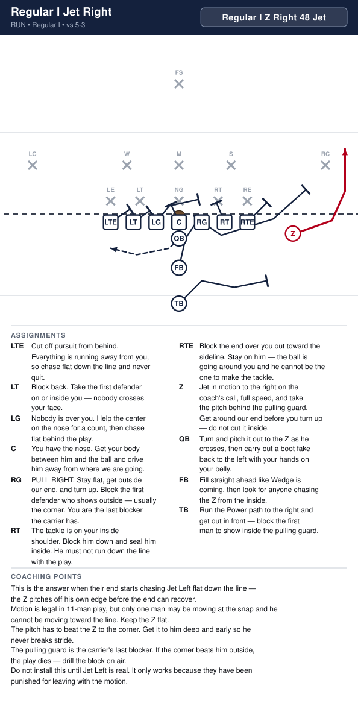

The Z keeps it to his own side. Jet Left has been taking the ball away from the Z all game; here he takes the quick pitch right back around his own end, where the defense has stopped honouring him.

| Position | Assignment |
|---|---|
| **LTE** | Cut off pursuit from behind. Everything is running away from you, so chase flat down the line and never quit. |
| **LT** | Block back. Take the first defender on or inside you — nobody crosses your face. |
| **LG** | Nobody is over you. Help the center on the nose for a count, then chase flat behind the play. |
| **C** | You have the nose. Get your body between him and the ball and drive him away from where we are going. |
| **RG** | PULL RIGHT. Stay flat, get outside our end, and turn up. Block the first defender who shows outside — usually the corner. You are the last blocker the carrier has. |
| **RT** | The tackle is on your inside shoulder. Block him down and seal him inside. He must not run down the line with the play. |
| **RTE** | Block the end over you out toward the sideline. Stay on him — the ball is going around you and he cannot be the one to make the tackle. |
| **Z** **(ball)** | Jet in motion to the right on the coach's call, full speed, and take the pitch behind the pulling guard. Get around our end before you turn up — do not cut it inside. |
| **QB** | Turn and pitch it out to the Z as he crosses, then carry out a boot fake back to the left with your hands on your belly. |
| **FB** | Fill straight ahead like Wedge is coming, then look for anyone chasing the Z from the inside. |
| **TB** | Run the Power path to the right and get out in front — block the first man to show inside the pulling guard. |

**Coaching points**

- This is the answer when their end starts chasing Jet Left flat down the line — the Z pitches off his own edge before the end can recover.
- Motion is legal in 11-man play, but only one man may be moving at the snap and he cannot be moving toward the line. Keep the Z flat.
- The pitch has to beat the Z to the corner. Get it to him deep and early so he never breaks stride.
- The pulling guard is the carrier's last blocker. If the corner beats him outside, the play dies — drill the block on air.
- Do not install this until Jet Left is real. It only works because they have been punished for leaving with the motion.

---

## Regular I Jet Left

**Call it:** `Regular I Z Right 49 Jet`

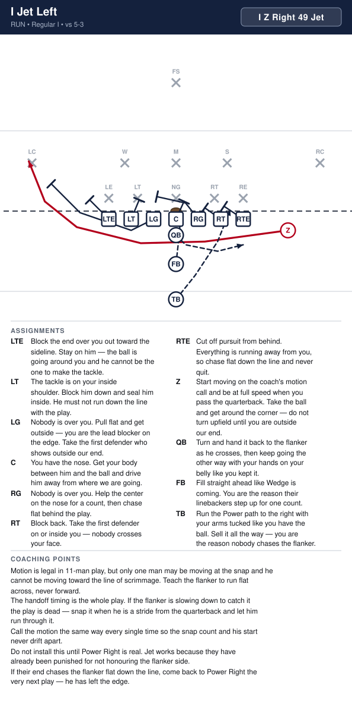

The Z goes in motion across the formation and takes the handoff at full speed going the other way. The defense has spent all day watching Power go to the Z side, and this is the same look leaving in the opposite direction.

| Position | Assignment |
|---|---|
| **LTE** | Block the end over you out toward the sideline. Stay on him — the ball is going around you and he cannot be the one to make the tackle. |
| **LT** | The tackle is on your inside shoulder. Block him down and seal him inside. He must not run down the line with the play. |
| **LG** | Nobody is over you. Pull flat and get outside — you are the lead blocker on the edge. Take the first defender who shows outside our end. |
| **C** | You have the nose. Get your body between him and the ball and drive him away from where we are going. |
| **RG** | Nobody is over you. Help the center on the nose for a count, then chase flat behind the play. |
| **RT** | Block back. Take the first defender on or inside you — nobody crosses your face. |
| **RTE** | Cut off pursuit from behind. Everything is running away from you, so chase flat down the line and never quit. |
| **Z** **(ball)** | Start moving on the coach's motion call and be at full speed when you pass the quarterback. Take the ball and get around the corner — do not turn upfield until you are outside our end. |
| **QB** | Turn and hand it back to the Z as he crosses, then keep going the other way with your hands on your belly like you kept it. |
| **FB** | Fill straight ahead like Wedge is coming. You are the reason their linebackers step up for one count. |
| **TB** | Run the Power path to the right with your arms tucked like you have the ball. Sell it all the way — you are the reason nobody chases the Z. |

**Coaching points**

- Motion is legal in 11-man play, but only one man may be moving at the snap and he cannot be moving toward the line of scrimmage. Teach the Z to run flat across, never forward.
- The handoff timing is the whole play. If the Z is slowing down to catch it the play is dead — snap it when he is a stride from the quarterback and let him run through it.
- Call the motion the same way every single time so the snap count and his start never drift apart.
- Do not install this until Power Right is real. Jet works because they have already been punished for not honouring the Z side.
- If their end chases the Z flat down the line, come back to Power Right the very next play — he has left the edge.

