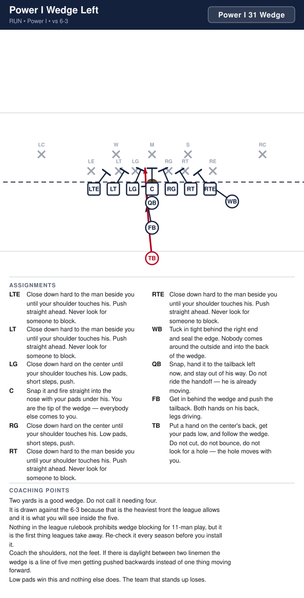
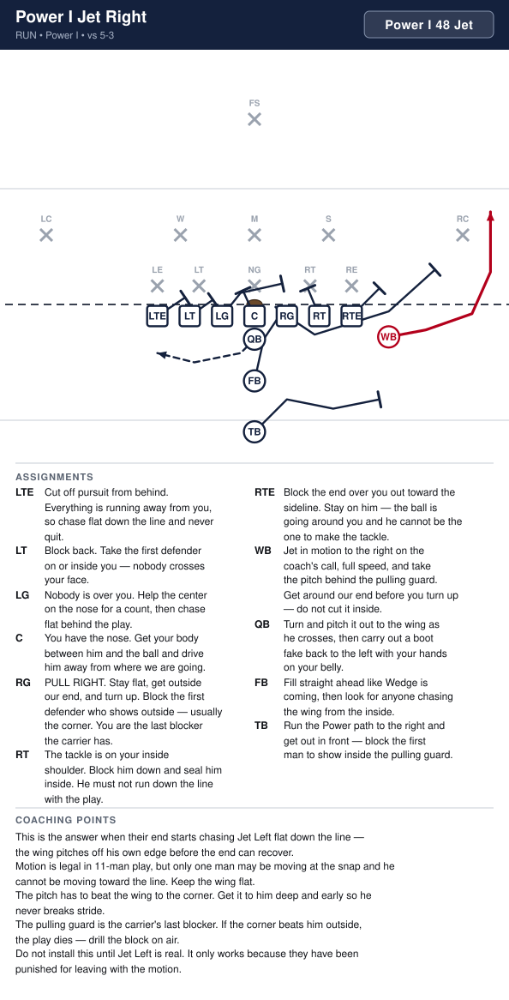
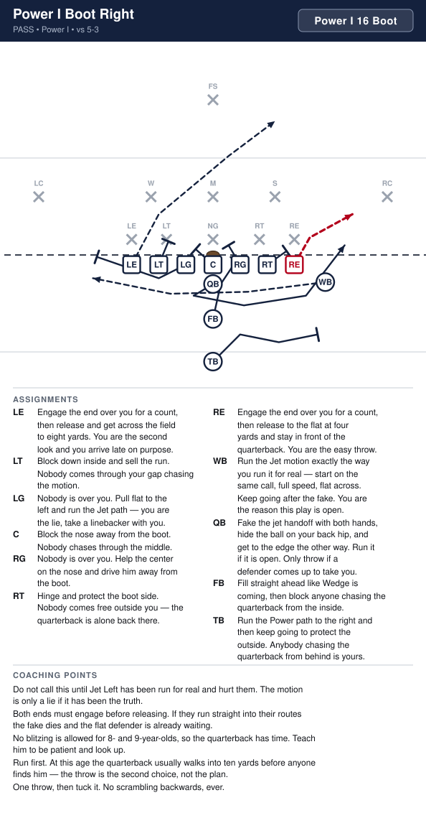
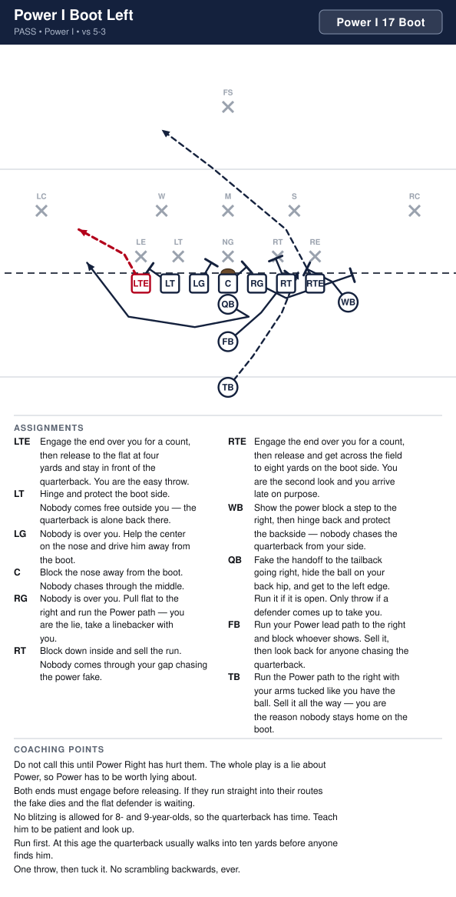

# Power I

_Generated by `generator/render.py`. Edit the JSON in `plays/`, not this file._

Everything is the base I except the flanker, who tightens down to a wingback one yard outside the right end and one yard back. He is OFF the line, so we still have exactly seven on it. That one step in is worth a blocker on the edge, and it is what makes Jet possible.

**Alignment** (yards; x positive to the right, y positive downfield, LOS = 0)

| Position | x | y |
|---|---|---|
| LTE | -4.2 | -0.5 |
| LT | -2.8 | -0.5 |
| LG | -1.4 | -0.5 |
| C | 0.0 | -0.5 |
| RG | 1.4 | -0.5 |
| RT | 2.8 | -0.5 |
| RTE | 4.2 | -0.5 |
| WB | 5.8 | -1.4 |
| QB | 0.0 | -1.5 |
| FB | 0.0 | -3.3 |
| TB | 0.0 | -5.5 |

**Formation coaching notes**

- This is the same eleven kids in the same spots as the I, with one man moved a yard and a half. Install it the week after the I is solid and you get four plays almost free — they already know the line rules.
- The wing is the whole point. To his side he is an extra blocker on the edge, which is why Power goes that way; away from his side he is the man in motion, which is why Jet goes the other way.
- Count seven on the line every snap. The wing standing up on the line is the flag you will actually get out of this look, exactly like the flanker in the I.
- The wing is a blocker first. If he starts drifting wide before the snap to get a better angle, he has told the defense the play and given up his leverage.

## Plays

| Play | Call | Type | Ball |
|---|---|---|---|
| [Power I Power Right](#power-i-power-right) | `Power I 34 Power` | run | TB |
| [Power I Power Left](#power-i-power-left) | `Power I 35 Power` | run | TB |
| [Power I Wedge](#power-i-wedge) | `Power I 30 Wedge` | run | TB |
| [Power I Wedge Left](#power-i-wedge-left) | `Power I 31 Wedge` | run | TB |
| [Power I Jet Left](#power-i-jet-left) | `Power I 49 Jet` | run | WB |
| [Power I Jet Right](#power-i-jet-right) | `Power I 48 Jet` | run | WB |
| [Power I Boot Right](#power-i-boot-right) | `Power I 16 Boot` | pass | RTE |
| [Power I Boot Left](#power-i-boot-left) | `Power I 17 Boot` | pass | LTE |
| [Power I Offset Power Right](#power-i-offset-power-right) | `Power I Offset Right 34 Power` | run | TB |
| [Power I Offset Power Left](#power-i-offset-power-left) | `Power I Offset Left 35 Power` | run | TB |
| [Power I Offset Counter Left](#power-i-offset-counter-left) | `Power I Offset Right 35 Counter` | run | TB |
| [Power I Offset Counter Right](#power-i-offset-counter-right) | `Power I Offset Left 34 Counter` | run | TB |
| [Power I Offset Toss Right](#power-i-offset-toss-right) | `Power I Offset Right 38 Toss` | run | TB |
| [Power I Offset Toss Left](#power-i-offset-toss-left) | `Power I Offset Left 39 Toss` | run | TB |

---

## Power I Power Right

**Call it:** `Power I 34 Power`

Our best downhill run. Everybody blocks down to the inside, the wing kicks the end out, and the backside guard pulls through the hole in front of the tailback. Two blockers arrive in the same gap before the linebackers do.

| Position | Assignment |
|---|---|
| **LTE** | Cut off pursuit from behind. You are the last one to the ball, so never quit on the play. |
| **LT** | Block back. Take the first defender on or inside you — nobody crosses your face. |
| **LG** | PULL RIGHT. Stay flat behind the line, turn up through the hole and block the first wrong shirt you see. Do not go around the pile — go through it. |
| **C** | You have the nose, head up on you. Hands inside and do not let him cross your face to the playside. |
| **RG** | Nobody is over you. Help the center drive the nose for one count, then climb to the middle linebacker. |
| **RT** | The tackle is on your inside shoulder. Block him down and seal him inside — that is what opens the hole. |
| **RTE** | Release inside off his outside shoulder and take the playside linebacker. The end over you is getting kicked out — leave him alone. |
| **WB** | Kick the end out. Aim at his outside hip and drive him toward the sideline. Everything runs inside of you, so never let him come underneath. |
| **QB** | Open to the right, hand it deep to the tailback, then carry out the boot fake to the edge. The fake is what keeps the backside end honest. |
| **FB** | Lead through the hole outside our tackle and block the first defender who shows in it. Get your head across him — do not wait for him to come to you. |
| **TB** **(ball)** | Take the handoff going downhill and aim at the outside hip of our tackle. Follow the fullback, then the guard. Stay tight to the blocks and do not bounce it outside. |

**Coaching points**

- This is the play the whole formation exists for. If it works you can run it fifteen times, and at this age you often can.
- Drill the wing's kick-out on its own. If he blocks the end with his shoulders square, the end slides underneath and makes the tackle for a loss — he has to attack the outside hip.
- The pulling guard is late by design. Tell him his man is the one who shows up in the hole, not a man he picks before the snap.
- The tailback's most common mistake is bouncing it wide looking for green grass. The yards are inside the wing's block. Make him run it tight in practice until it is automatic.

---

## Power I Power Left

**Call it:** `Power I 35 Power`

The same play away from the wing. We give up the wing's kick-out and the fullback does that job instead, which is why it is the second one we teach, not the first.

| Position | Assignment |
|---|---|
| **LTE** | Release inside off his outside shoulder and take the playside linebacker. The end over you is getting kicked out — leave him alone. |
| **LT** | The tackle is on your inside shoulder. Block him down and seal him inside — that is what opens the hole. |
| **LG** | Nobody is over you. Help the center drive the nose for one count, then climb to the middle linebacker. |
| **C** | You have the nose, head up on you. Hands inside and do not let him cross your face to the playside. |
| **RG** | PULL LEFT. Stay flat behind the line, turn up through the hole and block the first wrong shirt you see. Do not go around the pile — go through it. |
| **RT** | Block back. Take the first defender on or inside you — nobody crosses your face. |
| **RTE** | Cut off pursuit from behind. You are the last one to the ball, so never quit on the play. |
| **WB** | Come flat across behind the line and cut off the backside. You are chasing the play, so take the first defender who crosses your path. |
| **QB** | Open to the left, hand it deep to the tailback, then carry out the boot fake to the edge. The fake is what keeps the backside end honest. |
| **FB** | Kick the end out. Aim at his outside hip and drive him toward the sideline. The tailback is running inside of you, so never let him come underneath. |
| **TB** **(ball)** | Take the handoff going downhill and aim at the outside hip of our tackle. Follow the guard through the hole. Stay tight to the blocks and do not bounce it outside. |

**Coaching points**

- Run this the moment they start cheating a linebacker over to the wing. That is the only reason it is in the book.
- The fullback is doing the wing's job here, and he is doing it from further away with less angle. Give him extra reps on the kick-out alone.
- Everything else is Power Right in a mirror, so teach the pair together. The line rules do not change at all.
- If the backside end is chasing the tailback down from behind, the quarterback's boot fake is not being carried out. Fix the fake, not the blocking.

---

## Power I Wedge

**Call it:** `Power I 30 Wedge`

Short yardage and the goal line. Nobody blocks a man — the whole line squeezes shoulder to shoulder on the center and pushes. The tailback puts a hand on the center's back and goes wherever the pile goes.

| Position | Assignment |
|---|---|
| **LTE** | Close down hard to the man beside you until your shoulder touches his. Push straight ahead. Never look for someone to block. |
| **LT** | Close down hard to the man beside you until your shoulder touches his. Push straight ahead. Never look for someone to block. |
| **LG** | Close down hard on the center until your shoulder touches his. Low pads, short steps, push. |
| **C** | Snap it and fire straight into the nose with your pads under his. You are the tip of the wedge — everybody else comes to you. |
| **RG** | Close down hard on the center until your shoulder touches his. Low pads, short steps, push. |
| **RT** | Close down hard to the man beside you until your shoulder touches his. Push straight ahead. Never look for someone to block. |
| **RTE** | Close down hard to the man beside you until your shoulder touches his. Push straight ahead. Never look for someone to block. |
| **WB** | Tuck in tight behind the right end and seal the edge. Nobody comes around the outside and into the back of the wedge. |
| **QB** | Snap, hand it to the tailback right now, and stay out of his way. Do not ride the handoff — he is already moving. |
| **FB** | Get in behind the wedge and push the tailback. Both hands on his back, legs driving. |
| **TB** **(ball)** | Put a hand on the center's back, get your pads low, and follow the wedge. Do not cut, do not bounce, do not look for a hole — the hole moves with you. |

**Coaching points**

- Two yards is a good wedge. Do not call it needing four.
- It is drawn against the 6-3 because that is the heaviest front the league allows and it is what you will see inside the five.
- Nothing in the league rulebook prohibits wedge blocking for 11-man play, but it is the first thing leagues take away. Re-check it every season before you install it.
- Coach the shoulders, not the feet. If there is daylight between two linemen the wedge is a line of five men getting pushed backwards instead of one thing moving forward.
- Low pads win this and nothing else does. The team that stands up loses.

---

## Power I Wedge Left

**Call it:** `Power I 31 Wedge`

Short yardage and the goal line. Nobody blocks a man — the whole line squeezes shoulder to shoulder on the center and pushes. The tailback puts a hand on the center's back and goes wherever the pile goes.

| Position | Assignment |
|---|---|
| **LTE** | Close down hard to the man beside you until your shoulder touches his. Push straight ahead. Never look for someone to block. |
| **LT** | Close down hard to the man beside you until your shoulder touches his. Push straight ahead. Never look for someone to block. |
| **LG** | Close down hard on the center until your shoulder touches his. Low pads, short steps, push. |
| **C** | Snap it and fire straight into the nose with your pads under his. You are the tip of the wedge — everybody else comes to you. |
| **RG** | Close down hard on the center until your shoulder touches his. Low pads, short steps, push. |
| **RT** | Close down hard to the man beside you until your shoulder touches his. Push straight ahead. Never look for someone to block. |
| **RTE** | Close down hard to the man beside you until your shoulder touches his. Push straight ahead. Never look for someone to block. |
| **WB** | Tuck in tight behind the right end and seal the edge. Nobody comes around the outside and into the back of the wedge. |
| **QB** | Snap, hand it to the tailback left now, and stay out of his way. Do not ride the handoff — he is already moving. |
| **FB** | Get in behind the wedge and push the tailback. Both hands on his back, legs driving. |
| **TB** **(ball)** | Put a hand on the center's back, get your pads low, and follow the wedge. Do not cut, do not bounce, do not look for a hole — the hole moves with you. |

**Coaching points**

- Two yards is a good wedge. Do not call it needing four.
- It is drawn against the 6-3 because that is the heaviest front the league allows and it is what you will see inside the five.
- Nothing in the league rulebook prohibits wedge blocking for 11-man play, but it is the first thing leagues take away. Re-check it every season before you install it.
- Coach the shoulders, not the feet. If there is daylight between two linemen the wedge is a line of five men getting pushed backwards instead of one thing moving forward.
- Low pads win this and nothing else does. The team that stands up loses.

---

## Power I Jet Left

**Call it:** `Power I 49 Jet`

The wing goes in motion across the formation and takes the handoff at full speed going the other way. The defense has spent all day watching Power go to the wing side, and this is the same look leaving in the opposite direction.

| Position | Assignment |
|---|---|
| **LTE** | Block the end over you out toward the sideline. Stay on him — the ball is going around you and he cannot be the one to make the tackle. |
| **LT** | The tackle is on your inside shoulder. Block him down and seal him inside. He must not run down the line with the play. |
| **LG** | Nobody is over you. Pull flat and get outside — you are the lead blocker on the edge. Take the first defender who shows outside our end. |
| **C** | You have the nose. Get your body between him and the ball and drive him away from where we are going. |
| **RG** | Nobody is over you. Help the center on the nose for a count, then chase flat behind the play. |
| **RT** | Block back. Take the first defender on or inside you — nobody crosses your face. |
| **RTE** | Cut off pursuit from behind. Everything is running away from you, so chase flat down the line and never quit. |
| **WB** **(ball)** | Start moving on the coach's motion call and be at full speed when you pass the quarterback. Take the ball and get around the corner — do not turn upfield until you are outside our end. |
| **QB** | Turn and hand it back to the wing as he crosses, then keep going the other way with your hands on your belly like you kept it. |
| **FB** | Fill straight ahead like Wedge is coming. You are the reason their linebackers step up for one count. |
| **TB** | Run the Power path to the right with your arms tucked like you have the ball. Sell it all the way — you are the reason nobody chases the wing. |

**Coaching points**

- Motion is legal in 11-man play, but only one man may be moving at the snap and he cannot be moving toward the line of scrimmage. Teach the wing to run flat across, never forward.
- The handoff timing is the whole play. If the wing is slowing down to catch it the play is dead — snap it when he is a stride from the quarterback and let him run through it.
- Call the motion the same way every single time so the snap count and his start never drift apart.
- Do not install this until Power Right is real. Jet works because they have already been punished for not honouring the wing side.
- If their end chases the wing flat down the line, come back to Power Right the very next play — he has left the edge.

---

## Power I Jet Right

**Call it:** `Power I 48 Jet`

The wing keeps it to his own side. Jet Left has been taking the ball away from the wing all game; here he takes the quick pitch right back around his own end, where the defense has stopped honouring him.

| Position | Assignment |
|---|---|
| **LTE** | Cut off pursuit from behind. Everything is running away from you, so chase flat down the line and never quit. |
| **LT** | Block back. Take the first defender on or inside you — nobody crosses your face. |
| **LG** | Nobody is over you. Help the center on the nose for a count, then chase flat behind the play. |
| **C** | You have the nose. Get your body between him and the ball and drive him away from where we are going. |
| **RG** | PULL RIGHT. Stay flat, get outside our end, and turn up. Block the first defender who shows outside — usually the corner. You are the last blocker the carrier has. |
| **RT** | The tackle is on your inside shoulder. Block him down and seal him inside. He must not run down the line with the play. |
| **RTE** | Block the end over you out toward the sideline. Stay on him — the ball is going around you and he cannot be the one to make the tackle. |
| **WB** **(ball)** | Jet in motion to the right on the coach's call, full speed, and take the pitch behind the pulling guard. Get around our end before you turn up — do not cut it inside. |
| **QB** | Turn and pitch it out to the wing as he crosses, then carry out a boot fake back to the left with your hands on your belly. |
| **FB** | Fill straight ahead like Wedge is coming, then look for anyone chasing the wing from the inside. |
| **TB** | Run the Power path to the right and get out in front — block the first man to show inside the pulling guard. |

**Coaching points**

- This is the answer when their end starts chasing Jet Left flat down the line — the wing pitches off his own edge before the end can recover.
- Motion is legal in 11-man play, but only one man may be moving at the snap and he cannot be moving toward the line. Keep the wing flat.
- The pitch has to beat the wing to the corner. Get it to him deep and early so he never breaks stride.
- The pulling guard is the carrier's last blocker. If the corner beats him outside, the play dies — drill the block on air.
- Do not install this until Jet Left is real. It only works because they have been punished for leaving with the motion.

---

## Power I Boot Right

**Call it:** `Power I 16 Boot`

Jet motion pulls the whole defense one way and the quarterback keeps it the other. This is the play Jet Left is really setting up, and at this age the edge is usually empty.

| Position | Assignment |
|---|---|
| **LTE** | Engage the end over you for a count, then release and get across the field to eight yards. You are the second look and you arrive late on purpose. |
| **LT** | Block down inside and sell the run. Nobody comes through your gap chasing the motion. |
| **LG** | Nobody is over you. Pull flat to the left and run the Jet path — you are the lie, take a linebacker with you. |
| **C** | Block the nose away from the boot. Nobody chases through the middle. |
| **RG** | Nobody is over you. Help the center on the nose and drive him away from the boot. |
| **RT** | Hinge and protect the boot side. Nobody comes free outside you — the quarterback is alone back there. |
| **RTE** **(ball)** | Engage the end over you for a count, then release to the flat at four yards and stay in front of the quarterback. You are the easy throw. |
| **WB** | Run the Jet motion exactly the way you run it for real — start on the same call, full speed, flat across. Keep going after the fake. You are the reason this play is open. |
| **QB** | Fake the jet handoff with both hands, hide the ball on your back hip, and get to the edge the other way. Run it if it is open. Only throw if a defender comes up to take you. |
| **FB** | Fill straight ahead like Wedge is coming, then block anyone chasing the quarterback from the inside. |
| **TB** | Run the Power path to the right and then keep going to protect the outside. Anybody chasing the quarterback from behind is yours. |

**Coaching points**

- Do not call this until Jet Left has been run for real and hurt them. The motion is only a lie if it has been the truth.
- Both ends must engage before releasing. If they run straight into their routes the fake dies and the flat defender is already waiting.
- No blitzing is allowed for 8- and 9-year-olds, so the quarterback has time. Teach him to be patient and look up.
- Run first. At this age the quarterback usually walks into ten yards before anyone finds him — the throw is the second choice, not the plan.
- One throw, then tuck it. No scrambling backwards, ever.

---

## Power I Boot Left

**Call it:** `Power I 17 Boot`

Boot Left off the Power look. Everybody flows right selling Power, and the quarterback keeps it and gets to the left edge on his own, with the tight end in the flat in front of him and the backside end coming across behind. Run first, throw second.

| Position | Assignment |
|---|---|
| **LTE** **(ball)** | Engage the end over you for a count, then release to the flat at four yards and stay in front of the quarterback. You are the easy throw. |
| **LT** | Hinge and protect the boot side. Nobody comes free outside you — the quarterback is alone back there. |
| **LG** | Nobody is over you. Help the center on the nose and drive him away from the boot. |
| **C** | Block the nose away from the boot. Nobody chases through the middle. |
| **RG** | Nobody is over you. Pull flat to the right and run the Power path — you are the lie, take a linebacker with you. |
| **RT** | Block down inside and sell the run. Nobody comes through your gap chasing the power fake. |
| **RTE** | Engage the end over you for a count, then release and get across the field to eight yards on the boot side. You are the second look and you arrive late on purpose. |
| **WB** | Show the power block a step to the right, then hinge back and protect the backside — nobody chases the quarterback from your side. |
| **QB** | Fake the handoff to the tailback going right, hide the ball on your back hip, and get to the left edge. Run it if it is open. Only throw if a defender comes up to take you. |
| **FB** | Run your Power lead path to the right and block whoever shows. Sell it, then look back for anyone chasing the quarterback. |
| **TB** | Run the Power path to the right with your arms tucked like you have the ball. Sell it all the way — you are the reason nobody stays home on the boot. |

**Coaching points**

- Do not call this until Power Right has hurt them. The whole play is a lie about Power, so Power has to be worth lying about.
- Both ends must engage before releasing. If they run straight into their routes the fake dies and the flat defender is waiting.
- No blitzing is allowed for 8- and 9-year-olds, so the quarterback has time. Teach him to be patient and look up.
- Run first. At this age the quarterback usually walks into ten yards before anyone finds him.
- One throw, then tuck it. No scrambling backwards, ever.

---

## Power I Offset Power Right

**Call it:** `Power I Offset Right 34 Power`

Power Right with the wing moved off the edge and into the backfield beside the fullback. Same three jobs, same hole, but now the defense cannot see which side the extra blocker is going to until the ball is snapped.

| Position | Assignment |
|---|---|
| **LTE** | Cut off pursuit from behind. You are the last one to the ball, so never quit on the play. |
| **LT** | Block back. Take the first defender on or inside you — nobody crosses your face. |
| **LG** | PULL RIGHT. Stay flat behind the line, turn up through the hole and block the first wrong shirt you see. Do not go around the pile — go through it. |
| **C** | You have the nose, head up on you. Hands inside and do not let him cross your face to the playside. |
| **RG** | Nobody is over you. Help the center drive the nose for one count, then climb to the middle linebacker. |
| **RT** | The tackle is on your inside shoulder. Block him down and seal him inside — that is what opens the hole. |
| **RTE** | Release inside off his outside shoulder and take the playside linebacker. The end over you is getting kicked out — leave him alone. |
| **WB** | Kick the end out. You are starting three yards deeper than usual, so leave on the snap and get there — aim at his outside hip and drive him toward the sideline. |
| **QB** | Open to the right, hand it deep to the tailback, then carry out the boot fake to the edge. The fake is what keeps the backside end honest. |
| **FB** | Lead through the hole outside our tackle and block the first defender who shows in it. Get your head across him — do not wait for him to come to you. |
| **TB** **(ball)** | Take the handoff going downhill and aim at the outside hip of our tackle. Follow the fullback, then the guard. Stay tight to the blocks and do not bounce it outside. |

**Coaching points**

- This is the same play as Power Right off the wing. The only thing that changes is where the kick-out block starts, and that is the entire reason it exists — at the wing he is a tell, in the backfield he is not.
- The trade is honest: from the backfield he arrives faster but with a worse angle, so he must leave on the snap. From the wing he has leverage but the defense has already counted him.
- Teach both looks in the same session with the same words. Every line rule is identical and the backs' jobs are identical — only one man has moved.
- If they walk a linebacker over to the offset side, run Offset Counter Left the very next play.

---

## Power I Offset Power Left

**Call it:** `Power I Offset Left 35 Power`

Power Left with the wing moved off the edge and into the backfield beside the fullback. Same three jobs, same hole, but now the defense cannot see which side the extra blocker is going to until the ball is snapped.

| Position | Assignment |
|---|---|
| **LTE** | Release inside off his outside shoulder and take the playside linebacker. The end over you is getting kicked out — leave him alone. |
| **LT** | The tackle is on your inside shoulder. Block him down and seal him inside — that is what opens the hole. |
| **LG** | Nobody is over you. Help the center drive the nose for one count, then climb to the middle linebacker. |
| **C** | You have the nose, head up on you. Hands inside and do not let him cross your face to the playside. |
| **RG** | PULL LEFT. Stay flat behind the line, turn up through the hole and block the first wrong shirt you see. Do not go around the pile — go through it. |
| **RT** | Block back. Take the first defender on or inside you — nobody crosses your face. |
| **RTE** | Cut off pursuit from behind. You are the last one to the ball, so never quit on the play. |
| **WB** | Kick the end out. You are starting three yards deeper than usual, so leave on the snap and get there — aim at his outside hip and drive him toward the sideline. |
| **QB** | Open to the left, hand it deep to the tailback, then carry out the boot fake to the edge. The fake is what keeps the backside end honest. |
| **FB** | Lead through the hole outside our tackle and block the first defender who shows in it. Get your head across him — do not wait for him to come to you. |
| **TB** **(ball)** | Take the handoff going downhill and aim at the outside hip of our tackle. Follow the fullback, then the guard. Stay tight to the blocks and do not bounce it outside. |

**Coaching points**

- This is the same play as Power Left off the wing. The only thing that changes is where the kick-out block starts, and that is the entire reason it exists — at the wing he is a tell, in the backfield he is not.
- The trade is honest: from the backfield he arrives faster but with a worse angle, so he must leave on the snap. From the wing he has leverage but the defense has already counted him.
- Teach both looks in the same session with the same words. Every line rule is identical and the backs' jobs are identical — only one man has moved.
- If they walk a linebacker over to the offset side, run Offset Counter Right the very next play.

---

## Power I Offset Counter Left

**Call it:** `Power I Offset Right 35 Counter`

The offset back is lined up right and runs right, which is exactly what they have been punished for respecting. The tailback takes two steps that way and comes back off tackle to the weak side behind a pulling guard.

| Position | Assignment |
|---|---|
| **LTE** | Release inside off his outside shoulder and take the playside linebacker. The end over you is being kicked out — leave him alone. |
| **LT** | The tackle is on your inside shoulder. Block him down and seal him inside — that is what opens the hole. |
| **LG** | Nobody is over you. Help the center drive the nose for one count, then climb to the middle linebacker. |
| **C** | You have the nose, head up on you. Hands inside and do not let him cross your face to the playside. |
| **RG** | PULL LEFT. Stay flat behind the line and kick out the end on the other side. Aim at his outside hip. |
| **RT** | Block back. Take the first defender on or inside you — nobody crosses your face. |
| **RTE** | Cut off pursuit from behind. You are the last one to the ball, so never quit on the play. |
| **WB** | Run your Power path to the right at full speed and block whatever shows. You never get the ball on this play and you are the reason it works. |
| **QB** | Take the snap, fake the handoff to the right with both hands, then turn back and hand to the tailback. The fake comes first — the handoff is late on purpose. |
| **FB** | False step right, then lead through the hole to the left and block the first defender who fills it. One step of the lie, then do your job. |
| **TB** **(ball)** | Take two hard steps toward the offset back, then plant and come back behind the pulling guard. Those two steps are the entire play. |

**Coaching points**

- Do not call this until Offset Power Right has gone for real yards. Misdirection off a play they do not fear is just a slower run.
- The offset back is the whole lie. He must run the Power path at Power speed and block somebody at the end of it — if he coasts, their backside linebacker never leaves.
- The tailback's counter steps must be full speed and full length. A shuffle fools nobody.
- The fullback's false step is one step, not two. Any more and he is late to the hole and the pulling guard is running alone.

---

## Power I Offset Counter Right

**Call it:** `Power I Offset Left 34 Counter`

The offset back is lined up left and runs left, which is exactly what they have been punished for respecting. The tailback takes two steps that way and comes back off tackle to the weak side behind a pulling guard.

| Position | Assignment |
|---|---|
| **LTE** | Cut off pursuit from behind. You are the last one to the ball, so never quit on the play. |
| **LT** | Block back. Take the first defender on or inside you — nobody crosses your face. |
| **LG** | PULL RIGHT. Stay flat behind the line and kick out the end on the other side. Aim at his outside hip. |
| **C** | You have the nose, head up on you. Hands inside and do not let him cross your face to the playside. |
| **RG** | Nobody is over you. Help the center drive the nose for one count, then climb to the middle linebacker. |
| **RT** | The tackle is on your inside shoulder. Block him down and seal him inside — that is what opens the hole. |
| **RTE** | Release inside off his outside shoulder and take the playside linebacker. The end over you is being kicked out — leave him alone. |
| **WB** | Run your Power path to the left at full speed and block whatever shows. You never get the ball on this play and you are the reason it works. |
| **QB** | Take the snap, fake the handoff to the left with both hands, then turn back and hand to the tailback. The fake comes first — the handoff is late on purpose. |
| **FB** | False step left, then lead through the hole to the right and block the first defender who fills it. One step of the lie, then do your job. |
| **TB** **(ball)** | Take two hard steps toward the offset back, then plant and come back behind the pulling guard. Those two steps are the entire play. |

**Coaching points**

- Do not call this until Offset Power Left has gone for real yards. Misdirection off a play they do not fear is just a slower run.
- The offset back is the whole lie. He must run the Power path at Power speed and block somebody at the end of it — if he coasts, their backside linebacker never leaves.
- The tailback's counter steps must be full speed and full length. A shuffle fools nobody.
- The fullback's false step is one step, not two. Any more and he is late to the hole and the pulling guard is running alone.

---

## Power I Offset Toss Right

**Call it:** `Power I Offset Right 38 Toss`

Two lead blockers around the corner. The offset back and the pulling guard get outside in front of the tailback, and a defense that has been squeezing the off-tackle hole all game has nobody left on the edge.

| Position | Assignment |
|---|---|
| **LTE** | Cut off pursuit from behind. Everything is running away from you, so chase flat down the line and never quit. |
| **LT** | Block back. Take the first defender on or inside you — nobody crosses your face. |
| **LG** | Nobody is over you. Help the center on the nose for a count, then chase flat behind the play. |
| **C** | You have the nose. Get your body between him and the ball and drive him away from where we are going. |
| **RG** | PULL RIGHT. Stay flat, get outside our end, and turn up. Block the first defender who shows outside — usually the corner. You are the last blocker the carrier has. |
| **RT** | The tackle is on your inside shoulder. Block him down and seal him inside. He must not run down the line with the play. |
| **RTE** | Block the end over you out toward the sideline. Stay on him — the ball is going around you and he cannot be the one to make the tackle. |
| **WB** | Get width on the snap and lead the tailback around the corner. Block the first man outside our end, and if nobody shows, keep running and find the safety. |
| **QB** | Open right and get the ball to the tailback deep and early, then carry out a fake up the middle. Do not float it — put it in his hands while he is still gaining width. |
| **FB** | Seal the inside. Anybody crossing the line between our tackle and the ball is yours — the carrier is running outside of you and cannot see them. |
| **TB** **(ball)** | Take the ball and get width first. Stay behind the offset back until you are outside our end, then turn up hard. Turning up too early is the only way this play loses yards. |

**Coaching points**

- Best call on the hash going to the wide side of the field. Do not call it into the boundary.
- The offset back has a real head start on this compared to running it from the wing — he is already behind the line and moving before anybody can widen with him.
- The carrier must not turn up until he is outside our end. Eight-year-olds cut upfield the moment they see grass and run straight into the tackle the play was designed to beat.
- If their corner is flying up to meet the pull every time, come back inside with Offset Power Right — same first two steps from the backfield.

---

## Power I Offset Toss Left

**Call it:** `Power I Offset Left 39 Toss`

Two lead blockers around the corner. The offset back and the pulling guard get outside in front of the tailback, and a defense that has been squeezing the off-tackle hole all game has nobody right on the edge.

| Position | Assignment |
|---|---|
| **LTE** | Block the end over you out toward the sideline. Stay on him — the ball is going around you and he cannot be the one to make the tackle. |
| **LT** | The tackle is on your inside shoulder. Block him down and seal him inside. He must not run down the line with the play. |
| **LG** | PULL LEFT. Stay flat, get outside our end, and turn up. Block the first defender who shows outside — usually the corner. You are the last blocker the carrier has. |
| **C** | You have the nose. Get your body between him and the ball and drive him away from where we are going. |
| **RG** | Nobody is over you. Help the center on the nose for a count, then chase flat behind the play. |
| **RT** | Block back. Take the first defender on or inside you — nobody crosses your face. |
| **RTE** | Cut off pursuit from behind. Everything is running away from you, so chase flat down the line and never quit. |
| **WB** | Get width on the snap and lead the tailback around the corner. Block the first man outside our end, and if nobody shows, keep running and find the safety. |
| **QB** | Open left and get the ball to the tailback deep and early, then carry out a fake up the middle. Do not float it — put it in his hands while he is still gaining width. |
| **FB** | Seal the inside. Anybody crossing the line between our tackle and the ball is yours — the carrier is running outside of you and cannot see them. |
| **TB** **(ball)** | Take the ball and get width first. Stay behind the offset back until you are outside our end, then turn up hard. Turning up too early is the only way this play loses yards. |

**Coaching points**

- Best call on the hash going to the wide side of the field. Do not call it into the boundary.
- The offset back has a real head start on this compared to running it from the wing — he is already behind the line and moving before anybody can widen with him.
- The carrier must not turn up until he is outside our end. Eight-year-olds cut upfield the moment they see grass and run straight into the tackle the play was designed to beat.
- If their corner is flying up to meet the pull every time, come back inside with Offset Power Left — same first two steps from the backfield.

