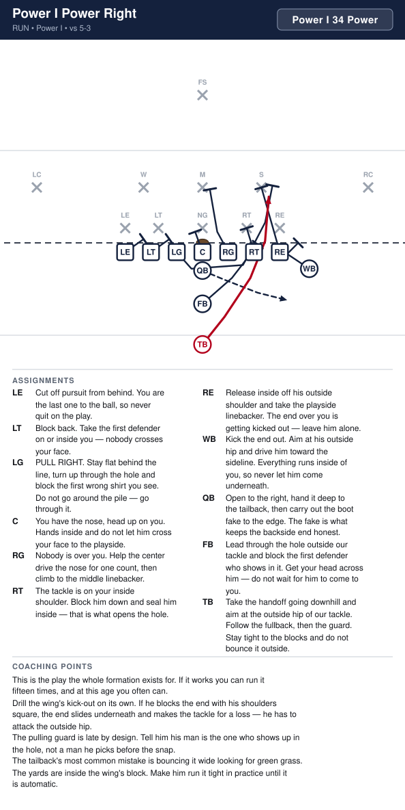
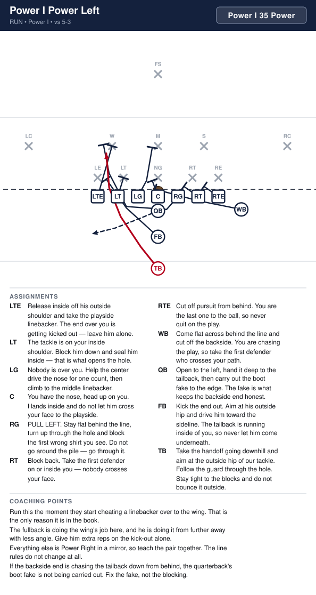
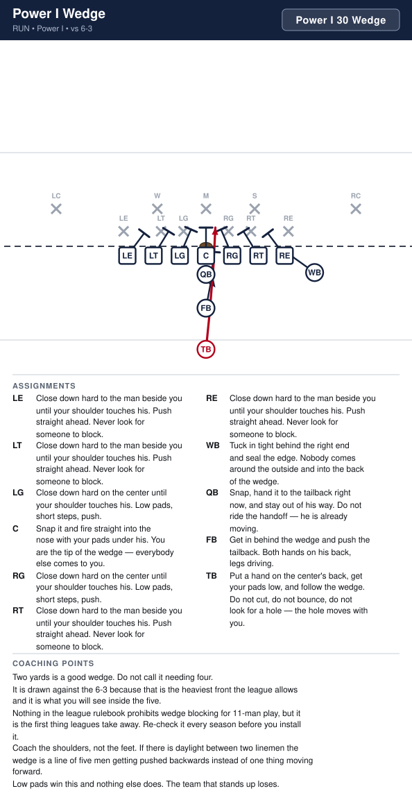
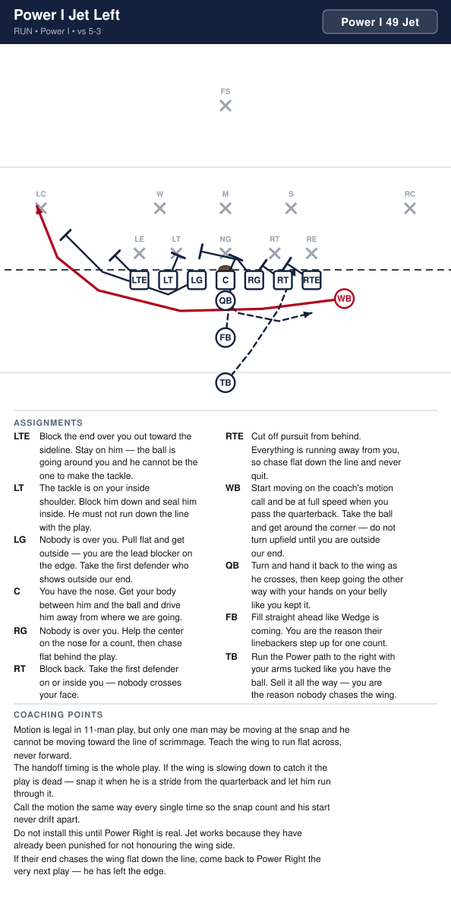

# Power I

_Generated by `generator/render.py`. Edit the JSON in `plays/`, not this file._

Everything is the base I except the flanker, who tightens down to a wingback one yard outside the right end and one yard back. He is OFF the line, so we still have exactly seven on it. That one step in is worth a blocker on the edge, and it is what makes Jet possible.

**Alignment** (yards; x positive to the right, y positive downfield, LOS = 0)

| Position | x | y |
|---|---|---|
| LE | -4.2 | -0.5 |
| LT | -2.8 | -0.5 |
| LG | -1.4 | -0.5 |
| C | 0.0 | -0.5 |
| RG | 1.4 | -0.5 |
| RT | 2.8 | -0.5 |
| RE | 4.2 | -0.5 |
| WB | 5.8 | -1.4 |
| QB | 0.0 | -1.5 |
| FB | 0.0 | -3.3 |
| TB | 0.0 | -5.5 |

**Formation coaching notes**

- This is the same eleven kids in the same spots as the I, with one man moved a yard and a half. Install it the week after the I is solid and you get four plays almost free — they already know the line rules.
- The wing is the whole point. To his side he is an extra blocker on the edge, which is why Power goes that way; away from his side he is the man in motion, which is why Jet goes the other way.
- Count seven on the line every snap. The wing standing up on the line is the flag you will actually get out of this look, exactly like the flanker in the I.
- The wing is a blocker first. If he starts drifting wide before the snap to get a better angle, he has told the defense the play and given up his leverage.

## Plays

| Play | Call | Type | Ball |
|---|---|---|---|
| [Power I Power Right](#power-i-power-right) | `Power I 34 Power` | run | TB |
| [Power I Power Left](#power-i-power-left) | `Power I 35 Power` | run | TB |
| [Power I Wedge](#power-i-wedge) | `Power I 30 Wedge` | run | TB |
| [Power I Jet Left](#power-i-jet-left) | `Power I 49 Jet` | run | WB |

---

## Power I Power Right

**Call it:** `Power I 34 Power`

Our best downhill run. Everybody blocks down to the inside, the wing kicks the end out, and the backside guard pulls through the hole in front of the tailback. Two blockers arrive in the same gap before the linebackers do.

| Position | Assignment |
|---|---|
| **LE** | Cut off pursuit from behind. You are the last one to the ball, so never quit on the play. |
| **LT** | Block back. Take the first defender on or inside you — nobody crosses your face. |
| **LG** | PULL RIGHT. Stay flat behind the line, turn up through the hole and block the first wrong shirt you see. Do not go around the pile — go through it. |
| **C** | You have the nose, head up on you. Hands inside and do not let him cross your face to the playside. |
| **RG** | Nobody is over you. Help the center drive the nose for one count, then climb to the middle linebacker. |
| **RT** | The tackle is on your inside shoulder. Block him down and seal him inside — that is what opens the hole. |
| **RE** | Release inside off his outside shoulder and take the playside linebacker. The end over you is getting kicked out — leave him alone. |
| **WB** | Kick the end out. Aim at his outside hip and drive him toward the sideline. Everything runs inside of you, so never let him come underneath. |
| **QB** | Open to the right, hand it deep to the tailback, then carry out the boot fake to the edge. The fake is what keeps the backside end honest. |
| **FB** | Lead through the hole outside our tackle and block the first defender who shows in it. Get your head across him — do not wait for him to come to you. |
| **TB** **(ball)** | Take the handoff going downhill and aim at the outside hip of our tackle. Follow the fullback, then the guard. Stay tight to the blocks and do not bounce it outside. |

**Coaching points**

- This is the play the whole formation exists for. If it works you can run it fifteen times, and at this age you often can.
- Drill the wing's kick-out on its own. If he blocks the end with his shoulders square, the end slides underneath and makes the tackle for a loss — he has to attack the outside hip.
- The pulling guard is late by design. Tell him his man is the one who shows up in the hole, not a man he picks before the snap.
- The tailback's most common mistake is bouncing it wide looking for green grass. The yards are inside the wing's block. Make him run it tight in practice until it is automatic.

---

## Power I Power Left

**Call it:** `Power I 35 Power`

The same play away from the wing. We give up the wing's kick-out and the fullback does that job instead, which is why it is the second one we teach, not the first.

| Position | Assignment |
|---|---|
| **LE** | Release inside off his outside shoulder and take the playside linebacker. The end over you is getting kicked out — leave him alone. |
| **LT** | The tackle is on your inside shoulder. Block him down and seal him inside — that is what opens the hole. |
| **LG** | Nobody is over you. Help the center drive the nose for one count, then climb to the middle linebacker. |
| **C** | You have the nose, head up on you. Hands inside and do not let him cross your face to the playside. |
| **RG** | PULL LEFT. Stay flat behind the line, turn up through the hole and block the first wrong shirt you see. Do not go around the pile — go through it. |
| **RT** | Block back. Take the first defender on or inside you — nobody crosses your face. |
| **RE** | Cut off pursuit from behind. You are the last one to the ball, so never quit on the play. |
| **WB** | Come flat across behind the line and cut off the backside. You are chasing the play, so take the first defender who crosses your path. |
| **QB** | Open to the left, hand it deep to the tailback, then carry out the boot fake to the edge. The fake is what keeps the backside end honest. |
| **FB** | Kick the end out. Aim at his outside hip and drive him toward the sideline. The tailback is running inside of you, so never let him come underneath. |
| **TB** **(ball)** | Take the handoff going downhill and aim at the outside hip of our tackle. Follow the guard through the hole. Stay tight to the blocks and do not bounce it outside. |

**Coaching points**

- Run this the moment they start cheating a linebacker over to the wing. That is the only reason it is in the book.
- The fullback is doing the wing's job here, and he is doing it from further away with less angle. Give him extra reps on the kick-out alone.
- Everything else is Power Right in a mirror, so teach the pair together. The line rules do not change at all.
- If the backside end is chasing the tailback down from behind, the quarterback's boot fake is not being carried out. Fix the fake, not the blocking.

---

## Power I Wedge

**Call it:** `Power I 30 Wedge`

Short yardage and the goal line. Nobody blocks a man — the whole line squeezes shoulder to shoulder on the center and pushes. The tailback puts a hand on the center's back and goes wherever the pile goes.

| Position | Assignment |
|---|---|
| **LE** | Close down hard to the man beside you until your shoulder touches his. Push straight ahead. Never look for someone to block. |
| **LT** | Close down hard to the man beside you until your shoulder touches his. Push straight ahead. Never look for someone to block. |
| **LG** | Close down hard on the center until your shoulder touches his. Low pads, short steps, push. |
| **C** | Snap it and fire straight into the nose with your pads under his. You are the tip of the wedge — everybody else comes to you. |
| **RG** | Close down hard on the center until your shoulder touches his. Low pads, short steps, push. |
| **RT** | Close down hard to the man beside you until your shoulder touches his. Push straight ahead. Never look for someone to block. |
| **RE** | Close down hard to the man beside you until your shoulder touches his. Push straight ahead. Never look for someone to block. |
| **WB** | Tuck in tight behind the right end and seal the edge. Nobody comes around the outside and into the back of the wedge. |
| **QB** | Snap, hand it to the tailback right now, and stay out of his way. Do not ride the handoff — he is already moving. |
| **FB** | Get in behind the wedge and push the tailback. Both hands on his back, legs driving. |
| **TB** **(ball)** | Put a hand on the center's back, get your pads low, and follow the wedge. Do not cut, do not bounce, do not look for a hole — the hole moves with you. |

**Coaching points**

- Two yards is a good wedge. Do not call it needing four.
- It is drawn against the 6-3 because that is the heaviest front the league allows and it is what you will see inside the five.
- Nothing in the league rulebook prohibits wedge blocking for 11-man play, but it is the first thing leagues take away. Re-check it every season before you install it.
- Coach the shoulders, not the feet. If there is daylight between two linemen the wedge is a line of five men getting pushed backwards instead of one thing moving forward.
- Low pads win this and nothing else does. The team that stands up loses.

---

## Power I Jet Left

**Call it:** `Power I 49 Jet`

The wing goes in motion across the formation and takes the handoff at full speed going the other way. The defense has spent all day watching Power go to the wing side, and this is the same look leaving in the opposite direction.

| Position | Assignment |
|---|---|
| **LE** | Block the end over you out toward the sideline. Stay on him — the ball is going around you and he cannot be the one to make the tackle. |
| **LT** | The tackle is on your inside shoulder. Block him down and seal him inside. He must not run down the line with the play. |
| **LG** | Nobody is over you. Pull flat and get outside — you are the lead blocker on the edge. Take the first defender who shows outside our end. |
| **C** | You have the nose. Get your body between him and the ball and drive him away from where we are going. |
| **RG** | Nobody is over you. Help the center on the nose for a count, then chase flat behind the play. |
| **RT** | Block back. Take the first defender on or inside you — nobody crosses your face. |
| **RE** | Cut off pursuit from behind. Everything is running away from you, so chase flat down the line and never quit. |
| **WB** **(ball)** | Start moving on the coach's motion call and be at full speed when you pass the quarterback. Take the ball and get around the corner — do not turn upfield until you are outside our end. |
| **QB** | Turn and hand it back to the wing as he crosses, then keep going the other way with your hands on your belly like you kept it. |
| **FB** | Fill straight ahead like Wedge is coming. You are the reason their linebackers step up for one count. |
| **TB** | Run the Power path to the right with your arms tucked like you have the ball. Sell it all the way — you are the reason nobody chases the wing. |

**Coaching points**

- Motion is legal in 11-man play, but only one man may be moving at the snap and he cannot be moving toward the line of scrimmage. Teach the wing to run flat across, never forward.
- The handoff timing is the whole play. If the wing is slowing down to catch it the play is dead — snap it when he is a stride from the quarterback and let him run through it.
- Call the motion the same way every single time so the snap count and his start never drift apart.
- Do not install this until Power Right is real. Jet works because they have already been punished for not honouring the wing side.
- If their end chases the wing flat down the line, come back to Power Right the very next play — he has left the edge.

