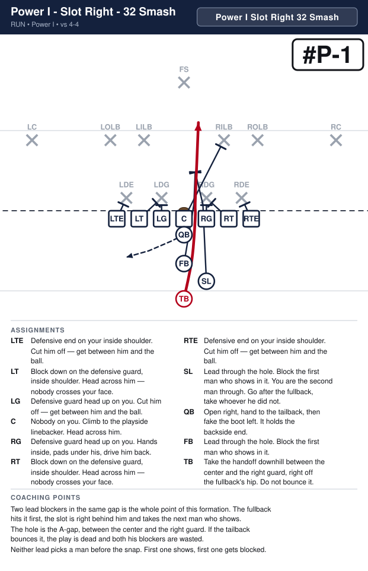
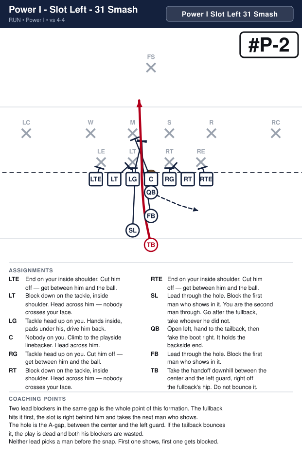
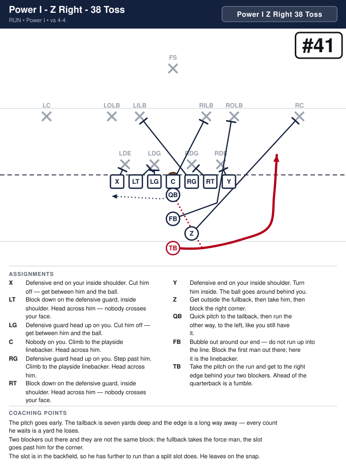
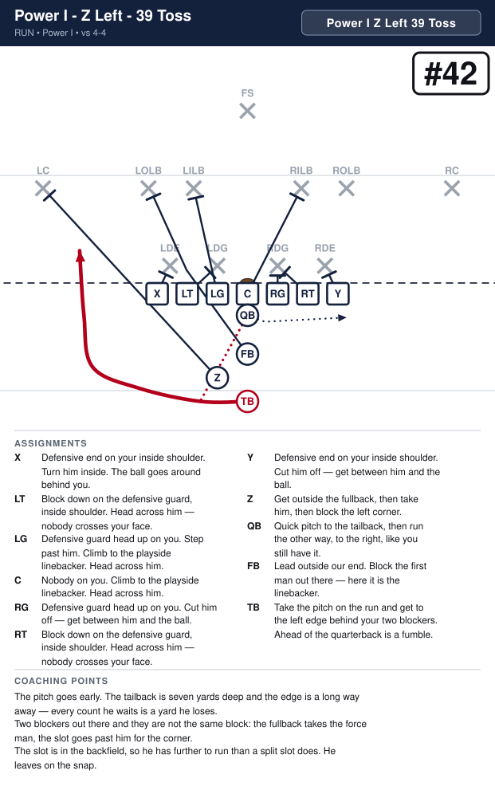

# Power I

_Generated by `generator/render.py`. Edit the JSON in `plays/`, not this file._

Same line as the I Formation — both ends tight, seven on the line every snap. The quarterback under the center, the fullback behind him and the tailback behind the fullback, exactly as always. The difference is the slot: instead of splitting out past the right end he stands in the backfield, behind a guard, halfway between the fullback and the tailback in depth. The call names his side — Power I Slot Right or Power I Slot Left — and that is the side the ball goes.

**Alignment** (yards; x positive to the right, y positive downfield, LOS = 0)

| Position | x | y |
|---|---|---|
| X | -4.2 | -0.5 |
| LT | -2.8 | -0.5 |
| LG | -1.4 | -0.5 |
| C | 0.0 | -0.5 |
| RG | 1.4 | -0.5 |
| RT | 2.8 | -0.5 |
| Y | 4.2 | -0.5 |
| QB | 0.0 | -1.5 |
| FB | 0.0 | -3.3 |
| Z | 1.4 | -4.4 |
| TB | 0.0 | -5.5 |

**Formation coaching notes**

- Count seven on the line every snap — both ends stay down. Four in the backfield, nobody split out: this is the one look where we have no receiver on the field.
- The slot lines up behind the guard, splitting the fullback and the tailback in depth. Off the tailback's outside shoulder, not beside the fullback.
- The call names his side, and his side is the play's side. Power I Slot Right runs right; Power I Slot Left moves him and runs left.
- He is a back here, not a slot. He gets a job written on every play — he never screens a corner out of this look, because there is no corner near him.
- Same numbers as the I Formation: 2 is the fullback, 3 the tailback. The tailback carries all four of these.

## Plays

| Play | Call | Scheme | Type | Ball |
|---|---|---|---|---|
| [Power I - Z Right - 32 Handoff](#power-i---z-right---32-handoff) | `Power I Z Right 32 Handoff` | Smash | run | TB |
| [Power I - Z Left - 33 Handoff](#power-i---z-left---33-handoff) | `Power I Z Left 33 Handoff` | Smash | run | TB |
| [Power I - Z Right - 38 Toss](#power-i---z-right---38-toss) | `Power I Z Right 38 Toss` | Toss | run | TB |
| [Power I - Z Left - 39 Toss](#power-i---z-left---39-toss) | `Power I Z Left 39 Toss` | Toss | run | TB |

---

## Power I - Z Right - 32 Handoff

**Call it:** `Power I Z Right 32 Handoff`

**Scheme:** Smash

| Position | Assignment |
|---|---|
| **X** | Defensive end on your inside shoulder. Cut him off — get between him and the ball. |
| **LT** | D — nothing in your gap and nobody on you. Go downfield and get the left inside linebacker. |
| **LG** | O — your gap is empty, so take the defensive guard on you. Hands inside, pads under his, drive him back. |
| **C** | D — nothing in your gap and nobody on you. Go downfield and get the right inside linebacker. |
| **RG** | O — your gap is empty, so take the defensive guard on you. Hands inside, pads under his, drive him back. |
| **RT** | D — nothing in your gap and nobody on you. Go downfield and get the right outside linebacker. |
| **Y** | Defensive end on your inside shoulder. Turn him inside. The ball goes around behind you. |
| **Z** | Lead through the hole. Block the first man who shows in it. You are the second man through. Go after the fullback, take whoever he did not. |
| **QB** | Open right, hand to the tailback, then fake the boot left. It holds the backside end. |
| **FB** | Lead through the hole. Block the first man who shows in it. |
| **TB** **(ball)** | Take the handoff downhill between the center and the right guard, right off the fullback's hip. Do not bounce it. |

**Coaching points**

- Two lead blockers in the same gap is the whole point of this formation. The fullback hits it first, the slot is right behind him and takes the next man who shows.
- The hole is the A-gap, between the center and the right guard. If the tailback bounces it, the play is dead and both his blockers are wasted.
- Neither lead picks a man before the snap. First one shows, first one gets blocked.

---

## Power I - Z Left - 33 Handoff

**Call it:** `Power I Z Left 33 Handoff`

**Scheme:** Smash

| Position | Assignment |
|---|---|
| **X** | Defensive end on your inside shoulder. Turn him inside. The ball goes around behind you. |
| **LT** | D — nothing in your gap and nobody on you. Go downfield and get the left inside linebacker. |
| **LG** | O — your gap is empty, so take the defensive guard on you. Hands inside, pads under his, drive him back. |
| **C** | D — nothing in your gap and nobody on you. Go downfield and get the right inside linebacker. |
| **RG** | O — your gap is empty, so take the defensive guard on you. Hands inside, pads under his, drive him back. |
| **RT** | D — nothing in your gap and nobody on you. Go downfield and get the right outside linebacker. |
| **Y** | Defensive end on your inside shoulder. Cut him off — get between him and the ball. |
| **Z** | Lead through the hole. Block the first man who shows in it. You are the second man through. Go after the fullback, take whoever he did not. |
| **QB** | Open left, hand to the tailback, then fake the boot right. It holds the backside end. |
| **FB** | Lead through the hole. Block the first man who shows in it. |
| **TB** **(ball)** | Take the handoff downhill between the center and the left guard, right off the fullback's hip. Do not bounce it. |

**Coaching points**

- Two lead blockers in the same gap is the whole point of this formation. The fullback hits it first, the slot is right behind him and takes the next man who shows.
- The hole is the A-gap, between the center and the left guard. If the tailback bounces it, the play is dead and both his blockers are wasted.
- Neither lead picks a man before the snap. First one shows, first one gets blocked.

---

## Power I - Z Right - 38 Toss

**Call it:** `Power I Z Right 38 Toss`

**Scheme:** Toss

| Position | Assignment |
|---|---|
| **X** | Defensive end on your inside shoulder. Cut him off — get between him and the ball. |
| **LT** | D — nothing in your gap and nobody on you. Go downfield and get the left inside linebacker. |
| **LG** | O — your gap is empty, so take the defensive guard on you. Hands inside, pads under his, drive him back. |
| **C** | D — nothing in your gap and nobody on you. Go downfield and get the right inside linebacker. |
| **RG** | O — your gap is empty, so take the defensive guard on you. Hands inside, pads under his, drive him back. |
| **RT** | D — nothing in your gap and nobody on you. Go downfield and get the right outside linebacker. |
| **Y** | Defensive end on your inside shoulder. Turn him inside. The ball goes around behind you. |
| **Z** | Get outside the fullback, then take him, then block the right corner. |
| **QB** | Quick pitch to the tailback, then run the other way, to the left, like you still have it. |
| **FB** | Bubble out around our end — do not run up into the line. Block the first man out there; here it is the linebacker. |
| **TB** **(ball)** | Take the pitch on the run and get to the right edge behind your two blockers. Ahead of the quarterback is a fumble. |

**Coaching points**

- The pitch goes early. The tailback is seven yards deep and the edge is a long way away — every count he waits is a yard he loses.
- Two blockers out there and they are not the same block: the fullback takes the force man, the slot goes past him for the corner.
- The slot is in the backfield, so he has further to run than a split slot does. He leaves on the snap.

---

## Power I - Z Left - 39 Toss

**Call it:** `Power I Z Left 39 Toss`

**Scheme:** Toss

| Position | Assignment |
|---|---|
| **X** | Defensive end on your inside shoulder. Turn him inside. The ball goes around behind you. |
| **LT** | D — nothing in your gap and nobody on you. Go downfield and get the left inside linebacker. |
| **LG** | O — your gap is empty, so take the defensive guard on you. Hands inside, pads under his, drive him back. |
| **C** | D — nothing in your gap and nobody on you. Go downfield and get the right inside linebacker. |
| **RG** | O — your gap is empty, so take the defensive guard on you. Hands inside, pads under his, drive him back. |
| **RT** | D — nothing in your gap and nobody on you. Go downfield and get the right outside linebacker. |
| **Y** | Defensive end on your inside shoulder. Cut him off — get between him and the ball. |
| **Z** | Get outside the fullback, then take him, then block the left corner. |
| **QB** | Quick pitch to the tailback, then run the other way, to the right, like you still have it. |
| **FB** | Bubble out around our end — do not run up into the line. Block the first man out there; here it is the linebacker. |
| **TB** **(ball)** | Take the pitch on the run and get to the left edge behind your two blockers. Ahead of the quarterback is a fumble. |

**Coaching points**

- The pitch goes early. The tailback is seven yards deep and the edge is a long way away — every count he waits is a yard he loses.
- Two blockers out there and they are not the same block: the fullback takes the force man, the slot goes past him for the corner.
- The slot is in the backfield, so he has further to run than a split slot does. He leaves on the snap.

