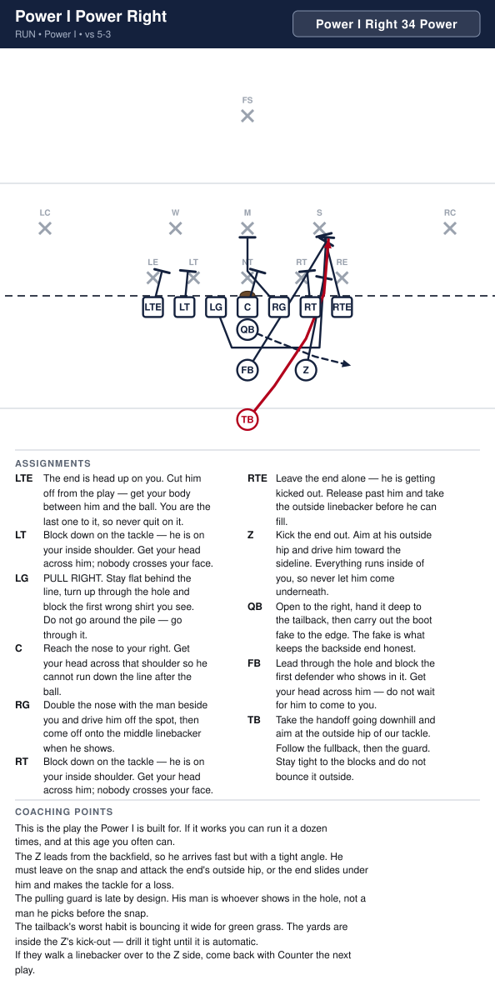
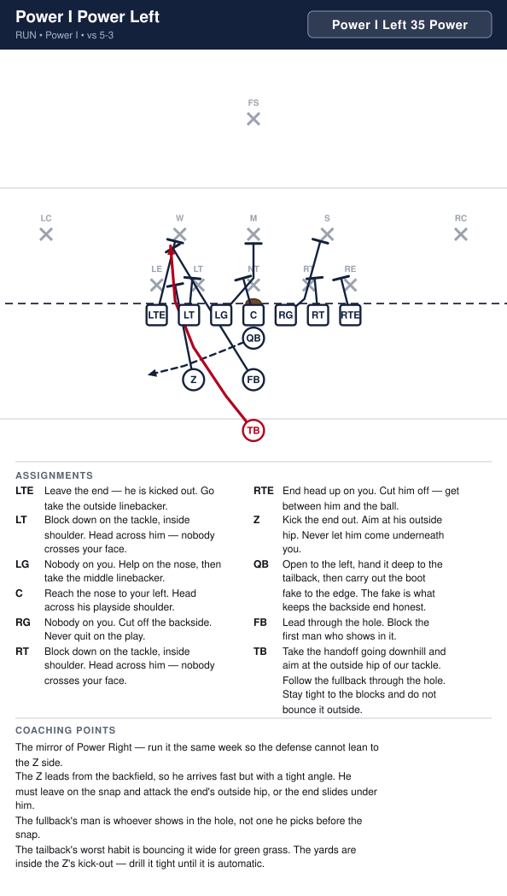
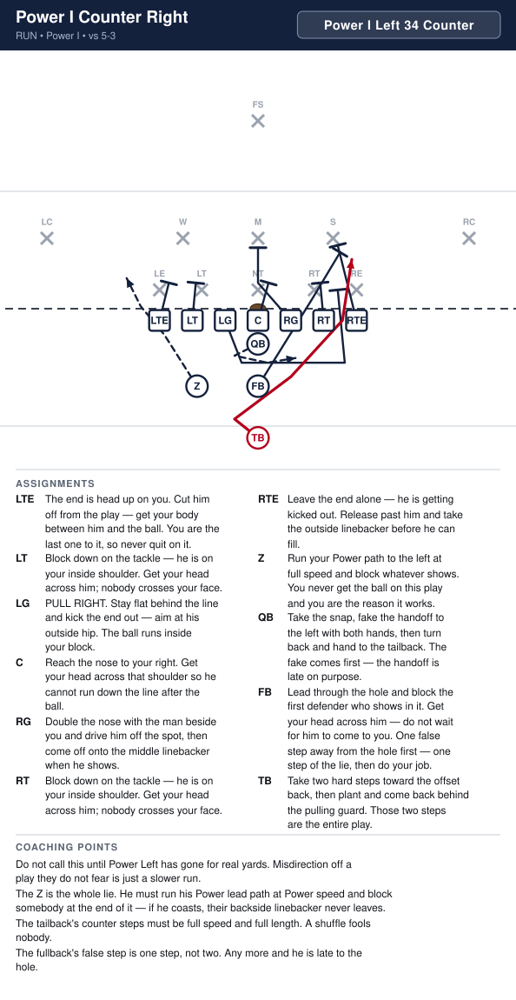
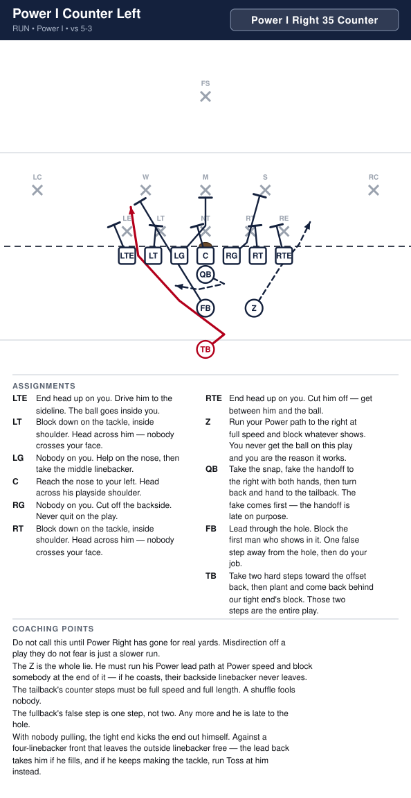
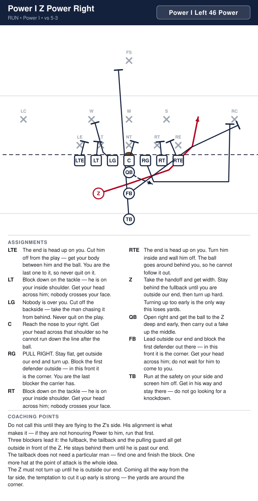
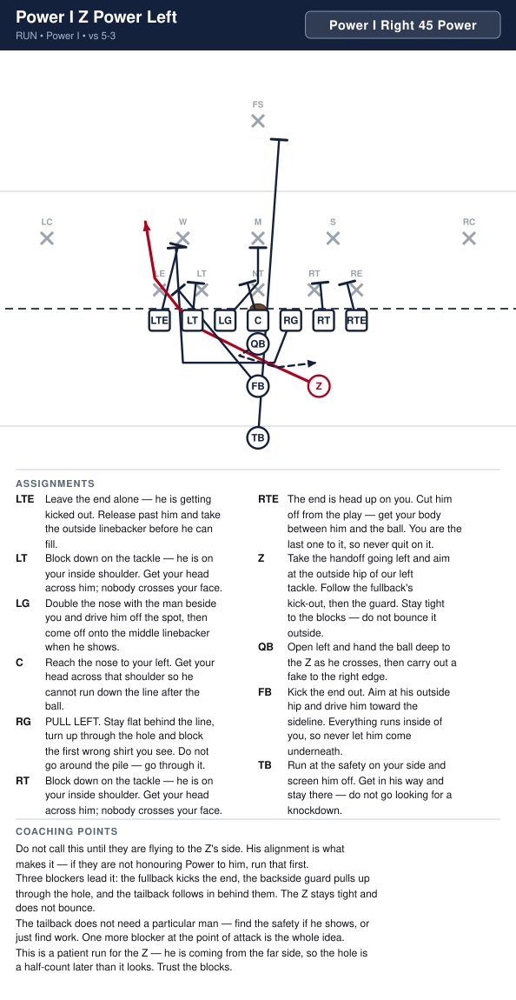
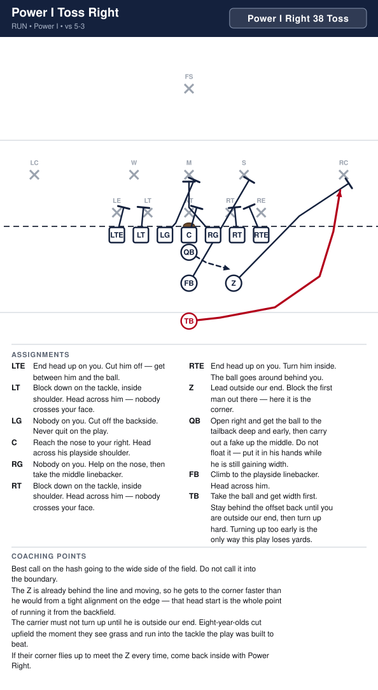
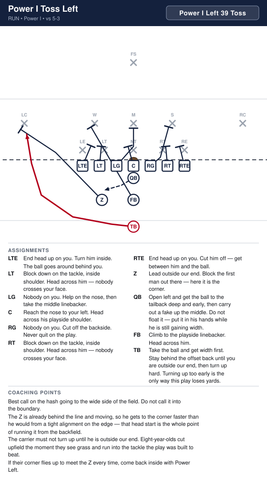

# Power I

_Generated by `generator/render.py`. Edit the JSON in `plays/`, not this file._

The base I with the Z off the line and into the backfield, offset beside the fullback about two and a half yards to the strength side — still seven on the line. Which side he offsets to is the strength call, Power I Right or Left, and it decides where Power and Counter go.

**Alignment** (yards; x positive to the right, y positive downfield, LOS = 0)

| Position | x | y |
|---|---|---|
| LTE | -4.2 | -0.5 |
| LT | -2.8 | -0.5 |
| LG | -1.4 | -0.5 |
| C | 0.0 | -0.5 |
| RG | 1.4 | -0.5 |
| RT | 2.8 | -0.5 |
| RTE | 4.2 | -0.5 |
| Z | 2.6 | -3.3 |
| QB | 0.0 | -1.5 |
| FB | 0.0 | -3.3 |
| TB | 0.0 | -5.5 |

**Formation coaching notes**

- Three backs means an extra runner and an extra blocker without adding anybody new — the same eleven kids as the base I with the Z moved off the line. Install once the I is solid; the line rules come almost free.
- The Z offsets to the strength side the call names. He leads that way on Power and Toss; on Counter he's the misdirection, running his lead path while the ball goes back the other way — the defense can't see which until the snap.
- Count seven on the line every snap. The Z is a yard and a half into the backfield, harder to line up illegally than a tight alignment — check it anyway.
- The Z is a back now, not a receiver — he blocks and fakes at the same speed. A coasted fake tells the defense who has the ball.

## Plays

| Play | Call | Type | Ball |
|---|---|---|---|
| [Power I Power Right](#power-i-power-right) | `Power I Right 34 Power` | run | TB |
| [Power I Power Left](#power-i-power-left) | `Power I Left 35 Power` | run | TB |
| [Power I Counter Right](#power-i-counter-right) | `Power I Left 34 Counter` | run | TB |
| [Power I Counter Left](#power-i-counter-left) | `Power I Right 35 Counter` | run | TB |
| [Power I Z Power Right](#power-i-z-power-right) | `Power I Left 46 Power` | run | Z |
| [Power I Z Power Left](#power-i-z-power-left) | `Power I Right 45 Power` | run | Z |
| [Power I Toss Right](#power-i-toss-right) | `Power I Right 38 Toss` | run | TB |
| [Power I Toss Left](#power-i-toss-left) | `Power I Left 39 Toss` | run | TB |

---

## Power I Power Right

**Call it:** `Power I Right 34 Power`

Our best downhill run. The line blocks down inside, the Z leads out of the backfield to kick the playside end, and the backside guard pulls through the hole in front of the tailback — two blockers in the same gap before the linebackers read it.

| Position | Assignment |
|---|---|
| **LTE** | The end is head up on you. Cut him off from the play — get your body between him and the ball. You are the last one to it, so never quit on it. |
| **LT** | Block down on the tackle — he is on your inside shoulder. Get your head across him; nobody crosses your face. |
| **LG** | PULL RIGHT. Stay flat behind the line, turn up through the hole and block the first wrong shirt you see. Do not go around the pile — go through it. |
| **C** | Reach the nose to your right. Get your head across that shoulder so he cannot run down the line after the ball. |
| **RG** | Double the nose with the man beside you and drive him off the spot, then come off onto the middle linebacker when he shows. |
| **RT** | Block down on the tackle — he is on your inside shoulder. Get your head across him; nobody crosses your face. |
| **RTE** | Leave the end alone — he is getting kicked out. Release past him and take the outside linebacker before he can fill. |
| **Z** | Kick the end out. Aim at his outside hip and drive him toward the sideline. Everything runs inside of you, so never let him come underneath. |
| **QB** | Open to the right, hand it deep to the tailback, then carry out the boot fake to the edge. The fake is what keeps the backside end honest. |
| **FB** | Lead through the hole and block the first defender who shows in it. Get your head across him — do not wait for him to come to you. |
| **TB** **(ball)** | Take the handoff going downhill and aim at the outside hip of our tackle. Follow the fullback, then the guard. Stay tight to the blocks and do not bounce it outside. |

**Coaching points**

- This is the play the Power I is built for. If it works you can run it a dozen times, and at this age you often can.
- The Z leads from the backfield, so he arrives fast but with a tight angle. He must leave on the snap and attack the end's outside hip, or the end slides under him and makes the tackle for a loss.
- The pulling guard is late by design. His man is whoever shows in the hole, not a man he picks before the snap.
- The tailback's worst habit is bouncing it wide for green grass. The yards are inside the Z's kick-out — drill it tight until it is automatic.
- If they walk a linebacker over to the Z side, come back with Counter the next play.

---

## Power I Power Left

**Call it:** `Power I Left 35 Power`

Power the other way. The line blocks down inside, the Z leads out of the backfield to kick the playside end, and the backside guard pulls through the hole in front of the tailback — two blockers in the same gap before the linebackers read it.

| Position | Assignment |
|---|---|
| **LTE** | Leave the end alone — he is getting kicked out. Release past him and take the outside linebacker before he can fill. |
| **LT** | Block down on the tackle — he is on your inside shoulder. Get your head across him; nobody crosses your face. |
| **LG** | Double the nose with the man beside you and drive him off the spot, then come off onto the middle linebacker when he shows. |
| **C** | Reach the nose to your left. Get your head across that shoulder so he cannot run down the line after the ball. |
| **RG** | PULL LEFT. Stay flat behind the line, turn up through the hole and block the first wrong shirt you see. Do not go around the pile — go through it. |
| **RT** | Block down on the tackle — he is on your inside shoulder. Get your head across him; nobody crosses your face. |
| **RTE** | The end is head up on you. Cut him off from the play — get your body between him and the ball. You are the last one to it, so never quit on it. |
| **Z** | Kick the end out. Aim at his outside hip and drive him toward the sideline. Everything runs inside of you, so never let him come underneath. |
| **QB** | Open to the left, hand it deep to the tailback, then carry out the boot fake to the edge. The fake is what keeps the backside end honest. |
| **FB** | Lead through the hole and block the first defender who shows in it. Get your head across him — do not wait for him to come to you. |
| **TB** **(ball)** | Take the handoff going downhill and aim at the outside hip of our tackle. Follow the fullback, then the guard. Stay tight to the blocks and do not bounce it outside. |

**Coaching points**

- The mirror of Power Right — run it the same week so the defense cannot lean to the Z side.
- The Z leads from the backfield, so he arrives fast but with a tight angle. He must leave on the snap and attack the end's outside hip, or the end slides under him.
- The pulling guard is late by design. His man is whoever shows in the hole, not a man he picks before the snap.
- The tailback's worst habit is bouncing it wide for green grass. The yards are inside the Z's kick-out — drill it tight until it is automatic.

---

## Power I Counter Right

**Call it:** `Power I Left 34 Counter`

The Z runs his Power lead path to the side he is set to — the thing the defense has been punished for respecting — and the tailback takes two hard steps after him, then comes back off-tackle the other way behind a pulling guard.

| Position | Assignment |
|---|---|
| **LTE** | The end is head up on you. Cut him off from the play — get your body between him and the ball. You are the last one to it, so never quit on it. |
| **LT** | Block down on the tackle — he is on your inside shoulder. Get your head across him; nobody crosses your face. |
| **LG** | PULL RIGHT. Stay flat behind the line and kick the end out — aim at his outside hip. The ball runs inside your block. |
| **C** | Reach the nose to your right. Get your head across that shoulder so he cannot run down the line after the ball. |
| **RG** | Double the nose with the man beside you and drive him off the spot, then come off onto the middle linebacker when he shows. |
| **RT** | Block down on the tackle — he is on your inside shoulder. Get your head across him; nobody crosses your face. |
| **RTE** | Leave the end alone — he is getting kicked out. Release past him and take the outside linebacker before he can fill. |
| **Z** | Run your Power path to the left at full speed and block whatever shows. You never get the ball on this play and you are the reason it works. |
| **QB** | Take the snap, fake the handoff to the left with both hands, then turn back and hand to the tailback. The fake comes first — the handoff is late on purpose. |
| **FB** | Lead through the hole and block the first defender who shows in it. Get your head across him — do not wait for him to come to you. One false step away from the hole first — one step of the lie, then do your job. |
| **TB** **(ball)** | Take two hard steps toward the offset back, then plant and come back behind the pulling guard. Those two steps are the entire play. |

**Coaching points**

- Do not call this until Power Left has gone for real yards. Misdirection off a play they do not fear is just a slower run.
- The Z is the whole lie. He must run his Power lead path at Power speed and block somebody at the end of it — if he coasts, their backside linebacker never leaves.
- The tailback's counter steps must be full speed and full length. A shuffle fools nobody.
- The fullback's false step is one step, not two. Any more and he is late to the hole.

---

## Power I Counter Left

**Call it:** `Power I Right 35 Counter`

The Z runs his Power lead path to the side he is set to — the thing the defense has been punished for respecting — and the tailback takes two hard steps after him, then comes back off-tackle the other way behind a pulling guard.

| Position | Assignment |
|---|---|
| **LTE** | Leave the end alone — he is getting kicked out. Release past him and take the outside linebacker before he can fill. |
| **LT** | Block down on the tackle — he is on your inside shoulder. Get your head across him; nobody crosses your face. |
| **LG** | Double the nose with the man beside you and drive him off the spot, then come off onto the middle linebacker when he shows. |
| **C** | Reach the nose to your left. Get your head across that shoulder so he cannot run down the line after the ball. |
| **RG** | PULL LEFT. Stay flat behind the line and kick the end out — aim at his outside hip. The ball runs inside your block. |
| **RT** | Block down on the tackle — he is on your inside shoulder. Get your head across him; nobody crosses your face. |
| **RTE** | The end is head up on you. Cut him off from the play — get your body between him and the ball. You are the last one to it, so never quit on it. |
| **Z** | Run your Power path to the right at full speed and block whatever shows. You never get the ball on this play and you are the reason it works. |
| **QB** | Take the snap, fake the handoff to the right with both hands, then turn back and hand to the tailback. The fake comes first — the handoff is late on purpose. |
| **FB** | Lead through the hole and block the first defender who shows in it. Get your head across him — do not wait for him to come to you. One false step away from the hole first — one step of the lie, then do your job. |
| **TB** **(ball)** | Take two hard steps toward the offset back, then plant and come back behind the pulling guard. Those two steps are the entire play. |

**Coaching points**

- Do not call this until Power Right has gone for real yards. Misdirection off a play they do not fear is just a slower run.
- The Z is the whole lie. He must run his Power lead path at Power speed and block somebody at the end of it — if he coasts, their backside linebacker never leaves.
- The tailback's counter steps must be full speed and full length. A shuffle fools nobody.
- The fullback's false step is one step, not two. Any more and he is late to the hole and the pulling guard is running alone.

---

## Power I Z Power Right

**Call it:** `Power I Left 46 Power`

The wider mirror of Z Power Left. The Z is set to the left and takes it all the way around the right end behind three lead blockers — fullback, tailback and the pulling guard.

| Position | Assignment |
|---|---|
| **LTE** | The end is head up on you. Cut him off from the play — get your body between him and the ball. You are the last one to it, so never quit on it. |
| **LT** | Block down on the tackle — he is on your inside shoulder. Get your head across him; nobody crosses your face. |
| **LG** | Nobody is over you. Cut off the backside — take the man chasing it from behind. Never quit on the play. |
| **C** | Reach the nose to your right. Get your head across that shoulder so he cannot run down the line after the ball. |
| **RG** | PULL RIGHT. Stay flat, get outside our end and turn up. Block the first defender outside — in this front it is the corner. You are the last blocker the carrier has. |
| **RT** | Block down on the tackle — he is on your inside shoulder. Get your head across him; nobody crosses your face. |
| **RTE** | The end is head up on you. Turn him inside and wall him off. The ball goes around behind you, so he cannot follow it out. |
| **Z** **(ball)** | Take the handoff and get width. Stay behind the fullback until you are outside our end, then turn up hard. Turning up too early is the only way this loses yards. |
| **QB** | Open right and get the ball to the Z deep and early, then carry out a fake up the middle. |
| **FB** | Lead outside our end and block the first defender out there — in this front it is the corner. Get your head across him; do not wait for him to come to you. |
| **TB** | Run at the safety on your side and screen him off. Get in his way and stay there — do not go looking for a knockdown. |

**Coaching points**

- Do not call this until they are flying to the Z's side. His alignment is what makes it — if they are not honouring Power to him, run that first.
- Three blockers lead it: the fullback, the tailback and the pulling guard all get outside in front of the Z. He stays behind them until he is past our end.
- The tailback does not need a particular man — find one and finish the block. One more hat at the point of attack is the whole idea.
- The Z must not turn up until he is outside our end. Coming all the way from the far side, the temptation to cut it up early is strong — the yards are around the corner.

---

## Power I Z Power Left

**Call it:** `Power I Right 45 Power`

The Z's alignment says Power to his side; this goes the other way. He takes the ball back across behind the fullback's kick-out, the pulling guard and the tailback — three blockers clearing the way instead of one selling a fake.

| Position | Assignment |
|---|---|
| **LTE** | Leave the end alone — he is getting kicked out. Release past him and take the outside linebacker before he can fill. |
| **LT** | Block down on the tackle — he is on your inside shoulder. Get your head across him; nobody crosses your face. |
| **LG** | Double the nose with the man beside you and drive him off the spot, then come off onto the middle linebacker when he shows. |
| **C** | Reach the nose to your left. Get your head across that shoulder so he cannot run down the line after the ball. |
| **RG** | PULL LEFT. Stay flat behind the line, turn up through the hole and block the first wrong shirt you see. Do not go around the pile — go through it. |
| **RT** | Block down on the tackle — he is on your inside shoulder. Get your head across him; nobody crosses your face. |
| **RTE** | The end is head up on you. Cut him off from the play — get your body between him and the ball. You are the last one to it, so never quit on it. |
| **Z** **(ball)** | Take the handoff going left and aim at the outside hip of our left tackle. Follow the fullback's kick-out, then the guard. Stay tight to the blocks — do not bounce it outside. |
| **QB** | Open left and hand the ball deep to the Z as he crosses, then carry out a fake to the right edge. |
| **FB** | Kick the end out. Aim at his outside hip and drive him toward the sideline. Everything runs inside of you, so never let him come underneath. |
| **TB** | Run at the safety on your side and screen him off. Get in his way and stay there — do not go looking for a knockdown. |

**Coaching points**

- Do not call this until they are flying to the Z's side. His alignment is what makes it — if they are not honouring Power to him, run that first.
- Three blockers lead it: the fullback kicks the end, the backside guard pulls up through the hole, and the tailback follows in behind them. The Z stays tight and does not bounce.
- The tailback does not need a particular man — find the safety if he shows, or just find work. One more blocker at the point of attack is the whole idea.
- This is a patient run for the Z — he is coming from the far side, so the hole is a half-count later than it looks. Trust the blocks.

---

## Power I Toss Right

**Call it:** `Power I Right 38 Toss`

Two lead blockers around the corner. The Z and the pulling guard get outside in front of the tailback, and a defense that has been squeezing the off-tackle hole all game has nobody left on the edge.

| Position | Assignment |
|---|---|
| **LTE** | The end is head up on you. Cut him off from the play — get your body between him and the ball. You are the last one to it, so never quit on it. |
| **LT** | Block down on the tackle — he is on your inside shoulder. Get your head across him; nobody crosses your face. |
| **LG** | Nobody is over you. Cut off the backside — take the man chasing it from behind. Never quit on the play. |
| **C** | Reach the nose to your right. Get your head across that shoulder so he cannot run down the line after the ball. |
| **RG** | PULL RIGHT. Stay flat, get outside our end and turn up. Block the first defender outside — in this front it is the corner. You are the last blocker the carrier has. |
| **RT** | Block down on the tackle — he is on your inside shoulder. Get your head across him; nobody crosses your face. |
| **RTE** | The end is head up on you. Turn him inside and wall him off. The ball goes around behind you, so he cannot follow it out. |
| **Z** | Lead outside our end and block the first defender out there — in this front it is the corner. Get your head across him; do not wait for him to come to you. |
| **QB** | Open right and get the ball to the tailback deep and early, then carry out a fake up the middle. Do not float it — put it in his hands while he is still gaining width. |
| **FB** |  Climb to the playside linebacker and get your head across him — he is the man who makes this tackle if nobody gets to him. |
| **TB** **(ball)** | Take the ball and get width first. Stay behind the offset back until you are outside our end, then turn up hard. Turning up too early is the only way this play loses yards. |

**Coaching points**

- Best call on the hash going to the wide side of the field. Do not call it into the boundary.
- The Z is already behind the line and moving, so he gets to the corner faster than he would from a tight alignment on the edge — that head start is the whole point of running it from the backfield.
- The carrier must not turn up until he is outside our end. Eight-year-olds cut upfield the moment they see grass and run into the tackle the play was built to beat.
- If their corner flies up to meet the pull every time, come back inside with Power Right.

---

## Power I Toss Left

**Call it:** `Power I Left 39 Toss`

Two lead blockers around the corner. The Z and the pulling guard get outside in front of the tailback, and a defense that has been squeezing the off-tackle hole all game has nobody left on the edge.

| Position | Assignment |
|---|---|
| **LTE** | The end is head up on you. Turn him inside and wall him off. The ball goes around behind you, so he cannot follow it out. |
| **LT** | Block down on the tackle — he is on your inside shoulder. Get your head across him; nobody crosses your face. |
| **LG** | PULL LEFT. Stay flat, get outside our end and turn up. Block the first defender outside — in this front it is the corner. You are the last blocker the carrier has. |
| **C** | Reach the nose to your left. Get your head across that shoulder so he cannot run down the line after the ball. |
| **RG** | Nobody is over you. Cut off the backside — take the man chasing it from behind. Never quit on the play. |
| **RT** | Block down on the tackle — he is on your inside shoulder. Get your head across him; nobody crosses your face. |
| **RTE** | The end is head up on you. Cut him off from the play — get your body between him and the ball. You are the last one to it, so never quit on it. |
| **Z** | Lead outside our end and block the first defender out there — in this front it is the corner. Get your head across him; do not wait for him to come to you. |
| **QB** | Open left and get the ball to the tailback deep and early, then carry out a fake up the middle. Do not float it — put it in his hands while he is still gaining width. |
| **FB** |  Climb to the playside linebacker and get your head across him — he is the man who makes this tackle if nobody gets to him. |
| **TB** **(ball)** | Take the ball and get width first. Stay behind the offset back until you are outside our end, then turn up hard. Turning up too early is the only way this play loses yards. |

**Coaching points**

- Best call on the hash going to the wide side of the field. Do not call it into the boundary.
- The Z is already behind the line and moving, so he gets to the corner faster than he would from a tight alignment on the edge — that head start is the whole point of running it from the backfield.
- The carrier must not turn up until he is outside our end. Eight-year-olds cut upfield the moment they see grass and run into the tackle the play was built to beat.
- If their corner flies up to meet the pull every time, come back inside with Power Left.

