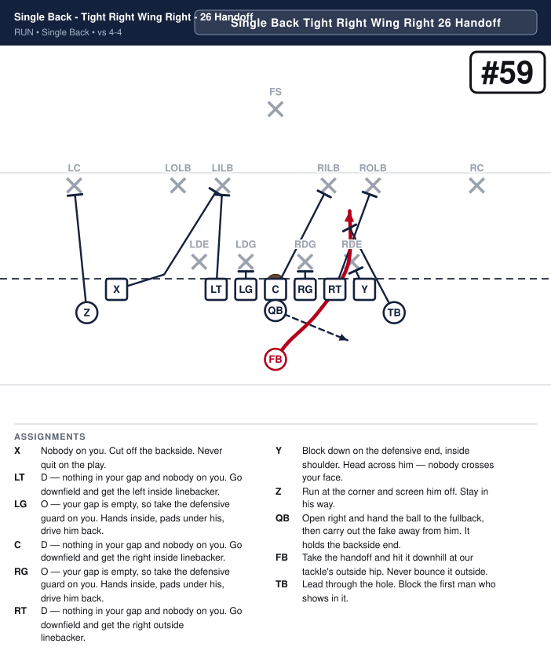
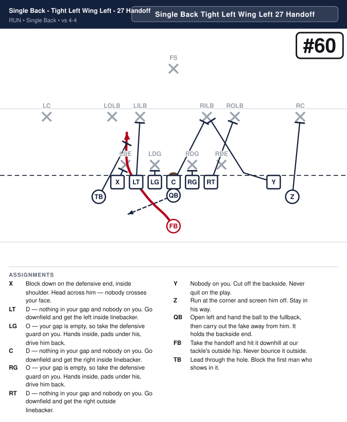
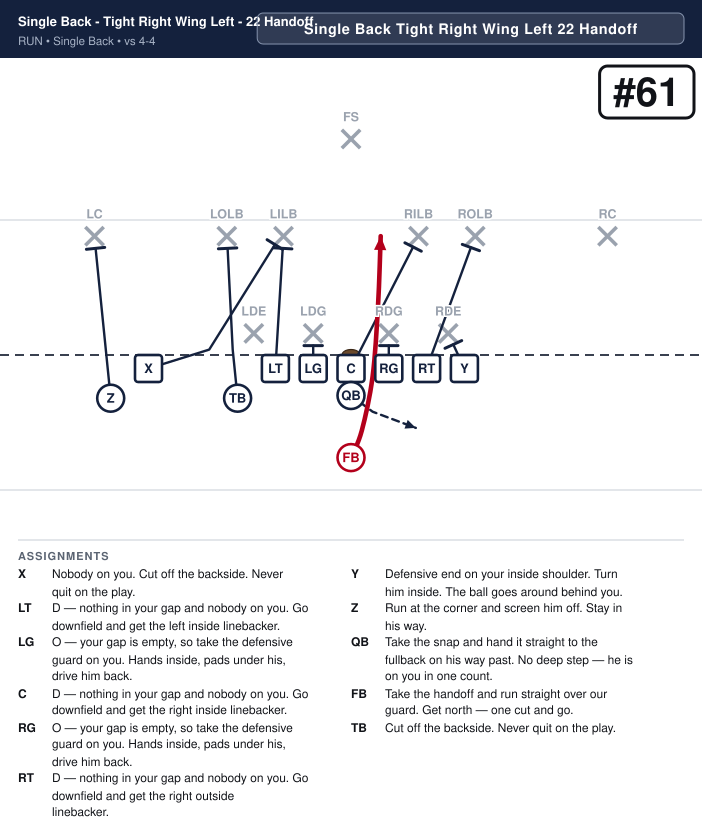
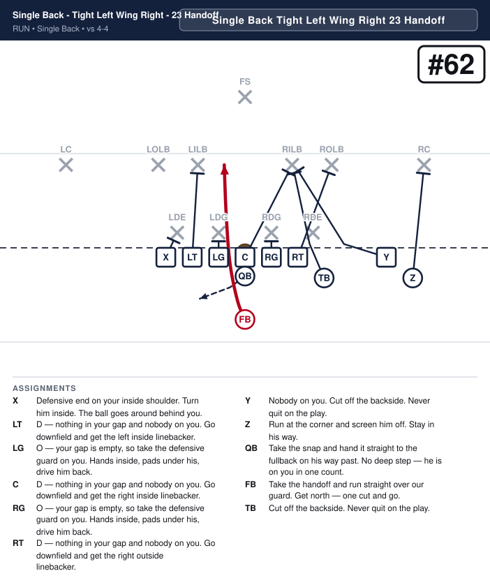
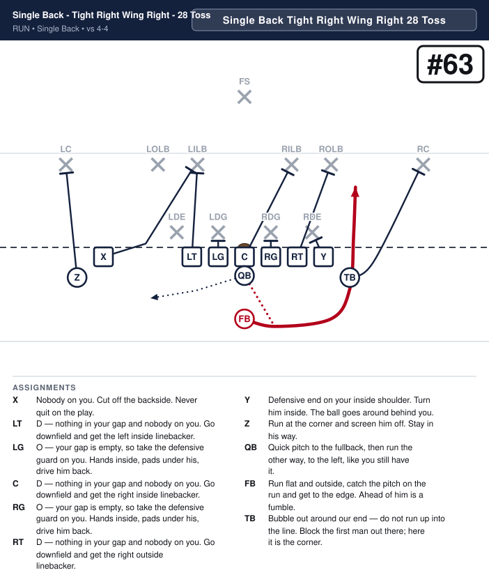
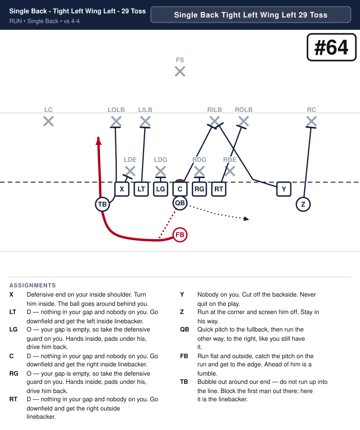
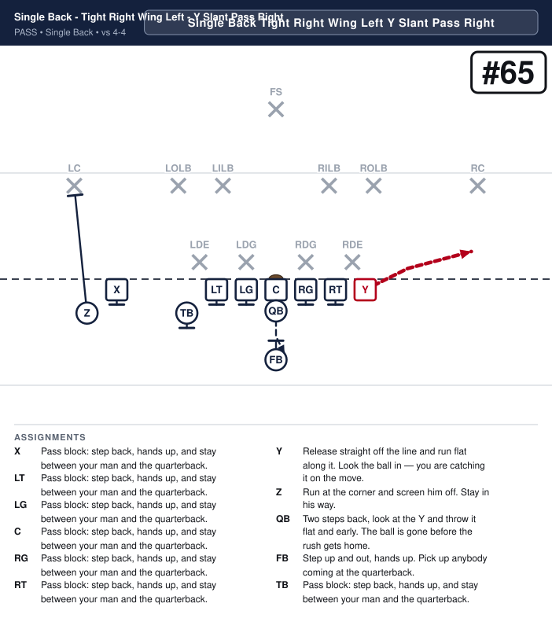
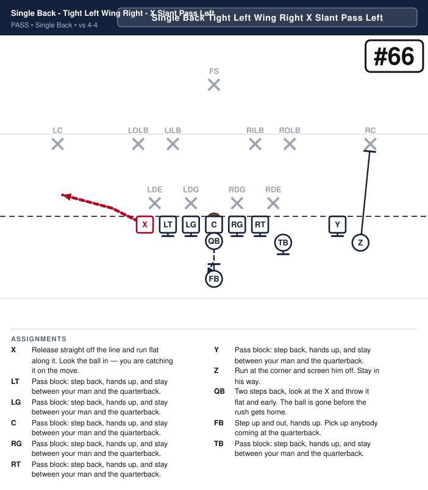

# Single Back

_Generated by `generator/render.py`. Edit the JSON in `plays/`, not this file._

Seven on the line every snap: the five up front, plus both ends. One end is tight beside his tackle and the other splits away; the call names which. The Z always goes out with the SPLIT end, just outside him and a yard off the line, so the two of them are the wide pair on that side and the Z never has to be called. The wing is the tailback, off the line, on whichever side the call puts him. The fullback is the only man in the backfield, directly behind the quarterback, and he carries every numbered run in this formation.

**Alignment** (yards; x positive to the right, y positive downfield, LOS = 0)

| Position | x | y |
|---|---|---|
| X | -7.5 | -0.5 |
| LT | -2.8 | -0.5 |
| LG | -1.4 | -0.5 |
| C | 0.0 | -0.5 |
| RG | 1.4 | -0.5 |
| RT | 2.8 | -0.5 |
| Y | 4.2 | -0.5 |
| Z | -8.9 | -1.6 |
| TB | -4.2 | -1.6 |
| QB | 0.0 | -1.5 |
| FB | 0.0 | -3.8 |

**Formation coaching notes**

- Count seven on the line every snap: the five up front, the tight end beside his tackle, and the split end out on his own. The split end is still ON the line — he is a long way from everybody, which makes standing him up the easiest illegal-formation flag in this look.
- The Z and the wing are both OFF the line, a yard back. Either of them creeping up onto it is the same flag from the other direction, and in this formation there is nobody spare to give the seventh man back.
- One rule for the Z, and it is the reason the call never mentions him: he goes out with the SPLIT end, outside him and off the line. Whichever end is tight, the Z is on the other side. Tell him to find the man who is out on his own and stand outside him.
- The fullback is the only back and he carries every numbered run, so every run here is a 2: 22 and 23 over the guard, 26 and 27 off tackle, 28 and 29 outside. There is no 3 in this formation because there is nobody behind the quarterback to be it.
- The tailback is the wing here and he never carries it. He is a blocker on the runs and a receiver on the passes, which is a different job from the one he has in every other formation — say so when you install it.
- Run it to the tight end. The C gap is a real hole on the tight side and nearly five yards of grass on the split side, so 26 belongs in Tight Right and 27 in Tight Left. The build rejects it the other way round.

## Plays

| Play | Call | Scheme | Type | Ball |
|---|---|---|---|---|
| [Single Back - Tight Right Wing Right - 26 Handoff](#single-back---tight-right-wing-right---26-handoff) | `Single Back Tight Right Wing Right 26 Handoff` | Power | run | FB |
| [Single Back - Tight Left Wing Left - 27 Handoff](#single-back---tight-left-wing-left---27-handoff) | `Single Back Tight Left Wing Left 27 Handoff` | Power | run | FB |
| [Single Back - Tight Right Wing Left - 22 Handoff](#single-back---tight-right-wing-left---22-handoff) | `Single Back Tight Right Wing Left 22 Handoff` | Smash | run | FB |
| [Single Back - Tight Left Wing Right - 23 Handoff](#single-back---tight-left-wing-right---23-handoff) | `Single Back Tight Left Wing Right 23 Handoff` | Smash | run | FB |
| [Single Back - Tight Right Wing Right - 28 Toss](#single-back---tight-right-wing-right---28-toss) | `Single Back Tight Right Wing Right 28 Toss` | Toss | run | FB |
| [Single Back - Tight Left Wing Left - 29 Toss](#single-back---tight-left-wing-left---29-toss) | `Single Back Tight Left Wing Left 29 Toss` | Toss | run | FB |
| [Single Back - Tight Right Wing Left - Y Slant Pass Right](#single-back---tight-right-wing-left---y-slant-pass-right) | `Single Back Tight Right Wing Left Y Slant Pass Right` | Protect | pass | Y |
| [Single Back - Tight Left Wing Right - X Slant Pass Left](#single-back---tight-left-wing-right---x-slant-pass-left) | `Single Back Tight Left Wing Right X Slant Pass Left` | Protect | pass | X |

---

## Single Back - Tight Right Wing Right - 26 Handoff

**Call it:** `Single Back Tight Right Wing Right 26 Handoff`

**Scheme:** Power

| Position | Assignment |
|---|---|
| **X** | Nobody on you. Cut off the backside. Never quit on the play. |
| **LT** | D — nothing in your gap and nobody on you. Go downfield and get the left inside linebacker. |
| **LG** | O — your gap is empty, so take the defensive guard on you. Hands inside, pads under his, drive him back. |
| **C** | D — nothing in your gap and nobody on you. Go downfield and get the right inside linebacker. |
| **RG** | O — your gap is empty, so take the defensive guard on you. Hands inside, pads under his, drive him back. |
| **RT** | D — nothing in your gap and nobody on you. Go downfield and get the right outside linebacker. |
| **Y** | Block down on the defensive end, inside shoulder. Head across him — nobody crosses your face. |
| **Z** | Run at the corner and screen him off. Stay in his way. |
| **QB** | Open right and hand the ball to the fullback, then carry out the fake away from him. It holds the backside end. |
| **FB** **(ball)** | Take the handoff and hit it downhill at our tackle's outside hip. Never bounce it outside. |
| **TB** | Lead through the hole. Block the first man who shows in it. |

**Coaching points**

- The only back carries it, so there is nobody behind him to lead. The wing is the lead blocker, and that is why the call puts him on the right.
- Run it at the tight end. The Y is beside his tackle here and the C gap is a real hole; on the split side the same gap is five yards of grass and this play does not exist. The build rejects it the other way round.
- The fullback is alone in the backfield, so he is the whole run game in this formation. Every number here is a 2.

---

## Single Back - Tight Left Wing Left - 27 Handoff

**Call it:** `Single Back Tight Left Wing Left 27 Handoff`

**Scheme:** Power

| Position | Assignment |
|---|---|
| **X** | Block down on the defensive end, inside shoulder. Head across him — nobody crosses your face. |
| **LT** | D — nothing in your gap and nobody on you. Go downfield and get the left inside linebacker. |
| **LG** | O — your gap is empty, so take the defensive guard on you. Hands inside, pads under his, drive him back. |
| **C** | D — nothing in your gap and nobody on you. Go downfield and get the right inside linebacker. |
| **RG** | O — your gap is empty, so take the defensive guard on you. Hands inside, pads under his, drive him back. |
| **RT** | D — nothing in your gap and nobody on you. Go downfield and get the right outside linebacker. |
| **Y** | Nobody on you. Cut off the backside. Never quit on the play. |
| **Z** | Run at the corner and screen him off. Stay in his way. |
| **QB** | Open left and hand the ball to the fullback, then carry out the fake away from him. It holds the backside end. |
| **FB** **(ball)** | Take the handoff and hit it downhill at our tackle's outside hip. Never bounce it outside. |
| **TB** | Lead through the hole. Block the first man who shows in it. |

**Coaching points**

- The only back carries it, so there is nobody behind him to lead. The wing is the lead blocker, and that is why the call puts him on the left.
- Run it at the tight end. The X is beside his tackle here and the C gap is a real hole; on the split side the same gap is five yards of grass and this play does not exist. The build rejects it the other way round.
- The fullback is alone in the backfield, so he is the whole run game in this formation. Every number here is a 2.

---

## Single Back - Tight Right Wing Left - 22 Handoff

**Call it:** `Single Back Tight Right Wing Left 22 Handoff`

**Scheme:** Smash

| Position | Assignment |
|---|---|
| **X** | Nobody on you. Cut off the backside. Never quit on the play. |
| **LT** | D — nothing in your gap and nobody on you. Go downfield and get the left inside linebacker. |
| **LG** | O — your gap is empty, so take the defensive guard on you. Hands inside, pads under his, drive him back. |
| **C** | D — nothing in your gap and nobody on you. Go downfield and get the right inside linebacker. |
| **RG** | O — your gap is empty, so take the defensive guard on you. Hands inside, pads under his, drive him back. |
| **RT** | D — nothing in your gap and nobody on you. Go downfield and get the right outside linebacker. |
| **Y** | Defensive end on your inside shoulder. Turn him inside. The ball goes around behind you. |
| **Z** | Run at the corner and screen him off. Stay in his way. |
| **QB** | Take the snap and hand it straight to the fullback on his way past. No deep step — he is on you in one count. |
| **FB** **(ball)** | Take the handoff and run straight over our guard. Get north — one cut and go. |
| **TB** | Cut off the backside. Never quit on the play. |

**Coaching points**

- The fastest-hitting play in the formation. The fullback is already square to the line, so there is no crossing step and nothing to time.
- The wing is on the back side here and his job is the cutoff. Nobody runs this one down from behind if he does it.
- If they walk a safety into the box for this, that is what the toss and the slant pass are for.

---

## Single Back - Tight Left Wing Right - 23 Handoff

**Call it:** `Single Back Tight Left Wing Right 23 Handoff`

**Scheme:** Smash

| Position | Assignment |
|---|---|
| **X** | Defensive end on your inside shoulder. Turn him inside. The ball goes around behind you. |
| **LT** | D — nothing in your gap and nobody on you. Go downfield and get the left inside linebacker. |
| **LG** | O — your gap is empty, so take the defensive guard on you. Hands inside, pads under his, drive him back. |
| **C** | D — nothing in your gap and nobody on you. Go downfield and get the right inside linebacker. |
| **RG** | O — your gap is empty, so take the defensive guard on you. Hands inside, pads under his, drive him back. |
| **RT** | D — nothing in your gap and nobody on you. Go downfield and get the right outside linebacker. |
| **Y** | Nobody on you. Cut off the backside. Never quit on the play. |
| **Z** | Run at the corner and screen him off. Stay in his way. |
| **QB** | Take the snap and hand it straight to the fullback on his way past. No deep step — he is on you in one count. |
| **FB** **(ball)** | Take the handoff and run straight over our guard. Get north — one cut and go. |
| **TB** | Cut off the backside. Never quit on the play. |

**Coaching points**

- The fastest-hitting play in the formation. The fullback is already square to the line, so there is no crossing step and nothing to time.
- The wing is on the back side here and his job is the cutoff. Nobody runs this one down from behind if he does it.
- If they walk a safety into the box for this, that is what the toss and the slant pass are for.

---

## Single Back - Tight Right Wing Right - 28 Toss

**Call it:** `Single Back Tight Right Wing Right 28 Toss`

**Scheme:** Toss

| Position | Assignment |
|---|---|
| **X** | Nobody on you. Cut off the backside. Never quit on the play. |
| **LT** | D — nothing in your gap and nobody on you. Go downfield and get the left inside linebacker. |
| **LG** | O — your gap is empty, so take the defensive guard on you. Hands inside, pads under his, drive him back. |
| **C** | D — nothing in your gap and nobody on you. Go downfield and get the right inside linebacker. |
| **RG** | O — your gap is empty, so take the defensive guard on you. Hands inside, pads under his, drive him back. |
| **RT** | D — nothing in your gap and nobody on you. Go downfield and get the right outside linebacker. |
| **Y** | Defensive end on your inside shoulder. Turn him inside. The ball goes around behind you. |
| **Z** | Run at the corner and screen him off. Stay in his way. |
| **QB** | Quick pitch to the fullback, then run the other way, to the left, like you still have it. |
| **FB** **(ball)** | Run flat and outside, catch the pitch on the run and get to the edge. Ahead of him is a fumble. |
| **TB** | Bubble out around our end — do not run up into the line. Block the first man out there; here it is the corner. |

**Coaching points**

- The wing is out on the edge ahead of the ball and he has the force man — the widest defender who can turn this back inside.
- The fullback pitches from directly behind the quarterback, so the pitch is shorter and flatter than the one out of the Split Formation. Rep it on its own.
- The Z is on the other side with the split end, so this edge is the tight end and the wing and nobody else. Two blockers and the back — if either one misses, there is no third man out there to cover it up.

---

## Single Back - Tight Left Wing Left - 29 Toss

**Call it:** `Single Back Tight Left Wing Left 29 Toss`

**Scheme:** Toss

| Position | Assignment |
|---|---|
| **X** | Defensive end on your inside shoulder. Turn him inside. The ball goes around behind you. |
| **LT** | D — nothing in your gap and nobody on you. Go downfield and get the left inside linebacker. |
| **LG** | O — your gap is empty, so take the defensive guard on you. Hands inside, pads under his, drive him back. |
| **C** | D — nothing in your gap and nobody on you. Go downfield and get the right inside linebacker. |
| **RG** | O — your gap is empty, so take the defensive guard on you. Hands inside, pads under his, drive him back. |
| **RT** | D — nothing in your gap and nobody on you. Go downfield and get the right outside linebacker. |
| **Y** | Nobody on you. Cut off the backside. Never quit on the play. |
| **Z** | Run at the corner and screen him off. Stay in his way. |
| **QB** | Quick pitch to the fullback, then run the other way, to the right, like you still have it. |
| **FB** **(ball)** | Run flat and outside, catch the pitch on the run and get to the edge. Ahead of him is a fumble. |
| **TB** | Bubble out around our end — do not run up into the line. Block the first man out there; here it is the linebacker. |

**Coaching points**

- The wing is out on the edge ahead of the ball and he has the force man — the widest defender who can turn this back inside.
- The fullback pitches from directly behind the quarterback, so the pitch is shorter and flatter than the one out of the Split Formation. Rep it on its own.
- The Z is on the other side with the split end, so this edge is the tight end and the wing and nobody else. Two blockers and the back — if either one misses, there is no third man out there to cover it up.

---

## Single Back - Tight Right Wing Left - Y Slant Pass Right

**Call it:** `Single Back Tight Right Wing Left Y Slant Pass Right`

**Scheme:** Protect

| Position | Assignment |
|---|---|
| **X** | Pass block: step back, hands up, and stay between your man and the quarterback. |
| **LT** | Pass block: step back, hands up, and stay between your man and the quarterback. |
| **LG** | Pass block: step back, hands up, and stay between your man and the quarterback. |
| **C** | Pass block: step back, hands up, and stay between your man and the quarterback. |
| **RG** | Pass block: step back, hands up, and stay between your man and the quarterback. |
| **RT** | Pass block: step back, hands up, and stay between your man and the quarterback. |
| **Y** **(ball)** | Release straight off the line and run flat along it. Look the ball in — you are catching it on the move. |
| **Z** | Run at the corner and screen him off. Stay in his way. |
| **QB** | Two steps back, look at the Y and throw it flat and early. The ball is gone before the rush gets home. |
| **FB** | Step up and out, hands up. Pick up anybody coming at the quarterback. |
| **TB** | Pass block: step back, hands up, and stay between your man and the quarterback. |

**Coaching points**

- The Y is the tight end on this side, so he releases off a defender's outside shoulder rather than off open grass. He has to get clean first.
- The fullback and the wing both stay in. Five linemen and two backs on a two-step throw is more than anybody at this age gets through.
- Call it after the Power has gone at this side twice. It is the one that punishes a linebacker for stepping up.

---

## Single Back - Tight Left Wing Right - X Slant Pass Left

**Call it:** `Single Back Tight Left Wing Right X Slant Pass Left`

**Scheme:** Protect

| Position | Assignment |
|---|---|
| **X** **(ball)** | Release straight off the line and run flat along it. Look the ball in — you are catching it on the move. |
| **LT** | Pass block: step back, hands up, and stay between your man and the quarterback. |
| **LG** | Pass block: step back, hands up, and stay between your man and the quarterback. |
| **C** | Pass block: step back, hands up, and stay between your man and the quarterback. |
| **RG** | Pass block: step back, hands up, and stay between your man and the quarterback. |
| **RT** | Pass block: step back, hands up, and stay between your man and the quarterback. |
| **Y** | Pass block: step back, hands up, and stay between your man and the quarterback. |
| **Z** | Run at the corner and screen him off. Stay in his way. |
| **QB** | Two steps back, look at the X and throw it flat and early. The ball is gone before the rush gets home. |
| **FB** | Step up and out, hands up. Pick up anybody coming at the quarterback. |
| **TB** | Pass block: step back, hands up, and stay between your man and the quarterback. |

**Coaching points**

- The X is the tight end on this side, so he releases off a defender's outside shoulder rather than off open grass. He has to get clean first.
- The fullback and the wing both stay in. Five linemen and two backs on a two-step throw is more than anybody at this age gets through.
- Call it after the Power has gone at this side twice. It is the one that punishes a linebacker for stepping up.

