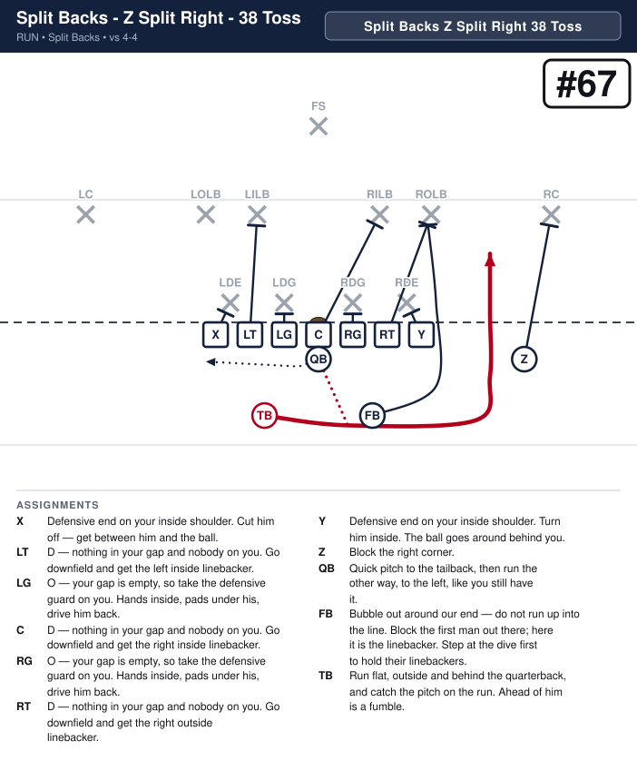
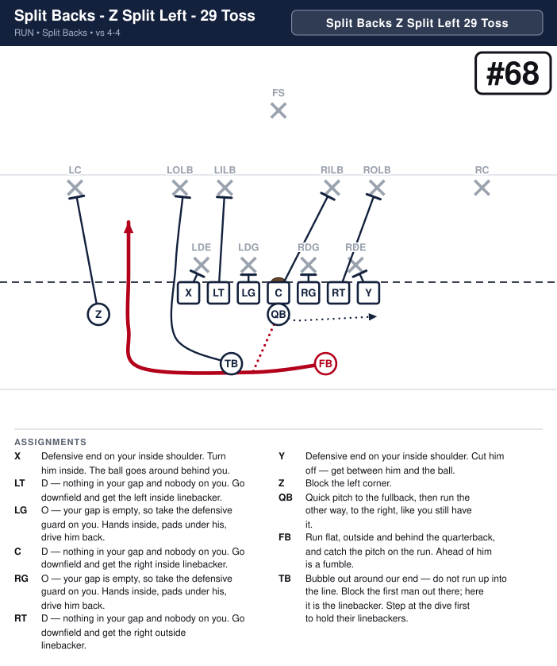

# Split Backs

_Generated by `generator/render.py`. Edit the JSON in `plays/`, not this file._

Both ends are tight on the line. The two backs sit four yards deep and just over two yards either side of the quarterback, one behind each guard–tackle gap — same depth, same split, so the alignment gives nothing away. The slot is just outside the tight end, one step off the line, which keeps seven on the line. The 3-back is always the tailback (odd holes) and the 2-back is always the fullback (even holes). The call names the slot's side every time — Slot Right or Slot Left.

**Alignment** (yards; x positive to the right, y positive downfield, LOS = 0)

| Position | x | y |
|---|---|---|
| X | -4.2 | -0.5 |
| LT | -2.8 | -0.5 |
| LG | -1.4 | -0.5 |
| C | 0.0 | -0.5 |
| RG | 1.4 | -0.5 |
| RT | 2.8 | -0.5 |
| Y | 4.2 | -0.5 |
| Z | 5.6 | -1.5 |
| QB | 0.0 | -1.5 |
| TB | -2.2 | -3.8 |
| FB | 2.2 | -3.8 |

## Plays

| Play | Call | Scheme | Type | Ball |
|---|---|---|---|---|
| [Split Backs - Z Tight Right - 38 Toss](#split-backs---z-tight-right---38-toss) | `Split Backs Z Tight Right 38 Toss` | Toss | run | TB |
| [Split Backs - Z Tight Left - 29 Toss](#split-backs---z-tight-left---29-toss) | `Split Backs Z Tight Left 29 Toss` | Toss | run | FB |
| [Split Backs - Z Split Right - 38 Toss](#split-backs---z-split-right---38-toss) | `Split Backs Z Split Right 38 Toss` | Toss | run | TB |
| [Split Backs - Z Split Left - 29 Toss](#split-backs---z-split-left---29-toss) | `Split Backs Z Split Left 29 Toss` | Toss | run | FB |
| [Split Backs - Z Tight Right - 18 Sweep](#split-backs---z-tight-right---18-sweep) | `Split Backs Z Tight Right 18 Sweep` | Sweep | run | QB |
| [Split Backs - Z Tight Left - 19 Sweep](#split-backs---z-tight-left---19-sweep) | `Split Backs Z Tight Left 19 Sweep` | Sweep | run | QB |
| [Split Backs - Z Tight Left - 19 Fake Sweep](#split-backs---z-tight-left---19-fake-sweep) | `Split Backs Z Tight Left 19 Fake Sweep` | Sweep | run | QB |
| [Split Backs - Z Tight Right - 18 Fake Sweep](#split-backs---z-tight-right---18-fake-sweep) | `Split Backs Z Tight Right 18 Fake Sweep` | Sweep | run | QB |
| [Split Backs - Z Tight Right - Z Sweep Left](#split-backs---z-tight-right---z-sweep-left) | `Split Backs Z Tight Right Z Sweep Left` | Sweep | run | Z |
| [Split Backs - Z Tight Left - Z Sweep Right](#split-backs---z-tight-left---z-sweep-right) | `Split Backs Z Tight Left Z Sweep Right` | Sweep | run | Z |
| [Split Backs - Z Tight Right - X Sweep Right](#split-backs---z-tight-right---x-sweep-right) | `Split Backs Z Tight Right X Sweep Right` | Sweep | run | X |
| [Split Backs - Z Tight Left - Y Sweep Left](#split-backs---z-tight-left---y-sweep-left) | `Split Backs Z Tight Left Y Sweep Left` | Sweep | run | Y |
| [Split Backs - Z Tight Right - Y Slant Pass Right](#split-backs---z-tight-right---y-slant-pass-right) | `Split Backs Z Tight Right Y Slant Pass Right` | Protect | pass | Y |
| [Split Backs - Z Tight Left - X Slant Pass Left](#split-backs---z-tight-left---x-slant-pass-left) | `Split Backs Z Tight Left X Slant Pass Left` | Protect | pass | X |
| [Split Backs - Z Tight Right - 36 Handoff](#split-backs---z-tight-right---36-handoff) | `Split Backs Z Tight Right 36 Handoff` | Power | run | TB |
| [Split Backs - Z Tight Left - 27 Handoff](#split-backs---z-tight-left---27-handoff) | `Split Backs Z Tight Left 27 Handoff` | Power | run | FB |
| [Split Backs - Z Tight Right - 38 Toss Pass](#split-backs---z-tight-right---38-toss-pass) | `Split Backs Z Tight Right 38 Toss Pass` | Protect | pass | Y |
| [Split Backs - Z Tight Left - 29 Toss Pass](#split-backs---z-tight-left---29-toss-pass) | `Split Backs Z Tight Left 29 Toss Pass` | Protect | pass | X |

---

## Split Backs - Z Tight Right - 38 Toss

**Call it:** `Split Backs Z Tight Right 38 Toss`

**Scheme:** Toss

| Position | Assignment |
|---|---|
| **X** | Defensive end on your inside shoulder. Cut him off — get between him and the ball. |
| **LT** | D — nothing in your gap and nobody on you. Go downfield and get the left inside linebacker. |
| **LG** | O — your gap is empty, so take the defensive guard on you. Hands inside, pads under his, drive him back. |
| **C** | D — nothing in your gap and nobody on you. Go downfield and get the right inside linebacker. |
| **RG** | O — your gap is empty, so take the defensive guard on you. Hands inside, pads under his, drive him back. |
| **RT** | D — nothing in your gap and nobody on you. Go downfield and get the right outside linebacker. |
| **Y** | Defensive end on your inside shoulder. Turn him inside. The ball goes around behind you. |
| **Z** | Block the right corner. |
| **QB** | Quick pitch to the tailback, then run the other way, to the left, like you still have it. |
| **FB** | Bubble out around our end — do not run up into the line. Block the first man out there; here it is the linebacker. Step at the dive first to hold their linebackers. |
| **TB** **(ball)** | Run flat, outside and behind the quarterback, and catch the pitch on the run. Ahead of him is a fumble. |

**Coaching points**

- The pitch goes early. A quarterback who waits to be tackled first will pitch it on the ground.
- This is not a read at this age — tell him before the snap that he is pitching it.
- Everything depends on the edge being blocked, and out here the split man does it — which is what frees both backs to fake and lead. Drill him on beating that man to the spot without holding.

---

## Split Backs - Z Tight Left - 29 Toss

**Call it:** `Split Backs Z Tight Left 29 Toss`

**Scheme:** Toss

| Position | Assignment |
|---|---|
| **X** | Defensive end on your inside shoulder. Turn him inside. The ball goes around behind you. |
| **LT** | D — nothing in your gap and nobody on you. Go downfield and get the left inside linebacker. |
| **LG** | O — your gap is empty, so take the defensive guard on you. Hands inside, pads under his, drive him back. |
| **C** | D — nothing in your gap and nobody on you. Go downfield and get the right inside linebacker. |
| **RG** | O — your gap is empty, so take the defensive guard on you. Hands inside, pads under his, drive him back. |
| **RT** | D — nothing in your gap and nobody on you. Go downfield and get the right outside linebacker. |
| **Y** | Defensive end on your inside shoulder. Cut him off — get between him and the ball. |
| **Z** | Block the left corner. |
| **QB** | Quick pitch to the fullback, then run the other way, to the right, like you still have it. |
| **FB** **(ball)** | Run flat, outside and behind the quarterback, and catch the pitch on the run. Ahead of him is a fumble. |
| **TB** | Bubble out around our end — do not run up into the line. Block the first man out there; here it is the linebacker. Step at the dive first to hold their linebackers. |

**Coaching points**

- The pitch goes early. A quarterback who waits to be tackled first will pitch it on the ground.
- This is not a read at this age — tell him before the snap that he is pitching it.
- Everything depends on the edge being blocked, and out here the split man does it — which is what frees both backs to fake and lead. Drill him on beating that man to the spot without holding.

---

## Split Backs - Z Split Right - 38 Toss

**Call it:** `Split Backs Z Split Right 38 Toss`

**Scheme:** Toss

| Position | Assignment |
|---|---|
| **X** | Defensive end on your inside shoulder. Cut him off — get between him and the ball. |
| **LT** | D — nothing in your gap and nobody on you. Go downfield and get the left inside linebacker. |
| **LG** | O — your gap is empty, so take the defensive guard on you. Hands inside, pads under his, drive him back. |
| **C** | D — nothing in your gap and nobody on you. Go downfield and get the right inside linebacker. |
| **RG** | O — your gap is empty, so take the defensive guard on you. Hands inside, pads under his, drive him back. |
| **RT** | D — nothing in your gap and nobody on you. Go downfield and get the right outside linebacker. |
| **Y** | Defensive end on your inside shoulder. Turn him inside. The ball goes around behind you. |
| **Z** | Block the right corner. |
| **QB** | Quick pitch to the tailback, then run the other way, to the left, like you still have it. |
| **FB** | Bubble out around our end — do not run up into the line. Block the first man out there; here it is the linebacker. Step at the dive first to hold their linebackers. |
| **TB** **(ball)** | Run flat, outside and behind the quarterback, and catch the pitch on the run. Ahead of him is a fumble. |

**Coaching points**

- The same 38 Toss as #17, and the only thing that changes is where the Z starts. He is split out wide instead of tight off the Y, which puts him beside the corner he has to block instead of four yards inside him.
- Call it when the corner is beating our Z to the edge. From out there the Z can get in his way on the snap; from tight he has to run at him while the ball is already going.
- Watch what the corner does with it, because that is the call. If he walks out with the Z, their best edge defender has taken himself out of the play and the toss should go every time. If he stays inside, the Z has a free run at him.
- It tells them something. We have never split him before, so the first time he goes out wide the defense knows the ball is going outside. That is the price, and it is why this is a change-up and not the base toss.
- Against a front with no corner on that side, the Z has a long way back inside to the safety and this is the worse of the two tosses. Look at how they line up before you call it.

---

## Split Backs - Z Split Left - 29 Toss

**Call it:** `Split Backs Z Split Left 29 Toss`

**Scheme:** Toss

| Position | Assignment |
|---|---|
| **X** | Defensive end on your inside shoulder. Turn him inside. The ball goes around behind you. |
| **LT** | D — nothing in your gap and nobody on you. Go downfield and get the left inside linebacker. |
| **LG** | O — your gap is empty, so take the defensive guard on you. Hands inside, pads under his, drive him back. |
| **C** | D — nothing in your gap and nobody on you. Go downfield and get the right inside linebacker. |
| **RG** | O — your gap is empty, so take the defensive guard on you. Hands inside, pads under his, drive him back. |
| **RT** | D — nothing in your gap and nobody on you. Go downfield and get the right outside linebacker. |
| **Y** | Defensive end on your inside shoulder. Cut him off — get between him and the ball. |
| **Z** | Block the left corner. |
| **QB** | Quick pitch to the fullback, then run the other way, to the right, like you still have it. |
| **FB** **(ball)** | Run flat, outside and behind the quarterback, and catch the pitch on the run. Ahead of him is a fumble. |
| **TB** | Bubble out around our end — do not run up into the line. Block the first man out there; here it is the linebacker. Step at the dive first to hold their linebackers. |

**Coaching points**

- The same 29 Toss as #18, and the only thing that changes is where the Z starts. He is split out wide instead of tight off the X, which puts him beside the corner he has to block instead of four yards inside him.
- Call it when the corner is beating our Z to the edge. From out there the Z can get in his way on the snap; from tight he has to run at him while the ball is already going.
- Watch what the corner does with it, because that is the call. If he walks out with the Z, their best edge defender has taken himself out of the play and the toss should go every time. If he stays inside, the Z has a free run at him.
- It tells them something. We have never split him before, so the first time he goes out wide the defense knows the ball is going outside. That is the price, and it is why this is a change-up and not the base toss.
- Against a front with no corner on that side, the Z has a long way back inside to the safety and this is the worse of the two tosses. Look at how they line up before you call it.

---

## Split Backs - Z Tight Right - 18 Sweep

**Call it:** `Split Backs Z Tight Right 18 Sweep`

**Scheme:** Sweep

| Position | Assignment |
|---|---|
| **X** | Defensive end on your inside shoulder. Cut him off — get between him and the ball. |
| **LT** | D — nothing in your gap and nobody on you. Go downfield and get the left inside linebacker. |
| **LG** | O — your gap is empty, so take the defensive guard on you. Hands inside, pads under his, drive him back. |
| **C** | D — nothing in your gap and nobody on you. Go downfield and get the right inside linebacker. |
| **RG** | O — your gap is empty, so take the defensive guard on you. Hands inside, pads under his, drive him back. |
| **RT** | D — nothing in your gap and nobody on you. Go downfield and get the right outside linebacker. |
| **Y** | Defensive end on your inside shoulder. Turn him inside. The ball goes around behind you. |
| **Z** | Run at the corner and screen him off. Stay in his way. |
| **QB** **(ball)** | Take the snap and sweep right, flat and fast, behind the fullback. Turn up outside his block. |
| **FB** | Bubble around the Y, then block the right defensive end. |
| **TB** | Double team the left defensive guard with the LG. |

**Coaching points**

- The quarterback keeps it every time — tell him before the snap, there is no read.
- The fullback bubbles around the Y and takes the end. The tailback does not go with him — he stays home and doubles the man on our backside guard. He was never going to beat the ball to that edge, and the double is where he is worth something.
- The quarterback stays behind the fullback until the block is made, then turns it up. Running past his blocker is how the sweep loses yards.

---

## Split Backs - Z Tight Left - 19 Sweep

**Call it:** `Split Backs Z Tight Left 19 Sweep`

**Scheme:** Sweep

| Position | Assignment |
|---|---|
| **X** | Defensive end on your inside shoulder. Turn him inside. The ball goes around behind you. |
| **LT** | D — nothing in your gap and nobody on you. Go downfield and get the left inside linebacker. |
| **LG** | O — your gap is empty, so take the defensive guard on you. Hands inside, pads under his, drive him back. |
| **C** | D — nothing in your gap and nobody on you. Go downfield and get the right inside linebacker. |
| **RG** | O — your gap is empty, so take the defensive guard on you. Hands inside, pads under his, drive him back. |
| **RT** | D — nothing in your gap and nobody on you. Go downfield and get the right outside linebacker. |
| **Y** | Defensive end on your inside shoulder. Cut him off — get between him and the ball. |
| **Z** | Run at the corner and screen him off. Stay in his way. |
| **QB** **(ball)** | Take the snap and sweep left, flat and fast, behind the tailback. Turn up outside his block. |
| **FB** | Double team the right defensive guard with the RG. |
| **TB** | Bubble around the X, then block the left defensive end. |

**Coaching points**

- The quarterback keeps it every time — tell him before the snap, there is no read.
- The tailback bubbles around the X and takes the end. The fullback does not go with him — he stays home and doubles the man on our backside guard. He was never going to beat the ball to that edge, and the double is where he is worth something.
- The quarterback stays behind the tailback until the block is made, then turns it up. Running past his blocker is how the sweep loses yards.

---

## Split Backs - Z Tight Left - 19 Fake Sweep

**Call it:** `Split Backs Z Tight Left 19 Fake Sweep`

**Scheme:** Sweep

| Position | Assignment |
|---|---|
| **X** | Defensive end on your inside shoulder. Turn him inside. The ball goes around behind you. |
| **LT** | D — nothing in your gap and nobody on you. Go downfield and get the left inside linebacker. |
| **LG** | O — your gap is empty, so take the defensive guard on you. Hands inside, pads under his, drive him back. |
| **C** | D — nothing in your gap and nobody on you. Go downfield and get the right inside linebacker. |
| **RG** | O — your gap is empty, so take the defensive guard on you. Hands inside, pads under his, drive him back. |
| **RT** | D — nothing in your gap and nobody on you. Go downfield and get the right outside linebacker. |
| **Y** | Defensive end on your inside shoulder. Cut him off — get between him and the ball. |
| **Z** | Run at the corner and screen him off. Stay in his way. |
| **QB** **(ball)** | Fake the handoff to the fullback, then roll back left and sweep it, flat and fast, behind the tailback. Turn up outside his block. |
| **FB** | Take the fake from the quarterback and run hard to the right like you have the ball. Sell it all the way — you are the reason the defense goes the wrong way. |
| **TB** | Bubble out around the left tight end, then block the left outside linebacker. |

**Coaching points**

- The fake has to look real: the quarterback puts the ball at the fullback's belly and pulls it back out.
- The fullback's fake is the play. If he jogs, nobody follows him and the defense is waiting on the left.
- After the fake the quarterback gets back to the left fast, stays behind the tailback until the block is made, then turns it up.

---

## Split Backs - Z Tight Right - 18 Fake Sweep

**Call it:** `Split Backs Z Tight Right 18 Fake Sweep`

**Scheme:** Sweep

| Position | Assignment |
|---|---|
| **X** | Defensive end on your inside shoulder. Cut him off — get between him and the ball. |
| **LT** | D — nothing in your gap and nobody on you. Go downfield and get the left inside linebacker. |
| **LG** | O — your gap is empty, so take the defensive guard on you. Hands inside, pads under his, drive him back. |
| **C** | D — nothing in your gap and nobody on you. Go downfield and get the right inside linebacker. |
| **RG** | O — your gap is empty, so take the defensive guard on you. Hands inside, pads under his, drive him back. |
| **RT** | D — nothing in your gap and nobody on you. Go downfield and get the right outside linebacker. |
| **Y** | Defensive end on your inside shoulder. Turn him inside. The ball goes around behind you. |
| **Z** | Run at the corner and screen him off. Stay in his way. |
| **QB** **(ball)** | Fake the handoff to the tailback, then roll back right and sweep it, flat and fast, behind the fullback. Turn up outside his block. |
| **FB** | Bubble out around the right tight end, then block the right outside linebacker. |
| **TB** | Take the fake from the quarterback and run hard to the left like you have the ball. Sell it all the way — you are the reason the defense goes the wrong way. |

**Coaching points**

- The fake has to look real: the quarterback puts the ball at the tailback's belly and pulls it back out.
- The tailback's fake is the play. If he jogs, nobody follows him and the defense is waiting on the right.
- After the fake the quarterback gets back to the right fast, stays behind the fullback until the block is made, then turns it up.

---

## Split Backs - Z Tight Right - Z Sweep Left

**Call it:** `Split Backs Z Tight Right Z Sweep Left`

**Scheme:** Sweep

| Position | Assignment |
|---|---|
| **X** | Defensive end on your inside shoulder. Turn him inside. The ball goes around behind you. |
| **LT** | D — nothing in your gap and nobody on you. Go downfield and get the left inside linebacker. |
| **LG** | O — your gap is empty, so take the defensive guard on you. Hands inside, pads under his, drive him back. |
| **C** | D — nothing in your gap and nobody on you. Go downfield and get the right inside linebacker. |
| **RG** | O — your gap is empty, so take the defensive guard on you. Hands inside, pads under his, drive him back. |
| **RT** | D — nothing in your gap and nobody on you. Go downfield and get the right outside linebacker. |
| **Y** | Defensive end on your inside shoulder. Cut him off — get between him and the ball. |
| **Z** **(ball)** | At the snap run flat across the backfield, take the handoff at full speed and get to the left edge. Turn up in the alley behind the tailback. |
| **QB** | Hand the ball to the slot as he runs past you, then fake the handoff to the fullback going right. |
| **FB** | Bubble around the X, then block the left outside linebacker. |
| **TB** | Bubble around the X, then block the left corner. |

**Coaching points**

- The slot runs flat and fast across the backfield. The handoff is at full speed, so the quarterback just puts it in his belly.
- After the handoff the quarterback carries out his fake to the fullback going right. It is what holds the backside.
- The tailback bubbles out ahead of the slot and takes the corner. The slot stays behind him and turns up in the alley.
- Both backs bubble around the X. The fullback takes the outside linebacker and the tailback carries on out to the corner — the Z has the ball, so nobody else is out there to screen him.

---

## Split Backs - Z Tight Left - Z Sweep Right

**Call it:** `Split Backs Z Tight Left Z Sweep Right`

**Scheme:** Sweep

| Position | Assignment |
|---|---|
| **X** | Defensive end on your inside shoulder. Cut him off — get between him and the ball. |
| **LT** | D — nothing in your gap and nobody on you. Go downfield and get the left inside linebacker. |
| **LG** | O — your gap is empty, so take the defensive guard on you. Hands inside, pads under his, drive him back. |
| **C** | D — nothing in your gap and nobody on you. Go downfield and get the right inside linebacker. |
| **RG** | O — your gap is empty, so take the defensive guard on you. Hands inside, pads under his, drive him back. |
| **RT** | D — nothing in your gap and nobody on you. Go downfield and get the right outside linebacker. |
| **Y** | Defensive end on your inside shoulder. Turn him inside. The ball goes around behind you. |
| **Z** **(ball)** | At the snap run flat across the backfield, take the handoff at full speed and get to the right edge. Turn up in the alley behind the fullback. |
| **QB** | Hand the ball to the slot as he runs past you, then fake the handoff to the tailback going left. |
| **FB** | Bubble around the Y, then block the right corner. |
| **TB** | Bubble around the Y, then block the right outside linebacker. |

**Coaching points**

- The slot runs flat and fast across the backfield. The handoff is at full speed, so the quarterback just puts it in his belly.
- After the handoff the quarterback carries out his fake to the tailback going left. It is what holds the backside.
- The fullback bubbles out ahead of the slot and takes the corner. The slot stays behind him and turns up in the alley.
- Both backs bubble around the Y. The tailback takes the outside linebacker and the fullback carries on out to the corner — the Z has the ball, so nobody else is out there to screen him.

---

## Split Backs - Z Tight Right - X Sweep Right

**Call it:** `Split Backs Z Tight Right X Sweep Right`

**Scheme:** Sweep

| Position | Assignment |
|---|---|
| **X** **(ball)** | Stay down in your stance — no motion. At the snap run flat behind the quarterback, take the handoff at full speed and get to the right edge. Turn up outside the backs. |
| **LT** | D — nothing in your gap and nobody on you. Go downfield and get the left inside linebacker. |
| **LG** | O — your gap is empty, so take the defensive guard on you. Hands inside, pads under his, drive him back. |
| **C** | D — nothing in your gap and nobody on you. Go downfield and get the right inside linebacker. |
| **RG** | O — your gap is empty, so take the defensive guard on you. Hands inside, pads under his, drive him back. |
| **RT** | D — nothing in your gap and nobody on you. Go downfield and get the right outside linebacker. |
| **Y** | Defensive end on your inside shoulder. Turn him inside. The ball goes around behind you. |
| **Z** | Run at the corner and screen him off. Stay in his way. |
| **QB** | Open right and hand the ball to the left tight end as he comes across behind you, then fake a run to the left. |
| **FB** | Bubble around the Y, then block the right outside linebacker. |
| **TB** | Bubble around the Y, then double team the right corner with the Z. |

**Coaching points**

- No motion before the snap. The end stays down in his stance, so the play is legal and nothing tips it off.
- The handoff is the whole play: the quarterback opens right and puts the ball in the end's belly at full speed, then carries out his fake.
- Both backs bubble around the Y — out and around, never up into the line. The fullback takes the outside linebacker and the tailback carries on outside to help the Z on the corner. They used to double the same linebacker between them, which left the corner alone against one blocker on the play that has to get outside him.

---

## Split Backs - Z Tight Left - Y Sweep Left

**Call it:** `Split Backs Z Tight Left Y Sweep Left`

**Scheme:** Sweep

| Position | Assignment |
|---|---|
| **X** | Defensive end on your inside shoulder. Turn him inside. The ball goes around behind you. |
| **LT** | D — nothing in your gap and nobody on you. Go downfield and get the left inside linebacker. |
| **LG** | O — your gap is empty, so take the defensive guard on you. Hands inside, pads under his, drive him back. |
| **C** | D — nothing in your gap and nobody on you. Go downfield and get the right inside linebacker. |
| **RG** | O — your gap is empty, so take the defensive guard on you. Hands inside, pads under his, drive him back. |
| **RT** | D — nothing in your gap and nobody on you. Go downfield and get the right outside linebacker. |
| **Y** **(ball)** | Stay down in your stance — no motion. At the snap run flat behind the quarterback, take the handoff at full speed and get to the left edge. Turn up outside the backs. |
| **Z** | Run at the corner and screen him off. Stay in his way. |
| **QB** | Open left and hand the ball to the right tight end as he comes across behind you, then fake a run to the right. |
| **FB** | Bubble around the X, then double team the left corner with the Z. |
| **TB** | Bubble around the X, then block the left outside linebacker. |

**Coaching points**

- No motion before the snap. The end stays down in his stance, so the play is legal and nothing tips it off.
- The handoff is the whole play: the quarterback opens left and puts the ball in the end's belly at full speed, then carries out his fake.
- Both backs bubble around the X — out and around, never up into the line. The tailback takes the outside linebacker and the fullback carries on outside to help the Z on the corner. They used to double the same linebacker between them, which left the corner alone against one blocker on the play that has to get outside him.

---

## Split Backs - Z Tight Right - Y Slant Pass Right

**Call it:** `Split Backs Z Tight Right Y Slant Pass Right`

**Scheme:** Protect

| Position | Assignment |
|---|---|
| **X** | Pass block: step back, hands up, and stay between your man and the quarterback. |
| **LT** | Pass block: step back, hands up, and stay between your man and the quarterback. |
| **LG** | Pass block: step back, hands up, and stay between your man and the quarterback. |
| **C** | Pass block: step back, hands up, and stay between your man and the quarterback. |
| **RG** | Pass block: step back, hands up, and stay between your man and the quarterback. |
| **RT** | Pass block: step back, hands up, and stay between your man and the quarterback. |
| **Y** **(ball)** | Take one step up, then slant out flat toward the right sideline, almost along the line of scrimmage. Look for the ball right away. |
| **Z** | Block the right corner. |
| **QB** | Take the snap, take one step and throw to the right tight end as he slants out. If he is covered, tuck it and run. |
| **FB** | Step up and out, hands up. Pick up anybody coming at the quarterback. |
| **TB** | Step up and out, hands up. Pick up anybody coming at the quarterback. |

**Coaching points**

- Everybody but the tight end and the Z pass blocks: step back, hands up, stay between your man and the quarterback.
- The slant stays flat — one step up and out, almost on the line of scrimmage. Any deeper and he runs into the linebackers.
- The quarterback throws it as soon as the tight end clears the end. If he is covered, tuck it and run — no second look.

---

## Split Backs - Z Tight Left - X Slant Pass Left

**Call it:** `Split Backs Z Tight Left X Slant Pass Left`

**Scheme:** Protect

| Position | Assignment |
|---|---|
| **X** **(ball)** | Take one step up, then slant out flat toward the left sideline, almost along the line of scrimmage. Look for the ball right away. |
| **LT** | Pass block: step back, hands up, and stay between your man and the quarterback. |
| **LG** | Pass block: step back, hands up, and stay between your man and the quarterback. |
| **C** | Pass block: step back, hands up, and stay between your man and the quarterback. |
| **RG** | Pass block: step back, hands up, and stay between your man and the quarterback. |
| **RT** | Pass block: step back, hands up, and stay between your man and the quarterback. |
| **Y** | Pass block: step back, hands up, and stay between your man and the quarterback. |
| **Z** | Block the left corner. |
| **QB** | Take the snap, take one step and throw to the left tight end as he slants out. If he is covered, tuck it and run. |
| **FB** | Step up and out, hands up. Pick up anybody coming at the quarterback. |
| **TB** | Step up and out, hands up. Pick up anybody coming at the quarterback. |

**Coaching points**

- Everybody but the tight end and the Z pass blocks: step back, hands up, stay between your man and the quarterback.
- The slant stays flat — one step up and out, almost on the line of scrimmage. Any deeper and he runs into the linebackers.
- The quarterback throws it as soon as the tight end clears the end. If he is covered, tuck it and run — no second look.

---

## Split Backs - Z Tight Right - 36 Handoff

**Call it:** `Split Backs Z Tight Right 36 Handoff`

**Scheme:** Power

| Position | Assignment |
|---|---|
| **X** | Defensive end on your inside shoulder. Cut him off — get between him and the ball. |
| **LT** | D — nothing in your gap and nobody on you. Go downfield and get the left inside linebacker. |
| **LG** | O — your gap is empty, so take the defensive guard on you. Hands inside, pads under his, drive him back. |
| **C** | D — nothing in your gap and nobody on you. Go downfield and get the right inside linebacker. |
| **RG** | O — your gap is empty, so take the defensive guard on you. Hands inside, pads under his, drive him back. |
| **RT** | D — nothing in your gap and nobody on you. Go downfield and get the right outside linebacker. |
| **Y** | Block down on the defensive end, inside shoulder. Head across him — nobody crosses your face. |
| **Z** | Run at the corner and screen him off. Stay in his way. |
| **QB** | Open right and hand deep to the tailback as he crosses, then fake the boot. It holds the backside end. |
| **FB** | Bubble around the Y, then block the right outside linebacker. |
| **TB** **(ball)** | Run flat across behind the quarterback — do not climb at the line. Take the handoff, then turn up at our tackle's outside hip. Never bounce it outside. |

**Coaching points**

- The same Power as the Regular I, run from two backs instead of a stack. The tight end takes the end man and the fullback bubbles around the Y.
- The fullback goes around the Y, not up into the line, and his man is the outside linebacker. A lead back who runs straight into the pile has blocked nobody.
- The runner is the back on the far side. He has further to travel, so he has to start on the snap -- no false step, no waiting to see the hole.
- The yards are inside the tight end's block. If the back bounces it wide looking for grass, the play is dead.

---

## Split Backs - Z Tight Left - 27 Handoff

**Call it:** `Split Backs Z Tight Left 27 Handoff`

**Scheme:** Power

| Position | Assignment |
|---|---|
| **X** | Block down on the defensive end, inside shoulder. Head across him — nobody crosses your face. |
| **LT** | D — nothing in your gap and nobody on you. Go downfield and get the left inside linebacker. |
| **LG** | O — your gap is empty, so take the defensive guard on you. Hands inside, pads under his, drive him back. |
| **C** | D — nothing in your gap and nobody on you. Go downfield and get the right inside linebacker. |
| **RG** | O — your gap is empty, so take the defensive guard on you. Hands inside, pads under his, drive him back. |
| **RT** | D — nothing in your gap and nobody on you. Go downfield and get the right outside linebacker. |
| **Y** | Defensive end on your inside shoulder. Cut him off — get between him and the ball. |
| **Z** | Run at the corner and screen him off. Stay in his way. |
| **QB** | Open left and hand deep to the fullback as he crosses, then fake the boot. It holds the backside end. |
| **FB** **(ball)** | Run flat across behind the quarterback — do not climb at the line. Take the handoff, then turn up at our tackle's outside hip. Never bounce it outside. |
| **TB** | Bubble around the X, then block the left outside linebacker. |

**Coaching points**

- The same Power as the Regular I, run from two backs instead of a stack. The tight end takes the end man and the tailback bubbles around the X.
- The tailback goes around the X, not up into the line, and his man is the outside linebacker. A lead back who runs straight into the pile has blocked nobody.
- The runner is the back on the far side. He has further to travel, so he has to start on the snap -- no false step, no waiting to see the hole.
- The yards are inside the tight end's block. If the back bounces it wide looking for grass, the play is dead.

---

## Split Backs - Z Tight Right - 38 Toss Pass

**Call it:** `Split Backs Z Tight Right 38 Toss Pass`

**Scheme:** Protect

| Position | Assignment |
|---|---|
| **X** | Pass block: step back, hands up, and stay between your man and the quarterback. |
| **LT** | Pass block: step back, hands up, and stay between your man and the quarterback. |
| **LG** | Pass block: step back, hands up, and stay between your man and the quarterback. |
| **C** | Pass block: step back, hands up, and stay between your man and the quarterback. |
| **RG** | Pass block: step back, hands up, and stay between your man and the quarterback. |
| **RT** | Pass block: step back, hands up, and stay between your man and the quarterback. |
| **Y** **(ball)** | Block the end the way you do on the toss, then slant out flat toward the sideline, almost on the line. Look for the ball right away. |
| **Z** | Run at the corner and screen him off. Stay in his way. |
| **QB** | Pitch it exactly the way you pitch the toss, then run left like you still have it. Do not turn and watch the throw. |
| **FB** | Step at the dive, then bubble outside our end and take the first man out there. He is the one who gets to the thrower. |
| **TB** | Catch the pitch and run the toss. At our tight end, pull up behind the line and throw it flat to the tight end in front of you. |

**Coaching points**

- Everything is the toss until he pulls up. Same pitch, same path, same speed -- a back who slows down to throw has told them.
- He throws from behind the line. Crossing it is a penalty, so drill the pull-up, not the arm.
- The tight end blocks the end first, then slants out flat, almost on the line. It is a three-yard throw and it should never be more than that.
- The split man keeps blocking out there exactly as he does on the toss. That block is what the defence is reading while the end gets loose.

---

## Split Backs - Z Tight Left - 29 Toss Pass

**Call it:** `Split Backs Z Tight Left 29 Toss Pass`

**Scheme:** Protect

| Position | Assignment |
|---|---|
| **X** **(ball)** | Block the end the way you do on the toss, then slant out flat toward the sideline, almost on the line. Look for the ball right away. |
| **LT** | Pass block: step back, hands up, and stay between your man and the quarterback. |
| **LG** | Pass block: step back, hands up, and stay between your man and the quarterback. |
| **C** | Pass block: step back, hands up, and stay between your man and the quarterback. |
| **RG** | Pass block: step back, hands up, and stay between your man and the quarterback. |
| **RT** | Pass block: step back, hands up, and stay between your man and the quarterback. |
| **Y** | Pass block: step back, hands up, and stay between your man and the quarterback. |
| **Z** | Run at the corner and screen him off. Stay in his way. |
| **QB** | Pitch it exactly the way you pitch the toss, then run right like you still have it. Do not turn and watch the throw. |
| **FB** | Catch the pitch and run the toss. At our tight end, pull up behind the line and throw it flat to the tight end in front of you. |
| **TB** | Step at the dive, then bubble outside our end and take the first man out there. He is the one who gets to the thrower. |

**Coaching points**

- Everything is the toss until he pulls up. Same pitch, same path, same speed -- a back who slows down to throw has told them.
- He throws from behind the line. Crossing it is a penalty, so drill the pull-up, not the arm.
- The tight end blocks the end first, then slants out flat, almost on the line. It is a three-yard throw and it should never be more than that.
- The split man keeps blocking out there exactly as he does on the toss. That block is what the defence is reading while the end gets loose.

