# Split Backs

_Generated by `generator/render.py`. Edit the JSON in `plays/`, not this file._

Both ends are tight on the line. The two backs sit four yards deep and just over two yards either side of the quarterback, one behind each guard–tackle gap — same depth, same split, so the alignment gives nothing away. The slot is just outside the tight end, one step off the line, which keeps seven on the line. The 3-back is always the left halfback (odd holes) and the 2-back is always the right halfback (even holes). The call names the slot's side every time — Slot Right or Slot Left.

**Alignment** (yards; x positive to the right, y positive downfield, LOS = 0)

| Position | x | y |
|---|---|---|
| X | -4.2 | -0.5 |
| LT | -2.8 | -0.5 |
| LG | -1.4 | -0.5 |
| C | 0.0 | -0.5 |
| RG | 1.4 | -0.5 |
| RT | 2.8 | -0.5 |
| Y | 4.2 | -0.5 |
| Z | 5.6 | -1.5 |
| QB | 0.0 | -1.5 |
| LH | -2.2 | -3.8 |
| RH | 2.2 | -3.8 |

## Plays

| Play | Call | Scheme | Type | Ball |
|---|---|---|---|---|
| [Split Backs - Z Right - 38 Toss](#split-backs---z-right---38-toss) | `Split Backs Z Right 38 Toss` | Toss | run | LH |
| [Split Backs - Z Left - 29 Toss](#split-backs---z-left---29-toss) | `Split Backs Z Left 29 Toss` | Toss | run | RH |
| [Split Backs - Z Right - 18 Sweep](#split-backs---z-right---18-sweep) | `Split Backs Z Right 18 Sweep` | Sweep | run | QB |
| [Split Backs - Z Left - 19 Sweep](#split-backs---z-left---19-sweep) | `Split Backs Z Left 19 Sweep` | Sweep | run | QB |
| [Split Backs - Z Left - 19 Fake Sweep](#split-backs---z-left---19-fake-sweep) | `Split Backs Z Left 19 Fake Sweep` | Sweep | run | QB |
| [Split Backs - Z Right - 18 Fake Sweep](#split-backs---z-right---18-fake-sweep) | `Split Backs Z Right 18 Fake Sweep` | Sweep | run | QB |
| [Split Backs - Z Right - Z Sweep Left](#split-backs---z-right---z-sweep-left) | `Split Backs Z Right Z Sweep Left` | Sweep | run | Z |
| [Split Backs - Z Left - Z Sweep Right](#split-backs---z-left---z-sweep-right) | `Split Backs Z Left Z Sweep Right` | Sweep | run | Z |
| [Split Backs - Z Right - X Sweep Right](#split-backs---z-right---x-sweep-right) | `Split Backs Z Right X Sweep Right` | Sweep | run | X |
| [Split Backs - Z Left - Y Sweep Left](#split-backs---z-left---y-sweep-left) | `Split Backs Z Left Y Sweep Left` | Sweep | run | Y |
| [Split Backs - Z Right - Y Slant Pass Right](#split-backs---z-right---y-slant-pass-right) | `Split Backs Z Right Y Slant Pass Right` | Protect | pass | Y |
| [Split Backs - Z Left - X Slant Pass Left](#split-backs---z-left---x-slant-pass-left) | `Split Backs Z Left X Slant Pass Left` | Protect | pass | X |
| [Split Backs - Z Right - 36 Handoff](#split-backs---z-right---36-handoff) | `Split Backs Z Right 36 Handoff` | Power | run | LH |
| [Split Backs - Z Left - 27 Handoff](#split-backs---z-left---27-handoff) | `Split Backs Z Left 27 Handoff` | Power | run | RH |
| [Split Backs - Z Right - 38 Toss Pass](#split-backs---z-right---38-toss-pass) | `Split Backs Z Right 38 Toss Pass` | Protect | pass | Y |
| [Split Backs - Z Left - 29 Toss Pass](#split-backs---z-left---29-toss-pass) | `Split Backs Z Left 29 Toss Pass` | Protect | pass | X |

---

## Split Backs - Z Right - 38 Toss

**Call it:** `Split Backs Z Right 38 Toss`

**Scheme:** Toss

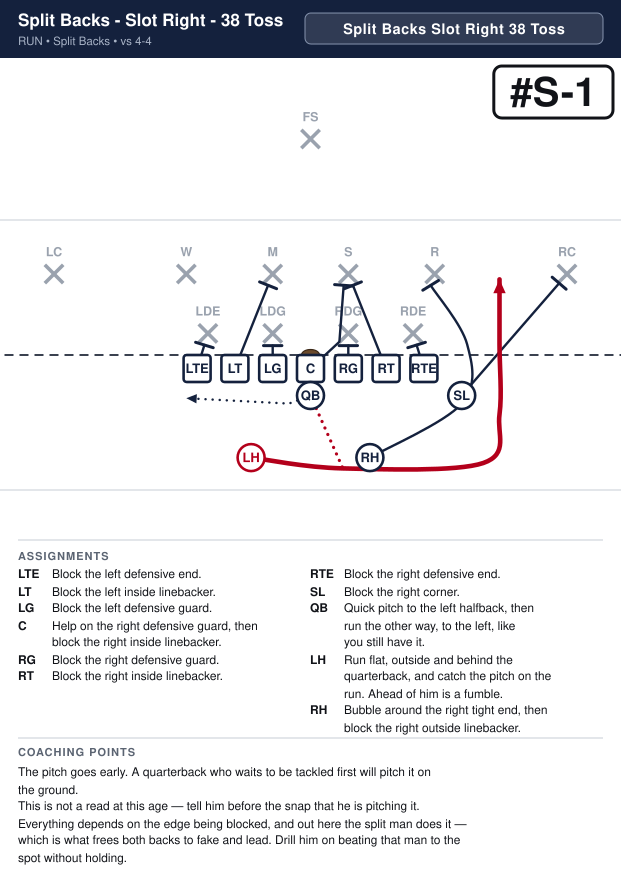

| Position | Assignment |
|---|---|
| **X** | Defensive end on your inside shoulder. Cut him off — get between him and the ball. |
| **LT** | D — nothing in your gap and nobody on you. Go downfield and get the left inside linebacker. |
| **LG** | O — your gap is empty, so take the defensive guard on you. Hands inside, pads under his, drive him back. |
| **C** | D — nothing in your gap and nobody on you. Go downfield and get the right inside linebacker. |
| **RG** | O — your gap is empty, so take the defensive guard on you. Hands inside, pads under his, drive him back. |
| **RT** | D — nothing in your gap and nobody on you. Go downfield and get the right outside linebacker. |
| **Y** | Defensive end on your inside shoulder. Turn him inside. The ball goes around behind you. |
| **Z** | Block the right corner. |
| **QB** | Quick pitch to the left halfback, then run the other way, to the left, like you still have it. |
| **LH** **(ball)** | Run flat, outside and behind the quarterback, and catch the pitch on the run. Ahead of him is a fumble. |
| **RH** | Bubble around the right tight end, then block the right outside linebacker. |

**Coaching points**

- The pitch goes early. A quarterback who waits to be tackled first will pitch it on the ground.
- This is not a read at this age — tell him before the snap that he is pitching it.
- Everything depends on the edge being blocked, and out here the split man does it — which is what frees both backs to fake and lead. Drill him on beating that man to the spot without holding.

---

## Split Backs - Z Left - 29 Toss

**Call it:** `Split Backs Z Left 29 Toss`

**Scheme:** Toss

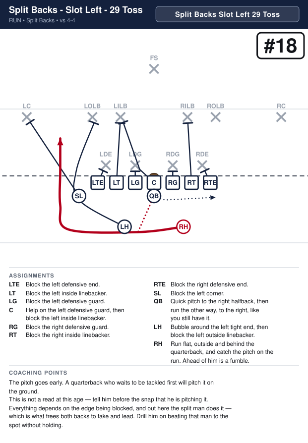

| Position | Assignment |
|---|---|
| **X** | Defensive end on your inside shoulder. Turn him inside. The ball goes around behind you. |
| **LT** | D — nothing in your gap and nobody on you. Go downfield and get the left inside linebacker. |
| **LG** | O — your gap is empty, so take the defensive guard on you. Hands inside, pads under his, drive him back. |
| **C** | D — nothing in your gap and nobody on you. Go downfield and get the right inside linebacker. |
| **RG** | O — your gap is empty, so take the defensive guard on you. Hands inside, pads under his, drive him back. |
| **RT** | D — nothing in your gap and nobody on you. Go downfield and get the right outside linebacker. |
| **Y** | Defensive end on your inside shoulder. Cut him off — get between him and the ball. |
| **Z** | Block the left corner. |
| **QB** | Quick pitch to the right halfback, then run the other way, to the right, like you still have it. |
| **LH** | Bubble around the left tight end, then block the left outside linebacker. |
| **RH** **(ball)** | Run flat, outside and behind the quarterback, and catch the pitch on the run. Ahead of him is a fumble. |

**Coaching points**

- The pitch goes early. A quarterback who waits to be tackled first will pitch it on the ground.
- This is not a read at this age — tell him before the snap that he is pitching it.
- Everything depends on the edge being blocked, and out here the split man does it — which is what frees both backs to fake and lead. Drill him on beating that man to the spot without holding.

---

## Split Backs - Z Right - 18 Sweep

**Call it:** `Split Backs Z Right 18 Sweep`

**Scheme:** Sweep

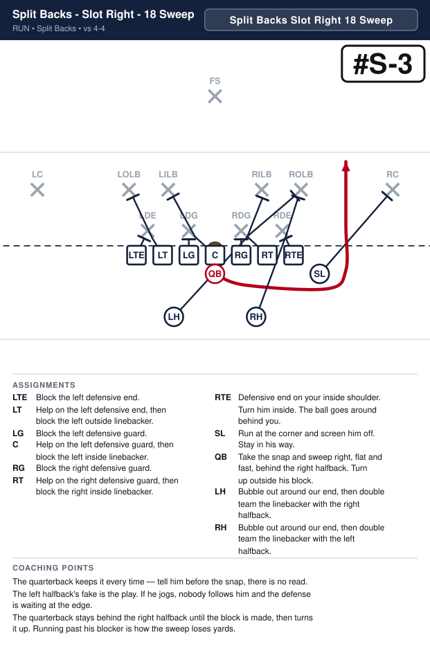

| Position | Assignment |
|---|---|
| **X** | Defensive end on your inside shoulder. Cut him off — get between him and the ball. |
| **LT** | D — nothing in your gap and nobody on you. Go downfield and get the left inside linebacker. |
| **LG** | O — your gap is empty, so take the defensive guard on you. Hands inside, pads under his, drive him back. |
| **C** | D — nothing in your gap and nobody on you. Go downfield and get the right inside linebacker. |
| **RG** | O — your gap is empty, so take the defensive guard on you. Hands inside, pads under his, drive him back. |
| **RT** | D — nothing in your gap and nobody on you. Go downfield and get the right outside linebacker. |
| **Y** | Defensive end on your inside shoulder. Turn him inside. The ball goes around behind you. |
| **Z** | Run at the corner and screen him off. Stay in his way. |
| **QB** **(ball)** | Take the snap and sweep right, flat and fast, behind the right halfback. Turn up outside his block. |
| **LH** | Bubble out around our end, then double team the linebacker with the right halfback. |
| **RH** | Bubble out around our end, then double team the linebacker with the left halfback. |

**Coaching points**

- The quarterback keeps it every time — tell him before the snap, there is no read.
- The left halfback's fake is the play. If he jogs, nobody follows him and the defense is waiting at the edge.
- The quarterback stays behind the right halfback until the block is made, then turns it up. Running past his blocker is how the sweep loses yards.

---

## Split Backs - Z Left - 19 Sweep

**Call it:** `Split Backs Z Left 19 Sweep`

**Scheme:** Sweep

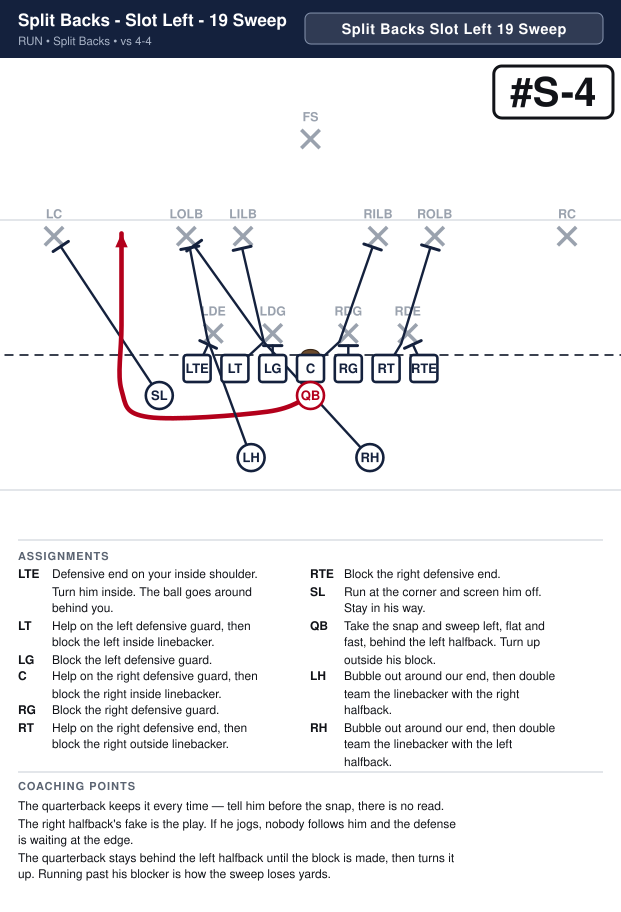

| Position | Assignment |
|---|---|
| **X** | Defensive end on your inside shoulder. Turn him inside. The ball goes around behind you. |
| **LT** | D — nothing in your gap and nobody on you. Go downfield and get the left inside linebacker. |
| **LG** | O — your gap is empty, so take the defensive guard on you. Hands inside, pads under his, drive him back. |
| **C** | D — nothing in your gap and nobody on you. Go downfield and get the right inside linebacker. |
| **RG** | O — your gap is empty, so take the defensive guard on you. Hands inside, pads under his, drive him back. |
| **RT** | D — nothing in your gap and nobody on you. Go downfield and get the right outside linebacker. |
| **Y** | Defensive end on your inside shoulder. Cut him off — get between him and the ball. |
| **Z** | Run at the corner and screen him off. Stay in his way. |
| **QB** **(ball)** | Take the snap and sweep left, flat and fast, behind the left halfback. Turn up outside his block. |
| **LH** | Bubble out around our end, then double team the linebacker with the right halfback. |
| **RH** | Bubble out around our end, then double team the linebacker with the left halfback. |

**Coaching points**

- The quarterback keeps it every time — tell him before the snap, there is no read.
- The right halfback's fake is the play. If he jogs, nobody follows him and the defense is waiting at the edge.
- The quarterback stays behind the left halfback until the block is made, then turns it up. Running past his blocker is how the sweep loses yards.

---

## Split Backs - Z Left - 19 Fake Sweep

**Call it:** `Split Backs Z Left 19 Fake Sweep`

**Scheme:** Sweep

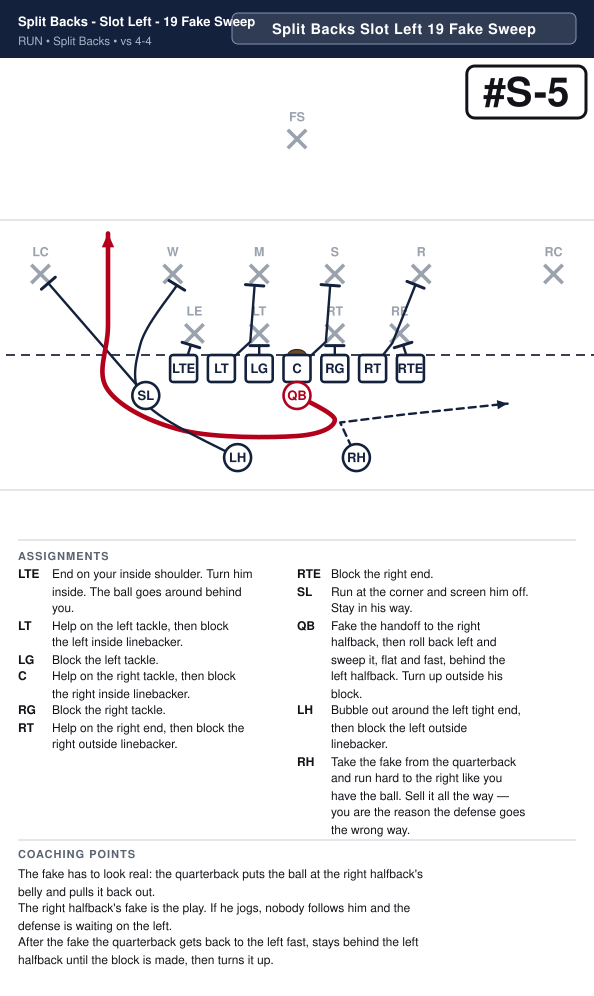

| Position | Assignment |
|---|---|
| **X** | Defensive end on your inside shoulder. Turn him inside. The ball goes around behind you. |
| **LT** | D — nothing in your gap and nobody on you. Go downfield and get the left inside linebacker. |
| **LG** | O — your gap is empty, so take the defensive guard on you. Hands inside, pads under his, drive him back. |
| **C** | D — nothing in your gap and nobody on you. Go downfield and get the right inside linebacker. |
| **RG** | O — your gap is empty, so take the defensive guard on you. Hands inside, pads under his, drive him back. |
| **RT** | D — nothing in your gap and nobody on you. Go downfield and get the right outside linebacker. |
| **Y** | Defensive end on your inside shoulder. Cut him off — get between him and the ball. |
| **Z** | Run at the corner and screen him off. Stay in his way. |
| **QB** **(ball)** | Fake the handoff to the right halfback, then roll back left and sweep it, flat and fast, behind the left halfback. Turn up outside his block. |
| **LH** | Bubble out around the left tight end, then block the left outside linebacker. |
| **RH** | Take the fake from the quarterback and run hard to the right like you have the ball. Sell it all the way — you are the reason the defense goes the wrong way. |

**Coaching points**

- The fake has to look real: the quarterback puts the ball at the right halfback's belly and pulls it back out.
- The right halfback's fake is the play. If he jogs, nobody follows him and the defense is waiting on the left.
- After the fake the quarterback gets back to the left fast, stays behind the left halfback until the block is made, then turns it up.

---

## Split Backs - Z Right - 18 Fake Sweep

**Call it:** `Split Backs Z Right 18 Fake Sweep`

**Scheme:** Sweep

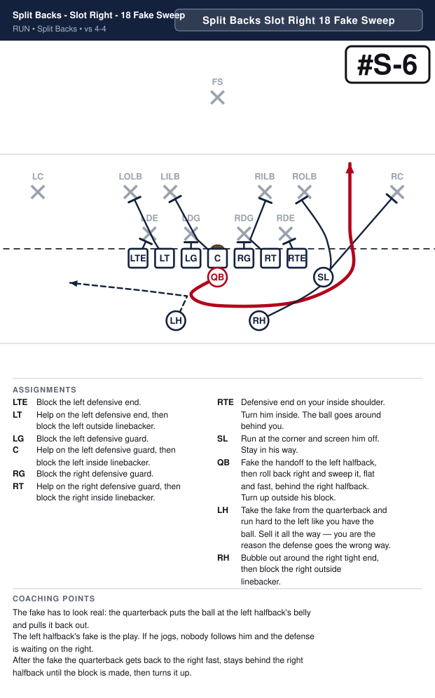

| Position | Assignment |
|---|---|
| **X** | Defensive end on your inside shoulder. Cut him off — get between him and the ball. |
| **LT** | D — nothing in your gap and nobody on you. Go downfield and get the left inside linebacker. |
| **LG** | O — your gap is empty, so take the defensive guard on you. Hands inside, pads under his, drive him back. |
| **C** | D — nothing in your gap and nobody on you. Go downfield and get the right inside linebacker. |
| **RG** | O — your gap is empty, so take the defensive guard on you. Hands inside, pads under his, drive him back. |
| **RT** | D — nothing in your gap and nobody on you. Go downfield and get the right outside linebacker. |
| **Y** | Defensive end on your inside shoulder. Turn him inside. The ball goes around behind you. |
| **Z** | Run at the corner and screen him off. Stay in his way. |
| **QB** **(ball)** | Fake the handoff to the left halfback, then roll back right and sweep it, flat and fast, behind the right halfback. Turn up outside his block. |
| **LH** | Take the fake from the quarterback and run hard to the left like you have the ball. Sell it all the way — you are the reason the defense goes the wrong way. |
| **RH** | Bubble out around the right tight end, then block the right outside linebacker. |

**Coaching points**

- The fake has to look real: the quarterback puts the ball at the left halfback's belly and pulls it back out.
- The left halfback's fake is the play. If he jogs, nobody follows him and the defense is waiting on the right.
- After the fake the quarterback gets back to the right fast, stays behind the right halfback until the block is made, then turns it up.

---

## Split Backs - Z Right - Z Sweep Left

**Call it:** `Split Backs Z Right Z Sweep Left`

**Scheme:** Sweep

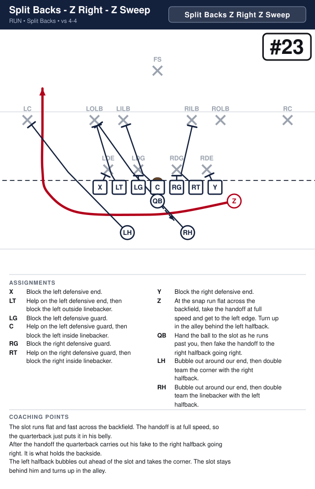

| Position | Assignment |
|---|---|
| **X** | Defensive end on your inside shoulder. Turn him inside. The ball goes around behind you. |
| **LT** | D — nothing in your gap and nobody on you. Go downfield and get the left inside linebacker. |
| **LG** | O — your gap is empty, so take the defensive guard on you. Hands inside, pads under his, drive him back. |
| **C** | D — nothing in your gap and nobody on you. Go downfield and get the right inside linebacker. |
| **RG** | O — your gap is empty, so take the defensive guard on you. Hands inside, pads under his, drive him back. |
| **RT** | D — nothing in your gap and nobody on you. Go downfield and get the right outside linebacker. |
| **Y** | Defensive end on your inside shoulder. Cut him off — get between him and the ball. |
| **Z** **(ball)** | At the snap run flat across the backfield, take the handoff at full speed and get to the left edge. Turn up in the alley behind the left halfback. |
| **QB** | Hand the ball to the slot as he runs past you, then fake the handoff to the right halfback going right. |
| **LH** | Bubble out around our end, then double team the linebacker with the right halfback. |
| **RH** | Bubble out around our end, then double team the corner with the left halfback. |

**Coaching points**

- The slot runs flat and fast across the backfield. The handoff is at full speed, so the quarterback just puts it in his belly.
- After the handoff the quarterback carries out his fake to the right halfback going right. It is what holds the backside.
- The left halfback bubbles out ahead of the slot and takes the corner. The slot stays behind him and turns up in the alley.

---

## Split Backs - Z Left - Z Sweep Right

**Call it:** `Split Backs Z Left Z Sweep Right`

**Scheme:** Sweep

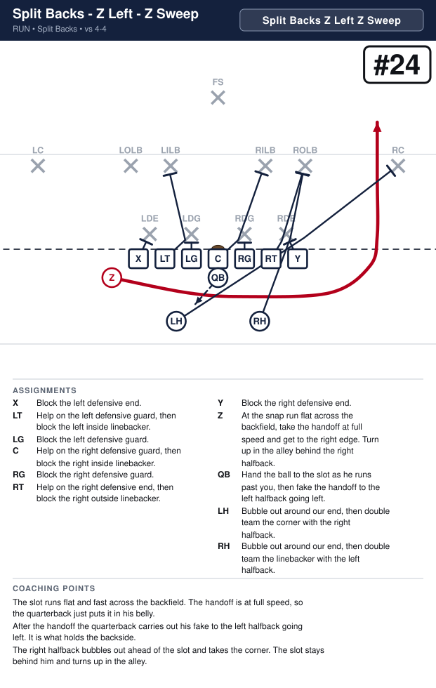

| Position | Assignment |
|---|---|
| **X** | Defensive end on your inside shoulder. Cut him off — get between him and the ball. |
| **LT** | D — nothing in your gap and nobody on you. Go downfield and get the left inside linebacker. |
| **LG** | O — your gap is empty, so take the defensive guard on you. Hands inside, pads under his, drive him back. |
| **C** | D — nothing in your gap and nobody on you. Go downfield and get the right inside linebacker. |
| **RG** | O — your gap is empty, so take the defensive guard on you. Hands inside, pads under his, drive him back. |
| **RT** | D — nothing in your gap and nobody on you. Go downfield and get the right outside linebacker. |
| **Y** | Defensive end on your inside shoulder. Turn him inside. The ball goes around behind you. |
| **Z** **(ball)** | At the snap run flat across the backfield, take the handoff at full speed and get to the right edge. Turn up in the alley behind the right halfback. |
| **QB** | Hand the ball to the slot as he runs past you, then fake the handoff to the left halfback going left. |
| **LH** | Bubble out around our end, then double team the corner with the right halfback. |
| **RH** | Bubble out around our end, then double team the linebacker with the left halfback. |

**Coaching points**

- The slot runs flat and fast across the backfield. The handoff is at full speed, so the quarterback just puts it in his belly.
- After the handoff the quarterback carries out his fake to the left halfback going left. It is what holds the backside.
- The right halfback bubbles out ahead of the slot and takes the corner. The slot stays behind him and turns up in the alley.

---

## Split Backs - Z Right - X Sweep Right

**Call it:** `Split Backs Z Right X Sweep Right`

**Scheme:** Sweep

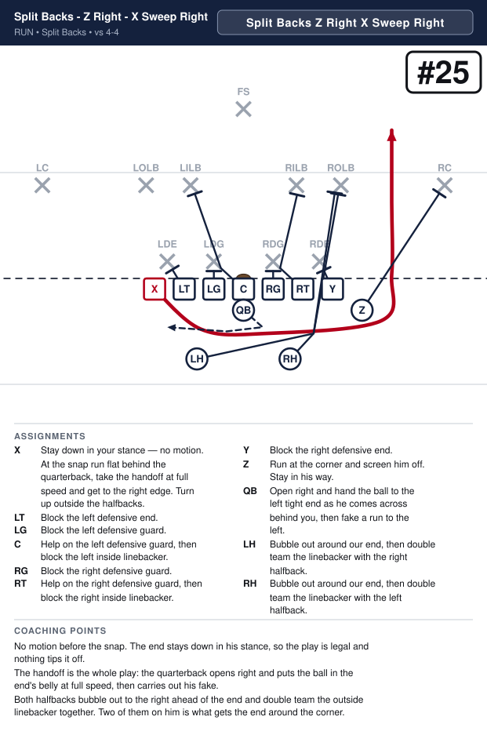

| Position | Assignment |
|---|---|
| **X** **(ball)** | Stay down in your stance — no motion. At the snap run flat behind the quarterback, take the handoff at full speed and get to the right edge. Turn up outside the halfbacks. |
| **LT** | D — nothing in your gap and nobody on you. Go downfield and get the left inside linebacker. |
| **LG** | O — your gap is empty, so take the defensive guard on you. Hands inside, pads under his, drive him back. |
| **C** | D — nothing in your gap and nobody on you. Go downfield and get the right inside linebacker. |
| **RG** | O — your gap is empty, so take the defensive guard on you. Hands inside, pads under his, drive him back. |
| **RT** | D — nothing in your gap and nobody on you. Go downfield and get the right outside linebacker. |
| **Y** | Defensive end on your inside shoulder. Turn him inside. The ball goes around behind you. |
| **Z** | Run at the corner and screen him off. Stay in his way. |
| **QB** | Open right and hand the ball to the left tight end as he comes across behind you, then fake a run to the left. |
| **LH** | Bubble out around our end, then double team the linebacker with the right halfback. |
| **RH** | Bubble out around our end, then double team the linebacker with the left halfback. |

**Coaching points**

- No motion before the snap. The end stays down in his stance, so the play is legal and nothing tips it off.
- The handoff is the whole play: the quarterback opens right and puts the ball in the end's belly at full speed, then carries out his fake.
- Both halfbacks bubble out to the right ahead of the end and double team the outside linebacker together. Two of them on him is what gets the end around the corner.

---

## Split Backs - Z Left - Y Sweep Left

**Call it:** `Split Backs Z Left Y Sweep Left`

**Scheme:** Sweep

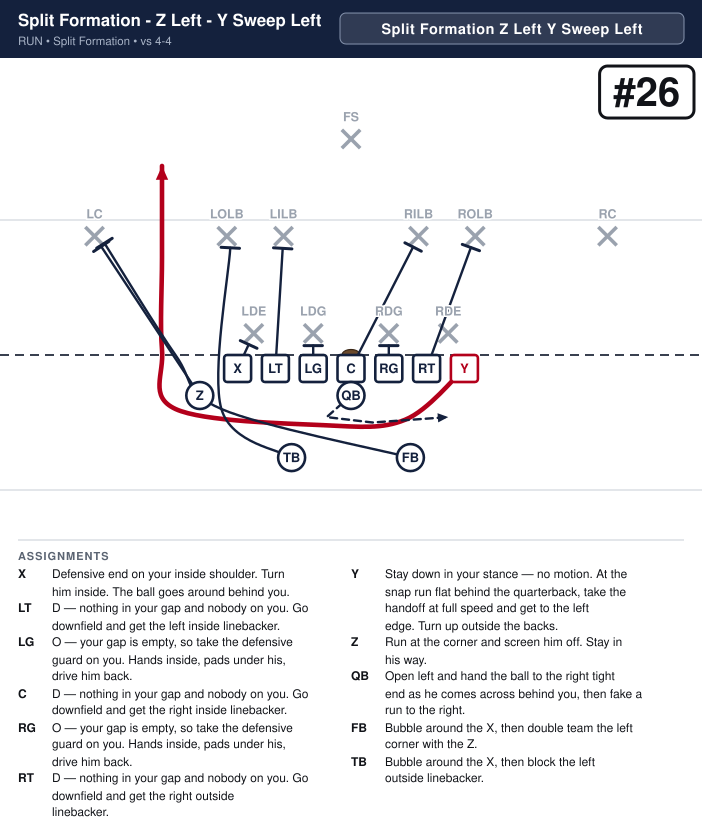

| Position | Assignment |
|---|---|
| **X** | Defensive end on your inside shoulder. Turn him inside. The ball goes around behind you. |
| **LT** | D — nothing in your gap and nobody on you. Go downfield and get the left inside linebacker. |
| **LG** | O — your gap is empty, so take the defensive guard on you. Hands inside, pads under his, drive him back. |
| **C** | D — nothing in your gap and nobody on you. Go downfield and get the right inside linebacker. |
| **RG** | O — your gap is empty, so take the defensive guard on you. Hands inside, pads under his, drive him back. |
| **RT** | D — nothing in your gap and nobody on you. Go downfield and get the right outside linebacker. |
| **Y** **(ball)** | Stay down in your stance — no motion. At the snap run flat behind the quarterback, take the handoff at full speed and get to the left edge. Turn up outside the halfbacks. |
| **Z** | Run at the corner and screen him off. Stay in his way. |
| **QB** | Open left and hand the ball to the right tight end as he comes across behind you, then fake a run to the right. |
| **LH** | Bubble out around our end, then double team the linebacker with the right halfback. |
| **RH** | Bubble out around our end, then double team the linebacker with the left halfback. |

**Coaching points**

- No motion before the snap. The end stays down in his stance, so the play is legal and nothing tips it off.
- The handoff is the whole play: the quarterback opens left and puts the ball in the end's belly at full speed, then carries out his fake.
- Both halfbacks bubble out to the left ahead of the end and double team the outside linebacker together. Two of them on him is what gets the end around the corner.

---

## Split Backs - Z Right - Y Slant Pass Right

**Call it:** `Split Backs Z Right Y Slant Pass Right`

**Scheme:** Protect

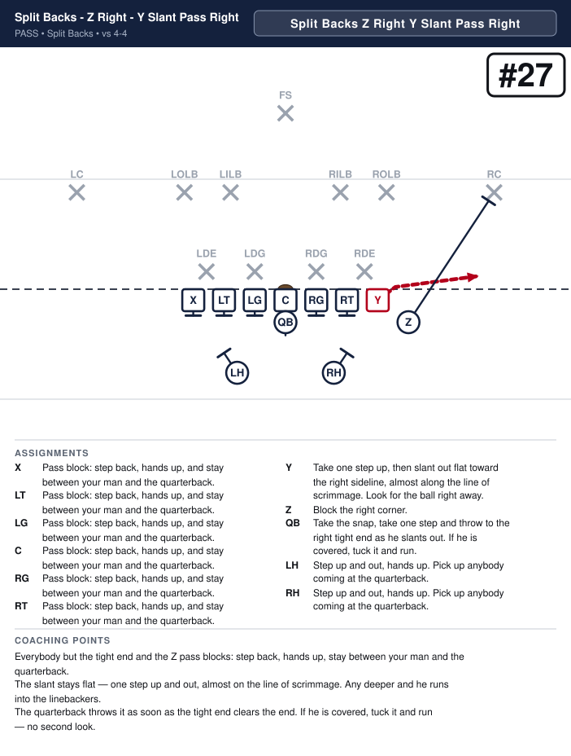

| Position | Assignment |
|---|---|
| **X** | Pass block: step back, hands up, and stay between your man and the quarterback. |
| **LT** | Pass block: step back, hands up, and stay between your man and the quarterback. |
| **LG** | Pass block: step back, hands up, and stay between your man and the quarterback. |
| **C** | Pass block: step back, hands up, and stay between your man and the quarterback. |
| **RG** | Pass block: step back, hands up, and stay between your man and the quarterback. |
| **RT** | Pass block: step back, hands up, and stay between your man and the quarterback. |
| **Y** **(ball)** | Take one step up, then slant out flat toward the right sideline, almost along the line of scrimmage. Look for the ball right away. |
| **Z** | Block the right corner. |
| **QB** | Take the snap, take one step and throw to the right tight end as he slants out. If he is covered, tuck it and run. |
| **LH** | Step up and out, hands up. Pick up anybody coming at the quarterback. |
| **RH** | Step up and out, hands up. Pick up anybody coming at the quarterback. |

**Coaching points**

- Everybody but the tight end and the Z pass blocks: step back, hands up, stay between your man and the quarterback.
- The slant stays flat — one step up and out, almost on the line of scrimmage. Any deeper and he runs into the linebackers.
- The quarterback throws it as soon as the tight end clears the end. If he is covered, tuck it and run — no second look.

---

## Split Backs - Z Left - X Slant Pass Left

**Call it:** `Split Backs Z Left X Slant Pass Left`

**Scheme:** Protect

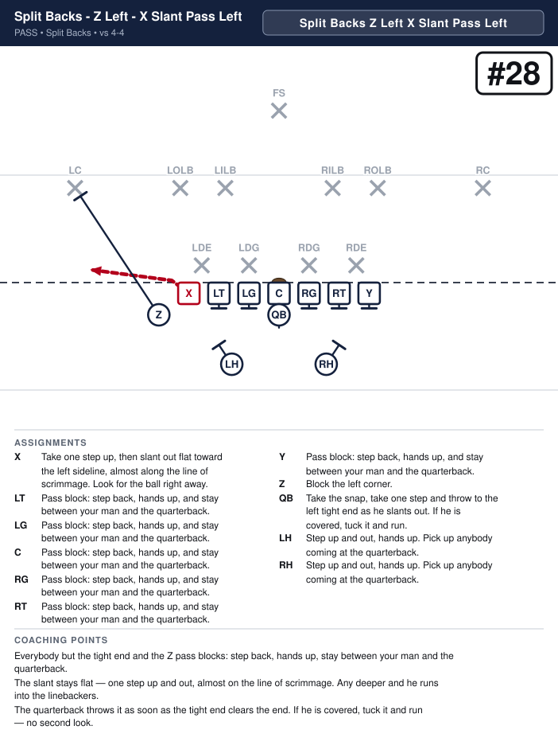

| Position | Assignment |
|---|---|
| **X** **(ball)** | Take one step up, then slant out flat toward the left sideline, almost along the line of scrimmage. Look for the ball right away. |
| **LT** | Pass block: step back, hands up, and stay between your man and the quarterback. |
| **LG** | Pass block: step back, hands up, and stay between your man and the quarterback. |
| **C** | Pass block: step back, hands up, and stay between your man and the quarterback. |
| **RG** | Pass block: step back, hands up, and stay between your man and the quarterback. |
| **RT** | Pass block: step back, hands up, and stay between your man and the quarterback. |
| **Y** | Pass block: step back, hands up, and stay between your man and the quarterback. |
| **Z** | Block the left corner. |
| **QB** | Take the snap, take one step and throw to the left tight end as he slants out. If he is covered, tuck it and run. |
| **LH** | Step up and out, hands up. Pick up anybody coming at the quarterback. |
| **RH** | Step up and out, hands up. Pick up anybody coming at the quarterback. |

**Coaching points**

- Everybody but the tight end and the Z pass blocks: step back, hands up, stay between your man and the quarterback.
- The slant stays flat — one step up and out, almost on the line of scrimmage. Any deeper and he runs into the linebackers.
- The quarterback throws it as soon as the tight end clears the end. If he is covered, tuck it and run — no second look.

---

## Split Backs - Z Right - 36 Handoff

**Call it:** `Split Backs Z Right 36 Handoff`

**Scheme:** Power

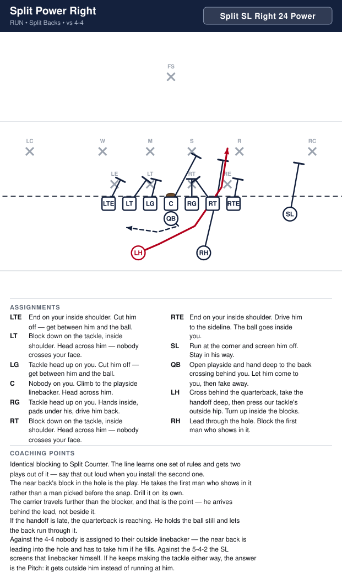

| Position | Assignment |
|---|---|
| **X** | Defensive end on your inside shoulder. Cut him off — get between him and the ball. |
| **LT** | D — nothing in your gap and nobody on you. Go downfield and get the left inside linebacker. |
| **LG** | O — your gap is empty, so take the defensive guard on you. Hands inside, pads under his, drive him back. |
| **C** | D — nothing in your gap and nobody on you. Go downfield and get the right inside linebacker. |
| **RG** | O — your gap is empty, so take the defensive guard on you. Hands inside, pads under his, drive him back. |
| **RT** | D — nothing in your gap and nobody on you. Go downfield and get the right outside linebacker. |
| **Y** | Block down on the defensive end, inside shoulder. Head across him — nobody crosses your face. |
| **Z** | Run at the corner and screen him off. Stay in his way. |
| **QB** | Open right and hand deep to the left halfback as he crosses, then fake the boot. It holds the backside end. |
| **LH** **(ball)** | Cross behind the quarterback, take the handoff and hit it downhill at our tackle's outside hip. Never bounce it outside. |
| **RH** | Lead through the hole. Block the first man who shows in it. |

**Coaching points**

- The same Power as the Regular I, run from two backs instead of a stack. The tight end takes the end man and the right halfback leads through the hole.
- The runner is the back on the far side. He has further to travel, so he has to start on the snap -- no false step, no waiting to see the hole.
- The yards are inside the tight end's block. If the halfback bounces it wide looking for grass, the play is dead.

---

## Split Backs - Z Left - 27 Handoff

**Call it:** `Split Backs Z Left 27 Handoff`

**Scheme:** Power

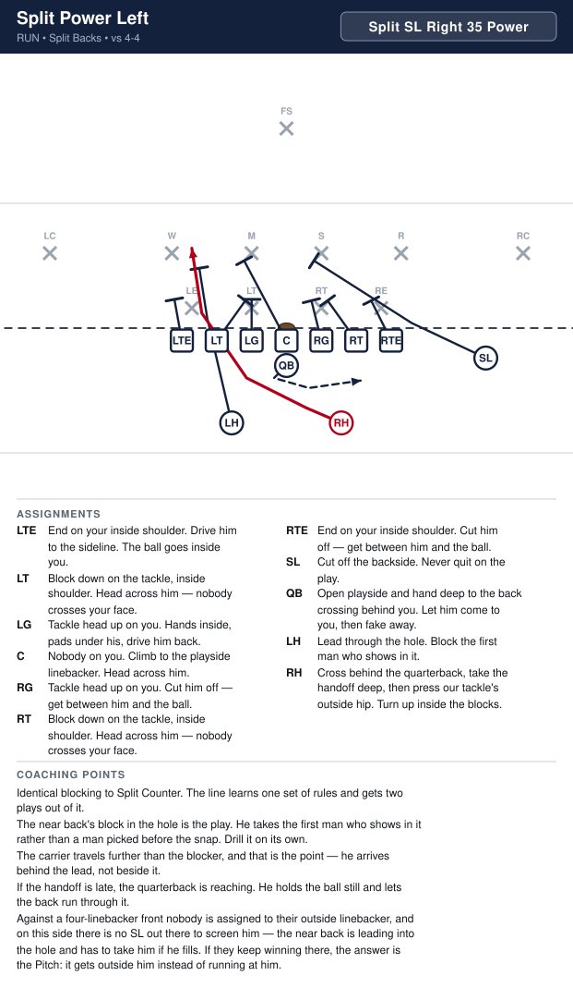

| Position | Assignment |
|---|---|
| **X** | Block down on the defensive end, inside shoulder. Head across him — nobody crosses your face. |
| **LT** | D — nothing in your gap and nobody on you. Go downfield and get the left inside linebacker. |
| **LG** | O — your gap is empty, so take the defensive guard on you. Hands inside, pads under his, drive him back. |
| **C** | D — nothing in your gap and nobody on you. Go downfield and get the right inside linebacker. |
| **RG** | O — your gap is empty, so take the defensive guard on you. Hands inside, pads under his, drive him back. |
| **RT** | D — nothing in your gap and nobody on you. Go downfield and get the right outside linebacker. |
| **Y** | Defensive end on your inside shoulder. Cut him off — get between him and the ball. |
| **Z** | Run at the corner and screen him off. Stay in his way. |
| **QB** | Open left and hand deep to the right halfback as he crosses, then fake the boot. It holds the backside end. |
| **LH** | Lead through the hole. Block the first man who shows in it. |
| **RH** **(ball)** | Cross behind the quarterback, take the handoff and hit it downhill at our tackle's outside hip. Never bounce it outside. |

**Coaching points**

- The same Power as the Regular I, run from two backs instead of a stack. The tight end takes the end man and the left halfback leads through the hole.
- The runner is the back on the far side. He has further to travel, so he has to start on the snap -- no false step, no waiting to see the hole.
- The yards are inside the tight end's block. If the halfback bounces it wide looking for grass, the play is dead.

---

## Split Backs - Z Right - 38 Toss Pass

**Call it:** `Split Backs Z Right 38 Toss Pass`

**Scheme:** Protect

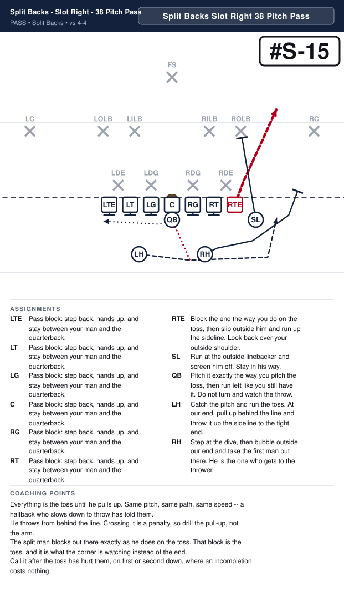

| Position | Assignment |
|---|---|
| **X** | Pass block: step back, hands up, and stay between your man and the quarterback. |
| **LT** | Pass block: step back, hands up, and stay between your man and the quarterback. |
| **LG** | Pass block: step back, hands up, and stay between your man and the quarterback. |
| **C** | Pass block: step back, hands up, and stay between your man and the quarterback. |
| **RG** | Pass block: step back, hands up, and stay between your man and the quarterback. |
| **RT** | Pass block: step back, hands up, and stay between your man and the quarterback. |
| **Y** **(ball)** | Block the end the way you do on the toss, then slant out flat toward the sideline, almost on the line. Look for the ball right away. |
| **Z** | Run at the corner and screen him off. Stay in his way. |
| **QB** | Pitch it exactly the way you pitch the toss, then run left like you still have it. Do not turn and watch the throw. |
| **LH** | Catch the pitch and run the toss. At our tight end, pull up behind the line and throw it flat to the tight end in front of you. |
| **RH** | Step at the dive, then bubble outside our end and take the first man out there. He is the one who gets to the thrower. |

**Coaching points**

- Everything is the toss until he pulls up. Same pitch, same path, same speed -- a halfback who slows down to throw has told them.
- He throws from behind the line. Crossing it is a penalty, so drill the pull-up, not the arm.
- The tight end blocks the end first, then slants out flat, almost on the line. It is a three-yard throw and it should never be more than that.
- The split man keeps blocking out there exactly as he does on the toss. That block is what the defence is reading while the end gets loose.

---

## Split Backs - Z Left - 29 Toss Pass

**Call it:** `Split Backs Z Left 29 Toss Pass`

**Scheme:** Protect

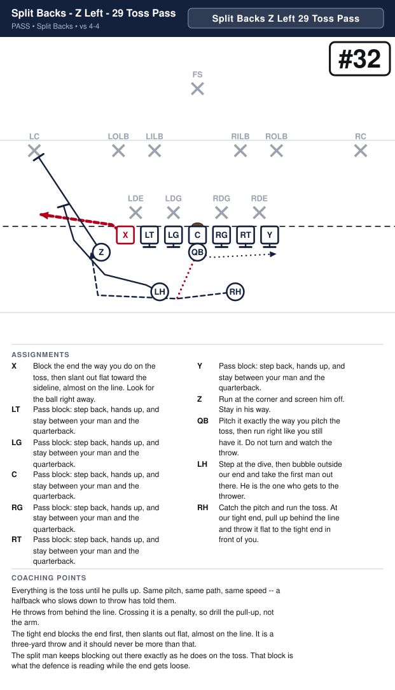

| Position | Assignment |
|---|---|
| **X** **(ball)** | Block the end the way you do on the toss, then slant out flat toward the sideline, almost on the line. Look for the ball right away. |
| **LT** | Pass block: step back, hands up, and stay between your man and the quarterback. |
| **LG** | Pass block: step back, hands up, and stay between your man and the quarterback. |
| **C** | Pass block: step back, hands up, and stay between your man and the quarterback. |
| **RG** | Pass block: step back, hands up, and stay between your man and the quarterback. |
| **RT** | Pass block: step back, hands up, and stay between your man and the quarterback. |
| **Y** | Pass block: step back, hands up, and stay between your man and the quarterback. |
| **Z** | Run at the corner and screen him off. Stay in his way. |
| **QB** | Pitch it exactly the way you pitch the toss, then run right like you still have it. Do not turn and watch the throw. |
| **LH** | Step at the dive, then bubble outside our end and take the first man out there. He is the one who gets to the thrower. |
| **RH** | Catch the pitch and run the toss. At our tight end, pull up behind the line and throw it flat to the tight end in front of you. |

**Coaching points**

- Everything is the toss until he pulls up. Same pitch, same path, same speed -- a halfback who slows down to throw has told them.
- He throws from behind the line. Crossing it is a penalty, so drill the pull-up, not the arm.
- The tight end blocks the end first, then slants out flat, almost on the line. It is a three-yard throw and it should never be more than that.
- The split man keeps blocking out there exactly as he does on the toss. That block is what the defence is reading while the end gets loose.

