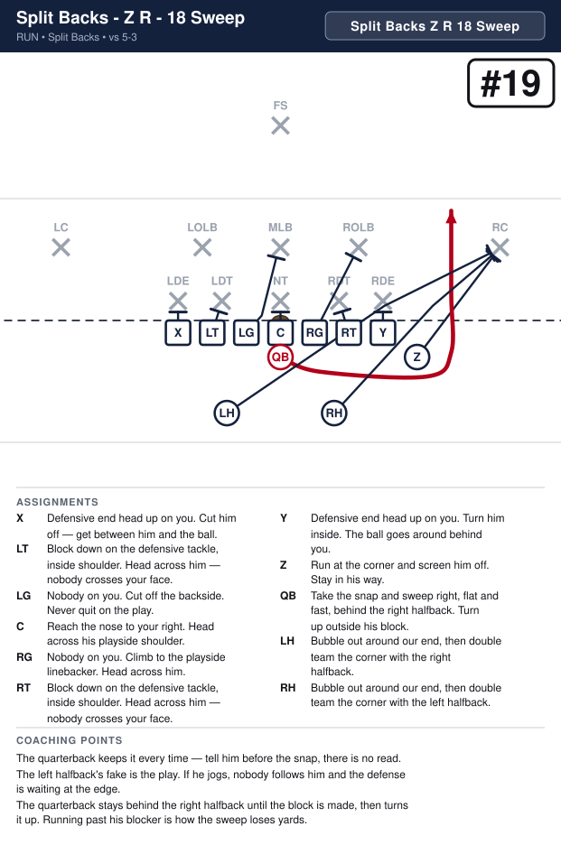
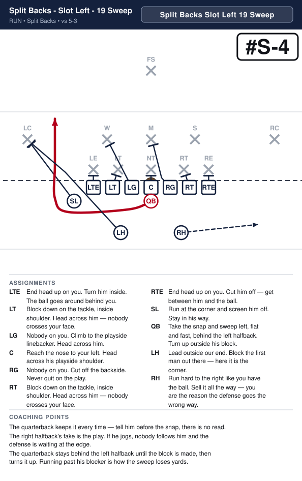

# Split Backs

_Generated by `generator/render.py`. Edit the JSON in `plays/`, not this file._

Both ends are tight on the line. The two backs sit four yards deep and just over two yards either side of the quarterback, one behind each guard–tackle gap — same depth, same split, so the alignment gives nothing away. The SL is off the line and split out wide, which keeps seven on the line. He is on the right on twelve of the fourteen; the Keep takes him to the side it runs to and the Reverse starts him on that same side, and the call names where he is every time — SL Right or SL Left.

**Alignment** (yards; x positive to the right, y positive downfield, LOS = 0)

| Position | x | y |
|---|---|---|
| LTE | -4.2 | -0.5 |
| LT | -2.8 | -0.5 |
| LG | -1.4 | -0.5 |
| C | 0.0 | -0.5 |
| RG | 1.4 | -0.5 |
| RT | 2.8 | -0.5 |
| RTE | 4.2 | -0.5 |
| SL | 8.0 | -1.2 |
| QB | 0.0 | -1.5 |
| LH | -2.2 | -3.8 |
| RH | 2.2 | -3.8 |

## Plays

| Play | Call | Type | Ball |
|---|---|---|---|
| [Split formation - Strong right - Quick pitch right](#split-formation---strong-right---quick-pitch-right) | `Split SL Right 28 Pitch` | run | LH |
| [Split formation - Strong left - Quick pitch left](#split-formation---strong-left---quick-pitch-left) | `Split SL Left 39 Pitch` | run | RH |
| [Split formation - Strong right - QB sweep right](#split-formation---strong-right---qb-sweep-right) | `Split SL Right 18 Sweep` | run | QB |
| [Split formation - Strong left - QB sweep left](#split-formation---strong-left---qb-sweep-left) | `Split SL Left 19 Sweep` | run | QB |

---

## Split formation - Strong right - Quick pitch right

**Call it:** `Split SL Right 28 Pitch`

Get outside in a hurry. The far back trails the quarterback, takes the pitch on the run and turns up inside the block out on the edge. The split man makes that block — their corner, or their outside linebacker against the 5-4-2, which has no corners — and that is what frees both backs to stay in the backfield where the fake lives.

| Position | Assignment |
|---|---|
| **LTE** | End head up on you. Cut him off — get between him and the ball. |
| **LT** | Block down on the tackle, inside shoulder. Head across him — nobody crosses your face. |
| **LG** | Nobody on you. Cut off the backside. Never quit on the play. |
| **C** | Reach the nose to your right. Head across his playside shoulder. |
| **RG** | Nobody on you. Climb to the playside linebacker. Head across him. |
| **RT** | Block down on the tackle, inside shoulder. Head across him — nobody crosses your face. |
| **RTE** | End head up on you. Turn him inside. The ball goes around behind you. |
| **SL** | Run at the corner and screen him off. Stay in his way. |
| **QB** | Quick pitch to the left halfback, then run the other way, to the left, like you still have it. |
| **LH** **(ball)** | Run flat, outside and behind the quarterback, and catch the pitch on the run. Ahead of him is a fumble. |
| **RH** | Lead outside our end. Block the first man out there — here it is the corner. Step at the dive first to hold their linebackers. |

**Coaching points**

- The pitch goes early. A quarterback who waits to be tackled first will pitch it on the ground.
- This is not a read at this age — tell him before the snap that he is pitching it.
- Everything depends on the edge being blocked, and out here the split man does it — which is what frees both backs to fake and lead. Drill him on beating that man to the spot without holding.

---

## Split formation - Strong left - Quick pitch left

**Call it:** `Split SL Left 39 Pitch`

Get outside in a hurry. The far back trails the quarterback, takes the pitch on the run and turns up inside the block out on the edge. The split man makes that block — their corner, or their outside linebacker against the 5-4-2, which has no corners — and that is what frees both backs to stay in the backfield where the fake lives.

| Position | Assignment |
|---|---|
| **LTE** | End head up on you. Turn him inside. The ball goes around behind you. |
| **LT** | Block down on the tackle, inside shoulder. Head across him — nobody crosses your face. |
| **LG** | Nobody on you. Climb to the playside linebacker. Head across him. |
| **C** | Reach the nose to your left. Head across his playside shoulder. |
| **RG** | Nobody on you. Cut off the backside. Never quit on the play. |
| **RT** | Block down on the tackle, inside shoulder. Head across him — nobody crosses your face. |
| **RTE** | End head up on you. Cut him off — get between him and the ball. |
| **SL** | Run at the corner and screen him off. Stay in his way. |
| **QB** | Quick pitch to the right halfback, then run the other way, to the right, like you still have it. |
| **LH** | Lead outside our end. Block the first man out there — here it is the corner. Step at the dive first to hold their linebackers. |
| **RH** **(ball)** | Run flat, outside and behind the quarterback, and catch the pitch on the run. Ahead of him is a fumble. |

**Coaching points**

- The pitch goes early. A quarterback who waits to be tackled first will pitch it on the ground.
- This is not a read at this age — tell him before the snap that he is pitching it.
- Everything depends on the edge being blocked, and out here the split man does it — which is what frees both backs to fake and lead. Drill him on beating that man to the spot without holding.

---

## Split formation - Strong right - QB sweep right

**Call it:** `Split SL Right 18 Sweep`

The quarterback keeps it and gets to the edge in a hurry behind the near back, while the far back runs hard the other way to take the defense with him.

| Position | Assignment |
|---|---|
| **LTE** | End head up on you. Cut him off — get between him and the ball. |
| **LT** | Block down on the tackle, inside shoulder. Head across him — nobody crosses your face. |
| **LG** | Nobody on you. Cut off the backside. Never quit on the play. |
| **C** | Reach the nose to your right. Head across his playside shoulder. |
| **RG** | Nobody on you. Climb to the playside linebacker. Head across him. |
| **RT** | Block down on the tackle, inside shoulder. Head across him — nobody crosses your face. |
| **RTE** | End head up on you. Turn him inside. The ball goes around behind you. |
| **SL** | Run at the corner and screen him off. Stay in his way. |
| **QB** **(ball)** | Take the snap and sweep right, flat and fast, behind the right halfback. Turn up outside his block. |
| **LH** | Run hard to the left like you have the ball. Sell it all the way — you are the reason the defense goes the wrong way. |
| **RH** | Lead outside our end. Block the first man out there — here it is the corner. |

**Coaching points**

- The quarterback keeps it every time — tell him before the snap, there is no read.
- The left halfback's fake is the play. If he jogs, nobody follows him and the defense is waiting at the edge.
- The quarterback stays behind the right halfback until the block is made, then turns it up. Running past his blocker is how the sweep loses yards.

---

## Split formation - Strong left - QB sweep left

**Call it:** `Split SL Left 19 Sweep`

The quarterback keeps it and gets to the edge in a hurry behind the near back, while the far back runs hard the other way to take the defense with him.

| Position | Assignment |
|---|---|
| **LTE** | End head up on you. Turn him inside. The ball goes around behind you. |
| **LT** | Block down on the tackle, inside shoulder. Head across him — nobody crosses your face. |
| **LG** | Nobody on you. Climb to the playside linebacker. Head across him. |
| **C** | Reach the nose to your left. Head across his playside shoulder. |
| **RG** | Nobody on you. Cut off the backside. Never quit on the play. |
| **RT** | Block down on the tackle, inside shoulder. Head across him — nobody crosses your face. |
| **RTE** | End head up on you. Cut him off — get between him and the ball. |
| **SL** | Run at the corner and screen him off. Stay in his way. |
| **QB** **(ball)** | Take the snap and sweep left, flat and fast, behind the left halfback. Turn up outside his block. |
| **LH** | Lead outside our end. Block the first man out there — here it is the corner. |
| **RH** | Run hard to the right like you have the ball. Sell it all the way — you are the reason the defense goes the wrong way. |

**Coaching points**

- The quarterback keeps it every time — tell him before the snap, there is no read.
- The right halfback's fake is the play. If he jogs, nobody follows him and the defense is waiting at the edge.
- The quarterback stays behind the left halfback until the block is made, then turns it up. Running past his blocker is how the sweep loses yards.

