# Tight — Double Wing

_Generated by `generator/render.py`. Edit the JSON in `plays/`, not this file._

Base formation. Line splits are foot-to-foot. Ends are on the line of scrimmage. Wings align one yard outside and one yard behind their end in a two-point stance. FB is four yards deep, directly behind the QB. QB is under center.

**Alignment** (yards; x positive to the right, y positive downfield, LOS = 0)

| Position | x | y |
|---|---|---|
| LE | -3.6 | -0.5 |
| LT | -2.4 | -0.5 |
| LG | -1.2 | -0.5 |
| C | 0.0 | -0.5 |
| RG | 1.2 | -0.5 |
| RT | 2.4 | -0.5 |
| RE | 3.6 | -0.5 |
| LW | -5.0 | -1.6 |
| RW | 5.0 | -1.6 |
| QB | 0.0 | -1.5 |
| FB | 0.0 | -4.0 |

**Formation coaching notes**

- Foot-to-foot splits are the whole point: the defense cannot fit gaps that do not exist.
- Both ends must be ON the line. Both wings must be OFF it. Check this every snap in practice or you will get illegal formation flags.
- The formation is symmetric, so every play has a left version and a right version with identical rules.

## Plays

| Play | Call | Type | Ball | Install |
|---|---|---|---|---|
| [Power Left](#power-left) | `Tight 5 Power` | run | LW | Week 1 |
| [Power Right](#power-right) | `Tight 6 Power` | run | RW | Week 1 |
| [Sneak](#sneak) | `Tight 0 Sneak` | run | QB | Week 1 |
| [Wedge](#wedge) | `Tight 0 Wedge` | run | FB | Week 1 |
| [Belly Left](#belly-left) | `Tight 3 Belly` | run | FB | Week 2 |
| [Belly Right](#belly-right) | `Tight 4 Belly` | run | FB | Week 2 |
| [Trap Left](#trap-left) | `Tight 1 Trap` | run | FB | Week 2 |
| [Trap Right](#trap-right) | `Tight 2 Trap` | run | FB | Week 2 |
| [Counter Left](#counter-left) | `Tight 5 Counter` | run | FB | Week 3 |
| [Counter Right](#counter-right) | `Tight 6 Counter` | run | FB | Week 3 |
| [Jet Left](#jet-left) | `Tight 7 Jet` | run | RW | Week 3 |
| [Jet Right](#jet-right) | `Tight 8 Jet` | run | LW | Week 3 |
| [Boot Left](#boot-left) | `Tight 7 Boot` | pass | QB | Week 4 |
| [Boot Right](#boot-right) | `Tight 8 Boot` | pass | QB | Week 4 |
| [Keep Left](#keep-left) | `Tight 7 Keep` | run | QB | Week 4 |
| [Keep Right](#keep-right) | `Tight 8 Keep` | run | QB | Week 4 |
| [Power Pass Left](#power-pass-left) | `Tight 5 Power Pass` | pass | LE | Week 4 |
| [Power Pass Right](#power-pass-right) | `Tight 6 Power Pass` | pass | RE | Week 4 |

---

## Power Left

**Call it:** `Tight 5 Power`

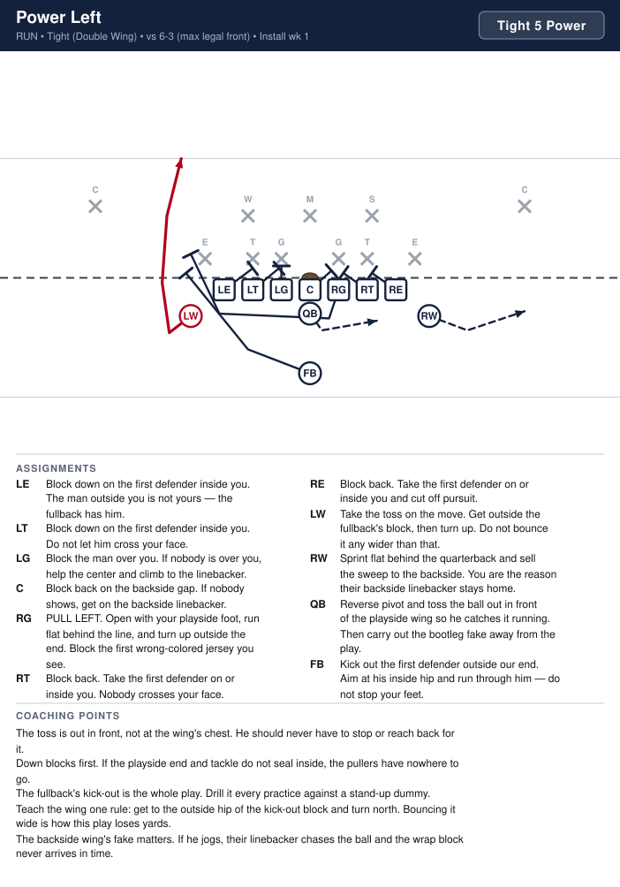

Our bread and butter. Everyone on the playside blocks down, the fullback kicks out the end man, the backside guard pulls and wraps up through the hole, and the playside wing takes the toss and runs off their tails. If we only ever ran this play and the wedge we would win games.

| Position | Assignment |
|---|---|
| **LE** | Block down on the first defender inside you. The man outside you is not yours — the fullback has him. |
| **LT** | Block down on the first defender inside you. Do not let him cross your face. |
| **LG** | Block the man over you. If nobody is over you, help the center and climb to the linebacker. |
| **C** | Block back on the backside gap. If nobody shows, get on the backside linebacker. |
| **RG** | PULL LEFT. Open with your playside foot, run flat behind the line, and turn up outside the end. Block the first wrong-colored jersey you see. |
| **RT** | Block back. Take the first defender on or inside you. Nobody crosses your face. |
| **RE** | Block back. Take the first defender on or inside you and cut off pursuit. |
| **LW** **(ball)** | Take the toss on the move. Get outside the fullback's block, then turn up. Do not bounce it any wider than that. |
| **RW** | Sprint flat behind the quarterback and sell the sweep to the backside. You are the reason their backside linebacker stays home. |
| **QB** | Reverse pivot and toss the ball out in front of the playside wing so he catches it running. Then carry out the bootleg fake away from the play. |
| **FB** | Kick out the first defender outside our end. Aim at his inside hip and run through him — do not stop your feet. |

**Coaching points**

- The toss is out in front, not at the wing's chest. He should never have to stop or reach back for it.
- Down blocks first. If the playside end and tackle do not seal inside, the pullers have nowhere to go.
- The fullback's kick-out is the whole play. Drill it every practice against a stand-up dummy.
- Teach the wing one rule: get to the outside hip of the kick-out block and turn north. Bouncing it wide is how this play loses yards.
- The backside wing's fake matters. If he jogs, their linebacker chases the ball and the wrap block never arrives in time.

---

## Power Right

**Call it:** `Tight 6 Power`

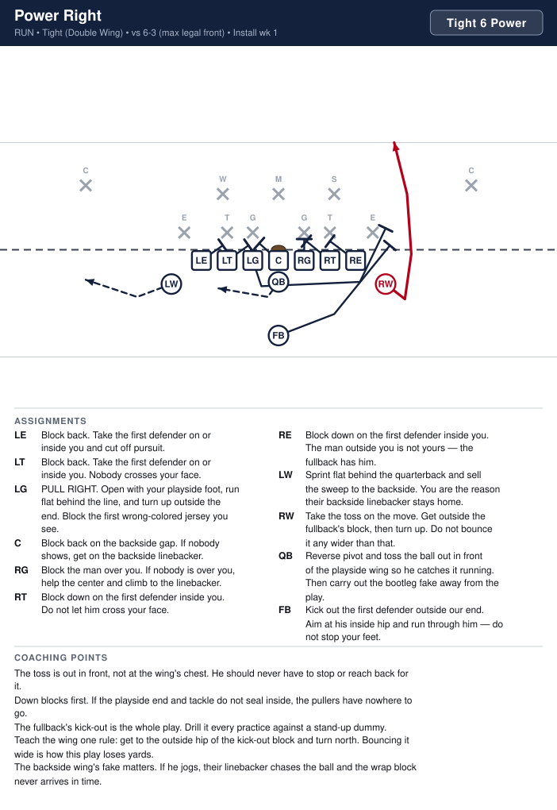

Our bread and butter. Everyone on the playside blocks down, the fullback kicks out the end man, the backside guard pulls and wraps up through the hole, and the playside wing takes the toss and runs off their tails. If we only ever ran this play and the wedge we would win games.

| Position | Assignment |
|---|---|
| **LE** | Block back. Take the first defender on or inside you and cut off pursuit. |
| **LT** | Block back. Take the first defender on or inside you. Nobody crosses your face. |
| **LG** | PULL RIGHT. Open with your playside foot, run flat behind the line, and turn up outside the end. Block the first wrong-colored jersey you see. |
| **C** | Block back on the backside gap. If nobody shows, get on the backside linebacker. |
| **RG** | Block the man over you. If nobody is over you, help the center and climb to the linebacker. |
| **RT** | Block down on the first defender inside you. Do not let him cross your face. |
| **RE** | Block down on the first defender inside you. The man outside you is not yours — the fullback has him. |
| **LW** | Sprint flat behind the quarterback and sell the sweep to the backside. You are the reason their backside linebacker stays home. |
| **RW** **(ball)** | Take the toss on the move. Get outside the fullback's block, then turn up. Do not bounce it any wider than that. |
| **QB** | Reverse pivot and toss the ball out in front of the playside wing so he catches it running. Then carry out the bootleg fake away from the play. |
| **FB** | Kick out the first defender outside our end. Aim at his inside hip and run through him — do not stop your feet. |

**Coaching points**

- The toss is out in front, not at the wing's chest. He should never have to stop or reach back for it.
- Down blocks first. If the playside end and tackle do not seal inside, the pullers have nowhere to go.
- The fullback's kick-out is the whole play. Drill it every practice against a stand-up dummy.
- Teach the wing one rule: get to the outside hip of the kick-out block and turn north. Bouncing it wide is how this play loses yards.
- The backside wing's fake matters. If he jogs, their linebacker chases the ball and the wrap block never arrives in time.

---

## Sneak

**Call it:** `Tight 0 Sneak`

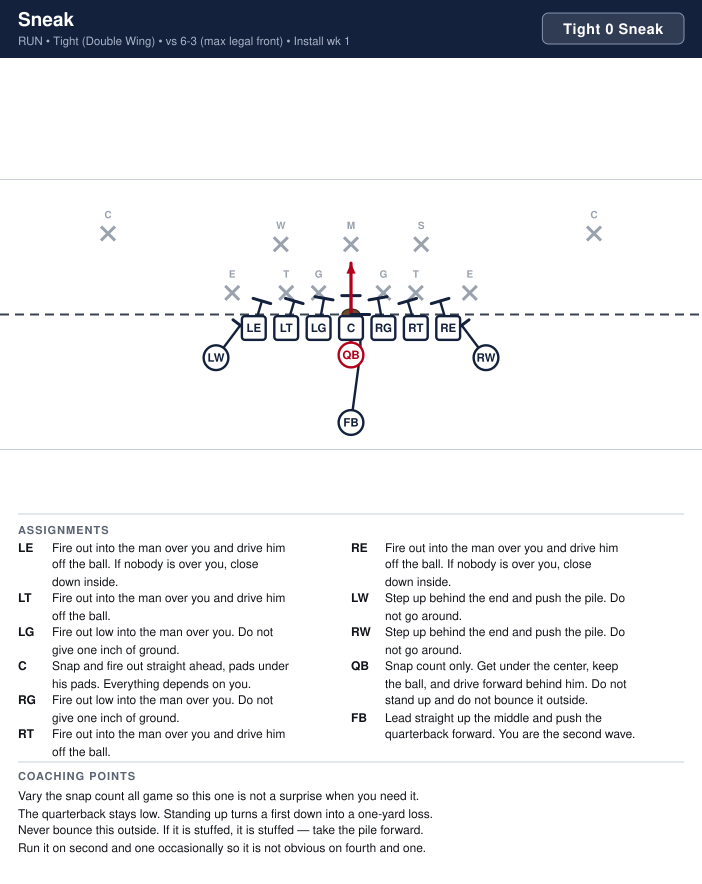

Fourth and inches. No handoff, no backfield action, nothing to mess up — the quarterback keeps it and falls forward behind the center. The whole play is the snap count.

| Position | Assignment |
|---|---|
| **LE** | Fire out into the man over you and drive him off the ball. If nobody is over you, close down inside. |
| **LT** | Fire out into the man over you and drive him off the ball. |
| **LG** | Fire out low into the man over you. Do not give one inch of ground. |
| **C** | Snap and fire out straight ahead, pads under his pads. Everything depends on you. |
| **RG** | Fire out low into the man over you. Do not give one inch of ground. |
| **RT** | Fire out into the man over you and drive him off the ball. |
| **RE** | Fire out into the man over you and drive him off the ball. If nobody is over you, close down inside. |
| **LW** | Step up behind the end and push the pile. Do not go around. |
| **RW** | Step up behind the end and push the pile. Do not go around. |
| **QB** **(ball)** | Snap count only. Get under the center, keep the ball, and drive forward behind him. Do not stand up and do not bounce it outside. |
| **FB** | Lead straight up the middle and push the quarterback forward. You are the second wave. |

**Coaching points**

- Vary the snap count all game so this one is not a surprise when you need it.
- The quarterback stays low. Standing up turns a first down into a one-yard loss.
- Never bounce this outside. If it is stuffed, it is stuffed — take the pile forward.
- Run it on second and one occasionally so it is not obvious on fourth and one.

---

## Wedge

**Call it:** `Tight 0 Wedge`

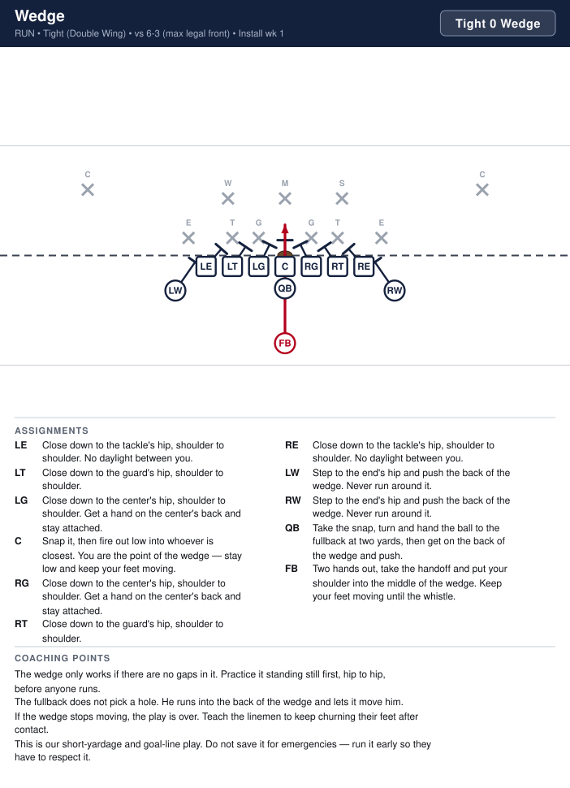

The first play we install and the play we run when we need two yards. Every blocker takes the same man — whoever is over the center — and the whole line moves as one body. There is no hole to find and no read to make.

| Position | Assignment |
|---|---|
| **LE** | Close down to the tackle's hip, shoulder to shoulder. No daylight between you. |
| **LT** | Close down to the guard's hip, shoulder to shoulder. |
| **LG** | Close down to the center's hip, shoulder to shoulder. Get a hand on the center's back and stay attached. |
| **C** | Snap it, then fire out low into whoever is closest. You are the point of the wedge — stay low and keep your feet moving. |
| **RG** | Close down to the center's hip, shoulder to shoulder. Get a hand on the center's back and stay attached. |
| **RT** | Close down to the guard's hip, shoulder to shoulder. |
| **RE** | Close down to the tackle's hip, shoulder to shoulder. No daylight between you. |
| **LW** | Step to the end's hip and push the back of the wedge. Never run around it. |
| **RW** | Step to the end's hip and push the back of the wedge. Never run around it. |
| **QB** | Take the snap, turn and hand the ball to the fullback at two yards, then get on the back of the wedge and push. |
| **FB** **(ball)** | Two hands out, take the handoff and put your shoulder into the middle of the wedge. Keep your feet moving until the whistle. |

**Coaching points**

- The wedge only works if there are no gaps in it. Practice it standing still first, hip to hip, before anyone runs.
- The fullback does not pick a hole. He runs into the back of the wedge and lets it move him.
- If the wedge stops moving, the play is over. Teach the linemen to keep churning their feet after contact.
- This is our short-yardage and goal-line play. Do not save it for emergencies — run it early so they have to respect it.

---

## Belly Left

**Call it:** `Tight 3 Belly`

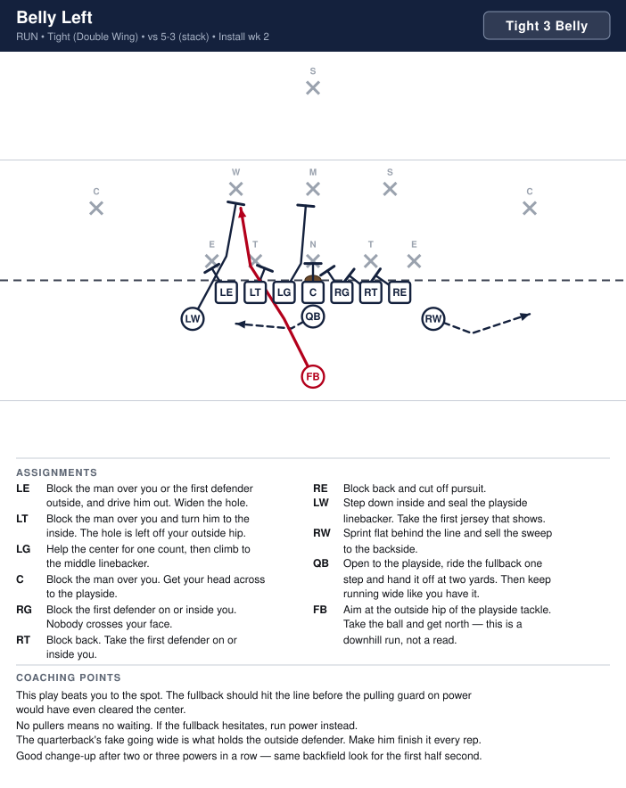

The fast-hitting complement to power. Nobody pulls, nobody kicks out — the line just blocks the man in front of them and the fullback is through the hole before the linebackers can flow. Use it when they start over-pursuing the power.

| Position | Assignment |
|---|---|
| **LE** | Block the man over you or the first defender outside, and drive him out. Widen the hole. |
| **LT** | Block the man over you and turn him to the inside. The hole is left off your outside hip. |
| **LG** | Help the center for one count, then climb to the middle linebacker. |
| **C** | Block the man over you. Get your head across to the playside. |
| **RG** | Block the first defender on or inside you. Nobody crosses your face. |
| **RT** | Block back. Take the first defender on or inside you. |
| **RE** | Block back and cut off pursuit. |
| **LW** | Step down inside and seal the playside linebacker. Take the first jersey that shows. |
| **RW** | Sprint flat behind the line and sell the sweep to the backside. |
| **QB** | Open to the playside, ride the fullback one step and hand it off at two yards. Then keep running wide like you have it. |
| **FB** **(ball)** | Aim at the outside hip of the playside tackle. Take the ball and get north — this is a downhill run, not a read. |

**Coaching points**

- This play beats you to the spot. The fullback should hit the line before the pulling guard on power would have even cleared the center.
- No pullers means no waiting. If the fullback hesitates, run power instead.
- The quarterback's fake going wide is what holds the outside defender. Make him finish it every rep.
- Good change-up after two or three powers in a row — same backfield look for the first half second.

---

## Belly Right

**Call it:** `Tight 4 Belly`

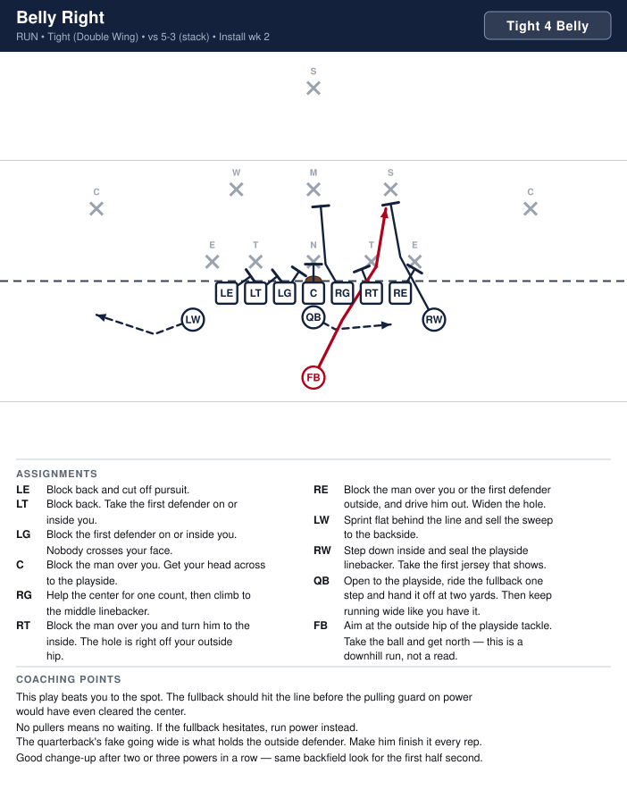

The fast-hitting complement to power. Nobody pulls, nobody kicks out — the line just blocks the man in front of them and the fullback is through the hole before the linebackers can flow. Use it when they start over-pursuing the power.

| Position | Assignment |
|---|---|
| **LE** | Block back and cut off pursuit. |
| **LT** | Block back. Take the first defender on or inside you. |
| **LG** | Block the first defender on or inside you. Nobody crosses your face. |
| **C** | Block the man over you. Get your head across to the playside. |
| **RG** | Help the center for one count, then climb to the middle linebacker. |
| **RT** | Block the man over you and turn him to the inside. The hole is right off your outside hip. |
| **RE** | Block the man over you or the first defender outside, and drive him out. Widen the hole. |
| **LW** | Sprint flat behind the line and sell the sweep to the backside. |
| **RW** | Step down inside and seal the playside linebacker. Take the first jersey that shows. |
| **QB** | Open to the playside, ride the fullback one step and hand it off at two yards. Then keep running wide like you have it. |
| **FB** **(ball)** | Aim at the outside hip of the playside tackle. Take the ball and get north — this is a downhill run, not a read. |

**Coaching points**

- This play beats you to the spot. The fullback should hit the line before the pulling guard on power would have even cleared the center.
- No pullers means no waiting. If the fullback hesitates, run power instead.
- The quarterback's fake going wide is what holds the outside defender. Make him finish it every rep.
- Good change-up after two or three powers in a row — same backfield look for the first half second.

---

## Trap Left

**Call it:** `Tight 1 Trap`

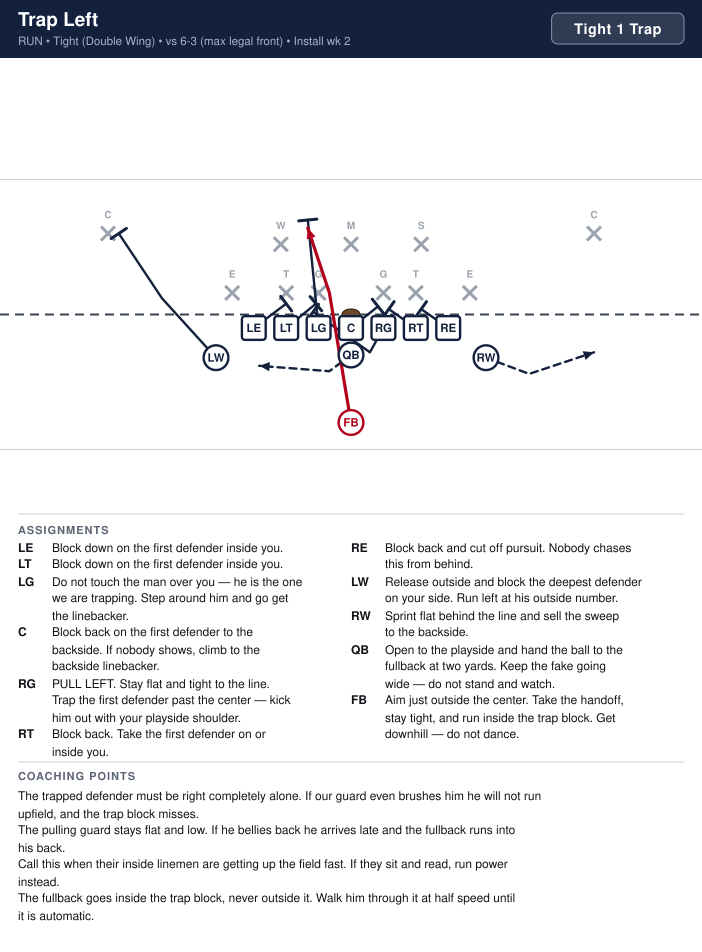

The answer when their inside linemen start firing upfield to beat our down blocks. We leave one of them completely unblocked, let him run himself out of the play, and the backside guard pulls across and knocks him out of the hole. The fullback runs inside of that block.

| Position | Assignment |
|---|---|
| **LE** | Block down on the first defender inside you. |
| **LT** | Block down on the first defender inside you. |
| **LG** | Do not touch the man over you — he is the one we are trapping. Step around him and go get the linebacker. |
| **C** | Block back on the first defender to the backside. If nobody shows, climb to the backside linebacker. |
| **RG** | PULL LEFT. Stay flat and tight to the line. Trap the first defender past the center — kick him out with your playside shoulder. |
| **RT** | Block back. Take the first defender on or inside you. |
| **RE** | Block back and cut off pursuit. Nobody chases this from behind. |
| **LW** | Release outside and block the deepest defender on your side. Run left at his outside number. |
| **RW** | Sprint flat behind the line and sell the sweep to the backside. |
| **QB** | Open to the playside and hand the ball to the fullback at two yards. Keep the fake going wide — do not stand and watch. |
| **FB** **(ball)** | Aim just outside the center. Take the handoff, stay tight, and run inside the trap block. Get downhill — do not dance. |

**Coaching points**

- The trapped defender must be right completely alone. If our guard even brushes him he will not run upfield, and the trap block misses.
- The pulling guard stays flat and low. If he bellies back he arrives late and the fullback runs into his back.
- Call this when their inside linemen are getting up the field fast. If they sit and read, run power instead.
- The fullback goes inside the trap block, never outside it. Walk him through it at half speed until it is automatic.

---

## Trap Right

**Call it:** `Tight 2 Trap`

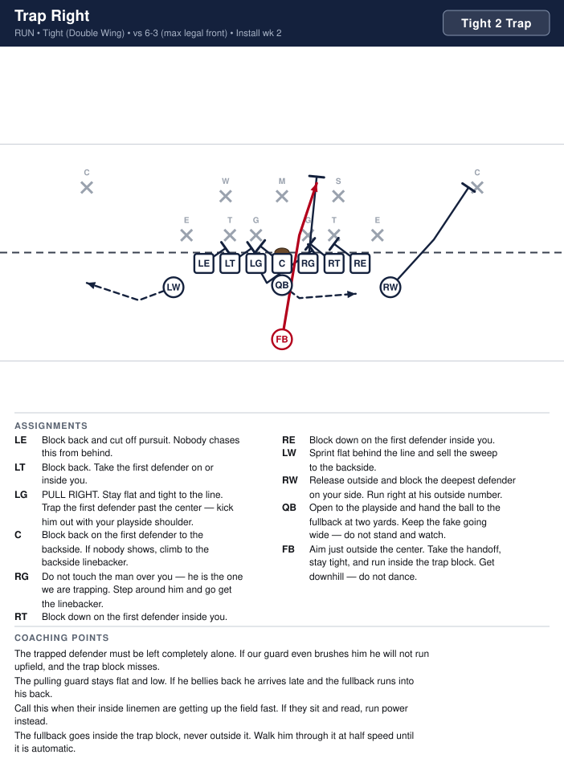

The answer when their inside linemen start firing upfield to beat our down blocks. We leave one of them completely unblocked, let him run himself out of the play, and the backside guard pulls across and knocks him out of the hole. The fullback runs inside of that block.

| Position | Assignment |
|---|---|
| **LE** | Block back and cut off pursuit. Nobody chases this from behind. |
| **LT** | Block back. Take the first defender on or inside you. |
| **LG** | PULL RIGHT. Stay flat and tight to the line. Trap the first defender past the center — kick him out with your playside shoulder. |
| **C** | Block back on the first defender to the backside. If nobody shows, climb to the backside linebacker. |
| **RG** | Do not touch the man over you — he is the one we are trapping. Step around him and go get the linebacker. |
| **RT** | Block down on the first defender inside you. |
| **RE** | Block down on the first defender inside you. |
| **LW** | Sprint flat behind the line and sell the sweep to the backside. |
| **RW** | Release outside and block the deepest defender on your side. Run right at his outside number. |
| **QB** | Open to the playside and hand the ball to the fullback at two yards. Keep the fake going wide — do not stand and watch. |
| **FB** **(ball)** | Aim just outside the center. Take the handoff, stay tight, and run inside the trap block. Get downhill — do not dance. |

**Coaching points**

- The trapped defender must be left completely alone. If our guard even brushes him he will not run upfield, and the trap block misses.
- The pulling guard stays flat and low. If he bellies back he arrives late and the fullback runs into his back.
- Call this when their inside linemen are getting up the field fast. If they sit and read, run power instead.
- The fullback goes inside the trap block, never outside it. Walk him through it at half speed until it is automatic.

---

## Counter Left

**Call it:** `Tight 5 Counter`

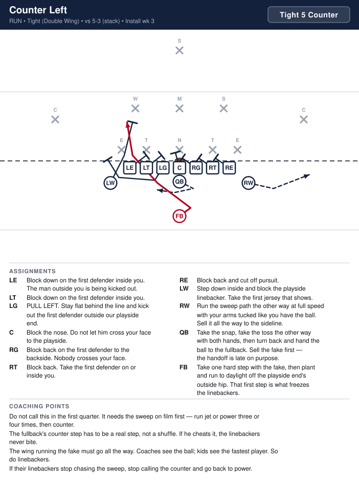

Misdirection off the sweep. We show them the sweep going one way, their linebackers chase it, and the fullback plants and comes back the other way behind a pulling guard. This play only works after we have run the sweep enough times that they believe it.

| Position | Assignment |
|---|---|
| **LE** | Block down on the first defender inside you. The man outside you is being kicked out. |
| **LT** | Block down on the first defender inside you. |
| **LG** | PULL LEFT. Stay flat behind the line and kick out the first defender outside our playside end. |
| **C** | Block the nose. Do not let him cross your face to the playside. |
| **RG** | Block back on the first defender to the backside. Nobody crosses your face. |
| **RT** | Block back. Take the first defender on or inside you. |
| **RE** | Block back and cut off pursuit. |
| **LW** | Step down inside and block the playside linebacker. Take the first jersey that shows. |
| **RW** | Run the sweep path the other way at full speed with your arms tucked like you have the ball. Sell it all the way to the sideline. |
| **QB** | Take the snap, fake the toss the other way with both hands, then turn back and hand the ball to the fullback. Sell the fake first — the handoff is late on purpose. |
| **FB** **(ball)** | Take one hard step with the fake, then plant and run to daylight off the playside end's outside hip. That first step is what freezes the linebackers. |

**Coaching points**

- Do not call this in the first quarter. It needs the sweep on film first — run jet or power three or four times, then counter.
- The fullback's counter step has to be a real step, not a shuffle. If he cheats it, the linebackers never bite.
- The wing running the fake must go all the way. Coaches see the ball; kids see the fastest player. So do linebackers.
- If their linebackers stop chasing the sweep, stop calling the counter and go back to power.

---

## Counter Right

**Call it:** `Tight 6 Counter`

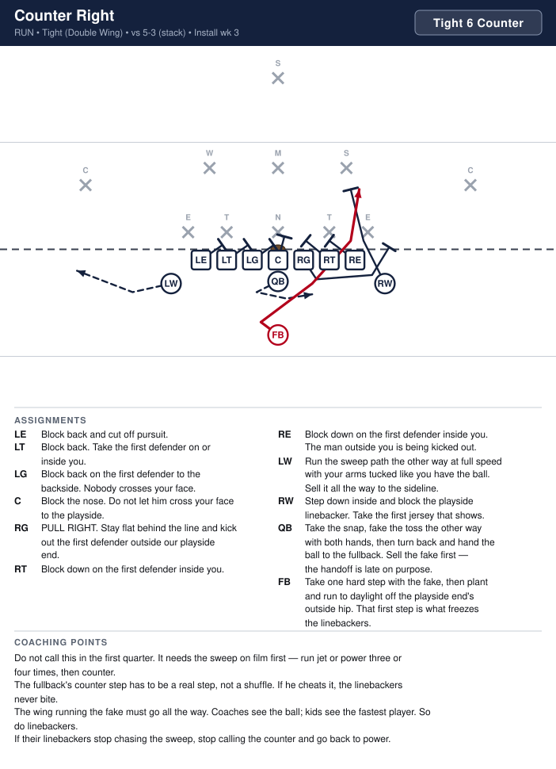

Misdirection off the sweep. We show them the sweep going one way, their linebackers chase it, and the fullback plants and comes back the other way behind a pulling guard. This play only works after we have run the sweep enough times that they believe it.

| Position | Assignment |
|---|---|
| **LE** | Block back and cut off pursuit. |
| **LT** | Block back. Take the first defender on or inside you. |
| **LG** | Block back on the first defender to the backside. Nobody crosses your face. |
| **C** | Block the nose. Do not let him cross your face to the playside. |
| **RG** | PULL RIGHT. Stay flat behind the line and kick out the first defender outside our playside end. |
| **RT** | Block down on the first defender inside you. |
| **RE** | Block down on the first defender inside you. The man outside you is being kicked out. |
| **LW** | Run the sweep path the other way at full speed with your arms tucked like you have the ball. Sell it all the way to the sideline. |
| **RW** | Step down inside and block the playside linebacker. Take the first jersey that shows. |
| **QB** | Take the snap, fake the toss the other way with both hands, then turn back and hand the ball to the fullback. Sell the fake first — the handoff is late on purpose. |
| **FB** **(ball)** | Take one hard step with the fake, then plant and run to daylight off the playside end's outside hip. That first step is what freezes the linebackers. |

**Coaching points**

- Do not call this in the first quarter. It needs the sweep on film first — run jet or power three or four times, then counter.
- The fullback's counter step has to be a real step, not a shuffle. If he cheats it, the linebackers never bite.
- The wing running the fake must go all the way. Coaches see the ball; kids see the fastest player. So do linebackers.
- If their linebackers stop chasing the sweep, stop calling the counter and go back to power.

---

## Jet Left

**Call it:** `Tight 7 Jet`

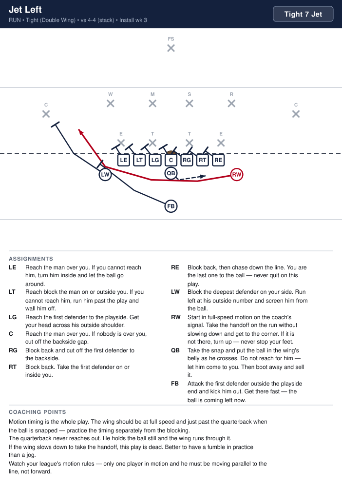

Full-speed motion sweep. The backside wing is already moving at the snap, takes the ball on the run, and tries to beat everyone to the corner. This is our fastest play and the one that makes their defense widen out — which is what makes the wedge and the trap work.

| Position | Assignment |
|---|---|
| **LE** | Reach the man over you. If you cannot reach him, turn him inside and let the ball go around. |
| **LT** | Reach block the man on or outside you. If you cannot reach him, run him past the play and wall him off. |
| **LG** | Reach the first defender to the playside. Get your head across his outside shoulder. |
| **C** | Reach the man over you. If nobody is over you, cut off the backside gap. |
| **RG** | Block back and cut off the first defender to the backside. |
| **RT** | Block back. Take the first defender on or inside you. |
| **RE** | Block back, then chase down the line. You are the last one to the ball — never quit on this play. |
| **LW** | Block the deepest defender on your side. Run left at his outside number and screen him from the ball. |
| **RW** **(ball)** | Start in full-speed motion on the coach's signal. Take the handoff on the run without slowing down and get to the corner. If it is not there, turn up — never stop your feet. |
| **QB** | Take the snap and put the ball in the wing's belly as he crosses. Do not reach for him — let him come to you. Then boot away and sell it. |
| **FB** | Attack the first defender outside the playside end and kick him out. Get there fast — the ball is coming left now. |

**Coaching points**

- Motion timing is the whole play. The wing should be at full speed and just past the quarterback when the ball is snapped — practice the timing separately from the blocking.
- The quarterback never reaches out. He holds the ball still and the wing runs through it.
- If the wing slows down to take the handoff, this play is dead. Better to have a fumble in practice than a jog.
- Watch your league's motion rules — only one player in motion and he must be moving parallel to the line, not forward.

---

## Jet Right

**Call it:** `Tight 8 Jet`

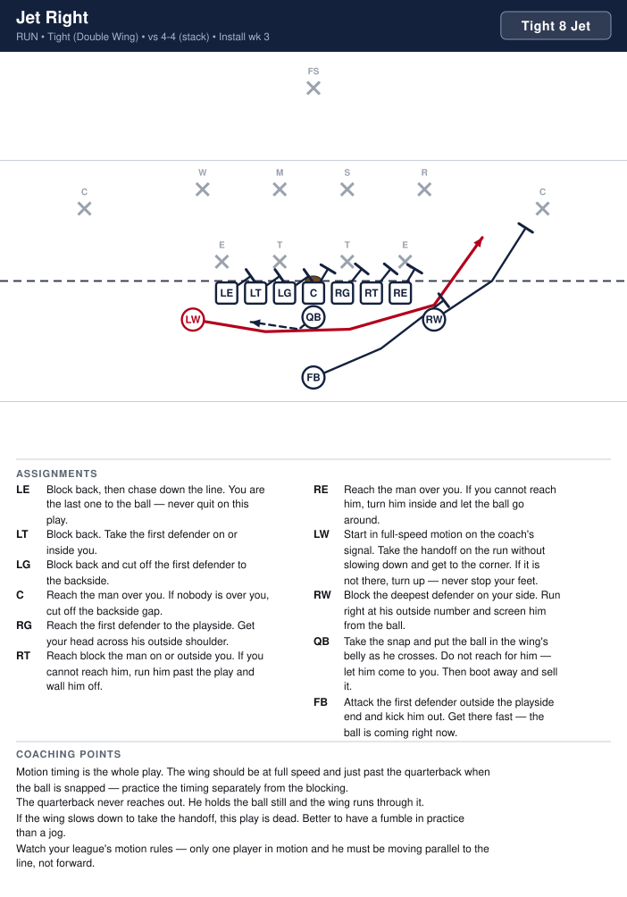

Full-speed motion sweep. The backside wing is already moving at the snap, takes the ball on the run, and tries to beat everyone to the corner. This is our fastest play and the one that makes their defense widen out — which is what makes the wedge and the trap work.

| Position | Assignment |
|---|---|
| **LE** | Block back, then chase down the line. You are the last one to the ball — never quit on this play. |
| **LT** | Block back. Take the first defender on or inside you. |
| **LG** | Block back and cut off the first defender to the backside. |
| **C** | Reach the man over you. If nobody is over you, cut off the backside gap. |
| **RG** | Reach the first defender to the playside. Get your head across his outside shoulder. |
| **RT** | Reach block the man on or outside you. If you cannot reach him, run him past the play and wall him off. |
| **RE** | Reach the man over you. If you cannot reach him, turn him inside and let the ball go around. |
| **LW** **(ball)** | Start in full-speed motion on the coach's signal. Take the handoff on the run without slowing down and get to the corner. If it is not there, turn up — never stop your feet. |
| **RW** | Block the deepest defender on your side. Run right at his outside number and screen him from the ball. |
| **QB** | Take the snap and put the ball in the wing's belly as he crosses. Do not reach for him — let him come to you. Then boot away and sell it. |
| **FB** | Attack the first defender outside the playside end and kick him out. Get there fast — the ball is coming right now. |

**Coaching points**

- Motion timing is the whole play. The wing should be at full speed and just past the quarterback when the ball is snapped — practice the timing separately from the blocking.
- The quarterback never reaches out. He holds the ball still and the wing runs through it.
- If the wing slows down to take the handoff, this play is dead. Better to have a fumble in practice than a jog.
- Watch your league's motion rules — only one player in motion and he must be moving parallel to the line, not forward.

---

## Boot Left

**Call it:** `Tight 7 Boot`

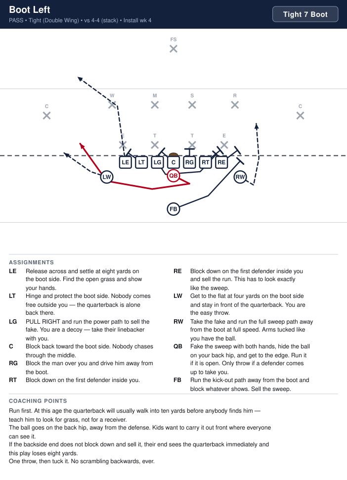

Naked bootleg. The whole backfield runs the sweep away and the quarterback keeps it and comes out the back door alone, with two receivers on his side. Run first, throw second — it is a quarterback run with an escape hatch.

| Position | Assignment |
|---|---|
| **LE** | Release across and settle at eight yards on the boot side. Find the open grass and show your hands. |
| **LT** | Hinge and protect the boot side. Nobody comes free outside you — the quarterback is alone back there. |
| **LG** | PULL RIGHT and run the power path to sell the fake. You are a decoy — take their linebacker with you. |
| **C** | Block back toward the boot side. Nobody chases through the middle. |
| **RG** | Block the man over you and drive him away from the boot. |
| **RT** | Block down on the first defender inside you. |
| **RE** | Block down on the first defender inside you and sell the run. This has to look exactly like the sweep. |
| **LW** | Get to the flat at four yards on the boot side and stay in front of the quarterback. You are the easy throw. |
| **RW** | Take the fake and run the full sweep path away from the boot at full speed. Arms tucked like you have the ball. |
| **QB** **(ball)** | Fake the sweep with both hands, hide the ball on your back hip, and get to the edge. Run it if it is open. Only throw if a defender comes up to take you. |
| **FB** | Run the kick-out path away from the boot and block whatever shows. Sell the sweep. |

**Coaching points**

- Run first. At this age the quarterback will usually walk into ten yards before anybody finds him — teach him to look for grass, not for a receiver.
- The ball goes on the back hip, away from the defense. Kids want to carry it out front where everyone can see it.
- If the backside end does not block down and sell it, their end sees the quarterback immediately and this play loses eight yards.
- One throw, then tuck it. No scrambling backwards, ever.

---

## Boot Right

**Call it:** `Tight 8 Boot`

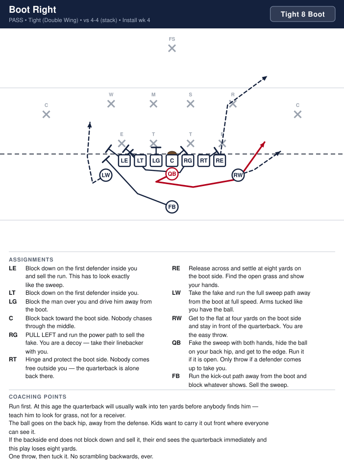

Naked bootleg. The whole backfield runs the sweep away and the quarterback keeps it and comes out the back door alone, with two receivers on his side. Run first, throw second — it is a quarterback run with an escape hatch.

| Position | Assignment |
|---|---|
| **LE** | Block down on the first defender inside you and sell the run. This has to look exactly like the sweep. |
| **LT** | Block down on the first defender inside you. |
| **LG** | Block the man over you and drive him away from the boot. |
| **C** | Block back toward the boot side. Nobody chases through the middle. |
| **RG** | PULL LEFT and run the power path to sell the fake. You are a decoy — take their linebacker with you. |
| **RT** | Hinge and protect the boot side. Nobody comes free outside you — the quarterback is alone back there. |
| **RE** | Release across and settle at eight yards on the boot side. Find the open grass and show your hands. |
| **LW** | Take the fake and run the full sweep path away from the boot at full speed. Arms tucked like you have the ball. |
| **RW** | Get to the flat at four yards on the boot side and stay in front of the quarterback. You are the easy throw. |
| **QB** **(ball)** | Fake the sweep with both hands, hide the ball on your back hip, and get to the edge. Run it if it is open. Only throw if a defender comes up to take you. |
| **FB** | Run the kick-out path away from the boot and block whatever shows. Sell the sweep. |

**Coaching points**

- Run first. At this age the quarterback will usually walk into ten yards before anybody finds him — teach him to look for grass, not for a receiver.
- The ball goes on the back hip, away from the defense. Kids want to carry it out front where everyone can see it.
- If the backside end does not block down and sell it, their end sees the quarterback immediately and this play loses eight yards.
- One throw, then tuck it. No scrambling backwards, ever.

---

## Keep Left

**Call it:** `Tight 7 Keep`

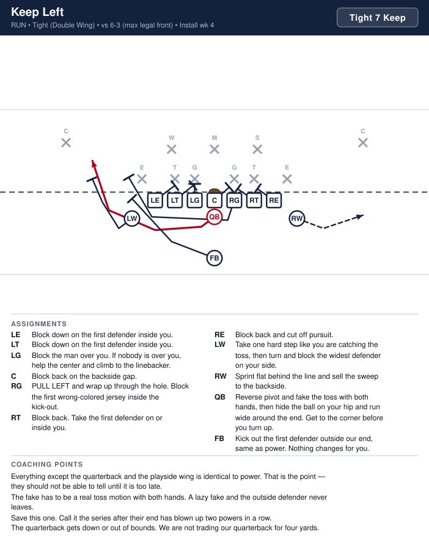

Power blocking, but the quarterback fakes the toss and keeps it around the edge. When their outside defender starts crashing hard on the wing, this is the play that makes him pay.

| Position | Assignment |
|---|---|
| **LE** | Block down on the first defender inside you. |
| **LT** | Block down on the first defender inside you. |
| **LG** | Block the man over you. If nobody is over you, help the center and climb to the linebacker. |
| **C** | Block back on the backside gap. |
| **RG** | PULL LEFT and wrap up through the hole. Block the first wrong-colored jersey inside the kick-out. |
| **RT** | Block back. Take the first defender on or inside you. |
| **RE** | Block back and cut off pursuit. |
| **LW** | Take one hard step like you are catching the toss, then turn and block the widest defender on your side. |
| **RW** | Sprint flat behind the line and sell the sweep to the backside. |
| **QB** **(ball)** | Reverse pivot and fake the toss with both hands, then hide the ball on your hip and run wide around the end. Get to the corner before you turn up. |
| **FB** | Kick out the first defender outside our end, same as power. Nothing changes for you. |

**Coaching points**

- Everything except the quarterback and the playside wing is identical to power. That is the point — they should not be able to tell until it is too late.
- The fake has to be a real toss motion with both hands. A lazy fake and the outside defender never leaves.
- Save this one. Call it the series after their end has blown up two powers in a row.
- The quarterback gets down or out of bounds. We are not trading our quarterback for four yards.

---

## Keep Right

**Call it:** `Tight 8 Keep`

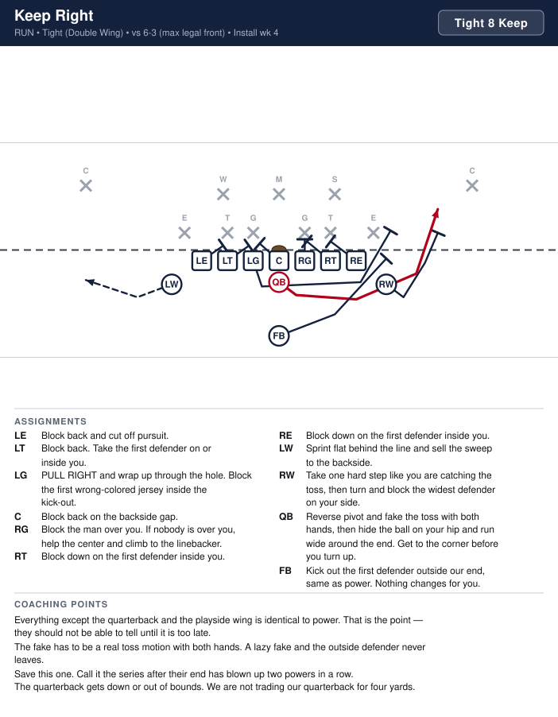

Power blocking, but the quarterback fakes the toss and keeps it around the edge. When their outside defender starts crashing hard on the wing, this is the play that makes him pay.

| Position | Assignment |
|---|---|
| **LE** | Block back and cut off pursuit. |
| **LT** | Block back. Take the first defender on or inside you. |
| **LG** | PULL RIGHT and wrap up through the hole. Block the first wrong-colored jersey inside the kick-out. |
| **C** | Block back on the backside gap. |
| **RG** | Block the man over you. If nobody is over you, help the center and climb to the linebacker. |
| **RT** | Block down on the first defender inside you. |
| **RE** | Block down on the first defender inside you. |
| **LW** | Sprint flat behind the line and sell the sweep to the backside. |
| **RW** | Take one hard step like you are catching the toss, then turn and block the widest defender on your side. |
| **QB** **(ball)** | Reverse pivot and fake the toss with both hands, then hide the ball on your hip and run wide around the end. Get to the corner before you turn up. |
| **FB** | Kick out the first defender outside our end, same as power. Nothing changes for you. |

**Coaching points**

- Everything except the quarterback and the playside wing is identical to power. That is the point — they should not be able to tell until it is too late.
- The fake has to be a real toss motion with both hands. A lazy fake and the outside defender never leaves.
- Save this one. Call it the series after their end has blown up two powers in a row.
- The quarterback gets down or out of bounds. We are not trading our quarterback for four yards.

---

## Power Pass Left

**Call it:** `Tight 5 Power Pass`

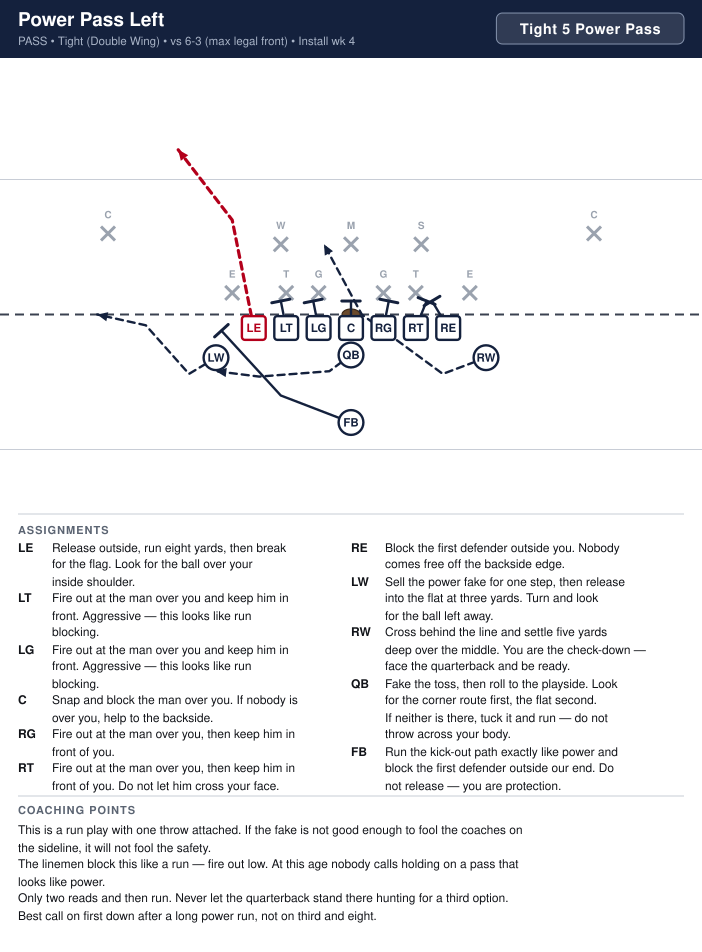

One throw off the power fake. The playside end runs a corner behind a defense that has stopped covering anybody, and the playside wing is the safe throw in the flat. Two receivers, two reads, and if neither is open the quarterback tucks it and runs.

| Position | Assignment |
|---|---|
| **LE** **(ball)** | Release outside, run eight yards, then break for the flag. Look for the ball over your inside shoulder. |
| **LT** | Fire out at the man over you and keep him in front. Aggressive — this looks like run blocking. |
| **LG** | Fire out at the man over you and keep him in front. Aggressive — this looks like run blocking. |
| **C** | Snap and block the man over you. If nobody is over you, help to the backside. |
| **RG** | Fire out at the man over you, then keep him in front of you. |
| **RT** | Fire out at the man over you, then keep him in front of you. Do not let him cross your face. |
| **RE** | Block the first defender outside you. Nobody comes free off the backside edge. |
| **LW** | Sell the power fake for one step, then release into the flat at three yards. Turn and look for the ball left away. |
| **RW** | Cross behind the line and settle five yards deep over the middle. You are the check-down — face the quarterback and be ready. |
| **QB** | Fake the toss, then roll to the playside. Look for the corner route first, the flat second. If neither is there, tuck it and run — do not throw across your body. |
| **FB** | Run the kick-out path exactly like power and block the first defender outside our end. Do not release — you are protection. |

**Coaching points**

- This is a run play with one throw attached. If the fake is not good enough to fool the coaches on the sideline, it will not fool the safety.
- The linemen block this like a run — fire out low. At this age nobody calls holding on a pass that looks like power.
- Only two reads and then run. Never let the quarterback stand there hunting for a third option.
- Best call on first down after a long power run, not on third and eight.

---

## Power Pass Right

**Call it:** `Tight 6 Power Pass`

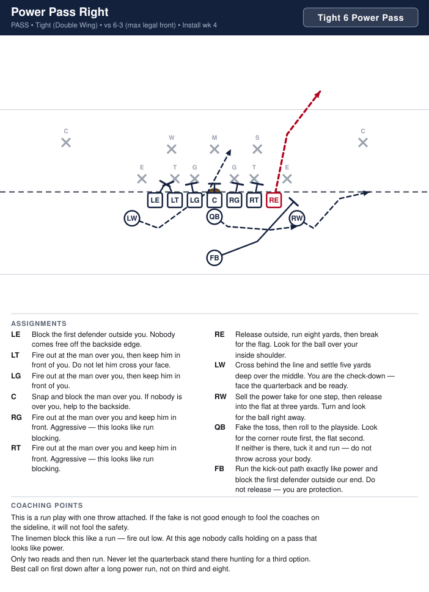

One throw off the power fake. The playside end runs a corner behind a defense that has stopped covering anybody, and the playside wing is the safe throw in the flat. Two receivers, two reads, and if neither is open the quarterback tucks it and runs.

| Position | Assignment |
|---|---|
| **LE** | Block the first defender outside you. Nobody comes free off the backside edge. |
| **LT** | Fire out at the man over you, then keep him in front of you. Do not let him cross your face. |
| **LG** | Fire out at the man over you, then keep him in front of you. |
| **C** | Snap and block the man over you. If nobody is over you, help to the backside. |
| **RG** | Fire out at the man over you and keep him in front. Aggressive — this looks like run blocking. |
| **RT** | Fire out at the man over you and keep him in front. Aggressive — this looks like run blocking. |
| **RE** **(ball)** | Release outside, run eight yards, then break for the flag. Look for the ball over your inside shoulder. |
| **LW** | Cross behind the line and settle five yards deep over the middle. You are the check-down — face the quarterback and be ready. |
| **RW** | Sell the power fake for one step, then release into the flat at three yards. Turn and look for the ball right away. |
| **QB** | Fake the toss, then roll to the playside. Look for the corner route first, the flat second. If neither is there, tuck it and run — do not throw across your body. |
| **FB** | Run the kick-out path exactly like power and block the first defender outside our end. Do not release — you are protection. |

**Coaching points**

- This is a run play with one throw attached. If the fake is not good enough to fool the coaches on the sideline, it will not fool the safety.
- The linemen block this like a run — fire out low. At this age nobody calls holding on a pass that looks like power.
- Only two reads and then run. Never let the quarterback stand there hunting for a third option.
- Best call on first down after a long power run, not on third and eight.

