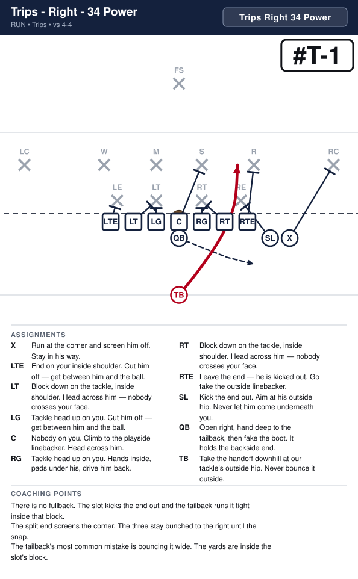
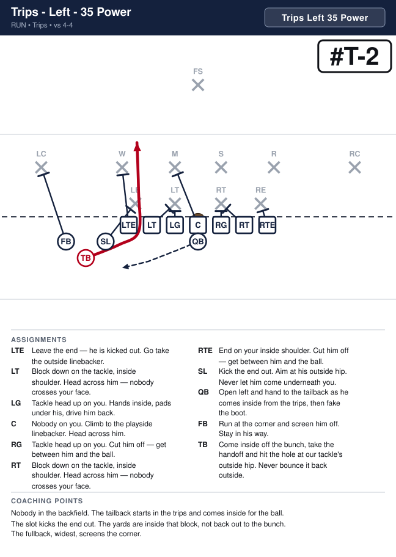
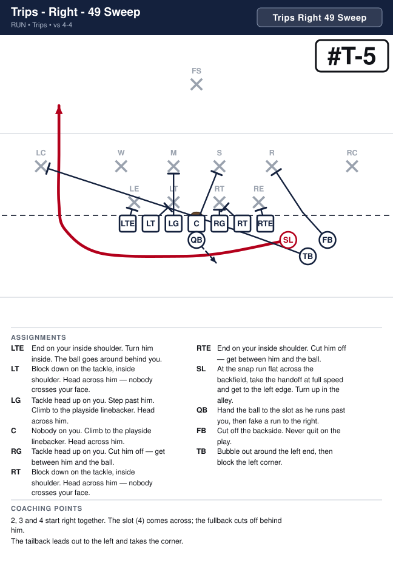
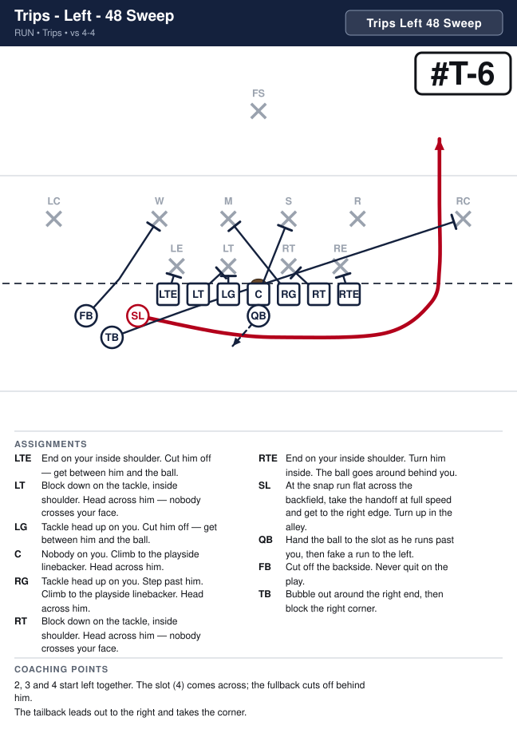
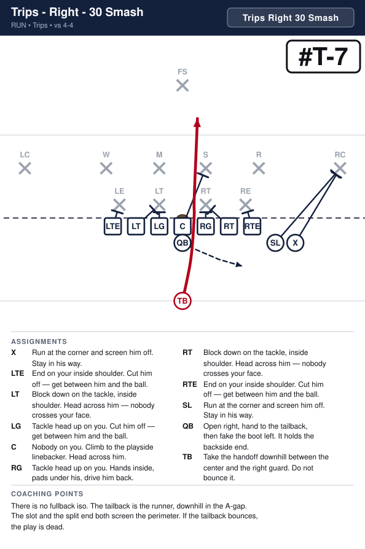
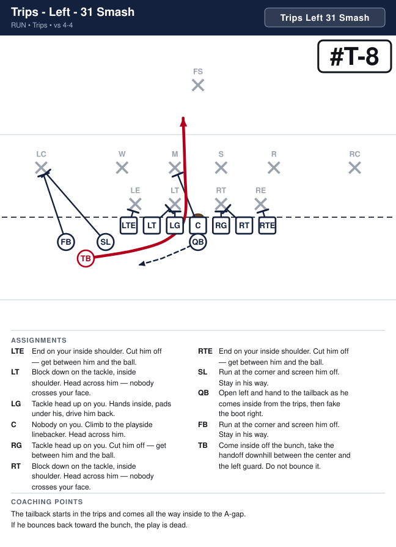
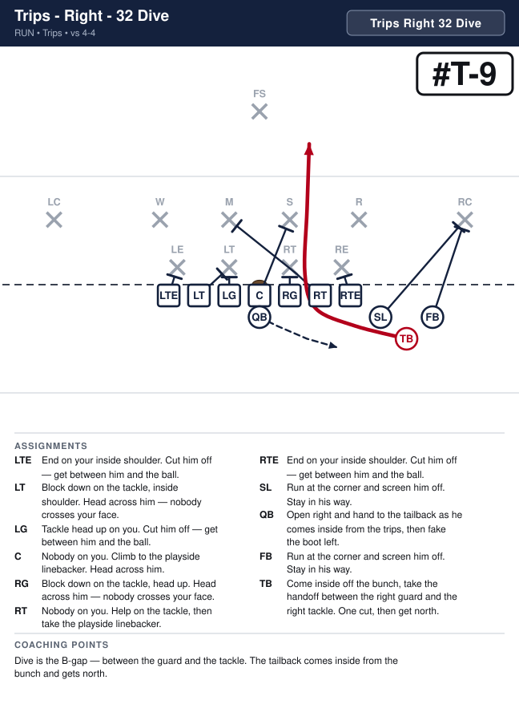
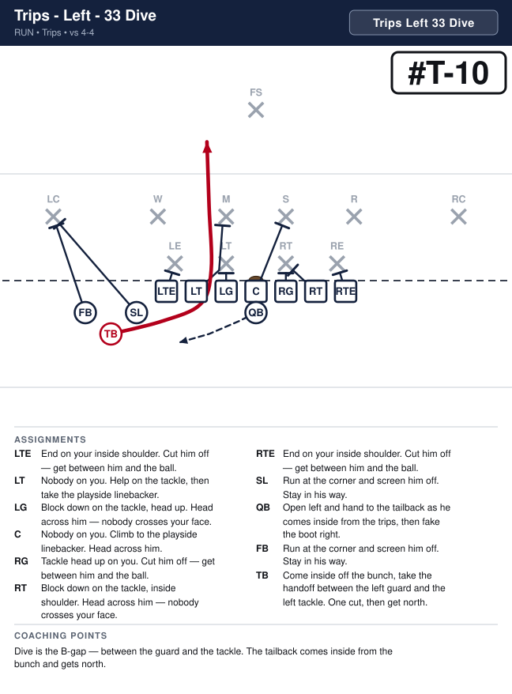
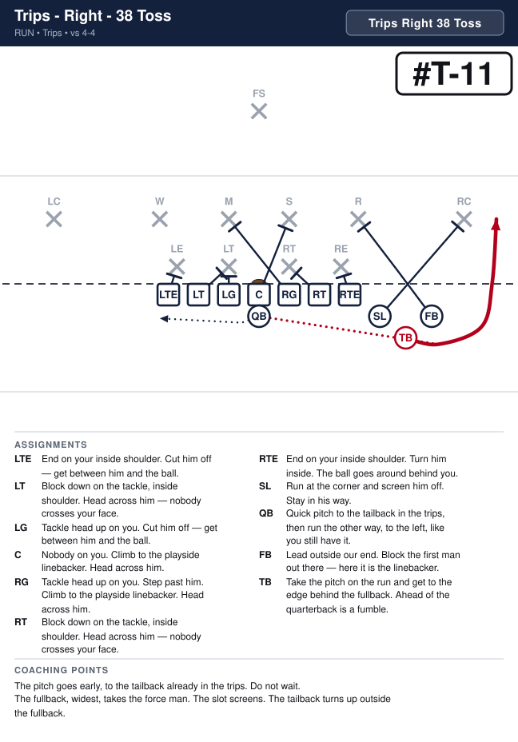
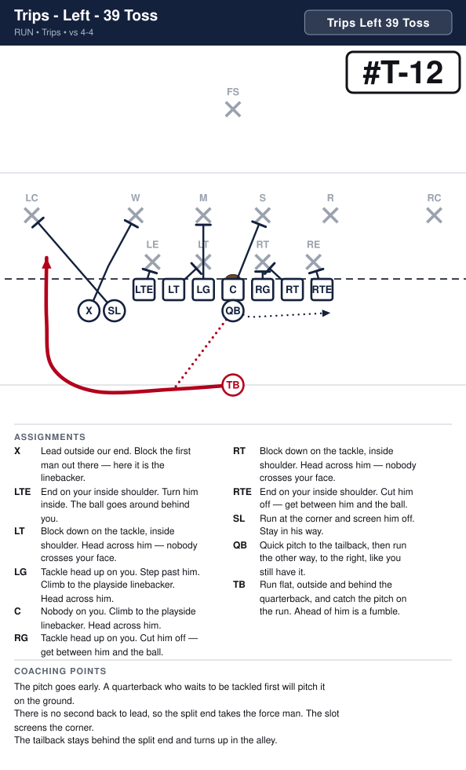

# Trips

_Generated by `generator/render.py`. Edit the JSON in `plays/`, not this file._

Same line as the Regular I — both ends tight, seven on the line every snap. The slot is just outside the tight end, one step off the line, and the split end is a step outside him: those three are the trips. Tailback at five yards. The call names the bunch — Trips Right or Trips Left — every time.

**Alignment** (yards; x positive to the right, y positive downfield, LOS = 0)

| Position | x | y |
|---|---|---|
| LTE | -4.2 | -0.5 |
| LT | -2.8 | -0.5 |
| LG | -1.4 | -0.5 |
| C | 0.0 | -0.5 |
| RG | 1.4 | -0.5 |
| RT | 2.8 | -0.5 |
| RTE | 4.2 | -0.5 |
| SL | 5.6 | -1.5 |
| X | 6.8 | -1.5 |
| QB | 0.0 | -1.5 |
| TB | 0.0 | -5.0 |

**Formation coaching notes**

- Count seven on the line every snap — both ends stay down. The slot and the split end are off the line; either one creeping up is an illegal-formation flag.
- The three stay together. Trips Right is the tight end, slot and split end on the right; Trips Left moves the slot and the split end. A play that moves them says so in the call.
- There is no fullback. Power still kicks with the slot; the tailback runs it without a lead iso. Toss and Sweep put the split end on the force man.
- The tailback is back 3, both ways — 34 Power and 35 Power, 38 Toss and 39 Toss. The slot is still 4.

## Plays

| Play | Call | Scheme | Type | Ball |
|---|---|---|---|---|
| [Trips - Right - 34 Power](#trips---right---34-power) | `Trips Right 34 Power` | Power | run | TB |
| [Trips - Left - 35 Power](#trips---left---35-power) | `Trips Left 35 Power` | Power | run | TB |
| [Trips - Right - LTE Sweep](#trips---right---lte-sweep) | `Trips Right LTE Sweep` | Sweep | run | LTE |
| [Trips - Left - RTE Sweep](#trips---left---rte-sweep) | `Trips Left RTE Sweep` | Sweep | run | RTE |
| [Trips - Right - 49 Sweep](#trips---right---49-sweep) | `Trips Right 49 Sweep` | Sweep | run | SL |
| [Trips - Left - 48 Sweep](#trips---left---48-sweep) | `Trips Left 48 Sweep` | Sweep | run | SL |
| [Trips - Right - 30 Smash](#trips---right---30-smash) | `Trips Right 30 Smash` | Smash | run | TB |
| [Trips - Left - 31 Smash](#trips---left---31-smash) | `Trips Left 31 Smash` | Smash | run | TB |
| [Trips - Right - 32 Dive](#trips---right---32-dive) | `Trips Right 32 Dive` | Dive | run | TB |
| [Trips - Left - 33 Dive](#trips---left---33-dive) | `Trips Left 33 Dive` | Dive | run | TB |
| [Trips - Right - 38 Toss](#trips---right---38-toss) | `Trips Right 38 Toss` | Toss | run | TB |
| [Trips - Left - 39 Toss](#trips---left---39-toss) | `Trips Left 39 Toss` | Toss | run | TB |
| [Trips - Right - 18 Sweep](#trips---right---18-sweep) | `Trips Right 18 Sweep` | Sweep | run | QB |
| [Trips - Left - 19 Sweep](#trips---left---19-sweep) | `Trips Left 19 Sweep` | Sweep | run | QB |
| [Trips - Right - RTE Slant Out](#trips---right---rte-slant-out) | `Trips Right RTE Slant Out` | Protect | pass | RTE |
| [Trips - Left - LTE Slant Out](#trips---left---lte-slant-out) | `Trips Left LTE Slant Out` | Protect | pass | LTE |

---

## Trips - Right - 34 Power

**Call it:** `Trips Right 34 Power`

**Scheme:** Power

| Position | Assignment |
|---|---|
| **X** | Run at the corner and screen him off. Stay in his way. |
| **LTE** | End on your inside shoulder. Cut him off — get between him and the ball. |
| **LT** | Block down on the tackle, inside shoulder. Head across him — nobody crosses your face. |
| **LG** | Tackle head up on you. Cut him off — get between him and the ball. |
| **C** | Nobody on you. Climb to the playside linebacker. Head across him. |
| **RG** | Tackle head up on you. Hands inside, pads under his, drive him back. |
| **RT** | Block down on the tackle, inside shoulder. Head across him — nobody crosses your face. |
| **RTE** | Leave the end — he is kicked out. Go take the outside linebacker. |
| **SL** | Kick the end out. Aim at his outside hip. Never let him come underneath you. |
| **QB** | Open right, hand deep to the tailback, then fake the boot. It holds the backside end. |
| **TB** **(ball)** | Take the handoff downhill at our tackle's outside hip. Never bounce it outside. |

**Coaching points**

- There is no fullback. The slot kicks the end out and the tailback runs it tight inside that block.
- The split end screens the corner. The three stay bunched to the right until the snap.
- The tailback's most common mistake is bouncing it wide. The yards are inside the slot's block.

---

## Trips - Left - 35 Power

**Call it:** `Trips Left 35 Power`

**Scheme:** Power

| Position | Assignment |
|---|---|
| **X** | Run at the corner and screen him off. Stay in his way. |
| **LTE** | Leave the end — he is kicked out. Go take the outside linebacker. |
| **LT** | Block down on the tackle, inside shoulder. Head across him — nobody crosses your face. |
| **LG** | Tackle head up on you. Hands inside, pads under his, drive him back. |
| **C** | Nobody on you. Climb to the playside linebacker. Head across him. |
| **RG** | Tackle head up on you. Cut him off — get between him and the ball. |
| **RT** | Block down on the tackle, inside shoulder. Head across him — nobody crosses your face. |
| **RTE** | End on your inside shoulder. Cut him off — get between him and the ball. |
| **SL** | Kick the end out. Aim at his outside hip. Never let him come underneath you. |
| **QB** | Open left, hand deep to the tailback, then fake the boot. It holds the backside end. |
| **TB** **(ball)** | Take the handoff downhill at our tackle's outside hip. Never bounce it outside. |

**Coaching points**

- There is no fullback. The slot kicks the end out and the tailback runs it tight inside that block.
- The split end screens the corner. The three stay bunched to the left until the snap.
- The tailback's most common mistake is bouncing it wide. The yards are inside the slot's block.

---

## Trips - Right - LTE Sweep

**Call it:** `Trips Right LTE Sweep`

**Scheme:** Sweep

| Position | Assignment |
|---|---|
| **X** | Lead outside our end. Block the first man out there — here it is the linebacker. |
| **LTE** **(ball)** | Stay down in your stance — no motion. At the snap run flat behind the quarterback, take the handoff at full speed and get to the right edge. Turn up outside the split end. |
| **LT** | Nobody on you. Cut off the backside. Never quit on the play. |
| **LG** | Tackle head up on you. Cut him off — get between him and the ball. |
| **C** | Nobody on you. Climb to the playside linebacker. Head across him. |
| **RG** | Tackle head up on you. Step past him. Climb to the playside linebacker. Head across him. |
| **RT** | Block down on the tackle, inside shoulder. Head across him — nobody crosses your face. |
| **RTE** | End on your inside shoulder. Turn him inside. The ball goes around behind you. |
| **SL** | Run at the corner and screen him off. Stay in his way. |
| **QB** | Open right and hand the ball to the left tight end as he comes across behind you, then fake a run to the left. |
| **TB** | Run at the outside linebacker and screen him off. Stay in his way. |

**Coaching points**

- No motion before the snap. The end stays down in his stance, so the play is legal and nothing tips it off.
- The split end and the tailback bubble out to the right ahead of the end. The slot screens the corner.

---

## Trips - Left - RTE Sweep

**Call it:** `Trips Left RTE Sweep`

**Scheme:** Sweep

| Position | Assignment |
|---|---|
| **X** | Lead outside our end. Block the first man out there — here it is the linebacker. |
| **LTE** | End on your inside shoulder. Turn him inside. The ball goes around behind you. |
| **LT** | Block down on the tackle, inside shoulder. Head across him — nobody crosses your face. |
| **LG** | Tackle head up on you. Step past him. Climb to the playside linebacker. Head across him. |
| **C** | Nobody on you. Climb to the playside linebacker. Head across him. |
| **RG** | Tackle head up on you. Cut him off — get between him and the ball. |
| **RT** | Nobody on you. Cut off the backside. Never quit on the play. |
| **RTE** **(ball)** | Stay down in your stance — no motion. At the snap run flat behind the quarterback, take the handoff at full speed and get to the left edge. Turn up outside the split end. |
| **SL** | Run at the corner and screen him off. Stay in his way. |
| **QB** | Open left and hand the ball to the right tight end as he comes across behind you, then fake a run to the right. |
| **TB** | Run at the outside linebacker and screen him off. Stay in his way. |

**Coaching points**

- No motion before the snap. The end stays down in his stance, so the play is legal and nothing tips it off.
- The split end and the tailback bubble out to the left ahead of the end. The slot screens the corner.

---

## Trips - Right - 49 Sweep

**Call it:** `Trips Right 49 Sweep`

**Scheme:** Sweep

| Position | Assignment |
|---|---|
| **X** | Cut off the backside. Never quit on the play. |
| **LTE** | End on your inside shoulder. Turn him inside. The ball goes around behind you. |
| **LT** | Block down on the tackle, inside shoulder. Head across him — nobody crosses your face. |
| **LG** | Tackle head up on you. Step past him. Climb to the playside linebacker. Head across him. |
| **C** | Nobody on you. Climb to the playside linebacker. Head across him. |
| **RG** | Tackle head up on you. Cut him off — get between him and the ball. |
| **RT** | Block down on the tackle, inside shoulder. Head across him — nobody crosses your face. |
| **RTE** | End on your inside shoulder. Cut him off — get between him and the ball. |
| **SL** **(ball)** | At the snap run flat across the backfield, take the handoff at full speed and get to the left edge. Turn up in the alley behind the tailback. |
| **QB** | Hand the ball to the slot as he runs past you, then fake the handoff to the tailback going right. |
| **TB** | Bubble out around the left end, then block the left corner. |

**Coaching points**

- The slot and the split end start right together. The slot comes across; the split end cuts off behind him.
- The tailback leads out to the left and takes the corner. The slot stays behind him and turns up in the alley.

---

## Trips - Left - 48 Sweep

**Call it:** `Trips Left 48 Sweep`

**Scheme:** Sweep

| Position | Assignment |
|---|---|
| **X** | Cut off the backside. Never quit on the play. |
| **LTE** | End on your inside shoulder. Cut him off — get between him and the ball. |
| **LT** | Block down on the tackle, inside shoulder. Head across him — nobody crosses your face. |
| **LG** | Tackle head up on you. Cut him off — get between him and the ball. |
| **C** | Nobody on you. Climb to the playside linebacker. Head across him. |
| **RG** | Tackle head up on you. Step past him. Climb to the playside linebacker. Head across him. |
| **RT** | Block down on the tackle, inside shoulder. Head across him — nobody crosses your face. |
| **RTE** | End on your inside shoulder. Turn him inside. The ball goes around behind you. |
| **SL** **(ball)** | At the snap run flat across the backfield, take the handoff at full speed and get to the right edge. Turn up in the alley behind the tailback. |
| **QB** | Hand the ball to the slot as he runs past you, then fake the handoff to the tailback going left. |
| **TB** | Bubble out around the right end, then block the right corner. |

**Coaching points**

- The slot and the split end start left together. The slot comes across; the split end cuts off behind him.
- The tailback leads out to the right and takes the corner. The slot stays behind him and turns up in the alley.

---

## Trips - Right - 30 Smash

**Call it:** `Trips Right 30 Smash`

**Scheme:** Smash

| Position | Assignment |
|---|---|
| **X** | Run at the corner and screen him off. Stay in his way. |
| **LTE** | End on your inside shoulder. Cut him off — get between him and the ball. |
| **LT** | Block down on the tackle, inside shoulder. Head across him — nobody crosses your face. |
| **LG** | Tackle head up on you. Cut him off — get between him and the ball. |
| **C** | Nobody on you. Climb to the playside linebacker. Head across him. |
| **RG** | Tackle head up on you. Hands inside, pads under his, drive him back. |
| **RT** | Block down on the tackle, inside shoulder. Head across him — nobody crosses your face. |
| **RTE** | End on your inside shoulder. Cut him off — get between him and the ball. |
| **SL** | Run at the corner and screen him off. Stay in his way. |
| **QB** | Open right, hand to the tailback, then fake the boot left. It holds the backside end. |
| **TB** **(ball)** | Take the handoff downhill between the center and the right guard. Do not bounce it. |

**Coaching points**

- There is no fullback iso. The tailback is the runner, downhill in the A-gap.
- The slot and the split end both screen the perimeter. If the tailback bounces, the play is dead.

---

## Trips - Left - 31 Smash

**Call it:** `Trips Left 31 Smash`

**Scheme:** Smash

| Position | Assignment |
|---|---|
| **X** | Run at the corner and screen him off. Stay in his way. |
| **LTE** | End on your inside shoulder. Cut him off — get between him and the ball. |
| **LT** | Block down on the tackle, inside shoulder. Head across him — nobody crosses your face. |
| **LG** | Tackle head up on you. Hands inside, pads under his, drive him back. |
| **C** | Nobody on you. Climb to the playside linebacker. Head across him. |
| **RG** | Tackle head up on you. Cut him off — get between him and the ball. |
| **RT** | Block down on the tackle, inside shoulder. Head across him — nobody crosses your face. |
| **RTE** | End on your inside shoulder. Cut him off — get between him and the ball. |
| **SL** | Run at the corner and screen him off. Stay in his way. |
| **QB** | Open left, hand to the tailback, then fake the boot right. It holds the backside end. |
| **TB** **(ball)** | Take the handoff downhill between the center and the left guard. Do not bounce it. |

**Coaching points**

- There is no fullback iso. The tailback is the runner, downhill in the A-gap.
- The slot and the split end both screen the perimeter. If the tailback bounces, the play is dead.

---

## Trips - Right - 32 Dive

**Call it:** `Trips Right 32 Dive`

**Scheme:** Dive

| Position | Assignment |
|---|---|
| **X** | Run at the corner and screen him off. Stay in his way. |
| **LTE** | End on your inside shoulder. Cut him off — get between him and the ball. |
| **LT** | Block down on the tackle, inside shoulder. Head across him — nobody crosses your face. |
| **LG** | Tackle head up on you. Cut him off — get between him and the ball. |
| **C** | Nobody on you. Climb to the playside linebacker. Head across him. |
| **RG** | Block down on the tackle, head up. Head across him — nobody crosses your face. |
| **RT** | Nobody on you. Help on the tackle, then take the playside linebacker. |
| **RTE** | End on your inside shoulder. Cut him off — get between him and the ball. |
| **SL** | Run at the corner and screen him off. Stay in his way. |
| **QB** | Open right, hand to the tailback, then fake the boot left. It holds the backside end. |
| **TB** **(ball)** | Take the handoff downhill between the right guard and the right tackle. One cut, then get north. Do not bounce it. |

**Coaching points**

- Dive is the B-gap — between the guard and the tackle. Faster than Power, wider than Smash.
- The tailback takes it downhill and gets north. One cut off the double team, never a bounce.

---

## Trips - Left - 33 Dive

**Call it:** `Trips Left 33 Dive`

**Scheme:** Dive

| Position | Assignment |
|---|---|
| **X** | Run at the corner and screen him off. Stay in his way. |
| **LTE** | End on your inside shoulder. Cut him off — get between him and the ball. |
| **LT** | Nobody on you. Help on the tackle, then take the playside linebacker. |
| **LG** | Block down on the tackle, head up. Head across him — nobody crosses your face. |
| **C** | Nobody on you. Climb to the playside linebacker. Head across him. |
| **RG** | Tackle head up on you. Cut him off — get between him and the ball. |
| **RT** | Block down on the tackle, inside shoulder. Head across him — nobody crosses your face. |
| **RTE** | End on your inside shoulder. Cut him off — get between him and the ball. |
| **SL** | Run at the corner and screen him off. Stay in his way. |
| **QB** | Open left, hand to the tailback, then fake the boot right. It holds the backside end. |
| **TB** **(ball)** | Take the handoff downhill between the left guard and the left tackle. One cut, then get north. Do not bounce it. |

**Coaching points**

- Dive is the B-gap — between the guard and the tackle. Faster than Power, wider than Smash.
- The tailback takes it downhill and gets north. One cut off the double team, never a bounce.

---

## Trips - Right - 38 Toss

**Call it:** `Trips Right 38 Toss`

**Scheme:** Toss

| Position | Assignment |
|---|---|
| **X** | Lead outside our end. Block the first man out there — here it is the linebacker. |
| **LTE** | End on your inside shoulder. Cut him off — get between him and the ball. |
| **LT** | Block down on the tackle, inside shoulder. Head across him — nobody crosses your face. |
| **LG** | Tackle head up on you. Cut him off — get between him and the ball. |
| **C** | Nobody on you. Climb to the playside linebacker. Head across him. |
| **RG** | Tackle head up on you. Step past him. Climb to the playside linebacker. Head across him. |
| **RT** | Block down on the tackle, inside shoulder. Head across him — nobody crosses your face. |
| **RTE** | End on your inside shoulder. Turn him inside. The ball goes around behind you. |
| **SL** | Run at the corner and screen him off. Stay in his way. |
| **QB** | Quick pitch to the tailback, then run the other way, to the left, like you still have it. |
| **TB** **(ball)** | Run flat, outside and behind the quarterback, and catch the pitch on the run. Ahead of him is a fumble. |

**Coaching points**

- The pitch goes early. A quarterback who waits to be tackled first will pitch it on the ground.
- There is no second back to lead, so the split end takes the force man. The slot screens the corner.
- The tailback stays behind the split end and turns up in the alley.

---

## Trips - Left - 39 Toss

**Call it:** `Trips Left 39 Toss`

**Scheme:** Toss

| Position | Assignment |
|---|---|
| **X** | Lead outside our end. Block the first man out there — here it is the linebacker. |
| **LTE** | End on your inside shoulder. Turn him inside. The ball goes around behind you. |
| **LT** | Block down on the tackle, inside shoulder. Head across him — nobody crosses your face. |
| **LG** | Tackle head up on you. Step past him. Climb to the playside linebacker. Head across him. |
| **C** | Nobody on you. Climb to the playside linebacker. Head across him. |
| **RG** | Tackle head up on you. Cut him off — get between him and the ball. |
| **RT** | Block down on the tackle, inside shoulder. Head across him — nobody crosses your face. |
| **RTE** | End on your inside shoulder. Cut him off — get between him and the ball. |
| **SL** | Run at the corner and screen him off. Stay in his way. |
| **QB** | Quick pitch to the tailback, then run the other way, to the right, like you still have it. |
| **TB** **(ball)** | Run flat, outside and behind the quarterback, and catch the pitch on the run. Ahead of him is a fumble. |

**Coaching points**

- The pitch goes early. A quarterback who waits to be tackled first will pitch it on the ground.
- There is no second back to lead, so the split end takes the force man. The slot screens the corner.
- The tailback stays behind the split end and turns up in the alley.

---

## Trips - Right - 18 Sweep

**Call it:** `Trips Right 18 Sweep`

**Scheme:** Sweep

| Position | Assignment |
|---|---|
| **X** | Lead outside our end. Block the first man out there — here it is the linebacker. |
| **LTE** | End on your inside shoulder. Cut him off — get between him and the ball. |
| **LT** | Block down on the tackle, inside shoulder. Head across him — nobody crosses your face. |
| **LG** | Tackle head up on you. Cut him off — get between him and the ball. |
| **C** | Nobody on you. Climb to the playside linebacker. Head across him. |
| **RG** | Tackle head up on you. Step past him. Climb to the playside linebacker. Head across him. |
| **RT** | Block down on the tackle, inside shoulder. Head across him — nobody crosses your face. |
| **RTE** | End on your inside shoulder. Turn him inside. The ball goes around behind you. |
| **SL** | Run at the corner and screen him off. Stay in his way. |
| **QB** **(ball)** | Take the snap and sweep right, flat and fast, behind the split end. Turn up outside his block. |
| **TB** | Run hard to the left like you have the ball. Sell it all the way — you are the reason the defense goes the wrong way. |

**Coaching points**

- The quarterback keeps it every time — tell him before the snap, there is no read.
- The tailback's fake is the play. The split end takes the force man; the slot screens the corner.

---

## Trips - Left - 19 Sweep

**Call it:** `Trips Left 19 Sweep`

**Scheme:** Sweep

| Position | Assignment |
|---|---|
| **X** | Lead outside our end. Block the first man out there — here it is the linebacker. |
| **LTE** | End on your inside shoulder. Turn him inside. The ball goes around behind you. |
| **LT** | Block down on the tackle, inside shoulder. Head across him — nobody crosses your face. |
| **LG** | Tackle head up on you. Step past him. Climb to the playside linebacker. Head across him. |
| **C** | Nobody on you. Climb to the playside linebacker. Head across him. |
| **RG** | Tackle head up on you. Cut him off — get between him and the ball. |
| **RT** | Block down on the tackle, inside shoulder. Head across him — nobody crosses your face. |
| **RTE** | End on your inside shoulder. Cut him off — get between him and the ball. |
| **SL** | Run at the corner and screen him off. Stay in his way. |
| **QB** **(ball)** | Take the snap and sweep left, flat and fast, behind the split end. Turn up outside his block. |
| **TB** | Run hard to the right like you have the ball. Sell it all the way — you are the reason the defense goes the wrong way. |

**Coaching points**

- The quarterback keeps it every time — tell him before the snap, there is no read.
- The tailback's fake is the play. The split end takes the force man; the slot screens the corner.

---

## Trips - Right - RTE Slant Out

**Call it:** `Trips Right RTE Slant Out`

**Scheme:** Protect

| Position | Assignment |
|---|---|
| **X** | Release straight up the field. You are clearing the corner so the slant has room. |
| **LTE** | Pass block: step back, hands up, and stay between your man and the quarterback. |
| **LT** | Pass block: step back, hands up, and stay between your man and the quarterback. |
| **LG** | Pass block: step back, hands up, and stay between your man and the quarterback. |
| **C** | Pass block: step back, hands up, and stay between your man and the quarterback. |
| **RG** | Pass block: step back, hands up, and stay between your man and the quarterback. |
| **RT** | Pass block: step back, hands up, and stay between your man and the quarterback. |
| **RTE** **(ball)** | Take one step up, then slant out flat toward the right sideline, almost along the line of scrimmage. Look for the ball right away. |
| **SL** | Run at the corner and screen him off. Stay in his way. |
| **QB** | Take the snap, take one step and throw to the right tight end as he slants out. If he is covered, tuck it and run. |
| **TB** | Step up and out, hands up. Pick up anybody coming at the quarterback. |

**Coaching points**

- The split end goes vertical and takes the corner with him. The slant stays flat underneath.
- The slot screens. Everybody else pass blocks.
- The quarterback throws it as soon as the tight end clears the end. If he is covered, tuck it and run — no second look.

---

## Trips - Left - LTE Slant Out

**Call it:** `Trips Left LTE Slant Out`

**Scheme:** Protect

| Position | Assignment |
|---|---|
| **X** | Release straight up the field. You are clearing the corner so the slant has room. |
| **LTE** **(ball)** | Take one step up, then slant out flat toward the left sideline, almost along the line of scrimmage. Look for the ball right away. |
| **LT** | Pass block: step back, hands up, and stay between your man and the quarterback. |
| **LG** | Pass block: step back, hands up, and stay between your man and the quarterback. |
| **C** | Pass block: step back, hands up, and stay between your man and the quarterback. |
| **RG** | Pass block: step back, hands up, and stay between your man and the quarterback. |
| **RT** | Pass block: step back, hands up, and stay between your man and the quarterback. |
| **RTE** | Pass block: step back, hands up, and stay between your man and the quarterback. |
| **SL** | Run at the corner and screen him off. Stay in his way. |
| **QB** | Take the snap, take one step and throw to the left tight end as he slants out. If he is covered, tuck it and run. |
| **TB** | Step up and out, hands up. Pick up anybody coming at the quarterback. |

**Coaching points**

- The split end goes vertical and takes the corner with him. The slant stays flat underneath.
- The slot screens. Everybody else pass blocks.
- The quarterback throws it as soon as the tight end clears the end. If he is covered, tuck it and run — no second look.

