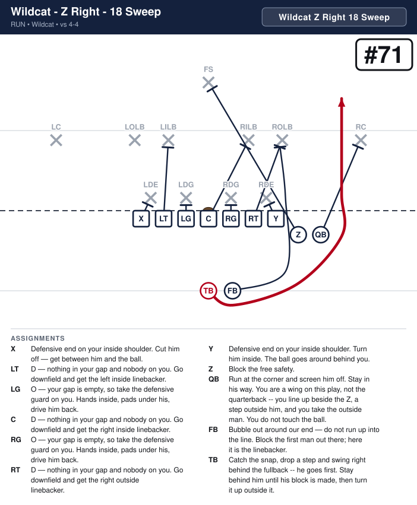
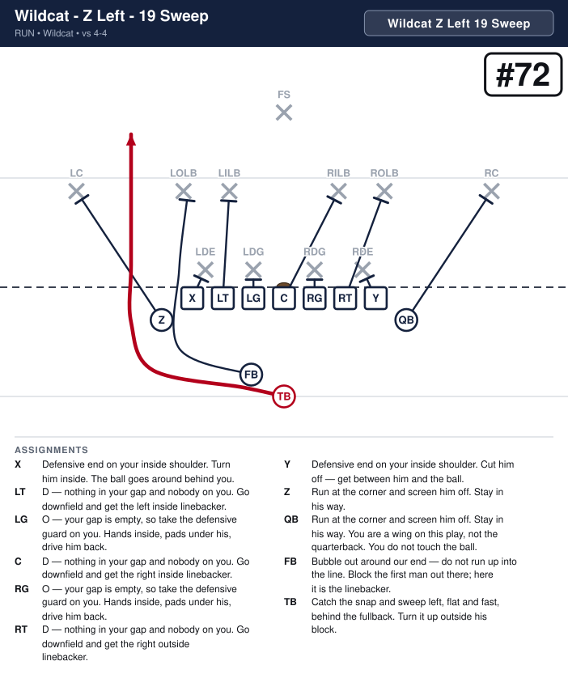

# Wildcat

_Generated by `generator/render.py`. Edit the JSON in `plays/`, not this file._

Seven on the line: the X, the five linemen and the Y, both ends tight. The Z and the quarterback are two wings side by side on the play's side, a yard off the ball -- the Z a step outside the end, the quarterback a step outside the Z -- so the end stays eligible and the line stays seven. The tailback takes the snap five yards deep, straight behind the center, and the fullback stands level with him on the side the play is going, to load the edge. The call says the Z's side, and the fullback and both wings go to it: Z Right is 18 Sweep, Z Left is 19 Sweep. The 1 in the call is whoever takes the snap -- in Wildcat, the tailback.

**Alignment** (yards; x positive to the right, y positive downfield, LOS = 0)

| Position | x | y |
|---|---|---|
| X | -4.2 | -0.5 |
| LT | -2.8 | -0.5 |
| LG | -1.4 | -0.5 |
| C | 0.0 | -0.5 |
| RG | 1.4 | -0.5 |
| RT | 2.8 | -0.5 |
| Y | 4.2 | -0.5 |
| Z | 5.6 | -1.5 |
| QB | 7.0 | -1.5 |
| TB | 0.0 | -5.0 |
| FB | 1.5 | -5.0 |

## Plays

| Play | Call | Scheme | Type | Ball |
|---|---|---|---|---|
| [Wildcat - Z Right - 18 Sweep](#wildcat---z-right---18-sweep) | `Wildcat Z Right 18 Sweep` | Sweep | run | TB |
| [Wildcat - Z Left - 19 Sweep](#wildcat---z-left---19-sweep) | `Wildcat Z Left 19 Sweep` | Sweep | run | TB |

---

## Wildcat - Z Right - 18 Sweep

**Call it:** `Wildcat Z Right 18 Sweep`

**Scheme:** Sweep

| Position | Assignment |
|---|---|
| **X** | Defensive end on your inside shoulder. Cut him off — get between him and the ball. |
| **LT** | D — nothing in your gap and nobody on you. Go downfield and get the left inside linebacker. |
| **LG** | O — your gap is empty, so take the defensive guard on you. Hands inside, pads under his, drive him back. |
| **C** | D — nothing in your gap and nobody on you. Go downfield and get the right inside linebacker. |
| **RG** | O — your gap is empty, so take the defensive guard on you. Hands inside, pads under his, drive him back. |
| **RT** | D — nothing in your gap and nobody on you. Go downfield and get the right outside linebacker. |
| **Y** | Defensive end on your inside shoulder. Turn him inside. The ball goes around behind you. |
| **Z** | Block the free safety. |
| **QB** | Run at the corner and screen him off. Stay in his way. You are a wing on this play, not the quarterback -- you line up beside the Z, a step outside him, and you take the outside man. You do not touch the ball. |
| **FB** | Bubble out around our end — do not run up into the line. Block the first man out there; here it is the linebacker. |
| **TB** **(ball)** | Catch the snap, drop a step and swing right behind the fullback -- he goes first. Stay behind him until his block is made, then turn it up outside it. |

**Coaching points**

- The snap is five yards back to the tailback, not the quarterback. Rep the snap before you rep the play -- a bad snap is the only way this loses yards.
- The fullback loads the edge: he goes first, right, and takes the first man outside our end. The tailback stays behind him until the block is made.
- The quarterback is a wing on this play. He does not touch the ball -- tell him before the snap, and tell the defense nothing.

---

## Wildcat - Z Left - 19 Sweep

**Call it:** `Wildcat Z Left 19 Sweep`

**Scheme:** Sweep

| Position | Assignment |
|---|---|
| **X** | Defensive end on your inside shoulder. Turn him inside. The ball goes around behind you. |
| **LT** | D — nothing in your gap and nobody on you. Go downfield and get the left inside linebacker. |
| **LG** | O — your gap is empty, so take the defensive guard on you. Hands inside, pads under his, drive him back. |
| **C** | D — nothing in your gap and nobody on you. Go downfield and get the right inside linebacker. |
| **RG** | O — your gap is empty, so take the defensive guard on you. Hands inside, pads under his, drive him back. |
| **RT** | D — nothing in your gap and nobody on you. Go downfield and get the right outside linebacker. |
| **Y** | Defensive end on your inside shoulder. Cut him off — get between him and the ball. |
| **Z** | Block the free safety. |
| **QB** | Run at the corner and screen him off. Stay in his way. You are a wing on this play, not the quarterback -- you line up beside the Z, a step outside him, and you take the outside man. You do not touch the ball. |
| **FB** | Bubble out around our end — do not run up into the line. Block the first man out there; here it is the linebacker. |
| **TB** **(ball)** | Catch the snap, drop a step and swing left behind the fullback -- he goes first. Stay behind him until his block is made, then turn it up outside it. |

**Coaching points**

- The snap is five yards back to the tailback, not the quarterback. Rep the snap before you rep the play -- a bad snap is the only way this loses yards.
- The fullback loads the edge: he goes first, left, and takes the first man outside our end. The tailback stays behind him until the block is made.
- The quarterback is a wing on this play. He does not touch the ball -- tell him before the snap, and tell the defense nothing.

