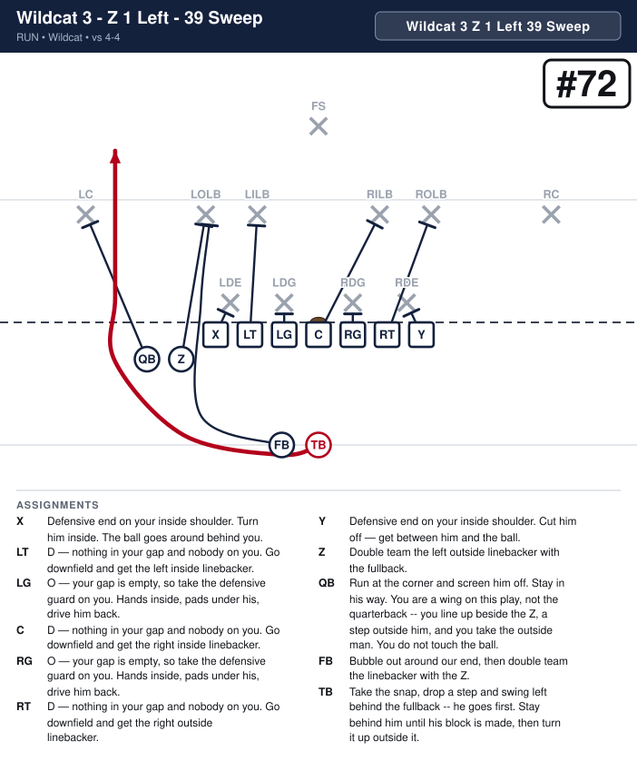
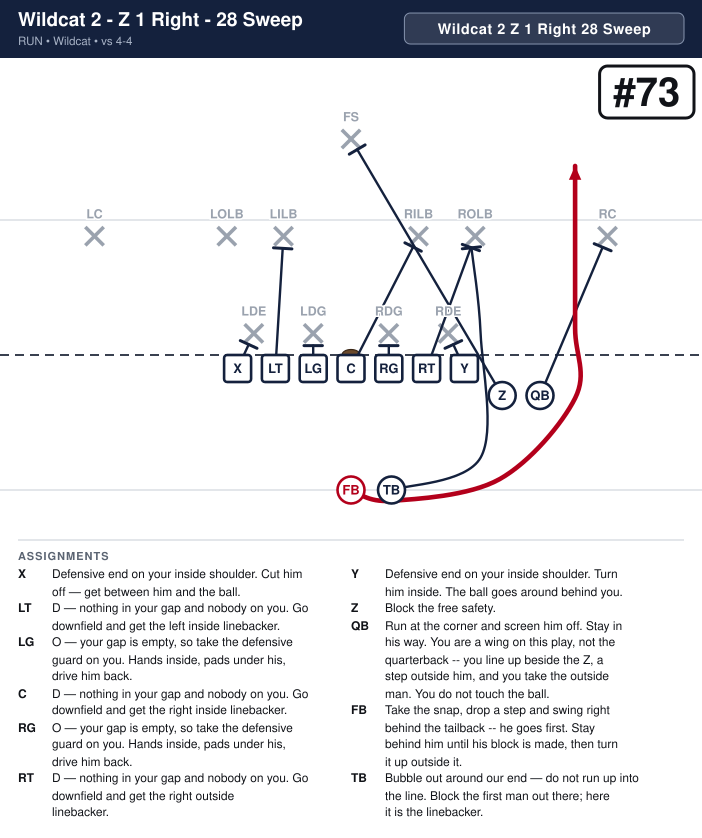
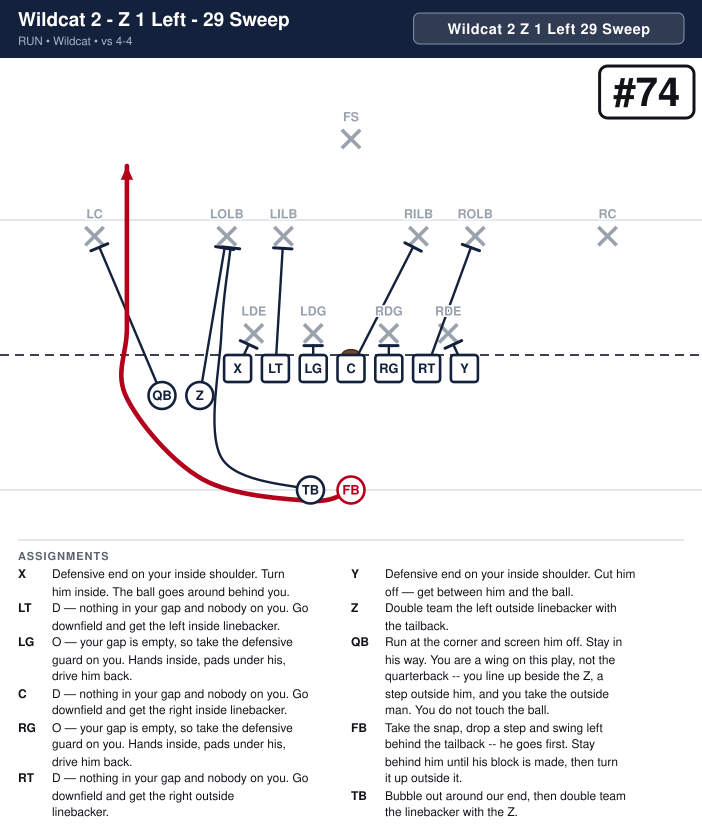
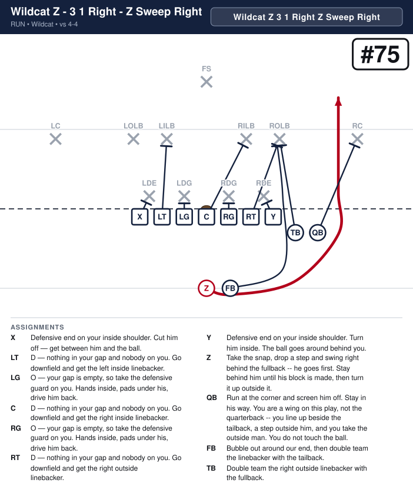
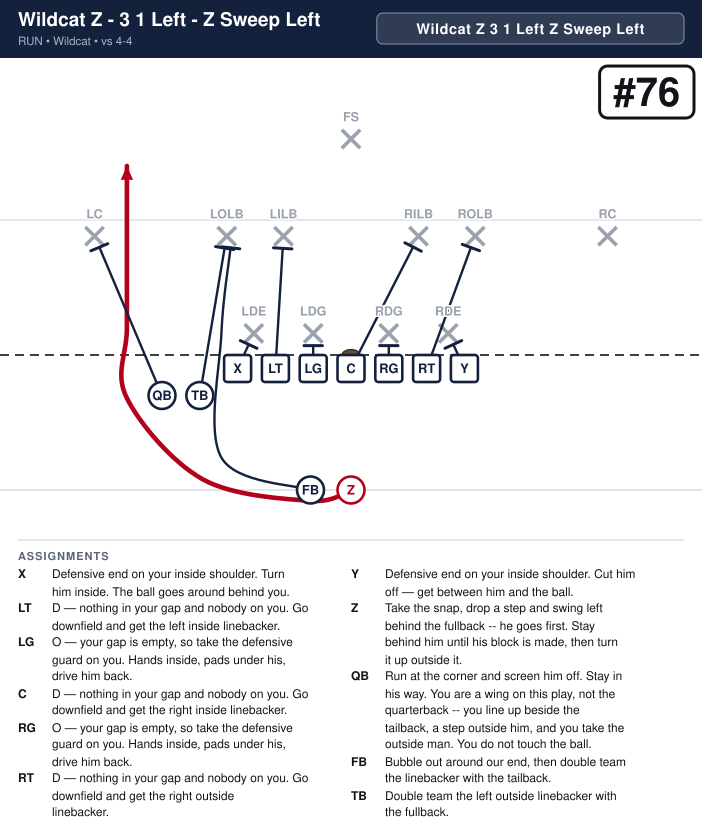

# Wildcat

_Generated by `generator/render.py`. Edit the JSON in `plays/`, not this file._

Seven on the line: the X, the five linemen and the Y, both ends tight. The Z and the quarterback are two wings side by side, a yard off the ball -- the Z a step outside the end, the quarterback a step outside the Z -- so the end stays eligible and the line stays seven. The call is three parts. Wildcat 2, Wildcat 3 or Wildcat Z is who takes the snap: the fullback, the tailback or the Z, five yards deep straight behind the center, with the other back level with him on the play's side to load the edge. Z 1 Right or Z 1 Left is where the Z and the quarterback line up as wings -- or 3 1 Right / 3 1 Left when the Z has the snap and the tailback is the wing beside the quarterback. Then the play: 28 or 29 Sweep for the fullback, 38 or 39 Sweep for the tailback, Z Sweep Right or Left for the Z, always toward the wings.

**Alignment** (yards; x positive to the right, y positive downfield, LOS = 0)

| Position | x | y |
|---|---|---|
| X | -4.2 | -0.5 |
| LT | -2.8 | -0.5 |
| LG | -1.4 | -0.5 |
| C | 0.0 | -0.5 |
| RG | 1.4 | -0.5 |
| RT | 2.8 | -0.5 |
| Y | 4.2 | -0.5 |
| Z | 5.6 | -1.5 |
| QB | 7.0 | -1.5 |
| TB | 0.0 | -5.0 |
| FB | 1.5 | -5.0 |

## Plays

| Play | Call | Scheme | Type | Ball |
|---|---|---|---|---|
| [Wildcat 3 - Z 1 Right - 38 Sweep](#wildcat-3---z-1-right---38-sweep) | `Wildcat 3 Z 1 Right 38 Sweep` | Sweep | run | TB |
| [Wildcat 3 - Z 1 Left - 39 Sweep](#wildcat-3---z-1-left---39-sweep) | `Wildcat 3 Z 1 Left 39 Sweep` | Sweep | run | TB |
| [Wildcat 2 - Z 1 Right - 28 Sweep](#wildcat-2---z-1-right---28-sweep) | `Wildcat 2 Z 1 Right 28 Sweep` | Sweep | run | FB |
| [Wildcat 2 - Z 1 Left - 29 Sweep](#wildcat-2---z-1-left---29-sweep) | `Wildcat 2 Z 1 Left 29 Sweep` | Sweep | run | FB |
| [Wildcat Z - 3 1 Right - Z Sweep Right](#wildcat-z---3-1-right---z-sweep-right) | `Wildcat Z 3 1 Right Z Sweep Right` | Sweep | run | Z |
| [Wildcat Z - 3 1 Left - Z Sweep Left](#wildcat-z---3-1-left---z-sweep-left) | `Wildcat Z 3 1 Left Z Sweep Left` | Sweep | run | Z |

---

## Wildcat 3 - Z 1 Right - 38 Sweep

**Call it:** `Wildcat 3 Z 1 Right 38 Sweep`

**Scheme:** Sweep

| Position | Assignment |
|---|---|
| **X** | Defensive end on your inside shoulder. Cut him off — get between him and the ball. |
| **LT** | D — nothing in your gap and nobody on you. Go downfield and get the left inside linebacker. |
| **LG** | O — your gap is empty, so take the defensive guard on you. Hands inside, pads under his, drive him back. |
| **C** | D — nothing in your gap and nobody on you. Go downfield and get the right inside linebacker. |
| **RG** | O — your gap is empty, so take the defensive guard on you. Hands inside, pads under his, drive him back. |
| **RT** | D — nothing in your gap and nobody on you. Go downfield and get the right outside linebacker. |
| **Y** | Defensive end on your inside shoulder. Turn him inside. The ball goes around behind you. |
| **Z** | Double team the right outside linebacker with the fullback. |
| **QB** | Run at the corner and screen him off. Stay in his way. You are a wing on this play, not the quarterback -- you line up beside the Z, a step outside him, and you take the outside man. You do not touch the ball. |
| **FB** | Bubble out around our end, then double team the linebacker with the Z. |
| **TB** **(ball)** | Take the snap, drop a step and swing right behind the fullback -- he goes first. Stay behind him until his block is made, then turn it up outside it. |

**Coaching points**

- Wildcat 3 is the tailback at the snap, five yards back. Rep the snap before you rep the play -- a bad snap is the only way this loses yards.
- The fullback loads the edge: he goes first, right, and doubles the outside linebacker with the Z. The tailback stays behind them until the block is made.
- The quarterback is a wing beside the Z. He does not touch the ball -- tell him before the snap, and tell the defense nothing.

---

## Wildcat 3 - Z 1 Left - 39 Sweep

**Call it:** `Wildcat 3 Z 1 Left 39 Sweep`

**Scheme:** Sweep

| Position | Assignment |
|---|---|
| **X** | Defensive end on your inside shoulder. Turn him inside. The ball goes around behind you. |
| **LT** | D — nothing in your gap and nobody on you. Go downfield and get the left inside linebacker. |
| **LG** | O — your gap is empty, so take the defensive guard on you. Hands inside, pads under his, drive him back. |
| **C** | D — nothing in your gap and nobody on you. Go downfield and get the right inside linebacker. |
| **RG** | O — your gap is empty, so take the defensive guard on you. Hands inside, pads under his, drive him back. |
| **RT** | D — nothing in your gap and nobody on you. Go downfield and get the right outside linebacker. |
| **Y** | Defensive end on your inside shoulder. Cut him off — get between him and the ball. |
| **Z** | Double team the left outside linebacker with the fullback. |
| **QB** | Run at the corner and screen him off. Stay in his way. You are a wing on this play, not the quarterback -- you line up beside the Z, a step outside him, and you take the outside man. You do not touch the ball. |
| **FB** | Bubble out around our end, then double team the linebacker with the Z. |
| **TB** **(ball)** | Take the snap, drop a step and swing left behind the fullback -- he goes first. Stay behind him until his block is made, then turn it up outside it. |

**Coaching points**

- Wildcat 3 is the tailback at the snap, five yards back. Rep the snap before you rep the play -- a bad snap is the only way this loses yards.
- The fullback loads the edge: he goes first, left, and doubles the outside linebacker with the Z. The tailback stays behind them until the block is made.
- The quarterback is a wing beside the Z. He does not touch the ball -- tell him before the snap, and tell the defense nothing.

---

## Wildcat 2 - Z 1 Right - 28 Sweep

**Call it:** `Wildcat 2 Z 1 Right 28 Sweep`

**Scheme:** Sweep

| Position | Assignment |
|---|---|
| **X** | Defensive end on your inside shoulder. Cut him off — get between him and the ball. |
| **LT** | D — nothing in your gap and nobody on you. Go downfield and get the left inside linebacker. |
| **LG** | O — your gap is empty, so take the defensive guard on you. Hands inside, pads under his, drive him back. |
| **C** | D — nothing in your gap and nobody on you. Go downfield and get the right inside linebacker. |
| **RG** | O — your gap is empty, so take the defensive guard on you. Hands inside, pads under his, drive him back. |
| **RT** | D — nothing in your gap and nobody on you. Go downfield and get the right outside linebacker. |
| **Y** | Defensive end on your inside shoulder. Turn him inside. The ball goes around behind you. |
| **Z** | Double team the right outside linebacker with the tailback. |
| **QB** | Run at the corner and screen him off. Stay in his way. You are a wing on this play, not the quarterback -- you line up beside the Z, a step outside him, and you take the outside man. You do not touch the ball. |
| **FB** **(ball)** | Take the snap, drop a step and swing right behind the tailback -- he goes first. Stay behind him until his block is made, then turn it up outside it. |
| **TB** | Bubble out around our end, then double team the linebacker with the Z. |

**Coaching points**

- Wildcat 2 is the fullback at the snap, five yards back. Rep the snap before you rep the play -- a bad snap is the only way this loses yards.
- The tailback loads the edge: he goes first, right, and doubles the outside linebacker with the Z. The fullback stays behind them until the block is made.
- The quarterback is a wing beside the Z. He does not touch the ball -- tell him before the snap, and tell the defense nothing.

---

## Wildcat 2 - Z 1 Left - 29 Sweep

**Call it:** `Wildcat 2 Z 1 Left 29 Sweep`

**Scheme:** Sweep

| Position | Assignment |
|---|---|
| **X** | Defensive end on your inside shoulder. Turn him inside. The ball goes around behind you. |
| **LT** | D — nothing in your gap and nobody on you. Go downfield and get the left inside linebacker. |
| **LG** | O — your gap is empty, so take the defensive guard on you. Hands inside, pads under his, drive him back. |
| **C** | D — nothing in your gap and nobody on you. Go downfield and get the right inside linebacker. |
| **RG** | O — your gap is empty, so take the defensive guard on you. Hands inside, pads under his, drive him back. |
| **RT** | D — nothing in your gap and nobody on you. Go downfield and get the right outside linebacker. |
| **Y** | Defensive end on your inside shoulder. Cut him off — get between him and the ball. |
| **Z** | Double team the left outside linebacker with the tailback. |
| **QB** | Run at the corner and screen him off. Stay in his way. You are a wing on this play, not the quarterback -- you line up beside the Z, a step outside him, and you take the outside man. You do not touch the ball. |
| **FB** **(ball)** | Take the snap, drop a step and swing left behind the tailback -- he goes first. Stay behind him until his block is made, then turn it up outside it. |
| **TB** | Bubble out around our end, then double team the linebacker with the Z. |

**Coaching points**

- Wildcat 2 is the fullback at the snap, five yards back. Rep the snap before you rep the play -- a bad snap is the only way this loses yards.
- The tailback loads the edge: he goes first, left, and doubles the outside linebacker with the Z. The fullback stays behind them until the block is made.
- The quarterback is a wing beside the Z. He does not touch the ball -- tell him before the snap, and tell the defense nothing.

---

## Wildcat Z - 3 1 Right - Z Sweep Right

**Call it:** `Wildcat Z 3 1 Right Z Sweep Right`

**Scheme:** Sweep

| Position | Assignment |
|---|---|
| **X** | Defensive end on your inside shoulder. Cut him off — get between him and the ball. |
| **LT** | D — nothing in your gap and nobody on you. Go downfield and get the left inside linebacker. |
| **LG** | O — your gap is empty, so take the defensive guard on you. Hands inside, pads under his, drive him back. |
| **C** | D — nothing in your gap and nobody on you. Go downfield and get the right inside linebacker. |
| **RG** | O — your gap is empty, so take the defensive guard on you. Hands inside, pads under his, drive him back. |
| **RT** | D — nothing in your gap and nobody on you. Go downfield and get the right outside linebacker. |
| **Y** | Defensive end on your inside shoulder. Turn him inside. The ball goes around behind you. |
| **Z** **(ball)** | Take the snap, drop a step and swing right behind the fullback -- he goes first. Stay behind him until his block is made, then turn it up outside it. |
| **QB** | Run at the corner and screen him off. Stay in his way. You are a wing on this play, not the quarterback -- you line up beside the tailback, a step outside him, and you take the outside man. You do not touch the ball. |
| **FB** | Bubble out around our end, then double team the linebacker with the tailback. |
| **TB** | Double team the right outside linebacker with the fullback. |

**Coaching points**

- Wildcat Z is the Z at the snap, five yards back. Rep the snap before you rep the play -- a bad snap is the only way this loses yards.
- The fullback loads the edge: he goes first, right, and doubles the outside linebacker with the tailback. The Z stays behind them until the block is made.
- The tailback and the quarterback are the wings. Neither touches the ball -- tell them before the snap, and tell the defense nothing.

---

## Wildcat Z - 3 1 Left - Z Sweep Left

**Call it:** `Wildcat Z 3 1 Left Z Sweep Left`

**Scheme:** Sweep

| Position | Assignment |
|---|---|
| **X** | Defensive end on your inside shoulder. Turn him inside. The ball goes around behind you. |
| **LT** | D — nothing in your gap and nobody on you. Go downfield and get the left inside linebacker. |
| **LG** | O — your gap is empty, so take the defensive guard on you. Hands inside, pads under his, drive him back. |
| **C** | D — nothing in your gap and nobody on you. Go downfield and get the right inside linebacker. |
| **RG** | O — your gap is empty, so take the defensive guard on you. Hands inside, pads under his, drive him back. |
| **RT** | D — nothing in your gap and nobody on you. Go downfield and get the right outside linebacker. |
| **Y** | Defensive end on your inside shoulder. Cut him off — get between him and the ball. |
| **Z** **(ball)** | Take the snap, drop a step and swing left behind the fullback -- he goes first. Stay behind him until his block is made, then turn it up outside it. |
| **QB** | Run at the corner and screen him off. Stay in his way. You are a wing on this play, not the quarterback -- you line up beside the tailback, a step outside him, and you take the outside man. You do not touch the ball. |
| **FB** | Bubble out around our end, then double team the linebacker with the tailback. |
| **TB** | Double team the left outside linebacker with the fullback. |

**Coaching points**

- Wildcat Z is the Z at the snap, five yards back. Rep the snap before you rep the play -- a bad snap is the only way this loses yards.
- The fullback loads the edge: he goes first, left, and doubles the outside linebacker with the tailback. The Z stays behind them until the block is made.
- The tailback and the quarterback are the wings. Neither touches the ball -- tell them before the snap, and tell the defense nothing.

