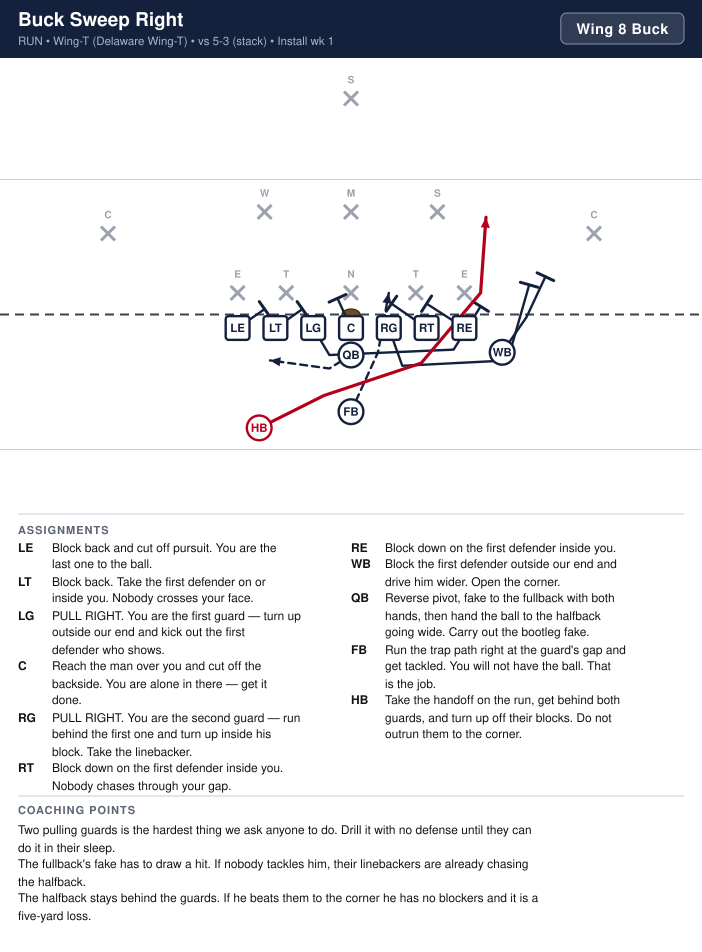
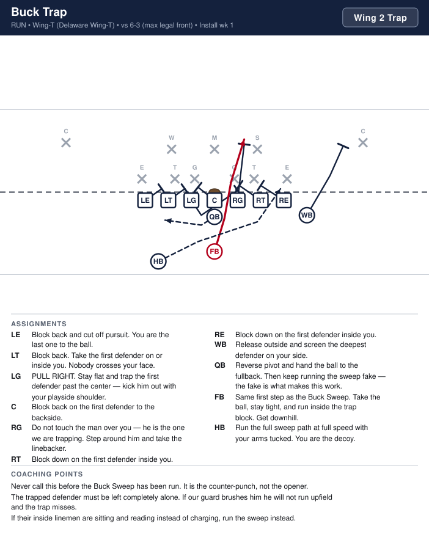
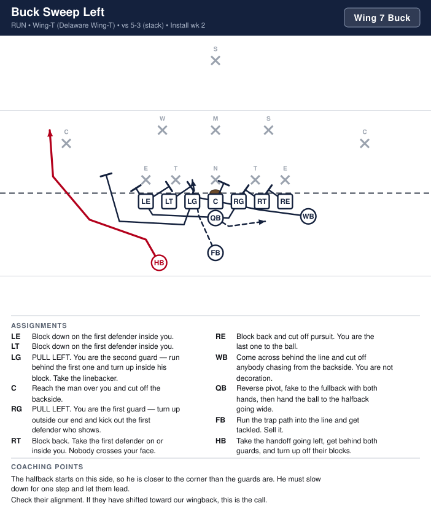
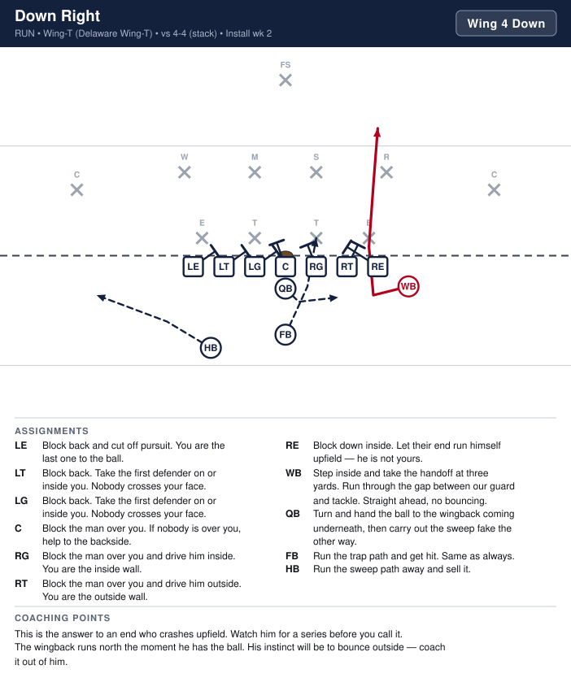
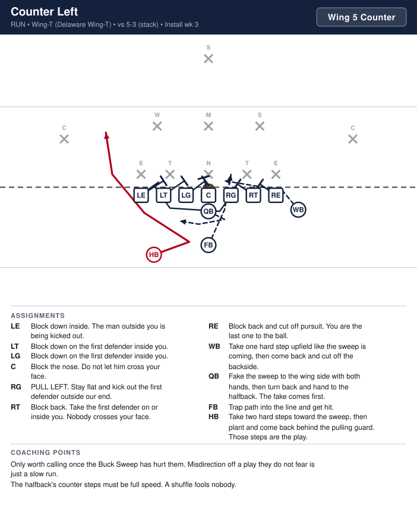
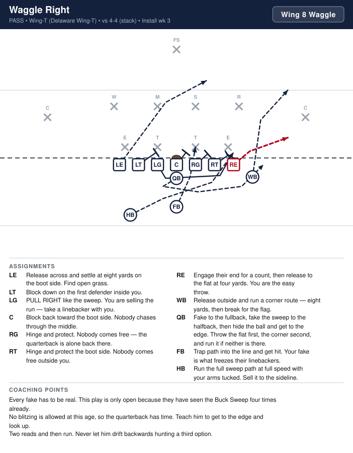

# Wing-T — Delaware Wing-T

_Generated by `generator/render.py`. Edit the JSON in `plays/`, not this file._

Normal line splits. Both ends are ON the line. The wingback is OFF the line, one yard outside and one yard behind the right end. The fullback is directly behind the quarterback at three and a half yards and the halfback is offset to the left. Every play in this section starts with the same backfield motion, which is the entire point of the offense.

**Alignment** (yards; x positive to the right, y positive downfield, LOS = 0)

| Position | x | y |
|---|---|---|
| LE | -4.2 | -0.5 |
| LT | -2.8 | -0.5 |
| LG | -1.4 | -0.5 |
| C | 0.0 | -0.5 |
| RG | 1.4 | -0.5 |
| RT | 2.8 | -0.5 |
| RE | 4.2 | -0.5 |
| WB | 5.6 | -1.4 |
| QB | 0.0 | -1.5 |
| FB | 0.0 | -3.6 |
| HB | -3.4 | -4.2 |

**Formation coaching notes**

- The Wing-T is a series offense, not a collection of plays. Buck Sweep, Trap and Waggle all start identically — if a kid can tell them apart in the first second, we are running them wrong.
- The fullback's fake into the line is the engine. On plays where he does not have the ball he must still get hit. Tell him that is the job.
- The wingback is always to the right. Strong right every snap means nobody lines up wrong.
- Both guards pull on the Buck Sweep. That is the hardest thing in this section — if the guards cannot pull, run the I-Formation instead.
- Count seven on the line every snap. The wingback drifting up is the flag you will get out of this look.

## Plays

| Play | Call | Type | Ball | Install |
|---|---|---|---|---|
| [Buck Sweep Right](#buck-sweep-right) | `Wing 8 Buck` | run | HB | Week 1 |
| [Buck Trap](#buck-trap) | `Wing 2 Trap` | run | FB | Week 1 |
| [Buck Sweep Left](#buck-sweep-left) | `Wing 7 Buck` | run | HB | Week 2 |
| [Down Right](#down-right) | `Wing 4 Down` | run | WB | Week 2 |
| [Counter Left](#counter-left) | `Wing 5 Counter` | run | HB | Week 3 |
| [Waggle Right](#waggle-right) | `Wing 8 Waggle` | pass | RE | Week 3 |

---

## Buck Sweep Right

**Call it:** `Wing 8 Buck`

The play the whole offense is built on. Both guards pull, the fullback fakes the trap into the line, and the halfback runs behind the guards around the end. Everything else in this section is a lie told off this picture.

| Position | Assignment |
|---|---|
| **LE** | Block back and cut off pursuit. You are the last one to the ball. |
| **LT** | Block back. Take the first defender on or inside you. Nobody crosses your face. |
| **LG** | PULL RIGHT. You are the first guard — turn up outside our end and kick out the first defender who shows. |
| **C** | Reach the man over you and cut off the backside. You are alone in there — get it done. |
| **RG** | PULL RIGHT. You are the second guard — run behind the first one and turn up inside his block. Take the linebacker. |
| **RT** | Block down on the first defender inside you. Nobody chases through your gap. |
| **RE** | Block down on the first defender inside you. |
| **WB** | Block the first defender outside our end and drive him wider. Open the corner. |
| **QB** | Reverse pivot, fake to the fullback with both hands, then hand the ball to the halfback going wide. Carry out the bootleg fake. |
| **FB** | Run the trap path right at the guard's gap and get tackled. You will not have the ball. That is the job. |
| **HB** **(ball)** | Take the handoff on the run, get behind both guards, and turn up off their blocks. Do not outrun them to the corner. |

**Coaching points**

- Two pulling guards is the hardest thing we ask anyone to do. Drill it with no defense until they can do it in their sleep.
- The fullback's fake has to draw a hit. If nobody tackles him, their linebackers are already chasing the halfback.
- The halfback stays behind the guards. If he beats them to the corner he has no blockers and it is a five-yard loss.

---

## Buck Trap

**Call it:** `Wing 2 Trap`

The fullback keeps the ball on the exact play he fakes on the Buck Sweep. Their linebackers have started chasing the sweep, so the middle is empty. Identical first step, opposite result.

| Position | Assignment |
|---|---|
| **LE** | Block back and cut off pursuit. You are the last one to the ball. |
| **LT** | Block back. Take the first defender on or inside you. Nobody crosses your face. |
| **LG** | PULL RIGHT. Stay flat and trap the first defender past the center — kick him out with your playside shoulder. |
| **C** | Block back on the first defender to the backside. |
| **RG** | Do not touch the man over you — he is the one we are trapping. Step around him and take the linebacker. |
| **RT** | Block down on the first defender inside you. |
| **RE** | Block down on the first defender inside you. |
| **WB** | Release outside and screen the deepest defender on your side. |
| **QB** | Reverse pivot and hand the ball to the fullback. Then keep running the sweep fake — the fake is what makes this work. |
| **FB** **(ball)** | Same first step as the Buck Sweep. Take the ball, stay tight, and run inside the trap block. Get downhill. |
| **HB** | Run the full sweep path at full speed with your arms tucked. You are the decoy. |

**Coaching points**

- Never call this before the Buck Sweep has been run. It is the counter-punch, not the opener.
- The trapped defender must be left completely alone. If our guard brushes him he will not run upfield and the trap misses.
- If their inside linemen are sitting and reading instead of charging, run the sweep instead.

---

## Buck Sweep Left

**Call it:** `Wing 7 Buck`

The same buck sweep run away from the wingback. There is one fewer blocker out there, so the guards have to be perfect — but their defense is usually leaning toward our wing.

| Position | Assignment |
|---|---|
| **LE** | Block down on the first defender inside you. |
| **LT** | Block down on the first defender inside you. |
| **LG** | PULL LEFT. You are the second guard — run behind the first one and turn up inside his block. Take the linebacker. |
| **C** | Reach the man over you and cut off the backside. |
| **RG** | PULL LEFT. You are the first guard — turn up outside our end and kick out the first defender who shows. |
| **RT** | Block back. Take the first defender on or inside you. Nobody crosses your face. |
| **RE** | Block back and cut off pursuit. You are the last one to the ball. |
| **WB** | Come across behind the line and cut off anybody chasing from the backside. You are not decoration. |
| **QB** | Reverse pivot, fake to the fullback with both hands, then hand the ball to the halfback going wide. |
| **FB** | Run the trap path into the line and get tackled. Sell it. |
| **HB** **(ball)** | Take the handoff going left, get behind both guards, and turn up off their blocks. |

**Coaching points**

- The halfback starts on this side, so he is closer to the corner than the guards are. He must slow down for one step and let them lead.
- Check their alignment. If they have shifted toward our wingback, this is the call.

---

## Down Right

**Call it:** `Wing 4 Down`

The wingback runs inside off the same backfield action. When their end starts flying upfield to beat the sweep, this hits right behind him.

| Position | Assignment |
|---|---|
| **LE** | Block back and cut off pursuit. You are the last one to the ball. |
| **LT** | Block back. Take the first defender on or inside you. Nobody crosses your face. |
| **LG** | Block back. Take the first defender on or inside you. Nobody crosses your face. |
| **C** | Block the man over you. If nobody is over you, help to the backside. |
| **RG** | Block the man over you and drive him inside. You are the inside wall. |
| **RT** | Block the man over you and drive him outside. You are the outside wall. |
| **RE** | Block down inside. Let their end run himself upfield — he is not yours. |
| **WB** **(ball)** | Step inside and take the handoff at three yards. Run through the gap between our guard and tackle. Straight ahead, no bouncing. |
| **QB** | Turn and hand the ball to the wingback coming underneath, then carry out the sweep fake the other way. |
| **FB** | Run the trap path and get hit. Same as always. |
| **HB** | Run the sweep path away and sell it. |

**Coaching points**

- This is the answer to an end who crashes upfield. Watch him for a series before you call it.
- The wingback runs north the moment he has the ball. His instinct will be to bounce outside — coach it out of him.

---

## Counter Left

**Call it:** `Wing 5 Counter`

Buck sweep action to the wing side, then the halfback plants and comes back the other way. This is the play that punishes a defense that has learned to chase our guards.

| Position | Assignment |
|---|---|
| **LE** | Block down inside. The man outside you is being kicked out. |
| **LT** | Block down on the first defender inside you. |
| **LG** | Block down on the first defender inside you. |
| **C** | Block the nose. Do not let him cross your face. |
| **RG** | PULL LEFT. Stay flat and kick out the first defender outside our end. |
| **RT** | Block back. Take the first defender on or inside you. Nobody crosses your face. |
| **RE** | Block back and cut off pursuit. You are the last one to the ball. |
| **WB** | Take one hard step upfield like the sweep is coming, then come back and cut off the backside. |
| **QB** | Fake the sweep to the wing side with both hands, then turn back and hand to the halfback. The fake comes first. |
| **FB** | Trap path into the line and get hit. |
| **HB** **(ball)** | Take two hard steps toward the sweep, then plant and come back behind the pulling guard. Those steps are the play. |

**Coaching points**

- Only worth calling once the Buck Sweep has hurt them. Misdirection off a play they do not fear is just a slow run.
- The halfback's counter steps must be full speed. A shuffle fools nobody.

---

## Waggle Right

**Call it:** `Wing 8 Waggle`

The pass off the Buck Sweep. Guards pull, fullback fakes, halfback runs the sweep — and the quarterback keeps it and comes out the back door with two receivers. In the Wing-T this is the play that scores.

| Position | Assignment |
|---|---|
| **LE** | Release across and settle at eight yards on the boot side. Find open grass. |
| **LT** | Block down on the first defender inside you. |
| **LG** | PULL RIGHT like the sweep. You are selling the run — take a linebacker with you. |
| **C** | Block back toward the boot side. Nobody chases through the middle. |
| **RG** | Hinge and protect. Nobody comes free — the quarterback is alone back there. |
| **RT** | Hinge and protect the boot side. Nobody comes free outside you. |
| **RE** **(ball)** | Engage their end for a count, then release to the flat at four yards. You are the easy throw. |
| **WB** | Release outside and run a corner route — eight yards, then break for the flag. |
| **QB** | Fake to the fullback, fake the sweep to the halfback, then hide the ball and get to the edge. Throw the flat first, the corner second, and run it if neither is there. |
| **FB** | Trap path into the line and get hit. Your fake is what freezes their linebackers. |
| **HB** | Run the full sweep path at full speed with your arms tucked. Sell it to the sideline. |

**Coaching points**

- Every fake has to be real. This play is only open because they have seen the Buck Sweep four times already.
- No blitzing is allowed at this age, so the quarterback has time. Teach him to get to the edge and look up.
- Two reads and then run. Never let him drift backwards hunting a third option.

