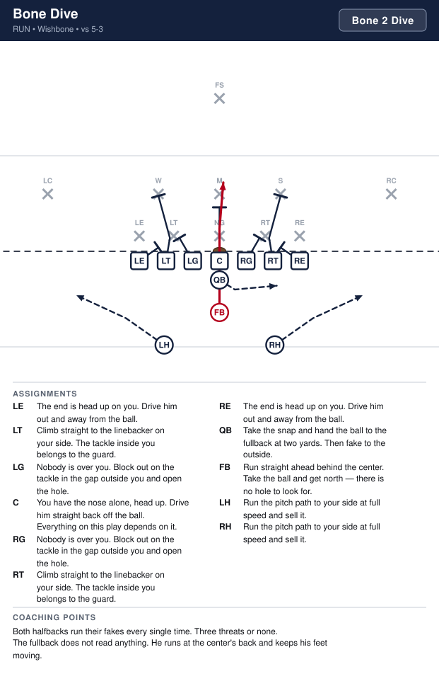
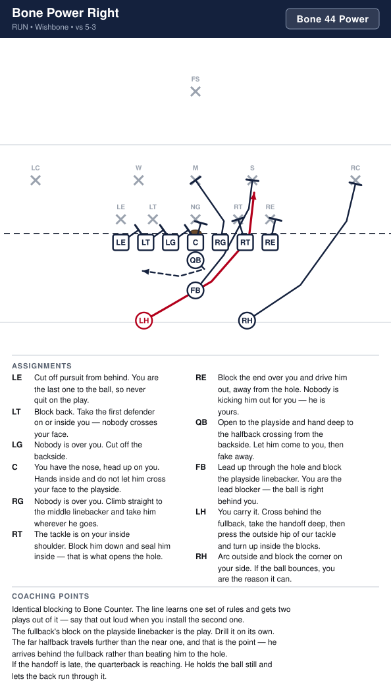
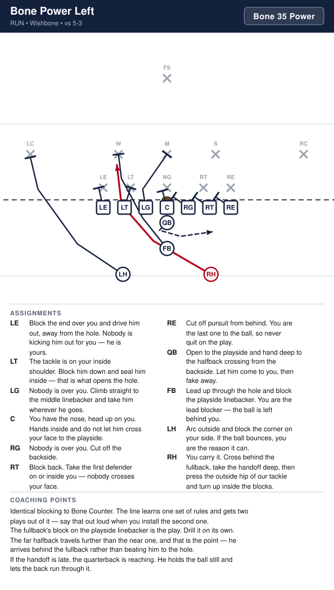
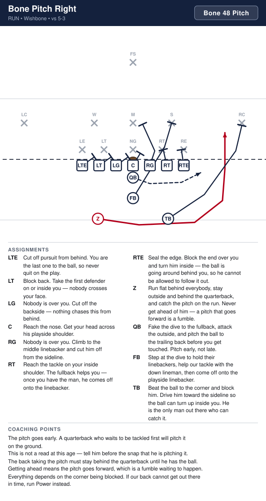
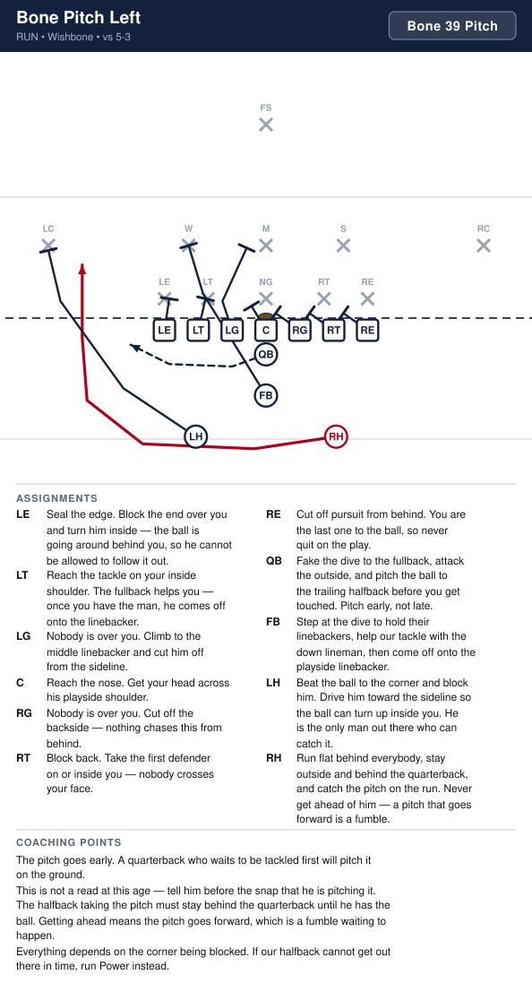
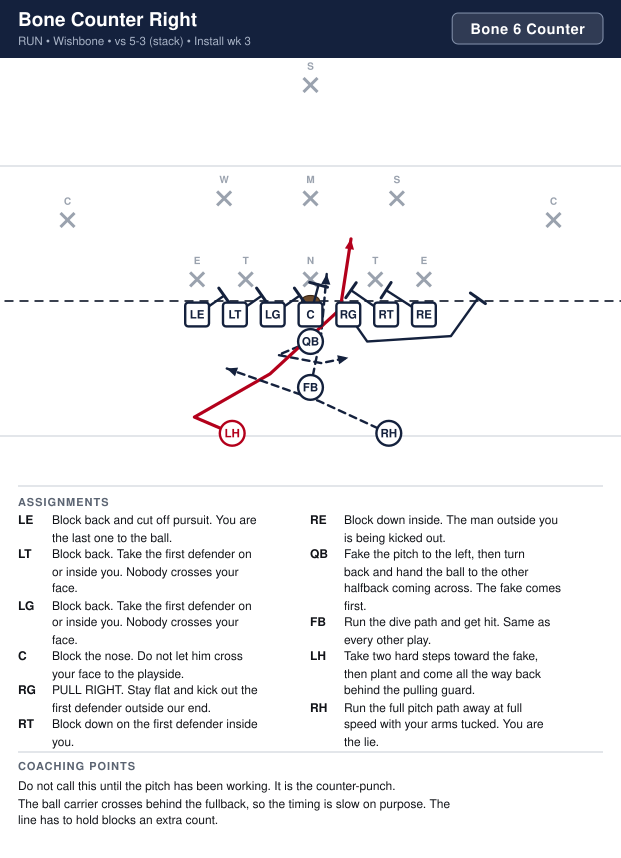
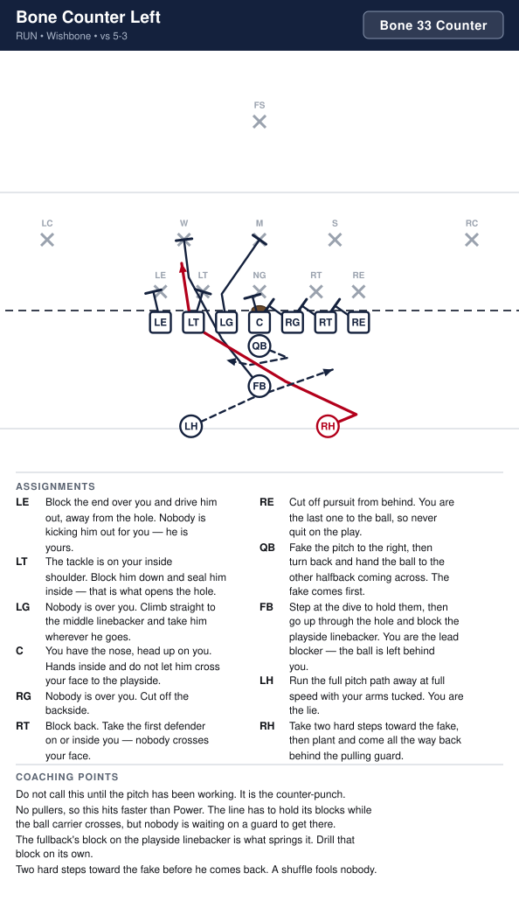

# Wishbone

_Generated by `generator/render.py`. Edit the JSON in `plays/`, not this file._

Three backs in a Y behind the quarterback: fullback close at three yards, then two halfbacks split wider and deeper. Both ends are tight and on the line. The formation is perfectly symmetric, so every play has a left and a right version with identical rules.

**Alignment** (yards; x positive to the right, y positive downfield, LOS = 0)

| Position | x | y |
|---|---|---|
| LE | -4.2 | -0.5 |
| LT | -2.8 | -0.5 |
| LG | -1.4 | -0.5 |
| C | 0.0 | -0.5 |
| RG | 1.4 | -0.5 |
| RT | 2.8 | -0.5 |
| RE | 4.2 | -0.5 |
| QB | 0.0 | -1.5 |
| FB | 0.0 | -3.2 |
| LH | -2.9 | -4.9 |
| RH | 2.9 | -4.9 |

**Formation coaching notes**

- Three backs means three threats on every snap, and the defense has to be right about all three. That is the whole idea.
- The fullback is the hammer. If they ever stop respecting him up the middle, everything else stops working.
- Symmetric formation, symmetric rules — the kids learn one play and get two.
- We do not run a true read option at this age. The quarterback is told before the snap who gets the ball.

## Plays

| Play | Call | Type | Ball |
|---|---|---|---|
| [Bone Dive](#bone-dive) | `Bone 2 Dive` | run | FB |
| [Bone Power Right](#bone-power-right) | `Bone 6 Power` | run | LH |
| [Bone Power Left](#bone-power-left) | `Bone 5 Power` | run | RH |
| [Bone Pitch Right](#bone-pitch-right) | `Bone 8 Pitch` | run | RH |
| [Bone Pitch Left](#bone-pitch-left) | `Bone 7 Pitch` | run | LH |
| [Bone Counter Right](#bone-counter-right) | `Bone 6 Counter` | run | LH |
| [Bone Counter Left](#bone-counter-left) | `Bone 5 Counter` | run | RH |

---

## Bone Dive

**Call it:** `Bone 2 Dive`

The fullback straight up the middle, right now. This is the play that has to work before anything else in the formation does — it is what holds their linebackers inside.

| Position | Assignment |
|---|---|
| **LE** | The end is head up on you. Drive him out and away from the ball. |
| **LT** | Climb straight to the linebacker on your side. The tackle inside you belongs to the guard. |
| **LG** | Nobody is over you. Block out on the tackle in the gap outside you and open the hole. |
| **C** | You have the nose alone, head up. Drive him straight back off the ball. Everything on this play depends on it. |
| **RG** | Nobody is over you. Block out on the tackle in the gap outside you and open the hole. |
| **RT** | Climb straight to the linebacker on your side. The tackle inside you belongs to the guard. |
| **RE** | The end is head up on you. Drive him out and away from the ball. |
| **QB** | Take the snap and hand the ball to the fullback at two yards. Then fake to the outside. |
| **FB** **(ball)** | Run straight ahead behind the center. Take the ball and get north — there is no hole to look for. |
| **LH** | Run the pitch path to your side at full speed and sell it. |
| **RH** | Run the pitch path to your side at full speed and sell it. |

**Coaching points**

- Both halfbacks run their fakes every single time. Three threats or none.
- The fullback does not read anything. He runs at the center's back and keeps his feet moving.

---

## Bone Power Right

**Call it:** `Bone 6 Power`

Off-tackle power, but the ball goes to the far halfback. He crosses behind the fullback and takes a deep handoff, which puts him behind the pulling guard with a full head of steam and gives their linebackers an extra beat of doubt about who has it. The near halfback leads and the fullback kicks out.

| Position | Assignment |
|---|---|
| **LE** | Cut off pursuit from behind. You are the last one to the ball, so never quit on the play. |
| **LT** | Block back. Take the first defender on or inside you — nobody crosses your face. |
| **LG** | PULL RIGHT. Run flat behind the line and turn up in the open gap between our tackle and our end. Take the first wrong-colored jersey. |
| **C** | You have the nose, head up on you. Hands inside and do not let him cross your face to the playside. |
| **RG** | Nobody is over you. Help the center drive the nose for one count, then climb to the middle linebacker. |
| **RT** | The tackle is on your inside shoulder. Block him down and seal him inside — that is what opens the hole. |
| **RE** | Release inside off his outside shoulder and take the playside linebacker. The end over you is being kicked out — leave him alone. |
| **QB** | Open to the playside and hand deep to the halfback crossing from the backside. Let him come to you, then fake away. |
| **FB** | Kick out the end. Aim at his inside hip and run through him. |
| **LH** **(ball)** | You carry it. Cross behind the fullback, take the handoff deep, then press the outside hip of our tackle and turn up inside the blocks. |
| **RH** | Lead through the hole ahead of the ball. Take the first jersey inside the kick-out. |

**Coaching points**

- The far halfback travels further than the near one, and that is the point — he arrives behind the pulling guard instead of beating him to the hole.
- Two lead blockers and a pulling guard arrive in the same place. Walk it through slowly first or they will run into each other.
- If the handoff is late, the quarterback is reaching. He holds the ball still and lets the back run through it.

---

## Bone Power Left

**Call it:** `Bone 5 Power`

Off-tackle power, but the ball goes to the far halfback. He crosses behind the fullback and takes a deep handoff, which puts him behind the pulling guard with a full head of steam and gives their linebackers an extra beat of doubt about who has it. The near halfback leads and the fullback kicks out.

| Position | Assignment |
|---|---|
| **LE** | Release inside off his outside shoulder and take the playside linebacker. The end over you is being kicked out — leave him alone. |
| **LT** | The tackle is on your inside shoulder. Block him down and seal him inside — that is what opens the hole. |
| **LG** | Nobody is over you. Help the center drive the nose for one count, then climb to the middle linebacker. |
| **C** | You have the nose, head up on you. Hands inside and do not let him cross your face to the playside. |
| **RG** | PULL LEFT. Run flat behind the line and turn up in the open gap between our tackle and our end. Take the first wrong-colored jersey. |
| **RT** | Block back. Take the first defender on or inside you — nobody crosses your face. |
| **RE** | Cut off pursuit from behind. You are the last one to the ball, so never quit on the play. |
| **QB** | Open to the playside and hand deep to the halfback crossing from the backside. Let him come to you, then fake away. |
| **FB** | Kick out the end. Aim at his inside hip and run through him. |
| **LH** | Lead through the hole ahead of the ball. Take the first jersey inside the kick-out. |
| **RH** **(ball)** | You carry it. Cross behind the fullback, take the handoff deep, then press the outside hip of our tackle and turn up inside the blocks. |

**Coaching points**

- The far halfback travels further than the near one, and that is the point — he arrives behind the pulling guard instead of beating him to the hole.
- Two lead blockers and a pulling guard arrive in the same place. Walk it through slowly first or they will run into each other.
- If the handoff is late, the quarterback is reaching. He holds the ball still and lets the back run through it.

---

## Bone Pitch Right

**Call it:** `Bone 8 Pitch`

Get outside in a hurry. The fullback dives to hold the middle, the quarterback attacks the edge and pitches. Against a defense that has crowded the box to stop the dive, this is where the yards are.

| Position | Assignment |
|---|---|
| **LE** | Cut off pursuit from behind. You are the last one to the ball, so never quit on the play. |
| **LT** | Block back. Take the first defender on or inside you — nobody crosses your face. |
| **LG** | Nobody is over you. Cut off the backside — nothing chases this from behind. |
| **C** | Reach the nose. Get your head across his playside shoulder. |
| **RG** | Nobody is over you. Climb to the middle linebacker and cut him off from the sideline. |
| **RT** | The tackle is on your inside shoulder. Get your head across him and wall him off so he cannot chase. |
| **RE** | Release outside and block the deepest defender on your side. |
| **QB** | Fake the dive to the fullback, attack the outside, and pitch the ball to the halfback before you get touched. Pitch early, not late. |
| **FB** | Run the dive path and get tackled. Your fake is what keeps their linebackers inside. |
| **LH** | Run behind the quarterback and get to the corner ahead of the ball. Kick out the first defender who shows. |
| **RH** **(ball)** | Stay outside and behind the quarterback, catch the pitch on the run, and get to the corner. Never stop your feet. |

**Coaching points**

- The pitch goes early. A quarterback who waits to be tackled first will pitch it on the ground.
- This is not a read at this age — tell him before the snap that he is pitching it.
- The halfback must stay behind the quarterback until he has the ball. Getting ahead means the pitch goes forward, which is a fumble waiting to happen.

---

## Bone Pitch Left

**Call it:** `Bone 7 Pitch`

Get outside in a hurry. The fullback dives to hold the middle, the quarterback attacks the edge and pitches. Against a defense that has crowded the box to stop the dive, this is where the yards are.

| Position | Assignment |
|---|---|
| **LE** | Release outside and block the deepest defender on your side. |
| **LT** | The tackle is on your inside shoulder. Get your head across him and wall him off so he cannot chase. |
| **LG** | Nobody is over you. Climb to the middle linebacker and cut him off from the sideline. |
| **C** | Reach the nose. Get your head across his playside shoulder. |
| **RG** | Nobody is over you. Cut off the backside — nothing chases this from behind. |
| **RT** | Block back. Take the first defender on or inside you — nobody crosses your face. |
| **RE** | Cut off pursuit from behind. You are the last one to the ball, so never quit on the play. |
| **QB** | Fake the dive to the fullback, attack the outside, and pitch the ball to the halfback before you get touched. Pitch early, not late. |
| **FB** | Run the dive path and get tackled. Your fake is what keeps their linebackers inside. |
| **LH** **(ball)** | Stay outside and behind the quarterback, catch the pitch on the run, and get to the corner. Never stop your feet. |
| **RH** | Run behind the quarterback and get to the corner ahead of the ball. Kick out the first defender who shows. |

**Coaching points**

- The pitch goes early. A quarterback who waits to be tackled first will pitch it on the ground.
- This is not a read at this age — tell him before the snap that he is pitching it.
- The halfback must stay behind the quarterback until he has the ball. Getting ahead means the pitch goes forward, which is a fumble waiting to happen.

---

## Bone Counter Right

**Call it:** `Bone 6 Counter`

Everything goes one way and the backside halfback comes back the other. With three backs moving, this is the hardest play in the book for an eight-year-old defense to sort out.

| Position | Assignment |
|---|---|
| **LE** | Cut off pursuit from behind. You are the last one to the ball, so never quit on the play. |
| **LT** | Block back. Take the first defender on or inside you — nobody crosses your face. |
| **LG** | Nobody is over you. Cut off the backside. |
| **C** | You have the nose, head up on you. Hands inside and do not let him cross your face to the playside. |
| **RG** | PULL RIGHT. Stay flat and kick out the end on the playside. |
| **RT** | The tackle is on your inside shoulder. Block him down and seal him inside — that is what opens the hole. |
| **RE** | Release inside off his outside shoulder and take the playside linebacker. The end over you is being kicked out — leave him alone. |
| **QB** | Fake the pitch to the left, then turn back and hand the ball to the other halfback coming across. The fake comes first. |
| **FB** | Run the dive path and get hit. Same as every other play. |
| **LH** **(ball)** | Take two hard steps toward the fake, then plant and come all the way back behind the pulling guard. |
| **RH** | Run the full pitch path away at full speed with your arms tucked. You are the lie. |

**Coaching points**

- Do not call this until the pitch has been working. It is the counter-punch.
- The ball carrier crosses behind the fullback, so the timing is slow on purpose. The line has to hold blocks an extra count.

---

## Bone Counter Left

**Call it:** `Bone 5 Counter`

Everything goes one way and the backside halfback comes back the other. With three backs moving, this is the hardest play in the book for an eight-year-old defense to sort out.

| Position | Assignment |
|---|---|
| **LE** | Release inside off his outside shoulder and take the playside linebacker. The end over you is being kicked out — leave him alone. |
| **LT** | The tackle is on your inside shoulder. Block him down and seal him inside — that is what opens the hole. |
| **LG** | PULL LEFT. Stay flat and kick out the end on the playside. |
| **C** | You have the nose, head up on you. Hands inside and do not let him cross your face to the playside. |
| **RG** | Nobody is over you. Cut off the backside. |
| **RT** | Block back. Take the first defender on or inside you — nobody crosses your face. |
| **RE** | Cut off pursuit from behind. You are the last one to the ball, so never quit on the play. |
| **QB** | Fake the pitch to the right, then turn back and hand the ball to the other halfback coming across. The fake comes first. |
| **FB** | Run the dive path and get hit. Same as every other play. |
| **LH** | Run the full pitch path away at full speed with your arms tucked. You are the lie. |
| **RH** **(ball)** | Take two hard steps toward the fake, then plant and come all the way back behind the pulling guard. |

**Coaching points**

- Do not call this until the pitch has been working. It is the counter-punch.
- The ball carrier crosses behind the fullback, so the timing is slow on purpose. The line has to hold blocks an extra count.

