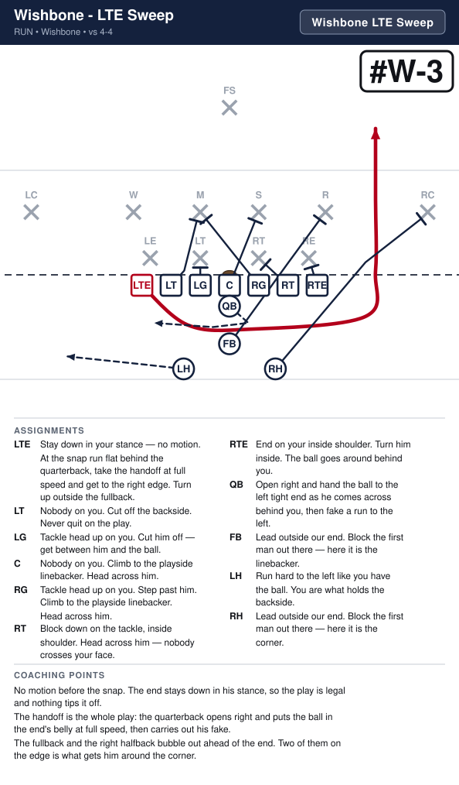
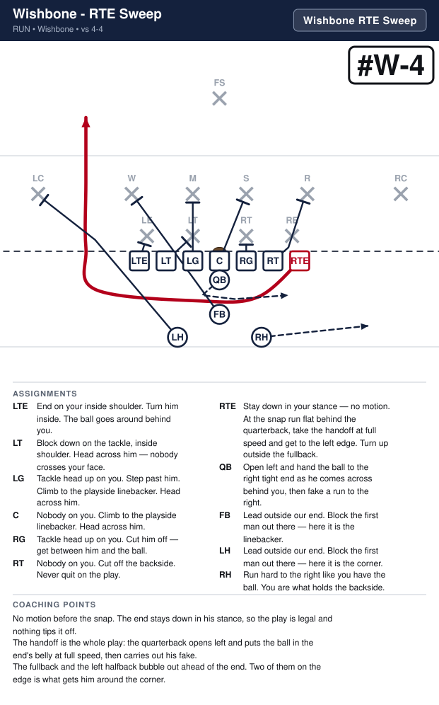
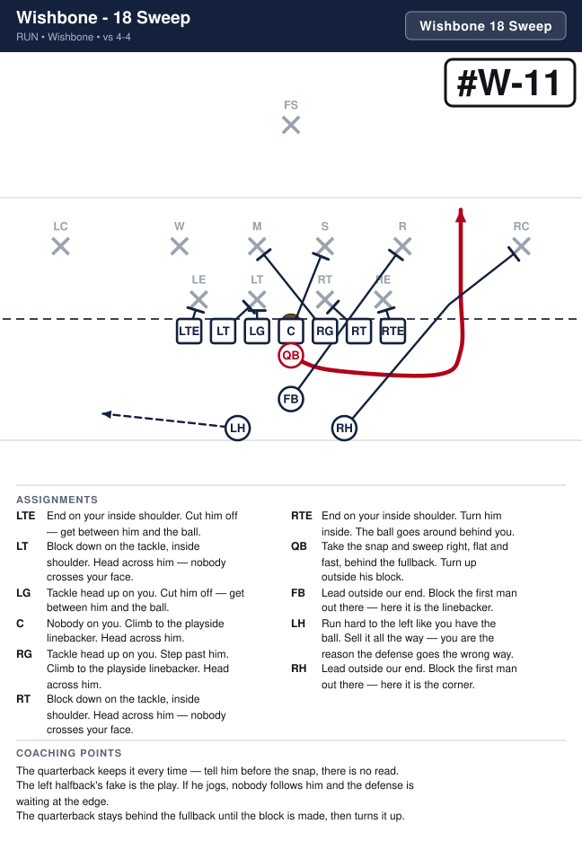
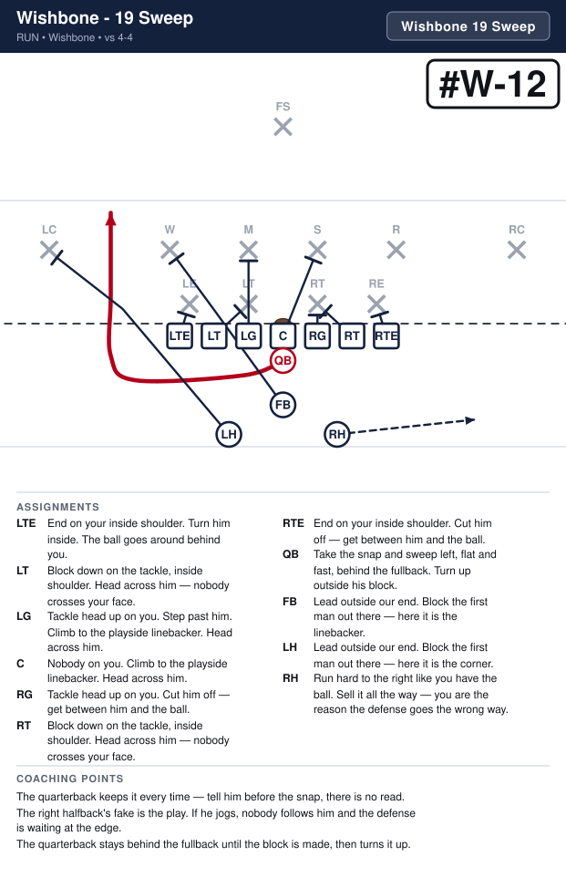
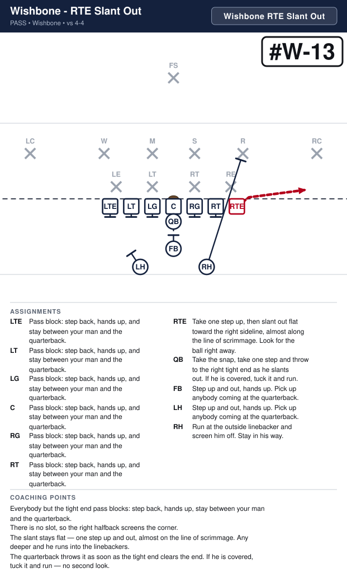
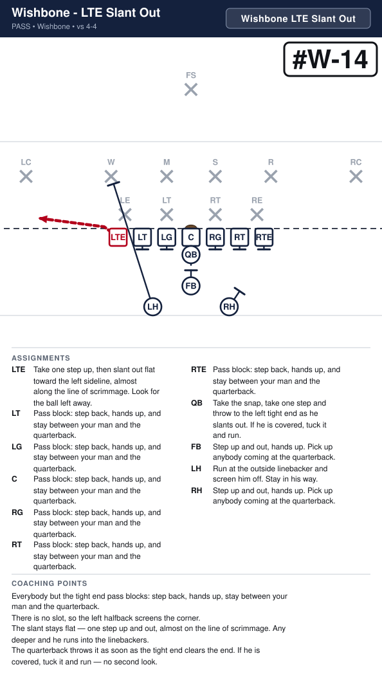

# Wishbone

_Generated by `generator/render.py`. Edit the JSON in `plays/`, not this file._

Same line as the Regular I — both ends tight, seven on the line every snap. Fullback at three yards on the ball. The halfbacks sit a yard deeper, just outside him, one behind each tackle, same depth so the alignment gives nothing away. There is no slot: the call is the formation, the number and the word.

**Alignment** (yards; x positive to the right, y positive downfield, LOS = 0)

| Position | x | y |
|---|---|---|
| LTE | -4.2 | -0.5 |
| LT | -2.8 | -0.5 |
| LG | -1.4 | -0.5 |
| C | 0.0 | -0.5 |
| RG | 1.4 | -0.5 |
| RT | 2.8 | -0.5 |
| RTE | 4.2 | -0.5 |
| QB | 0.0 | -1.5 |
| FB | 0.0 | -3.3 |
| LH | -2.2 | -4.5 |
| RH | 2.2 | -4.5 |

**Formation coaching notes**

- Count seven on the line every snap — both ends stay down. There is no slot to creep up, so the flag here is an end who stands up before the snap.
- The fullback is back 2, both ways: 20 Smash and 21 Smash, 22 Dive and 23 Dive. He is the inside runner the Regular I gives to the tailback.
- The 3-back is the left halfback (odd holes) and the 4-back is the right halfback (even holes). 44 Power is the right halfback off tackle; 35 Power is the left halfback the other way. 4 is not the slot in this look, so 49 Toss is Toss, not Sweep.
- The fullback and the two halfbacks must stay in their spots. A drifting halfback tips Power and Toss before the snap.

## Plays

| Play | Call | Scheme | Type | Ball |
|---|---|---|---|---|
| [Wishbone - 44 Power](#wishbone---44-power) | `Wishbone 44 Power` | Power | run | RH |
| [Wishbone - 35 Power](#wishbone---35-power) | `Wishbone 35 Power` | Power | run | LH |
| [Wishbone - LTE Sweep](#wishbone---lte-sweep) | `Wishbone LTE Sweep` | Sweep | run | LTE |
| [Wishbone - RTE Sweep](#wishbone---rte-sweep) | `Wishbone RTE Sweep` | Sweep | run | RTE |
| [Wishbone - 20 Smash](#wishbone---20-smash) | `Wishbone 20 Smash` | Smash | run | FB |
| [Wishbone - 21 Smash](#wishbone---21-smash) | `Wishbone 21 Smash` | Smash | run | FB |
| [Wishbone - 22 Dive](#wishbone---22-dive) | `Wishbone 22 Dive` | Dive | run | FB |
| [Wishbone - 23 Dive](#wishbone---23-dive) | `Wishbone 23 Dive` | Dive | run | FB |
| [Wishbone - 38 Toss](#wishbone---38-toss) | `Wishbone 38 Toss` | Toss | run | LH |
| [Wishbone - 49 Toss](#wishbone---49-toss) | `Wishbone 49 Toss` | Toss | run | RH |
| [Wishbone - 18 Sweep](#wishbone---18-sweep) | `Wishbone 18 Sweep` | Sweep | run | QB |
| [Wishbone - 19 Sweep](#wishbone---19-sweep) | `Wishbone 19 Sweep` | Sweep | run | QB |
| [Wishbone - RTE Slant Out](#wishbone---rte-slant-out) | `Wishbone RTE Slant Out` | Protect | pass | RTE |
| [Wishbone - LTE Slant Out](#wishbone---lte-slant-out) | `Wishbone LTE Slant Out` | Protect | pass | LTE |

---

## Wishbone - 44 Power

**Call it:** `Wishbone 44 Power`

**Scheme:** Power

| Position | Assignment |
|---|---|
| **LTE** | End on your inside shoulder. Cut him off — get between him and the ball. |
| **LT** | Block down on the tackle, inside shoulder. Head across him — nobody crosses your face. |
| **LG** | Tackle head up on you. Cut him off — get between him and the ball. |
| **C** | Nobody on you. Climb to the playside linebacker. Head across him. |
| **RG** | Tackle head up on you. Hands inside, pads under his, drive him back. |
| **RT** | Block down on the tackle, inside shoulder. Head across him — nobody crosses your face. |
| **RTE** | End on your inside shoulder. Drive him to the sideline. The ball goes inside you. |
| **QB** | Open right, hand to the right halfback, then fake the boot. It holds the backside end. |
| **FB** | Lead through the hole. Block the first man who shows in it. |
| **LH** | Run hard to the left like you have the ball. You are what holds the backside. |
| **RH** **(ball)** | Take the handoff downhill at our tackle's outside hip, following the fullback. Never bounce it outside. |

**Coaching points**

- This is Power without a slot: the right tight end kicks the end out. The yards are inside that block.
- The fullback leads through the hole. His man is whoever shows, not a man he picks before the snap — including the outside linebacker if that is who fills.
- The right halfback's most common mistake is bouncing it wide. Make him run it tight until it is automatic.

---

## Wishbone - 35 Power

**Call it:** `Wishbone 35 Power`

**Scheme:** Power

| Position | Assignment |
|---|---|
| **LTE** | End on your inside shoulder. Drive him to the sideline. The ball goes inside you. |
| **LT** | Block down on the tackle, inside shoulder. Head across him — nobody crosses your face. |
| **LG** | Tackle head up on you. Hands inside, pads under his, drive him back. |
| **C** | Nobody on you. Climb to the playside linebacker. Head across him. |
| **RG** | Tackle head up on you. Cut him off — get between him and the ball. |
| **RT** | Block down on the tackle, inside shoulder. Head across him — nobody crosses your face. |
| **RTE** | End on your inside shoulder. Cut him off — get between him and the ball. |
| **QB** | Open left, hand to the left halfback, then fake the boot. It holds the backside end. |
| **FB** | Lead through the hole. Block the first man who shows in it. |
| **LH** **(ball)** | Take the handoff downhill at our tackle's outside hip, following the fullback. Never bounce it outside. |
| **RH** | Run hard to the right like you have the ball. You are what holds the backside. |

**Coaching points**

- This is Power without a slot: the left tight end kicks the end out. The yards are inside that block.
- The fullback leads through the hole. His man is whoever shows, not a man he picks before the snap — including the outside linebacker if that is who fills.
- The left halfback's most common mistake is bouncing it wide. Make him run it tight until it is automatic.

---

## Wishbone - LTE Sweep

**Call it:** `Wishbone LTE Sweep`

**Scheme:** Sweep

| Position | Assignment |
|---|---|
| **LTE** **(ball)** | Stay down in your stance — no motion. At the snap run flat behind the quarterback, take the handoff at full speed and get to the right edge. Turn up outside the fullback. |
| **LT** | Nobody on you. Cut off the backside. Never quit on the play. |
| **LG** | Tackle head up on you. Cut him off — get between him and the ball. |
| **C** | Nobody on you. Climb to the playside linebacker. Head across him. |
| **RG** | Tackle head up on you. Step past him. Climb to the playside linebacker. Head across him. |
| **RT** | Block down on the tackle, inside shoulder. Head across him — nobody crosses your face. |
| **RTE** | End on your inside shoulder. Turn him inside. The ball goes around behind you. |
| **QB** | Open right and hand the ball to the left tight end as he comes across behind you, then fake a run to the left. |
| **FB** | Lead outside our end. Block the first man out there — here it is the linebacker. |
| **LH** | Run hard to the left like you have the ball. You are what holds the backside. |
| **RH** | Lead outside our end. Block the first man out there — here it is the corner. |

**Coaching points**

- No motion before the snap. The end stays down in his stance, so the play is legal and nothing tips it off.
- The handoff is the whole play: the quarterback opens right and puts the ball in the end's belly at full speed, then carries out his fake.
- The fullback and the right halfback bubble out ahead of the end. Two of them on the edge is what gets him around the corner.

---

## Wishbone - RTE Sweep

**Call it:** `Wishbone RTE Sweep`

**Scheme:** Sweep

| Position | Assignment |
|---|---|
| **LTE** | End on your inside shoulder. Turn him inside. The ball goes around behind you. |
| **LT** | Block down on the tackle, inside shoulder. Head across him — nobody crosses your face. |
| **LG** | Tackle head up on you. Step past him. Climb to the playside linebacker. Head across him. |
| **C** | Nobody on you. Climb to the playside linebacker. Head across him. |
| **RG** | Tackle head up on you. Cut him off — get between him and the ball. |
| **RT** | Nobody on you. Cut off the backside. Never quit on the play. |
| **RTE** **(ball)** | Stay down in your stance — no motion. At the snap run flat behind the quarterback, take the handoff at full speed and get to the left edge. Turn up outside the fullback. |
| **QB** | Open left and hand the ball to the right tight end as he comes across behind you, then fake a run to the right. |
| **FB** | Lead outside our end. Block the first man out there — here it is the linebacker. |
| **LH** | Lead outside our end. Block the first man out there — here it is the corner. |
| **RH** | Run hard to the right like you have the ball. You are what holds the backside. |

**Coaching points**

- No motion before the snap. The end stays down in his stance, so the play is legal and nothing tips it off.
- The handoff is the whole play: the quarterback opens left and puts the ball in the end's belly at full speed, then carries out his fake.
- The fullback and the left halfback bubble out ahead of the end. Two of them on the edge is what gets him around the corner.

---

## Wishbone - 20 Smash

**Call it:** `Wishbone 20 Smash`

**Scheme:** Smash

| Position | Assignment |
|---|---|
| **LTE** | End on your inside shoulder. Cut him off — get between him and the ball. |
| **LT** | Block down on the tackle, inside shoulder. Head across him — nobody crosses your face. |
| **LG** | Tackle head up on you. Cut him off — get between him and the ball. |
| **C** | Nobody on you. Climb to the playside linebacker. Head across him. |
| **RG** | Tackle head up on you. Hands inside, pads under his, drive him back. |
| **RT** | Block down on the tackle, inside shoulder. Head across him — nobody crosses your face. |
| **RTE** | End on your inside shoulder. Cut him off — get between him and the ball. |
| **QB** | Open right, hand to the fullback, then fake the boot left. It holds the backside end. |
| **FB** **(ball)** | Take the handoff downhill between the center and the right guard. Do not bounce it. |
| **LH** | Run hard to the left like you have the ball. You are what holds the backside. |
| **RH** | Lead through the hole. Block the first man who shows in it. |

**Coaching points**

- The fullback is the runner here, not the lead. The hole is the A-gap — between the center and the right guard.
- The right halfback leads through that gap. If the fullback bounces, the play is dead.

---

## Wishbone - 21 Smash

**Call it:** `Wishbone 21 Smash`

**Scheme:** Smash

| Position | Assignment |
|---|---|
| **LTE** | End on your inside shoulder. Cut him off — get between him and the ball. |
| **LT** | Block down on the tackle, inside shoulder. Head across him — nobody crosses your face. |
| **LG** | Tackle head up on you. Hands inside, pads under his, drive him back. |
| **C** | Nobody on you. Climb to the playside linebacker. Head across him. |
| **RG** | Tackle head up on you. Cut him off — get between him and the ball. |
| **RT** | Block down on the tackle, inside shoulder. Head across him — nobody crosses your face. |
| **RTE** | End on your inside shoulder. Cut him off — get between him and the ball. |
| **QB** | Open left, hand to the fullback, then fake the boot right. It holds the backside end. |
| **FB** **(ball)** | Take the handoff downhill between the center and the left guard. Do not bounce it. |
| **LH** | Lead through the hole. Block the first man who shows in it. |
| **RH** | Run hard to the right like you have the ball. You are what holds the backside. |

**Coaching points**

- The fullback is the runner here, not the lead. The hole is the A-gap — between the center and the left guard.
- The left halfback leads through that gap. If the fullback bounces, the play is dead.

---

## Wishbone - 22 Dive

**Call it:** `Wishbone 22 Dive`

**Scheme:** Dive

| Position | Assignment |
|---|---|
| **LTE** | End on your inside shoulder. Cut him off — get between him and the ball. |
| **LT** | Block down on the tackle, inside shoulder. Head across him — nobody crosses your face. |
| **LG** | Tackle head up on you. Cut him off — get between him and the ball. |
| **C** | Nobody on you. Climb to the playside linebacker. Head across him. |
| **RG** | Block down on the tackle, head up. Head across him — nobody crosses your face. |
| **RT** | Nobody on you. Help on the tackle, then take the playside linebacker. |
| **RTE** | End on your inside shoulder. Cut him off — get between him and the ball. |
| **QB** | Open right, hand to the fullback, then fake the boot left. It holds the backside end. |
| **FB** **(ball)** | Take the handoff downhill between the right guard and the right tackle. One cut, then get north. Do not bounce it. |
| **LH** | Run hard to the left like you have the ball. You are what holds the backside. |
| **RH** | Lead through the hole. Block the first man who shows in it. |

**Coaching points**

- Dive is the B-gap — between the guard and the tackle. Faster than Power, wider than Smash.
- The fullback takes it downhill and gets north. One cut off the double team, never a bounce.

---

## Wishbone - 23 Dive

**Call it:** `Wishbone 23 Dive`

**Scheme:** Dive

| Position | Assignment |
|---|---|
| **LTE** | End on your inside shoulder. Cut him off — get between him and the ball. |
| **LT** | Nobody on you. Help on the tackle, then take the playside linebacker. |
| **LG** | Block down on the tackle, head up. Head across him — nobody crosses your face. |
| **C** | Nobody on you. Climb to the playside linebacker. Head across him. |
| **RG** | Tackle head up on you. Cut him off — get between him and the ball. |
| **RT** | Block down on the tackle, inside shoulder. Head across him — nobody crosses your face. |
| **RTE** | End on your inside shoulder. Cut him off — get between him and the ball. |
| **QB** | Open left, hand to the fullback, then fake the boot right. It holds the backside end. |
| **FB** **(ball)** | Take the handoff downhill between the left guard and the left tackle. One cut, then get north. Do not bounce it. |
| **LH** | Lead through the hole. Block the first man who shows in it. |
| **RH** | Run hard to the right like you have the ball. You are what holds the backside. |

**Coaching points**

- Dive is the B-gap — between the guard and the tackle. Faster than Power, wider than Smash.
- The fullback takes it downhill and gets north. One cut off the double team, never a bounce.

---

## Wishbone - 38 Toss

**Call it:** `Wishbone 38 Toss`

**Scheme:** Toss

| Position | Assignment |
|---|---|
| **LTE** | End on your inside shoulder. Cut him off — get between him and the ball. |
| **LT** | Block down on the tackle, inside shoulder. Head across him — nobody crosses your face. |
| **LG** | Tackle head up on you. Cut him off — get between him and the ball. |
| **C** | Nobody on you. Climb to the playside linebacker. Head across him. |
| **RG** | Tackle head up on you. Step past him. Climb to the playside linebacker. Head across him. |
| **RT** | Block down on the tackle, inside shoulder. Head across him — nobody crosses your face. |
| **RTE** | End on your inside shoulder. Turn him inside. The ball goes around behind you. |
| **QB** | Quick pitch to the left halfback, then run the other way, to the left, like you still have it. |
| **FB** | Lead outside our end. Block the first man out there — here it is the linebacker. |
| **LH** **(ball)** | Run flat, outside and behind the quarterback, and catch the pitch on the run. Ahead of him is a fumble. |
| **RH** | Lead outside our end. Block the first man out there — here it is the corner. Step at the dive first to hold their linebackers. |

**Coaching points**

- The pitch goes early. A quarterback who waits to be tackled first will pitch it on the ground.
- This is not a read at this age — tell him before the snap that he is pitching it.
- The fullback and the right halfback both go to the edge. The left halfback stays behind them and turns up in the alley.

---

## Wishbone - 49 Toss

**Call it:** `Wishbone 49 Toss`

**Scheme:** Toss

| Position | Assignment |
|---|---|
| **LTE** | End on your inside shoulder. Turn him inside. The ball goes around behind you. |
| **LT** | Block down on the tackle, inside shoulder. Head across him — nobody crosses your face. |
| **LG** | Tackle head up on you. Step past him. Climb to the playside linebacker. Head across him. |
| **C** | Nobody on you. Climb to the playside linebacker. Head across him. |
| **RG** | Tackle head up on you. Cut him off — get between him and the ball. |
| **RT** | Block down on the tackle, inside shoulder. Head across him — nobody crosses your face. |
| **RTE** | End on your inside shoulder. Cut him off — get between him and the ball. |
| **QB** | Quick pitch to the right halfback, then run the other way, to the right, like you still have it. |
| **FB** | Lead outside our end. Block the first man out there — here it is the linebacker. |
| **LH** | Lead outside our end. Block the first man out there — here it is the corner. Step at the dive first to hold their linebackers. |
| **RH** **(ball)** | Run flat, outside and behind the quarterback, and catch the pitch on the run. Ahead of him is a fumble. |

**Coaching points**

- The pitch goes early. A quarterback who waits to be tackled first will pitch it on the ground.
- This is not a read at this age — tell him before the snap that he is pitching it.
- The fullback and the left halfback both go to the edge. The right halfback stays behind them and turns up in the alley.

---

## Wishbone - 18 Sweep

**Call it:** `Wishbone 18 Sweep`

**Scheme:** Sweep

| Position | Assignment |
|---|---|
| **LTE** | End on your inside shoulder. Cut him off — get between him and the ball. |
| **LT** | Block down on the tackle, inside shoulder. Head across him — nobody crosses your face. |
| **LG** | Tackle head up on you. Cut him off — get between him and the ball. |
| **C** | Nobody on you. Climb to the playside linebacker. Head across him. |
| **RG** | Tackle head up on you. Step past him. Climb to the playside linebacker. Head across him. |
| **RT** | Block down on the tackle, inside shoulder. Head across him — nobody crosses your face. |
| **RTE** | End on your inside shoulder. Turn him inside. The ball goes around behind you. |
| **QB** **(ball)** | Take the snap and sweep right, flat and fast, behind the fullback. Turn up outside his block. |
| **FB** | Lead outside our end. Block the first man out there — here it is the linebacker. |
| **LH** | Run hard to the left like you have the ball. Sell it all the way — you are the reason the defense goes the wrong way. |
| **RH** | Lead outside our end. Block the first man out there — here it is the corner. |

**Coaching points**

- The quarterback keeps it every time — tell him before the snap, there is no read.
- The left halfback's fake is the play. If he jogs, nobody follows him and the defense is waiting at the edge.
- The quarterback stays behind the fullback until the block is made, then turns it up.

---

## Wishbone - 19 Sweep

**Call it:** `Wishbone 19 Sweep`

**Scheme:** Sweep

| Position | Assignment |
|---|---|
| **LTE** | End on your inside shoulder. Turn him inside. The ball goes around behind you. |
| **LT** | Block down on the tackle, inside shoulder. Head across him — nobody crosses your face. |
| **LG** | Tackle head up on you. Step past him. Climb to the playside linebacker. Head across him. |
| **C** | Nobody on you. Climb to the playside linebacker. Head across him. |
| **RG** | Tackle head up on you. Cut him off — get between him and the ball. |
| **RT** | Block down on the tackle, inside shoulder. Head across him — nobody crosses your face. |
| **RTE** | End on your inside shoulder. Cut him off — get between him and the ball. |
| **QB** **(ball)** | Take the snap and sweep left, flat and fast, behind the fullback. Turn up outside his block. |
| **FB** | Lead outside our end. Block the first man out there — here it is the linebacker. |
| **LH** | Lead outside our end. Block the first man out there — here it is the corner. |
| **RH** | Run hard to the right like you have the ball. Sell it all the way — you are the reason the defense goes the wrong way. |

**Coaching points**

- The quarterback keeps it every time — tell him before the snap, there is no read.
- The right halfback's fake is the play. If he jogs, nobody follows him and the defense is waiting at the edge.
- The quarterback stays behind the fullback until the block is made, then turns it up.

---

## Wishbone - RTE Slant Out

**Call it:** `Wishbone RTE Slant Out`

**Scheme:** Protect

| Position | Assignment |
|---|---|
| **LTE** | Pass block: step back, hands up, and stay between your man and the quarterback. |
| **LT** | Pass block: step back, hands up, and stay between your man and the quarterback. |
| **LG** | Pass block: step back, hands up, and stay between your man and the quarterback. |
| **C** | Pass block: step back, hands up, and stay between your man and the quarterback. |
| **RG** | Pass block: step back, hands up, and stay between your man and the quarterback. |
| **RT** | Pass block: step back, hands up, and stay between your man and the quarterback. |
| **RTE** **(ball)** | Take one step up, then slant out flat toward the right sideline, almost along the line of scrimmage. Look for the ball right away. |
| **QB** | Take the snap, take one step and throw to the right tight end as he slants out. If he is covered, tuck it and run. |
| **FB** | Step up and out, hands up. Pick up anybody coming at the quarterback. |
| **LH** | Step up and out, hands up. Pick up anybody coming at the quarterback. |
| **RH** | Run at the outside linebacker and screen him off. Stay in his way. |

**Coaching points**

- Everybody but the tight end pass blocks: step back, hands up, stay between your man and the quarterback.
- There is no slot, so the right halfback screens the corner.
- The slant stays flat — one step up and out, almost on the line of scrimmage. Any deeper and he runs into the linebackers.
- The quarterback throws it as soon as the tight end clears the end. If he is covered, tuck it and run — no second look.

---

## Wishbone - LTE Slant Out

**Call it:** `Wishbone LTE Slant Out`

**Scheme:** Protect

| Position | Assignment |
|---|---|
| **LTE** **(ball)** | Take one step up, then slant out flat toward the left sideline, almost along the line of scrimmage. Look for the ball left away. |
| **LT** | Pass block: step back, hands up, and stay between your man and the quarterback. |
| **LG** | Pass block: step back, hands up, and stay between your man and the quarterback. |
| **C** | Pass block: step back, hands up, and stay between your man and the quarterback. |
| **RG** | Pass block: step back, hands up, and stay between your man and the quarterback. |
| **RT** | Pass block: step back, hands up, and stay between your man and the quarterback. |
| **RTE** | Pass block: step back, hands up, and stay between your man and the quarterback. |
| **QB** | Take the snap, take one step and throw to the left tight end as he slants out. If he is covered, tuck it and run. |
| **FB** | Step up and out, hands up. Pick up anybody coming at the quarterback. |
| **LH** | Run at the outside linebacker and screen him off. Stay in his way. |
| **RH** | Step up and out, hands up. Pick up anybody coming at the quarterback. |

**Coaching points**

- Everybody but the tight end pass blocks: step back, hands up, stay between your man and the quarterback.
- There is no slot, so the left halfback screens the corner.
- The slant stays flat — one step up and out, almost on the line of scrimmage. Any deeper and he runs into the linebackers.
- The quarterback throws it as soon as the tight end clears the end. If he is covered, tuck it and run — no second look.

