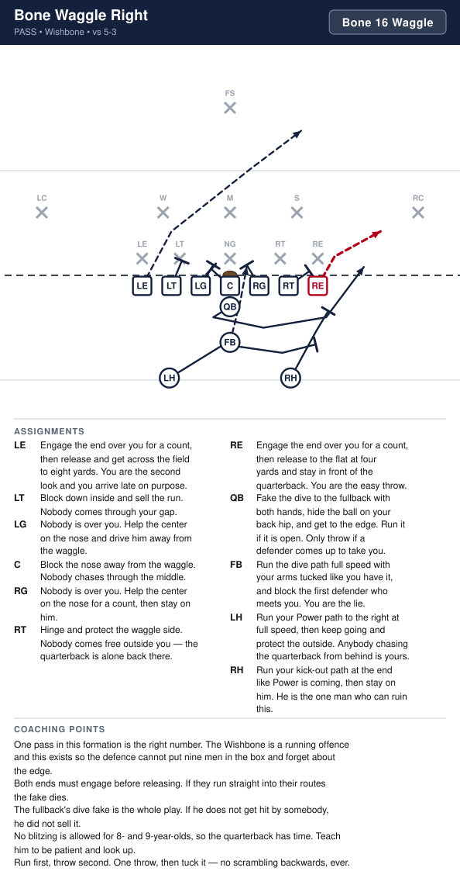
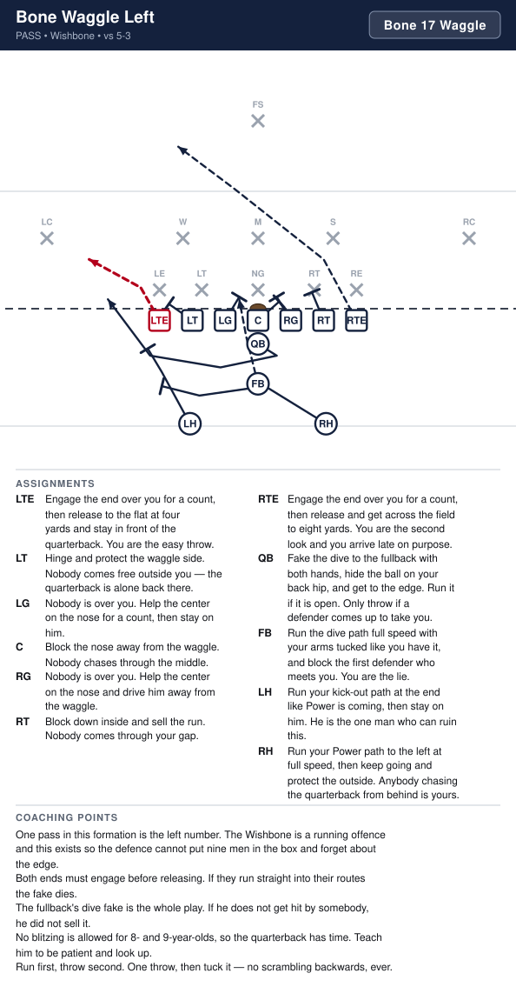

# Wishbone

_Generated by `generator/render.py`. Edit the JSON in `plays/`, not this file._

Three backs in a Y behind the quarterback: fullback close at three yards, then two backs split wider and deeper. Both ends are tight and on the line. The formation is perfectly symmetric, so every play has a left and a right version with identical rules.

**Alignment** (yards; x positive to the right, y positive downfield, LOS = 0)

| Position | x | y |
|---|---|---|
| LTE | -4.2 | -0.5 |
| LT | -2.8 | -0.5 |
| LG | -1.4 | -0.5 |
| C | 0.0 | -0.5 |
| RG | 1.4 | -0.5 |
| RT | 2.8 | -0.5 |
| RTE | 4.2 | -0.5 |
| QB | 0.0 | -1.5 |
| FB | 0.0 | -3.2 |
| Z | -2.9 | -4.9 |
| TB | 2.9 | -4.9 |

**Formation coaching notes**

- Three backs means three threats on every snap, and the defense has to be right about all three. That is the whole idea.
- The fullback is the hammer. If they ever stop respecting him up the middle, everything else stops working.
- Symmetric formation, symmetric rules — the kids learn one play and get two.
- We do not run a true read option at this age. The quarterback is told before the snap who gets the ball.

## Plays

| Play | Call | Type | Ball |
|---|---|---|---|
| [Bone Dive Right](#bone-dive-right) | `Bone 20 Dive` | run | FB |
| [Bone Dive Left](#bone-dive-left) | `Bone 21 Dive` | run | FB |
| [Bone Power Right](#bone-power-right) | `Bone 44 Power` | run | Z |
| [Bone Power Left](#bone-power-left) | `Bone 35 Power` | run | TB |
| [Bone Counter Right](#bone-counter-right) | `Bone 44 Counter` | run | Z |
| [Bone Counter Left](#bone-counter-left) | `Bone 35 Counter` | run | TB |
| [Bone Waggle Right](#bone-waggle-right) | `Bone 16 Waggle` | pass | RTE |
| [Bone Waggle Left](#bone-waggle-left) | `Bone 17 Waggle` | pass | LTE |
| [Bone Pitch Right](#bone-pitch-right) | `Bone 48 Pitch` | run | Z |
| [Bone Pitch Left](#bone-pitch-left) | `Bone 39 Pitch` | run | TB |

---

## Bone Dive Right

**Call it:** `Bone 20 Dive`

The fullback right now, off a double team on the nose. This is the play that has to work before anything else in the formation does — it is what holds their linebackers inside and makes the pitch go.

| Position | Assignment |
|---|---|
| **LTE** | Cut off pursuit from behind. You are the last one to the ball, so never quit on the play. |
| **LT** | The tackle is on your inside shoulder. Get your head across him and wall him off so he cannot chase. |
| **LG** | Nobody is over you. Step back inside and cut off anyone chasing through the middle. |
| **C** | You and the playside guard double the nose. Drive him off the spot — the hole is right off his back. |
| **RG** | Nobody is over you. Double the nose with the center, and come off onto the middle linebacker when he shows. |
| **RT** | The tackle is on your inside shoulder. Block him down and seal him inside — that is what opens the hole. |
| **RTE** | The end is head up on you. Drive him out and away from the ball. |
| **Z** | Run the pitch path to your side at full speed and sell it. |
| **QB** | Take the snap and hand the ball to the fullback at two yards. Then fake to the outside. |
| **FB** **(ball)** | Aim at the outside hip of the center, right off the double team. Take the ball and get north — there is no hole to look for. |
| **TB** | Run the pitch path to your side at full speed and sell it. |

**Coaching points**

- Snap to handoff should be under a second. If the fullback is waiting on the ball, the play is already dead.
- Both backs run their fakes every single time. Three threats or none.
- The fullback runs at a spot, not at a defender. Give him the outside hip of the center and let him go.
- Run it to both sides. Once their middle linebacker knows which A gap the dive hits, it stops being quick.

---

## Bone Dive Left

**Call it:** `Bone 21 Dive`

The fullback left now, off a double team on the nose. This is the play that has to work before anything else in the formation does — it is what holds their linebackers inside and makes the pitch go.

| Position | Assignment |
|---|---|
| **LTE** | The end is head up on you. Drive him out and away from the ball. |
| **LT** | The tackle is on your inside shoulder. Block him down and seal him inside — that is what opens the hole. |
| **LG** | Nobody is over you. Double the nose with the center, and come off onto the middle linebacker when he shows. |
| **C** | You and the playside guard double the nose. Drive him off the spot — the hole is left off his back. |
| **RG** | Nobody is over you. Step back inside and cut off anyone chasing through the middle. |
| **RT** | The tackle is on your inside shoulder. Get your head across him and wall him off so he cannot chase. |
| **RTE** | Cut off pursuit from behind. You are the last one to the ball, so never quit on the play. |
| **Z** | Run the pitch path to your side at full speed and sell it. |
| **QB** | Take the snap and hand the ball to the fullback at two yards. Then fake to the outside. |
| **FB** **(ball)** | Aim at the outside hip of the center, left off the double team. Take the ball and get north — there is no hole to look for. |
| **TB** | Run the pitch path to your side at full speed and sell it. |

**Coaching points**

- Snap to handoff should be under a second. If the fullback is waiting on the ball, the play is already dead.
- Both backs run their fakes every single time. Three threats or none.
- The fullback runs at a spot, not at a defender. Give him the outside hip of the center and let him go.
- Run it to both sides. Once their middle linebacker knows which A gap the dive hits, it stops being quick.

---

## Bone Power Right

**Call it:** `Bone 44 Power`

Off-tackle power to the far back, who crosses behind the fullback and takes a deep handoff. Blocked exactly like Counter — our end drives their end out, the guard climbs to the middle linebacker, the fullback leads through the hole onto the playside linebacker — with the near back arcing to the corner in case the ball bounces.

| Position | Assignment |
|---|---|
| **LTE** | Cut off pursuit from behind. You are the last one to the ball, so never quit on the play. |
| **LT** | Block back. Take the first defender on or inside you — nobody crosses your face. |
| **LG** | Nobody is over you. Cut off the backside. |
| **C** | You have the nose, head up on you. Hands inside and do not let him cross your face to the playside. |
| **RG** | Nobody is over you. Climb straight to the middle linebacker and take him wherever he goes. |
| **RT** | The tackle is on your inside shoulder. Block him down and seal him inside — that is what opens the hole. |
| **RTE** | Block the end over you and drive him out, away from the hole. Nobody is kicking him out for you — he is yours. |
| **Z** **(ball)** | You carry it. Cross behind the fullback, take the handoff deep, then press the outside hip of our tackle and turn up inside the blocks. |
| **QB** | Open to the playside and hand deep to the back crossing from the backside. Let him come to you, then fake away. |
| **FB** | Lead up through the hole and block the playside linebacker. You are the lead blocker — the ball is right behind you. |
| **TB** | Arc outside and block the corner on your side. If the ball bounces, you are the reason it can. |

**Coaching points**

- Identical blocking to Bone Counter. The line learns one set of rules and gets two plays out of it — say that out loud when you install the second one.
- The fullback's block on the playside linebacker is the play. Drill it on its own.
- The far back travels further than the near one, and that is the point — he arrives behind the fullback rather than beating him to the hole.
- If the handoff is late, the quarterback is reaching. He holds the ball still and lets the back run through it.

---

## Bone Power Left

**Call it:** `Bone 35 Power`

Off-tackle power to the far back, who crosses behind the fullback and takes a deep handoff. Blocked exactly like Counter — our end drives their end out, the guard climbs to the middle linebacker, the fullback leads through the hole onto the playside linebacker — with the near back arcing to the corner in case the ball bounces.

| Position | Assignment |
|---|---|
| **LTE** | Block the end over you and drive him out, away from the hole. Nobody is kicking him out for you — he is yours. |
| **LT** | The tackle is on your inside shoulder. Block him down and seal him inside — that is what opens the hole. |
| **LG** | Nobody is over you. Climb straight to the middle linebacker and take him wherever he goes. |
| **C** | You have the nose, head up on you. Hands inside and do not let him cross your face to the playside. |
| **RG** | Nobody is over you. Cut off the backside. |
| **RT** | Block back. Take the first defender on or inside you — nobody crosses your face. |
| **RTE** | Cut off pursuit from behind. You are the last one to the ball, so never quit on the play. |
| **Z** | Arc outside and block the corner on your side. If the ball bounces, you are the reason it can. |
| **QB** | Open to the playside and hand deep to the back crossing from the backside. Let him come to you, then fake away. |
| **FB** | Lead up through the hole and block the playside linebacker. You are the lead blocker — the ball is left behind you. |
| **TB** **(ball)** | You carry it. Cross behind the fullback, take the handoff deep, then press the outside hip of our tackle and turn up inside the blocks. |

**Coaching points**

- Identical blocking to Bone Counter. The line learns one set of rules and gets two plays out of it — say that out loud when you install the second one.
- The fullback's block on the playside linebacker is the play. Drill it on its own.
- The far back travels further than the near one, and that is the point — he arrives behind the fullback rather than beating him to the hole.
- If the handoff is late, the quarterback is reaching. He holds the ball still and lets the back run through it.

---

## Bone Counter Right

**Call it:** `Bone 44 Counter`

Misdirection off the pitch. The near back and the quarterback sell the pitch one way and the far back plants and comes all the way back. Nobody pulls: our end drives their end out, the guard climbs to the middle linebacker and the fullback leads up through the hole onto the playside linebacker, so the ball hits fast behind a lead blocker.

| Position | Assignment |
|---|---|
| **LTE** | Cut off pursuit from behind. You are the last one to the ball, so never quit on the play. |
| **LT** | Block back. Take the first defender on or inside you — nobody crosses your face. |
| **LG** | Nobody is over you. Cut off the backside. |
| **C** | You have the nose, head up on you. Hands inside and do not let him cross your face to the playside. |
| **RG** | Nobody is over you. Climb straight to the middle linebacker and take him wherever he goes. |
| **RT** | The tackle is on your inside shoulder. Block him down and seal him inside — that is what opens the hole. |
| **RTE** | Block the end over you and drive him out, away from the hole. Nobody is kicking him out for you — he is yours. |
| **Z** **(ball)** | Take two hard steps toward the fake, then plant and come all the way back behind the pulling guard. |
| **QB** | Fake the pitch to the left, then turn back and hand the ball to the other back coming across. The fake comes first. |
| **FB** | Step at the dive to hold them, then go up through the hole and block the playside linebacker. You are the lead blocker — the ball is right behind you. |
| **TB** | Run the full pitch path away at full speed with your arms tucked. You are the lie. |

**Coaching points**

- Do not call this until the pitch has been working. It is the counter-punch.
- No pullers, so this hits faster than Power. The line has to hold its blocks while the ball carrier crosses, but nobody is waiting on a guard to get there.
- The fullback's block on the playside linebacker is what springs it. Drill that block on its own.
- Two hard steps toward the fake before he comes back. A shuffle fools nobody.

---

## Bone Counter Left

**Call it:** `Bone 35 Counter`

Misdirection off the pitch. The near back and the quarterback sell the pitch one way and the far back plants and comes all the way back. Nobody pulls: our end drives their end out, the guard climbs to the middle linebacker and the fullback leads up through the hole onto the playside linebacker, so the ball hits fast behind a lead blocker.

| Position | Assignment |
|---|---|
| **LTE** | Block the end over you and drive him out, away from the hole. Nobody is kicking him out for you — he is yours. |
| **LT** | The tackle is on your inside shoulder. Block him down and seal him inside — that is what opens the hole. |
| **LG** | Nobody is over you. Climb straight to the middle linebacker and take him wherever he goes. |
| **C** | You have the nose, head up on you. Hands inside and do not let him cross your face to the playside. |
| **RG** | Nobody is over you. Cut off the backside. |
| **RT** | Block back. Take the first defender on or inside you — nobody crosses your face. |
| **RTE** | Cut off pursuit from behind. You are the last one to the ball, so never quit on the play. |
| **Z** | Run the full pitch path away at full speed with your arms tucked. You are the lie. |
| **QB** | Fake the pitch to the right, then turn back and hand the ball to the other back coming across. The fake comes first. |
| **FB** | Step at the dive to hold them, then go up through the hole and block the playside linebacker. You are the lead blocker — the ball is left behind you. |
| **TB** **(ball)** | Take two hard steps toward the fake, then plant and come all the way back behind the pulling guard. |

**Coaching points**

- Do not call this until the pitch has been working. It is the counter-punch.
- No pullers, so this hits faster than Power. The line has to hold its blocks while the ball carrier crosses, but nobody is waiting on a guard to get there.
- The fullback's block on the playside linebacker is what springs it. Drill that block on its own.
- Two hard steps toward the fake before he comes back. A shuffle fools nobody.

---

## Bone Waggle Right

**Call it:** `Bone 16 Waggle`

The only pass in the Wishbone, and it comes off the play they have seen most. Fake the dive, let both backs run their power paths, and the quarterback walks out onto an edge everybody has left.

| Position | Assignment |
|---|---|
| **LTE** | Engage the end over you for a count, then release and get across the field to eight yards. You are the second look and you arrive late on purpose. |
| **LT** | Block down inside and sell the run. Nobody comes through your gap. |
| **LG** | Nobody is over you. Help the center on the nose and drive him away from the waggle. |
| **C** | Block the nose away from the waggle. Nobody chases through the middle. |
| **RG** | Nobody is over you. Help the center on the nose for a count, then stay on him. |
| **RT** | Hinge and protect the waggle side. Nobody comes free outside you — the quarterback is alone back there. |
| **RTE** **(ball)** | Engage the end over you for a count, then release to the flat at four yards and stay in front of the quarterback. You are the easy throw. |
| **Z** | Run your Power path to the right at full speed, then keep going and protect the outside. Anybody chasing the quarterback from behind is yours. |
| **QB** | Fake the dive to the fullback with both hands, hide the ball on your back hip, and get to the edge. Run it if it is open. Only throw if a defender comes up to take you. |
| **FB** | Run the dive path full speed with your arms tucked like you have it, and block the first defender who meets you. You are the lie. |
| **TB** | Run your kick-out path at the end like Power is coming, then stay on him. He is the one man who can ruin this. |

**Coaching points**

- One pass in this formation is the right number. The Wishbone is a running offence and this exists so the defence cannot put nine men in the box and forget about the edge.
- Both ends must engage before releasing. If they run straight into their routes the fake dies.
- The fullback's dive fake is the whole play. If he does not get hit by somebody, he did not sell it.
- No blitzing is allowed for 8- and 9-year-olds, so the quarterback has time. Teach him to be patient and look up.
- Run first, throw second. One throw, then tuck it — no scrambling backwards, ever.

---

## Bone Waggle Left

**Call it:** `Bone 17 Waggle`

The only pass in the Wishbone, and it comes off the play they have seen most. Fake the dive, let both backs run their power paths, and the quarterback walks out onto an edge everybody has right.

| Position | Assignment |
|---|---|
| **LTE** **(ball)** | Engage the end over you for a count, then release to the flat at four yards and stay in front of the quarterback. You are the easy throw. |
| **LT** | Hinge and protect the waggle side. Nobody comes free outside you — the quarterback is alone back there. |
| **LG** | Nobody is over you. Help the center on the nose for a count, then stay on him. |
| **C** | Block the nose away from the waggle. Nobody chases through the middle. |
| **RG** | Nobody is over you. Help the center on the nose and drive him away from the waggle. |
| **RT** | Block down inside and sell the run. Nobody comes through your gap. |
| **RTE** | Engage the end over you for a count, then release and get across the field to eight yards. You are the second look and you arrive late on purpose. |
| **Z** | Run your kick-out path at the end like Power is coming, then stay on him. He is the one man who can ruin this. |
| **QB** | Fake the dive to the fullback with both hands, hide the ball on your back hip, and get to the edge. Run it if it is open. Only throw if a defender comes up to take you. |
| **FB** | Run the dive path full speed with your arms tucked like you have it, and block the first defender who meets you. You are the lie. |
| **TB** | Run your Power path to the left at full speed, then keep going and protect the outside. Anybody chasing the quarterback from behind is yours. |

**Coaching points**

- One pass in this formation is the left number. The Wishbone is a running offence and this exists so the defence cannot put nine men in the box and forget about the edge.
- Both ends must engage before releasing. If they run straight into their routes the fake dies.
- The fullback's dive fake is the whole play. If he does not get hit by somebody, he did not sell it.
- No blitzing is allowed for 8- and 9-year-olds, so the quarterback has time. Teach him to be patient and look up.
- Run first, throw second. One throw, then tuck it — no scrambling backwards, ever.

---

## Bone Pitch Right

**Call it:** `Bone 48 Pitch`

Get outside in a hurry. The fullback holds the middle and then blocks, our end seals their end inside, and the near back gets to the corner and kicks him toward the sideline. The far back trails the quarterback, takes the pitch on the run and turns up inside that block.

| Position | Assignment |
|---|---|
| **LTE** | Cut off pursuit from behind. You are the last one to the ball, so never quit on the play. |
| **LT** | Block back. Take the first defender on or inside you — nobody crosses your face. |
| **LG** | Nobody is over you. Cut off the backside — nothing chases this from behind. |
| **C** | Reach the nose. Get your head across his playside shoulder. |
| **RG** | Nobody is over you. Climb to the middle linebacker and cut him off from the sideline. |
| **RT** | Reach the tackle on your inside shoulder. The fullback helps you — once you have the man, he comes off onto the linebacker. |
| **RTE** | Seal the edge. Block the end over you and turn him inside — the ball is going around behind you, so he cannot be allowed to follow it out. |
| **Z** **(ball)** | Run flat behind everybody, stay outside and behind the quarterback, and catch the pitch on the run. Never get ahead of him — a pitch that goes forward is a fumble. |
| **QB** | Fake the dive to the fullback, attack the outside, and pitch the ball to the trailing back before you get touched. Pitch early, not late. |
| **FB** | Step at the dive to hold their linebackers, help our tackle with the down lineman, then come off onto the playside linebacker. |
| **TB** | Beat the ball to the corner and block him. Drive him toward the sideline so the ball can turn up inside you. He is the only man out there who can catch it. |

**Coaching points**

- The pitch goes early. A quarterback who waits to be tackled first will pitch it on the ground.
- This is not a read at this age — tell him before the snap that he is pitching it.
- The back taking the pitch must stay behind the quarterback until he has the ball. Getting ahead means the pitch goes forward, which is a fumble waiting to happen.
- Everything depends on the corner being blocked. If our back cannot get out there in time, run Power instead.

---

## Bone Pitch Left

**Call it:** `Bone 39 Pitch`

Get outside in a hurry. The fullback holds the middle and then blocks, our end seals their end inside, and the near back gets to the corner and kicks him toward the sideline. The far back trails the quarterback, takes the pitch on the run and turns up inside that block.

| Position | Assignment |
|---|---|
| **LTE** | Seal the edge. Block the end over you and turn him inside — the ball is going around behind you, so he cannot be allowed to follow it out. |
| **LT** | Reach the tackle on your inside shoulder. The fullback helps you — once you have the man, he comes off onto the linebacker. |
| **LG** | Nobody is over you. Climb to the middle linebacker and cut him off from the sideline. |
| **C** | Reach the nose. Get your head across his playside shoulder. |
| **RG** | Nobody is over you. Cut off the backside — nothing chases this from behind. |
| **RT** | Block back. Take the first defender on or inside you — nobody crosses your face. |
| **RTE** | Cut off pursuit from behind. You are the last one to the ball, so never quit on the play. |
| **Z** | Beat the ball to the corner and block him. Drive him toward the sideline so the ball can turn up inside you. He is the only man out there who can catch it. |
| **QB** | Fake the dive to the fullback, attack the outside, and pitch the ball to the trailing back before you get touched. Pitch early, not late. |
| **FB** | Step at the dive to hold their linebackers, help our tackle with the down lineman, then come off onto the playside linebacker. |
| **TB** **(ball)** | Run flat behind everybody, stay outside and behind the quarterback, and catch the pitch on the run. Never get ahead of him — a pitch that goes forward is a fumble. |

**Coaching points**

- The pitch goes early. A quarterback who waits to be tackled first will pitch it on the ground.
- This is not a read at this age — tell him before the snap that he is pitching it.
- The back taking the pitch must stay behind the quarterback until he has the ball. Getting ahead means the pitch goes forward, which is a fumble waiting to happen.
- Everything depends on the corner being blocked. If our back cannot get out there in time, run Power instead.

